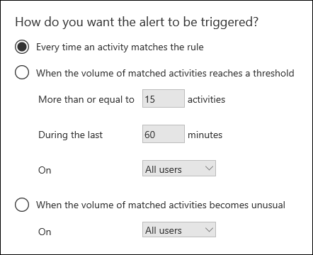
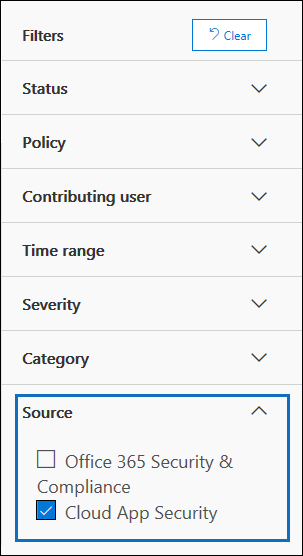

# <a name="alert-policies-in-the-office-365-security-amp-compliance-center"></a>Предупреждения политики безопасности Office 365 &amp; центре соответствия требованиям

Можно использовать новую политику оповещения и оповещения панели мониторинга средства безопасности Office 365 &amp; центре соответствия требованиям для создания политик и затем просматривать оповещения, которые создаются при выполнении пользователем действия, которые соответствуют условиям оповещения политики. Предупреждение о политиках построения о и разверните функциональность активности оповещения, предоставляя возможность распределения по категориям оповещения политики, применить политику ко всем пользователям в вашей организации, установите уровень пороговое значение для при запуске оповещения и следует ли получать электронную почту уведомления. Безопасность имеется на странице **Просмотр оповещений** &amp; оповещения о центре соответствия требованиям, где Просмотр и фильтрация набора оповещения состояния для Управление оповещениями и затем закрыть оповещений после адресованное или разрешить базовым происшествия. Мы также были развернуты тип события, которые можно создать оповещения для. Например можно создать оповещения политик для отслеживания активности вредоносных программ и происшествия потери данных. И, наконец мы также включили количество оповещений политики по умолчанию, которые помогут вам монитор, назначение прав администратора в Exchange Online, атаки вредоносных программ и нестандартный уровни удаление файлов и внешний общий доступ. 
  
> [!NOTE]
> Оповещения политики доступны для организаций с Office 365 корпоративный или Office 365 "мне Нравится" для государственных организаций E1/G1, E3/G3 или E5/G5 подписки. Тем не менее некоторых расширенных возможностей доступна только для организаций с подпиской E5/G5 или для организаций, имеющих E1/G1 или E3/G3 подписки и дополнительный компонент подписки на анализ угроз Office 365 или расширенный соответствия Office 365. В этом разделе будет выделена функциональные возможности, которому требуется E5/G5 или дополнительный компонент подписки. Также Обратите внимание, что политик доступны в Office 365 GCC, GCC высокой и сред государственных обороны США.
  
## <a name="how-alert-policies-work"></a>Как оповещения рабочие политики

Ниже приведен краткий обзор работы, как оповещения политик и оповещения, которые являются триггеров, когда пользователь или администратор активности соответствуют условиям оповещения политики.
  

  
1. Администратор в вашей организации создает, настраивает и включает оповещения политики с помощью страницы **политик** безопасности &amp; центре соответствия требованиям. Можно также создать оповещения политик с помощью командлета **New-ProtectionAlert** в PowerShell. 
    
2. Пользователь выполняет действия, который соответствует условиям оповещения политики. В случае атаки вредоносных программ сообщений зараженные электронной почты для пользователей в вашей организации будет запустить оповещение.
    
3. Office 365 позволяет создавать оповещения, который отображается на странице **Просмотр оповещений** в безопасности &amp; центре соответствия требованиям. Кроме того Включение уведомлений по электронной почте оповещения политики Office 365 отправляет уведомление о списка получателей. 
    
4. Администратор управляет оповещения в безопасности &amp; центре соответствия требованиям. Управление оповещениями состоит из назначение статус оповещения для отслеживания и управления любого исследования.
    

  
## <a name="alert-policy-settings"></a>Параметры политики оповещений

Оповещения политики состоит из набора правил и условия, которые определяют пользователя или действия администратора, который будет создавать оповещения, список пользователей, которым будет запускать оповещение, если они выполняются действия, и имеет пороговое значение, которое определяет, сколько раз действия перед n оповещения. Вы также классификации политики и назначьте ему уровень серьезности. Эти два параметра помогают управлять политик (и оповещения, которые запускаются при совпадении условия политики) так, как можно отфильтровать эти параметры при Управление политиками и просмотра оповещений в системы &amp; центре соответствия требованиям. Например можно просмотреть оповещений, которые соответствуют условиям, из одной категории или Просмотр оповещений такой же уровень серьезности.
  
Для просмотра и создания политик, перейдите на **оповещения** \> **политик** безопасности &amp; центре соответствия требованиям. 
  

  
Оповещения политика состоит из следующих параметров и условия.
  
- **Отслеживание активности оповещение** - создать политику для отслеживания деятельности или в некоторых случаях несколько связанных действий, такие общего доступа в файл с помощью внешних пользователей, общий доступ к ней, назначение разрешений на доступ или создание анонимных ссылок. Когда пользователь выполняет действия, определенные политикой, оповещение создается на основе параметров оповещений пороговое значение.
    
    > [!NOTE]
    > Действия, которые можно отслеживать зависят от вашей организации Office 365 корпоративный или Office 365 "мне Нравится" государственных плана. Как правило действия, связанные с кампании вредоносных программ и фишинга или их версии требуется подписка на E5/G5 подписка на E1/G1 или E3/G3 с подпиской анализ угроз дополнительный компонент. 
  
- **Условия для действий** - для большинства действий, можно определить дополнительные условия, которые должны быть выполнены для оповещения включение. Общие условия включают IP addresses (так, что оповещение запускается, когда пользователь выполняет действия на компьютере с указанного IP-адреса или диапазона IP-адресов), ли оповещение запускается, если одного или нескольких пользователей выполнять действия и является ли действие выполняется на определенное имя файла или URL-адрес. Можно также настроить условие, которое запускает оповещение, когда действие выполняется любым пользователем в вашей организации. Обратите внимание на то, что доступные условия зависят от выбранного действия.
    
- **При запуске оповещения** - можно настроить параметр, который определяет, как часто активности может достигаться до запуска оповещения. Это позволяет настроить политику для создания оповещения каждый раз, когда действие соответствует условиям политики, при превышении порогового или вхождение операции, к которой отслеживания оповещение становится нестандартный для вашей организации. 
    
    
  
    Если выбран этот параметр, основываясь на необычных мероприятий, Office 365 устанавливает базовое значение, которое определяет обычное частота для выбранного действия; требуется для установки базового плана, во время которого оповещения не будут создаваться до 7 дней. После установки базового запускаться частота действия, отслеживаемых оповещения политикой значительно превышает значение базового оповещение. Для действий, связанных с аудитом (например, файлов и папок действия), можно установить базовые показатели по одному пользователю или на всех пользователей в вашей организации; для действий, связанных с вредоносных программ можно установить базовые показатели на основе одного вредоносных программ семейства, отдельного получателя или все сообщения в организации.
    
    > [!NOTE]
    > Возможность настройки оповещения политик на основании порогового значения или на основании необычных мероприятий требуется подписка E5/G5 или E1/G1 или E3/G3 с анализ угроз или подписка дополнительный компонент дополнительные соответствия. Организации с подпиской E1/G1 и E3/G3 только могут создавать оповещения политики, где оповещение запускается каждый раз, выполняемое действие. 
  
- **Оповещения категории** - для отслеживания и управления предупреждениями, созданных функцией политику, можно назначить один из следующих категорий в политику.
    
  - Управление данными
    
  - Защита от потери данных

  - Поток обработки почты
    
  - Разрешения
    
  - Управление угрозами
    
  - Другие
    
  В случае действие, которое соответствует условиям оповещения политики оповещения, которое создается помеченным категории, определенные в этот параметр. Это позволяет для отслеживания и управления оповещения, которые одной категории, установка на странице **просмотра предупреждений** в центре соответствия требованиям & безопасности, так как можно сортировать и оповещения о фильтрах по категории. 
    
- **Классификация оповещений** - следующий категорию оповещения нужно назначить атрибут уровень серьезности ( **низкий**, **Средний**или **высокий**) политик. Следующий категорию оповещения в случае действие, которое соответствует условиям оповещения политики оповещения, которое создается помеченным уровень серьезности, заданное для оповещения политики. Опять же это дает возможность отслеживания и управления оповещения, которые имеют один и тот же параметр уровень серьезности на странице **Просмотр оповещений** . Например можно отфильтровать список предупреждений, чтобы отображались только оповещения о с **высокой** степенью серьезности. 
    
    > [!TIP]
    > При настройке оповещения политики, примите во внимание назначение высокий уровень серьезности для действий, которые могут привести к важности отрицательных последствий, таких как обнаружение вредоносных программ после доставки для пользователей, просмотр засекреченные или конфиденциальные данные, общий доступ к данным с внешними пользователями или других действий, которые могут привести к угроз безопасности или потери данных. Это помогает определять приоритеты оповещения и действия, которые времени для изучения и устранения причинами. 
  
- **Уведомления по электронной почте** - можно настроить политики, чтобы уведомления по электронной почте (или отправки не отправляются) со списком пользователей при запуске оповещения. Также можно задать ограничение ежедневных уведомлений таким образом, когда достигнут максимальное количество уведомлений, не более уведомления отправляются оповещения во время дня. В дополнительных к электронной почте уведомления, вы или другим администраторам можно просмотреть оповещения, которые запускаются с помощью политики на странице **Просмотр оповещений** . Можно включить уведомления по электронной почте оповещения политик для конкретной категории или, у которых выше параметр уровень серьезности. 
  
## <a name="default-alert-policies"></a>Оповещения политики по умолчанию

Office 365 предоставляет встроенные политик, которые помогают определить о нарушении разрешения администратора Exchange, активности вредоносных программ и данных управления рисками. На странице **политик** имя эти встроенные политики, набранные жирным шрифтом и тип политики определен как **системы**. Эти политики включены по умолчанию. Можно отключить эти политики (или обратно на), настройте список получателей для отправки уведомлений по электронной почте для и задать ограничение ежедневных уведомлений. Невозможно изменить другие параметры для этих политик.
  
В следующей таблице приведены и описаны доступные по умолчанию политик и указывает, планы Office 365 для предприятия и Office 365 "мне Нравится" государственных организаций, необходимые для каждой из них. Обратите внимание, что некоторые оповещения политики по умолчанию доступны, если ваша организация имеет соответствующий дополнительный компонент подписки в дополнение к E1/G1 или E3/G3 подписки. 
  
|**Оповещения политики по умолчанию**|**Описание**|**Корпоративной подписки Office 365**|
|:-----|:-----|:-----|
|**Создание правила переадресации/перенаправления** <br/> |Создавать оповещения, когда кто-то в вашей организации создает правило папки "Входящие" для своего почтового ящика, который перенаправляет или будет перенаправлять сообщения, в другую учетную запись электронной почты. Эта политика отслеживает только правила папки «Входящие», созданные с помощью Outlook Web App или Exchange Online PowerShell. Эта политика установлено значение **низкий** уровень серьезности. Дополнительные сведения, с помощью правила папки «Входящие» для пересылки и перенаправление электронной почты в Outlook Web App можно [использовать правила в Outlook Web App для автоматической пересылки сообщений в другую учетную запись](https://support.office.com/article/1433e3a0-7fb0-4999-b536-50e05cb67fed).<br/> |E1/G1, E3/G3 или E5/G5  <br/> |
|**Поиск обнаружения электронных данных работы или экспортируемые** <br/> |Создавать оповещения, когда кто-то использует средство поиска контента в центре соответствия требованиям & безопасности. Оповещение запускается при выполнении следующих операций поиска контента:<br/><br/>Работы • поиска контента<br/>• Требуется экспортировать результаты поиска контента<br/>• Экспорте поиска контента<br/><br/>Оповещения также являются trigged при выполнении предыдущего действия контента поиска в сочетании с вариантом eDiscovery. Эта политика установлено значение **Средний** уровень серьезности. Дополнительные сведения об операциях поиска контента [поиска для обнаружения электронных данных действий в Office 365 журнал аудита](search-for-ediscovery-activities-in-the-audit-log.md#ediscovery-activities)см.<br/> |E1/G1, E3/G3 или E5/G5  <br/> |
|**Несанкционированное получение прав администратора Exchange** <br/> |Создавать оповещения, когда кто-то назначен прав администратора в организации Exchange Online; При добавлении пользователя к роли руководителя организации объединить, например, в Exchange Online. Эта политика установлено значение **низкий** уровень серьезности.<br/> |E1/G1, E3/G3 или E5/G5  <br/> |
|**Отложенных сообщений** <br/> |Создавать оповещения, если Office 365 не удается доставить сообщения электронной почты для локальной организации или партнер серверов с помощью соединитель. Если это произойти сообщение помещается в очередь в Office 365. В этом оповещения при наличии 2 000 сообщений или больше, были поставлены в очередь для больше часа. Эта политика установлено значение **высокий** уровень серьезности.<br/> |E1/G1, E3/G3 или E5/G5  <br/> |
|**Кампании вредоносных программ, обнаруженных после доставки** <br/> |Создавать оповещения, если слишком большое количество сообщений, содержащих вредоносных программ доставляются в почтовые ящики в вашей организации. Если это событие происходит, Office 365 удаляет зараженных сообщений из почтовых ящиков Exchange Online. Эта политика установлено значение **высокий** уровень серьезности.<br/> |Дополнительный компонент подписки E5/G5 или анализ угроз Office 365  <br/> |
|**Кампании вредоносные программы обнаружены и заблокированные** <br/> |Создавать оповещения, когда кто-то пытается отправить слишком большое количество сообщений электронной почты, содержащий тип вредоносных программ для пользователей в вашей организации. Если это событие происходит, зараженных сообщений блокирует Office 365 и не удается доставить к почтовым ящикам. Эта политика установлено значение **низкий** уровень серьезности.<br/> |Дополнительный компонент подписки E5/G5 или анализ угроз Office 365  <br/> |
|**Кампании вредоносных программ, обнаруженных в SharePoint и OneDrive** <br/> |Оповещение создается при обнаружении слишком большой объем вирусов или вредоносных программ в файлы, расположенные в сайтах SharePoint или учетные записи OneDrive в вашей организации. Эта политика установлено значение **высокий** уровень серьезности.<br/> |Дополнительный компонент подписки E5/G5 или анализ угроз Office 365  <br/> |
|**Обработка файлов нестандартный внешних пользователей** <br/> |Оповещение создается при обычно большое число действий над файлов в SharePoint или OneDrive пользователей, не принадлежащих вашей организации. Этот компонент включает различные задачи, например доступа к файлам, загрузку файлов и удаление файлов. Эта политика установлено значение **высокий** уровень серьезности.<br/> |E5/G5 или анализ угроз Office 365 или дополнительные соответствия дополнительный компонент подписки  <br/> |
|**Нестандартный объем внешний общий доступ к файлам** <br/> |Создавать оповещения, если обычно большое число файлов в SharePoint или OneDrive совместно с пользователями не из вашей организации. Эта политика установлено значение **Средний** уровень серьезности.<br/> |E5/G5 или анализ угроз Office 365 или дополнительные соответствия дополнительный компонент подписки  <br/> |
|**Нестандартный тома удаление файлов** <br/> |При удалении слишком большое количество файлов в SharePoint или OneDrive в промежуток времени short позволяет создавать оповещения. Эта политика установлено значение **Средний** уровень серьезности.<br/> |E5/G5 или анализ угроз Office 365 или дополнительные соответствия дополнительный компонент подписки  <br/> |
|**Нестандартный увеличение как ловят электронной почты** <br/> |Создавать оповещения, если существует значительное увеличение количества пользователей в вашей организации, с помощью надстройки сообщение в Outlook для вывода сообщений как фишинга почты. Эта политика установлено значение **высокий** уровень серьезности. Дополнительные сведения об этом надстройки Изучите [использовать надстройки сообщения отчета](https://support.office.com/article/b5caa9f1-cdf3-4443-af8c-ff724ea719d2).<br/> |Дополнительный компонент подписки E5/G5 или анализ угроз Office 365  <br/> |
   
Обратите внимание на то, что необычных мероприятий контактным лицом некоторые из встроенных политик основана на тот же самый процесс как порог оповещений задание, которое было описано выше. Office 365 устанавливает базовое значение, которое определяет обычное частота для действия «обычный». Оповещения запускаются затем при частоту выполнения действий, отслеживаемых встроенной политики оповещения значительно превышает значение базового.
 
## <a name="viewing-alerts"></a>Просмотр предупреждений

Когда действие выполнять пользователям в организации соответствуют параметрам оповещения политики, оповещение создается и отображается на странице **Просмотр оповещений** в безопасности &amp; центре соответствия требованиям. В зависимости от параметров политики почтовых оповещения уведомления по электронной почте также отправляется списка указанных пользователей при запуске оповещения. Для каждого оповещения панели мониторинга на странице " **Просмотр оповещений** " имя соответствующего оповещения политики, уровень серьезности и категории для оповещения (заданных в политике оповещения) и количество отправок действия, которые привели к оповещения создан; Это значение основано на порога оповещения политики. Панели мониторинга также отображаются сведения о состоянии для каждого оповещения. Дополнительные сведения об использовании свойство состояние для управления оповещения в разделе [Управление оповещениями](#managing-alerts) . 
  
Для просмотра предупреждений, перейдите на **оповещения** \> **Просмотр оповещений** в безопасности &amp; центре соответствия требованиям. 
  

  
Можно использовать следующие фильтры для просмотра подмножества все оповещения на странице **Просмотр оповещений** . 
  
- **Состояние** — используйте этот фильтр для отображения предупреждений, для которых определенное состояние; состояние по умолчанию является **активным**. Вы или другим администраторам можно изменить значение состояния.
    
- **Политики** — используйте этот фильтр для отображения предупреждений, соответствующие значения одного или нескольких политик. Или можно просто вывести все оповещения для всех политик.
    
- **Диапазон времени** — используйте этот фильтр для отображения оповещений, созданных в определенную дату и время диапазона.
    
- **Уровень серьезности** — используйте этот фильтр для отображения оповещений, назначенные определенным уровень серьезности.
    
- **Категории** - используйте этот фильтр для отображения предупреждений из одной или нескольких категорий оповещения.

- **Источник** — используйте этот фильтр для отображения предупреждений, вызванные политик в центре соответствия требованиям & безопасности или активированных политик безопасности приложения Office 365 облака или оба предупреждений. Дополнительные сведения о безопасности приложения Office 365 облачных оповещений [Просмотр безопасности приложения облачных оповещения](#viewing-cloud-app-security-alerts) см.

### <a name="rbac-permissions-required-to-view-alerts"></a>Разрешения RBAC, необходимые для просмотра предупреждений

> [!NOTE]
> Функциональные возможности, описанные в этом разделе будут развернуты для организаций, начиная с 20 февраля 2019 и будут создаваться в конце марта 2019 по всему миру.

Элемент управления доступа системы счисления ролей (RBAC) разрешений, назначенных для пользователей в вашей организации определяет, какие оповещения, пользователи могут просматривать на странице **просмотра предупреждений** . Как это осуществляется? Роли управления, назначенных для пользователей (на основании их участия в группах ролей в центре соответствия требованиям & безопасности) определить, какие оповещения категорий, позволяют пользователям просматривать на странице **просмотра предупреждений** . Вот несколько примеров:

- Участники группы ролей управления записями можно просмотреть только оповещения, создаваемых политик, назначенных категории **управления данными** .
- Участники группы ролей администратора соответствия не могут просматривать оповещения, создаваемых политик, назначенных категории **Threat management** . 
- Членов группы ролей диспетчер обнаружения электронных данных не могут просматривать все оповещения, так как нет назначенные роли предоставить разрешение для просмотра предупреждений из любой категории предупреждений.

В этом структуры (в зависимости от разрешений RBAC) позволяет определить, какие оповещения можно просматривать (и управляемые) пользователями в отдельных ролях заданий в вашей организации. 

Ниже перечислены роли, которые необходимы для просмотра предупреждений из 6 различные категории оповещения. Первый столбец в таблицах перечислены все роли центре соответствия требованиям & безопасности.  Установленный флажок указывает, что пользователи, которым назначена роль можно просмотреть оповещения от соответствующей категории предупреждений, отображается в верхней строке.

|<br/>|Управление данными|Защита от потери данных|Поток обработки почты|Разрешения|Управление угрозами|Другие | 
|:---------|:---------:|:---------:|:---------:|:---------:|:---------:|:---------:|
|Журналы аудита <br/> |         ||         |         |         |         |
|Управление делами <br/>|         |         |         |         |         |         |
|Администратор соответствия требованиям<br/>|| |||         ||
|Поиск соответствия<br/>|         |         |         |         |         |         |
|Управление устройствами<br/>|         |         |         |         |         |         |
|Управление ликвидации<br/>|         |         |         |         |         |         |
|Управление соответствием требованиям защиты от потери данных<br/>|         ||         |         |         |         |
|Экспорт<br/>|         |         |         |         |         |         |
|Хранение<br/>|         |         |         |         |         |         |
|Управление оповещениями<br/>|         |         |         |         |         ||
|Конфигурация организации|         |         |         |         |         ||
|Предварительный просмотр <br/>|         |         |         |         |         |         |
|Управление записями <br/>||         |         |         |         |         |
|Управление хранением <br/>| |         |         |         |         |         |
|проверка; <br/>|         |         |         |         |         |         |
|Расшифровка службы управления правами<br/>|         |         |         |         |         |         |
|Управление ролями<br/>|         |         |         ||         |         |
|Поиск и удаление<br/>|         |         |         |         |         |         |
|администратор безопасности (Security Administrator).<br/>||| | | ||
|Средство чтения безопасности<br/>|         || | | |
|Просмотр службы Software Assurance<br/>|         |         |         |         |         |         |
|Контролирующий Review администратора<br/>|         |         |         |         |         |         |
|Журналы аудита только для просмотра<br/>|         |         |         |         |         |         |
|Управление устройствами только для просмотра<br/>|         |         |         |         |         |         |
|Управление соответствием требованиям защиты от потери данных только для просмотра<br/>|         ||         |         |         |         |
|Только для просмотра Управление оповещениями<br/>|         |         |         |         |         ||
|Получатели только для чтения<br/>|         |         |         |         ||         |
|Управление только для просмотра записей<br/>||         |         |         |         |         |
|Управление хранением только для просмотра<br/>||         |         |         |         |         |
|         |         |         |         |         |         |

**Совет:** Чтобы просмотреть роли, назначенные для каждого из группы ролей по умолчанию, выполните следующие команды в безопасности & PowerShell центр соответствия требованиям: 

```
$RoleGroups = Get-RoleGroup

$RoleGroups | foreach {Write-Output -InputObject `r`n,$_.Name,"-----------------------"; Get-RoleGroup $_.Identity | Select-Object -ExpandProperty Roles}
```
Можно также просмотреть роли, назначенные в группу ролей в центре соответствия требованиям & безопасности. Перейдите на страницу " **разрешения** " и выберите группу ролей. На странице всплывающего указаны назначенные роли.


## <a name="managing-alerts"></a>Управление оповещениями

После оповещения создается и отображается на странице **Просмотр оповещений** в безопасности &amp; центре соответствия требованиям, можно рассмотреть, исследовать и устраните их. Ниже приведены некоторые задачи, которые можно выполнить для управления оповещения. 
  
- **Назначение состояние оповещений** - можно назначить один из следующих статусов оповещения: **Active** (значение по умолчанию), **Investigating**, **разрешено**или **Dismissed**. Затем можно отфильтровать этот параметр для отображения предупреждений с один и тот же параметр состояния. Этот параметр состояния отслеживания процесса управления предупреждениями.
    
- **Просмотр подробных сведений о оповещения** - щелкните оповещение для отображения страницы всплывающее окно с сведения об оповещении. Подробные сведения о зависит от соответствующих политик предупреждений, но оно обычно включает в себя следующие: имя текущей операции, вызвавшего оповещение (например, командлет), описание действия, инициирующую оповещения пользователя (или список пользователей) пользователей, которые запускаются оповещение, и имя (и ссылка на) соответствующего предупреждения политики.
    
  - Имя текущей операции, вызвавшего оповещение, такие как операция журнала аудита или командлета.
    
  - Описание действия, вызвавшего оповещение.
    
  - Пользователь, завершивший оповещения; Это только для политик, настроенных для отслеживания отдельному пользователю или отдельного действия.
    
  - Сколько раз действия под контролем оповещение было выполнено. Обратите внимание, что этот номер может не соответствует, фактическое число связанных с ними оповещения, указано на странице оповещений представления, так как дополнительные оповещения было запущено.
    
  - Ссылка на список действий, включающий элемент для каждого действия, которое было выполнено, вызвавшего оповещение. Каждая запись в этом списке указывает время возникновения действия, имя текущей операции (например, «FileDeleted») и пользователя, выполнившего действия, объект (например, файл, вариантом eDiscovery или почтовый ящик), выполняемого действия и IP-адресов адрес компьютера пользователя. Наличие вредоносных программ, связанных с оповещениями, в этом ссылки на список сообщений.
    
  - Имя (и ссылка на) соответствующие политики оповещения.
    
- **Отмена уведомлений по электронной почте** - можно отключить (или отключить) уведомления по электронной почте на странице всплывающего для оповещения. При отключении уведомлений по электронной почте, Office 365 не будет отправлять уведомления при действий или событий, соответствующие условиям политики оповещения. Тем не менее оповещения останется триггер при действий, выполняемых пользователями соответствуют условиям оповещения политики. Можно также отключить уведомления по электронной почте, изменение политик предупреждений.
    
- **Разрешение оповещений** - оповещение можно пометить как разрешенные на странице всплывающего оповещения (который устанавливает состояние предупреждения **разрешено**). Если изменить фильтр, возможности разрешения оповещений не отображаются на странице **Просмотр оповещений** . 
    
## <a name="viewing-cloud-app-security-alerts"></a>Просмотр оповещение системы безопасности облачных приложений
  
Оповещения, активируемые политик безопасности Office 365 облаке приложения отображаются на странице **Просмотр оповещений** в центре соответствия требованиям & безопасности. Этот компонент включает оповещения, активируемые активности политик и оповещения, активируемые политик обнаружения неполадок в облаке приложения Office 365 безопасности. Это означает, что вы можете просмотреть все оповещения в центре соответствия требованиям & безопасности. Обратите внимание, что безопасности приложения Office 365 облаке доступна только для организаций с Office 365 корпоративный E5 или Office 365 "мне Нравится" государственных G5 подписки. Для получения дополнительных сведений см [Overview of Office 365 облачных безопасности приложения](office-365-cas-overview.md).

Кроме того организациями, которые имеют безопасности приложения Microsoft Cloud в рамках предприятия мобильности + подписки E5 безопасности или как автономную службу можно также просмотреть оповещение системы безопасности приложения облаке, связанные с приложениями Office 365 и службами в & безопасности Центр соответствия.

Для отображения только оповещения о безопасности приложения облака в центре соответствия требованиям & безопасности, используйте фильтр **источника** и выберите **Безопасность приложения в облаке**.



Как и оповещение, вызванные & безопасности оповещения политики центре соответствия требованиям, можно нажать кнопку предупреждение системы безопасности облачных приложений для отображения страницы всплывающее окно с сведения об оповещении. Оповещение включает в себя ссылку для просмотра сведений и управление ими оповещения в облаке безопасности приложения портала и ссылка на соответствующую политику безопасности приложения в облаке, вызвавшего оповещение. В разделе [Review и take действие на оповещения в облаке приложения Office 365 безопасности](review-office-365-cas-alerts.md).


> [!IMPORTANT]
> Изменение состояния предупреждение системы безопасности облаке приложения в центре соответствия требованиям & безопасности не обновить состояние решение для одной оповещения на портале облачных безопасности приложения. Например если состояние предупреждения пометить как **разрешено** в центре соответствия требованиям & безопасности, состояние предупреждения на портале облачных безопасности приложения не изменяется. Чтобы разрешить или закрыть предупреждение системы безопасности облачных приложений, управление оповещение о портале облачных безопасности приложения.