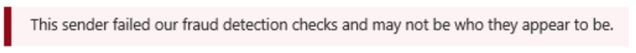
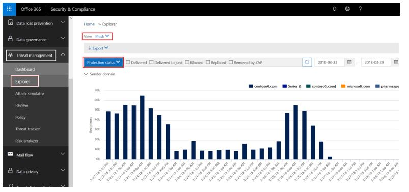
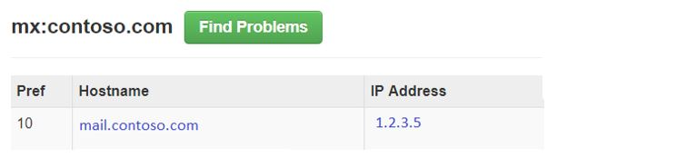

# <a name="anti-spoofing-protection-in-office-365"></a>Защита от спуфинга в Office 365

В этой статье объясняется, как Office 365 борется с фишинговыми атаками, которые используют фальшивые домены отправителя, то есть домены, которые подверглись спуфингу. Эта задача выполняется с помощью анализа и блокировки тех, которые не могут пройти проверку подлинности с помощью стандартных методов аутентификации с помощью электронной почты и с помощью техник репутации отправителя. Это изменение было реализовано, чтобы уменьшить число фишинговых атак на организаций, использующие Office 365.
  
В этой статье также объясняется, почему было внесено это изменение, как клиенты могут подготовиться к этому изменению, как просматривать сообщения, на которые повлияет это изменение, как отправлять отчет о сообщениях, как устранять ложные срабатывания, а также как отправители в корпорацию Майкрософт должны готовиться к этому изменению.
  
Технология защиты от спуфинга корпорации Майкрософт изначально была применена для организаций, которых оформили корпоративную подписку Е5 на Office 365 или приобрели для своей подписки надстройку Office 365 Advanced Threat Protection (ATP). Начиная с октября 2018 г. мы расширили защита на организаций, пользующиеся Exchange Online Protection (EOP). Кроме того, из-за способа, с помощью которого все наши фильтры учатся друг у друга, пользователи Outlook.com также могут быть затронуты изменениями.
  
## <a name="how-spoofing-is-used-in-phishing-attacks"></a>Как спуфинг используется при фишинговых атаках

Когда речь идет о защите пользователей, Майкрософт серьезно относится к угрозе фишинга. Один из методов, который спамеры и мошенники используют достаточно часто, это спуфинг, т.е. подделка отправителя, когда сообщение якобы поступает от определенного отправителя или из какого-то места, отличающихся от реального источника. Этот способ часто используются в фишинговых кампаниях, предназначенных для получения учетных данных пользователя. Технология защиты от спуфинга корпорации Майкрософт, в частности, проверяет фальсификацию элемента "От: заголовок", который отображается в почтовом клиенте, например, Outlook. Когда корпорация Майкрософт может с большой долей уверенности утверждать, что элемент "От: заголовок" подвергся спуфингу, сообщение помечается как поддельное.
  
Поддельные сообщения имеют два отрицательных качества для реальных пользователей:
  
### <a name="1-spoofed-messages-deceive-users"></a>1. Поддельные сообщения вводят пользователей в заблуждение
  
Во-первых, подделанное сообщение может обманным путем заставить пользователя нажать ссылку и предоставить свои учетные данные, скачать вредоносные программы или ответить на сообщение, передав конфиденциальные данные (последний вариант называется компрометацией рабочей почты). Например, ниже приведено фишинговое сообщение с подделанным отправителем msoutlook94@service.outlook.com.
  

  
Сообщение выше не было отправлено с адреса service.outlook.com, но вместо этого было подделано фишером, чтобы получатель подумал, что оно было отправлено с этого домена. Он пытается заставить пользователя нажать на ссылку в сообщении.
  
Следующий пример - спуфинг contoso.com:
  

  
Сообщение выглядит нормальным, но на самом деле это подделка. Это фишинговое сообщение представляет собой тип компрометации рабочей почты, которая является подкатегорией фишинга.

### <a name="2-users-confuse-real-messages-for-fake-ones"></a>2. Пользователям могут спутать реальные сообщения с поддельными
  
Во-вторых, поддельные сообщения создают неопределенность для пользователей, которые знают о фишинговых сообщениях, но не могут увидеть разницу между реальным сообщением и подделанным. Например, ниже приведен пример запроса на сброс действующего пароля, полученный с адреса электронной почты учетной записи Microsoft Security.
  

  
Сообщение выше было отправлено корпорацией Майкрософт, но в то же самое время пользователи часто получают фишинговые сообщения, которые могут обманным путем заставить пользователя нажать ссылку и предоставить свои учетные данные, скачать вредоносные программы или ответить на сообщение с конфиденциальным содержанием. Так как достаточно сложно понять разницу между реальным запросом на смену пароля и поддельным запросом, многие пользователи игнорируют эти сообщения, помечают их как спам или без надобности отправляют сообщения обратно в корпорацию Майкрософт, помечая их как пропущенные фишинговые сообщения.

Чтобы остановить спуфинг, индустрия фильтрации электронной почты разработала протоколы проверки подлинности электронной почты, такие как [SPF](https://docs.microsoft.com/office365/SecurityCompliance/set-up-spf-in-office-365-to-help-prevent-spoofing), [DKIM](https://docs.microsoft.com/office365/SecurityCompliance/use-dkim-to-validate-outbound-email) и [DMARC](https://docs.microsoft.com/office365/SecurityCompliance/use-dmarc-to-validate-email). DMARC предотвращает подделку отправителя сообщения — того, кого пользователь видит в своем почтовом клиенте (в приведенных выше примерах это service.outlook.com, outlook.com и accountprotection.microsoft.com) — с помощью домена, который передается SPF или DKIM. Домен, который видит пользователь, проходит аутентификацию, а значит, не был подделан. Более подробное обсуждение см. в разделе *Почему проверки подлинности электронной почты не всегда достаточно для предотвращения спуфинга* ниже в этой статье.
  
Однако проблема состоит в том, что запись аутентификации электронной почты выполняется по желанию и не имеет обязательный характер. Таким образом, хотя домены с надежными политиками проверки подлинности, например, microsoft.com и skype.com, защищены от спуфинга, домены, которые используют менее надежные политики проверки подлинности, либо вообще не имеющие никакой специальной политики, являются целями для спуфинга. Начиная с марта 2018 г только 9% доменов компаний из списка Fortune 500 опубликовали строгие политики проверки подлинности электронной почты. Оставшийся 91% может подвергаться подделыванию фишером, и если фильтр почты не обнаруживает подделку с помощью другой политики, такие письма могут быть получены обычным пользователем и ввести его в заблуждение:
  

  
Доля компаний малого и среднего бизнеса, не входящих в список Fortune 500, которая опубликовала строгие политики проверки подлинности электронной почты, небольшая, и снижается для доменов, которые находятся за пределами Северной Америки и Западной Европы.
  
Это большая проблема, так как предприятие может не иметь четкого представления о том, как работает электронная почта, в то время как мошенники отлично это знают и могут воспользоваться недостатками знаний.
  
Сведения о настройке SPF, DKIM и DMARC см. в разделе *Клиенты Office 365* ниже в этом документе. 
  
## <a name="stopping-spoofing-with-implicit-email-authentication"></a>Прекращение спуфинга с помощью неявной проверки подлинности электронной почты

Так как фишинг и направленный фишинг — это огромная проблема, а также из-за ограниченного внедрения политик проверки подлинности электронной почты, корпорация Майкрософт по-прежнему инвестирует в средства для защиты своих клиентов. Таким образом, корпорация Майкрософт выступает в роли лидера с *неявной проверкой подлинности электронной почты* — если домен не прошел проверку подлинности, Майкрософт будет воспринимать его так, как если бы он имел опубликованные записи для проверки подлинности электронной почты и соответствующим образом обращаться с ним, если проверки не были пройдены успешно. 
  
Для выполнения этой задачи корпорация Майкрософт создала множество расширений для обычной аутентификации электронной почты, включая репутацию отправителя, история переписки отправителю и получателя, поведенческий анализ и другие продвинутые техники. Сообщение, отправленное с домена, который не публикует данные для проверки подлинности электронной почты, помечается как поддельное, если оно не содержит другие сигналы, подтверждающие его подлинность.
  
Благодаря этому конечные пользователи могут быть уверены, что сообщения, отправленные в их адрес, не были подделаны, а отправители могут быть уверены в том, что никто не будет подделывать их домен, а клиенты Office 365 могут пользоваться дополнительной защитой, например, защитой от подмены.
  
Общие извещение корпорации Майкрософт см. в статье [Море фишинга, часть 2 - Улучшенные средство борьбы со спуфингом в Office 365](https://techcommunity.microsoft.com/t5/Security-Privacy-and-Compliance/Schooling-A-Sea-of-Phish-Part-2-Enhanced-Anti-spoofing/ba-p/176209).
  
## <a name="identifying-that-a-message-is-classified-as-spoofed"></a>Определение того, что то сообщения было признано поддельным

### <a name="composite-authentication"></a>Многофакторная аутентификация

Хотя SPF, DKIM и DMARC полезны сами по себе, они не позволяют сообщить о достаточности проверки подлинности в случае, если в сообщении не содержится записей о явной проверке подлинности. В результате корпорация Майкрософт разработала алгоритм, который объединяет несколько сигналов в одно значение, которое называется многофакторной аутентификацией (compauth). Клиенты в Office 365 могут просмотреть значения compauth в заголовке *Результаты проверки подлинности* в заголовках сообщений. 
  
```
Authentication-Results:
  compauth=<fail|pass|softpass|none> reason=<yyy>

```

|**Результат CompAuth**|**Описание**|
|:-----|:-----|
|сбой|Сообщению не удалось пройти явную проверку подлинности (отправка с домена, публикующего записи, явным образом в систему DNS) или неявную проверку подлинности (отправка с домена, который не публикует записи, в систему DNS, чтобы Office 365 мог интерполировать результат так, как если бы записи были опубликованы).|
|успешно|Сообщению удалось пройти явную проверку подлинности (сообщение прошло DMARC или [лучшее предложение прошло DMARC](https://blogs.msdn.microsoft.com/tzink/2015/05/06/what-is-dmarc-bestguesspass-in-office-365)) или неявную проверку подлинности с высокой вероятностью (отправка с домена, который не публикует записи, но у Office 365 есть надежные внутренние сигналы, говорящие о том, что сообщение подлинное).|
|частично успешно|Сообщение прошло неявную проверки подлинности с низкой или средней уверенностью (отправка с домена, которые не публикует проверку подлинности электронной почты, но у Office 365 есть внутренние сигналы, говорящие о том, что сообщение подлинное, хотя надежность таких сигналов невысокая).|
|нет|Сообщение не прошло проверку подлинности (или прошло проверку подлинности, но не отвечает требованиям), но многофакторная аутентификация не применяется из-за репутации отправителя или других факторов.|
   
|||
|:-----|:-----|
|**Причина**|**Описание**|
|0xx|Сообщению не удалось пройти многофакторную аутентификацию<br/>**000** означает, что сообщению не удалось пройти DMARC, а сообщение было отклонено или отправлено на карантин.  <br/>**001** означает, что сообщению не удалось пройти неявную проверку подлинности электронной почты. Это означает, что домена отправителя не имеет опубликованные записи для проверки подлинности электронной почты, либо, если они присутствуют, применялась мягкая политика проверки (SPF – мягкий сбой или нейтральный ответ, политика DMARC p=none).  <br/>**002** означает, что у организации есть политика для пары отправитель/домен, которая явным образом запрещает отправку подделанных электронных сообщений, а этот параметр вручную настроен администратором.  <br/>**010** означает, что сообщению не удалось пройти проверку DMARC, оно было отклонено или отправлено в карантин, а домен отправителя является одним из одобренных вашей организацией доменов (это так называемый спуфинг внутри организации).  <br/>**011** означает, что сообщению не удалось пройти проверку DMARC, оно было отклонено или отправлено в карантин, а домен отправителя является одним из одобренных вашей организацией доменов (это так называемый спуфинг внутри организации).|
|Другие коды (1xx, 2xx, 3xx, 4xx, 5xx)|Соответствуют различным внутренним кодам, информирующим о том, почему сообщение прошло неявные проверки подлинности, или осталось без проверки подлинности, но не было применено никаких действий.|
   
Если посмотреть на заголовки сообщения, администратор или даже обычный пользователь может определить, как Office 365 пришел к выводу, что отправитель может быть подделан.
  
### <a name="differentiating-between-different-types-of-spoofing"></a>Различия между разными типами спуфинга

Корпорация Майкрософт выделяет два разных типа спуфинга сообщений:
  
 **Спуфинг внутри организации**
  
Также известный как внутренний спуфинг, он наблюдается, когда домен в строке От: адрес совпадает или согласуется с доменом получателя (если домен получателя — один из [Одобренных доменов](https://technet.microsoft.com/ru-RU/library/jj945194%28v=exchg.150%29.aspx) организации); или, если домен в От: адрес принадлежит одной организации.
  
Например, ниже у отправителя и получателя один и тот же домен (contoso.com). Пробелы вставляются в адрес электронной почты для предотвращения сбора данных спамботом на этой странице):
  
От: отправитель @ contoso.com
  
Кому: получатель @ contoso.com 
  
Ниже указаны домены отправителя и получателя, совпадающие с доменом организации (fabrikam.com).
  
От: отправитель @ foo.fabrikam.com
  
Кому: получатель @ bar.fabrikam.com
  
Ниже домены отправителя и получателя отличаются (microsoft.com и поисковая система bing.com), но они относятся к одной и той же организации (то есть оба являются частью одообренных организацией доменов):
  
От: отправитель @ microsoft.com
  
Кому: получатель @ поисковой системой bing.com
  
Сообщения, которые не прошло проверку на внутренний спуфинг, содержат указанные ниже значения в заголовках:
  
-Forefront-Antispam-Report:... CAT:SPM/HSPM/PHSH;... SFTY:9.11
  
CAT – это категория сообщения, обычно оно помечается как SPM (спам), но иногда это может быть HSPM (спам с высокой долей вероятности) или PHISH (фишинг) в зависимости от того, какие другие типы шаблонов присутствуют в сообщении.
  
SFTY — это уровень безопасности сообщения, первая цифра (от 9) означает, что это фишинговое сообщение, а второй набор цифр после точки (11) означает, что это пример спуфинга внутри организации.
  
Не существует кода определенной причины для многофакторной проверки подлинности при спуфинге внутри организации, который будет добавлен позднее в 2018 г. (точные сроки не определены).
  
 **Междоменный спуфинг**
  
Это происходит, когда домена отправителя в строке От: адрес является внешним доменом для организации получателя. Сообщения, которые не прошли многофакторную проверки подлинности из-за междоменного спуфинга, содержат следующие значения в заголовках:
  
Authentication-Results: … compauth=fail reason=000/001
  
X-Forefront-Antispam-Report: ...CAT:SPOOF;...SFTY:9.22
  
В обоих случаях следующий красный совет по безопасности проставляется в сообщении или его эквивалент, настроенный в соответствии с языком почтового ящика получателя:
  

  
Только просмотрев строку От: адрес и зная адрес почты вашего получателя, либо выполнив проверку заголовков сообщений электронной почты, вы можете выявить разницу между внутренним и междоменным спуфингом.
  
## <a name="how-customers-of-office-365-can-prepare-themselves-for-the-new-anti-spoofing-protection"></a>Как клиенты Office 365 могут подготовиться к использованию новой защиты от спуфинга

### <a name="information-for-administrators"></a>Информация для администраторов

Администратор организации, использующей Office 365, должен иметь понимание о том, что существует несколько ключевых фрагментов информации, которые следует учитывать.
  
### <a name="understanding-why-email-authentication-is-not-always-enough-to-stop-spoofing"></a>Необходимо понимать, почему проверки подлинности электронной почты не всегда достаточно для борьбы со спуфингом

Новые средства защиты от спуфинга опираются на проверку подлинности электронной почты (SPF, DKIM и DMARC), чтобы не помечать сообщения как поддельные. Типичный пример — ситуация, когда домен отправителя не имеет опубликованных записей SPF. При отсутствии записей SPF не их некорректной настройке, отправленное сообщения будет помечаться как поддельное, если только у корпорация Майкрософт не будет данных внутренние логики операций о том, что сообщение является подлинным.
  
Например, перед развертыванием защиты от спуфинга сообщение могло выглядеть как сообщение без записей SPF, записей DKIM и записей DMARC. 
  
```
Authentication-Results: spf=none (sender IP is 1.2.3.4)
  smtp.mailfrom=example.com; contoso.com; dkim=none
  (message not signed) header.d=none; contoso.com; dmarc=none
  action=none header.from=example.com;
From: sender @ example.com
To: receiver @ contoso.com
```
После развертывания защиты от спуфинга, если вы используете корпоративные версии Office 365 E5, EOP или ATP, значение compauth проставляется:
  
```
Authentication-Results: spf=none (sender IP is 1.2.3.4)
  smtp.mailfrom=example.com; contoso.com; dkim=none
  (message not signed) header.d=none; contoso.com; dmarc=none
  action=none header.from=example.com; compauth=fail reason=001
From: sender @ example.com
To: receiver @ contoso.com

```

Если example.com устраняет эту проблему, настроив запись SPF, а не запись DKIM, это могло бы позволить пройти многофакторную аутентификацию, так как домен, который передается SPF соответствует домену в строке От: адрес: 
  
```
Authentication-Results: spf=pass (sender IP is 1.2.3.4)
  smtp.mailfrom=example.com; contoso.com; dkim=none
  (message not signed) header.d=none; contoso.com; dmarc=bestguesspass
  action=none header.from=example.com; compauth=pass reason=109
From: sender @ example.com
To: receiver @ contoso.com
```

Либо, если будет настроена DKIM запись, а не запись SPF, это также позволит пройти многофакторную аутентификацию, так как домен в подписи DKIM соответствует домену в строке От: адрес: 
  
```
Authentication-Results: spf=none (sender IP is 1.2.3.4)
  smtp.mailfrom=example.com; contoso.com; dkim=pass
  (signature was verified) header.d=outbound.example.com;
  contoso.com; dmarc=bestguesspass action=none
  header.from=example.com; compauth=pass reason=109
From: sender @ example.com
To: receiver @ contoso.com
```

Тем не менее, фишер может также настроить SPF и DKIM и подписать сообщение с помощью своего домена, но указать другой домен в строке От: адрес. Ни SPF, ни DKIM не требуют, чтобы домен гармонировал с доменом в строке От: адрес, поэтому если example.com не имеет опубликованные записи DMARC, сообщение не будет помечаться как поддельное с помощью DMARC: 
  
```
Authentication-Results: spf=pass (sender IP is 5.6.7.8)
  smtp.mailfrom=maliciousDomain.com; contoso.com; dkim=pass
  (signature was verified) header.d=maliciousDomain.com;
  contoso.com; dmarc=none action=none header.from=example.com;
From: sender @ example.com
To: receiver @ contoso.com
```

В почтовом клиенте (Outlook, веб-версия Outlook или другие почтовые клиенты) отображается только строка От: домен, а не домен в SPF или DKIM, и это может ввести в заблуждение пользователя, который может подумать, что сообщение отправлено с домена example.com, но фактически оно пришло с домена maliciousDomain.com.
  

  
По этой причине Office 365 требует, чтобы домен в строке От: адрес совпадал с доменом в подписи SPF или DKIM, а если этого не произошло, домен должен содержать некоторые внутренние сигналы, которые указывают на то, что сообщение является подлинным. В противном случае сообщение не сможет пройти многофакторную аутентификацию. 
  
```
Authentication-Results: spf=none (sender IP is 5.6.7.8)
  smtp.mailfrom=maliciousDomain.com; contoso.com; dkim=pass
  (signature was verified) header.d=maliciousDomain.com;
  contoso.com; dmarc=none action=none header.from=contoso.com;
  compauth=fail reason=001
From: sender@contoso.com
To: someone@example.com
```

Таким образом, защита от спуфинга в Office 365 защищает от доменов без проверки подлинности, а также от доменов, которые настроили проверку подлинности, но не соответствуют домену в строке От: адрес, так как именно этот домен пользователь видит и полагает, что это домен отправителя сообщения. Это справедливо как для внешних для вашей организации доменов, так и для доменов в пределах организации.
  
Таким образом, если вы когда-нибудь получали сообщение, которое не прошло многофакторную аутентификацию и помечается как поддельное, даже несмотря на то, что сообщение прошло SPF и DKIM, это означает, что домен, который прошел SPF и DKIM, не совпадает с доменом в строке От: адрес.
  
### <a name="understanding-changes-in-how-spoofed-emails-are-treated"></a>Общие сведения об изменениях в обращении с поддельными сообщениями

В настоящее время для всех организаций, использующих Office 365 — ATP и не ATP — сообщения, которые не смогли пройти DMARC и отклоняются или отправляются на карантин, помечаются как спам и обычно подпадают под действие с высокой уверенность в содержании спама, или иногда под регулярное действие для нежелательной почты (в зависимости от того, определили ли другие правила для спама его в качестве нежелательной почты). В случае обнаружения спуфинга внутри организации выполняются стандартные действия для нежелательной почты. Такое поведение не нуждается в активации, а также вы не можете его отключить.
  
Тем не менее, для сообщений с междоменным спуфингом до этого изменения выполнялись стандартные проверки для спама, фишинга и вредоносных программ, и если другая часть фильтра посчитает их подозрительными, они будут помечены как спам, фишинговое сообщение или вредоносная программа соответственно. С помощью новой защиты от междоменного спуфинга для любого сообщения, которому не удается пройти проверку подлинности, по умолчанию, будут выполняться действия, определенные в политике защиты от фишинга \> спуфинга. Если политика не определена, сообщение будет перемещаться в папку с нежелательной почтой. В некоторых случаях более подозрительные сообщения также будут получать красный совет безопасности.
  
Это может привести к тому, что некоторые сообщения, которые ранее были помечены как спам, по-прежнему будут помечаться как спам, но будут также иметь красный совет по безопасности; в других случаях сообщения, которые ранее были отмечены как не являющиеся спамом, будут помечены как спам (CAT:SPOOF) с красным советом по безопасности. В других случаях клиенты, которые перемещают все помеченные как спам и фишинг сообщения в карантин, теперь увидят, что они отправляются в папку нежелательной почты (такое поведение можно изменить, см. статью [Изменение параметров защиты от спуфинга](#changing-your-anti-spoofing-settings)).
  
Существует несколько способов, с помощью которых можно подделать сообщение (см. [Различия между разными видами спуфинга](#differentiating-between-different-types-of-spoofing) выше в этой статье), но на март 2018 г. то, как Office 365 работает с такими сообщениями, еще не унифицировано. В таблице ниже представлен краткий обзор с новым поведением средства защиты от междоменного спуфинга: 
  
|**Тип спуфинга**|**Категория**|**Добавлен совет по безопасности?**|**Относится к**|
|:-----|:-----|:-----|:-----|
|Сбой DMARC (карантин или отклонение)  <br/> |HSPM (по умолчанию), также может быть SPM или PHSH  <br/> |Нет (еще нет)  <br/> |Всем клиентам Office 365, Outlook.com  <br/> |
|Внутри организации  <br/> |SPM  <br/> |Да  <br/> |Все организации, использующие Office 365, Outlook.com  <br/> |
|Междоменная  <br/> |ПОДДЕЛКА  <br/> |Да  <br/> |Продвинутая защита от угроз Office 365 и клиенты E5  <br/> |

### <a name="changing-your-anti-spoofing-settings"></a>Изменение параметров защиты от спуфинга

Чтобы создать или обновить параметры защиты от спуфинга (междоменного), перейдите в раздел Настроки защита от фишинга \> спуфинга на вкладке Управление угрозами \> Политика в Центре безопасности &amp; соответствия требованиям. Если вы еще не создали параметры защиты от фишинга, необходимо будет создать данные параметры:
  

  
Если вы уже создали политику, вы можете выбрать вашу политику и изменить ее:
  

  
Выберите политику, которую вы только что создали, и выполните все необходимые действия, описанные в разделе [Дополнительные сведения об анализе подделок](learn-about-spoof-intelligence.md).
  

  

  
Чтобы создать новую политику с помощью PowerShell: 
  
```powershell
$org = Get-OrganizationConfig
$name = "My first anti-phishing policy for " + $org.Name
# Note: The name should not exclude 64 characters, including spaces.
# If it does, you will need to pick a smaller name.
# Next, create a new anti-phishing policy with the default values
New-AntiphishPolicy -Name $Name
# Select the domains to scope it to
# Multiple domains are specified in a comma-separated list
$domains = "domain1.com, domain2.com, domain3.com"
# Next, create the anti-phishing rule, scope it to the anti-phishing rule
New-AntiphishRule -Name $name -AntiphishPolicy $name -RecipientDomainIs $domains
```

Вы можете впоследствии изменять параметры политики защиты от фишинга с помощью PowerShell, руководствуясь документацией в [Set-AntiphishPolicy](https://docs.microsoft.com/powershell/module/exchange/advanced-threat-protection/Set-AntiPhishPolicy?view=exchange-ps). Вы можете задать $name в качестве параметра:
  
```powershell
Set-AntiphishPolicy -Identity $name <fill in rest of parameters>
```

Позднее в 2018 г., вместо того чтобы создавать политику по умолчанию, она будет создана для вас и будет включать всех получателей в вашей организации, так что вам не нужно будет указывать их вручную (снимки экрана ниже поменяются перед выходом окончательной реализации).
  

  
В отличие от политики, которую вы создаете самостоятельно, вы не можете  удалить политику по умолчанию, изменить ее приоритет или выбрать, какие пользователи, домены или группы будут подпадать под ее действие.
  

  
Чтобы настроить защиту по умолчанию с помощью PowerShell:
  
```powershell
$defaultAntiphishPolicy = Get-AntiphishPolicy | ? {$_.IsDefault -eq $true}
Set-AntiphishPolicy -Identity $defaultAntiphishPolicy.Name -EnableAntispoofEnforcement <$true|$false>
```

Защиту от спуфинга следует отключить только в случае, если у вас есть другой почтовый сервер или серверы помимо Office 365 (см. Допустимые сценарии отключения защита от спуфинга, для получения дополнительных сведений).
  
```powershell
$defaultAntiphishPolicy = Get-AntiphishiPolicy | ? {$_.IsDefault $true}
Set-AntiphishPolicy -Identity $defaultAntiphishPolicy.Name -EnableAntispoofEnforcement $false 

```
> [!IMPORTANT]
> Если первая остановка в пути вашей электронной почты — это Office 365, а вы получаете слишком много корректных сообщений электронной почты, помеченных как подделка, необходимо сначала настроить списки отправителей, которым разрешено отправлять подделанные электронные сообщения на ваш домен (см. раздел *Управление добросовестными отправителями, которые отправляют неавторизованную электронную почту* ). Если вы продолжаете получать слишком много ложных срабатываний (т. е. корректные сообщения помечаются как подделки), мы НЕ рекомендуем полностью отключать защиту от спуфинга. Вместо этого мы рекомендуем выбрать параметр «Базовая» (Basic) вместо параметра «Высокий уровень защиты» (High protection). Лучше разобраться с ложными срабатываниями, чем поставить вашу организацию под угрозу получения подделанных сообщений, что может привести к значительно более высоким издержкам в долгосрочной перспективе.

### <a name="managing-legitimate-senders-who-are-sending-unauthenticated-email"></a>Управление добросовестными отправителями, которые отправляют неавторизованную электронную почту

Office 365 сохраняет сведения о том, кто отправляет неавторизованную электронную почты вашей организации. Если служба считает, что отправитель не является надежным, сообщение будет помечена как вызвавшее сбой *compauth*. Оно будет рассматриваться как ПОДДЕЛКА, а последующие действия с сообщением зависят от политики защиты от спуфинга.
  
Тем не менее, как администратор вы можете указать, кому из отправителей разрешено отправлять поддельные сообщения переопределяя решение Office 365.
  
**Способ 1 - Если ваша организация является владельцем домена, настройте проверку подлинности электронной почты**
  
Этот способ можно использовать для устранения спуфинга внутри организации, а также междоменного спуфинга в случаях, когда вы владеете или взаимодействуете с несколькими клиентами. Это также позволяет устранить междоменный спуфинг, когда отправляются сообщения пользователям в среде Office 365, а также третьим сторонам, пользующимся другими провайдерами услуг.
  
Дополнительные сведения см. в статье [Клиенты Office 365](#customers-of-office-365).

**Способ 2 - Использование логики определения спуфинга, чтобы настроить разрешенных отправителей неавторизованной электронной почты**
  
Вы также можете использовать [логику определения спуфинга](https://support.office.com/article/Learn-more-about-spoof-intelligence-978c3173-3578-4286-aaf4-8a10951978bf), чтобы предоставить отправителям разрешение на передачу неавторизованных сообщений в вашей организации. 
  
Для внешних доменов подделанный пользователь определяется по домену в форме адреса, в то время как используемая для отправки инфраструктура представляет собой либо IP-адрес отправителя (поделенный на диапазоны /24 CIDR), или домен организации в записи PTR (в приведенном ниже снимке экрана, IP-адрес отправителя может быть 131.107.18.4, запись PTR outbound.mail.protection.outlook.com, и это будет выглядеть как outlook.com для инфраструктуры отправки).
  
Чтобы предоставить этому отправителю разрешение на отправку неавторизованной электронной почты, измените значение с **Нет** на **Да**.
  

  
Вы также можете разрешить PowerShell позволять определенному отправителю подделывать ваш домен:
  
```powershell
$file = "C:\My Documents\Summary Spoofed Internal Domains and Senders.csv"
```

```powershell
Get-PhishFilterPolicy -Detailed -SpoofAllowBlockList -SpoofType External | Export-CSV $file
```


  
На предыдущем рисунке дополнительные разрывы были добавлены чтобы вместить снимок экрана. Как правило, все значения отображаются в одной строке.
  
Отредактируйте файл и вид линии, которая соответствует outlook.com и поисковой системе bing.com и измените значение записи AllowedToSpoof с Нет на Да:
  

  
Сохраните файл, а затем выполните запуск.
  
```powershell
$UpdateSpoofedSenders = Get-Content -Raw "C:\My Documents\Spoofed Senders.csv"
Set-PhishFilterPolicy -Identity Default -SpoofAllowBlockList $UpdateSpoofedSenders
```

Это позволит поисковой системе bing.com, отправлять неавторизованные электронные сообщения с домена \*. outlook.com.

**Способ 3 - Создание элемент разрешения для пары отправитель/получатель**
  
Вы также можете обойти всех методы фильтрации нежелательной почты для определенного отправителя. Дополнительные сведения см. в статье [Как безопасно добавить отправителя в список разрешенных в Office 365](https://blogs.msdn.microsoft.com/tzink/2017/11/29/how-to-securely-add-a-sender-to-an-allow-list-in-office-365/).
  
Если вы используете этот метод, будет пропущена фильтрация нежелательной почты и фишинговых сообщений, но не фильтрация вредоносных программ.
  
**Способ 4 - Свяжитесь с отправителем и попросите его настроить проверку подлинности электронной почты**
  
Из-за проблем со спамом и фишинговыми сообщениями корпорация Майкрософт рекомендует всем отправителям выполнить настройку проверки подлинности электронной почты. Если вы знаете администратора домена отправителя, свяжитесь с ним и попросите настроить записи для проверки подлинности электронной почты, чтобы вам не нужно было добавлять переопределения. Дополнительные сведения см. в статье [Администраторы доменов, которые не являются пользователями Office 365](#administrators-of-domains-that-are-not-office-365-customers) ниже в этой статье. 
  
Хотя сначала может показаться сложным заставить домены отправителя настроить проверку подлинности, но со временем, когда все новые и новые фильтры почты начнут отправлять в нежелательную почту или даже отклонять их почту, это заставит из настроить корректные записи для гарантии нормальной доставки почты.
  
### <a name="viewing-reports-of-how-many-messages-were-marked-as-spoofed"></a>Просмотр отчетов о том, сколько сообщений было помечено как поддельные

После включения политики защиты от спуфинга вы можете воспользоваться возможностями анализа угроз и реагирования на них, чтобы получить примерное количество сообщений, которые помечаются как фишинговые. Для этого перейдите в Центр безопасности и соответствия требованиям (SCC) в раздел управления угрозами \> Explorer, задайте для параметра "Вид" значение "Фишинг", а затем сгруппируйте сообщения по домену отправителя или состоянию защиты.
  

  
Вы можете взаимодействовать с различными отчетами, чтобы узнать, сколько сообщений были помечены как фишинговые, включая сообщения, помеченные как ПОДДЕЛКА. Дополнительные сведения см. в статье [Начало работы с инструментом анализа угроз и реагирования на них в Office 365](get-started-with-ti.md).
  
В настоящий момент невозможно понять, какие сообщения были помечены из-за подделывания отправители в отличие от других типов фишинга (стандартный фишинг, подмена домена или пользователя и т. д.). Тем не менее, позже вы сможете сделать это в Центре безопасности &amp; соответствия требованиям. После этого вы сможете использовать этот отчет в качестве отправной точки для определения доменов отправки, которые могут быть корректными, но помечаются как подделки из-за сбоя проверки подлинности.
  
На снимке экрана ниже представлено, как будут выглядеть эти данные, но внешний вид может измениться на момент выхода:
  

  
Для клиентов без ATP или обладателей подписки E5 эти отчеты будут доступны чуть позже в рамках отчетов о состоянии защиты от угроз, но при этом данные будут отображаться с задержкой не менее 24 часов. Эта страница будет обновляться по мере интеграции функций в Центре безопасности &amp; соответствия требованиям.
  
### <a name="predicting-how-many-messages-will-be-marked-as-spoof"></a>Прогнозирование количества сообщений, которые будут помечены как подделки

После того, как Office 365 обновит параметры, которые позволяют отключить защиту от спуфинга обновлений Office 365, или включить базовый или высокий уровень данной защиты, вы получите возможность видеть изменения распределения сообщений при использовании различных параметров. То есть при отключенной защите от спуфинга вы сможете увидеть, сколько сообщений будет помечено как подделанные, если вы активируете базовый уровень защиты; кроме того, при включенной базовой защите вы сможете увидеть, сколько сообщений будет помечено как подделанные, если вы активируете высокий уровень защиты.
  
Эта возможность в настоящее время находится в процессе разработки. По мере уточнения деталей эта страница будет обновлена и получит скриншоты Центра безопасности и соответствия требованиям и примеры использования оболочки PowerShell.
  

  

  
### <a name="understanding-how-spam-phishing-and-advanced-phishing-detections-are-combined"></a>Общие сведения о том, как организована совместная работа определения спама, фишинговых сообщений и расширенные функции определения фишинга

Организации, использующие Exchange Online с ATP или без ATP, могут указать, какие действия необходимо выполнять, когда служба определяет сообщение как вредоносное, нежелательное, фишинговое или представляющее массовую рассылку. При использовании политик защиты от фишинга ATP для клиентов с ATP и политик защиты от фишинга для клиентов с EOP, а также учитывая факт, что сообщение может вызывать срабатывание нескольких типов определения (например, для вредоносной программы, фишинга и подмены пользователя) может возникнуть путаница в отношении того, какую политику следует применять.
  
Как правило, политика, применяемая для сообщения, указывается в заголовке X-Forefront-Antispam-Report в свойстве CAT (категория).
  
|**Приоритет**|**Политика**|**Категория**|**Где управляется?**|**Относится к**|
|:-----|:-----|:-----|:-----|:-----|
|1  <br/> |Вредоносная программа  <br/> |MALW  <br/> |[Политика для вредоносных программ](configure-anti-malware-policies.md) <br/> |Все организации  <br/> |
|2  <br/> |Фишинг  <br/> |PHSH  <br/> |[Настройка политик фильтрации нежелательной почты](configure-your-spam-filter-policies.md) <br/> |Все организации  <br/> |
|3  <br/> |Нежелательное сообщение с высокой степенью уверенности  <br/> |HSPM  <br/> |[Настройка политик фильтрации нежелательной почты](configure-your-spam-filter-policies.md) <br/> |Все организации  <br/> |
|4  <br/> |Спуфинг  <br/> |SPOOF  <br/> |[Политики защиты от фишинга](https://go.microsoft.com/fwlink/?linkid=864553), [Логика обнаружения подделок](learn-about-spoof-intelligence.md) <br/> |Все организации  <br/> |
|5  <br/> |Нежелательная почта  <br/> |SPM  <br/> |[Настройка политик фильтрации нежелательной почты](configure-your-spam-filter-policies.md) <br/> |Все организации  <br/> |
|6  <br/> |Массовая рассылка  <br/> |BULK  <br/> |[Настройка политик фильтрации нежелательной почты](configure-your-spam-filter-policies.md) <br/> |Все организации  <br/> |
|7  <br/> |Подмена домена  <br/> |DIMP  <br/> |[Настройка защиты от фишинга Office 365 ATP и политик защиты от фишинга](set-up-anti-phishing-policies.md) <br/> |Организации, использующие только ATP  <br/> |
|8  <br/> |Подмена пользователя  <br/> |UIMP  <br/> |[Настройка защиты от фишинга Office 365 ATP и политик защиты от фишинга](set-up-anti-phishing-policies.md) <br/> |Организации, использующие только ATP <br/> |

Если у вас есть несколько разных политик защиты от фишинга, будет применяться политика, имеющая высший приоритет. Например предположим, что у вас есть две политики:

|**Политика**|**Приоритет**|**Подмена пользователя/домена**|**Защита от спуфинга**|
|:-----|:-----|:-----|:-----|
|A  <br/> |1  <br/> |Вкл.  <br/> |Выкл.  <br/> |
|B  <br/> |2  <br/> |Выкл.  <br/> |Вкл.  <br/> |

Если сообщение поступает и определяется как поддельное или заменяющее пользователя, и тот же набор пользователей подпадает под политику A и B, тогда сообщение считается поддельным, но никаких действий не производится, так как защита от спуфинга отключена, и SPOOF запускается при более высоком приоритете (4), чем подмена пользователя (8).
  
Чтобы использовать другие типы политики фишинга, вам потребуется настроить параметры применения различных политик.
  
### <a name="legitimate-scenarios-to-disable-anti-spoofing"></a>Легитимные сценарии отключения защиты от спуфинга

Защита от спуфинга лучше защищает клиентов от фишинговых атак, и поэтому мы не рекомендуем отключать защиту от спуфинга. Отключив политику, вы можете устранить некоторые краткосрочные ложные срабатывания, но в долгосрочном плане это связано с небольшими рисками. Расходы на настройку проверки подлинности на стороне отправителя или внесение изменений в политики защиты от фишинга, обычно являются единовременными или требуют только минимальных периодических действий. Тем не менее затраты на устранение последствий фишинговых атак, когда данные или активы были скомпрометированы, гораздо выше.
  
По этой причине гораздо лучше работать с ложными срабатываниями защиты от спуфинга, чем полностью отключить защиту от спуфинга.
  
Однако существует законный сценарий, когда защита от спуфинга может быть отключена, и это происходит при наличии дополнительных продуктов фильтрации почты для маршрутизации сообщений, и Office 365 не является первым местом на пути электронной почты:
  

  
Другой сервер может быть локальным почтовым сервером Exchange, устройством для фильтрации почты, например, Ironport, или другое устройство, использующее облачную инфраструктуру.
  
Если запись MX домена получателя не указывает на Office 365, тогда нет необходимости в отключении защиты от спуфинга, так как Office 365 ищет запись MX принимающего домена и подавляет защиту от спуфинга, если она указывает на другую службу. Если вы не знаете, есть ли перед вашим доменом сервер, вы можете использовать такие веб-сайты, как, например, MX Toolbox для поиска записи MX. Вы можете получить следующий резульатат:
  

  
Этот домен содержит запись MX, которая не указывает на Office 365, поэтому Office 365 не будет применять защиту от спуфинга.
  
Тем не менее, если запись MX домена получателя *указывает* на Office 365, несмотря на то, что есть другая служба перед Office 365, следует отключить защиту от спуфинга. Самый распространенный пример - это использование перезаписи получателя: 
  

  
Запись MX домена contoso.com указывает на локальный сервер, в то время как запись MX домена @office365.contoso.net указывает на Office 365, так как она содержит \*.protection.outlook.com или \*.eo.outlook.com в записи MX:
  

  
Убедитесь в том, что существует разница, когда запись MX для домена получателя не указывают на Office 365, и когда она претерпевает перезапись получателя. Очень важно уяснить разницу между следующими двумя случаями.
  
Если вы не уверены, подвергается ли ваш принимающий домен перезаписи получателя или нет, иногда вы можете определить это с помощью заголовков сообщений.
  
а) Во-первых, просмотрите на заголовок сообщения для домена получателя в заголовке результатов проверки подлинности:
  
```
Authentication-Results: spf=fail (sender IP is 1.2.3.4)
  smtp.mailfrom=example.com; office365.contoso.net; dkim=fail
  (body hash did not verify) header.d=simple.example.com;
  office365.contoso.net; dmarc=none action=none
  header.from=example.com; compauth=fail reason=001
```

Домен получателя выделен полужирным шрифтом красного цвета выше, в этом случае это office365.contoso.net. Он может отличаться от получателя в строке Кому: заголовок:
  
Кому: Пример получателя \<recipient @ contoso.com\>
  
Выполните подстановку записи MX фактического домена получателя. Если она содержит \*.protection.outlook.com, mail.messaging.microsoft.com, \*.eo.outlook.com или mail.global.frontbridge.com, это означает, что MX указывает на Office 365.
  
Если она не содержит эти значения, это означает, что MX не указывают на Office 365. Одним из инструментов, которые можно использовать для проверки — это MX Toolbox.
  
В этом конкретном примере ниже указано, что contoso.com, домен, который выглядит как получатель, так как это была строка Кому: заголовок, имеет запись MX, которая указывает на локальный сервер:
  

  
Тем не менее, фактический получатель – это office365.contoso.net, чья запись MX указывает на Office 365:
  

  
Таким образом, это сообщение, скорее всего, подвергалось перезаписи получателя.
  
б) Во-вторых, убедитесь в наличии различий между распространенными сценариями использования перезаписи получателей. Если вы собираетесь переписать домен получателя на \*. onmicrosoft.com, вместо этого выполните перезапись на \*. mail.onmicrosoft.com.
  
После того как вы определили окончательный домен получателя, который перенаправляется после другого сервера, а запись MX для домена получателя фактически указывает на Office 365 (как опубликовано в ее записях DNS), вы можете переходить к отключению защиты от спуфинга.
  
Помните, что вы не должны отключать защиту от спуфинга, если первым местом на пути маршрутизации домена является Office 365, только в том случае, если он находится после одной или нескольких служб.
  
### <a name="how-to-disable-anti-spoofing"></a>Как отключить защиту от спуфинга

Если вы уже создали политику защиты от фишинга, задайте для параметра EnableAntispoofEnforcement значение $false:
  
```
$name = "<name of policy>"
Set-AntiphishPolicy -Identity $name -EnableAntiSpoofEnforcement $false

```

Если вы не знаете имя политики (или политик), которую(-е) необходимо отключить, можно отобразить их:
  
```
Get-AntiphishPolicy | fl Name
```

Если у вас нет существующих политик защиты от фишинга, можно создать ее и затем отключить (даже если у вас нет политики, защита от спуфинга все равно выполняется, далее в 2018 г будет создаваться политика по умолчанию, которую затем можно отключить, а не создавать самостоятельно) . Вы сможете сделать это в разными способами:
  
```
$org = Get-OrganizationConfig
$name = "My first anti-phishing policy for " + $org.Name
# Note: If the name is more than 64 characters, you will need to choose a smaller one
```

```
# Next, create a new anti-phishing policy with the default values
New-AntiphishPolicy -Name $Name
# Select the domains to scope it to
# Multiple domains are specified in a comma-separated list
$domains = "domain1.com, domain2.com, domain3.com"
# Next, create the anti-phishing rule, scope it to the anti-phishing rule
New-AntiphishRule -Name $name -AntiphishPolicy -RecipientDomainIs $domains
# Finally, scope the anti-phishing policy to the domains
Set-AntiphishPolicy -Identity $name -EnableAntispoofEnforcement $false

```

Отключение защиты от спуфинга осуществляется только через командлет (позднее она станет доступна в Центре безопасности &amp; соответствия требованиям). Если у вас нет доступа к PowerShell, создайте запрос в службу поддержки.
  
Помните, что это следует применять только для доменов, которые подвергаются непрямой маршрутизации при отправке в Office 365. Откажитесь от искушения отключить защиту от спуфинга из-за нескольких ложных срабатываний, в долгосрочном плане лучше обработать эти срабатывания.
  
### <a name="information-for-individual-users"></a>Сведения для отдельных пользователей

Отдельные пользователи ограничены в том, как они могут взаимодействовать с советами по безопасности для защита от спуфинга. Тем не менее, существует несколько действий, которые можно выполнить, чтобы использовать распространенные сценарии.
  
### <a name="common-scenario-1---mailbox-forwarding"></a>Стандартный сценарий #1 - Переадресация для почтового ящика

Если вы используете другую службу электронной почты и пересылаете свою электронную почты в Office 365 или Outlook.com, ваши сообщения могут помечаться как подделанные и получать красный совет по безопасности. Office 365 и Outlook.com должны будут исправлять это автоматически, когда почта пересылается из Outlook.com, Office 365, Gmail или другой службы, в которой используется [протокол ARC](https://arc-spec.org). Тем не менее, пока это исправление еще не развернуто, пользователи должны использовать функцию Подключенные учетные записи, чтобы импортировать сообщения напрямую, вместо использования пересылки.
  
Чтобы настроить подключенные учетных записей в Office 365, щелкните значок шестеренки в правом верхнем углу веб-интерфейса Office 365 \> Почта \> Почта \> Учетные записи \> Подключенные учетные записи.
  

  
В Outlook.com процесс выглядит так: значок с шестеренкой \> Параметры \> Почта \> Учетные записи \> Подключенные учетные записи.
  
### <a name="common-scenario-2---discussion-lists"></a>Стандартный сценарий #2 - Списки обсуждений

Как известно, списки обсуждений имеют проблемы с защитой от спуфинга из-за способа пересылки сообщения и изменения содержимого, сохраняя исходную строку От: адрес.
  
Предположим, например, что ваш адрес электронной почты user @ contoso.com, и вам интересно наблюдение за птицами, поэтому вы присоединяетесь к списку обсуждений birdwatchers @ example.com. Когда вы отправляете сообщение в список обсуждения, вам может потребоваться отправить его таким образом:
  
**От:** Артем Кузнецов \<user @ contoso.com\> 
  
**Кому:** список обсуждений наблюдателей за птицами \<birdwatchers @ example.com\> 
  
**Тема:** Прекрасный вид голубой сойки на вершине горы Рейнир на этой неделе 
  
Кто-нибудь хочет посмотреть птицу на этой неделе на горе Рейнир?
  
Когда участники в списке электронной почты получает сообщения, они форматируют сообщение, меняют его содержимое и воспроизводят его для остальной части участников списка обсуждения, который состоит из участников из многих получателей электронной почты.
  
**От:** Артем Кузнецов \<user @ contoso.com\> 
  
**Кому:** список обсуждений наблюдателей за птицами \<birdwatchers @ example.com\> 
  
**Тема:** [BIRDWATCHERS] Прекрасный вид голубой сойки на вершине горы Рейнир на этой неделе 
  
Кто-нибудь хочет посмотреть птицу на этой неделе на горе Рейнир?
  
---
  
Это сообщение было отправлено в список обсуждения для любителей птиц Birdwatchers. Вы можете отменить подписку в любое время.
  
Согласно указанному выше, воспроизведенные сообщения имеют ту же строку От: адрес (user @ contoso.com), но исходное сообщение было изменено путем добавления тега в строку темы и нижнего колонтитула в нижней части сообщения. Этот тип изменения сообщения часто используется в списках рассылки и может привести к ложным срабатываниям.
  
Если вы или кто-то в вашей организации имеет права администратора списка рассылки, вы можете настроить его таким образом, чтобы передать проверки защиты от спуфинга.
  
- Вопросы и ответы на DMARC.org: [Я работаю со списком рассылки и мне нужно реализовать взаимодействовие с DMARC, что мне делать?](https://dmarc.org/wiki/FAQ#I_operate_a_mailing_list_and_I_want_to_interoperate_with_DMARC.2C_what_should_I_do.3F)

- Ознакомьтесь с инструкцией в этой записи блога: [Совет для операторов почтовых рассылок для взаимодействовия с DMARC, позволяющий избежать появления ошибок](https://blogs.msdn.microsoft.com/tzink/2017/03/22/a-tip-for-mailing-list-operators-to-interoperate-with-dmarc-to-avoid-failures/)

- Попробуйте установить обновления на сервере списка рассылки для поддержки ARC: [https://arc-spec.org](https://arc-spec.org/)

Если у вас нет права владения списка рассылки:
  
- Вы можете запросить обслуживающего список рассылки реализовать один из вариантов выше (они должны поддерживать настройку проверки подлинности электронной почты для домена, которые используется для списка рассылки)

- Вы можете создать правила для почтовых ящиков в вашем почтовом клиенте для перемещения сообщений в папке "Входящие". Вы также можете попросить администраторов вашей организации настроить правила разрешения или переопределения, как описано в разделе "Управление добросовестными отправителями, которые отправляют неавторизованную электронную почту"

- Вы можете создать запрос в службу поддержки с помощью Office 365 для создания переопределения для списка рассылки, который нужно рассматривать как надежный

### <a name="other-scenarios"></a>Прочие сценарии

1. Если ни один из описанных выше стандартных сценариев не относится к вашей ситуации, сообщите в корпорацию Майкрософт о ложном срабатывании сообщения. Дополнительные сведения см. в разделе [Как сообщить о спаме или отсутствии спама в сообщений в корпорацию Майкрософт?](#how-can-i-report-spam-or-non-spam-messages-back-to-microsoft) далее в этой статье. 

2. Вы также можете обратиться к администратору электронной почты, который можно задать этот вопрос службе поддержки корпорации Майкрософт. Команда разработчиков Microsoft должна выяснить, почему сообщение было помечено как поддельное.

3. Кроме того, если вы знаете, кто отправитель, и уверены в том, что он не занимается намеренной подделкой электронных сообщений, вы можете сообщить отправителю, что он отправляет сообщения с почтового сервера, который не проходит проверку подлинности. Иногда это приводит к тому, что отправителю сообщения обращается к своему ИТ-администратору, который настроит необходимые записи для проверки подлинности электронной почты.
  
Когда достаточное число отправителей сообщат владельцам доменов о том, что им следует настроить записи для проверки подлинности электронной почты, это заставит их действовать. Хотя корпорация Майкрософт также работает с владельцами доменов в отношении необходимости публикации требуемых записей, лучше всего работает то, когда отдельные пользователи просят делать это.

4. При необходимости добавьте отправителя в список надежных отправителей. Однако следует помнить, что если фишер подделает данную учетную запись, письмо этого отправителя будет доставлено в ваш почтовый ящик. Таким образом, этот параметр следует использовать с осторожностью.

## <a name="how-senders-to-microsoft-should-prepare-for-anti-spoofing-protection"></a>Как отправители в Майкрософт должны подготовиться к внедрению защиты от спуфинга

Если вы являетесь администратором, который в настоящее время отправляет сообщения в корпорацию Майкрософт, Office 365 или Outlook.com, вам следует убедиться, что ваши сообщения надлежащим образом проходят проверку подлинности, в противном случае, они могут помечаться как нежелательные или фишинговые сообщения.
  
### <a name="customers-of-office-365"></a>Клиенты Office 365

Если вы являетесь клиентом Office 365 и вы используете Office 365 для отправки исходящей электронной почты:
  
- Для своих доменов выполните [Настройку инфраструктуры политики отправителей в Office 365 для предотвращения спуфинга](set-up-spf-in-office-365-to-help-prevent-spoofing.md)

- Для своих основных доменов выполните [Проверку исходящей электронной почты, отправляемой со своего домена в Office 365, с помощью DKIM](use-dkim-to-validate-outbound-email.md)

- [Рекомендуем настроить записи DMARC ](use-dmarc-to-validate-email.md) для вашего домена, чтобы определить список добросовестных отправителей

Майкрософт не предоставляет подробные рекомендации по реализации для SPF, DKIM и DMARC. Однако существует большой объем сведений, опубликованный в сети Интернет. Существуют также сторонние компании, которые могут помочь вашей организации настроить записи для проверки подлинности электронной почты.
  
### <a name="administrators-of-domains-that-are-not-office-365-customers"></a>Администраторы доменов, которые не являются пользователями Office 365

Если вы являетесь администратором домена, но не являетесь клиентом Office 365:
  
- Вы должны настроить SPF для публикации IP-адреса отправителя для вашего домена, а также настроить DKIM (при наличии) для выполнения цифровой подписи к сообщениям. Вы также можете рассмотреть возможность настройки записей DMARC.

- Если у вас есть массовые отправители, которые передают электронную почты от вашего имени, вы должны работать с ними для отправки электронной почты таким образом, чтобы домен отправителя в строке От: адрес (если он принадлежит вам) соответствовал домену, который обрабатывается SPF и DMARC.

- Если у вас есть локальные почтовые сервера, или вы выполняете отправку через поставщика программного обеспечения как услуги, или через облачную службу, такую как Microsoft Azure, GoDaddy, Rackspace, веб-службы Amazon и т.д., следует убедиться, что они добавлены в вашу запись SPF.

- Если у вас малый домен, который использует хостинг поставщика услуг Интернета, необходимо настроить запись SPF следуя инструкциям, предоставленным для вас поставщиком услуг Интернета. Большинство поставщиков услуг Интернета предоставляют такого рода инструкции, которые можно найти на страницах поддержки нашей компании.

- Даже в том случае, если у вас ранее не было потребности в публикации записи для проверки подлинности электронной почты, и проблем не возникало, вы все равно должны опубликовать записи для проверки подлинности электронной почты для отправки в корпорацию Майкрософт. Сделав это, вы поможете нам в борьбе с фишингом и уменьшите вероятность того, что вы, либо кто-то в организациях, которым вы отправляете письма, станет жертвой фишинга.

### <a name="what-if-you-dont-know-who-sends-email-as-your-domain"></a>Что делать, если вы не знаете, кто отправляет электронную почты с вашего домена?

Многие домены не публикуют записи SPF, так как они не знает, кто их отправители. Это не проблема, вы не должны знать, кто все эти люди. Вместо этого вы должны приступить к работе с публикации записи SPF для тех из них, кого вы знаете, особенно если ваш корпоративный трафик локальный, и опубликовать нейтральную политику SPF, ?all:
  
example.com IN TXT "v=spf1 include:spf.example.com ?all"
  
Нейтральная политика SPF подразумевает, что любые почтовые сообщения, которая поступают из вашей корпоративной инфраструктуры, будут проходить проверку подлинности электронной почты у любых прочих получателей электронной почты. Электронная почта, которая поступает от отправителей, которых вы не знаете, будет подпадать под нейтральную политику, что равно отсутствию публикации записи SPF.
  
При отправке в Office 365, электронная почта, полученная из корпоративного трафика, будет помечаться как прошедшая проверку подлинности, но электронная почта, полученные из источников, которые вы не знаете, по-прежнему будет помечаться как поддельная (зависит от того, сможет ли Office 365 выполнить неявную проверку подлинности, или нет). Но это все равно является шагом вперед по сравнению с ситуацией, когда все электронные письма помечались как поддельные в Office 365.
  
После того как вы начали работу с записи SPF с резервный политику ?all,  вы можете постепенно добавлять новую и новую инфраструктуру отправки, а затем публиковать более строгие политики. 
  
### <a name="what-if-you-are-the-owner-of-a-mailing-list"></a>Что делать, если вы являетесь владельцем списка рассылки?

См. разделе [Стандартный сценарий #2 - Списки обсуждений](#common-scenario-2---discussion-lists).
  
### <a name="what-if-you-are-an-infrastructure-provider-such-as-an-internet-service-provider-isp-email-service-provider-esp-or-cloud-hosting-service"></a>Что делать, если вы являетесь поставщиком услуг инфраструктуры, например, поставщиком услуг Интернета (ISP), поставщиком службы электронной почты (ESP) или облачной службой?

Если вы размещаете домен электронная почты, с которого отправляется электронная почта, или предоставляете инфраструктуру для хостинга, которая позволяет отправлять почту, вы должны сделать следующее:
  
- Убедитесь, что клиенты используют документацию с подробным описанием того, что нужно публиковать в своих записях SPF.

- Рассмотрите возможность использования подписей DKIM для исходящей электронной почты, даже если клиент не настроил эту опцию явным образом (подпись с доменом по умолчанию). Вы можете даже дважды подписать электронную почту с помощью подписей DKIM (один раз с доменом клиента, если они настроили эту опцию, и еще раз с помощью подписи DKIM вашей организации)

Возможность доставки в корпорацию Майкрософт не гарантирована, даже если вы смогли пройти проверку подлинности почты, поступающей с вашей платформы, но, по крайней мере, это гарантирует, что корпорация Майкрософт не будет направлять ваши письма в папку с нежелательными сообщения, которые не проходят проверку подлинности. Дополнительные сведения о принципе фильтрации электронной почты в Outlook.com см. в статье [Страницы Postmaster в Outlook.com](https://postmaster.live.com/pm/postmaster.aspx).
  
Дополнительные сведения о советах и рекомендациях поставщиков услуг см. в статье [M3AAWG Советы и рекомендации по обмену сообщениями с помощью мобильных устройств для поставщиков услуг](https://www.m3aawg.org/sites/default/files/M3AAWG-Mobile-Messaging-Best-Practices-Service-Providers-2015-08.pdf).
  
## <a name="frequently-asked-questions"></a>Вопросы и ответы

### <a name="why-is-microsoft-making-this-change"></a>Зачем потребовалось это изменение?

В результате последствий фишинговых атак, а также на основании того, что проверка подлинности применяется уже более 15 лет, корпорация Майкрософт считает, что риск получения неавторизованного письма серьезней риска потери обычного сообщения.
  
### <a name="will-this-change-cause-legitimate-email-to-be-marked-as-spam"></a>Приведет ли это изменение к тому, что обычные сообщения могут помечаться как спам?

Сначала появятся сообщения, которые будут помечены как спам. Тем не менее, со временем отправители внесут коррективы, после чего количество сообщений, ошибочно помеченных как поддельные, станет очень мало для большинства путей электронной почты.
  
Microsoft уже начала использовать эту функцию за несколько недель до ее развертывания для остальной части своих клиентов. Хотя сначала наступали проблемы, их количество постепенно снижалось.
  
### <a name="will-microsoft-bring-this-feature-to-outlookcom-and-non-advanced-threat-protection-customers-of-office-365"></a>Собирается ли Microsoft предоставлять эту функцию для пользователей Outlook.com и другим клиентам, которые не используют продвинутые инструменты защиты от угроз в Office 365?

Технология защиты от спуфинга корпорации Майкрософт изначально была применена для организаций, которых оформили корпоративную подписку Е5 на Office 365 или приобрели для своей подписки надстройку Office 365 Advanced Threat Protection (ATP). Начиная с октября 2018 г. мы распространили защиту на организаций, пользующиеся Exchange Online Protection (EOP). В будущем мы, возможно, реализуем поддержку для Outlook.com. Тем не менее, если мы сделаем это, возможно, будет ряд возможностей, которые не будут применяться, например, создание отчетов и настраиваемые переопределения.
  
### <a name="how-can-i-report-spam-or-non-spam-messages-back-to-microsoft"></a>Как сообщить спама или фишинговых сообщений назад в корпорацию Майкрософт?

Вы можете использовать [Надстройки для отправки жалоб на сообщение для Outlook](https://support.office.com/article/use-the-report-message-add-in-b5caa9f1-cdf3-4443-af8c-ff724ea719d2), или, если она не установлена, [отправить спам, не являющиеся спамом сообщение и фишинговые мошеннические сообщения  в корпорацию Майкрософт для анализа](https://technet.microsoft.com/ru-RU/library/jj200769%28v=exchg.150%29.aspx).
  
### <a name="im-a-domain-administrator-who-doesnt-know-who-all-my-senders-are"></a>Я администратор домена, который не знает, кто все мои отправители!

См. [Администраторы доменов, которые не являются пользователями Office 365](#administrators-of-domains-that-are-not-office-365-customers).
  
### <a name="what-happens-if-i-disable-anti-spoofing-protection-for-my-organization-even-though-office-365-is-my-primary-filter"></a>Что произойдет, если я отключу защита от спуфинга для моей организации несмотря на то, что Office 365 является основным фильтром?

Мы не рекомендуем делать это, так как вы столкнетесь с большим количеством пропущенных фишинговых сообщений и спама. Не все фишинговые сообщения являются поддельными, и не все поддельные сообщения будут пропущены. Тем не менее, вы столкнетесь с большим риском, чем клиенты, который активируют, защиту от спуфинга.
  
### <a name="does-enabling-anti-spoofing-protection-mean-i-will-be-protected-from-all-phishing"></a>Включение защиты от спуфинга означает, что я смогу пользоваться защитой от любого фишинга?

К сожалению, нет, так как мошенники будут адаптироваться и использовать другие методы, например, скомпрометированные учетные записи или настройка учетных записей для бесплатных служб. Тем не менее, защита от фишинга работает гораздо лучше при определении других типов фишинговых атак, так как слои защиты в Office 365 предназначены для совместной работы и опираются друг на друга.
  
### <a name="do-other-large-email-receivers-block-unauthenticated-email"></a>Другие крупные получатели электронной почты блокируют неавторизованную электронную почту?

Почти во всех крупных получателях электронной почты реализованы традиционные решения, такие как SPF, DKIM и DMARC. Некоторые получатели используют другие проверки, которые отличаются большей строгостью, чем эти стандарты, но немногие, как и Office 365, блокируют непроверенную электронную почту и рассматривают ее как поддельную. Тем не менее, большинство участников отрасли используют все более и более строгие средства для этого типа электронной почты из-за проблемы фишинга.
  
### <a name="do-i-still-need-the-advanced-spam-filtering-option-enabled-for-spf-hard-fail-if-i-enable-anti-spoofing"></a>Нужно ли мне продолжать использовать опцию продвинутой фильтрации спама, включенной для «жесткого сбоя SPF», если я активирую защиту от спуфинга?

Нет, этот параметр больше не требуется, так как функция защиты от спуфинга покрывает не только жесткие сбои SP, а гораздо более широкий круг условий. Если у вас активированы защита от спуфинга и опция жестких сбоев SPF, вы, скорее всего, будете получать больше ложных срабатываний. Мы рекомендуем отключать эту функцию, так как она практически не будет приносить пользы при борьбе со спамом или фишинговыми сообщениями, а вместо этого будут генерировать в основном ложные срабатывания.
  
### <a name="does-sender-rewriting-scheme-srs-help-fix-forwarded-email"></a>Схема перезаписи отправителя (SRS) помогает устранить проблемы с пересланным письмом?

SRS только частично устраняет проблемы с пересланным письмом. При перезаписи SMTP MAIL FROM схема перезаписи отправителя (SRS) можно гарантировать, что пересылаемое сообщение пройдет SPF в следующем пункте назначения. Тем не менее, так как защита от спуфинга опирается на строку От: адрес в сочетании с MAIL FROM или доменом с подписью DKIM (или другими сигналами), этого недостаточно, чтобы предотвратить пометку пересылаемых писем как поддельных.