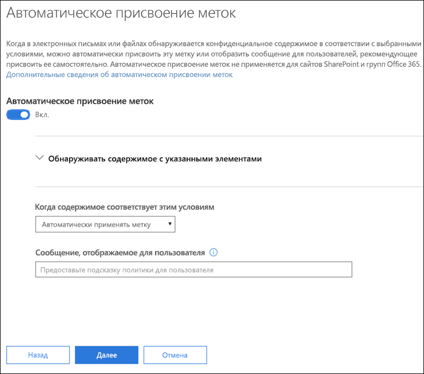
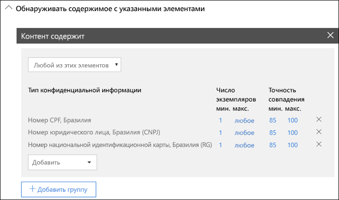
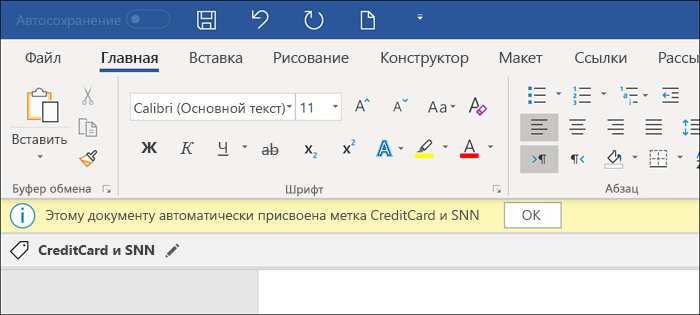
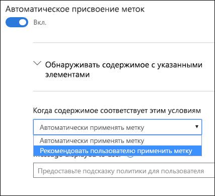
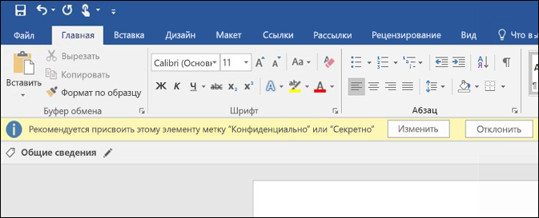

# Автоматическое применение метки конфиденциальности к содержимому

При создании метки конфиденциальности ее можно автоматически назначить содержимому с конфиденциальной информацией или можно предложить пользователям применить рекомендованную метку.

Возможность автоматически применять метки конфиденциальности к содержимому важна, потому что:

- вам не придется обучать пользователей работе со всеми категориями;

- вам не нужно будет рассчитывать на то, что пользователи правильно классифицируют все содержимое;

- пользователям больше не нужно будет знать о ваших политиках — они могут сосредоточиться на своей работе.

> [!NOTE]
> Чтобы использовать возможность автоматического применения меток требуется подписка Azure Information Protection P2. Также для этого необходимо [скачать и установить унифицированный клиент присвоения меток Azure Information Protection](https://docs.microsoft.com/ru-RU/azure/information-protection/rms-client/install-unifiedlabelingclient-app). Мы работаем над встроенной поддержкой этой возможности в приложениях Office, чтобы можно было обойтись без унифицированного клиента присвоения меток Azure Information Protection. Кроме того, этот клиент работает только в Windows, поэтому такая возможность пока не поддерживается в Mac, iOS и Android.

## Автоматическое присвоение меток конфиденциальности в соответствии с условиями

Одна из самых полезных функций меток конфиденциальности — возможность автоматически применять их к содержимому, соответствующему определенным условиям. В этом случае пользователям в организации не требуется применять метки конфиденциальности — Office 365 делает это за них.
   
Вы можете настроить автоматическое применение меток конфиденциальности к содержимому, которое содержит определенные типы конфиденциальной информации. При настройке меток конфиденциальности, которые будут применяться, отображается тот же список типов конфиденциальной информации, что и при создании политики защиты от потери данных. Поэтому вы можете, например, применить метку "Строго конфиденциально" к любому содержимому с персональными данными клиента, такими как номера кредитных карт или номера социального страхования. 

После выбора типов конфиденциальной информации вы можете уточнить условия, изменив количество экземпляров или точность совпадения. Дополнительные сведения см. в разделе "Настройка правил для упрощения или усложнения сопоставления" [этой статьи](data-loss-prevention-policies.md#tuning-rules-to-make-them-easier-or-harder-to-match).

Более того, можно задать условие, чтобы определялись все типы конфиденциальной информации или только один из них. Чтобы условия были более гибкими или сложными, можно добавлять группы и использовать логические операторы в отношении групп. Дополнительные сведения см. в разделе "Группировка и логические операторы" [этой статьи](data-loss-prevention-policies.md#grouping-and-logical-operators).

Если метка конфиденциальности применяется автоматически, пользователь видит соответствующее уведомление в своем приложении Office. Он может нажать кнопку **ОК**, чтобы закрыть уведомление.

## Рекомендация пользователю о применении метки конфиденциальности

Если нужно, вместо автоматического применения метки к содержимому можно рекомендовать пользователю применить метку. Этот вариант дает пользователям возможность принять классификацию и соответствующую защиту или отклонить рекомендацию, если метка не подходит для документа или сообщения электронной почты.

Обратите внимание, что рекомендация меток поддерживается только в Word, PowerPoint и Excel (также требуется установка унифицированного клиента присвоения меток Azure Information Protection). Мы работаем над поддержкой рекомендации меток в Outlook.

Ниже представлен пример рекомендации о применении метки с пользовательской подсказкой о политике, которая отображается во время настройки условия. Вы можете указать текст, отображаемый в подсказке о политике.

## Применение автоматических или рекомендованных меток

- Автоматическое применение меток используется в Word, Excel и PowerPoint, когда сохраняются документы, и в Outlook, когда отправляются сообщения электронной почты. Настраиваемые условия могут определять конфиденциальную информацию в тексте документов и сообщений, верхних и нижних колонтитулах, но не в строке темы или вложениях к сообщениям.

- Вы не можете использовать автоматическую классификацию для документов и сообщений электронной почты, которые ранее были отмечены вручную или которым ранее была присвоена метка классификации более высокого уровня. Помните, что к документу или сообщению можно применить только одну метку конфиденциальности (в дополнение к одной метке хранения).

- Рекомендованная классификация применяется в Word, Excel и PowerPoint при сохранении документов. Мы работаем над поддержкой присвоения рекомендованных меток в Outlook.

- Нельзя использовать рекомендованную классификацию для документов, которым ранее была присвоена метка классификации более высокого уровня. В таких случаях для содержимого с меткой классификации более высокого уровня пользователю не отображается рекомендация с подсказкой о политике.

## Оценка нескольких условий для нескольких меток

Метки оцениваются в порядке, в котором они указаны в политике: первая метка имеет наименьший приоритет (самый низкий уровень конфиденциальности), а последняя — наибольший приоритет (самый высокий уровень конфиденциальности). Дополнительные сведения о приоритете см. в разделе "Приоритет метки (важен порядок)" [этой статьи](sensitivity-labels.md#label-priority-order-matters).

## Не настраивайте родительскую метку для автоматического применения или в качестве рекомендуемой

Помните, что родительскую метку (метку с подчиненными метками) нельзя применять к содержимому. Не настраивайте родительскую метку на автоматическое применение или в качестве рекомендуемой, так как родительская метка не применяется к содержимому в приложениях Office, использующих унифицированный клиент присвоения меток Azure Information Protection. Дополнительные сведения о родительских и подчиненных метках см. в статье [Подчиненные метки (метки группирования)](sensitivity-labels.md#sublabels-grouping-labels).
