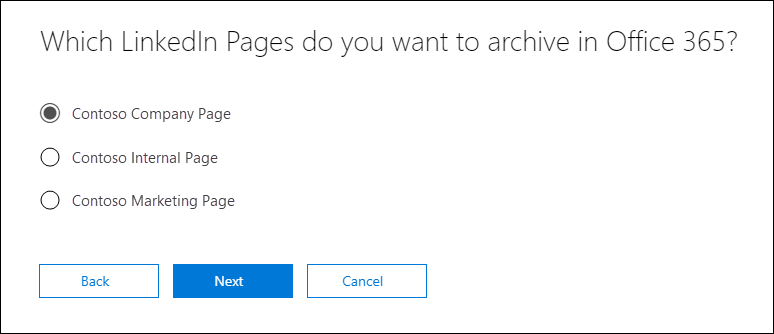

# <a name="set-up-a-connector-to-archive-linkedin-data-in-office-365-preview"></a><span data-ttu-id="69803-104">Настройка соединителя для архивации данных LinkedIn в Office 365 (Предварительная версия)</span><span class="sxs-lookup"><span data-stu-id="69803-104">Set up a connector to archive LinkedIn data in Office 365 (Preview)</span></span>

<span data-ttu-id="69803-105">Функция соединителя для архивации данных из страниц компании LinkedIn в Office 365 доступна предварительная версия.</span><span class="sxs-lookup"><span data-stu-id="69803-105">The connector feature to archive data from LinkedIn Company pages in Office 365 is in Preview.</span></span>

<span data-ttu-id="69803-106">Используйте собственный соединитель в центре безопасности & соответствия требованиям в Office 365, чтобы импортировать и архивировать данные со страниц компании LinkedIn.</span><span class="sxs-lookup"><span data-stu-id="69803-106">Use a native connector in the Security & Compliance Center in Office 365 to import and archive data from LinkedIn Company pages.</span></span> <span data-ttu-id="69803-107">После настройки и настройки соединителя он подключается к учетной записи определенной страницы LinkedIn Company каждые 24 часа.</span><span class="sxs-lookup"><span data-stu-id="69803-107">After you set up and configure a connector, it connects to the account for the specific LinkedIn Company page once every 24 hours.</span></span> <span data-ttu-id="69803-108">Соединитель преобразует сообщения, отправленные на страницу Company, в сообщение электронной почты, а затем импортирует эти элементы в почтовый ящик в Office 365.</span><span class="sxs-lookup"><span data-stu-id="69803-108">The connector converts the messages posted to the Company page to an email message, and then imports those items to a mailbox in Office 365.</span></span>

<span data-ttu-id="69803-109">После того как данные страницы LinkedIn компании хранятся в почтовом ящике, вы можете применять функции соответствия требованиям Office 365, такие как хранение для судебного разбирательства, поиск контента, Архивация на месте, аудит и политики хранения Office 365, в данные LinkedIn.</span><span class="sxs-lookup"><span data-stu-id="69803-109">After the LinkedIn Company page data is stored in a mailbox, you can apply Office 365 compliance features such as Litigation Hold, Content Search, In-Place Archiving, Auditing, and Office 365 retention policies to LinkedIn data.</span></span> <span data-ttu-id="69803-110">Например, можно выполнить поиск этих элементов с помощью функции поиска контента или связать почтовый ящик хранилища с хранитель в расширенном случае обнаружения электронных данных.</span><span class="sxs-lookup"><span data-stu-id="69803-110">For example, you can search for these items using Content Search or associate the storage mailbox with a custodian in an Advanced eDiscovery case.</span></span> <span data-ttu-id="69803-111">Создание соединителя для импорта и архивации данных LinkedIn в Office 365 поможет организации соответствовать стандартам государственных и законодательных политик.</span><span class="sxs-lookup"><span data-stu-id="69803-111">Creating a connector to import and archive LinkedIn data in Office 365 can help your organization stay compliant with government and regulatory policies.</span></span>

## <a name="before-you--begin"></a><span data-ttu-id="69803-112">Перед началом работы</span><span class="sxs-lookup"><span data-stu-id="69803-112">Before you  begin</span></span>

- <span data-ttu-id="69803-113">Необходимо иметь учетные данные для входа (адрес электронной почты или номер телефона и пароль) учетной записи пользователя LinkedIn, которая является администратором для страницы компании LinkedIn, которую нужно архивировать.</span><span class="sxs-lookup"><span data-stu-id="69803-113">You must have the sign-in credentials (email address or phone number and password) of a LinkedIn user account that is an admin for the LinkedIn Company Page that you want to archive.</span></span> <span data-ttu-id="69803-114">Эти учетные данные используются для входа в LinkedIn при настройке соединителя.</span><span class="sxs-lookup"><span data-stu-id="69803-114">You use these credentials to sign in to LinkedIn when setting up the connector.</span></span>

- <span data-ttu-id="69803-115">Пользователю, который создает соединитель страницы LinkedIn компании LinkedIn, должна быть назначена роль импорта почтовых ящиков в Exchange Online.</span><span class="sxs-lookup"><span data-stu-id="69803-115">The user who creates an LinkedIn Company Page connector must be assigned the Mailbox Import Export role in Exchange Online.</span></span> <span data-ttu-id="69803-116">Это необходимо для доступа к странице " **Архивация сторонних данных** " в центре безопасности & соответствия требованиям.</span><span class="sxs-lookup"><span data-stu-id="69803-116">This is required to access the **Archive third-party data** page in the Security & Compliance Center.</span></span> <span data-ttu-id="69803-117">По умолчанию эта роль не назначается ни одной группе ролей в Exchange Online.</span><span class="sxs-lookup"><span data-stu-id="69803-117">By default, this role isn't assigned to any role group in Exchange Online.</span></span> <span data-ttu-id="69803-118">Вы можете добавить роль экспорта для импорта почтовых ящиков в группу ролей Управление организацией в Exchange Online.</span><span class="sxs-lookup"><span data-stu-id="69803-118">You can add the Mailbox Import Export role to the Organization Management role group in Exchange Online.</span></span> <span data-ttu-id="69803-119">Вы также можете создать группу ролей, назначить роль импорта для импорта почтовых ящиков, а затем добавить соответствующих пользователей в качестве участников.</span><span class="sxs-lookup"><span data-stu-id="69803-119">Or you can create a role group, assign the Mailbox Import Export role, and then add the appropriate users as members.</span></span> <span data-ttu-id="69803-120">Для получения дополнительных сведений обратитесь к разделу [Создание](https://docs.microsoft.com/Exchange/permissions-exo/role-groups#create-role-groups) групп ролей или [изменение групп ролей](https://docs.microsoft.com/Exchange/permissions-exo/role-groups#modify-role-groups) статьи "Управление группами ролей в Exchange Online".</span><span class="sxs-lookup"><span data-stu-id="69803-120">For more information, see the  [Create role groups](https://docs.microsoft.com/Exchange/permissions-exo/role-groups#create-role-groups) or [Modify role groups](https://docs.microsoft.com/Exchange/permissions-exo/role-groups#modify-role-groups) sections in the article "Manage role groups in Exchange Online".</span></span>

## <a name="create-a-linkedin-connector"></a><span data-ttu-id="69803-121">Создание соединителя LinkedIn</span><span class="sxs-lookup"><span data-stu-id="69803-121">Create a LinkedIn connector</span></span>

1. <span data-ttu-id="69803-122">Перейдите в <https://protection.office.com> раздел **Управление \> данными** , а затем щелкните **Архивировать сторонние данные**.</span><span class="sxs-lookup"><span data-stu-id="69803-122">Go to <https://protection.office.com> and then click **Data governance \> Import** and then click **Archive third-party data**.</span></span>

2. <span data-ttu-id="69803-123">На странице **Архивация сторонних данных** нажмите кнопку **Добавить соединитель**, а затем выберите элемент **LinkedIn**.</span><span class="sxs-lookup"><span data-stu-id="69803-123">On the **Archive third-party data** page, click **Add a connector**, and then click **LinkedIn**.</span></span>

3. <span data-ttu-id="69803-124">На странице **условия обслуживания** нажмите кнопку **принять**.</span><span class="sxs-lookup"><span data-stu-id="69803-124">On the **Terms of service** page, click **Accept**.</span></span>

4. <span data-ttu-id="69803-125">На странице **входа со LinkedIn** нажмите **войти с помощью LinkedIn**.</span><span class="sxs-lookup"><span data-stu-id="69803-125">On the **Sign in with LinkedIn** page, click **Sign in with LinkedIn**.</span></span>

   <span data-ttu-id="69803-126">Отобразится страница LinkedIn Sign in.</span><span class="sxs-lookup"><span data-stu-id="69803-126">The LinkedIn sign in page is displayed.</span></span>

   

5. <span data-ttu-id="69803-128">На странице "вход в LinkedIn" введите адрес электронной почты (или номер телефона) и пароль для учетной записи LinkedIn, связанной со страницей компании, которую нужно архивировать, а затем нажмите кнопку **войти**.</span><span class="sxs-lookup"><span data-stu-id="69803-128">On the LinkedIn sign in page, enter the email address (or phone number) and password for the LinkedIn account that associated with the company page that you want to archive, and then click **Sign in**.</span></span>

   <span data-ttu-id="69803-129">Откроется страница мастера со списком всех страниц LinkedIn Company, связанных с учетной записью, в которую вы выполнили вход.</span><span class="sxs-lookup"><span data-stu-id="69803-129">A wizard page is displayed with a list of all LinkedIn Company Pages associated with the account that you signed in to.</span></span> <span data-ttu-id="69803-130">Соединитель можно настроить только для одной страницы компании.</span><span class="sxs-lookup"><span data-stu-id="69803-130">A connector can only be configured for one company page.</span></span> <span data-ttu-id="69803-131">Если в Организации имеется несколько страниц LinkedIn, необходимо создать соединитель для каждого из них.</span><span class="sxs-lookup"><span data-stu-id="69803-131">If your organization has multiple LinkedIn Company Pages, you have to create a connector for each one.</span></span>

   


6. <span data-ttu-id="69803-133">Выберите страницу Company, из которой требуется архивировать элементы, а затем нажмите кнопку **Далее**.</span><span class="sxs-lookup"><span data-stu-id="69803-133">Select the company page that you want to archive items from, and then click **Next**.</span></span>

7. <span data-ttu-id="69803-134">На странице " **Настройка фильтров** " можно применить фильтр для начального импорта элементов с определенным сроком хранения.</span><span class="sxs-lookup"><span data-stu-id="69803-134">On the **Set filters** page, you can apply a filter to initially import items that are a certain age.</span></span> <span data-ttu-id="69803-135">Выберите возраст, а затем нажмите кнопку **Далее**.</span><span class="sxs-lookup"><span data-stu-id="69803-135">Select an age, and then click **Next**.</span></span>

8. <span data-ttu-id="69803-136">На странице " **Задание учетной записи хранения** " введите адрес электронной почты почтового ящика Office 365, в который будут импортированы элементы LinkedIn, а затем нажмите кнопку **Далее**.</span><span class="sxs-lookup"><span data-stu-id="69803-136">On the **Set storage account** page, type the email address of an Office 365 mailbox that the LinkedIn items will be imported to, and then click **Next**.</span></span> <span data-ttu-id="69803-137">Элементы импортируются в папку "Входящие" этого почтового ящика.</span><span class="sxs-lookup"><span data-stu-id="69803-137">Items are imported to the Inbox folder in this mailbox.</span></span>

9. <span data-ttu-id="69803-138">Проверьте параметры соединителя и нажмите кнопку **сохранить** , чтобы завершить настройку соединителя.</span><span class="sxs-lookup"><span data-stu-id="69803-138">Review the connector settings and then click **Save** to complete the connector setup.</span></span>

<span data-ttu-id="69803-139">После создания соединителя можно вернуться на страницу **архивных данных третьей стороны** (нажмите кнопку **Обновить** , если необходимо обновить список соединителей), чтобы просмотреть новый соединитель.</span><span class="sxs-lookup"><span data-stu-id="69803-139">After you create the connector, you can go back to the **Archive third-party data** page (click **Refresh** if necessary to update the list of connectors) a view the new connector.</span></span> <span data-ttu-id="69803-140">Значение в столбце **состояние** **ожидает запуска**.</span><span class="sxs-lookup"><span data-stu-id="69803-140">The value in the **Status** column is **Waiting to start**.</span></span> <span data-ttu-id="69803-141">Начало процесса импорта занимает до 24 часов.</span><span class="sxs-lookup"><span data-stu-id="69803-141">It takes up to 24 hours for the initial import process to be started.</span></span> <span data-ttu-id="69803-142">После первого запуска соединителя и импорта элементов LinkedIn соединитель будет запускаться каждые 24 часа и импортировать все новые элементы, создаваемые на странице "компания LinkedIn" за последние 24 часа.</span><span class="sxs-lookup"><span data-stu-id="69803-142">After the first time the connector runs and imports the LinkedIn items, the connector will run once every 24 hours and import any new items that are created on the LinkedIn Company Page in the previous 24 hours.</span></span>

<span data-ttu-id="69803-143">Чтобы просмотреть дополнительные сведения, щелкните соединитель в списке на странице "Архивация сторонних **данных** ", чтобы отобразить всплывающую страницу.</span><span class="sxs-lookup"><span data-stu-id="69803-143">To view more details, click the connector in the list on the **Archive third-party data** page to display the flyout page.</span></span> <span data-ttu-id="69803-144">В разделе **состояние**отображаемый диапазон дат указывает фильтр возраста, который был выбран при создании соединителя.</span><span class="sxs-lookup"><span data-stu-id="69803-144">Under **Status**, the date range that's displayed indicates the age filter that was selected when the connector was created.</span></span> 

## <a name="more-information"></a><span data-ttu-id="69803-145">Дополнительные сведения</span><span class="sxs-lookup"><span data-stu-id="69803-145">More information</span></span>

- <span data-ttu-id="69803-146">Элементы LinkedIn импортируются в папку "Входящие" в почтовом ящике хранилища в Office 365.</span><span class="sxs-lookup"><span data-stu-id="69803-146">LinkedIn items are imported to the Inbox folder in the storage mailbox in Office 365.</span></span> <span data-ttu-id="69803-147">Они отображаются как сообщения электронной почты.</span><span class="sxs-lookup"><span data-stu-id="69803-147">They appear as email messages.</span></span> <span data-ttu-id="69803-148">Отображаемое имя отправителя сообщения — имя страницы компании LinkedIn.</span><span class="sxs-lookup"><span data-stu-id="69803-148">The display name of the sender of the message is the name of the LinkedIn Company Page.</span></span> <span data-ttu-id="69803-149">Фактический адрес электронной почты отправителя это адрес электронной почты почтового ящика хранилища.</span><span class="sxs-lookup"><span data-stu-id="69803-149">The actual email address of the sender is the email address of the storage mailbox.</span></span> <span data-ttu-id="69803-150">Имя страницы компании также добавляется в строку темы заранее.</span><span class="sxs-lookup"><span data-stu-id="69803-150">The name of the company page is also pre-appended to the subject line.</span></span> 

- <span data-ttu-id="69803-151">Из-за предыдущего поведения можно выполнить поиск в `from` свойствах `subject` или сообщениях электронной почты при использовании средства обнаружения электронных данных Майкрософт для поиска элементов LinkedIn, архивированных в Office 365.</span><span class="sxs-lookup"><span data-stu-id="69803-151">Because of the previous behavior, you can search the `from` or `subject` email properties when using a Microsoft eDiscovery tool to search LinkedIn items that are archived in Office 365.</span></span> <span data-ttu-id="69803-152">Например, если имя страницы компании — "Contoso Company Page", можно использовать одну из следующих пар *свойство: значение* в запросе поиска по ключевому слову:</span><span class="sxs-lookup"><span data-stu-id="69803-152">For example if the name of the company page is "Contoso Company Page", then you can use one of the following *property:value* pairs in the keyword search query:</span></span>
   
   ```
   from:"Contoso Company Page"
   ```

    <span data-ttu-id="69803-153">или</span><span class="sxs-lookup"><span data-stu-id="69803-153">Or</span></span>

   ```
   subject:"Contoso Company Page"
   ```

- <span data-ttu-id="69803-154">Чтобы упростить поиск и управление элементами LinkedIn, импортированными в Office 365, владелец почтового ящика хранилища (или любой пользователь, которому назначено разрешение FullAccess) может настроить правило папки "Входящие", чтобы переместить элементы из определенной страницы LinkedIn Company в определенную папку.</span><span class="sxs-lookup"><span data-stu-id="69803-154">To make it easier to locate or manage LinkedIn items imported to Office 365, the owner of the storage mailbox (or anyone assigned the FullAccess permission) can set up an inbox rule to move the items from a specific LinkedIn Company page to a specific folder.</span></span> <span data-ttu-id="69803-155">Это полезно, если почтовый ящик хранилища используется для архивации элементов, импортированных из различных источников сторонних данных.</span><span class="sxs-lookup"><span data-stu-id="69803-155">This is helpful if the storage mailbox is used to archive items that are imported from different third-party data sources.</span></span> <span data-ttu-id="69803-156">Например, вы можете создать правило для папки "Входящие", которое перемещает все элементы, содержащие имя определенной страницы LinkedIn Company, в поле Тема в определенную папку.</span><span class="sxs-lookup"><span data-stu-id="69803-156">For example, you can create an inbox rule that moves all items that contain the name of a specific LinkedIn Company page in the subject field to a specific folder.</span></span>