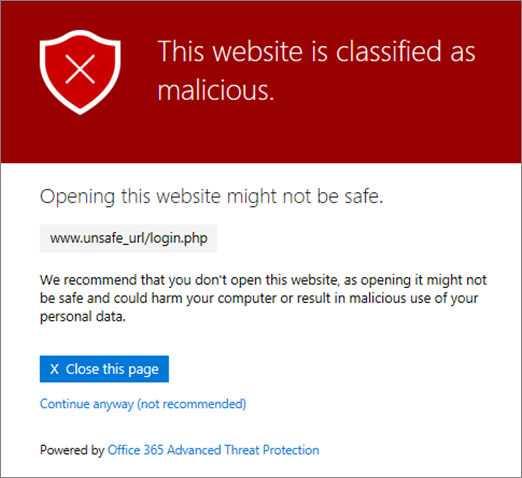

# Страницы предупреждений для безопасных ссылок на Office 365 ATP

> [!IMPORTANT]
> Эта статья предназначена для корпоративных клиентов, у которых есть [Office 365 Advanced Threat protection](office-365-atp.md). Если вы используете Outlook.com, Office 365 Home или Office 365 Personal, а вы ищете сведения о безопасных ссылках в Outlook, ознакомьтесь со статьей [Advanced Outlook.com Security](https://support.office.com/article/advanced-outlook-com-security-for-office-365-subscribers-882d2243-eab9-4545-a58a-b36fee4a46e2).

[Office 365 Advanced Threat protection](office-365-atp.md) (ATP) помогает защитить организацию от фишинговых атак и вредоносных программ с помощью функций, таких как [безопасные ссылки ATP](atp-safe-links.md), [безопасные вложения ATP](atp-safe-attachments.md)и [Защита от фишинга](anti-phishing-protection.md). При наличии защиты проверяются ссылки (URL-адреса) в сообщениях электронной почты и документах Office. Если URL-адрес определен как подозрительный или вредоносный, при щелчке этого URL-адреса может быть заблокировано открытие этого URL-адреса. Вместо того чтобы переходить непосредственно на сайт, может отображаться страница предупреждения. 
  
В этой статье приведены примеры страниц предупреждений, которые могут отображаться, а также последние обновления страниц со предупреждениями.
  
## Примеры страниц предупреждений

### ATP сканирует ссылку

URL-адрес сканируется безопасными связями ATP. Возможно, вам придется подождать некоторое время, чтобы повторить попытку ссылки.

### URL-адрес в подозрительном сообщении электронной почты

URL-адрес находится в сообщении электронной почты, похожем на другие сообщения электронной почты, которые считаются подозрительными. Перед переходом на сайт рекомендуется проверить сообщение электронной почты.

### URL-адрес в сообщении, определенном в качестве попытки фишинга

URL-адрес находится в сообщении электронной почты, которое было определено как атака фишинга. В результате все URL-адреса в сообщении электронной почты блокируются. Не рекомендуется переходить на сайт.

### Сайт определен как вредоносный

URL-адрес указывает на сайт, который был определен как вредоносный.    Не рекомендуется переходить на сайт.

### Сайт заблокирован

URL-адрес заблокирован для вашей организации. Существует несколько причин, по которым URL-адрес может быть заблокирован. Мы рекомендуем вам обратиться к администратору Office 365 вашей организации.

### An error has occurred

Произошла ошибка, и не удается открыть URL-адрес.

## Последние обновления для страниц предупреждений

Несколько страниц со предупреждениями были недавно обновлены для Office 365 ATP. Если вы еще не видите обновленные страницы, вскоре вы будете готовы. Обновления включают новую цветовую схему, дополнительные сведения и возможность перехода на сайт, несмотря на заданное предупреждение и рекомендации.

### Выполняется сканирование URL-адреса

Исходная страница предупреждения:

Обновленная страница предупреждения:

### Предупреждение о вредоносном сайте

Исходная страница предупреждения:

Обновленная страница предупреждения:

### Предупреждение о заблокированном URL-адресе

Исходная страница предупреждения:

Обновленная страница предупреждения:

### Страница предупреждения "ошибка возникла"

Исходная страница предупреждения:

Обновленная страница предупреждения:

   
