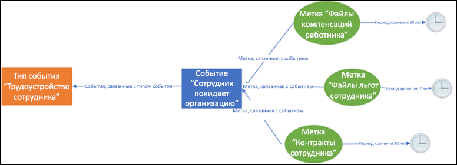
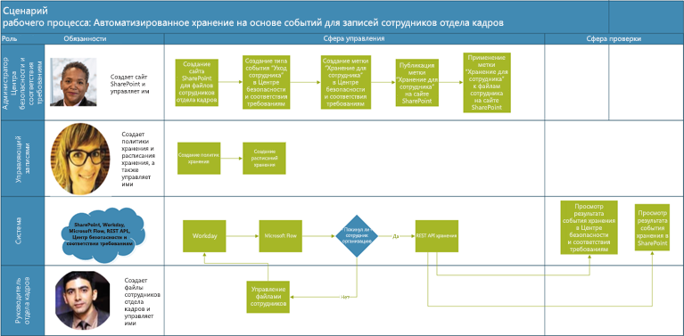
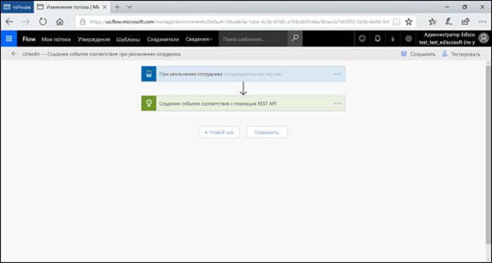
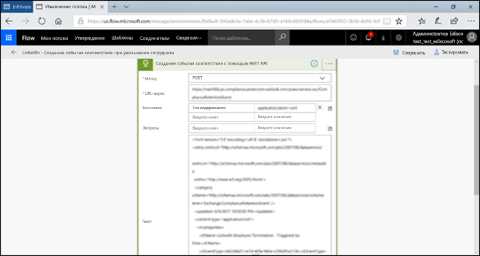
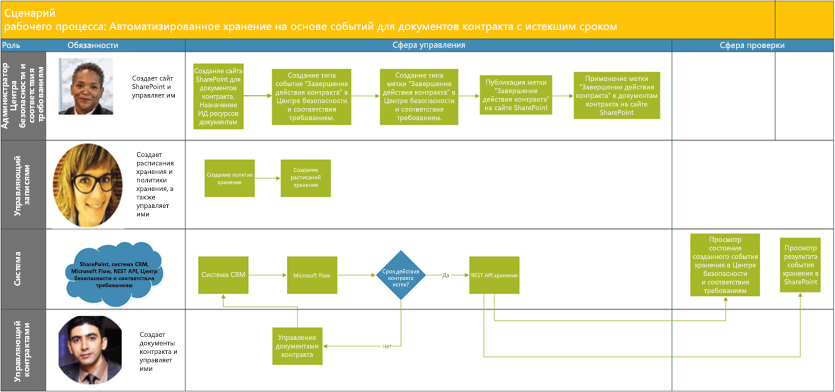
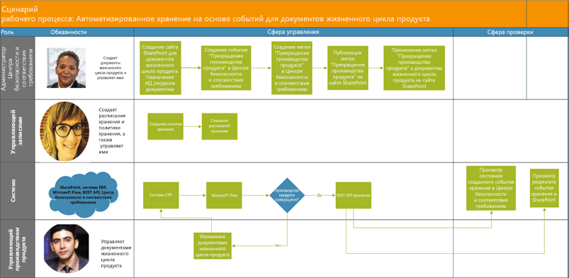

# Автоматизация хранения на основе событийAutomate event-based retention

Процессы развертывания содержимого в организации, а также обнаружения избыточных, устаревших и тривиальных данных играют важную роль. Чтобы продолжать соответствовать юридическим, нормативным и бизнес-требованиям, компания должна обеспечить хранение и защиту важной информации, а также быстрый поиск необходимых данных. Хранение только важной и подходящей информации является ключевым фактором успеха.The explosion of content in organizations and how it can become ROT (redundant, obsolete, trivial) is serious business. To continue to meet legal, business, and regulatory compliance challenges, businesses must be able to keep and protect important information and quickly find what’s relevant. Retaining only important, pertinent information is key to a business’s success.

Поэтому организации могут использовать преимущества решений для хранения в Центре безопасности и соответствия требованиям Office 365. Связанные с хранением операции можно активировать с помощью [меток хранения](labels.md). У метки хранения есть параметр для [определения периода хранения на основе конкретного события](event-driven-retention.md). Обычно период хранения зависит от известной даты, например даты создания или последнего изменения содержимого. Однако у организаций также есть требования по удалению содержимого на основе возникновения событий, например через 7 лет после того, как сотрудник уволился из организации.Hence organizations can take advantage of retention solutions in the Office 365 Security & Compliance Center. Retention can be triggered by using [retention labels](labels.md). A retention label has the option to [base the retention period on a specific event](event-driven-retention.md). Typically, the retention period is based on a known date, such as the creation date or last modified date for the content. However, organizations also have requirements to dispose of content based on the occurrence of an event, such as 7 years after an employee leaves an organization.

Чтобы обеспечить удаление содержимого в соответствии с требованиями, важно знать, когда происходят события. Из-за стремительного роста объема содержимого становится сложно хранить и удалять данные своевременно и в соответствии с требованиями.In order to ensure compliant disposal of content, it is imperative to know when an event takes place. With the volume of content increasing rapidly, it is becoming challenging to retain and dispose content in a timely and compliant manner.

Хранения на основе событий решает эту проблему. В этой статье описывается, как настроить операции бизнес-процесса, чтобы автоматизировать хранение с помощью событий, используя REST API Microsoft 365.Event-based retention solves this problem. This topic explains how to set up your business process flows to automate retention through events by using the Microsoft 365 REST API.

## О хранении на основе событийAbout event-based retention

Независимо от размера организации количество деловых документов, юридических документов, файлов сотрудников, договоров и документов о продукции, которые ежедневно создаются и которыми необходимо управлять, стремительно растет.An organization can be small, medium, or large. The number of business documents, legal documents, employee files, contracts, and product documents that get created and managed on a day to day basis is increasing dramatically.

Например, каждый день десятки и сотни сотрудников устраиваются на работу в организации или увольняются. Отдел кадров постоянно создает, обновляет или удаляет связанные с сотрудниками документы в соответствии с бизнес-требованиями. Этот процесс регулируется различными политиками, определяемыми для компании:For example, each day, tens and hundreds of employees are joining and leaving organizations. The HR department continues to create, update, or delete employee-related documents as per business requirements. This process is subject to the different retention policies outlined for the business:

- **Период хранения содержимого может зависеть от известной даты**, например даты создания, последнего изменения содержимого или присвоения ему метки. Пример: вы можете хранить документы в течение семи лет после создания, а затем удалить их.**The period of retention for content can be a known date** such as the date the content was created, last modified or labeled. For example, you might retain documents for seven years after they're created and then delete them.

- **Период хранения содержимого может зависеть от неизвестной даты**. Например, с помощью меток хранения можно определять зависимость периода хранения от возникновения определенного типа события, такого как увольнение сотрудника из организации.**The period of retention of content can also be an unknown date**. For example, with retention labels, you can also base a retention period on when a specific type of event occurs, such as an employee leaving the organization.

Событие активирует начало периода хранения, и ко всему содержимому с меткой, относящейся к событию данного типа, применяются действия хранения. Этот процесс называется хранением на основе событий. Дополнительные сведения о нем см. в статье [Общие сведения о хранении, зависящем от возникновения события](event-driven-retention.md).The event triggers the start of the retention period, and all content with a label applied for that type of event get the label's retention actions enforced on them. This is called event-based retention - to learn more, see [Overview of event-driven retention](event-driven-retention.md).

## Настройка хранении на основе событийSet up event-based retention

В этом разделе описываются действия, необходимые для подготовки хранения содержимого.This section describes what needs to be done prior to retaining content.

### Определение ролейIdentify roles

Определите различные роли в организации, которые будут выполнять задачи управления записями, обеспечивающие эффективное хранение деловых документов.Identify the different roles in an organization that perform Record Management tasks that would be responsible for effective and efficient retention of business documents.

  | **Роль****Persona**| **Описание****Role**|
  | - | - |
  | Администратор Центра безопасности и соответствия требованиямSecurity & Compliance Center admin | Создает типы событий хранения, метки хранения и репозитории записей в SharePointCreates Retention Event types, Retention labels and Record repositories in SharePoint |
  | Управляющий записямиRecords Manager                                  | Предоставляет указания по политикам и расписанию хранения, а также сведения о соответствии требованиямProvides Retention Policies and Retention Schedules guidance and compliance details   |
  | Системный администратор (компания)System Admin (business)                          | Настраивает внешние системы для работы с Microsoft 365 и управляет имиSets up and manages external systems to work with Microsoft 365                       |
  | Информационный работникInformation Worker                               | Управляет жизненным циклом своих бизнес-процессов (отдела кадров, финансового отдела, ИТ-отдела и т. д.)Manages the lifecycle of their business process (HR, Finance, IT etc)                 |

### Настройка Центра безопасности и соответствия требованиямSet up the Security & Compliance Center
  
1. Администратор соответствия требованиям создает тип события, например увольнение сотрудника, завершение действия договора или прекращение производства продукта (описание пошагового процесса см. в [статье о событиях хранения](https://docs.microsoft.com/ru-RU/office365/securitycompliance/event-driven-retention)).Compliance admin creates an event type – for example, Employee Termination or Contract Expiration or End of Product Manufacturing (Please refer to step by step process in [Event retention article](https://docs.microsoft.com/ru-RU/office365/securitycompliance/event-driven-retention)
    
1. Администратор соответствия требованиям создает метку хранения на основе события и связывает метку с типом события.Compliance admin creates a retention label based on an event and associates the label with an event type
    
1. Существует 4 типа триггеров меток хранения:There are 4 types of triggers for retention labels:
            
    1. Дата созданияCreate date
                
    1. Дата последнего измененияLast modified
                
    1. Дата метки (когда содержимому была присвоена метка)Label date (when the content was labeled)
                
    1. На основе событияEvent-based
    
1. Администратор соответствия требованиям публикует метку.Compliance admin publishes the label

### Настройка SharePointSet up SharePoint
   
Чтобы создать репозиторий записей, администратор соответствия требованиям выполняет следующие действия:To create a records repository, the compliance admin:

1. Создает сайт SharePoint.Creates a SharePoint site.

1. Выполняет одно из указанных ниже действий:Does one of the following:
        
    - Создает библиотеку SharePoint: задает метку на основе события на уровне библиотеки. Дополнительные сведения см. в разделе "Применение метки хранения по умолчанию ко всему контенту в библиотеке SharePoint, папке или набору документов" [этой статьи](labels.md#applying-a-default-retention-label-to-all-content-in-a-sharepoint-library-folder-or-document-set).Creates a SharePoint library: Set event-based label at the library level. For more information, see [Applying a default retention label to all content in a SharePoint library, folder, or document set](labels.md#applying-a-default-retention-label-to-all-content-in-a-sharepoint-library-folder-or-document-set).
          
    - Настраивает набор документов в SharePoint. Дополнительные сведения см. в статье [Общие сведения о наборах документов](https://support.office.com/ru-RU/article/Introduction-to-Document-Sets-3DBCD93E-0BED-46B7-B1BA-B31DE2BCD234).Sets up a Document set in SharePoint. For more information, see [Introduction to document sets](https://support.office.com/ru-RU/article/Introduction-to-Document-Sets-3DBCD93E-0BED-46B7-B1BA-B31DE2BCD234).
      
1. Назначает идентификатор ресурса (то есть название продукта или код, используемые в организации, например в роли идентификатора ресурса может выступать код сотрудника) каждому набору документов сотрудника. (При назначении идентификатора ресурса папке каждый элемент в папке автоматически наследует тот же идентификатор ресурса. То есть период хранения всех элементов запускается одним событием.)Assigns Asset Id (asset ID is a product name or code used by the organization, for example, Employee number can be an asset id) to each employee document set (By assigning the asset ID to the folder, every item in that folder automatically inherits the same asset ID. This means all the items can have their retention period triggered by the same event.

## Способы запуска хранения на основе событияWays to trigger event-based retention

Существует два способа запуска хранения на основе события:There are two ways in which event-based retention can be triggered:

- **С помощью пользовательского интерфейса Центра безопасности и соответствия требованиям**. Этот процесс можно использовать для хранения содержимого небольшого объема или в случае, когда активация хранения происходит редко (один раз в месяц или год). Дополнительные сведения об этом методе см. в статье [Общие сведения о хранении, зависящем от возникновения события](event-driven-retention.md). Однако этот способ запуска хранения может занимать много времени и уязвим для ошибок, что ограничивает масштабируемость. Поэтому автоматизированное и простое решение для активации хранения может повысить безопасность данных и улучшить их соответствие требованиям.**Using Security & Compliance Center UI** This is a process that can be used to retain less content at a time or the frequency to trigger retention is not often, such as monthly or yearly. For more information on this method, see [Overview of event-driven retention](event-driven-retention.md). However, this way to trigger retention can be time-consuming and prone to error, thus stunting scalability. Therefore, an automated, seamless solution to trigger retention can enhance the security and compliance of data.

- **С помощью REST API M365.** Этот процесс можно использовать для хранения большого объема данных и/или в случае частой активации хранения (каждый день или каждую неделю). Этот процесс определяет, когда событие возникает в вашей бизнес-системе, и автоматически создает связанное событие в Центре безопасности и соответствия требованиям. Вам не нужно вручную создавать связанное событие в пользовательском интерфейсе каждый раз, когда происходит исходное событие.**Using a M365 REST API** This process can be used when large amounts of content are to be retained at a time and/or the frequency to trigger retention is often such as daily or weekly. The flow detects when an event occurs in your line-of-business system, and then automatically creates a related event in the Security & Compliance Center. You don't need to manually create an event in the UI each time one occurs.

Существует два способа использования REST API:There are two options for using the REST API:

- **Microsoft Flow или аналогичное приложение** можно использовать для автоматического запуска события. Microsoft Flow — это оркестратор для подключения к другим системам. Для использования Microsoft Flow не требуется пользовательское решение.**Microsoft Flow or a similar application** can be used to trigger the occurrence of an event automatically. Microsoft Flow is an orchestrator for connecting to other systems. Using Microsoft Flow does not require a custom solution.

- **PowerShell или HTTP-клиент для вызова REST API**. Используйте PowerShell (версии 6 или выше) для вызова REST API Microsoft 365, чтобы создать события.**PowerShell or an HTTP client to call REST API** Using PowerShell (version 6 or higher) to call Microsoft 365 REST API to create events. 

REST API — это конечная точка службы, поддерживающая операции (методы) HTTP, которая предоставляет права на создание, получение, обновление или удаление ресурсов службы. Дополнительные сведения см. в разделе "Компоненты запроса/ответа REST API" [этой статьи](https://docs.microsoft.com/ru-RU/rest/api/gettingstarted/#components-of-a-rest-api-requestresponse). В этом случае используя REST API Microsoft 365, можно создавать или получать события с помощью операций (методов) POST и GET.A Rest API is a service endpoint that supports sets of HTTP operations (methods), which provide create/retrieve/update/delete access to the service's resources - for more information, see [Components of a REST API request/response](https://docs.microsoft.com/ru-RU/rest/api/gettingstarted/#components-of-a-rest-api-requestresponse). In this case, by using the Microsoft 365 REST API, events can be created and retrieved using operations (methods) POST and GET.

## Примеры сценариевExample scenarios

Давайте рассмотрим следующие сценарии.Let’s consider the following scenarios.

### Сценарий 1. Сотрудники увольняются из организацииScenario 1: Employees leaving the organization 

Организация создает и хранит множество документов для каждого сотрудника. Эти документы управляются и хранятся в ходе трудовых отношений с сотрудником. Однако, когда сотрудник увольняется, организация в соответствии с законом и бизнес-требованиями обязана хранить документы об этом сотруднике в течение указанного периода.An organization creates and stores numerous employee related documents per employee. These documents are managed and retained during the employment of each employee. However, when the employee leaves the organization or the employment is terminated, the organization is obligated by legal and business requirements to retain the documents of that employee for a stipulated period.

Если из организации ежедневно увольняется несколько сотрудников, необходимо запускать счетчики хранения сотен или даже тысяч документов каждый день.Now if multiple employees leave the organization every day, the organization must trigger the retention clock of hundreds if not thousands of documents each day.

Кроме того, для каждого сотрудника период хранения рассчитывается на основе типа записи сотрудника (дата увольнения сотрудника + количество дней, месяцев или лет). Например, у документов о зарплате и документов о премии одного и того же сотрудника могут быть разные периоды хранения.In addition to this, the retention period needs to be calculated for each of these employees as Employee termination date + number of days, months or years based on the type of the employee record. For example, worker’s compensation of the employee vs benefits filings of the same employee may need different retention.

На схеме ниже показано, как с одним событием может быть связано несколько меток. Здесь все файлы с меткой зарплаты сотрудника и файлы с меткой премии сотрудника связаны с одним событием — увольнением сотрудника из организации. У каждого из этих файлов разные счетчики хранения. Поэтому, когда сотрудник увольняется из организации, у этих файлов с метками разный период хранения. Запуск всех этих разных счетчиков хранения для каждого типа файла или метки для каждого сотрудника является очень сложной задачей. А теперь представьте, что это нужно делать для нескольких сотрудников.The diagram below shows how there can be multiple labels that are associated with a single event. Here all the files under Worker’s compensation label and all the files under Employee benefits label are both associated with a single event which is the employee leaving the organization. Each of these different files have different retention clocks. So, when an employee leaves the organization, these files within each label experience a different retention period. To trigger all these different retention clocks for each file type or label for each employee is a very challenging task. Imagine doing this for multiple employees.

Поэтому автоматизированный процесс запуска всех этих различных счетчиков хранения для нескольких сотрудников должен работать быстро, быть безошибочным и очень эффективным.Hence an automated process to trigger these different retention clocks for multiple employees will be time-saving, error-free and extremely efficient .

**Настройка автоматизированного хранения на основе событий для этого сценария:****Configuring Automated Event Based Retention for this scenario:**

  - Администратор создает папки сотрудников в наборе документов, например "Марта Артемьева", "Артем Кузнецов".Admin c reates employee folders to the Document set such as Jane Doe, John Smith.

  - Администратор добавляет в каждую папку файлы сотрудников, например с данными о премиях и зарплате.Admin adds employee files such as Benefits, Payroll, Worker’s Compensation to each employee folder

  - Администратор назначает идентификатор ресурса для каждой папки сотрудников.Admin assigns Asset Id to each employee folder. 

  - Администратор Центра безопасности и соответствия требованиямSCC Admin l

  - выполняет вход в Центр безопасности и соответствия требованиям.ogs into the Security & Compliance Center

  - Администратор Центра безопасности и соответствия требованиям создает связанные с сотрудниками типы событий, например события "Увольнение сотрудника", "Прием сотрудника на работу" в Центре безопасности и соответствия требованиям.SCC Admin creates employee related events types such as “Employee Termination”, “Employee Hire” events in Security and Compliance Center.

  - Администратор Центра безопасности и соответствия требованиям создает метку "Хранение для сотрудника" в Центре безопасности и соответствия требованиям.SCC Admin creates “Employee Retention” label in Security and Compliance Center.

  - Эта метка "Хранение для сотрудника" публикуется и вручную или автоматически применяется к файлам сотрудника в SharePointThis “Employee Retention” label is published and applied manually or automatically to the employee files in SharePoint

  - Система управления отдела кадров, например Workday, может работать совместно с Microsoft Flow для периодического управления файлами сотрудниковHR Management System like Workday can work with Microsoft Flow to run periodically to manage employee files

  - Если сотрудник увольняется из организации, Flow активирует REST API хранения на основе событий M365, который запустит счетчик хранения для файлов определенного сотрудника.If an employee has left the organization, the Flow will trigger the M365 Event Based Retention REST API that will begin the retention clock on the specific employee’s files.

#### Использование Microsoft FlowUsing Microsoft Flow

Шаг 1. Создайте процесс создания события с помощью REST API Microsoft 365Step 1- Create a flow to create an event using the Microsoft 365 REST API

##### Создание событияCreate an event

Пример кода для вызова REST APISample code to call the REST API

<table>
<thead>
<tr class="header">
<th>МетодMethod</th>
<th>POSTPOST</th>
<th></th>
</tr>
</thead>
<tbody>
<tr class="odd">
<td>URL-адресURL</td>
<td>https://ps.compliance.protection.outlook.com/psws/service.svc/ComplianceRetentionEvent)</td>
<td></td>
</tr>
<tr class="even">
<td>ЗаголовкиHeaders</td>
<td>Content-TypeContent-Type</td>
<td>приложение/atom+xmlapplication/atom+xml</td>
</tr>
<tr class="odd">
<td>Основной текстBody</td>
<td>
&lt;?xml version='1.0' encoding='utf-8' standalone='yes'?&gt;&lt;?xml version='1.0' encoding='utf-8' standalone='yes'?&gt;

&lt;entry xmlns:d='http://schemas.microsoft.com/ado/2007/08/dataservices'&lt;entry xmlns:d='http://schemas.microsoft.com/ado/2007/08/dataservices'

xmlns:m='http://schemas.microsoft.com/ado/2007/08/dataservices/metadata'xmlns:m='http://schemas.microsoft.com/ado/2007/08/dataservices/metadata'

xmlns='http://www.w3.org/2005/Atom'&gt;xmlns='http://www.w3.org/2005/Atom'&gt;

&lt;category scheme='http://schemas.microsoft.com/ado/2007/08/dataservices/scheme' term='Exchange.ComplianceRetentionEvent' /&gt;&lt;category scheme='http://schemas.microsoft.com/ado/2007/08/dataservices/scheme' term='Exchange.ComplianceRetentionEvent' /&gt;

&lt;updated&gt;9/9/2017 10:50:00 PM&lt;/updated&gt;&lt;updated&gt;9/9/2017 10:50:00 PM&lt;/updated&gt;

&lt;content type='application/xml'&gt;&lt;content type='application/xml'&gt;

&lt;m:properties&gt;&lt;m:properties&gt;

&lt;d:Name&gt;Employee Termination &lt;/d:Name&gt;&lt;d:Name&gt;Employee Termination &lt;/d:Name&gt;

&lt;d:EventType&gt;99e0ae64-a4b8-40bb-82ed-645895610f56&lt;/d:EventType&gt;&lt;d:EventType&gt;99e0ae64-a4b8-40bb-82ed-645895610f56&lt;/d:EventType&gt;

&lt;d:SharePointAssetIdQuery&gt;1234&lt;/d:SharePointAssetIdQuery&gt;&lt;d:SharePointAssetIdQuery&gt;1234&lt;/d:SharePointAssetIdQuery&gt;

&lt;d:EventDateTime&gt;2018-12-01T00:00:00Z &lt;/d:EventDateTime&gt;&lt;d:EventDateTime&gt;2018-12-01T00:00:00Z &lt;/d:EventDateTime&gt;

&lt;/m:properties&gt;&lt;/m:properties&gt;

&lt;/content&gt;&lt;/content&gt;

&lt;/entry&gt;&lt;/entry&gt;
</td>
<td></td>
</tr>
<tr class="even">
<td>Проверка подлинностиAuthentication</td>
<td>БазоваяBasic</td>
<td></td>
</tr>
<tr class="odd">
<td>Имя пользователяUsername</td>
<td>"Complianceuser"“Complianceuser”</td>
<td></td>
</tr>
<tr class="even">
<td>ПарольPassword</td>
<td>"Compliancepassword"“Compliancepassword”</td>
<td></td>
</tr>
</tbody>
</table>

##### Доступные параметрыAvailable parameters

<table>
<thead>
<tr class="header">
<th><strong>Параметры</strong><strong>Parameters</strong></th>
<th><strong>Описание</strong><strong>Description</strong></th>
<th><strong>Примечания</strong><strong>Notes</strong></th>
</tr>
</thead>
<tbody>
<tr class="odd">
<td>&lt;d:Name&gt;&lt;/d:Name&gt;&lt;d:Name&gt;&lt;/d:Name&gt;</td>
<td>Указание уникального имени события.Provide a unique name for the event,</td>
<td>Не может содержать начальные и конечные пробелы и следующие символы: % \* \ &amp; &lt; &gt; | # ? , : ;Cannot contain trailing spaces, and the following characters: % \* \ &amp; &lt; &gt; | # ? , : ;</td>
</tr>
<tr class="even">
<td>&lt;d:EventType&gt;&lt;/d:EventType&gt;&lt;d:EventType&gt;&lt;/d:EventType&gt;</td>
<td>Введите название типа события (или Guid).Enter event type name (or Guid),</td>
<td>Пример: "Увольнение сотрудника". Тип события должен быть связан с меткой хранения.Example: “Employee termination”. Event type has to be associated with a retention label.</td>
</tr>
<tr class="odd">
<td>&lt;d:SharePointAssetIdQuery&gt;&lt;/d:SharePointAssetIdQuery&gt;&lt;d:SharePointAssetIdQuery&gt;&lt;/d:SharePointAssetIdQuery&gt;</td>
<td>Введите "ComplianceAssetId:" + код сотрудникаEnter “ComplianceAssetId:” + employee Id</td>
<td>Пример: &quot;ComplianceAssetId:12345&quot;Example:&quot;ComplianceAssetId:12345&quot;</td>
</tr>
<tr class="even">
<td>&lt;d:EventDateTime&gt;&lt;/d:EventDateTime&gt;&lt;d:EventDateTime&gt;&lt;/d:EventDateTime&gt;</td>
<td>Дата и время событияEvent Date and Time</td>
<td>
Формат: ГГГГ-ММ-ДДTчч:мм:ссZ. Пример:Format: yyyy-MM-ddTHH:mm:ssZ, Example:

2018-12-01T00:00:00Z2018-12-01T00:00:00Z
</td>
</tr>
</tbody>
</table>

##### Коды ответаResponse codes

| **Код ответа****Response Code** | **Описание****Description**       |
| ----------------- | --------------------- |
| 302302               | ПеренаправлениеRedirect              |
| 201201               | СозданоCreated               |
| 403403               | Сбой авторизацииAuthorization Failed  |
| 401401               | Сбой проверки подлинностиAuthentication Failed |

##### Получение событий на основе диапазона времениGet Events based on time range

<table>
<thead>
<tr class="header">
<th>МетодMethod</th>
<th>GETGET</th>
<th></th>
</tr>
</thead>
<tbody>
<tr class="odd">
<td>URL-адресURL</td>
<td><ol start="4" type="1">
<li>
https://ps.compliance.protection.outlook.com/psws/service.svc/ComplianceRetentionEvent?BeginDateTime=2019-01-11&amp;EndDateTime=2019-01-16https://ps.compliance.protection.outlook.com/psws/service.svc/ComplianceRetentionEvent?BeginDateTime=2019-01-11&amp;EndDateTime=2019-01-16
</li>
</ol></td>
<td></td>
</tr>
<tr class="even">
<td>ЗаголовкиHeaders</td>
<td>Content-TypeContent-Type</td>
<td>приложение/atom+xmlapplication/atom+xml</td>
</tr>
<tr class="odd">
<td></td>
<td></td>
<td></td>
</tr>
<tr class="even">
<td>Проверка подлинностиAuthentication</td>
<td>БазоваяBasic</td>
<td></td>
</tr>
<tr class="odd">
<td>Имя пользователяUsername</td>
<td>"Complianceuser"“Complianceuser”</td>
<td></td>
</tr>
<tr class="even">
<td>ПарольPassword</td>
<td>"Compliancepassword"“Compliancepassword”</td>
<td></td>
</tr>
</tbody>
</table>

##### Коды ответаResponse codes

| **Код ответа****Response Code** | **Описание****Description**                   |
| ----------------- | --------------------------------- |
| 200200               | Все в порядке, список событий в формате atom+xmlOK, A list of events in atom+ xml |
| 404404               | Не найденоNot found                         |
| 302302               | ПеренаправлениеRedirect                          |
| 401401               | Сбой авторизацииAuthorization Failed              |
| 403403               | Сбой проверки подлинностиAuthentication Failed             |

##### Получение события по идентификаторуGet an event by ID

| МетодMethod         | GETGET   |                      |
| -------------- | ------------------------------------------------------------------------------------------------------------------------------------------------------------------------------------------------------------------------------------------------------------------ | -------------------- |
| URL-адресURL            | [https://ps.compliance.protection.outlook.com/psws/service.svc/ComplianceRetentionEvent(‘174e9a86-74ff-4450-8666-7c11f7730f66’)](https://ps.compliance.protection.outlook.com/psws/service.svc/ComplianceRetentionEvent\('174e9a86-74ff-4450-8666-7c11f7730f66'\))[https://ps.compliance.protection.outlook.com/psws/service.svc/ComplianceRetentionEvent(‘174e9a86-74ff-4450-8666-7c11f7730f66’)](https://ps.compliance.protection.outlook.com/psws/service.svc/ComplianceRetentionEvent\('174e9a86-74ff-4450-8666-7c11f7730f66'\)) |                      |
| ЗаголовокHeader         | Content-TypeContent-Type                                                                                                                                                                                                                                                       | приложение/atom+xmlapplication/atom+xml |
| Проверка подлинностиAuthentication | БазоваяBasic                                                                                                                                                                                                                                                              |                      |
| Имя пользователяUsername       | "Complianceuser"“Complianceuser”                                                                                                                                                                                                                                                   |                      |
| ПарольPassword       | "Compliancepassword"“Compliancepassword”                                                                                                                                                                                                                                               |                      |

##### Коды ответаResponse codes

| **Код ответа****Response Code** | **Описание****Description**                                      |
| ----------------- | ---------------------------------------------------- |
| 200200               | Все в порядке, текст ответа содержит событие в формате atom+xmlOK, The response body contains the event in atom+xml |
| 404404               | Не найденоNot found                                            |
| 302302               | ПеренаправлениеRedirect                                             |
| 401401               | Сбой авторизацииAuthorization Failed                                 |
| 403403               | Сбой проверки подлинностиAuthentication Failed                                |

##### Получение события по имениGet an event by name

| МетодMethod         | GETGET       |                      |
| -------------- | -------------------------------------------------------------------------------------------------------------------------------------------- | -------------------- |
| URL-адресURL            | <https://ps.compliance.protection.outlook.com/psws/service.svc/ComplianceRetentionEvent('EventByRESTPost-2226bfebcc2841a8968ba71f9516b763')> |                      |
| ЗаголовкиHeaders        | Content-TypeContent-Type                                                                                                                                 | приложение/atom+xmlapplication/atom+xml |
| Проверка подлинностиAuthentication | БазоваяBasic                                                                                                                                        |                      |
| Имя пользователяUsername       | "Complianceuser"“Complianceuser”                                                                                                                             |                      |
| ПарольPassword       | "Compliancepassword"“Compliancepassword”                                                                                                                         |                      |

##### Коды ответаResponse codes

| **Код ответа****Response Code** | **Описание****Description**                                      |
| ----------------- | ---------------------------------------------------- |
| 200200               | Все в порядке, текст ответа содержит событие в формате atom+xmlOK, The response body contains the event in atom+xml |
| 404404               | Не найденоNot found                                            |
| 302302               | ПеренаправлениеRedirect                                             |
| 401401               | Сбой авторизацииAuthorization Failed                                 |
| 403403               | Сбой проверки подлинностиAuthentication Failed                                |

#### Использование PowerShell (версии 6 или выше) или любого HTTP-клиентаUsing PowerShell (ver.6 or higher) or any HTTP client

Шаг 1. Подключитесь к PowerShell.Step 1: Connect to PowerShell.

Шаг 2. Запустите указанный ниже сценарий.Step 2: Run the following script.

<table>
<tbody>
<tr class="odd">
<td>
param([string]$baseUri)param([string]$baseUri)

$userName = &quot;UserName&quot;$userName = &quot;UserName&quot;

$password = &quot;Password&quot;$password = &quot;Password&quot;

$securePassword = ConvertTo-SecureString $password -AsPlainText -Force$securePassword = ConvertTo-SecureString $password -AsPlainText -Force

$credentials = New-Object System.Management.Automation.PSCredential($userName, $securePassword)$credentials = New-Object System.Management.Automation.PSCredential($userName, $securePassword)

$EventName=&quot;EventByRESTPost-$(([Guid]::NewGuid()).ToString('N'))&quot;$EventName=&quot;EventByRESTPost-$(([Guid]::NewGuid()).ToString('N'))&quot;

Write-Host &quot;Start to create an event with name: $EventName&quot;Write-Host &quot;Start to create an event with name: $EventName&quot;

$body = &quot;&lt;?xml version='1.0' encoding='utf-8' standalone='yes'?&gt;$body = &quot;&lt;?xml version='1.0' encoding='utf-8' standalone='yes'?&gt;

&lt;entry xmlns:d='http://schemas.microsoft.com/ado/2007/08/dataservices'&lt;entry xmlns:d='http://schemas.microsoft.com/ado/2007/08/dataservices'

xmlns:m='http://schemas.microsoft.com/ado/2007/08/dataservices/metadata'xmlns:m='http://schemas.microsoft.com/ado/2007/08/dataservices/metadata'

xmlns='http://www.w3.org/2005/Atom'&gt;xmlns='http://www.w3.org/2005/Atom'&gt;

&lt;category scheme='http://schemas.microsoft.com/ado/2007/08/dataservices/scheme' term='Exchange.ComplianceRetentionEvent' /&gt;&lt;category scheme='http://schemas.microsoft.com/ado/2007/08/dataservices/scheme' term='Exchange.ComplianceRetentionEvent' /&gt;

&lt;updated&gt;7/14/2017 2:03:36 PM&lt;/updated&gt;&lt;updated&gt;7/14/2017 2:03:36 PM&lt;/updated&gt;

&lt;content type='application/xml'&gt;&lt;content type='application/xml'&gt;

&lt;m:properties&gt;&lt;m:properties&gt;

&lt;d:Name&gt;$EventName&lt;/d:Name&gt;&lt;d:Name&gt;$EventName&lt;/d:Name&gt;

&lt;d:EventType&gt;e823b782-9a07-4e30-8091-034fc01f9347&lt;/d:EventType&gt;&lt;d:EventType&gt;e823b782-9a07-4e30-8091-034fc01f9347&lt;/d:EventType&gt;

&lt;d:SharePointAssetIdQuery&gt;'ComplianceAssetId:123'&lt;/d:SharePointAssetIdQuery&gt;&lt;d:SharePointAssetIdQuery&gt;'ComplianceAssetId:123'&lt;/d:SharePointAssetIdQuery&gt;

&lt;/m:properties&gt;&lt;/m:properties&gt;

&lt;/content&gt;&lt;/content&gt;

&lt;/entry&gt;&quot;&lt;/entry&gt;&quot;

$event = $null$event = $null

trytry

{{

$event = Invoke-RestMethod -Body $body -Method 'POST' -Uri &quot;$baseUri/ComplianceRetentionEvent&quot; -ContentType &quot;application/atom+xml&quot; -Authentication Basic -Credential $credentials -MaximumRedirection 0$event = Invoke-RestMethod -Body $body -Method 'POST' -Uri &quot;$baseUri/ComplianceRetentionEvent&quot; -ContentType &quot;application/atom+xml&quot; -Authentication Basic -Credential $credentials -MaximumRedirection 0

}}

catchcatch

{{

$response = $_.Exception.Response$response = $_.Exception.Response

if($response.StatusCode -eq &quot;Redirect&quot;)if($response.StatusCode -eq &quot;Redirect&quot;)

{{

$url = $response.Headers.Location$url = $response.Headers.Location

Write-Host &quot;redirected to $url&quot;Write-Host &quot;redirected to $url&quot;

$event = Invoke-RestMethod -Body $body -Method 'POST' -Uri $url -ContentType &quot;application/atom+xml&quot; -Authentication Basic -Credential $credentials -MaximumRedirection 0$event = Invoke-RestMethod -Body $body -Method 'POST' -Uri $url -ContentType &quot;application/atom+xml&quot; -Authentication Basic -Credential $credentials -MaximumRedirection 0

}}

}}

$event | fl \*$event | fl \*
</td>
</tr>
</tbody>
</table>

#### Проверка результатов обоих вариантовVerify the outcome in both options

Шаг 1. Перейдите в Центр безопасности и соответствия требованиям.Step 1: Go to Security & Compliance Center

Шаг 2: Щелкните пункт "Управление данными" и выберите "События".Step 2: Click on Events under Data Governance

Шаг 3. Убедитесь, что событие создано.Step 3: Verify Event has been created.

Аналогичным образом описанные выше варианты автоматизации хранения на основе событий можно использовать и для следующих сценариев.Similarly, the above options to automate event based retention can be used for the following scenarios as well.

### Сценарий 2. Окончание действия договоровScenario 2: Contracts Expiring

Организация может вести несколько записей для одного договора с клиентами, поставщиками и партнерами. Эти документы могут хранится в библиотеке документов, например SharePoint. Окончание действия договора определяет начало периода хранения документов, связанных с договором. Пример: все записи, связанные с договорами, следует хранить в течение пяти лет с момента завершения действия договора. Событием, которое активирует пятилетний период хранения, является завершение действия договора.An organization can have multiple records for a single contract with customers, vendors and partners. These documents can reside in a document library like SharePoint. The ending of a contract determines the start of the retention period of the documents associated with the contract. For example: all records related to contracts need to be retained for five years from the time the contract expires. The event that triggers the five-year retention period is the expiration of the contract.

Система управления отношениями с клиентами может работать совместно с Microsoft 365 и активировать хранение документов договора.A Customer Relationship Management (CRM) system can work with Microsoft 365 and trigger retention of Contract documents

**Настройка автоматизированного хранения на основе событий для этого сценария:****Configuring Automated Event Based Retention for this scenario:**

  - Администратор создает библиотеку SharePoint с различными папками для каждого типа договора.Admin creates a SharePoint library with various folders for each contract type.

  - Администратор добавляет файлы договора, например лицензионные соглашения, договоры о разработке, в папку каждого договора.Admin adds contract files such as License Contracts, Development Contracts to each contract folder

  - Администратор назначает идентификатор ресурса для каждой папки договора.Admin assigns Asset Id to each contract folder

  - Администратор Центра безопасности и соответствия требованиям выполняет вход в Центр безопасности и соответствия требованиям.SCC Admin logs into the Security & Compliance Center

  - Администратор Центра безопасности и соответствия требованиям создает связанные с договорами типы событий, например события "Создание договора", "Завершение действия договора", в Центре безопасности и соответствия требованиям.SCC Admin creates contract related events types such as “Contract Creation”, “Contract Expiration” events in Security and Compliance Center.

  - Администратор Центра безопасности и соответствия требованиям создает метку "Завершение действия договора" в Центре безопасности и соответствия требованиям.SCC Admin creates “Contract Expiration” label in Security and Compliance Center.

  - Эта метка "Завершение действия договора" публикуется и вручную или автоматически применяется к файлам договора в SharePointThis “ Contract Expiration” label is published and applied manually or automatically to the contract files in SharePoint

  - Система управления договорами может работать совместно с Microsoft Flow или аналогичным приложением для периодического управления файлами договоров.Contract Management System can work with Microsoft Flow or a similar application to run periodically to manage contract files

  - Если срок действия договора завершается, Microsoft Flow активирует REST API хранения на основе событий M365, который запустит счетчик хранения для файлов определенного договора.If a contract expires, Microsoft Flow will trigger the M365 Event Based Retention REST API that will begin the retention clock on the specific contract’s files.

### Сценарий 3. Прекращение производства продуктаScenario 3: End of Product Manufacturing

Производственная компания, которая изготавливает различные линейки продуктов, создает множество документов с техническими характеристиками производства и ценами. Если продукт перестает производится, все технические характеристики и документы, связанные с этим продуктом, следует хранить в течение определенного периода времени после окончания существования продукта.A manufacturing company that produces different lines of products creates many manufacturing specifications and pricing documents. When the product is no longer manufactured, all specifications and documents linked to this product need to be retained for a specific period after the end of the lifetime of the product.

Система планирования ресурсов предприятия (ERP) может работать совместно с Microsoft 365 и Microsoft Flow для активации хранения.An Enterprise Resource Planning (ERP) system can work with Microsoft 365 and Microsoft Flow to trigger retention.

**Настройка автоматизированного хранения на основе событий для этого сценария:****Configuring Automated Event Based Retention for this scenario:**

  - Администратор создает папки продуктов в наборе документов, например "Продукт 1", "Продукт 2" и т. д.Admin creates product folders in the Document set such as Product 1, Product 2, etc.

  - Администратор добавляет файлы продуктов, например технические характеристики производства, цены продуктов и лицензирование продуктов, в каждую папку продукта.Admin adds product files such as Manufacturing Specifications, Product Pricing, Product licensing to each product folder

  - Администратор назначает идентификатор ресурса для каждой папки продукта.Admin assigns Asset Id to each productfolder.

  - Администратор Центра безопасности и соответствия требованиям выполняет вход в Центр безопасности и соответствия требованиям.SCC Admin logs into the Security & Compliance Center

  - Администратор Центра безопасности и соответствия требованиям создает связанные с сотрудниками типы событий, например события "Начало изготовления продукта", "Завершение изготовление продукта", в Центре безопасности и соответствия требованиям.SCC Admin creates employee related events types such as “Start of Product Manufacturing”, “End of Product Manufacturing” events in Security and Compliance Center.

  - Администратор Центра безопасности и соответствия требованиям создает метку "Завершение изготовление продукта" в Центре безопасности и соответствия требованиям.SCC Admin creates “End of Product Manufacturing” label in Security and Compliance Center.

  - Эта метка "Завершение изготовление продукта" публикуется и вручную или автоматически применяется к файлам продукта в SharePointThis “ End of Product Manufacturing” label is published and applied manually or automatically to the product files in SharePoint

  - Система ERP может работать совместно с Microsoft Flow или аналогичным приложением для периодического управления файлами продуктов.ERP Systems can work with Microsoft Flow or similar applications to run periodically to manage product files

  - Если изготовление продукта завершается, Microsoft Flow активирует REST API хранения на основе событий M365, который запустит счетчик хранения для файлов определенного продукта.If the manufacturing of a product ends, Microsoft Flow will trigger the M365 Event Based Retention REST API that will begin the retention clock on the specific product’s files.

## ПриложениеAppendix

### Использование результатов ответа 302 (перенаправление) для вызова REST APIUsing Redirect 302 response results to call the REST API

1.  Вызовите событие хранения POST с помощью URL-адреса REST API <https://ps.compliance.protection.outlook.com/psws/service.svc/ComplianceRetentionEvent> (требуются разрешения глобального администратора)Invoke a POST retention event call using the REST API URL <https://ps.compliance.protection.outlook.com/psws/service.svc/ComplianceRetentionEvent> (Global Admin permissions are required)

2.  Проверьте код ответа. Если получен код 302, получите URL-адрес перенаправления из свойства Location (Расположение) заголовка ответаCheck the response code. If it’s 302, then get the redirected URL from Location property of the response header

3.  Вызовите событие хранения POST еще раз с помощью URL-адреса перенаправленияInvoke the POST retention event call again using the redirected URL.

## Сведения об авторахCredits

Редактор статьи:This topic was reviewed by:

Antonio MaioAntonio Maio MVP в сфере приложений и служб Microsoft OfficeMicrosoft Office Apps and Services MVP  Antonio.Maio@Protiviti.comAntonio.Maio@Protiviti.com
