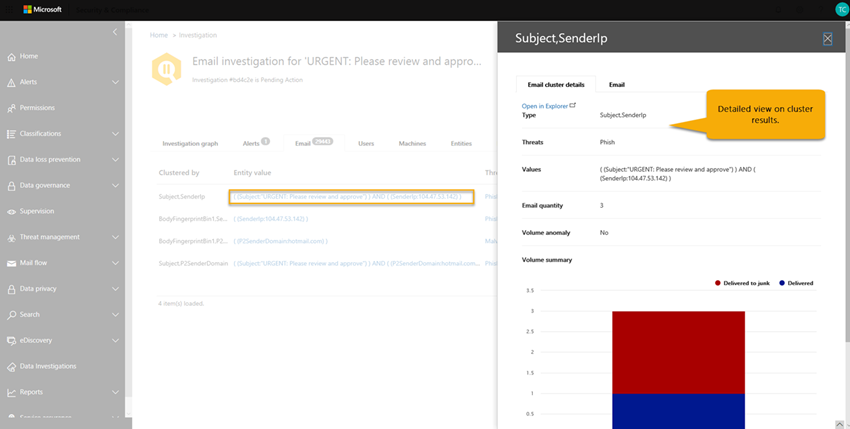

# Автоматическое исследование и ответ (AIR) с Office 365Automated Investigation and Response (AIR) with Office 365

Автоматическое исследование и ответ (AIR) (в настоящее время в общедоступном предварительном просмотре как одно из многочисленных [расследований угроз Office 365 и возможностей ответа](office-365-ti.md)) позволяет выполнять автоматическое исследование и устранение известных угроз, существующих сегодня.Automated Investigation and Response (AIR) (currently in public preview as one of many [Office 365 Threat investigation and response capabilities](office-365-ti.md)) enables you to run automated investigation and remediation to well-known threats that exist today. В этой статье приводятся общие сведения о AIR и о том, как она может помочь организациям и системам безопасности Teams, а также повысить эффективность и эффективность работы.Read this article to get an overview of AIR and how it can help your organization and security operations teams mitigate threats more effectively and efficiently. 

Дополнительные сведения о том, когда доступны функции воздушного телевидения, можно найти в [статье план Microsoft 365](https://www.microsoft.com/microsoft-365/roadmap).To learn more about when  AIR features will be available, see the [Microsoft 365 Roadmap](https://www.microsoft.com/microsoft-365/roadmap).

## ОповещенияAlerts

[Оповещения](alert-policies.md#viewing-alerts) представляют триггеры для рабочих процессов группы операций безопасности для реагирования на инциденты.[Alerts](alert-policies.md#viewing-alerts) represent triggers for security operations team workflows for incident response. Приоритизация правильного набора оповещений для изучения, а отсутствие неустраненных угроз не является проблематичным.Prioritizing the right set of alerts for investigation, while making sure no threats are unaddressed is challenging. При расследовании в оповещениях выполняются вручную, поэтому Teams должны осуществлять слежение за сущностями (например, контент, устройства и пользователей) от угроз.When investigations into alerts are performed manually, Security Operations teams must hunt and correlate entities (e.g. content, devices and users) at risk from threats. Такие задачи и рабочие процессы занимают много времени и используют несколько средств и систем.Such tasks and workflows are very time consuming and involve multiple tools and systems. В среде AIR исследование и отклики автоматизированы по ключевым угрозам безопасности и управлению угрозами, которые автоматически инициируют ответ безопасности "Playbooks".With AIR, investigation and response are automated into key security and threat management alerts that trigger your security response playbooks automatically. 

В первоначальном выпуске воздуха в апреле 2019 оповещения, созданные на основе следующих отдельных событий, будут автоматически исследованы.In the initial release of AIR in April 2019, alerts generated from following single events alert policies will be auto-investigated. 

1. Обнаружен потенциально вредоносный URL-адрес.A potentially malicious URL click was detected
2. Сообщение электронной почты, предоставленное пользователем как фишинга \*Email reported by user as phish\*
3. Сообщения электронной почты, содержащие вредоносную программу, удалена после доставки \*Email messages containing malware removed after delivery\*
4. Сообщения электронной почты, содержащие URL-адреса фишинга, удаленные после доставки \*Email messages containing phish URLs removed after delivery\*

> [!NOTE]
> Этим оповещениям назначены "информационные" уровни в соответствующих политиках оповещений в центре безопасности & соответствия требованиям, если уведомления по электронной почте отключены.These alerts have been assigned an "Informational" severity in the respective alert policies within the Security & Compliance Center with email notifications turned off. Их можно включить с помощью конфигурации политики оповещений.These can be turned on through the Alert policy configuration.

Чтобы просмотреть оповещения, в центре безопасности & соответствия требованиям выберите **оповещения** > **Просмотр оповещений**.To view alerts, in the Security & Compliance Center, choose **Alerts** > **View alerts**. Выберите оповещение, чтобы просмотреть сведения о нем, а затем воспользуйтесь ссылкой **Просмотр расследования** , чтобы перейти к соответствующему [исследованию](#investigation-graph).Select an alert to view its details, and from there, use the **View investigation** link to go to the corresponding [investigation](#investigation-graph). Обратите внимание, что по умолчанию информационные оповещения скрыты в представлении оповещений.Note that informational alerts are hidden in the alert view by default. Чтобы увидеть их, необходимо изменить фильтрацию оповещений, чтобы включить информационные оповещения.To see them, you need to change the alert filtering to include informational alerts.

Если ваша организация управляет оповещениями системы безопасности с помощью системы управления оповещениями, системы управления службами или системы безопасности и управления событиями (SIEM), вы можете отправить оповещения Office 365 в эту систему с помощью уведомления по электронной почте или через [ API действий управления Office 365](https://docs.microsoft.com/office/office-365-management-api/office-365-management-activity-api-reference).If your organization manages your security alerts through a alert management system, service management system, or Security Information and Event Management (SIEM) system, you can send Office 365 alerts to that system via either email notification or via the [Office 365 Management Activity API](https://docs.microsoft.com/office/office-365-management-api/office-365-management-activity-api-reference). Уведомления об анализе с помощью электронной почты или API будут содержать ссылки для доступа к оповещениям в центре безопасности & соответствия требованиям, что позволяет администратору безопасности быстро перейти к расследованию.The investigation alert notifications via email or API will include links to access the alerts in the Security & Compliance Center, enabling the assigned security administrator to navigate quickly to the investigation.

 

## "Playbooks" безопасностиSecurity playbooks

"Playbooks" безопасности — это внутренние политики, которые находятся в сердце автоматизации в защите от угроз Майкрософт.Security playbooks are back-end policies that are at the heart of automation in Microsoft Threat Protection. "Playbooks" безопасности, предоставляемые в среде AIR, основаны на распространенных реальных сценариях безопасности.The security playbooks provided in AIR are based on common real-world security scenarios. Стратегия безопасности запускается автоматически при активации оповещения в Организации.A security playbook is launched automatically when an alert is triggered within your organization. После срабатывания триггера оповещения связанный стратегия запускается автоматически.Once the alert triggers, the associated playbook is run automatically. В стратегия выполняется исследование со всеми связанными метаданными (в том числе сообщениями электронной почты, пользователями, субъектами, отправителями и т. д.).The playbook runs an investigation, looking at all the associated metadata (including email messages, users, subjects, senders, etc.). В зависимости от полученных результатов в стратегия воздух рекомендует набор действий, которые Группа безопасности Организации может предпринять для управления и устранения угроз.Based on the playbook's findings, AIR recommends a set of actions that your organization's security team can take to control and mitigate the threat. 

"Playbooks" по обеспечению безопасности, которые вы будете получать с помощью воздуха, предназначены для самых распространенных угроз, которые в настоящее время сталкиваются с организациями.The security playbooks you'll get with AIR are designed to tackle the most frequent threats that organizations face today. Они основываются на входных данных из операций безопасности и команд реагирования на инциденты, в том числе те, кто помогает защищать ресурсы Майкрософт и наших клиентов.They're based on input from Security Operations and Incident Response teams, including those who help defend Microsoft and our customers assets.

### Этапы безопасности "Playbooks"Security playbooks are rolling out in phases

Как часть воздуха, "Playbooks" безопасности — это этапы развертывания.As part of AIR, security playbooks are rolling out in phases

- **Этап 1 (апрель 2019)**: "Playbooks" включает рекомендации по действиям, которые администраторы безопасности просматривают и утверждают.**Phase 1 (April 2019)**: Playbooks include recommendations for actions that security administrators review and approve. Этап 1 будет включать следующие "Playbooks":Phase 1 will include the following playbooks:
    - Сообщение о phishing-атаке, сообщенное пользователемUser-reported phish message
    - URL-адрес нажмите кнопку вредоносности Change (изменить)URL click verdict change 
    - Вредоносная программа обнаружила пост-Delivery (вредоносный ZAP)Malware detected post-delivery (Malware ZAP)
    - Антифишинг обнаружил, что после доставки ZAP (фишинг ZAP)Phish detected post-delivery ZAP (Phish ZAP)
    - Ручное расследования по электронной почте (с помощью обозревателя угроз)Manual e-mail investigations (using Threat Explorer)

- **Этап 2 (вторая половина 2019)**: несколько новых усовершенствований "Playbooks" и стратегия, а также возможность администраторов безопасности настраивать безопасность "Playbooks" для автоматического выполнения определенных действий без вмешательства администратора.**Phase 2 (second half of 2019)**: Several new playbooks and playbook improvements, plus the option for security administrators to configure security playbooks to take some actions automatically without administrative interaction. 

### "Playbooks": исследование и рекомендацииPlaybooks include investigation and recommendations

Каждый стратегия включает следующие компоненты:Each playbook includes: 
- корневое исследование,a root investigation, 
- действия, предпринимаемые для определения и сопоставления других потенциальных угроз, а такжеsteps taken to identify and correlate other potential threats, and 
- Рекомендуемые действия по исправлению угроз.recommended threat remediation actions.

Каждый этап высокого уровня включает множество подшагов, которые выполняются для предоставления детальных, подробных и исчерпывающих ответов на угрозы.Each high-level step includes many sub-steps that are executed to provide a deep, detailed, and exhaustive response to threats.

## Пример: сообщение фишинга, зарегистрированное пользователем, запускает расследования стратегияExample: A user-reported phish message launches an investigation playbook

Когда пользователь в Организации отправляет сообщение электронной почты и передает его в корпорацию Майкрософт с помощью надстройки [Report Message для Outlook или Outlook Web Access](enable-the-report-message-add-in.md), отчет также отправляется в систему и отображается в проводнике в представлении, сообщенном пользователем.When a user in your organization submits an email message and reports it to Microsoft by using the [Report Message add-in for Outlook or Outlook Web Access](enable-the-report-message-add-in.md), the report is also sent to your system and is visible in Explorer in the User-reported view. Это сообщение, сообщенное пользователем, теперь запускает системное информационное оповещение, которое автоматически запускает исследование стратегия.This user-reported message now triggers a system-based informational alert, which automatically launches the investigation playbook.

Во время корневого этапа исследования различные аспекты электронного исследования оцениваются.During the root investigation phase, various aspects of the email are assessed. К ним относятся:These include:
- Определение типа угрозы, который может быть таким:A determination about what type of threat it might be;
- Отправитель;Who sent it;
- Откуда отправлено сообщение (инфраструктура отправки);Where the email was sent from (sending infrastructure);
- Указывает, были ли доставляются или заблокированы другие экземпляры электронной почты;Whether other instances of the email were delivered or blocked;
- Оценка из наших аналитик;An assessment from our analysts;
- Связан ли электронная почта со всеми известными кампаниями;Whether the email is associated with any known campaigns;
- и многое другое.and more.

По завершении корневого исследования стратегия предоставляет список рекомендуемых действий, которые необходимо выполнить для исходной электронной почты и связанных с ним сущностей.After the root investigation is complete, the playbook provides a list of recommended actions to take on the original email and entities associated with it.
  
После этого выполняются некоторые этапы расследования и исследования угроз:Next, several threat investigation and hunting steps are executed:

- Поиск похожих сообщений электронной почты в других кластерах электронной почты.Similar email messages in other email clusters are searched.
- Этот сигнал используется совместно с другими платформами, например, с помощью защитника ( [Майкрософт) ATP](https://docs.microsoft.com/windows/security/threat-protection/microsoft-defender-atp/microsoft-defender-advanced-threat-protection).The signal is shared with other platforms, such as [Microsoft Defender ATP](https://docs.microsoft.com/windows/security/threat-protection/microsoft-defender-atp/microsoft-defender-advanced-threat-protection).
- Определение, когда пользователи щелкают любые вредоносные ссылки в подозрительных сообщениях электронной почты.A determination is made on whether any users have clicked through any malicious links in suspicious email messages.
- Проверка выполняется в Office 365 Exchange Online Protection ([EOP](eop/exchange-online-protection-eop.md)) и Office 365 Advanced Threat protection ([ATP](office-365-atp.md)), чтобы проверить наличие других подобных сообщений, о которых сообщили пользователи.A check is done across Office 365 Exchange Online Protection ([EOP](eop/exchange-online-protection-eop.md)) and Office 365 Advanced Threat Protection ([ATP](office-365-atp.md)) to see if there are any other similar messages reported by users.
- Проверка того, был ли пользователь скомпрометирован.A check is done to see if a user has been compromised. Эта проверка использует сигналы в [Microsoft Cloud App Security](https://docs.microsoft.com/cloud-app-security) и [Azure Active Directory](https://docs.microsoft.com/azure/active-directory), соотнесение со всеми связанными аномалиями действий пользователей.This check leverages signals across [Microsoft Cloud App Security](https://docs.microsoft.com/cloud-app-security) and [Azure Active Directory](https://docs.microsoft.com/azure/active-directory), correlating any related user activity anomalies. 

Во время фазы Поиск риски и угрозы назначаются для различных шагов по поиску.During the hunting phase, risks and threats are assigned to various hunting steps. 

Исправление является завершающим этапом стратегия.Remediation is the final phase of the playbook. На этом этапе выполняются действия по исправлению, основанные на этапах расследования и исследования.During this phase, remediation steps are taken, based on the investigation and hunting phases. 

## Пример: администратор безопасности инициирует исследование в обозревателе угрозExample: A security administrator triggers an investigation from Threat Explorer

В дополнение к автоматическому расследованию, которое инициируется оповещением, Группа операций безопасности в Организации может инициировать автоматическое исследование из представления в [обозревателе угроз](use-explorer-in-security-and-compliance.md).In addition to automatic investigations that are triggered by an alert, your organization's security operations team can trigger an automatic investigation from a view in [Threat Explorer](use-explorer-in-security-and-compliance.md).

Например, предположим, что вы просматриваете данные в проводнике о сообщениях, сообщенных пользователями.For example, suppose that you are viewing data in Explorer about user-reported messages. Вы можете выбрать элемент в списке результатов, а затем нажать кнопку **исследовать**.You can select an item in the list of results, and then click **Investigate**.

В качестве другого примера предположим, что вы просматриваете данные о сообщениях электронной почты, обнаруженных как содержащие вредоносные программы, и обнаружено несколько сообщений электронной почты, содержащих вредоносные программы.As another example, suppose you are viewing data about email messages detected as containing malware, and there are several email messages detected as containing malware. Можно выбрать вкладку **Электронная почта** , выбрать одно или несколько сообщений электронной почты, а затем в меню **действия** выберите команду **исследовать**.You can select the **Email** tab, select one or more email messages, and then, on the **Actions** menu, select **Investigate**. 

Как и в "Playbooks", вызванных оповещением, автоматическое исследование, запущенное из представления в проводнике, включает в себя корневое исследование, действия по определению и корреляции угроз, а также Рекомендуемые действия по устранению этих угроз.Similar to playbooks triggered by an alert, automatic investigations that are triggered from a view in Explorer include a root investigation, steps to identify and correlate threats, and recommended actions to mitigate those threats.

## Начало работыGet started

Чтобы получить доступ к расследованию, как глобальный администратор Office 365, администратор безопасности или средство чтения безопасности, перейдите в центр безопасности & соответствия требованиям[https://protection.office.com](https://protection.office.com)() и войдите в систему.To access your investigations, as an Office 365 global administrator, security administrator, or security reader, go to the Security & Compliance Center ([https://protection.office.com](https://protection.office.com)) and sign in. Затем выполните одно из следующих действий.Then, do one of the following:

- В области навигации слева перейдите к \*\*\*\* > разделу оповещения**Просмотрите оповещения**, откройте одно из оповещений, связанных с исследованием, а затем щелкните ссылку **Просмотр расследования** в нижней части всплывающего меню оповещения.In the left navigation, go to **Alerts** > **View alerts**, open one of the investigation related alerts, then click the **View investigation** link at the bottom of the alert flyout. 

    илиor

- В области навигации слева перейдите к разделу **Управление** > \*\*\*\* угрозами.In the left navigation, go to **Threat management** > **Investigations**.

    илиor

- Посетите панель мониторинга управления угрозами (в центре безопасности & соответствия требованиям перейдите на**панель мониторинга** **управления** > угрозами).Visit the Threat management dashboard (In the Security & Compliance Center, go to **Threat management** > **Dashboard**).

Мини, которые будут отображаться в верхней части [панели мониторинга безопасности](security-dashboard.md).Your AIR widgets will appear across the top of the [Security Dashboard](security-dashboard.md). Выберите мини-приложение, чтобы приступить к работе.Select a widget to get started.

Вы также можете получить доступ к исследованию непосредственно из соответствующих оповещений.You may also access an investigation directly from the related Alerts.

### Автоматическое расследованиеAutomated investigations

Страница автоматизированного исследования показывает расследования Организации и их текущие состояния.The automated investigations page shows your organization's investigations and their current states.

 
  
Вы можете выполнить указанные ниже действия.You can:
- Перейти непосредственно к расследованию (выберите **идентификатор исследования**).Navigate directly to an investigation (select an **Investigation ID**).
- Примените фильтры.Apply filters. Выберите **тип расследования**, **диапазон времени**, **состояние**или их сочетание.Choose from **Investigation Type**, **Time range**, **Status**, or a combination of these.
- Экспортируйте данные в CSV-файл.Export the data to a CSV file.

Состояние расследования показывает ход выполнения анализа и действий.The investigation status indicates the progress of the analysis and actions. По мере проведения расследования состояние изменится, чтобы указать, были ли обнаружены угрозы, а также указать, были ли утверждены действия.As the investigation runs, the status will change to indicate whether threats were found, as well as indicate whether actions have been approved. 
- **Начало**работы: исследование замещается в очередь на ближайшее время.**Starting**: The investigation is queued to begin soon
- **Работает**: исследование запущено и проводит анализ**Running**: The investigation has started and is conducting its' analysis
- **Угрозы не найдены**: исследование завершено, а угроз не обнаружено**No Threats Found**: The investigation has completed its' analysis and no threats were found
- **Завершено системой**: исследование не было закрыто, и его срок действия истечет через 7 дней**Terminated By System**: The investigation was not closed and expired after 7 days
- **Ожидающее действие**: при расследовании обнаружены угрозы с рекомендуемыми действиями**Pending Action**: The investigation found threats with actions recommended
- **Обнаружены угрозы**: исследование обнаружило угрозы, но у них нет действий, доступных в среде AIR.**Threats Found**: The investigation found threats, but the threats do not have actions available within AIR
- **Исправлено**: инвестгатион завершено и было полностью исправлено (все действия были утверждены)**Remediated**: The investgation finished and was fully remediated (all actions were approved)
- **Частично исправлено**: исследование завершено, а некоторые из рекомендуемых действий были утверждены**Partially Remediated**: The investigation finished and some of the recommended actions were approved
- **Завершено пользователем**: администратор прекратил исследование**Terminated By User**: An admin terminated the investigation
- **Сбой**: во время расследования возникла ошибка, которая не позволила ему достичь завершения в случае угроз**Failed**: An error occurred during the investigation that prevented it from reaching a conclusion on threats
- Помещается в **очередь регулирования**: исследование ожидает анализа из-за ограничений системы на обработку (для защиты производительности службы)**Queued By Throttling**: The investigation is waiting for analysis due to system processing limitations (to protect service performance)
- **Прекращено путем регулирования**: в течение этого времени исследование не может быть завершено из-за того, что пройдет ограничения на обработку томов и систем.**Terminated By Throttling**: The investigation could not be completed in sufficient time due to investigation volume and system processing limitations. Вы можете повторно запустить расследование, выбрав электронную почту в проводнике и выбрав действие "исследование".You can re-trigger the investigation by selecting the email in Explorer and selecting the Investigate action.

### График расследованияInvestigation graph

Когда вы откроете конкретное исследование, отобразится страница "исследование".When you open a specific investigation, you see the investigation graph page. На этой странице показаны все различные объекты: сообщения электронной почты, пользователи (и их действия), а также устройства, которые были автоматически проверены как часть инициированного оповещения.This page shows all the different entities: email messages, users (and their activities), and devices that were automatically investigated as part of the alert that was triggered.

Вы можете выполнить указанные ниже действия.You can:
- Ознакомьтесь с визуальным обзором текущего исследования.Get a visual overview of the current investigation.
- Просмотр сводки длительности расследования.View a summary of the investigation duration.
- Выберите узел в зрительном образе, чтобы просмотреть сведения об этом узле.Select a node in the visualization to view details for that node.
- Выберите вкладку в верхней части, чтобы просмотреть сведения для этой вкладки.Select a tab across the top to view details for that tab.

### Исследование оповещенийAlert investigation

На вкладке **оповещения** вы можете просмотреть оповещения, относящиеся к расследованию.On the **Alerts** tab for an investigation, you can see alerts relevant to the investigation. Подробные сведения включают оповещение, которое инициировало исследование и другие оповещения, такие как рискованный вход, массовый пакет загрузки и т. д., которые сопоставлены с исследованием.Details include the alert that triggered the investigation and other alerts, such as risky sign-in, mass download, etc., that are correlated to the investigation. На этой странице Аналитика безопасности также может просматривать дополнительные сведения об индивидуальных оповещениях.From this page, a security analyst can also view additional details on individual alerts.

Вы можете выполнить указанные ниже действия.You can:
- Ознакомьтесь с визуальным обзором текущего триггерного оповещения и всех связанных оповещений.Get a visual overview of the current triggering alert and any associated alerts.
- Выберите оповещение в списке, чтобы открыть выпадающую страницу со сведениями об оповещениях.Select an alert in the list to open a fly-out page that shows full alert details.

### Исследование электронной почтыEmail investigation

На вкладке **Электронная почта** вы можете просмотреть все кластеры электронной почты, обнаруженные в ходе расследования.On the **Email** tab for an investigation, you can see all the clusters of email identified as part of the investigation. 

С учетом объема электронной почты, который пользователи в организации отправляют и получают, процессGiven the sheer volume of email that users in an organization send and receive, the process of 
- Кластеризация сообщений электронной почты на основе аналогичных атрибутов в заголовках, тексте, URL-адресе и вложениях сообщений;clustering email messages based on similar attributes from a message header, body, URL and attachments; 
- Отделение вредоносных сообщений электронной почты от хороших сообщений; сseparating malicious email from the good email; and 
- выполнение действий с вредоносными сообщениями электронной почтыtaking action on malicious email messages 

может занять несколько часов.can take many hours. ВОЗДУХ теперь автоматизирует этот процесс, сохраняя время и усилия группы безопасности Организации.AIR now automates this process, saving your organization's security team time and effort. 

В ходе анализа электронной почты могут быть идентифицированы два различных типа кластеров электронной почты: кластеры подобия и кластеры индикаторов.Two different types of email clusters may be identified during the email analysis step: similarity clusters, and indicator clusters. 
- Кластеры подобия — это сообщения электронной почты, которые содержат похожие атрибуты отправителя и содержимого.Similarity clusters are email messages that contain similar sender and content attributes. Эти кластеры оцениваются для вредоносного содержимого на основе полученных результатов обнаружения.These clusters are evaluated for malicious content based on the original detection findings. Кластеры электронной почты, содержащие достаточное количество обнаружений вредоносных программ, считаются вредоносными.Email clusters that contain enough malicious detections will be considered malicious.
- Кластеры индикаторов это сообщения электронной почты, содержащие один и тот же объект индикатора (хэш файла или URL-адрес) из исходного сообщения.Indicator clusters are email messages that contain the same indicator entity (file hash or URL) from the original email. Если исходная сущность файла или URL-адреса определена как вредоносная, воздух будет применять индикатор вредоносности ко всему кластеру сообщений электронной почты, содержащих эту сущность.When the original file/URL entity is identified as malicious, AIR will apply the indicator verdict to the entire cluster of email messages containing that entity. Как и в случае вредоносных программ, кластер сообщений электронной почты, содержащих этот файл, будет рассматриваться как сообщения электронной почты вредоносных программ.As a file identified as malware will mean that the cluster of email messages containing that file will be treated as malware email messages.

Цель кластеризации — найти другие связанные сообщения электронной почты, которые отправляются одним и тем же отправителем в рамках атаки или кампании.The goal of clustering is to find other related email messages that are sent by the same sender as part of an attack or a campaign.

На вкладке **Электронная почта** также отображаются элементы электронной почты, связанные с исследованием, такие как сведения электронной почты, отправленные пользователем, исходное сообщение электронной почты, сообщение электронной почты заппед из-за вредоносного и фишинга и т. д.The **Email** tab will also show email items related to the investigation, such as the user-reported email details, the original email reported, the email message(s) zapped due to malware/phish, etc.

Количество сообщений электронной почты, указанное на вкладке Электронная почта, представляет общую сумму всех сообщений электронной почты, показанных на вкладке **Электронная почта** . Так как сообщения электронной почты будут находиться в нескольких кластерах, фактическим общим количеством сообщений электронной почты, которые определяются (и обозначаются действиями по исправлению), будет считаться количество уникальных сообщений электронной почты, присутствующих во всех кластерах и электронной почте исходных получателей. писем.The email count identified on the email tab currently represents the sum total of all email messages shown on the **Email** tab. Since email messages will be present in multiple clusters, the actual total count of email messages identified (and affected by remediation actions) will be the count of unique email messages present across all of the clusters and original recipients' email messages. 

Как проводник, так и AIR проверяют сообщения электронной почты для каждого получателя, так как вердиктс безопасности, действия и места доставки могут различаться для отдельных получателей.Both Explorer and AIR count email messages on a per recipient basis, since the security verdicts, actions, and delivery locations will vary on a per recipient basis. Таким образом, исходное сообщение, отправленное трем пользователям, будет считаться общим количеством трех сообщений электронной почты, а не одним сообщением.Thus an original email sent to three users will count as a total of three email messages instead of one email. Примечание возможны случаи, когда электронная почта рассчитывается два или более раз, так как у электронной почты может быть несколько действий, и после выполнения всех действий может быть несколько копий сообщения.Note there may be cases where an email gets counted two or more times, since the email may have multiple actions on it and there may be multiple copies of the email once all actions occur. Например, сообщение электронной почты, которое обнаруживается при доставке вредоносных программ, может привести к заблокированной (помещенной в карантину) электронной почте и замененному письму (файл угроз заменяется на файл предупреждения, затем доставляется в почтовый ящик пользователя).For example a malware email that is detected at delivery may result in both a blocked (quarantined) email and a replaced email (threat file replaced with an warning file, then delivered to user's mailbox). Так как в системе буквально две копии электронной почты, они могут быть учтены в счетчиках кластера.Since there are literally two copies of the email in the system - these may both be counted in cluster counts. 

Счетчики электронной почты рассчитываются во время расследования, а некоторые счетчики пересчитываются при открытии всплывающих меню расследования (на основе базового запроса).Email counts are calculated at the time of the investigation and some counts are re-calculated when you open investigation flyouts (based on an underlying query). Счетчики электронной почты, показанные для кластеров электронной почты на вкладке Электронная почта и значение количества электронной почты, отображаемое в всплывающем меню кластера, рассчитываются на время проведения расследования.The email counts shown for the email clusters on the email tab and the email quantity value shown on cluster flyout are calculated at the time of investigation. Количество сообщений электронной почты, отображаемое в нижней части вкладки сообщение в всплывающем окне кластера, а также количество сообщений электронной почты, отображаемых в проводнике, будет показывать сообщения электронной почты, полученные после первоначального анализа.The email count shown at the bottom of the email tab of the cluster flyout, as well as the count of email messages shown in Explorer will reflect email messages received after the investigation's initial analysis. Таким образом, в кластере электронной почты с исходным количеством из 10 сообщений электронной почты будет отображаться список, состоящего из 15, при достижении 5 почтовых сообщений между этапом анализа и моментом, когда администратор изучает расследования.Thus an email cluster that shows an original quantity of 10 email messages would show an email list total of 15 when 5 more email messages arrive between the investigation analysis phase and when the admin reviews the investigation. Отображение обоих счетчиков в разных представлениях позволяет указать влияние на электронную почту на время проведения расследования и текущее влияние на время, которое будет выполняться при исправлении.Showing both counts in different views is done to indicate the email impact at the time of investigation and the current impact up until the time that remediation is run.

В качестве примера рассмотрим следующий сценарий.As an example, consider the following scenario. Первый кластер из трех сообщений электронной почты был признан фишингом.The first cluster of three email messages were deemed to be phish. Существует другой кластер похожих сообщений с тем же IP-адресом и темой, которые считаются вредоносными, так как некоторые из них были идентифицированы как фишинг во время первоначального обнаружения.Another cluster of similar messages with the same IP and subject was found and considered malicious, as some of them were identified as phish during initial detection. 

Вы можете выполнить указанные ниже действия.You can:
- Получение визуального обзора текущих результатов кластера и обнаруженных угроз.Get a visual overview of the current clustering results and threats found.
- Щелкните объект кластера или список угроз, чтобы открыть выпадающую страницу с подробными сведениями об оповещениях.Click a cluster entity or a threat list to open a fly-out page that shows the full alert details.
- Для дальнейшего изучения кластера электронной почты щелкните ссылку "открыть в проводнике" в верхней части вкладки "сведения о кластере электронной почты".Further investigate the email cluster by clicking the 'Open in Explorer' link at the top of the 'Email cluster details' tab

\* Примечание. в контексте электронной почты в ходе расследования вы можете увидеть зону угроз громкости.\*Note: In the context of email, you may see a volume anomaly threat surface as part of the investigation. Аномалия тома указывает на копилку аналогичных сообщений электронной почты в сравнении с более ранними периодами события.A volume anomaly indicates a spike in similar email messages around the investigation event time compared to earlier timeframes. Этот пик в почтовых сообщениях с аналогичными характеристиками (например, субъектом и доменом отправителя, подобия основного текста и IP-адреса отправителя) типичен при запуске кампаний по электронной почте или атак.This spike in email traffic with similar characteristics (e.g. subject and sender domain, body similarity and sender IP) is typical of the start of email campaigns or attacks. Однако массовые, Нежелательная почта и легальные кампании электронной почты обычно используют эти характеристики.However, bulk, spam, and legitimate email campaigns commonly share these characteristics. Аномалии тома представляют потенциальную угрозу, и они могут быть менее серьезными по сравнению с вредоносными программами или антифишингом, которые определены с помощью антивирусных ядер, детонации или вредоносной репутации.Volume anomalies represent a potential threat, and accordingly could be less severe compared to malware or phish threats that are identified using anti-virus engines, detonation or malicious reputation.

### Исследование пользователейUser investigation

На вкладке **Пользователи** отображаются все пользователи, указанные в ходе расследования.On the **Users** tab, you can see all the users identified as part of the investigation. Пользователи будут отображаться в расследовании при возникновении события или свидетельствует о том, что пользователь может быть уязвим или скомпрометирован.Users will appear in the investigation when there is an event or indication that the user may be affected or compromised.

Например, на следующем изображении в ЭФИРе определены индикаторы компромиссов и аномалий на основе созданного правила для папки "Входящие".For example, in the following image, AIR has identified indicators of compromise and anomalies based on a new inbox rule that was created. Дополнительные сведения (свидетельства) об анализе доступны через подробные представления на этой вкладке. Индикаторы компромиссов и аномалий могут также включать обнаружение аномалий в [Microsoft Cloud App Security](https://docs.microsoft.com/cloud-app-security).Additional details (evidence) of the investigation are available through detailed views within this tab. Indicators of compromise and anomalies may also include anomaly detections from [Microsoft Cloud App Security](https://docs.microsoft.com/cloud-app-security).

Вы можете выполнить указанные ниже действия.You can:
- Получение визуального обзора идентифицированных результатов пользователей и обнаруженных рисков.Get a visual overview of identified user results and risks found.
- Выберите пользователя, чтобы открыть выпадающую страницу с полными сведениями о предупреждениях.Select a user to open a fly-out page that shows the full alert details.

### Машинный расследованийMachine investigation

На вкладке **машины** отображаются все компьютеры, указанные в ходе расследования.On the **Machines** tab, you can see all the machines identified as part of the investigation. 

В рамках расследования воздух сопоставляет угрозы электронной почты с устройствами.As part of the investigation, AIR correlates email threats to devices. Например, исследование передает вредоносный хэш-файл в [пакет ATP](https://docs.microsoft.com/windows/security/threat-protection/microsoft-defender-atp/microsoft-defender-advanced-threat-protection
) для анализа в Майкрософт.For example, an investigation passes a malicious file hash across to [Microsoft Defender ATP](https://docs.microsoft.com/windows/security/threat-protection/microsoft-defender-atp/microsoft-defender-advanced-threat-protection
) to investigate. Это позволяет автоматически исследовать важные компьютеры для пользователей, чтобы убедиться в том, что угрозы адресованы как в облаке, так и в конечных точках.This allows for automated investigation of relevant machines for your users, to help ensure that threats are addressed both in the cloud and across your endpoints. 

Вы можете выполнить указанные ниже действия.You can:
- Получение визуального обзора текущих компьютеров и обнаруженных угроз.Get a visual overview of the current machines and threats found.
- Выберите компьютер, чтобы открыть представление в связанном расследовании [Microsoft Defender ATP](https://docs.microsoft.com/windows/security/threat-protection/microsoft-defender-atp/automated-investigations) в центре безопасности защитника Майкрософт.Select a machine to open a view that into the related [Microsoft Defender ATP investigations](https://docs.microsoft.com/windows/security/threat-protection/microsoft-defender-atp/automated-investigations) in the Microsoft Defender Security Center.

### Исследование сущностейEntity investigation

На вкладке **сущности** можно увидеть все сущности, определенные в ходе расследования.On the **Entities** tab, you can see all the entities identified as part of the investigation. 

Здесь вы можете просмотреть изученные объекты и сведения о типах сущностей, таких как сообщения электронной почты, кластеры, IP-адреса, пользователи и другие.Here, you can see the investigated entities and details of the types of entities, such as email messages, clusters, IP addresses, users, and more. Вы также можете узнать, сколько сущностей было проанализировано, а также о угрозах, которые были связаны с каждым из них.You can also see how many entities were analyzed, and the threats that were associated with each. 

Вы можете выполнить указанные ниже действия.You can:
- Получение визуального обзора обнаруженных сущностей и угроз.Get a visual overview of the investigation entities and threats found.
- Выберите сущность, чтобы открыть выпадающую страницу со сведениями о связанном объекте.Select an entity to open a fly-out page that shows the related entity details.

### Журнал стратегияPlaybook log

На вкладке **Журнал** можно просмотреть все действия стратегия, произошедшие во время расследования.On the **Log** tab, you can see all the playbook steps that have occurred during the investigation. Журнал записывает полный набор всех действий, выполненных средствами автоматического исследования Office 365, в составе воздуха.The log captures a complete inventory of all actions completed by Office 365 auto-investigation capabilities as part of AIR. Он предоставляет четкое представление обо всех действиях, выполняемых, включая само действие, описание и продолжительность фактического от начала до конца.It provides a clear view of all the steps taken, including the action itself, a description, and the duration of the actual from start to finish. 

Вы можете выполнить указанные ниже действия.You can:
- Ознакомьтесь с визуальным обзором выполненных действий по стратегия.Get see a visual overview of the playbook steps taken.
- Экспорт результатов в CSV-файл.Export the results to a CSV file.
- Отфильтровать представление.Filter the view.

### Рекомендуемые действияRecommended actions

На вкладке **действия** отображаются все действия по стратегия, Рекомендуемые для исправления после завершения расследования.On the **Actions** tab, you can see all the playbook actions that are recommended for remediation after the investigation has completed. 

Действия захватывают действия, которые корпорация Майкрософт рекомендует предпринять в конце расследования.Actions capture the steps Microsoft recommends you take at the end of a investigation. Действия по исправлению можно выполнить здесь, выбрав одно или несколько действий.You can take remediation actions here by selecting one or more actions. Чтобы \*\*\*\* начать исправление, нажмите кнопку одобрить.Clicking **Approve** will allow remediation to begin. (Необходимы соответствующие разрешения. для запуска действий из проводника и AIR требуется роль "Поиск и очистка".(Appropriate permissions are needed - the 'Search And Purge' role is required to run actions from Explorer and AIR). Например, средство чтения безопасности может просматривать действия, но не утверждать их.For example, a Security Reader can view actions but not approve them. Note — вам не нужно утверждать каждое действие.Note - you do not have to approve every action. Если вы не согласны с рекомендуемым действием или ваша организация не выбирает определенные типы действий, можно выбрать отклонить действия или просто \*\*\*\* проигнорировать их и не предпринимать никаких действий.If you do not agree with the recommended action or your organization does not choose certain types of actions - then you can either choose to **Reject** the actions or simply ignore them and take no action. Утверждение и/или отклонение всех действий позволит провести полное закрытие, в то время как некоторые действия не будут завершены, в результате чего состояние расследования изменяется на частично исправленное.Approving and/or rejecting all actions will let the investigation fully close, while leaving some actions incomplete will result in the investigation status changing to a partially remediated state.

Вы можете выполнить указанные ниже действия.You can:
- Ознакомьтесь с визуальным обзором действий, рекомендованных для стратегия.Get a visual overview of the playbook-recommended actions.
- Выберите одно или несколько действий.Select a single action or multiple actions.
- Утверждение или отклонение рекомендуемых действий с комментариями.Approve or reject recommended actions with comments.
- Экспорт результатов в CSV-файл.Export the results to a CSV file.
- Отфильтровать представление.Filter the view.

## Как получить воздухHow to get AIR

В настоящее время возможности Office 365 AIR доступны в предварительной версии.Currently, Office 365 AIR features are in preview. Если это возможно, функции AIR Office 365 будут включены в следующие подписки:When generally available, Office 365 AIR features will be included in the following subscriptions:

- Microsoft 365 корпоративный E5Microsoft 365 Enterprise E5
- Office 365 корпоративный E5Office 365 Enterprise E5
- Защита от угроз МайкрософтMicrosoft Threat Protection
- Office 365 Advanced Threat protection (план 2)Office 365 Advanced Threat Protection Plan 2

Для получения дополнительных сведений о доступности функций посетите [план Microsoft 365](https://www.microsoft.com/microsoft-365/roadmap).To learn more about feature availability, visit the [Microsoft 365 Roadmap](https://www.microsoft.com/microsoft-365/roadmap).
