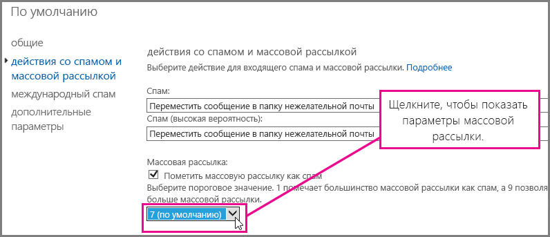
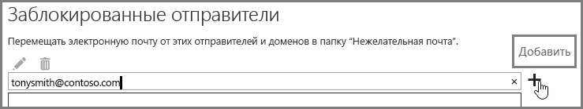

## <a name="customize-the-office-365-anti-spam-filter-with-these-settings"></a>Параметры для настройки фильтра нежелательной почты Office 365

Администратор может использовать ряд параметров фильтра нежелательной почты Office 365, чтобы предотвратить попадание спама в папку "Входящие" пользователя. При использовании указанных здесь параметров фильтр нежелательной почты Office 365 научится лучше блокировать спам и избегать ошибочных результатов. В этом контексте под ошибочными результатами подразумевается попадание спама или других нежелательных сообщений в папку "Входящие" пользователя.
  
### <a name="block-ip-addresses-with-a-connection-filter"></a>Блокирование IP-адресов с помощью фильтра подключений

Настройте фильтр нежелательной почты Office 365, добавив IP-адрес отправителя в список заблокированных IP-адресов фильтра подключений.
  
1. Получите заголовки сообщения, которое требуется блокировать в почтовом клиенте, например Outlook или Outlook в Интернете (ранее называвшемся Outlook Web App), как описано в статье [Приложение Message Header Analyzer](https://go.microsoft.com/fwlink/p/?LinkId=306583).
    
2. Найдите IP-адрес после тега CIP в заголовке X-Forefront-Antispam-Report с помощью [анализатора заголовков сообщений](https://testconnectivity.microsoft.com/?tabid=mha) или вручную. 
    
3. Добавьте IP-адрес в список заблокированных IP-адресов, выполнив действия, описанные в разделе "Изменение политики фильтров подключений по умолчанию с помощью Центра администрирования Exchange" статьи [Настройка политики фильтров подключений](https://technet.microsoft.com/ru-RU/library/jj200718%28v=exchg.150%29.aspx).
    
### <a name="block-bulk-mail-with-mail-flow-rules-transport-rules-or-the-spam-filter"></a>Блокирование массовых рассылок с помощью правил потока обработки почты (правил транспорта) или фильтра нежелательной почты

Вам часто приходит спам в виде массовых рассылок, например информационных бюллетеней или рекламы? Вы можете настроить фильтр нежелательной почты в Office 365, если вы [используете правила потока обработки почты для настройки фильтрации массовых рассылок](use-transport-rules-to-configure-bulk-email-filtering.md) или включите **массовые рассылки** в [расширенных параметрах фильтрации нежелательной почты](advanced-spam-filtering-asf-options.md). В Центре администрирования Exchange сначала выберите **Защита** \> **Фильтр контента**, а затем дважды щелкните нужную политику фильтра. Нажмите **Действия со спамом и массовыми рассылками**, чтобы настроить параметры, как показано ниже. 
  

  
### <a name="block-email-spam-using-spam-filter-block-lists"></a>Блокирование спама с помощью списков блокировки для фильтра нежелательной почты


  [Настройте политики фильтра нежелательной почты](https://technet.microsoft.com/ru-RU/library/jj200684%28v=exchg.150%29.aspx), чтобы добавить адрес или домен отправителя в список заблокированных отправителей или доменов. Сообщения с адресов и доменов из списков блокировки для фильтра нежелательной почты отмечаются как спам. 
  
## <a name="email-users-can-also-help-ensure-that-false-negative-and-email-spam-is-blocked-with-office-365-spam-filter"></a>Пользователи электронной почты также могут обеспечить блокирование ошибочно разрешенных нежелательных сообщений с помощью фильтра нежелательной почты Office 365

Обеспечить защиту от спама в Office 365, избегая ложных отрицательных результатов, будет проще, если пользователи добавят адрес отправителя спама в свои списки заблокированных отправителей в [Outlook](https://go.microsoft.com/fwlink/p/?LinkId=270065) или [Outlook в Интернете](https://go.microsoft.com/fwlink/p/?LinkId=294862). В Outlook в Интернете сначала выберите **Параметры** \> **Параметры** \> **Блокировка или разрешение**, а затем добавьте адрес в список **Заблокированные отправители**, как показано ниже. 
  

  
> [!NOTE]
> Дополнительные сведения о списках надежных отправителей см. в статье [Списки надежных и заблокированных отправителей в Exchange Online](https://technet.microsoft.com/ru-RU/library/dn133608%28v=exchg.150%29.aspx). 
  
## <a name="eop-only-customers-set-up-directory-synchronization"></a>Для клиентов с подпиской только на EOP: настройка синхронизации каталогов

Избежать ложных отрицательных результатов будет проще, если вы синхронизируете параметры пользователей со службой путем синхронизации службы каталогов, чтобы гарантировать, что заблокированные отправители учитываются. Дополнительные сведения см. в разделе "Управление почтовыми пользователями с помощью синхронизации службы каталогов" статьи "Управление почтовыми пользователями в EOP".
  
## <a name="eop-only-customers-who-are-not-using-directory-synchronization"></a>Для клиентов, использующих только EOP без синхронизации службы каталогов

Служба EOP учитывает пользовательские списки надежных и заблокированных отправителей, если доступ к этой информации предоставлен службе. Если вы пользуетесь EOP и Outlook, но у вас не настроена синхронизация службы каталогов для синхронизации пользователей с Office 365, то вы все равно можете останавливать доставку сообщений в папку "Входящие" пользователя, используя заблокированных отправителей. Однако вам может потребоваться настроить дополнительные правила потока обработки почты в Exchange в следующих ситуациях:
  
- Если сообщение проходит обычную фильтрацию нежелательной почты в EOP, после чего доставляется на локальный сервер Exchange Server, а EOP назначает сообщению вероятность нежелательной почты 1–4 (не спам), то локальный список заблокированных отправителей пользователя переопределит вывод фильтра нежелательной почты EOP, доставив сообщение в папку нежелательной почты.
    
- Если правило потока обработки почты Exchange назначило сообщению в EOP вероятность нежелательной почты -1, либо IP-адрес или домен указаны в вашем списке разрешений, то вероятность нежелательной почты распространяется на локальный сервер Exchange с помощью соединителей. В этом случае пользовательский список заблокированных отправителей не применяется. Чтобы изменить это, вы можете создать локальное правило потока обработки почты, которое задает вероятность нежелательной почты 0. В результате Outlook начнет применять локальный пользовательский список заблокированных отправителей.
    
**Настройка правила для потока обработки почты, останавливающего доставку сообщений в папку "Входящие" пользователя с помощью списка заблокированных отправителей**
  
1. Откройте командную консоль Exchange на локальном сервере. Сведения о том, как открыть эту консоль в локальной организации Exchange, см. в статье [Запуск командной консоли Exchange](https://technet.microsoft.com/library/dd638134%28v=exchg.160%29.aspx).
    
2. Выполните следующую команду, чтобы направлять нежелательные сообщения с отфильтрованным содержимым в папку нежелательной почты для обновления вероятности нежелательной почты для каждого сообщения с вероятностью –1:
    
  ```
  New-TransportRule "NameForRule" -HeaderContainsMessageHeader "X-Forefront-Antispam-Report" -HeaderContainsWords "SCL:-1" -SetSCL 0
  ```

    На локальном сервере Exchange Server задана вероятность нежелательной почты 0, поэтому сообщения, не являющиеся спамом, будут доставляться в папку "Входящие" пользователей, но локальный список заблокированных отправителей по-прежнему сможет отправлять их в папку нежелательной почты. Если вы используете карантин спама в EOP, все равно существует вероятность, что сообщения от отправителей из пользовательского списка разрешений будут определены как спам и отправлены в карантин. Однако если вы используете папку нежелательной почты в локальном почтовом ящике, это позволит доставлять сообщения от надежных отправителей в папку "Входящие".

> [!WARNING]
> Если вы используете правило потока обработки почты, меняющее значение вероятности нежелательной почты на 0 (или любое другое значение, кроме –1), то к сообщению будут применяться все функции Outlook для защиты от нежелательной почты. Это означает, что будут учитываться списки блокировки и разрешений, но в то же время сообщения, не включающие адреса из списков блокировки и разрешений, могут быть отмечены как спам при обработке фильтров нежелательной почты на стороне клиента. Если вы хотите, чтобы Outlook обрабатывал списки заблокированных или надежных отправителей, но не использовал фильтр нежелательной почты на стороне клиента, необходимо задать параметр "Без автоматической фильтрации" в параметрах нежелательной почты Outlook. Параметр "Без автоматической фильтрации" используется по умолчанию в последних версиях Outlook, но следует убедиться, что он включен, чтобы гарантировать, что фильтр нежелательной почты на стороне клиента не применяется к сообщениям. Администратор может принудительно отключить фильтр нежелательной почты в Outlook, выполнив действия, описанные в статье [Outlook: параметр политики для отключения пользовательского интерфейса и механизма фильтрации нежелательной почты](https://support.microsoft.com/en-us/kb/2180568).
  
## <a name="see-also"></a>См. также

[Защита от спама электронной почты в Office 365](anti-spam-protection.md)
  
[Предотвращение ложных срабатываний фильтра нежелательной почты с помощью списка надежных отправителей или других средств](prevent-email-from-being-marked-as-spam.md)
