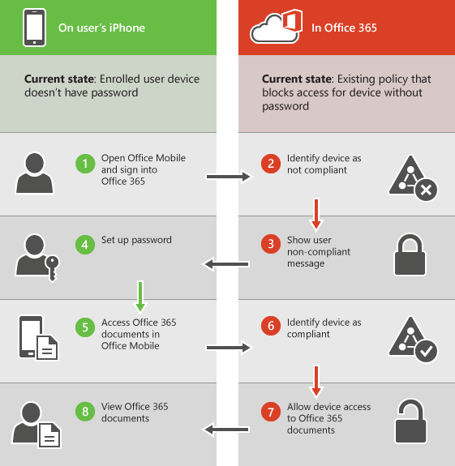

# Возможности встроенной функции управления мобильными устройствами для Office 365Capabilities of built-in Mobile Device Management for Office 365

Управление устройствами Mobile для Office 365 может помочь защиты и управления мобильных устройств как iPhone, iPads, Androids и ОС Windows Phone, лицензированных пользователей Office 365 в вашей организации. Политики управления мобильных устройств можно создать с помощью параметров, которые могут помочь проконтролировать доступ к электронной почте вашей организации Office 365 и документам для поддерживаемых мобильных устройств и приложений. Если устройство кражи или, можно удаленно Очистка устройства для удаления конфиденциальных данных организации.Mobile Device Management for Office 365 can help you secure and manage mobile devices like iPhones, iPads, Androids, and Windows Phones used by licensed Office 365 users in your organization. You can create mobile device management policies with settings that can help control access to your organization's Office 365 email and documents for supported mobile devices and apps. If a device is lost or stolen, you can remotely wipe the device to remove sensitive organizational information.
    
Требуется больше функциональных возможностей, чем включен в MDM для Office 365? Имеет ли Microsoft Intune, что вам нужно: [Выбор между MDM для Office 365 и Microsoft Intune](choose-between-mdm-and-intune.md).Need more functionality than is included in MDM for Office 365? See if Microsoft Intune has what you need: [Choose between MDM for Office 365 and Microsoft Intune](choose-between-mdm-and-intune.md).
  
## Поддерживаемые устройстваSupported devices

MDM для Office 365 можно использовать для защиты и управления следующие типы устройств.You can use MDM for Office 365 to secure and manage the following types of devices.
  
- Windows Phone 8.1 +Windows Phone 8.1+
    
- iOS 7.1 и более поздней версииiOS 7.1 or later versions
    
- Android 4 и более поздний версииAndroid 4 or later versions
    
- Windows 8.1\*Windows 8.1\*
    
- Windows 8.1 RT\*Windows 8.1 RT\*
    
- Windows 10\*\*Windows 10\*\*
    
- Windows 10 Mobile\*\*Windows 10 Mobile\*\*
    
\*Управление доступом для устройств Windows 8.1 и Windows 8.1 RT ограничено Exchange ActiveSync.\* Access control for Windows 8.1 and Windows 8.1 RT devices is limited to Exchange ActiveSync.
  
\*\*Требуется быть присоединен к Azure Active Directory и участвуют в службе управления мобильного устройства из вашей организации.\*\* Requires the device to be joined to Azure Active Directory and be enrolled in the mobile device management service of your organization.
  
Если пользователи в вашей организации используется мобильных устройств, которые не поддерживают управление устройствами Mobile для Office 365, можно заблокировать Exchange ActiveSync приложения электронной почты Office 365 для этих устройств, чтобы защитить данные вашей организации. Действия для блокировки Exchange ActiveSync: видеть [Управление параметрами доступа устройства](manage-device-access-settings.md).If people in your organization use mobile devices that aren't supported by Mobile Device Management for Office 365, you might want to block Exchange ActiveSync app access to Office 365 email for those devices, to help make your organization's data more secure. Steps for blocking Exchange ActiveSync: See [Manage device access settings](manage-device-access-settings.md).
  
## Управление доступом к электронной почте Office 365 и документамAccess control for Office 365 email and documents

Поддерживаемые приложения для различных мобильных устройств в следующей таблице будет предлагать пользователю для регистрации в MDM для Office 365 отсутствия мобильного устройства управления политику, применяемую к устройству пользователя и пользователь не участвуют ранее устройства. Если устройство пользователя не соответствует с политикой, в зависимости от того, как можно настроить политики, пользователь может быть заблокирован доступ к ресурсам Office 365 в таких приложениях или они могут иметь доступ, но сообщает нарушение политики Office 365.The supported apps for the different types of mobile devices in the following table will prompt users to enroll in MDM for Office 365 where there is a new mobile device management policy that applies to a user's device and the user hasn't previously enrolled the device. If a user's device doesn't comply with a policy, depending on how you set the policy up, a user might be blocked from accessing Office 365 resources in these apps, or they might have access but Office 365 will report a policy violation.
  
||**Windows Phone 8.1 +****Windows Phone 8.1+**|**iOS 7.1+****iOS 7.1+**|**Android 4 и более поздние версии****Android 4+**|
|:-----|:-----|:-----|:-----|
|**Exchange****Exchange**   Exchange ActiveSync включает в себя встроенные электронной почты и приложения сторонних производителей, как TouchDown, использующих версии Exchange ActiveSync 14.1 или более поздней версии.Exchange ActiveSync includes built-in email and third-party apps, like TouchDown, that use Exchange ActiveSync Version 14.1 or later.    |Exchange ActiveSyncExchange ActiveSync    Почта ExchangeExchange Mail    |Exchange ActiveSyncExchange ActiveSync    ПочтаMail    |Exchange ActiveSyncExchange ActiveSync    Электронная почтаEmail    |
|**Office** и **OneDrive для бизнеса****Office** and **OneDrive for Business**   |Нет поддерживаемых приложенийNo supported apps    |OutlookOutlook    OneDriveOneDrive    WordWord    ExcelExcel    PowerPointPowerPoint    |**На телефонах и планшетных ПК:****On phones and tablets:**   OutlookOutlook    OneDriveOneDrive    WordWord    ExcelExcel    PowerPointPowerPoint    **Только на телефонах****On phones only:**   Office MobileOffice Mobile    |
   
> [!NOTE]
>  Поддержка операций ввода-вывода 7.1 и более поздних версий включает в себя iPhone и iPad устройств. > Управление устройствами BlackBerry не поддерживается системой управления мобильных устройств для Office 365. Использование BlackBerry Business Cloud Services (BBCS) с BlackBerry для управления устройствами BlackBerry. > Пользователи не будет предложено регистрация и не быть заблокирован или действий нарушение политики с при использовании браузеров мобильных устройств для доступа к сайтам Office 365 SharePoint, документов в Office Online или электронной почты в Outlook Web App.Support for iOS 7.1 and later versions includes iPhone and iPad devices. >  Management of BlackBerry devices isn't supported by Mobile Device Management for Office 365. Use BlackBerry Business Cloud Services (BBCS) from BlackBerry to manage BlackBerry devices. >  Users won't be prompted to enroll and won't be blocked or reported for policy violation if they use the mobile browser to access Office 365 SharePoint sites, documents in Office Online, or email in Outlook Web App. 
  
На следующей схеме показано, что происходит при входе пользователя с помощью нового устройства в систему приложения, что поддерживает доступ элемент управления с MDM для Office 365. Пользователь блокируется доступ к ресурсам Office 365 в приложении, пока они зарегистрировать свое устройство.The following diagram shows what happens when a user with a new device signs in to an app that supports access control with MDM for Office 365. The user is blocked from accessing Office 365 resources in the app until they enroll their device.
  

  
> [!NOTE]
> Политики и правила доступа, созданные в MDM для Office 365 переопределяют политики почтовых ящиков мобильных устройств Exchange ActiveSync и правила доступа устройств, созданные в центре администрирования Exchange. После регистрации устройство в MDM для Office 365, любые политики почтовых ящиков мобильных устройств Exchange ActiveSync или правила доступа к устройству, применяемые к устройства будет игнорироваться. Чтобы узнать больше о Exchange ActiveSync, обратитесь к разделу [Exchange ActiveSync в Exchange Online](https://go.microsoft.com/fwlink/p/?LinkId=524380).Policies and access rules created in MDM for Office 365 will override Exchange ActiveSync mobile device mailbox policies and device access rules created in the Exchange admin center. After a device is enrolled in MDM for Office 365, any Exchange ActiveSync mobile device mailbox policy or device access rule applied to the device will be ignored. To learn more about Exchange ActiveSync, see [Exchange ActiveSync in Exchange Online](https://go.microsoft.com/fwlink/p/?LinkId=524380). 
  
## Параметры политики для мобильных устройствPolicy settings for mobile devices

При создании политики для блокировки доступа с определенных параметров включен, пользователи будут блокироваться доступ к ресурсам Office 365 при использовании поддерживаемые приложения, которая указана в [контроля доступа для электронной почты Office 365 и документов](#access-control-for-office-365-email-and-documents). Параметры, которые можно заблокировать пользователям доступ к ресурсам Office 365, в следующих разделах:If you create a policy to block access with certain settings turned on, users will be blocked from accessing Office 365 resources when using a supported app that is listed in [Access control for Office 365 email and documents](#access-control-for-office-365-email-and-documents). The settings that can block users from accessing Office 365 resources are in these sections:
  
- БезопасностьSecurity
    
- ШифрованиеEncryption
    
- Взлом устройстваJail broken
    
- Управляемый профиль электронной почтыManaged email profile
    
Например на следующей схеме показана, что происходит, когда пользователь с зарегистрированных устройства не соответствующий стандарту параметр безопасности в политике управления мобильное устройство, которое применяется к их устройства. Пользователь входит в приложение, что поддерживает доступ элемент управления с MDM для Office 365. Они блокируется доступ к ресурсам Office 365 в приложении, пока не соответствует свои устройства с уровнем безопасности.For example, the following diagram shows what happens when a user with an enrolled device isn't compliant with a security setting in a mobile device management policy that applies to their device. The user signs in to an app that supports access control with MDM for Office 365. They are blocked from accessing Office 365 resources in the app until their device complies with the security setting.
  

  
В следующих разделах перечислены параметры политики, которые можно использовать для защиты и управления мобильных устройств, подключающихся к ресурсам Office 365 вашей организации.The following sections list the policy settings you can use to help secure and manage mobile devices that connect to your organization's Office 365 resources. 
  
### Параметры безопасностиSecurity settings

|**Имя параметра****Setting name**|**Windows Phone 8.1 +****Windows Phone 8.1+**|**iOS 7.1+****iOS 7.1+**|**Android 4 и более поздние версии****Android 4+**|**Samsung Нокса****Samsung Knox**|
|:-----|:-----|:-----|:-----|:-----|
|Требование ввести парольRequire a password    |✔✔    |✔✔    |✔✔    |✔✔    |
|Запретить простой парольPrevent simple password    |✔✔    |✔✔    |✖✖    |✖✖    |
|Запрос алфавитно-цифрового пароляRequire an alphanumeric password    |✔✔    |✔✔    |✖✖    |✖✖    |
|Минимальная длина пароляMinimum password length    |✔✔    |✔✔    |✔✔    |✔✔    |
|Количество неудачных попыток входа перед очисткой устройстваNumber of sign-in failures before device is wiped    |✔✔    |✔✔    |✔✔    |✔✔    |
|Минут простоя до блокировки устройстваMinutes of inactivity before device is locked    |✔✔    |✔✔    |✔✔    |✔✔    |
|Срок действия пароля (дней)Password expiration (days)    |✔✔    |✔✔    |✔✔    |✔✔    |
|Журнал паролей и предотвращение повторного использованияRemember password history and prevent reuse    |✔✔    |✔✔    |✔✔    |✔✔    |
   
### Параметры шифрования.Encryption settings

|**Имя параметра****Setting name**|**Windows Phone 8.1 +****Windows Phone 8.1+**|**iOS 7.1+****iOS 7.1+**|**Android 4 и более поздние версии****Android 4+**|**Samsung Нокса****Samsung Knox**|
|:-----|:-----|:-----|:-----|:-----|
|Требовать шифрование данных на устройствахRequire data encryption on devices    |На устройстве Windows Phone 8.1 уже используется шифрование; отмена шифрования невозможнаWindows Phone 8.1 is already encrypted and cannot be unencrypted    |✖✖    |✔✔    |✔\*✔\*    |
   
\*С Нокса Samsung можно также Требовать шифрование карты памяти.\* With Samsung Knox, you can also require encryption on storage cards.
  
### Установка параметров для взломанного устройстваJail broken setting

|**Имя параметра****Setting name**|**Windows Phone 8.1 +****Windows Phone 8.1+**|**iOS 7.1+****iOS 7.1+**|**Android 4 и более поздние версии****Android 4+**|**Samsung Нокса****Samsung Knox**|
|:-----|:-----|:-----|:-----|:-----|
|Устройство невозможно взломать или получить на нем доступ к корневому каталогуDevice cannot be jail broken or rooted    |✖✖    |✔✔    |✔✔    |✔✔    |
   
### Управляемый параметр профиля электронной почтыManaged email profile option

Следующий параметр можно заблокировать пользователям доступ к своей электронной почте Office 365, если при использовании профиль созданной вручную по электронной почте. Пользователи на устройствах iOS необходимо удалить их профиль созданной вручную по электронной почте, может получить доступ к своей электронной почте. После их удаления профиля, новый профиль автоматически создается на устройстве.The following option can block users from accessing their Office 365 email if they're using a manually created email profile. Users on iOS devices must delete their manually created email profile before they can access their email. After they delete the profile, a new profile will be automatically created on the device.
  
|**Имя параметра****Setting name**|**Windows Phone 8.1 +****Windows Phone 8.1+**|**iOS 7.1+****iOS 7.1+**|**Android 4 и более поздние версии****Android 4+**|**Samsung Нокса****Samsung Knox**|
|:-----|:-----|:-----|:-----|:-----|
|Управление профилем электронной почтыEmail profile is managed    |✖✖    |✔✔    |✖✖    |✖✖    |
   
### Параметры облакаCloud settings

|**Имя параметра****Setting name**|**Windows Phone 8.1 +****Windows Phone 8.1+**|**iOS 7.1+****iOS 7.1+**|**Android 4 и более поздние версии****Android 4+**|**Samsung Нокса****Samsung Knox**|
|:-----|:-----|:-----|:-----|:-----|
|Требовать шифрование резервных копийRequire encrypted backup    |✖✖    |✔✔    |✖✖    |✖✖    |
|Блокировать резервное копирование в облакеBlock cloud backup    |✖✖    |✔✔    |✖✖    |✖✖    |
|Блокировать синхронизацию документовBlock document synchronization    |✖✖    |✔✔    |✖✖    |✖✖    |
|Блокировать синхронизацию фотографийBlock photo synchronization    |✖✖    |✔✔    |✖✖    |✖✖    |
|Разрешить Google резервного копированияAllow Google backup    |НедоступноN/A    |НедоступноN/A    |✖✖    |✔✔    |
|Разрешить Google учетной записи автоматической синхронизацииAllow Google account auto sync    |НедоступноN/A    |НедоступноN/A    |✖✖    |✔✔    |
   
### Параметры системыSystem settings

|**Имя параметра****Setting name**|**Windows Phone 8.1 +****Windows Phone 8.1+**|**iOS 7.1+****iOS 7.1+**|**Android 4 и более поздние версии****Android 4+**|**Samsung Нокса****Samsung Knox**|
|:-----|:-----|:-----|:-----|:-----|
|Блокировать снимки экранаBlock screen capture    |✔✔    |✔✔    |✖✖    |✔✔    |
|Запрет отправки диагностических данных с устройстваBlock sending diagnostic data from device    |✔✔    |✔✔    |✖✖    |✔✔    |
   
### Параметры приложений.Application settings

|**Имя параметра****Setting name**|**Windows Phone 8.1 +****Windows Phone 8.1+**|**iOS 7.1+****iOS 7.1+**|**Android 4 и более поздние версии****Android 4+**|**Samsung Нокса****Samsung Knox**|
|:-----|:-----|:-----|:-----|:-----|
|Блокировать видеоконференции на устройствеBlock video conferences on device    |✖✖    |✔✔    |✖✖    |✖✖    |
|Блокировать доступ к магазину приложенийBlock access to application store    |✔✔    |✔✔    |✖✖    |✔✔    |
|Требовать пароль при доступе к магазину приложенийRequire password when accessing application store    |✖✖    |✔✔    |✖✖    |✖✖    |
   
### Параметры возможностей устройстваDevice capabilities settings

|**Имя параметра****Setting name**|**Windows Phone 8.1 +****Windows Phone 8.1+**|**iOS 7.1+****iOS 7.1+**|**Android 4 и более поздние версии****Android 4+**|**Samsung Нокса****Samsung Knox**|
|:-----|:-----|:-----|:-----|:-----|
|Блокировать соединение со съемными носителямиBlock connection with removable storage    |✔✔    |✖✖    |✖✖    |✔✔    |
|Блокировать подключение BluetoothBlock Bluetooth connection    |✔✔    |✖✖    |✖✖    |✔✔    |
   
### Дополнительные параметрыAdditional settings

Можно задать следующие параметры Дополнительные политики с помощью командлетов PowerShell. Дополнительные сведения можно [безопасности Office 365 &amp; командлеты центре соответствия требованиям](https://go.microsoft.com/fwlink/p/?LinkId=827804).You can set the following additional policy settings by using PowerShell cmdlets. For more information, see [Office 365 Security &amp; Compliance Center cmdlets](https://go.microsoft.com/fwlink/p/?LinkId=827804).
  
|**Имя параметра****Setting name**|**Windows Phone 8.1 +****Windows Phone 8.1+**|**iOS 7.1+****iOS 7.1+**|**Android 4 + (включая Нокса Samsung)****Android 4+ (including Samsung Knox)**|
|:-----|:-----|:-----|:-----|
|CameraEnabledCameraEnabled    |✔✔    |✔✔    |✔✔    |
|RegionRatingsRegionRatings    |✖✖    |✔✔    |✖✖    |
|MoviesRatingsMoviesRatings    |✖✖    |✔✔    |✖✖    |
|TVShowsRatingTVShowsRating    |✖✖    |✔✔    |✖✖    |
|AppsRatingsAppsRatings    |✖✖    |✔✔    |✖✖    |
|AllowVoiceDialingAllowVoiceDialing    |✖✖    |✔✔    |✖✖    |
|AllowVoiceAssistantAllowVoiceAssistant    |✖✖    |✔✔    |✖✖    |
|AllowAssistantWhileLockedAllowAssistantWhileLocked    |✖✖    |✔✔    |✖✖    |
|AllowPassbookWhileLockedAllowPassbookWhileLocked    |✖✖    |✔✔    |✖✖    |
|MaxPasswordGracePeriodMaxPasswordGracePeriod    |✖✖    |✔✔    |✖✖    |
|PasswordQualityPasswordQuality    |✖✖    |✖✖    |✔✔    |
|SystemSecurityTLSSystemSecurityTLS    |✖✖    |✔✔    |✖✖    |
|WLANEnabledWLANEnabled    |✔✔    |✖✖    |✖✖    |
   
### Параметры, поддерживаемые WindowsSettings supported by Windows

Для управления устройства Windows 8.1 и Windows 10 подать их как мобильных устройств. После развертывания применение политики пользователей с устройства Windows 8.1 RT и Windows 10 RT потребуется для регистрации в MDM для Office 365 при первом использовании приложения встроенных электронной почты для доступа к своей электронной почте Office 365.You can manage Windows 8.1 and Windows 10 devices by enrolling them as mobile devices. After an applicable policy is deployed, users with Windows 8.1 RT and Windows 10 RT devices will be required to enroll in MDM for Office 365 the first time they use the built-in email app to access their Office 365 email. 
  
Для устройств Windows 8.1 и Windows 10, зарегистрированные как мобильных устройств поддерживаются следующие параметры. Этот параметр не будет блокировать пользователям доступ к ресурсам Office 365.The following settings are supported for Windows 8.1 and Windows 10 devices that are enrolled as mobile devices. These setting won't block users from accessing Office 365 resources.
  
 **Параметры безопасности****Security settings**
  
- Запрос алфавитно-цифрового пароляRequire an alphanumeric password
    
- Минимальная длина пароляMinimum password length
    
- Количество неудачных попыток входа перед очисткой устройстваNumber of sign-in failures before device is wiped
    
- Минут простоя до блокировки устройстваMinutes of inactivity before device is locked
    
- Срок действия пароля (дней)Password expiration (days)
    
- Журнал паролей и предотвращение повторного использованияRemember password history and prevent reuse
    
 **Параметры системы****System settings**
  
Запрет отправки диагностических данных с устройстваBlock sending diagnostic data from device
  
 **Дополнительные параметры****Additional settings**
  
Можно задать следующие параметры дополнительной политики с помощью командлетов PowerShell.You can set the following additional policy settings by using PowerShell cmdlets:
  
- AllowConvenienceLogonAllowConvenienceLogon
    
- UserAccountControlStatusUserAccountControlStatus
    
- FirewallStatusFirewallStatus
    
- AutoUpdateStatusAutoUpdateStatus
    
- AntiVirusStatusAntiVirusStatus
    
- AntiVirusSignatureStatusAntiVirusSignatureStatus
    
- SmartScreenEnabledSmartScreenEnabled
    
- WorkFoldersSyncUrlWorkFoldersSyncUrl
    
## Удаленная очистка мобильного устройстваRemotely wipe a mobile device

 Если устройство кражи или, можно удалить конфиденциальные данные организации и предотвратить доступ к ресурсам вашей организации Office 365, выполнив очистки из **безопасности &amp; центре соответствия требованиям\>защиту от потери данных\>устройств Управление**. Можно выполнить Выборочный очистки для удаления только организационных данных или полный очистку, чтобы удалить все данные с устройства и восстановить параметры фабрики.If a device is lost or stolen, you can remove sensitive organizational data and help prevent access to your organization's Office 365 resources by doing a wipe from **Security &amp; Compliance center\>Data loss prevention\>Device management**. You can do a selective wipe to remove only organizational data or a full wipe to delete all information from a device and restore it to its factory settings.
  
Для получения дополнительных сведений см [стирание мобильного устройства в Office 365](https://go.microsoft.com/fwlink/p/?LinkId=518157).For more information, see [Wipe a mobile device in Office 365](https://go.microsoft.com/fwlink/p/?LinkId=518157).
  
## См. такжеSee also

[Общие сведения об управлении мобильными устройствами для Office 365Overview of Mobile Device Management for Office 365](overview-of-mdm.md)
  
[Создание и развертывание политик безопасности устройствCreate and deploy device security policies](create-device-security-policies.md)

