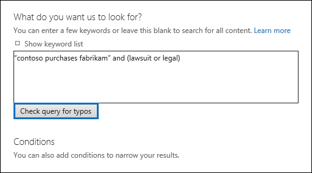

# Проверка запроса на поиск контента на наличие ошибокCheck your Content Search query for errors

При создании или изменении поиска контента могут иметь Office 365 проверить запрос для неподдерживаемые символы и логические операторы, которые не могут иметь разное. Каким образом? Только что нажмите кнопку **Проверить запрос опечаток** на странице запрос поиска контента.When you create or edit a Content Search, you can have Office 365 check your query for unsupported characters and Boolean operators that might not be capitalized. How? Just click **Check query for typos** on the query page of a Content Search. 
  

  
Ниже приведен список неподдерживаемые символы, проверки. Неподдерживаемые символы часто скрыты, и они обычно приводит к ошибке поиска или возвращать непредвиденные результаты.Here's a list of the unsupported characters that we check for. Unsupported characters are often hidden, and they typically cause a search error or return unintended results.
  
- **Смарт-кавычки** - смарт-одиночные и двойные кавычки (также называемая парные кавычки) не поддерживаются. Можно использовать только прямые кавычки в поисковый запрос.**Smart quotation marks** - Smart single and double quotation marks (also called curly quotes) aren't supported. Only straight quotation marks can be used in a search query. 
    
- **Символы не печати и элемента управления** - без печати и управления символы не представляют написанного символов, таких как буквенно цифровых символов. Примеры управляющие и управления символы включают символы форматирования текста или отдельных строк текста.**Non-printable and control characters** - Non-printable and control characters don't represent a written symbol, such as a alpha-numeric character. Examples of non-printable and control characters include characters that format text or separate lines of text. 
    
- **Слева направо и справа налево метки** - это управляющие символы, служит для указания направление текста справа налево (например, английский и испанский) и языкам для письма справа налево (например, арабского языка и иврита).**Left-to-right and right-to-left marks** - These are control characters used to indicate text direction for left-to-right languages (such as English and Spanish) and right-to-left languages (such as Arabic and Hebrew).
    
- **Строчная логических операторов** - при использовании логический оператор, например **и**, **или**и **не** в поисковый запрос, он должен быть верхнего регистра. Мы проверить запрос опечаток, синтаксис запроса часто указывается, что несмотря на то, что может использоваться строчная операторы; используется логический оператор например `(WordA or WordB) and (WordC or WordD)`.**Lowercase Boolean operators** - If you use a Boolean operator, such as **AND**, **OR**, and **NOT** in a search query, it must be uppercase. When we check a query for typos, the query syntax will often indicate that a Boolean operator is being used even though lowercase operators might be used; for example,  `(WordA or WordB) and (WordC or WordD)`.
    
## Что произойдет, если запрос имеет неподдерживаемый символ?What happens if a query has an unsupported character?

Если неподдерживаемые символы находятся в запросе, отображается предупреждение, что неподдерживаемые символы, которые были найдены и предлагает альтернативы. Затем выберите имеется возможность сохранить исходного запроса или замените предложенного измененный запрос. Ниже приведен пример предупреждающее сообщение, которое отображается после нажатия кнопки **Проверить запрос опечаток** для поискового запроса на предыдущем рисунке. Обратите внимание, что исходный запрос содержит парные кавычки и строчных логических операторов.If unsupported characters are found in your query, a warning message is displayed that says unsupported characters that were found and a suggests an alternative. Then you then have the option keep the original query or replace it with the suggested revised query. Here's an example of the warning message that's displayed after you click **Check query for typos** for the search query in the previous screenshot. Notice that the original query contains smart quotes and lowercase Boolean operators. 
  

  
## Предотвращение неподдерживаемые символы в поисковых запросовHow to prevent unsupported characters in your search queries

Неподдерживаемые символы обычно добавляются в запрос при копировании части запроса и запроса из других приложений (например, Microsoft Word или Microsoft Excel) и копировать их в поле ключевых слов на странице запрос поиска контента. Лучший способ неподдерживаемые символы не является введите запрос в поле ключевых слов. Кроме того можно копировать запрос из Word или Excel и вставьте его в файл в текстовый редактор, например Блокнот. Затем сохраните текстовый файл и выберите в раскрывающемся списке **Кодировка** **ANSI** . Удаление любого форматирования и неподдерживаемые символы. Затем можно скопируйте и вставьте запроса из текстового файла в окно запроса ключевого слова.Unsupported characters are typically added to a query when you copy the query or parts of the query from other applications (such as Microsoft Word or Microsoft Excel) and copy them to the keyword box on the query page of a Content Search. The best way to prevent unsupported characters is to just type the query in the keyword box. Alternatively, you can copy a query from Word or Excel and then paste it to file in a plain text editor, such as Microsoft Notepad. Then save the text file and select **ANSI** in the **Encoding** drop-down list. This will remove any formatting and unsupported characters. Then you can copy and paste the query from the text file to the keyword query box. 
