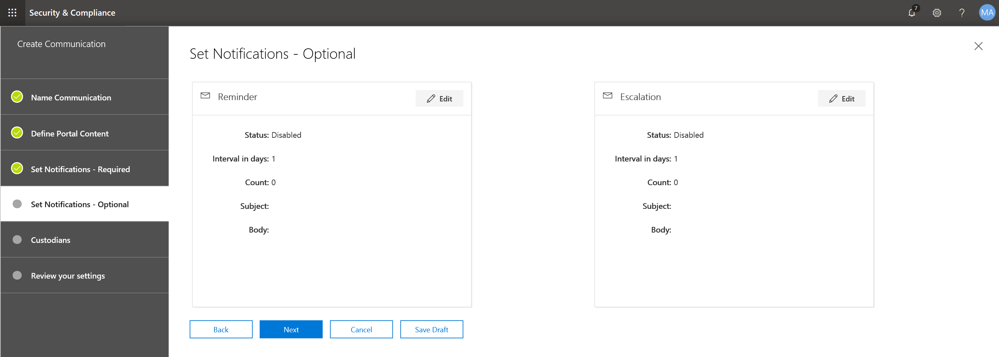

# Создание уведомления об судебном удержанииCreate a legal hold notice

Благодаря расширенным средствам обнаружения электронных данных (Preview) Хранитель Communications организации могут управлять рабочими процессами, взаимодействующими с custodians.Using Advanced eDiscovery (Preview) custodian communications, organizations can manage their workflow around communicating with custodians. С помощью средства связи юридические команды могут систематически отправлять, собирать и отслеживать уведомления о юридических удержаниях.Through the Communications tool, legal teams can systematically send, collect, and track legal hold notifications. Гибкий процесс создания также позволяет Teams настраивать рабочий процесс уведомления об удержаниях и контент в уведомлениях, отправляемых в custodians.The flexible creation process also allows teams to customize the hold notification workflow and the content in the notices sent to custodians. 

В этой статье описываются действия, описанные в рабочем процессе уведомления о удержании.The article outlines the steps in the hold notification workflow.

## Шаг 1: Указание сведений о общенииStep 1: Specify communication details

Первый шаг — указать соответствующие сведения для уведомлений о судебном удержании или других коммуникаций хранитель.The first step is to specify the appropriate details for legal hold notices or other custodian communications. 

1. В центре безопасности _Амп_ соответствие требованиям откройте раздел **Обнаружение электронных данных _Гт_ Advanced eDiscovery (предварительНая версия)** , чтобы отобразить список дел в Организации.In the Security & Compliance Center, go to **eDiscovery > Advanced eDiscovery (Preview)** to display the list of cases in your organization.
   
2. Перейдите на вкладку **связь** и нажмите кнопку **создать связь**.Click the **Communications** tab, and then click **New communication**.
   
3. На странице " **связь с именем** " укажите следующие (обязательные) сведения о связи.On the **Name communication** page, specify the following (required) communication details.

    - **Name**: имя связи.**Name**: This is the name for the communication.
    
    - **Выдача директора**: в раскрывающемся списке отображается список элементов дела.**Issuing officer**: The dropdown list displays a list of a case members. Каждое уведомление, отправленное в custodians, будет отправлено от имени указанного директора выпуска.Each notice sent to custodians will be sent on behalf of the specified issuing officer.

4. Нажмите кнопку **Далее**.Click **Next**.

## Шаг 2: Определение контента порталаStep 2: Define the portal content

Затем вы можете создать и добавить содержимое уведомления об удержании.Next, you can create and add the content of the hold notice. На странице **Определение контента портала** в мастере **создания связи** укажите содержимое уведомления об удержании.On the **Define portal content** page in the **Create communication** wizard, specify the contents of the hold notice. Это содержимое будет автоматически добавлено к уведомлениям о выДаче, повторной выдаче, напоминании и эскалации.This content will be automatically appended to the Issuance, Re-Issue, Reminder, and Escalation notices. Кроме того, этот контент будет отображаться на портале соответствия требованиям хранитель.Additionally, this content will appear in the custodian's Compliance Portal. 

Чтобы создать контент портала, выполните следующие действия.To create the portal content:

1. Введите (или скопируйте и вставьте из другого документа) ваше уведомление об удержании в текстовом поле для контента портала.Type (or cut and paste from another document) your hold notice in the textbox for the portal content. 

2. Вставьте переменные слияния в уведомление о настройке уведомления и предоставлении доступа к порталу обеспечения соответствия требованиям хранитель.Insert merge variables into your notice to customize the notice and share the Custodian Compliance Portal.

3. Нажмите кнопку **Далее**.Click **Next**.

  >[!Tip]
  >Дополнительные сведения о способах настройки контента и формата контента портала см [в разделе Использование редактора взаимодействий](using-communications-editor.md).To learn more about how to can customize the content and format of the portal content, see [Use the Communications Editor](using-communications-editor.md).

## Шаг 3: Установка необходимых уведомленийStep 3: Set the required notifications

Определив содержимое уведомления об удержании, вы можете настроить рабочие процессы для отправки и управления процессом уведомления.After you've defined the contents of the hold notice, you can set up the workflows around sending and managing the notification process. Уведомления — это сообщения электронной почты, отправляемые для уведомления и дальнейших действий с помощью custodians.Notifications are email messages that are sent to notify and follow-up with custodians. Каждый хранитель, добавляемый в связь, получает одно и то же уведомление.Every custodian added to the communication will receive the same notification. 

Чтобы настроить и отправить уведомление о удержании, необходимо включить уведомления о выДаче, повторной выДаче и выПуске.To set up and send a hold notice, you must include Issuance, Re-Issuance, and Release notifications.

### Уведомление о выДачеIssuance notification 

После создания связи **уведомление выдачи** инициируется указанным должностным лицом.After the communication is created, the **Issuance Notification** is initiated by the specified Issuing Officer. Уведомление о выДаче — первое сообщение, отправляемое в хранитель, чтобы сообщить им о обязательствах по их сохранности.The Issuance notification is the first communication sent to the custodian to inform them about their preservation obligations. 

Чтобы создать уведомление о выдаче:To create an issuance notification:

1. В плитке **выдачи** нажмите кнопку **изменить**.In the **Issuance** tile, click **Edit**.
   
2. При необходимости добавьте дополнительные элементы или сотрудники в поля **"копия"** и **"Скрытая копия"** .If necessary, add additional case members or staff to the **Cc** and **Bcc** fields. Чтобы добавить в эти поля несколько пользователей, разделяйте адреса электронной почты точками с запятой.To add multiple users to these fields, separate email addresses with a semi-colon.
   
3. Укажите **тему** уведомления (обязательно).Specify the **Subject** for the notice (required).
   
4. Укажите содержимое или дополнительные инструкции, которые вы хотите предоставить хранитель (обязательно).Specify the contents or additional instructions that you would like to provide to the custodian (required). Обратите внимание, что содержимое портала, определенное в шаге 2, добавляется в конец уведомления о выдаче.Note that the portal content you defined in Step 2 is added to the end of the issuance notice. 
   
5. Нажмите кнопку **Сохранить**Click **Save** 

### Повторное выДача уведомленияRe-Issuance notification 

По мере выполнения сценария может потребоваться custodians для сохранения дополнительных или меньших данных, чем ранее было указано.As the case progresses, custodians may be required to preserve additional or less data than was previously instructed. После обновления содержимого уведомления об удержании custodians об изменениях обязательств по их сохранности.After you update the contents of the hold notice, the re-issuance notification alerts the  custodians about the changes to their preservation obligations.

Чтобы создать уведомление о повторной выдаче:To create a re-issuance notification: 

1. В плитке **повторной** выпуске щелкните **изменить**.In the **Reissue** tile, click **Edit**.
   
2. При необходимости добавьте дополнительные элементы или сотрудники в поля **"копия"** и **"Скрытая копия"** .If necessary, add additional case members or staff to the **Cc** and **Bcc** fields. Чтобы добавить в эти поля несколько пользователей, разделяйте адреса электронной почты точками с запятой.To add multiple users to these fields, separate email addresses with a semi-colon.
   
3. Укажите **тему** уведомления (обязательно).Specify the **Subject** for the notice (required).
   
4. Укажите содержимое или дополнительные инструкции, которые вы хотите предоставить хранитель (обязательно).Specify the contents or additional instructions that you would like to provide to the custodian (required). Обратите внимание, что содержимое портала, определенное в шаге 2, добавляется в конец уведомления о повторной выдаче.Note that the portal content you defined in Step 2 is added to the end of the re-issuance notice.
   
5. Нажмите кнопку \*\*Сохранить \*\*.Click **Save**.

>[!Note]
>Если уведомление об удержании изменено, уведомление о повторной выдаче будет автоматически отправлено всем custodians, назначенным данному уведомлению.If a hold notification is modified, the re-issuance notification will be automatically sent to all custodians assigned to the notice. После отправки уведомления пользователю custodians будет предложено повторно подтвердить свое уведомление об удержании.After the notification is sent, custodians will be asked to re-acknowledge their hold notice. Если вы настроили какие-либо напоминания или рабочие процессы эскалации, они также будут перезапущены.If you have set up any reminder or escalation workflows, these will also re-start. 

### Уведомление о выПускеRelease notification

После того как пользователь разрешается или хранитель больше не сохраняет содержимое, вы можете освободить хранитель из случая.After a matter is resolved or if a custodian is no longer subject to preserve content, you can release the custodian from a case. Если в Хранитель ранее было отправлено уведомление об удержании, уведомление о выпуске можно использовать для оповещения custodians о том, что они были выпущены из обязательств.If the custodian was previously issued a hold notice, the release notification can be used to alert custodians that they have been released from their obligation.

Чтобы создать уведомление о выпуске, выполните указанные ниже действия.To create a release notification: 

1. В плитке **выпуск** нажмите кнопку **изменить**.In the **Release** tile, click **Edit**.
   
2. При необходимости добавьте дополнительные элементы или сотрудники в поля **"копия"** и **"Скрытая копия"** .If necessary, add additional case members or staff to the **Cc** and **Bcc** fields. Чтобы добавить в эти поля несколько пользователей, разделяйте адреса электронной почты точками с запятой.To add multiple users to these fields, separate email addresses with a semi-colon.
   
3. Укажите **тему** уведомления (обязательно).Specify the **Subject** for the notice (required).
   
4. Укажите содержимое или дополнительные инструкции, которые вы хотите предоставить хранитель (обязательно).Specify the contents or additional instructions that you would like to provide to the custodian (required).
   
5. Нажмите кнопку **сохранить** и перейдите к следующему шагу.Click **Save** and go to the next step. 

## Необязательно Шаг 4: Настройка дополнительных уведомлений(Optional) Step 4: Set the optional notifications

Кроме того, вы можете упростить рабочий процесс, чтобы не отвечать на custodians, создавая и планируя автоматические напоминания и уведомления о эскалации.Optionally, you can simplify the workflow for following up with unresponsive custodians by creating and scheduling automated reminder and escalation notifications.

### RemindersReminders

После отправки уведомления об удержании можно подписаться с неотвечающими custodians, определив рабочий процесс напоминания.After you have sent a hold notification, you can follow-up with unresponsive custodians by defining a reminder workflow. 

Чтобы запланировать напоминания:To schedule reminders:

1. В плитке **напоминание** нажмите кнопку **изменить**.In the **Reminder** tile, click **Edit**.
   
2. Включите рабочий \*\*\*\* процесс напоминания, включив переключатель **состояния** (обязательно).Enable the **Reminder** workflow by turning on the **Status** toggle (required).
   
3. Укажите **интервал напоминаний (в днях)** (обязательный).Specify the **Reminder interval (in days)** (required). Это количество дней, в течение которых необходимо подождать, прежде чем отправлять уведомления о начале и исполнении напоминания.This is the number of days to wait before sending the first and follow-up reminder notifications. Например, если задать интервал напоминания равным 7 дням, то первое напоминание будет отправлено на 7 дней после первоначального выдачи уведомления об удержании.For example, if you set the reminder interval to 7 days, then the first reminder would be sent 7 days after the hold notification was initially issued. Все последующие напоминания также будут отправляться каждые 7 дней.All subsequent reminders would also be sent every 7 days.
   
4. Укажите **количество памяток** (обязательный параметр).Specify the **Number of reminders** (required). В этом поле указывается, сколько напоминаний отправлять в неотвечающую custodians.This field specifies how many reminders to send to un-responsive custodians. Например, если вы настроили число напоминаний равным 3, то хранитель будет получать не более трех напоминаний.For example, if you set the number of reminders to 3, then a custodian would receive a maximum of 3 reminders. После того как хранитель признает уведомление об удержании, напоминания больше не будут отправляться этому пользователю.After a custodian acknowledges the hold notification, reminders will no longer be sent to that user.
   
5. Укажите **тему** уведомления (обязательно).Specify the **Subject** for the notice (required). 
   
6. Укажите содержимое или дополнительные инструкции, которые вы хотите предоставить хранитель (обязательно).Specify the contents or additional instructions that you would like to provide to the custodian (required). Обратите внимание, что содержимое портала, определенное в шаге 2, добавляется в конец уведомления о напоминании.Note that the portal content you defined in Step 2 is added to the end of the reminder notice.
   
7. Нажмите кнопку **сохранить** и перейдите к следующему шагу.Click **Save** and go the the next step.

### ЭскалацииEscalations 

В некоторых ситуациях могут потребоваться дополнительные способы отслеживания неотвечающего custodians.In some situations, you may need additional ways to follow-up with unresponsive custodians. Если хранитель не распознает уведомление о удержании после получения указанного количества напоминаний, юридический специалист может указать рабочий процесс для автоматической отправки уведомления о эскалации в хранитель и руководителю.If a custodian doesn't acknowledge a hold notification after receiving the specified number of reminders, the legal team can specify a workflow to automatically send an escalation notice to the custodian and their manager.

Планирование укрупнений:To schedule escalations:

1. В плитке **эскалация** нажмите кнопку **изменить**.In the **Escalation** tile, click **Edit**.
   
2. Включите рабочий \*\*\*\* процесс эскалации, включив переключатель **Status** .Enable the **Escalation** workflow by turning on the **Status** toggle.
   
3. Укажите **интервал эскалации (в днях)** (обязательно).Specify the **Escalation interval (in days)** (required). 
   
4. Укажите **количество укрупнений** (обязательный параметр).Specify the **Number of escalations** (required). В этом поле указывается количество укрупнений, которое отправляется в неотвечающие custodians.This field specifies how many escalations to send to un-responsive custodians. Например, если вы установили число укрупнений равным 3, то уведомление о эскалации будет отправлено в хранитель, а его менеджеру не превышать 3 раза.For example, if you set the number of escalations to 3, then an escalation notice would be sent to the custodian and their manager a maximum of 3 times. После того как хранитель признает уведомление об удержании, эскалации больше не будут отправляться.After a custodian acknowledges the hold notification, escalations will no longer be sent. 
   
5. Укажите **тему** уведомления (обязательно).Specify the **Subject** for the notice (required). 
   
6. Укажите содержимое или дополнительные инструкции, которые вы хотите предоставить хранитель (обязательно).Specify the contents or additional instructions that you would like to provide to the custodian (required). Обратите внимание, что содержимое портала, определенное в шаге 2, добавляется в конец уведомления об эскалации.Note that the portal content you defined in Step 2 is added to the end of the escalation notice.
   
7. Нажмите кнопку **сохранить** и перейдите к следующему шагу.Click **Save** and go the the next step.
   
## Шаг 5: назначение custodiansStep 5: Assign custodians 

После завершения обработки контента для уведомлений выберите custodians, для которого требуется отправить уведомления.After you have finalized the content for notifications, select the custodians that you would like to send the notifications. 

Чтобы добавить custodians, выполните указанные ниже действия.To add custodians:

1. Назначьте custodians связи, установив флажок рядом с именем.Assign custodians to the communication by clicking the checkbox next to their name.

    После создания связи рабочий процесс уведомления будет автоматически применен к выбранному custodians.After the communication is created, the notification workflow will automatically apply to the selected custodians.
   
2. Нажмите кнопку **Далее** , чтобы просмотреть сведения о параметрах и сведениях о общении.Click **Next** to review the communication settings and details.
 
>[!NOTE]
>Вы можете добавлять только custodians, добавленные к случаю, и не отправляли еще одно уведомление в случае.You can only add custodians who have been added to the case and haven't been sent another notification within the case.

## Шаг 6: Просмотр параметровStep 6: Review settings

После просмотра параметров и нажатия кнопки **Отправить** для завершения связи система автоматически запустит рабочий процесс связи, отправив уведомление о выдаче.After you review the settings and click **Send** to complete the communication, the system will automatically start the communication workflow by sending the issuance notice.
