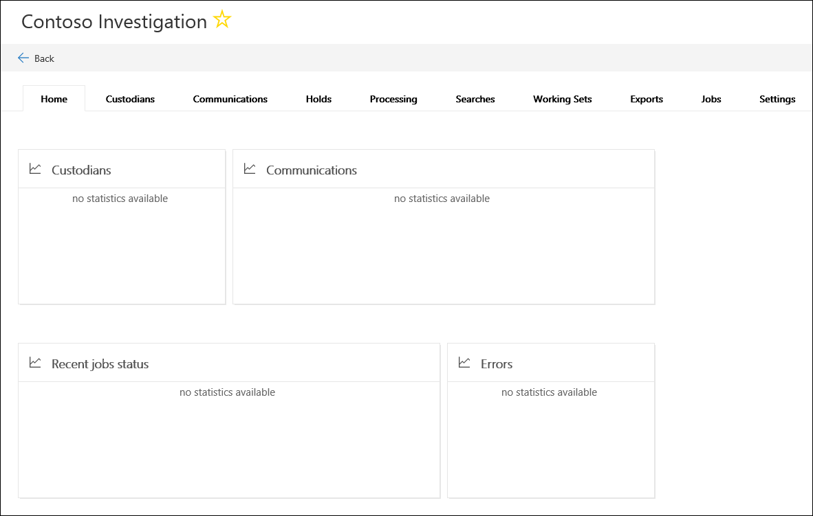

# Создайте новое обращение в расширенной обнаружения электронных данных (Предварительная версия)Create a new case in Advanced eDiscovery (Preview)    

1. Перейдите по ссылке [https://protection.office.com](https://protection.office.com).Go to [https://protection.office.com](https://protection.office.com).
    
2. Войдите в Office 365 с помощью своей рабочей или учебной учетной записи.Sign in to Office 365 using your work or school account.
    
3. В центре соответствия требованиям & безопасности нажмите кнопку **Дополнительно eDiscovery > обнаружения электронных данных**.In the Security & Compliance Center, click **eDiscovery > Advanced eDiscovery**.
 
4. На странице " **Расширенный обнаружения электронных данных (Просмотр)** " щелкните **Создать обращение**.On the **Advanced eDiscovery (Preview)** page, click **Create a case**.
    
5. На странице " **новое обращение eDiscovery** всплывающее окно" Предоставление практический name (обязательный) и введите номер запроса на необязательный и описание. Обратите внимание на то, что делами имя должно быть уникальным в пределах организации.On the **New eDiscovery case** flyout page, give the case a name (required), and then type an optional case number and description. Note that the case name must be unique in your organization.

6. В разделе **вы хотите настроить дополнительные параметры после создания в этом случае?**, выполните одно из следующих действий:Under **Do you want to configure additional settings after creating this case?**, do one of the following:

    - Нажмите кнопку **Да** для создания в случае и отображение страницы " **Параметры** " в новое обращение. Это позволяет добавить элементы в рамках данного экземпляра.Click **Yes** to create the case, and display the **Settings** page in the new case. This allows you to add members to the case.
    
    - Нажмите кнопку **Нет** , чтобы только что создание регистр и отображение их в список случаев на странице " **Расширенный обнаружения электронных данных (Просмотр)** ". Если выбран этот параметр, как будут использоваться только члена регистр и параметры по умолчанию аналитические данные и поиска добавлена. Вы можете добавить элементы или изменить параметры в любое время после создания обращения.Click **No** to just create the case and display it in the list of cases on the **Advanced eDiscovery (Preview)** page. If you choose this option, you will be added as the only member of the case and the default search and analytics settings will be used. You can add members or change settings any time after the case is created.

7. Нажмите кнопку **Сохранить** , чтобы создать регистр.Click **Save** to create the case.

    Новое обращение отображается в списке вариантов на странице " **Расширенный обнаружения электронных данных (Просмотр)** ".The new case is displayed in the list of cases on the **Advanced eDiscovery (Preview)** page. 

8. Чтобы открыть дела, щелкните имя регистр.To open a case, click the name of the case. 

    Отображается вкладка **Домашняя страница** для случая. Например здесь — это новое обращение с именем *Contoso расследования*.The **Home** tab for the case is displayed. For example, here's a new case named *Contoso Investigation*.

    
