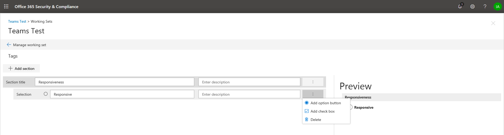

## Создание групп тегов

Прежде чем вы или другие пользователи смогут отмечать документы в наборе рецензирования, необходимо создать теги. Это можно сделать, создав группы тегов, содержащие дочерние теги. Теги отображаются на панели маркировки при рецензировании документов в наборе рецензирования.

Чтобы создать группу тегов, выполните следующие действия.

1.  В рабочем наборе выберите Управление рабочим набором.

> 

2.  Затем выберите ссылку "Управление тегами".

> 

В рамках управления тегами можно создавать теги для удовлетворения требований вашего случая.

> Начните с создания раздела тега

1.  Нажмите кнопку "добавить раздел"

> 

|                                                                                                                             |                                                                                                                                                                 |
| --------------------------------------------------------------------------------------------------------------------------- | --------------------------------------------------------------------------------------------------------------------------------------------------------------- |
| Последняя | Экран предварительного просмотра обновится после сохранения, чтобы можно было выполнить предварительный просмотр панели тегов без закрытия экрана управления тегами и возврата к рабочему набору. |

2.  Введите название и описание (необязательно). Чтобы создать тег в этом разделе, нажмите кнопку с многоточием в разделе новый тег, чтобы создать теги в новом разделе.
    
    

|                                                                                                                             |                                                                                                                                         |
| --------------------------------------------------------------------------------------------------------------------------- | --------------------------------------------------------------------------------------------------------------------------------------- |
| Последняя | Теги Option вынуждает пользователей выбрать один тег из группы тегов. Теги флажков позволяют пользователям выбирать любую комбинацию тегов. |

## Вложенные теги

1.  Чтобы вложить теги, нажмите многоточие **тега** и выберите новый тег, который нужно добавить.
    
    

