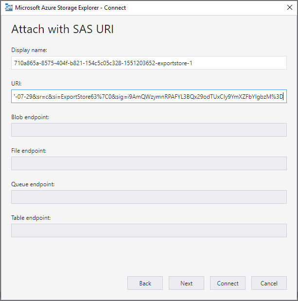
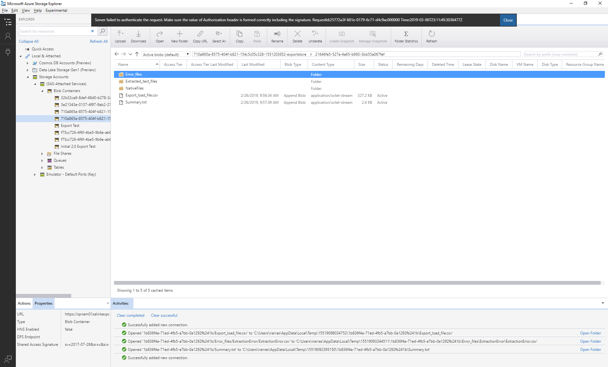

# Скачивание заданий экспорта

При экспорте документов из набора проверки в расширенном случае обнаружения электронных данных документы передаются в предоставленное корпорацией Майкрософт место хранения Azure или в место хранения Azure, управляемое вашей организацией. Тип используемого расположения хранилища Azure зависит от того, какой параметр был выбран при экспорте документов. 

В этой статье приведены инструкции по использованию обозревателя хранилищ Microsoft Azure для подключения к хранилищу Azure для просмотра и скачивания экспортированных документов. Дополнительные сведения об обозревателе хранилищ Azure можно найти в статье [Краткое руководство: use Azure Storage Explorer](https://docs.microsoft.com/en-us/azure/storage/blobs/storage-quickstart-blobs-storage-explorer).

## Шаг 1: Установка обозревателя хранилищ Azure

Первый шаг — скачать и установить Обозреватель хранилищ Azure. Для получения инструкций обратитесь к разделу [средство "Обозреватель хранилищ Azure](https://go.microsoft.com/fwlink/p/?LinkId=544842)". Это средство используется для подключения к и скачивания экспортированных документов на шаге 3.

## Шаг 2: получение URL-адреса SAS из задания экспорта

Следующий шаг — получение URL-адреса общего доступа к подписи доступа (SAS), созданного при создании задания экспорта для [экспорта документов из набора рецензирования](export-documents-from-review-set.md). Вы можете скопировать URL-адрес SAS для документов, которые передаются в хранилище Azure, предоставленное Майкрософт, или место хранения Azure, управляемое вашей организацией. В любом случае URL-адрес SAS используется для подключения к расположению хранилища Azure на шаге 3.

1. На странице **Advanced eDiscovery (дополнительные функции обнаружения электронных** данных) перейдите к случаю, **** а затем перейдите на вкладку экспорты.

2. На вкладке " **Экспорт** " щелкните задание экспорта, которое нужно скачать.

3. На всплывающей странице в разделе **расположения**скопируйте отображаемый URL-адрес SAS. При необходимости вы можете сохранить его в файл, чтобы получить к нему доступ на шаге 3.
 
   

## Шаг 3: подключение к хранилищу Azure

Последним шагом является использование обозревателя хранилищ Azure и URL-адреса SAS для подключения к расположению хранилища Azure и загрузки документов, экспортированных на локальный компьютер.

1.  Откройте оснастку Azure Storage Explorer, установленную на шаге 1.

2. Щелкните значок **Добавить учетную запись** . Кроме того, можно щелкнуть правой кнопкой мыши **учетные записи хранения**.

   

3.  На странице " **Подключение к хранилищу Azure** " щелкните **использовать универсальный код ресурса (URI) для подписи общего доступа (SAS)** и нажмите кнопку **Далее**.

    

4.  На странице " **присоединение с URI SAS** " щелкните в поле URI и вставьте URL-адрес SAS, полученный на шаге 2. 

    

    Обратите внимание, что часть URL-адреса SAS отображается в поле **Отображаемое имя** . Он будет использоваться в качестве отображаемого имени контейнера, созданного в **учетных записях хранения** после подключения к месту хранения. Это имя состоит из идентификатора расширенного случая обнаружения электронных данных и уникального идентификатора. Вы можете оставить отображаемое имя по умолчанию или изменить его. Если изменить его, отображаемое имя должно быть уникальным.

5.  Нажмите кнопку **Далее**.

    Отобразится страница " **Сводка подключения** ".
   
    

6. На странице **Сводка** по подключению просмотрите сведения о подключении, а затем нажмите кнопку **подключить**. 

    Будет открыт узел **контейнеры больших двоичных объектов** (в разделе **учетные записи** > хранения **(прикрепленные контейнеры)** \> . 

    

    Он содержит контейнер с именем, отображаемым на шаге 4. Этот контейнер содержит папку для каждого созданного задания экспорта. Имена этих папок с ИДЕНТИФИКАТОРом, соответствующим ИДЕНТИФИКАТОРу задания экспорта. Эти коды экспорта (и имя экспорта) можно найти в разделе **сведения о поддержке** на всплывающей странице для каждого **подготовить данные для задания экспорта** , указанного на вкладке **задания** .

7. Дважды щелкните папку задания экспорта, чтобы открыть ее.

   Отобразится список папок и отчетов экспорта.
   
    

   Папка заданий экспорта содержит указанные ниже элементы. Фактические элементы в папке экспорта определяются параметрами экспорта, настроенными при создании задания экспорта. Дополнительные сведения см в разделе [Экспорт документов из набора рецензирования](export-documents-from-review-set.md).

    - Export_load_file. csv: этот CSV-файл представляет собой подробный отчет о экспорте, который содержит сведения о каждом экспортированном документе. Файл состоит из столбца для каждого свойства метаданных документа. Список и описание метаданных, включенных в этот отчет, представлены в столбце **имя экспортируемого поля** в таблице в [полях метаданные документа в разделе Advanced eDiscovery](document-metadata-fields.md).
    
    - Summary. txt: текстовый файл, содержащий сводку по экспорту, включая статистику экспорта.
    
    - Extracted_text_files: в этой папке содержится текстовый файл каждого экспортированного документа.
     
    - Нативефилес: в этой папке содержится собственная версия каждого экспортированного документа.
    
    - Error_files: в этой папке содержатся следующие элементы, если задание экспорта содержит какие бы то ни было файлы ошибок: 
        
      - Екстрактионеррор. csv: этот CSV-файл содержит доступные метаданные для файлов, которые не были правильно извлечены из родительского элемента.
        
      - Процессинжеррор: в этой папке содержатся документы с ошибками обработки. Это содержимое находится на уровне элемента, что означает, что при возникновении ошибки обработки вложения в эту папку также будет включен документ, содержащий вложение.
 
8. Чтобы экспортировать все содержимое в экспорте, выберите папку экспорт и нажмите кнопку **загрузить**.

9. Укажите расположение, в которое вы хотите скачать экспортируемые файлы, а затем нажмите кнопку Выбрать папку.

    В обозревателе службы хранилища Azure запускается процесс экспорта. Состояние скачивания экспортированных элементов отображается в области **действия** . По завершении скачивания отображается сообщение.

    

> [!NOTE]
> Вместо того чтобы скачивать все задания экспорта, можно выбрать определенные элементы для скачивания. А вместо скачивания элементов можно дважды щелкнуть элемент, чтобы просмотреть его.