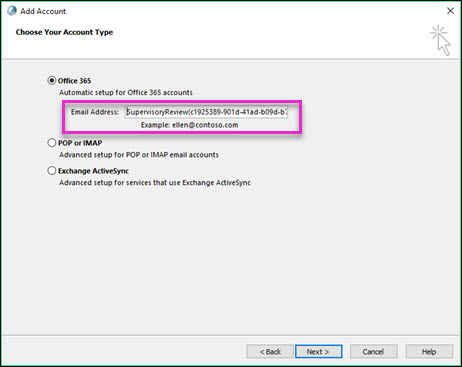

# <a name="configure-supervision-policies-for-your-organization"></a>Настройка политик контроля для организации

Используйте политики контроля для сбора данных о сотрудниках для изучения внутренними или внешними рецензентами. Для получения дополнительных сведений о том, как политики контроля могут помочь отслеживать связи в Организации, ознакомьтесь с разкрывающимся [политиками в Office 365](supervision-policies.md).

> [!NOTE]
> Для пользователей, отслеживаемых политиками контроля, должна быть установлена лицензия на соответствие требованиям Microsoft 365 о корпоративном формате, лицензия на Office 365 корпоративный E3 с дополнительным соответствием требованиям или включена в подписку Office 365 корпоративный.
Если у вас нет плана Enterprise, а вы хотите попробовать выполнить надзор, вы можете [зарегистрироваться в пробной версии Office 365 корпоративный](https://go.microsoft.com/fwlink/p/?LinkID=698279)~.
  
Выполните следующие действия для настройки и использования контроля в организации Office 365:
  
- **Шаг 1 (необязательно)** - [Настройка групп для контроля](configure-supervision-policies.md#exampledist)

    Прежде чем приступать к контрольному изучению, определите, кто будет проверять свои сообщения и кто будет выполнять эти обзоры. Если вы хотите начать работу с несколькими пользователями, чтобы узнать, как работает функция контроля, вы можете пропустить настройку групп.

- **Шаг 2 (обязательный)** - [Сделайте контрольный доступ доступным в Организации](configure-supervision-policies.md#MakeAvailable)

    Добавьте себя в группу ролей супервизора, чтобы можно было настроить политики. Все пользователи, которым назначена эта роль, могут получить доступ к странице " **надзор** " в разделе **Управление данными** в центре безопасности _амп_ соответствия требованиям. Если вы размещаете электронную почту на сервере Exchange Online, у каждого рецензента также должен быть [Удаленный доступ PowerShell к Exchange Online](https://docs.microsoft.com/powershell/exchange/exchange-online/disable-access-to-exchange-online-powershell).

- **Шаг 3 (необязательно)** - [Настройка настраиваемых типов конфиденциальной информации или пользовательских словарей ключевых слов и лексиконов](configure-supervision-policies.md#sensitiveinfo)

    Если необходимо использовать настраиваемый тип конфиденциальной информации или словарь пользовательских ключевых слов для политики контроля, необходимо создать его перед запуском мастера.

- **Шаг 4 (обязательный)** - [Настройка политики надзора](configure-supervision-policies.md#setupsuper)

    В центре безопасности _Амп_ соответствия требованиям вы создадите политики контроля. Эти политики определяют, какие связи подлежат проверке в вашей организации, и указывает, кто должен выполнять рецензирование. Связь включает электронную почту и Microsoft Teams, а также связь с платформой сторонних производителей (например, Facebook, Twitter и т. д.).

- **Шаг 5 (необязательно)** [Тестирование новой политики контроля](configure-supervision-policies.md#TestPolicy)

    ПроВерив политику контроля, чтобы убедиться, что она работает должным образом, важно, чтобы стратегия соответствия требованиям предпринята к вашим стандартам.

- **Шаг 6 (необязательно)** [Настройка Outlook для рецензентов, которые не хотят использовать панель мониторинга Office 365 или Outlook в Интернете (прежнее название — Outlook Web App) для просмотра контролируемого обмена данными](configure-supervision-policies.md#UseOutlook)

    Outlook можно настроить, чтобы предоставить рецензентам доступ к функциям контроля в клиенте Outlook, чтобы они могли оценивать и классифицировать каждый элемент.

<a name="exampledist"> </a>

## <a name="step-1---set-up-groups-for-supervision-optional"></a>Шаг 1. Настройка групп для контроля (необязательно)

 При создании политики контроля вы узнаете, кто будет просматривать свои сообщения и кто будет выполнять эти проверки. В политике адреса электронной почты используются для идентификации пользователей или групп людей. Чтобы упростить настройку, вы можете создавать группы для пользователей, которым будет предоставлена их связь, и группы для людей, которые будут просматривать эти сообщения. Если вы используете группы, вам может понадобиться несколько вариантов, например, если вы хотите отслеживать связь между двумя отдельными группами людей или вы хотите указать группу, которая не будет отслеживаться.

Следующая диаграмма поможет настроить группы в Организации для политик контроля:

| **Участник политики** | **Поддерживаемые группы** | **Неподдерживаемые группы** |
|:-----|:-----|:-----|
|Контролируемые пользователи | Группы рассылки <br> Группы Office 365 | Динамические группы рассылки |
| Reviewers | группы безопасности с включенной поддержкой почты.  | группы рассылки; <br> динамические группы рассылки |
  
Более подробную информацию о настройке групп можно узнать в следующих статьях:
- [Создание групп рассылки и управление ими](https://docs.microsoft.com/Exchange/recipients-in-exchange-online/manage-distribution-groups/manage-distribution-groups)
- [Управление группами безопасности с поддержкой электронной почты](https://docs.microsoft.com/Exchange/recipients-in-exchange-online/manage-mail-enabled-security-groups)
- [Обзор групп Office 365](https://docs.microsoft.com/office365/admin/create-groups/office-365-groups?view=o365-worldwide)

<a name="MakeAvailable"> </a>

## <a name="step-2---make-supervision-available-in-your-organization-required"></a>Шаг 2: предоставление контроля в Организации (обязательный)

Чтобы сделать **надзор** доступным в качестве пункта меню в центре безопасности _Амп_ соответствия требованиям, необходимо назначить роль администратора экспертной проверки.
  
Для этого вы можете добавить себя в качестве участника группы ролей "Экспертная проверка" или создать новую группу ролей.
  
### <a name="add-members-to-the-supervisory-review-role-group"></a>Добавление участников в группу ролей "Супервизорная проверка"

1. Войдите в [https://protection.office.com](https://protection.office.com) систему, используя учетную запись администратора в организации Office 365.

2. В центре безопасности _Амп_ соответствие выберите **разрешения**.

3. Выберите группу **** ролей супервизора, а затем щелкните значок редактирования.

4. В разделе **Участники** добавьте пользователей, которым вы хотите управлять надзором для вашей организации.

### <a name="create-a-new-role-group"></a>Создание новой группы ролей

1. Войдите в [https://protection.office.com](https://protection.office.com) систему, используя учетную запись администратора в организации Office 365.

2. В центре безопасности _Амп_ соответствие откройте раздел **разрешения** и нажмите кнопку Добавить (**+**).

3. В разделе **роли** нажмите кнопку Добавить (**+**) и прокрутите вниз до **администратора экспертной проверки**. Добавьте эту роль в группу ролей.

4. В разделе **Участники** добавьте пользователей, которым вы хотите управлять надзором для вашей организации.

Дополнительные сведения о группах ролей и разрешениях приведены [в разделе разрешения в центре безопасности &amp; и соответствия требованиям Office 365](permissions-in-the-security-and-compliance-center.md).

### <a name="enable-remote-powershell-access-for-reviewers-if-email-is-hosted-on-exchange-online"></a>Разрешение доступа к удаленной оболочке PowerShell для проверяющих (если электронная почта размещена в Exchange Online)

1. Следуйте указаниям в статье [Включение и отключение доступа к Exchange Online PowerShell](https://docs.microsoft.com/powershell/exchange/exchange-online/disable-access-to-exchange-online-powershell).

<a name="sensitiveinfo"> </a>
  
## <a name="step-3---create-custom-sensitive-information-types-and-custom-keyword-dictionaries-optional"></a>Шаг 3: создание пользовательских типов конфиденциальной информации и пользовательских словарей ключевых слов (необязательно)

Чтобы выбрать существующие типы конфиденциальной информации или настраиваемые словари ключевых слов в мастере политики надзора, необходимо сначала создать эти элементы, если это необходимо.

### <a name="create-custom-keyword-dictionarylexicon-optional"></a>Создание настраиваемого словаря или словаря ключевых слов (необязательно)

В текстовом редакторе (например, в Блокноте) создайте новый файл, включающий ключевые слова, которые необходимо отслеживать в политике контроля. Убедитесь, что каждый термин находится в отдельной строке, и сохраните файл в формате **Юникод/UTF-16 (с прямым порядкОм байтов)** .

### <a name="create-custom-sensitive-information-types"></a>Создание пользовательских типов конфиденциальной информации

1. Создайте новый тип конфиденциальной информации и добавьте свой вспомогательный словарь в центр безопасности Office 365 Security _Амп_. Перейдите к разделам **классификации** \> **конфиденциальных сведений** и выполните действия, описанные в **мастере создания типа конфиденциальной информации**. Ниже приведены некоторые из них.

    - Определение имени и описания типа конфиденциальной информации
    - Определение элементов сходства, вероятности и основного шаблона
    - Импорт настраиваемого словаря в качестве требования для совпадающего элемента
    - Просмотрите выбранные параметры и создайте тип конфиденциальной информации

    Более подробную информацию можно узнать в статье [Создание настраиваемого типа конфиденциальной информации](create-a-custom-sensitive-information-type.md) и [Создание словаря ключевых слов](create-a-keyword-dictionary.md) .

    После создания настраиваемого словаря или словаря можно просмотреть настроенные ключевые слова с помощью командлета [Get-DlpKeywordDictionary](https://docs.microsoft.com/powershell/module/exchange/policy-and-compliance-dlp/get-dlpkeyworddictionary) или добавить и удалить термины с помощью командлета [Set-DlpKeywordDictionary](https://docs.microsoft.com/powershell/module/exchange/policy-and-compliance-dlp/set-dlpkeyworddictionary) .

<a name="setupsuper"> </a>

## <a name="step-4---set-up-a-supervision-policy-required"></a>Шаг 4: Настройка политики надзора (обязательно)
  
1. Войдите в [https://protection.office.com](https://protection.office.com) систему, используя учетную запись администратора в организации Office 365.

2. В центре безопасности _Амп_ соответствие требованиям выберите **надзор**.
  
3. Нажмите кнопку **создать** , а затем следуйте указаниям мастера, чтобы настроить следующие страницы политики. С помощью мастера вы будете:

    - ПриСвойте политике имя и описание.
    - Выберите пользователей или группы для контролируемости, включая выбор пользователей или групп, которые вы хотите исключить.
    - Определите условия политики контроля.
    - Выберите, следует ли включить типы конфиденциальной информации. Здесь можно выбрать стандартные и настраиваемые типы конфиденциальной информации.
    - Определение процента общения для проверки.
    - Выберите проверяющих для политики. Рецензентами могут быть отдельные пользователи или [группы безопасности с включенной поддержкой почты](https://docs.microsoft.com/Exchange/recipients-in-exchange-online/manage-mail-enabled-security-groups#create-a-mail-enabled-security-group).
    - Просмотрите выбранные политики и создайте политику.

<a name="TestPolicy"> </a>

## <a name="step-5---test-your-supervision-policy-optional"></a>Шаг 5: тестирование политики наблюдения (необязательно)

После создания политики контроля рекомендуется протестировать, чтобы убедиться, что заданные вами условия правильно применяются политикой. Кроме того, вы можете [проверить политики защиты от потери данных (DLP)](create-test-tune-dlp-policy.md) , если политики контроля включают типы конфиденциальной информации. Выполните указанные ниже действия, чтобы проверить политику контроля.

1. Откройте почтовый клиент или Microsoft Teams, зарегистрированные в качестве пользователя, который был зарегистрирован в политике, которую вы хотите протестировать.
2. Отправьте сообщение электронной почты или Microsoft Teams, которое соответствует условиям, заданным в политике контроля. Это может быть ключевое слово, размер вложения, домен и т. д. Убедитесь, что вы определили, что настроенные условные параметры в политике слишком лениент или слишком ограничены.

    > [!Note]
    > Сообщения электронной почты, подлежащие определению политик, обрабатываются почти в режиме реального времени и могут быть проверены сразу после настройки политики. Для выполнения бесед в Microsoft Teams в политике может потребоваться до 24 часов. 

3. Войдите в свой клиент Office 365 как проверяющий, назначенный в политике контроля. Перейдите к **** > разделу контроль*настраиваемой политики* > ,**открытой** для просмотра отчета о политике.

<a name="UseOutlook"> </a>

## <a name="step-6---configure-outlook-for-reviewers-optional"></a>Шаг 6. Настройка Outlook для рецензентов (необязательно)

Проверяющие, которые хотят использовать Outlook вместо использования панели мониторинга в Office 365 для проверки связи, должны настроить клиент Outlook.

### <a name="step-1-copy-the-address-for-the-supervision-mailbox"></a>Шаг 1: Скопируйте адрес почтового ящика надзора.

Чтобы настроить проверку для Outlook для настольного компьютера или Outlook в Интернете, вам потребуется адрес для почтового ящика, который был создан в рамках настройки политики контроля.
  
> [!NOTE]
> Если политика создана кем-то другой, для установки надстройки вам потребуется получить этот адрес.

 **Поиск адреса почтового ящика надзора**
  
1. Войдите в [центр соответствия &amp; требованиям безопасности](https://protection.office.com) , используя учетные данные для учетной записи администратора в организации Office 365.

2. Перейдите в раздел " **надзор**".

3. Щелкните политику контроля, которая собирает данные, которые нужно просмотреть.

4. В всплывающем окне сведения о политике **** в разделе запись почтового ящика скопируйте адрес.<br/>
  
### <a name="step-2-configure-the-supervision-mailbox-for-outlook-access"></a>Шаг 2: Настройка почтового ящика надзора для доступа к Outlook

После этого проверяющим потребуется выполнить пару команд PowerShell Exchange Online, чтобы подключить Outlook к почтовому ящику контроля.
  
1. Подключение к Exchange Online PowerShell. [Как это сделать?](https://docs.microsoft.com/powershell/exchange/exchange-online/connect-to-exchange-online-powershell/connect-to-exchange-online-powershell)

2. Выполните следующие команды, где *супервисориревиев {GUID} @domain. onmicrosoft.com* — это адрес, который вы скопировали на шаге 1, а *пользователь* — имя проверяющего, который будет подключаться к почтовому ящику надзора на шаге 3.

    ```Add-MailboxPermission "SupervisoryReview{GUID}@domain.onmicrosoft.com" -User <alias or email address of the account that has reviewer permissions to the supervision mailbox> -AccessRights FullAccess```

    ```Set-Mailbox "<SupervisoryReview{GUID}@domain.onmicrosoft.com>" -HiddenFromAddressListsEnabled: $false```

3. Подождите не менее часа, прежде чем переходить к этапу 3.

### <a name="step-3-create-an-outlook-profile-to-connect-to-the-supervision-mailbox"></a>Шаг 3: Создание профиля Outlook для подключения к почтовому ящику надзора

Для выполнения последнего действия проверяющим потребуется создать профиль Outlook для подключения к почтовому ящику контроля.

> [!NOTE]
> Для создания нового профиля Outlook используются параметры почты в панели управления Windows. Путь к этим параметрам может зависеть от используемой операционной системы Windows (Windows 7, Windows 8 или Windows 10) и установленной версии Outlook.
  
1. Откройте панель управления и в поле **поиска** в верхней части окна введите **почта**.<br/>(Не знаете, как перейти на панель управления? Сведения о [том, где находится панель управления?](https://support.microsoft.com/help/13764/windows-where-is-control-panel))
  
2. Откройте **почтовое** приложение.

3. В окне **Настройка почты — Outlook**нажмите кнопку **Показать профили**.<br/>
  
4. В окне **почта**нажмите кнопку **Добавить**. Затем в поле **новый профиль**введите имя для почтовых ящиков контроля (например ****, надзора).<br/>
  
5. В окне **Подключение Outlook к Office 365**щелкните **подключиться к другой учетной записи**.<br/>
  
6. В окне **Автоматическая настройка учетНой записи**выберите пункт **Настройка вручную или дополнительные типы серверов**, а затем нажмите кнопку **Далее**.

7. В списке **выберите тип учетНой записи**выберите **Office 365**. Затем в поле **адрес электронной почты** введите адрес последующего ранее скопированного почтового ящика.<br/>
  
8. При появлении соответствующего запроса введите свои учетные данные Office 365.

9. В случае успеха вы увидите папку " **надзор — \<имя\> политики** " в представлении списка папок в Outlook.

## <a name="powershell-reference"></a>Справочник по PowerShell

При необходимости вы можете создавать политики контроля и управлять ими с помощью следующих командлетов PowerShell:

- [New — SupervisoryReviewPolicyV2](https://docs.microsoft.com/powershell/module/exchange/policy-and-compliance/new-supervisoryreviewpolicyv2?view=exchange-ps)
- [Get — SupervisoryReviewPolicyV2](https://docs.microsoft.com/powershell/module/exchange/policy-and-compliance/get-supervisoryreviewpolicyv2?view=exchange-ps)
- [Set — SupervisoryReviewPolicyV2](https://docs.microsoft.com/powershell/module/exchange/policy-and-compliance/set-supervisoryreviewpolicyv2?view=exchange-ps)
- [ReMove — SupervisoryReviewPolicyV2](https://docs.microsoft.com/powershell/module/exchange/policy-and-compliance/remove-supervisoryreviewpolicyv2?view=exchange-ps)
- [New — Супервисориревиевруле](https://docs.microsoft.com/powershell/module/exchange/policy-and-compliance/new-supervisoryreviewrule?view=exchange-ps)
- [Set — Супервисориревиевруле](https://docs.microsoft.com/powershell/module/exchange/policy-and-compliance/set-supervisoryreviewrule?view=exchange-ps)
- [Get — Супервисориревиевактивити](https://docs.microsoft.com/powershell/module/exchange/reporting/get-supervisoryreviewactivity)
- [Get — Супервисориревиевовераллпрогрессрепорт](https://docs.microsoft.com/powershell/module/exchange/reporting/get-supervisoryreviewoverallprogressreport)
- [Get — Супервисориревиевтопкасесрепорт](https://docs.microsoft.com/powershell/module/exchange/reporting/get-supervisoryreviewtopcasesreport)