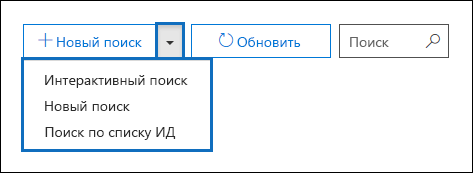
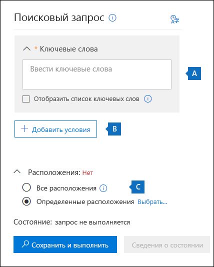
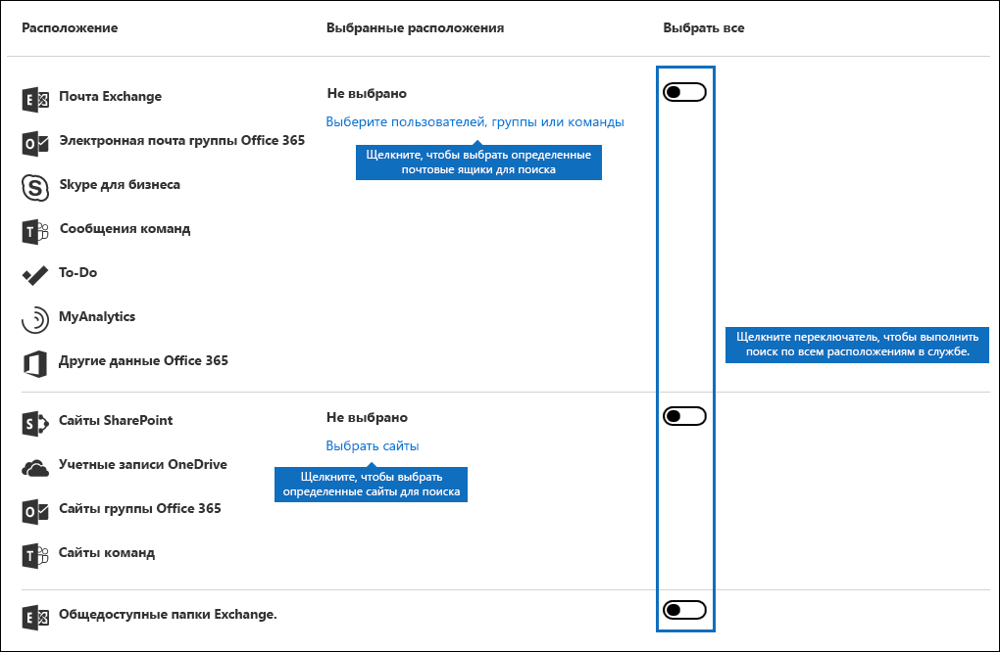
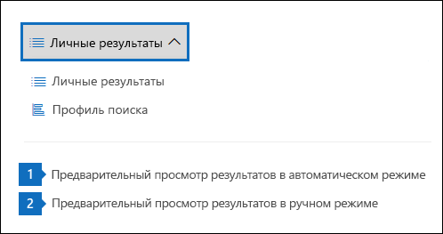
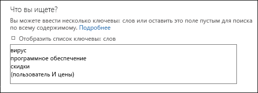
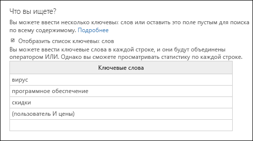
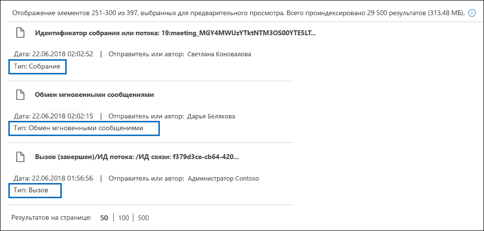
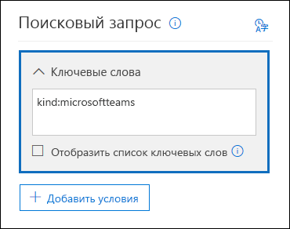
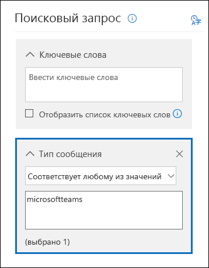

# <a name="content-search-in-office-365"></a>Поиск контента в Office 365

Средство обнаружения электронных данных "Поиск контента" можно использовать в Центре соответствия требованиям в Office 365 или Microsoft 365 для поиска элементов на месте, таких как электронная почта, документы и беседы с мгновенными сообщениями, в организации Office 365.  Это средство можно использовать для поиска элементов в следующих службах Office 365:
  
- Почтовые ящики и общедоступные папки Exchange Online
    
- Сайты SharePoint Online и учетные записи OneDrive для бизнеса
    
- Беседы через Skype для бизнеса
    
- Microsoft Teams 
    
- Группы Office 365
    
После выполнения поиска контента количество расположений контента и приблизительное число результатов поиска отображаются в профиле поиска. Кроме того, можно быстро просмотреть статистику, например расположение контента, в котором есть большинство элементов, соответствующих поисковому запросу. После выполнения поиска можно предварительно просмотреть результаты или экспортировать их на локальный компьютер.

## <a name="create-a-search"></a>Создание поискового запроса

Чтобы получить доступ к странице **Поиск контента** для выполнения поиска содержимого с предварительным просмотром и экспортом результатов, администратор, сотрудник, ответственный за обеспечение соответствия требованиям, или диспетчер по обнаружению электронных данных должны входить в группу ролей "Менеджер по обнаружению электронных данных" в Центре безопасности и соответствия требованиям. Дополнительные сведения см. в статье [Назначение разрешений на обнаружение электронных данных](assign-ediscovery-permissions.md).
  
1. Перейдите на сайт [https://protection.office.com](https://protection.office.com) и войдите с помощью адреса электронной почты Office 365 и пароля.
    
2. Щелкните **Поиск** \> **Поиск контента**.
    
3. На странице **Поиск** щелкните стрелку рядом с элементом  **Новый поиск**. 
    
    
  
    Можно выбрать один из следующих параметров.
    
    - **Интерактивный поиск**. При выборе этого параметра запускается мастер с инструкциями по созданию поискового запроса. Пользовательский интерфейс для выбора расположений контента и создания поискового запроса аналогичен параметру **Новый поиск**. 
    
    - **Новый поиск**. Этот параметр отображает обновленный пользовательский интерфейс для создания поискового запроса. Этот параметр используется по умолчанию при нажатии кнопки **Новый поиск**.
    
    - **Поиск по списку ИД**. Этот параметр позволяет искать определенные сообщения электронной почты и другие элементы почтового ящика с помощью списка идентификаторов Exchange. Чтобы создать поиск по списку идентификаторов (официально называемый целевым поиском), нужно отправить CSV-файл, в котором указаны конкретные элементы почтового ящика для поиска. Инструкции см. в статье [Подготовка CSV-файла для поиска контента в Office 365 по списку идентификаторов](csv-file-for-an-id-list-content-search.md).
    
    Остальные действия этой процедуры соответствуют стандартному процессу создания поискового запроса.
    
4. Щелкните пункт **Новый поиск** в раскрывающемся списке. 
    
5. В разделе **Поисковый запрос** укажите следующие элементы.
    
    
  
   - **Ключевые слова для поиска**. Введите поисковый запрос в поле **Ключевые слова**. Вы можете указать ключевые слова или свойства сообщений, например даты отправки и получения, или свойства документов, например имена файлов или дату последнего изменения. Можно создавать более сложные запросы, включающие логические операторы, например **AND**, **OR**, **NOT** и **NEAR**. Кроме того, возможен поиск конфиденциальной информации (например, номера социального страхования) в документах или поиск документов, доступ к которым получали внешние пользователи. Если оставить незаполненным поле для ввода ключевых слов, в результаты поиска будет включено все содержимое из указанных расположений контента.
    
      Кроме того, вы можете установить флажок **Отобразить список ключевых слов** и вводить ключевые слова в каждой строке. В этом случае в создаваемом поисковом запросе ключевые слова из каждой строки будут соединены логическим оператором (**c:s**), аналогичным по функциональности оператору **OR**. 
    
      Зачем использовать список ключевых слов? Вы можете получить статистические сведения о том, сколько элементов соответствует каждому ключевому слову. Это поможет быстро определить, какие ключевые слова наиболее (и наименее) эффективны. В строке можно также использовать ключевую фразу (в скобках). Дополнительные сведения о статистике поиска см. в статье [Просмотр статистики ключевых слов для результатов поиска контента](view-keyword-statistics-for-content-search.md).

     > [!NOTE]
     > Чтобы сократить ошибки, связанные с крупными списками ключевых слов, в списке ключевых слов теперь можно указать не более 20 строк.
    
    - **Условия**. Вы можете добавить условия поиска, чтобы сузить область поиска и получить более точные результаты. Каждое условие добавляет предложение к поисковому запросу, которое создается и запускается в начале поиска. Условие логически связано с запросом по ключевым словам, указанным в поле для ввода ключевых слов, с помощью логического оператора (**c:c**), аналогичного по функциональности оператору **AND**. Это означает, что элементы попадают в результаты поиска, если соответствуют как запросу по ключевому слову, так и одному или нескольким условиям. Таким образом условия помогают сузить область результатов поиска. Список и описание условий, которые можно использовать в поисковом запросе, см. в разделе "Условия поиска" статьи [Запросы ключевых слов и условия поиска контента](keyword-queries-and-search-conditions.md#search-conditions).
    
       - **Расположения**. Выберите расположения контента для поиска.
    
      - **Все расположения**. Используйте этот параметр для поиска во всех расположениях контента в организации. Сюда входит почта во всех почтовых ящиках Exchange (включая все неактивные почтовые ящики, почтовые ящики для всех групп Office 365, почтовые ящики для всех команд Microsoft Teams), все беседы Skype для бизнеса, все сайты SharePoint и OneDrive для бизнеса (включая сайты для всех групп Office 365 и команд Microsoft Teams) и элементы во всех общедоступных папках Exchange.
    
      - **Определенные расположения**. Используйте этот параметр для поиска в определенных расположениях контента. Вы можете выполнять поиск во всех расположениях контента для определенной службы Office 365 (например, поиск во всех почтовых ящиках Exchange или поиск по всем сайтам SharePoint) или в определенных расположениях любой отображаемой службы Office 365. 
    
        
  
         В список почтовых ящиков Exchange для поиска вы также можете добавить группы рассылки. В этом случае поиск выполняется в почтовых ящиках участников группы. Динамические группы рассылки не поддерживаются.
    
       > [!NOTE]
       > Если поиск выполняется во всех или только в определенных почтовых ящиках, данные из других приложений Office 365, сохраненные в почтовых ящиках пользователей, включаются при экспорте результатов поиска контента. Эти данные не включаются в предполагаемые результаты поиска и недоступны для предварительного просмотра. Они включаются при экспорте и скачивании результатов поиска. Дополнительные сведения см. в статье [Контент, хранящийся в почтовых ящиках Exchange Online](what-is-stored-in-exo-mailbox.md).

    
6. После настройки поискового запроса нажмите кнопку **Сохранить и выполнить**.
    
7. На странице **Сохранить поисковый запрос** введите название поискового запроса и необязательное описание, помогающее определить его. Название поискового запроса должно быть уникальным в пределах организации. 
    
8. Нажмите кнопку **Сохранить**, чтобы начать поиск. 
    
    После сохранения и выполнения поиска все результаты поиска отображаются в области результатов. В зависимости от настроенного параметра предварительного просмотра, отображаются результаты поиска или требуется щелкнуть **Просмотр результатов**, чтобы отобразить их. Подробнее см. в следующем разделе. 
    
Чтобы снова открыть этот поисковый запрос или открыть другие поисковые запросы, перечисленные на странице **Поиск контента**, выберите поисковый запрос и щелкните **Открыть**. 
  
Чтобы очистить результаты или создать другой поисковый запрос, нажмите кнопку  **Новый поиск**. 

  
## <a name="preview-search-results"></a>Предварительный просмотр результатов поиска

Для просмотра результатов поиска существует два параметра конфигурации. После выполнения нового поиска или открытия существующего щелкните **Отдельные результаты**, чтобы отобразить следующие параметры просмотра: 
  

  
1. **Выводить результаты автоматически**. Этот параметр отображает результаты поиска после выполнения поискового запроса.
    
2. **Выводить результаты вручную**. Этот параметр отображает заполнители в области результатов поиска и выводит кнопку **Просмотр результатов**, которую нужно нажать, чтобы отобразить результаты поиска. Это значение по умолчанию. Это позволяет повысить производительность поиска, не отображая результаты поиска автоматически при открытии существующего поискового запроса. 
    
Существуют ограничения, связанные с числом элементов, доступных для предварительного просмотра. Дополнительные сведения см. в статье [Ограничения для поиска контента](limits-for-content-search.md). 
  
Список поддерживаемых типов файлов, доступных для предварительного просмотра, см. в подразделе [Предварительный просмотр результатов поиска](#previewing-search-results) раздела "Дополнительные сведения о поиске контента". Если предварительный просмотр файла этого типа не поддерживается или вам нужно скачать его копию на компьютер, нажмите кнопку **Скачать исходный файл**. Включается URL-адрес веб-страницы формата ASPX, но у вас может не быть разрешений на доступ к ней. 
  
Также обратите внимание, что неиндексированные элементы недоступны для предварительного просмотра.
  
## <a name="view-information-and-statistics-about-a-search"></a>Просмотр сведений и статистики о поиске

После создания и выполнения поиска контента вы можете просмотреть статистику о предполагаемых результатах поиска. Она включает общую сводку результатов поиска, статистику по запросу, такую как количество расположений контента с элементами, соответствующими поисковому запросу, и названия расположений контента, в которых больше всего соответствующих элементов. Вы можете вывести статистику по одному или нескольким поискам контента. Это позволяет быстро сравнить результаты нескольких поисков и определить эффективность запросов.
  
Вы также можете скачать статистику по поискам и ключевым словам в виде CSV-файла, чтобы сравнить результаты с помощью функций фильтрации и сортировки в Excel или подготовить отчеты.
  
Чтобы просмотреть статистику поиска:
  
1. На странице **Поиск контента** щелкните **Открыть** и выберите поисковый запрос, для которого нужно просмотреть статистику. 
    
2. На всплывающей странице щелкните **Открыть запрос**. 
    
3. В раскрывающемся списке **Отдельные результаты** выберите пункт **Статистика поиска**.
    
4. В раскрывающемся списке **Тип** выберите один из следующих вариантов в зависимости от статистики поиска, которую нужно просмотреть. 
    
  - **Сводка**. Отображает статистику для каждого типа расположений контента, в которых выполнен поиск. Здесь указывается число расположений контента, содержащих элементы, соответствующие поисковому запросу, а также общее количество и размер элементов результатов поиска. Это значение по умолчанию.
    
  - **Запросы**. Отображается статистика по поисковому запросу. Сюда включается тип расположения контента, к которому относится статистика запроса, часть поискового запроса, к которой относится статистика (обратите внимание, что параметр **Основной** указывает на весь поисковый запрос), число расположений контента, содержащих элементы, которые соответствуют поисковому запросу, а также общее количество и размер найденных элементов (в указанном расположении контента), соответствующих поисковому запросу. Также отображается статистика для неиндексированных элементов (другое название — *частично индексированные элементы*). Однако в статистику включаются только частично индексированные элементы из почтовых ящиков. В статистику не включаются частично индексированные элементы из SharePoint и OneDrive.
    
  - **Основные расположения**. Выводится статистика по числу элементов, соответствующих поисковому запросу, в каждом расположении контента. Выводится первая 1000 расположений.
    
Более подробные сведения о статистике поиска см. в статье [Просмотр статистики ключевых слов для результатов поиска контента](view-keyword-statistics-for-content-search.md).
  
  
## <a name="export-search-results"></a>Экспорт результатов поиска

После успешного поиска можно экспортировать результаты поиска на локальный компьютер. При экспорте результатов поиска в почте их можно скачать на компьютер в виде PST-файлов или отдельных сообщений (MSG-файлов). При экспорте контента с сайтов SharePoint и OneDrive будут экспортированы копии документов Office. Кроме того, имеются другие документы и отчеты, включаемые в экспортируемые результаты поиска. Вы также можете экспортировать отчет с результатами поиска, а не сами элементы.
  
Чтобы экспортировать результаты поиска:
  
1. На странице **Поиск контента** щелкните поиск, для которого нужно экспортировать результаты. 
    
2. На всплывающей странице щелкните  **Дополнительно** и выберите пункт **Экспорт результатов**. Вы также можете экспортировать отчет о результатах поиска.
    
3. Заполните разделы на всплывающей странице **Экспорт результатов**. Чтобы просмотреть все параметры экспорта, используйте полосу прокрутки. 
    
Более подробные инструкции и советы по устранению неполадок см. в следующих статьях:
  
- [Экспорт результатов поиска контента](export-search-results.md)
    
- [Экспорт отчета о поиске контента](export-a-content-search-report.md)
    
  
## <a name="more-information-about-content-search"></a>Дополнительные сведения о поиске контента

В следующих разделах содержатся дополнительные сведения о поиске контента.
  
[Ограничения поиска контента](#content-search-limits)
  
[Создание поискового запроса](#building-a-search-query)
  
[Поиск в учетных записях OneDrive](#searching-onedrive-accounts)
  
[Поиск в Microsoft Teams и группах Office 365](#searching-microsoft-teams-and-office-365-groups)
  
[Поиск в неактивных почтовых ящиках](#searching-inactive-mailboxes)
  
[Поиск в отключенных или нелицензированных почтовых ящиках](#searching-disconnected-or-de-licensed-mailboxes)

[Предварительный просмотр результатов поиска](#previewing-search-results)
  
[Частично индексированные элементы](#partially-indexed-items)

[Поиск контента в среде SharePoint с поддержкой нескольких регионов](#searching-for-content-in-a-sharepoint-multi-geo-environment)
  
### <a name="content-search-limits"></a>Ограничения поиска контента

- Описание ограничений, применяемых к функции поиска контента, см. в статье [Ограничения для поиска контента](limits-for-content-search.md).
    
- Корпорация Майкрософт получает данные о скорости выполнения запросов на поиск содержимого, создаваемых во всех организациях с Office 365. Хотя сложность запроса тоже влияет на скорость его выполнения, главным фактором, определяющим время поиска, является число почтовых ящиков, в которых он ведется. Хотя время поиска не подкрепляется соглашением об уровне обслуживания, доступны примерные результаты для разного числа почтовых ящиков, включенных в запрос.
    
|**Число почтовых ящиков**|**Среднее время поиска**|
|:-----|:-----|
|100  <br/> |30 секунд  <br/> |
|1000  <br/> |45 секунд  <br/> |
|10 000  <br/> |4 минуты  <br/> |
|25 000   <br/> |10 минут  <br/> |
|50 000  <br/> |20 минут  <br/> |
|100 000  <br/> |25 минут  <br/> |
  
### <a name="building-a-search-query"></a>Создание поискового запроса

Подробные сведения о создании поискового запроса, использовании логических операторов поиска и условий поиска, а также о поиске типов конфиденциальной информации и контента, к которому предоставлен доступ пользователям за пределами вашей организации, см. в статье [Запросы ключевых слов и условия поиска контента](keyword-queries-and-search-conditions.md).
  
При использовании списка ключевых слов для создания поискового запроса учитывайте указанные ниже моменты.
  
- Чтобы создать поисковый запрос, ключевые слова (или фразы) в котором соединены с помощью оператора **OR**, установите флажок **Отобразить список ключевых слов** и введите каждое ключевое слово в отдельной строке. Если вставить в поле список ключевых слов или нажимать клавишу **ВВОД** после ввода ключевых слов, они не будут соединены с помощью оператора **OR**. Ниже приведены примеры неправильного и правильного добавления списка ключевых слов. 
    
    **Неправильный вариант**
    
    
  
    **Правильный вариант**
    
    
  
- Вы также можете подготовить список ключевых слов или фраз в файле Excel или обычном текстовом файле, а затем скопировать и вставить список в поле для ключевых слов. Для этого нужно установить флажок **Отобразить список ключевых слов**. После этого щелкните первую строку в списке ключевых слов и вставьте список. Каждая строка из файла Excel или текстового файла вставляется в отдельную строку в списке ключевых слов. 
    
- После создания поискового запроса с помощью списка ключевых слов рекомендуется проверить его синтаксис. В поисковом запросе, отображаемом в области сведений под надписью **Запрос**, ключевые слова разделяются текстом **(c:s)**. Это означает, что ключевые слова объединены с помощью логического оператора, аналогичного по функциональности оператору **OR**. Аналогичным образом, если поисковый запрос содержит условия, они отделены от ключевых слов текстом **(c:c)**. Это означает, что ключевые слова объединены с условиями с помощью логического оператора, схожего по функциональности с оператором **AND**. Ниже приведен пример поискового запроса (отображаемого в области сведений), который был создан с использованием списка ключевых слов и условия. 
    
    
  
- Когда вы выполняете поиск контента, Office 365 автоматически проверяет ваш поисковый запрос на наличие логических операторов, записанных строчными буквами, и неподдерживаемых символов. Неподдерживаемые символы часто скрыты, а их наличие обычно приводит к ошибке поиска или возврату неверных результатов. Дополнительные сведения о неподдерживаемых символах, наличие которых проверяется, см. в статье [Проверка запроса веб-части "Поиск контента" на ошибки](check-your-content-search-query-for-errors.md).
    
- Если имеется поисковый запрос, содержащий ключевые слова из символов, отсутствующих в английском алфавите (например, китайских символов), вы можете щелкнуть значок **Зарос языка и страны/региона** и выбрать значение региональных параметров для поиска. По умолчанию используется нейтральный язык и регион. Как определить, нужно ли изменить параметры языка для поиска контента? Если вы уверены, что расположения контента содержат искомые символы, отсутствующие в английском алфавите, но поиск не возвращает результатов, причиной могут быть параметры языка. 
  
### <a name="searching-onedrive-accounts"></a>Поиск в учетных записях OneDrive

- Чтобы собрать список URL-адресов сайтов OneDrive в организации, см. статью [Создание списка всех расположений OneDrive в организации](https://support.office.com/article/8e200cb2-c768-49cb-88ec-53493e8ad80a)/ Скрипт в этой статье создает текстовый файл, содержащий список всех сайтов OneDrive. Чтобы запустить этот скрипт, требуется установить и использовать командную консоль SharePoint Online. Не забудьте добавить URL-адрес домена личного сайта вашей организации к каждому сайту OneDrive, на котором нужно выполнить поиск. Это домен, содержащий все хранилище OneDrive. Пример: `https://contoso-my.sharepoint.com`. Вот пример URL-адреса для сайта OneDrive пользователя: `https://contoso-my.sharepoint.com/personal/sarad_contoso_onmicrosoft.com`.
    
    В редких случаях, когда имя участника-пользователя (UPN) изменено, URL-адрес его расположения OneDrive изменяется с учетом нового имени участника-пользователя. В этом случае требуется изменить поиск контента, добавив новый URL-адрес OneDrive пользователя и удалив старый.
  
### <a name="searching-microsoft-teams-and-office-365-groups"></a>Поиск в Microsoft Teams и группах Office 365

Вы можете выполнять поиск в почтовом ящике, связанном с группой Office 365 или командой Microsoft Teams. Так как команды Microsoft Teams создаются на основе групп Office 365, поиск в них выполняется одинаково. В обоих случаях поиск выполняется только в почтовом ящике группы или команды. Поиск в почтовых ящиках участников группы или команды не выполняется. Чтобы выполнить поиск в них, необходимо добавить их в поисковый запрос.
  
При поиске контента в Microsoft Teams и группах Office 365 следует учитывать указанные ниже моменты.
  
- Для поиска контента в командах Teams и группах Office 365 необходимо указать почтовый ящик и сайт SharePoint, связанный с командой или группой.
    
- Чтобы просмотреть свойства команды или группы Office 365, запустите командлет **Get-UnifiedGroup** в Exchange Online. Это удобный способ узнать URL-адрес сайта, связанного с командой или группой. Например, следующая команда отображает выбранные свойства для группы Office365 с именем "Senior Leadership Team": 
    
  ```
  Get-UnifiedGroup "Senior Leadership Team" | FL DisplayName,Alias,PrimarySmtpAddress,SharePointSiteUrl
  DisplayName            : Senior Leadership Team
  Alias                  : seniorleadershipteam
  PrimarySmtpAddress     : seniorleadershipteam@contoso.onmicrosoft.com
  SharePointSiteUrl      : https://contoso.sharepoint.com/sites/seniorleadershipteam
  
  ```

    > [!NOTE]
    > Чтобы запустить командлет **Get-UnifiedGroup**, в Exchange Online вам должна быть назначена роль "получатели только для чтения" или вы должны входить в группу пользователей, которым она назначена. 
  
- Поиск, выполняемый в почтовом ящике пользователя, не распространяется на команды и группы Office365, в которые входит этот пользователь. Кроме того, когда поиск выполняется в команде или группе Office 365, он осуществляется только в указанном почтовом ящике группы и на сайте группы. Поиск в почтовых ящиках и учетных записях OneDrive для бизнеса участников группы не выполняется, если не включить их явным образом в поиск.
    
- Список участников команды или группы Office 365 можно просмотреть в свойствах на странице **Главная \> Группы** в Центре администрирования Microsoft 365. Или можно выполнить следующую команду в Exchange Online PowerShell: 
    
  ```
  Get-UnifiedGroupLinks <group or team name> -LinkType Members | FL DisplayName,PrimarySmtpAddress 
  ```

    > [!NOTE]
    > Чтобы запустить командлет **Get-UnifiedGroupLinks**, в Exchange Online вам должна быть назначена роль "получатели только для чтения" или вы должны входить в группу пользователей, которым она назначена. 
  
- Беседы в канале Teams хранятся в почтовом ящике, связанном с командой. Файлы, которыми обмениваются участники команды, также сохраняются на сайте команды SharePoint. Таким образом, чтобы выполнить поиск бесед и файлов канала, необходимо в качестве расположения содержимого указать почтовый ящик команды и сайт SharePoint.
    
- Беседы в списке чатов в Teams хранятся в почтовом ящике Exchange Online пользователей, участвующих в чате. Файлы, к которым пользователь предоставляет общий доступ в беседах чата, сохраняются в его учетной записи OneDrive для бизнеса. Таким образом, чтобы выполнить поиск бесед и файлов в списке чатов, необходимо в качестве расположений содержимого указать почтовые ящики и учетные записи OneDrive для бизнеса отдельных пользователей.
    
    > [!NOTE]
    > При гибридном развертывании Exchange пользователи с локальным почтовым ящиком могут участвовать в беседах из списка чатов в Teams. В этом случае контент этих бесед также можно найти, так как он сохраняется в облачной области хранилища (называемой *облачным почтовым ящиком для локальных пользователей*) для пользователей с локальным почтовым ящиком. Дополнительные сведения см. в статье [Поиск в облачных почтовых ящиках для локальных пользователей в Office 365](search-cloud-based-mailboxes-for-on-premises-users.md).
  
- Каждая команда и канал команды содержат вики-сайт для создания заметок и совместной работы. Содержимое вики-сайта автоматически сохраняется в файле формата MHT. Этот файл хранится в библиотеке документов Teams Wiki Data на сайте команды в SharePoint. Вы можете использовать средство "Поиск контента" для поиска на вики-сайте, указав сайт SharePoint команды в качестве расположения контента. 
    
    > [!NOTE]
    > Возможность поиска на вики-сайте команды или канала (при поиске на сайте SharePoint команды) была выпущена 22 июня 2017 г. Для поиска доступны вики-страницы, сохраненные или обновленные в этот день или позднее. Вики-страницы, сохраненные или обновленные до этой даты, недоступны для поиска. 
 
- Обобщенные сведения о собраниях и звонках в канале Teams также хранятся в почтовых ящиках пользователей, присоединявшихся к собранию или звонку. Это означает, что вы можете использовать средство "Поиск контента" для поиска этих сводных записей. К обобщенным сведениям относятся: 
  
  - Дата, время начала, время окончания и длительность собрания или звонка

  - Дата и время, когда каждый участник присоединился или покинул собрание или звонок.

  - Звонки, отправленные в голосовую почту

  - Пропущенные или неотвеченные звонки

  - Переключения звонков, представленные двумя отдельными звонками

  Чтобы сводные записи собраний и звонков стали доступны для поиска, может потребоваться до 8 часов.

  В результатах поиска сводка по собраниям обозначается как **Собрание** в поле **Тип**, а сводка по звонкам обозначается как **Звонок**. Кроме того, беседы из канала Teams и чатов обозначаются как **Мгновенное сообщение** в поле **Тип**.
  
  

- Чтобы специально выполнить поиск контента Teams, можно использовать свойство электронной почты **Kind** или условие поиска **Тип сообщения**. 
  
  - Чтобы использовать свойство **Kind** в составе поискового запроса по ключевым словам, в поле **Ключевые слова** запроса введите `kind:microsoftteams`.

    
  
  - Чтобы использовать условие поиска, добавьте условие **Тип сообщения** и используйте значение `microsoftteams`. 

    

Условия логически связаны с запросом по ключевому слову с помощью оператора **AND**. Это означает, что для возвращения в результатах поиска элемент должен соответствовать как запросу по ключевому слову, так и условию поиска. Дополнительные сведения см. в разделе "Рекомендации по использованию условий" статьи [Запросы ключевых слов и условия поиска контента](keyword-queries-and-search-conditions.md#guidelines-for-using-conditions).
  
### <a name="searching-inactive-mailboxes"></a>Поиск в неактивных почтовых ящиках

При поиске контента можно выполнять поиск в неактивных почтовых ящиках. Чтобы получить список неактивных почтовых ящиков в организации, выполните команду `Get-Mailbox -InactiveMailboxOnly` в  Exchange Online PowerShell. Или выберите **Управление данными** \> **Хранение** в Центре безопасности и соответствия требованиям и щелкните **Дополнительно** \> **Неактивные почтовые ящики**.
  
Вот несколько моментов, которые следует помнить при поиске в неактивных почтовых ящиках:

- Если существующий поиск контента выполняется в почтовом ящике пользователя, и этот почтовый ящик становится неактивным, при повторном запуске поиск в нем все равно будет выполняться.
    
- Иногда возникают ситуации, когда у активного и неактивного почтовых ящиков одинаковый SMTP-адрес. В этом случае поиск осуществляется только в выбранном вами почтовом ящике. Другими словами, если добавляется почтовый ящик пользователя для поиска, нельзя предполагать, что поиск выполняется как в активном, так и неактивном почтовом ящике. Поиск выполняется только в почтовом ящике, который явным образом добавлен в поисковый запрос.
    
- Чтобы выполнить поиск контента в неактивном почтовом ящике, можно использовать оболочку PowerShell в Центре безопасности и соответствия требованиям Для этого требуется добавить точку ( . ) перед адресом неактивного почтового ящика. Например, следующая команда позволяет создать запрос на поиск контента в неактивном почтовом ящике с адресом pavelb@contoso.onmicrosoft.com:

   ``` 
   New-ComplianceSearch -name InactiveMailboxSearch -ExchangeLocation .pavelb@contoso.onmicrosoft.com -AllowNotFoundExchangeLocationsEnabled $true
   ```

- Мы настоятельно рекомендуем избегать ситуаций, когда у активного и неактивного почтовых ящиков одинаковый SMTP-адрес. Если вы хотите повторно использовать SMTP-адрес, назначенный неактивному почтовому ящику, мы рекомендуем выполнить возврат неактивного почтового ящика или восстановить содержимое неактивного почтового ящика в активном почтовом ящике (или архиве активного почтового ящика), а затем удалить неактивный почтовый ящик. Дополнительные сведения см. в следующих статьях:
    
  - [Возврат неактивного почтового ящика в Office 365](recover-an-inactive-mailbox.md)
    
  - [Восстановление неактивного почтового ящика в Office 365](restore-an-inactive-mailbox.md)
    
  - [Удаление неактивного почтового ящика в Office 365](delete-an-inactive-mailbox.md)

### <a name="searching-disconnected-or-de-licensed-mailboxes"></a>Поиск в отключенных или нелицензированных почтовых ящиках

Если лицензия на Exchange Online (или лицензия на весь Office 365) удаляется из учетной записи пользователя в Office 365 или Azure Active Directory, почтовый ящик пользователя становится *отключенным* почтовым ящиком. Это означает, что почтовый ящик больше не связан с учетной записью пользователя. Ниже описано, что происходит при поиске в отключенных почтовых ящиках.

- Если лицензия удаляется из почтового ящика, то возможность поиска для него более недоступна. 

- Если существующий поиск контента выполняется в почтовом ящике, из которого удалена лицензия, при повторном запуске поиска контента не будут возвращаться результаты из отключенного почтового ящика.

- Если вы используете командлет **New-ComplianceSearch** для создания поиска контента и указываете в качестве расположения контента Exchange отключенный почтовый ящик, поиск контента не будет возвращать какие-либо результаты поиска из отключенного почтового ящика.

Если вам нужно сохранить данные в отключенном почтовом ящике, чтобы для него была обеспечена возможность поиска, перед удалением лицензии необходимо поместить почтовый ящик в режим хранения. Это позволит сохранить данные и обеспечит возможность поиска для отключенного почтового ящика до тех пор, пока режим удержания не будет снят. Дополнительные сведения о режиме удержания см. в статье [Как определить тип удержания, примененного для почтового ящика Exchange Online](identify-a-hold-on-an-exchange-online-mailbox.md)

### <a name="previewing-search-results"></a>Предварительный просмотр результатов поиска

Файлы поддерживаемых типов можно просматривать в области предварительного просмотра. Если тип файла не поддерживается, требуется скачать его копию для просмотра на компьютере. Следующие поддерживаемые типы файлов можно просматривать в области результатов поиска.
  
- TXT, HTML, MHTML
    
- EML
    
- DOC, DOCX, DOCM
    
- PPTM, PPTX
    
- PDF
    
Также поддерживаются следующие типы файлов контейнера. Списки файлов контейнера можно просматривать в области предварительного просмотра.
  
- ZIP
    
- GZIP
    
### <a name="partially-indexed-items"></a>Частично индексированные элементы

- Как указано выше, в предполагаемые результаты поиска включаются частично индексированные элементы почтовых ящиков. В предполагаемые результаты поиска не включаются частично индексированные элементы из SharePoint и OneDrive. 
    
- Если частично индексированный элемент совпадает с поисковым запросом (так как другие свойства сообщения или документа соответствуют условиям поиска), он не включается в предполагаемое число неиндексированных элементов. Если частично индексированный элемент исключен по условиям поиска, он не включается в предполагаемое число неиндексированных элементов. Дополнительные сведения см. в статье [Частично индексированные элементы в средстве "Поиск контента" в Office 365](partially-indexed-items-in-content-search.md).

### <a name="searching-for-content-in-a-sharepoint-multi-geo-environment"></a>Поиск контента в среде SharePoint с поддержкой нескольких регионов

Если диспетчеру eDiscovery необходимо искать контент в SharePoint и OneDrive в различных регионах в [среде SharePoint с поддержкой нескольких регионов](https://go.microsoft.com/fwlink/?linkid=860840), для этого нужно выполнить следующие действия:
   
1. Создайте отдельную учетную запись пользователя для каждого вспомогательного географического расположения, поиск в котором требуется диспетчеру eDiscovery. Чтобы найти контент на сайтах в этом географическом расположении, диспетчер eDiscovery должен войти в учетную запись, которую вы создали для этого расположения, и затем выполнить поиск контента.

2. Создайте фильтр разрешений поиска для каждого вспомогательного географического расположения (и соответствующей учетной записи пользователя), поиск в котором должен выполнить диспетчер eDiscovery. Каждый из этих фильтров разрешений поиска ограничивает область поиска контента определенным географическим расположением, когда диспетчер eDiscovery вошел в учетную запись пользователя, связанную с этим местоположением.
 
> [!TIP]
> Следовать этой стратегии при использовании средства поиска в [Advanced eDiscovery](compliance20/overview-ediscovery-20.md) не обязательно. Это объясняется тем, что при поиске на сайтах SharePoint и в учетных записях OneDrive в Advanced eDiscovery поиск выполняется по всем центрам обработки данных. Эту стратегию работы с учетными записями пользователей с определенным регионом и фильтрами разрешения на поиск нужно использовать только в том случае, если вы используете средство поиска контента и выполняете поиск, связанный с досье [eDiscovery](ediscovery-cases.md). 


Предположим, что диспетчер eDiscovery должен найти контент SharePoint и OneDrive в периферийных расположениях в Чикаго, Лондоне и Токио. В первую очередь необходимо создать три учетных записи пользователей, по одной для каждого расположения. Следующий этап — создание трех фильтров разрешений поиска: по одному для каждого расположения и соответствующей учетной записи. Ниже приведены примеры трех фильтров разрешений поиска для этого сценария. В каждом из этих примеров **Регион** означает местоположение центра обработки данных SharePoint для этого географического расположения, а параметр **Пользователи** означает соответствующую учетную запись пользователя. 

**Северная Америка**
```
New-ComplianceSecurityFilter -FilterName "SPMultiGeo-Chicago" -Users ediscovery-chicago@contoso.com -Region NAM -Action ALL
```

**Европа**
```
New-ComplianceSecurityFilter -FilterName "SPMultiGeo-London" -Users ediscovery-london@contoso.com -Region GBR -Action ALL
```

**Азиатско-Тихоокеанский регион**
```
New-ComplianceSecurityFilter -FilterName "SPMultiGeo-Toyko" -Users ediscovery-tokyo@contoso.com -Region JPN -Action ALL
```

При использовании фильтров разрешений на поиск контента в средах с поддержкой нескольких географических регионов учитывайте перечисленные ниже моменты.

- Параметр **Регион** направляет поиск в указанное вспомогательное расположении. Если диспетчер eDiscovery ищет только сайты SharePoint и OneDrive за пределами региона, указанного в фильтре разрешения поиска, результаты поиска не возвращаются. 

- Параметр **Регион** не управляет поиском в почтовых ящиках Exchange. При поиске в почтовых ящиках будет выполняться поиск во всех центрах обработки данных. 
    
Дополнительные сведения об использовании фильтров разрешений поиска в нескольких географических средах см. раздел “Поиск и экспорт контента в средах с поддержкой нескольких регионов” в статье [Настройка границ соответствия для расследований дел обнаружения электронных данных в Office 365](set-up-compliance-boundaries.md#searching-and-exporting-content-in-multi-geo-environments)
