# <a name="create-a-custom-sensitive-information-type-in-office-365-security--compliance-center-powershell"></a>Создание пользовательского типа конфиденциальных данных в PowerShell Центра безопасности и соответствия требованиям Office 365

В системе защиты от потери данных Office 365 имеется много [типов конфиденциальных данных](what-the-sensitive-information-types-look-for.md), которые вы можете использовать в своих политиках защиты от потери данных. С помощью встроенных типов можно обнаруживать и защищать номера кредитных карт, банковских счетов, паспортов и многие другие конфиденциальные сведения. 
  
Если вам необходимо обнаруживать и защищать конфиденциальные сведения другого типа, например идентификаторы сотрудников, для которых в вашей организации используется особый формат, вы можете создать пользовательский тип конфиденциальных данных. Для определения типа конфиденциальных данных используется XML-файл, который называется _пакетом правил_.
  
В этой статье рассказывается, как создать XML-файл, в котором вы можете определить собственный пользовательский тип конфиденциальных данных. Для этого вы должны уметь создавать регулярные выражения. В качестве примера здесь описан процесс создания пользовательского типа конфиденциальных данных, с помощью которого можно обнаруживать идентификаторы сотрудников. Вы можете использовать этот пример XML-файла в качестве основы для собственного XML-файла.
  
Создав XML-документ правильного формата, вы можете отправить его в Office 365 с помощью Office 365 PowerShell. Затем вы сможете использовать этот пользовательский тип конфиденциальных данных в своих политиках защиты от потери данных и проверить, обнаруживает ли система конфиденциальные данные так, как вы задумали.

> [!NOTE]
> Вы также можете создавать менее сложные пользовательские типы конфиденциальных данных в интерфейсе Центра безопасности и соответствия требованиям. Дополнительные сведения см. в статье [Создание пользовательского типа конфиденциальных данных](create-a-custom-sensitive-information-type.md).

## <a name="important-disclaimer"></a>Отказ от ответственности

В связи с разнообразием сред клиентов и требований к совпадению содержимого служба поддержки Майкрософт не может помочь в определении совпадений содержимого, например определении пользовательских классов или шаблонов регулярных выражений (также называемых RegEx). В вопросах разработки, тестирования и отладки совпадений содержимого пользователям Office 365 придется рассчитывать только на внутренние ИТ-ресурсы. Кроме того, можно использовать внешние консультационные ресурсы, такие как Консультационные службы Майкрософт (MCS). Специалисты службы поддержки могут в некоторой степени помочь настроить функцию, но они не гарантируют, что разработка в области совпадений содержимого будет соответствовать требованиям или обязательствам клиента. Примером такой возможной поддержки может служить предоставление шаблона регулярного выражения во время тестирования. В службе поддержки также могут помочь устранить неполадки в уже имеющемся шаблоне, который не срабатывает должным образом, на одном конкретном примере сравнения содержимого.

 Дополнительные сведения о модуле RegEx в .NET, используемом для обработки текста, см. в документации по [регулярным выражениям в .NET](https://docs.microsoft.com/dotnet/standard/base-types/regular-expressions).
    
## <a name="sample-xml-of-a-rule-package"></a>Пример XML-файла пакета правил

Вот пример XML-файла пакета правил, который мы создадим в этой статье. Его элементы и атрибуты описаны в разделах ниже.
  
```
<?xml version="1.0" encoding="UTF-16"?>
<RulePackage xmlns="http://schemas.microsoft.com/office/2011/mce">
<RulePack id="DAD86A92-AB18-43BB-AB35-96F7C594ADAA">
    <Version build="0" major="1" minor="0" revision="0"/>
    <Publisher id="619DD8C3-7B80-4998-A312-4DF0402BAC04"/>
    <Details defaultLangCode="en-us">
        <LocalizedDetails langcode="en-us">
            <PublisherName>Contoso</PublisherName>
            <Name>Employee ID Custom Rule Pack</Name>
            <Description>
            This rule package contains the custom Employee ID entity.
            </Description>
        </LocalizedDetails>
    </Details>
</RulePack>
<Rules>
<!-- Employee ID -->
    <Entity id="E1CC861E-3FE9-4A58-82DF-4BD259EAB378" patternsProximity="300" recommendedConfidence="70">
        <Pattern confidenceLevel="60">
            <IdMatch idRef="Regex_employee_id"/>
        </Pattern>
        <Pattern confidenceLevel="70">
            <IdMatch idRef="Regex_employee_id"/>
            <Match idRef="Func_us_date"/>
        </Pattern>
        <Pattern confidenceLevel="80">
            <IdMatch idRef="Regex_employee_id"/>
            <Match idRef="Func_us_date"/>
            <Any minMatches="1">
                <Match idRef="Keyword_badge" minCount="2"/>
                <Match idRef="Keyword_employee"/>
            </Any>
            <Any minMatches="0" maxMatches="0">
                <Match idRef="Keyword_false_positives_local"/>
                <Match idRef="Keyword_false_positives_intl"/>
            </Any>
        </Pattern>
    </Entity>
    <Regex id="Regex_employee_id">(\s)(\d{9})(\s)</Regex>
    <Keyword id="Keyword_employee">
        <Group matchStyle="word">
            <Term>Identification</Term>
            <Term>Contoso Employee</Term>
        </Group>
    </Keyword>
    <Keyword id="Keyword_badge">
        <Group matchStyle="string">
            <Term>card</Term>
            <Term>badge</Term>
            <Term caseSensitive="true">ID</Term>
        </Group>
    </Keyword>
    <Keyword id="Keyword_false_positives_local">
        <Group matchStyle="word">
            <Term>credit card</Term>
            <Term>national ID</Term>
        </Group>
    </Keyword>
    <Keyword id="Keyword_false_positives_intl">
        <Group matchStyle="word">
            <Term>identity card</Term>
            <Term>national ID</Term>
            <Term>EU debit card</Term>
        </Group>
    </Keyword>
    <LocalizedStrings>
        <Resource idRef="E1CC861E-3FE9-4A58-82DF-4BD259EAB378">
            <Name default="true" langcode="en-us">Employee ID</Name>
            <Description default="true" langcode="en-us">
            A custom classification for detecting Employee IDs.
            </Description>
            <Name default="true" langcode="de-de">Name for German locale</Name>
            <Description default="true" langcode="de-de">
            Description for German locale.
            </Description>
        </Resource>
    </LocalizedStrings>
</Rules>
</RulePackage>
```

## <a name="what-are-your-key-requirements-rule-entity-pattern-elements"></a>Каковы ваши основные требования? [Элементы Rule, Entity, Pattern]

Прежде чем приступать к работе, желательно разобраться в базовой структуре схемы XML правила и понять, как с помощью этой структуры определять собственные типы конфиденциальных данных для обнаружения необходимого контента.
  
Правило определяет один или несколько объектов (типов конфиденциальных данных), а каждый объект определяет один или несколько шаблонов. Шаблон — это то, что ищет система защиты от потери данных, когда оценивает контент, например почту или документы.
  
(Замечание по терминологии: если вы знакомы с политиками защиты от потери данных, вы знаете, что политика содержит одно или несколько правил, которые состоят из условий и действий. В этой статье в разметке XML используется правило для обозначения шаблонов, которые определяют объект, также называемый типом конфиденциальных данных. Таким образом, когда вы видите правило в данной статье, имейте в виду объект или тип конфиденциальных данных, а не условия и действия.)
  
### <a name="simplest-scenario-entity-with-one-pattern"></a>Простейший сценарий: объект с одним шаблоном

Вот простейший сценарий. Вам необходимо, чтобы политика защиты от потери данных обнаруживала контент, содержащий идентификаторы сотрудников вашей организации, которые имеют формат девятизначного числа. Таким образом, шаблон ссылается на регулярное выражение, содержащееся в правиле, которое обнаруживает девятизначные числа. Любой контент, содержащий девятизначные числа, соответствует шаблону.
  

  
Из-за своей простоты этот шаблон может часто приводить к ложным срабатываниям, обнаруживая контент, который содержит любые девятизначные числа. Такие числа не всегда являются идентификаторами сотрудников.
  
### <a name="more-common-scenario-entity-with-multiple-patterns"></a>Более распространенный сценарий: объект с несколькими шаблонами

По этой причине для определения объекта чаще используют несколько шаблонов, и эти шаблоны обнаруживают подтверждающие признаки (например, ключевые слова или даты) в дополнение к объекту (например, девятизначному номеру).
  
Например, чтобы повысить вероятность обнаружения контента, содержащего идентификатор сотрудника, вы можете определить еще один шаблон, который помимо девятизначного числа обнаруживает дату найма сотрудника на работу либо дату найма и какие-либо ключевые слова (например, "идентификатор сотрудника").
  
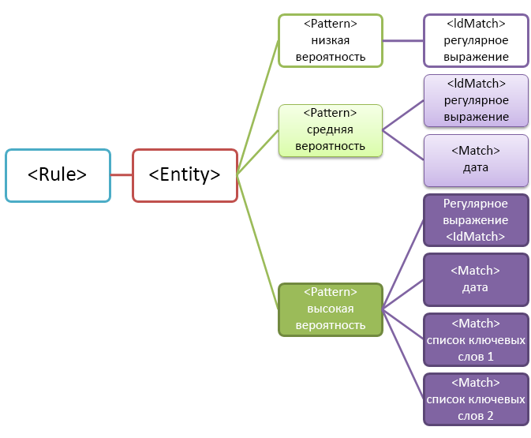
  
Обратите внимание на некоторые указанные ниже важные аспекты этой структуры.
  
- Шаблоны, для которых требуются дополнительные признаки, имеют более высокий уровень надежности. Это удобно, так как когда вы будете использовать этот тип конфиденциальных данных в политике защиты от потери данных, вы сможете применять действия с более строгими ограничениями (например, блокировать контент) c помощью одного соответствия с высоким уровнем надежности и действия с не очень строгими ограничениями (например, отправлять уведомления) для соответствий с низким уровнем надежности.
    
- Вспомогательные элементы IdMatch и Match ссылаются на регулярные выражения и ключевые слова, которые фактически являются дочерними элементами элемента Rule, а не элемента Pattern. Элемент Pattern ссылается на эти вспомогательные элементы, но они входят в состав элемента Rule. Это означает, что на одно определение вспомогательного элемента, например регулярного выражения или списка ключевых слов, может ссылаться несколько объектов и шаблонов.
    
## <a name="what-entity-do-you-need-to-identify-entity-element-id-attribute"></a>Какой объект вам необходимо определить? [Элемент Entity, атрибут id]

Объект — это тип конфиденциальной информации, например номер кредитной карты, имеющий правильно определенный шаблон. У каждого объекта имеется уникальный GUID, используемый в качестве идентификатора объекта.
  
### <a name="name-the-entity-and-generate-its-guid"></a>Присваивание объекту имени и создание GUID для него

Добавьте элементы Rules и Entity. Затем добавьте комментарий, в котором указано имя вашего пользовательского объекта (в этом примере Employee ID). Позже вы добавите имя объекта в раздел локализованных строк, и это имя будет отображаться в пользовательском интерфейсе при создании политики защиты от потери данных.
  
Затем создайте GUID для своего объекта. Существует несколько способов создания GUID, но вы можете без труда сделать это в PowerShell, введя [guid]::NewGuid(). Далее вы добавите GUID объекта в раздел локализованных строк.
  
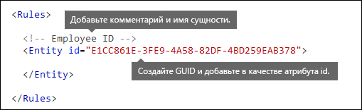
  
## <a name="what-pattern-do-you-want-to-match-pattern-element-idmatch-element-regex-element"></a>Соответствие какому шаблону необходимо проверять? [Элемент Pattern, элемент IdMatch, элемент Regex]

Шаблон содержит список того, для поиска чего следует использовать тип конфиденциальной информации. Он может включать регулярные выражения, ключевые слова и встроенные функции (которые предназначены для различных задач, например они могут выполнять регулярные выражения для поиска дат или адресов). Типы конфиденциальных данных могут иметь несколько шаблонов с уникальными уровнями надежности.
  
Все указанные ниже шаблоны объединяет то, что они ссылаются на одно и то же регулярное выражение, которое выполняет поиск девятизначного числа (\d{9}) с пробелами в начале и в конце (\s) … (\s). На это регулярное выражение ссылается элемент IdMatch, и оно представляет собой общее требование для всех шаблонов, которые выполняют поиск объекта Employee ID. IdMatch — это идентификатор, соответствие которому пытается найти шаблон, например идентификатор сотрудника, номер кредитной карты или номер социального страхования. У элемента Pattern должен быть строго один элемент IdMatch.
  
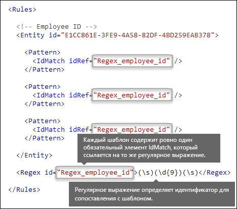
  
При выполнении условия шаблон возвращает значения количества и уровня надежности, которые вы можете использовать в условиях в своей политике защиты от потери данных DLP. Когда вы добавляете условие для обнаружения типа конфиденциальных данных в политику защиты от потери данных, вы можете изменить значения количества и уровня надежности, как показано здесь. Понятие уровня надежности (также называемого точностью совпадения) мы объясним далее в этой статье.
  

  
Составляя регулярное выражение, вы должны иметь в виду, что имеется ряд потенциальных проблем, о которых вам следует знать. Например, если вы напишете и отправите регулярное выражение, которое обнаруживает слишком большое количество контента, это может ухудшить производительность. Дополнительные сведения об этих потенциальных проблемах см. в разделе [Проблемы, которые могут возникнуть при проверке](#potential-validation-issues-to-be-aware-of) ниже.
  
## <a name="do-you-want-to-require-additional-evidence-match-element-mincount-attribute"></a>Необходимо ли вам требовать дополнительные признаки? [Элемент Match, атрибут minCount]

Помимо элемента IdMatch в шаблоне можно использовать элемент Match, чтобы требовать дополнительные подтверждающие признаки, например ключевое слово, регулярное выражение, дату или адрес.
  
Элемент Pattern может содержать несколько элементов Match. Их можно включить непосредственно в элемент Pattern либо объединить с помощью элемента Any. Для объединения элементов Match используется неявный оператор AND. Чтобы сработал шаблон, должны быть выполнены условия всех элементов Match. Чтобы использовать операторы AND или OR, можно применить элемент Any (более подробные сведения об этом см. в следующем разделе).
  
С помощью необязательного атрибута minCount вы можете указать количество экземпляров соответствия, которые необходимо найти для каждого элемента Match. Например, вы можете указать, что шаблон срабатывает, только если найдено не менее двух ключевых слов из списка ключевых слов.
  
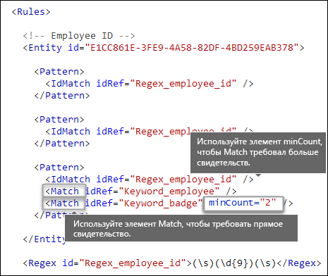
  
### <a name="keywords-keyword-group-and-term-elements-matchstyle-and-casesensitive-attributes"></a>Ключевые слова [элементы Keyword, Group и Term, атрибуты matchStyle и caseSensitive]

Если вам необходимо обнаруживать конфиденциальные сведения, например идентификаторы сотрудников, то вам, скорее всего, потребуется использовать ключевые слова в качестве подтверждающих признаков. Например, помимо поиска девятизначного числа вам может потребоваться искать слова "карта", "эмблема" или "идентификатор". Для этого используйте элемент Keyword. У элемента Keyword есть атрибут id, на который могут ссылаться несколько элементов Match в нескольких шаблонах или объектах.
  
Ключевые слова добавляют в виде списка элементов Term в элементе Group. У элемента Group есть атрибут matchStyle, который может принимать два указанных ниже значения.
  
- **matchStyle="word"**. Соответствие word позволяет обнаруживать целые слова с пробелами или другими разделителями слева и справа. Вам всегда следует использовать соответствие word кроме случаев, когда необходимо находить соответствия частям слов или словам в азиатских языках. 
    
- **matchStyle="string"** Соответствие string позволяет обнаруживать строки независимо от того, какие символы расположены слева и справа от них. Например, строке "кон" будут соответствовать выражения "консул" и "закон". Используйте соответствие string, только если вам необходимо находить соответствия словам на азиатских языках либо если ключевое слово может быть в составе других строк. 
    
И, наконец, с помощью атрибута caseSensitive элемента Term вы можете указать, что контент должен точно соответствовать ключевому слову с учетом регистра символов.
  
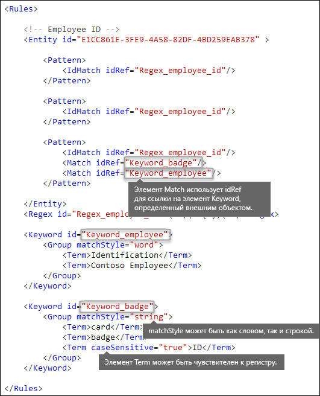
  
### <a name="regular-expressions-regex-element"></a>Регулярные выражения [элемент Regex]

В этом примере в объекте идентификатора сотрудника уже используется элемент IdMatch для ссылки на регулярное выражение для шаблона — девятизначное число с пробелами слева и справа. Помимо этого, в шаблоне можно использовать элемент Match для ссылки на дополнительный элемент Regex, чтобы обнаруживать подтверждающие признаки, например пяти- или шестизначные числа в формате почтового индекса США.
  
### <a name="additional-patterns-such-as-dates-or-addresses-built-in-functions"></a>Дополнительные шаблоны, например даты или адреса [встроенные функции]

Помимо встроенных типов конфиденциальных данных в системе защиты от потери данных имеются встроенные функции, которые могут обнаруживать подтверждающие признаки, например даты в формате США, даты в формате ЕС, даты окончания сроков действия или адреса в США. Система защиты от потери данных не поддерживает отправку пользовательских функций, но когда вы создаете пользовательский тип конфиденциальных данных, ваш объект может ссылаться на встроенные функции.
  
Например, на эмблеме с идентификатором сотрудника имеется дата найма сотрудника на работу, поэтому этот пользовательский объект может использовать встроенную функцию `Func_us_date`, чтобы обнаруживать дату в формате, обычно применяемом в США. 
  
Дополнительные сведения см. в статье [Сведения, для обнаружения которых используются функции защиты от потери данных](what-the-dlp-functions-look-for.md).
  
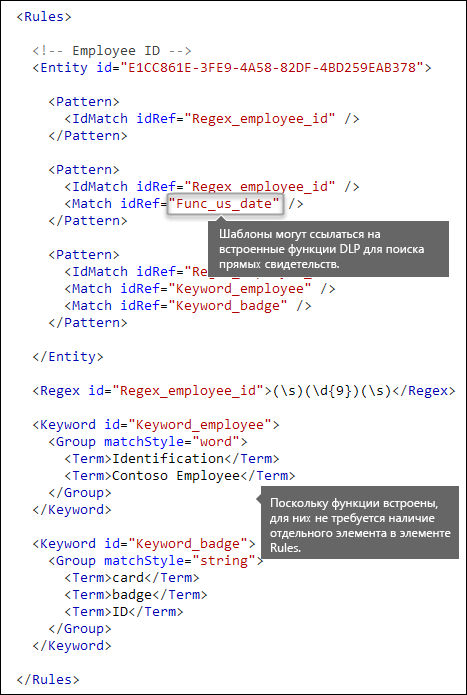
  
## <a name="different-combinations-of-evidence-any-element-minmatches-and-maxmatches-attributes"></a>Различные сочетания признаков [элемент Any, атрибуты minMatches и maxMatches]

В элементе Pattern все элементы IdMatch и Match соединены неявным оператором AND: чтобы сработал шаблон, необходимо, чтобы имели место все совпадения. Тем не менее вы можете создать более гибкую логику совпадений, группируя элементы Match с помощью элемента Any. Например, вы можете использовать элемент Any для соответствия всем, никаким или конкретному подмножеству его дочерних элементов Match.
  
У элемента Any имеется необязательные атрибуты minMatches и maxMatches, с помощью которых вы можете указать, сколько дочерних элементов Match необходимо выполнить, чтобы сработал шаблон. Учтите, что эти атрибуты определяют количество элементов Match, которые необходимо выполнить, а не количество признаков, обнаруженных для соответствий. Чтобы определить минимальное количество экземпляров для определенного совпадения, например два ключевых слова из списка, используйте атрибут minCount для элемента Match (см. выше).
  
### <a name="match-at-least-one-child-match-element"></a>Совпадение для хотя бы одного дочернего элемента Match

Если необходимо, чтобы выполнялось только минимальное количество элементов Match, можно использовать атрибут minMatches. По сути, эти элементы Match соединены неявным оператором OR. Этот элемент Any выполняется при обнаружении даты в формате США или ключевого слова из любого списка.
  
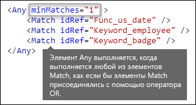
  
### <a name="match-an-exact-subset-of-any-children-match-elements"></a>Точное соответствие подмножеству любых дочерних элементов Match

Если необходимо, чтобы выполнялось строго определенное количество элементов Match, вы можете задать одинаковые значения для элементов minMatches и maxMatches. Этот элемент Any будет выполняться только при обнаружении строго одной даты или одного ключевого слова. При обнаружении нескольких дат или ключевых слов шаблон не сработает.
  
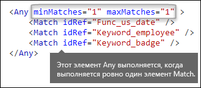
  
### <a name="match-none-of-children-match-elements"></a>Несоответствие никаким дочерним элементам Match

Если необходимо, чтобы не выполнялся ни один определенный признак для шаблона, вы можете задать для элементов minMatches и maxMatches значение 0. Это может быть удобно, если у вас есть список ключевых слов либо другой признак, которые, скорее всего, приведут к ложному срабатыванию.
  
Например, объект идентификатора сотрудника выполняет поиск ключевого слова "карта", так как это слово может быть связано с выражением "идентификационная карта". Тем не менее если слово "карта" появляется только во фразе "кредитная карта", то в этом контексте маловероятно, что оно будет означать "идентификационная карта". Поэтому вы можете добавить выражение "кредитная карта" в качестве ключевого слова в список терминов, для которых не должно быть совпадений, чтобы сработал шаблон.
  
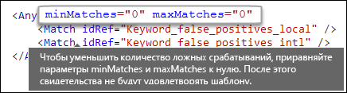
  
## <a name="how-close-to-the-entity-must-the-other-evidence-be-patternsproximity-attribute"></a>Насколько близко к объекту должен находиться другой признак? [Атрибут patternsProximity]

Ваш тип конфиденциальных данных используется для поиска шаблона, который представляет идентификатор сотрудника, и в рамках этого шаблона также выполняется поиск подтверждающего признака, например ключевого слова "ID". Это логично, так как чем ближе этот признак, тем больше вероятность того, что шаблон окажется реальным идентификатором сотрудника. Вы можете указать, насколько близко должен находиться другой признак в шаблоне к объекту, используя обязательный атрибут patternsProximity элемента Entity.
  
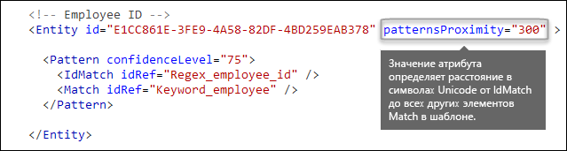
  
Для каждого шаблона в объекте значение атрибута patternsProximity определяет расстояние (в количестве символов Юникод) от расположения элемента IdMatch для всех остальных элементов Matches, указанных для этого элемента Pattern. Интервал вероятности закрепляется расположением элемента IdMatch, при этом интервал простирается влево и вправо от этого элемента.
  
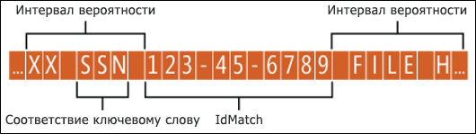
  
В примере ниже показано, как интервал вероятности влияет на соответствие шаблону, в котором для элемента IdMatch пользовательского объекта идентификатора сотрудника требуется хотя бы одно подтверждающее соответствие ключевому слову или дате. Срабатывает только соответствие ID1, так как для соответствий ID2 и ID3 не найдено подтверждающих признаков либо найдены частичные подтверждающие признаки в пределах интервала вероятности.
  

  
Обратите внимание, что в случае электронного письма тело сообщения и все вложения обрабатываются как отдельные элементы. Это означает, что интервал вероятности не распространяется за пределы каждого из этих элементов. В каждом элементе (вложении или теле) должен быть и элемент idMatch, и подтверждающий признак.
  
## <a name="what-are-the-right-confidence-levels-for-different-patterns-confidencelevel-attribute-recommendedconfidence-attribute"></a>Каков должен быть уровень надежности для различных шаблонов? [Атрибуты confidenceLevel и recommendedConfidence]

Чем больше признаков требуется для шаблона, тем выше уровень надежности обнаружения необходимого объекта (например, идентификатора сотрудника) при срабатывании шаблона. Например, уровень надежности шаблона, для которого требуется девятизначное число идентификатора, дата найма сотрудника на работу и ключевое слово в непосредственной близости, выше уровня надежности шаблона, для которого требуется только девятизначное число идентификатора.
  
Элемент Pattern имеет обязательный атрибут confidenceLevel. Можно считать значение атрибута confidenceLevel (целое число от 1 до 100) уникальным идентификатором для каждого шаблона в объекте: у шаблонов в объекте должны быть разные назначенные вами уровни надежности. Не нужно стараться точно выбирать целые значения, просто выберите числа, которые будут понятны группе, отвечающей за соответствие требованиям в вашей организации. После того как вы отправите свой пользовательский тип конфиденциальных данных и создадите политику защиты от потери данных, вы сможете ссылаться на эти уровни надежности в условиях создаваемых вами правил.
  
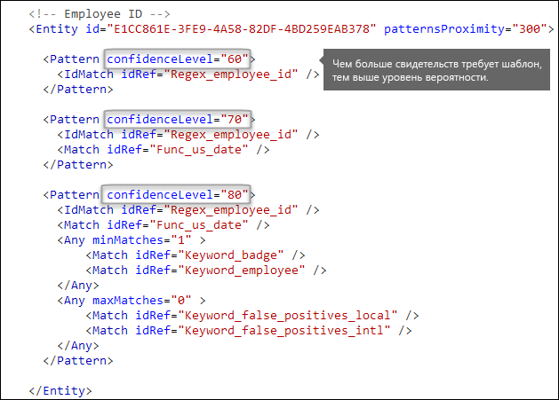
  
Помимо атрибута confidenceLevel для каждого элемента Pattern у элемента Entity имеется атрибут recommendedConfidence. Атрибут рекомендуемого уровня надежности можно считать уровнем надежности, используемым по умолчанию для правила. Если в процессе создания правила для политики защиты от потери данных вы не укажете уровень надежности, который необходимо использовать для правила, это правило будет срабатывать на основании рекомендованного уровня надежности для объекта.
  
## <a name="do-you-want-to-support-other-languages-in-the-ui-of-the-security-amp-compliance-center-localizedstrings-element"></a>Вам необходима поддержка других языков в пользовательском интерфейсе Центра безопасности и соответствия требованиям? [Элемент LocalizedStrings]

Если группа обеспечения соответствия требованиям вашей организации использует Центр безопасности и соответствия требованиям Office 365 для создания политик защиты от потери данных для различных языковых стандартов и различных языков, вы можете предоставить локализованные версии имени и описания вашего пользовательского типа конфиденциальных данных. Когда участники группы обеспечения соответствия требованиям будут использовать Office 365 на поддерживаемом вами языке, для них в пользовательском интерфейсе будет отображаться локализованное имя.
  

  
Элемент Rules должен содержать элемент LocalizedStrings, который содержит элемент Resource, ссылающийся на GUID вашего пользовательского объекта. В свою очередь, каждый элемент Resource содержит один или несколько элементов Name и Description, в каждом из которых с помощью атрибута langcode предоставляется локализованная строка для определенного языка.
  
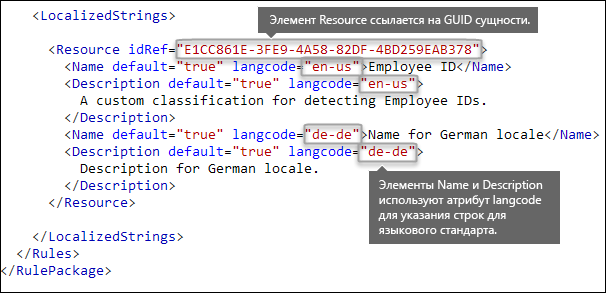
  
Обратите внимание, что локализованные строки определяют только способ отображения пользовательского типа конфиденциальных данных в пользовательском интерфейсе Центра безопасности и соответствия требованиям. Вам не удастся использовать локализованные строки для предоставления различных локализованных версий списка ключевых слов или регулярного выражения.
  
## <a name="other-rule-package-markup-rulepack-guid"></a>Еще одна разметка пакета правил [GUID RulePack]

В начале каждого элемента RulePackage содержатся общие сведения, которые вам необходимо внести. Вы можете использовать показанную ниже разметку в качестве шаблона и заменить заполнители ". . ." собственной информацией.
  
Самое важное — создать GUID для элемента RulePackage. Ранее вы создали GUID для объекта; это второй GUID для элемента RulePackage. Создавать идентификаторы GUID можно несколькими способами, но проще всего это сделать в PowerShell, введя [guid]::NewGuid().
  
Элемент Version также важен. Когда вы в первый раз отправляете свой пакет правил, Office 365 запоминает номер версии. Если затем вы измените пакет правил и отправите его новую версию, не забудьте изменить номер версии. В противном случае Office 365 не сможет развернуть пакет правил.
  
```
<?xml version="1.0" encoding="utf-16"?>
<RulePackage xmlns="http://schemas.microsoft.com/office/2011/mce">
  <RulePack id=". . .">
    <Version major="1" minor="0" build="0" revision="0" />
    <Publisher id=". . ." /> 
    <Details defaultLangCode=". . .">
      <LocalizedDetails langcode=" . . . ">
         <PublisherName>. . .</PublisherName>
         <Name>. . .</Name>
         <Description>. . .</Description>
      </LocalizedDetails>
    </Details>
  </RulePack>
  
 <Rules>
    . . .
 </Rules>
</RulePackage>

```

По завершении этих действий элемент RulePack должен выглядеть, как показано ниже.
  
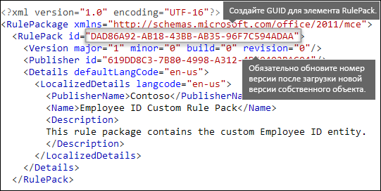
  
## <a name="changes-for-exchange-online"></a>Изменения для Exchange Online

Ранее вы, возможно, использовали PowerShell в Exchange Online для импорта своих пользовательских типов конфиденциальных данных для системы защиты от потери данных. Теперь ваши пользовательские типы конфиденциальных данных можно использовать и в Центре администрирования Exchange, и в Центре безопасности и соответствия требованиям. В рамках этого усовершенствования вам следует использовать Центр безопасности и соответствия требованиям для импорта своих пользовательских типов конфиденциальных данных: вам больше не удастся импортировать их из PowerShell в Exchange. Ваши пользовательские типы конфиденциальных данных будут работать, как и раньше. Тем не менее может потребоваться до одного часа на то чтобы пользовательские типы конфиденциальных данных в Центре безопасности и соответствия требованиям появились в Центре администрирования Exchange.
  
Обратите внимание, что для отправки пакета правил в Центре безопасности и соответствия требованиям необходимо использовать командлет `DlpSensitiveInformationTypeRulePackage`. Ранее в Центре администрирования Exchange вы использовали командлет `ClassificationRuleCollection`. 
  
## <a name="upload-your-rule-package"></a>Отправка пакета правил

Чтобы отправить пакет правил, выполните указанные ниже действия.
  
1. Сохраните правило в виде XML-файла с кодировкой Юникод.
    
2. [Подключитесь к PowerShell Центра безопасности и соответствия требованиям Office 365.](http://go.microsoft.com/fwlink/p/?LinkID=799771)
    
3. Используйте указанный ниже синтаксис.

    ```
    New-DlpSensitiveInformationTypeRulePackage -FileData (Get-Content -Path "PathToUnicodeXMLFile" -Encoding Byte)
    ```

    В этом примере выполняется отправка XML-файла с кодировкой Юникод под названием MyNewRulePack.xml из папки C:\My Documents.

    ```
    New-DlpSensitiveInformationTypeRulePackage -FileData (Get-Content -Path "C:\My Documents\MyNewRulePack.xml" -Encoding Byte)
    ```

    Дополнительные сведения о синтаксисе и параметрах см. в статье [New-DlpSensitiveInformationTypeRulePackage](https://docs.microsoft.com/powershell/module/exchange/policy-and-compliance-dlp/new-dlpsensitiveinformationtyperulepackage).

5. Чтобы убедиться в успешном создании нового типа конфиденциальных данных, выполните любое из указанных ниже действий.

  - Выполните следующую команду и проверьте наличие нового пакета правил:

    ```
    Get-DlpSensitiveInformationTypeRulePackage
    ``` 

  - Выполните следующую команду и проверьте наличие типа конфиденциальных данных:

    ```
    Get-DlpSensitiveInformationType
    ``` 

    Для пользовательских типов конфиденциальных данных значение свойства Publisher будет отличаться от "Корпорация Майкрософт".

  - Замените \<Name\> значением Name типа конфиденциальных данных (например, Employee ID) и выполните следующую команду:

    ```
    Get-DlpSensitiveInformationType -Identity "<Name>"
    ```
    
## <a name="potential-validation-issues-to-be-aware-of"></a>Проблемы, которые могут возникнуть при проверке

Когда вы отправляете XML-файл пакета правил, система проверяет XML и ищет известные неправильные фрагменты и очевидные проблемы производительности. Ниже перечислен ряд известных проблем, возникающих при проверке и связанных с регулярными выражениями.
  
- Выражение не должно начинаться или заканчиваться альтернатором |, который имеет универсальное соответствие, так как он считается пустым совпадением.
    
    Например, выражения "|a" или "b|" не пройдут проверку.
    
- Выражение не должно начинаться или заканчиваться шаблоном ".{0,m}", у которого нет функциональной цели и который только снижает производительность.
    
    Например, выражение ".{0,50}ASDF" или "ASDF.{0,50}" не пройдет проверку.
    
- Выражение не должно содержать фрагменты ".{0,m}" или ".{1,m}" в группах, и в нем не должно быть фрагментов ".\*" или ".+" в группах.
    
    Например, выражение "(.{0,50000})" не пройдет проверку.
    
- Выражение не должно содержать знаки с повторителями "{0,m}" или "{1,m}" в группах.
    
    Например, выражение "(a\*)" не пройдет проверку.
    
- Выражение не должно начинаться с фрагмента ".{1,m}". Вместо него используйте выражение ".".
    
    Например, выражение ".{1,m}asdf" не пройдет проверку. Вместо него используйте выражение ".asdf".
    
- В выражении не должно быть неограниченного повторителя (например, "\*" или "+") в группе.
    
    Например, выражения "(xx)\*" и "(xx)+" не пройдут проверку.
    
Если в пользовательском типе конфиденциальных данных имеется проблема, которая может снизить производительность, этот тип не будет отправлен, и, возможно, будет отображено одно из указанных ниже сообщений об ошибке.
  
- **Универсальные квантификаторы, соответствующие большему количеству контента, чем ожидалось (например, +, \*)**
    
- **Окрестные утверждения**
    
- **Сочетание сложной группировки с общими квантификаторами**
    
## <a name="recrawl-your-content-to-identify-the-sensitive-information"></a>Повторный обход контента для обнаружения конфиденциальных данных

Система защиты от потери данных использует программу-обходчик поиска для обнаружения и классификации конфиденциальных данных в контенте сайта. Повторный обход контента на сайтах SharePoint Online и OneDrive для бизнеса выполняется автоматически при обновлении контента. Чтобы можно было обнаруживать конфиденциальные данные вашего нового пользовательского типа во всем существующем контенте, необходимо выполнить повторный обход этого контента.
  
В Office 365 вам не удастся вручную запросить повторный обход всего клиента, но вы можете сделать это для семейства веб-сайтов, списка или библиотеки. См. статью [Ручной запрос обхода контента и переиндексации сайта, библиотеки или списка](https://support.office.com/article/9afa977d-39de-4321-b4ca-8c7c7e6d264e).
  
## <a name="remove-a-custom-sensitive-information-type"></a>Удаление пользовательского типа конфиденциальных данных

**Примечание**. Перед удалением пользовательского типа конфиденциальных данных, проверьте, что политики защиты от потери данных и правила потока обработки почты Exchange (также называемые правилами транспорта) не ссылаются на тип конфиденциальных данных.

В PowerShell Центра безопасности и соответствия требованиям пользовательские типы конфиденциальных данных можно удалить двумя способами.

- **Удаление отдельных пользовательских типов конфиденциальных данных.** Используйте способ, описанный в разделе [Изменение пользовательского типа конфиденциальных данных](#modify-a-custom-sensitive-information-type). При этом экспортируется пакет настраиваемых правил, содержащий пользовательский тип конфиденциальных данных, удаляется тип конфиденциальных данных из XML-файла и импортируется обновленный XML-файл обратно в существующий пакет настраиваемых правил.

- **Удаление пакета настраиваемых правил и всех пользовательских типов конфиденциальных данных, содержащихся в нем**. Этот метод описан в текущем разделе.

1. [Подключитесь к PowerShell Центра безопасности и соответствия требованиям Office 365.](http://go.microsoft.com/fwlink/p/?LinkID=799771)

2. Чтобы удалить пакет настраиваемых правил, используйте указанный ниже синтаксис.

    ```
    Remove-DlpSensitiveInformationTypeRulePackage -Identity "RulePackageIdentity"
    ```

    Для определения пакета правил можно использовать значение Name (для любого языка) или значение `RulePack id` (GUID).

    В этом примере удаляется пакет правил под названием "Employee ID Custom Rule Pack".

    ```
       Remove-DlpSensitiveInformationTypeRulePackage -Identity "Employee ID Custom Rule Pack"
    ```

    Дополнительные сведения о синтаксисе и параметрах см. в статье [Remove-DlpSensitiveInformationTypeRulePackage](https://docs.microsoft.com/powershell/module/exchange/policy-and-compliance-dlp/remove-dlpsensitiveinformationtyperulepackage).

3. Чтобы убедиться в успешном удалении пользовательского типа конфиденциальных данных, выполните одно из указанных ниже действий.

  - Выполните следующую команду и убедитесь в отсутствии пакета правил:

    ```
    Get-DlpSensitiveInformationTypeRulePackage
    ``` 

  - Выполните следующую команду и убедитесь в отсутствии типов конфиденциальных данных в удаленном пакете правил:

    ```
    Get-DlpSensitiveInformationType
    ``` 

    Для пользовательских типов конфиденциальных данных значение свойства Publisher будет отличаться от "Корпорация Майкрософт".

  - Замените \<Name\> значением Name типа конфиденциальных данных (например, Employee ID) и выполните следующую команду, чтобы убедиться в отсутствии типа конфиденциальных данных:

    ```
    Get-DlpSensitiveInformationType -Identity "<Name>"
    ```

## <a name="modify-a-custom-sensitive-information-type"></a>Изменение пользовательского типа конфиденциальных данных

Чтобы изменить пользовательский тип конфиденциальных данных в PowerShell Центра безопасности и соответствия требованиям, необходимо выполнить следующие действия.

1. Экспортируйте существующий пакет правил, содержащий пользовательский тип конфиденциальных данных в XML-файл (или используйте существующий XML-файл при наличии). 

2. Измените пользовательский тип конфиденциальных данных в экспортированном XML-файле.

3. Импортируйте обновленный XML-файл обратно в существующий пакет правил.

Чтобы подключиться к PowerShell Центра безопасности соответствия требованиям, см. статью [Подключение к PowerShell Центра безопасности и соответствия требованиям Office 365](http://go.microsoft.com/fwlink/p/?LinkID=799771).

#### <a name="step-1-export-the-existing-rule-package-to-an-xml-file"></a>Этап 1. Экспорт существующего пакета правил в XML-файл

**Примечание**. Если у вас есть копия XML-файла (например, вы только что создали и импортировали его), вы можете перейти к следующему этапу по изменению XML-файла.

1. Если вы еще не знаете имени пакета настраиваемых правил, выполните следующую команду, чтобы найти его:

    ```
    Get-DlpSensitiveInformationTypeRulePackage
    ```

    **Примечание**. Пакет встроенных правил, содержащий встроенные типы конфиденциальных данных, называется пакетом правил Майкрософт. Пакет правил, содержащий пользовательские типы конфиденциальных данных, которые созданы в интерфейсе Центра безопасности и соответствия требованиям называется Microsoft.SCCManaged.CustomRulePack.

2. Чтобы сохранить пакет настраиваемых правил в переменной, используйте указанный ниже синтаксис.

    ```
    $rulepak = Get-DlpSensitiveInformationTypeRulePackage -Identity "RulePackageName"
    ```

   Например, если пакет правил называется "Employee ID Custom Rule Pack", выполните следующую команду:

    ```
    $rulepak = Get-DlpSensitiveInformationTypeRulePackage -Identity "Employee ID Custom Rule Pack"
    ```

3. Чтобы экспортировать пакет настраиваемых правил в XML-файл, используйте указанный ниже синтаксис.

    ```
    Set-Content -Path "XMLFileAndPath" -Encoding Byte -Value $rulepak.SerializedClassificationRuleCollection
    ```

    В этом примере пакет правил экспортируется в файл с именем ExportedRulePackage.xml в папку C:\My Documents.

    ```
    Set-Content -Path "C:\My Documents\ExportedRulePackage.xml" -Encoding Byte -Value $rulepak.SerializedClassificationRuleCollection
    ```

#### <a name="step-2-modify-the-sensitive-information-type-in-the-exported-xml-file"></a>Этап 2. Изменение типа конфиденциальных данных в экспортированном XML-файле

Типы конфиденциальных данных в XML-файле и другие элементы в файле описаны выше в этой статье.

#### <a name="step-3-import-the-updated-xml-file-back-into-the-existing-rule-package"></a>Этап 3. Импорт обновленного XML-файла обратно в существующий пакет правил

Чтобы импортировать обновленный XML-файл обратно в существующий пакет правил, используйте указанный ниже синтаксис.

```
Set-DlpSensitiveInformationTypeRulePackage -Identity "RulePackageIdentity" -FileData (Get-Content -Path "PathToUnicodeXMLFile" -Encoding Byte)
```

Для определения пакета правил можно использовать значение Name или значение `RulePack id` (GUID).

В этом примере выполняется отправка обновленного XML-файла с кодировкой Юникод под названием MyUpdatedRulePack.xml из папки C:\My Documents в существующий пакет правил с именем "Employee ID Custom Rule Pack".

```
Set-DlpSensitiveInformationTypeRulePackage -Identity "Employee ID Custom Rule Pack" -FileData (Get-Content -Path "C:\My Documents\MyUpdatedRulePack.xml" -Encoding Byte)
```

Дополнительные сведения о синтаксисе и параметрах см. в статье [Set-DlpSensitiveInformationTypeRulePackage](https://docs.microsoft.com/powershell/module/exchange/policy-and-compliance-dlp/set-dlpsensitiveinformationtyperulepackage).

## <a name="reference-rule-package-xml-schema-definition"></a>Справка: определение схемы XML пакета правил

Вы можете скопировать эту разметку, сохранить ее в виде XSD-файла и использовать для проверки XML-файла пакета правил.
  
```
<?xml version="1.0" encoding="utf-8"?>
<xs:schema xmlns:mce="http://schemas.microsoft.com/office/2011/mce"
           targetNamespace="http://schemas.microsoft.com/office/2011/mce" 
           xmlns:xs="http://www.w3.org/2001/XMLSchema"
           elementFormDefault="qualified"
           attributeFormDefault="unqualified"
           id="RulePackageSchema">
  <!-- Use include if this schema has the same target namespace as the schema being referenced, otherwise use import -->
  <xs:element name="RulePackage" type="mce:RulePackageType"/>
  <xs:simpleType name="LangType">
    <xs:union memberTypes="xs:language">
      <xs:simpleType>
        <xs:restriction base="xs:string">
          <xs:enumeration value=""/>
        </xs:restriction>
      </xs:simpleType>
    </xs:union>
  </xs:simpleType>
  <xs:simpleType name="GuidType" final="#all">
    <xs:restriction base="xs:token">
      <xs:pattern value="[0-9a-fA-F]{8}\-([0-9a-fA-F]{4}\-){3}[0-9a-fA-F]{12}"/>
    </xs:restriction>
  </xs:simpleType>
  <xs:complexType name="RulePackageType">
    <xs:sequence>
      <xs:element name="RulePack" type="mce:RulePackType"/>
      <xs:element name="Rules" type="mce:RulesType">
        <xs:key name="UniqueRuleId">
          <xs:selector xpath="mce:Entity|mce:Affinity|mce:Version/mce:Entity|mce:Version/mce:Affinity"/>
          <xs:field xpath="@id"/>
        </xs:key>
        <xs:key name="UniqueProcessorId">
          <xs:selector xpath="mce:Regex|mce:Keyword|mce:Fingerprint"></xs:selector>
          <xs:field xpath="@id"/>
        </xs:key>
        <xs:key name="UniqueResourceIdRef">
          <xs:selector xpath="mce:LocalizedStrings/mce:Resource"/>
          <xs:field xpath="@idRef"/>
        </xs:key>        
        <xs:keyref name="ReferencedRuleMustExist" refer="mce:UniqueRuleId">
          <xs:selector xpath="mce:LocalizedStrings/mce:Resource"/>
          <xs:field xpath="@idRef"/>
        </xs:keyref>
        <xs:keyref name="RuleMustHaveResource" refer="mce:UniqueResourceIdRef">
          <xs:selector xpath="mce:Entity|mce:Affinity|mce:Version/mce:Entity|mce:Version/mce:Affinity"/>
          <xs:field xpath="@id"/>
        </xs:keyref>
      </xs:element>
    </xs:sequence>
  </xs:complexType>
  <xs:complexType name="RulePackType">
    <xs:sequence>
      <xs:element name="Version" type="mce:VersionType"/>
      <xs:element name="Publisher" type="mce:PublisherType"/>
      <xs:element name="Details" type="mce:DetailsType">
        <xs:key name="UniqueLangCodeInLocalizedDetails">
          <xs:selector xpath="mce:LocalizedDetails"/>
          <xs:field xpath="@langcode"/>
        </xs:key>
        <xs:keyref name="DefaultLangCodeMustExist" refer="mce:UniqueLangCodeInLocalizedDetails">
          <xs:selector xpath="."/>
          <xs:field xpath="@defaultLangCode"/>
        </xs:keyref>
      </xs:element>
      <xs:element name="Encryption" type="mce:EncryptionType" minOccurs="0" maxOccurs="1"/>
    </xs:sequence>
    <xs:attribute name="id" type="mce:GuidType" use="required"/>
  </xs:complexType>
  <xs:complexType name="VersionType">
    <xs:attribute name="major" type="xs:unsignedShort" use="required"/>
    <xs:attribute name="minor" type="xs:unsignedShort" use="required"/>
    <xs:attribute name="build" type="xs:unsignedShort" use="required"/>
    <xs:attribute name="revision" type="xs:unsignedShort" use="required"/>
  </xs:complexType>
  <xs:complexType name="PublisherType">
    <xs:attribute name="id" type="mce:GuidType" use="required"/>
  </xs:complexType>
  <xs:complexType name="LocalizedDetailsType">
    <xs:sequence>
      <xs:element name="PublisherName" type="mce:NameType"/>
      <xs:element name="Name" type="mce:RulePackNameType"/>
      <xs:element name="Description" type="mce:OptionalNameType"/>
    </xs:sequence>
    <xs:attribute name="langcode" type="mce:LangType" use="required"/>
  </xs:complexType>
  <xs:complexType name="DetailsType">
    <xs:sequence>
      <xs:element name="LocalizedDetails" type="mce:LocalizedDetailsType" maxOccurs="unbounded"/>
    </xs:sequence>
    <xs:attribute name="defaultLangCode" type="mce:LangType" use="required"/>
  </xs:complexType>
  <xs:complexType name="EncryptionType">
    <xs:sequence>
      <xs:element name="Key" type="xs:normalizedString"/>
      <xs:element name="IV" type="xs:normalizedString"/>
    </xs:sequence>
  </xs:complexType>
  <xs:simpleType name="RulePackNameType">
    <xs:restriction base="xs:token">
      <xs:minLength value="1"/>
      <xs:maxLength value="64"/>
    </xs:restriction>
  </xs:simpleType>
  <xs:simpleType name="NameType">
    <xs:restriction base="xs:normalizedString">
      <xs:minLength value="1"/>
      <xs:maxLength value="256"/>
    </xs:restriction>
  </xs:simpleType>
  <xs:simpleType name="OptionalNameType">
    <xs:restriction base="xs:normalizedString">
      <xs:minLength value="0"/>
      <xs:maxLength value="256"/>
    </xs:restriction>
  </xs:simpleType>
  <xs:simpleType name="RestrictedTermType">
    <xs:restriction base="xs:string">
      <xs:minLength value="1"/>
      <xs:maxLength value="100"/>
    </xs:restriction>
  </xs:simpleType>
  <xs:complexType name="RulesType">
    <xs:sequence>
      <xs:choice maxOccurs="unbounded">
        <xs:element name="Entity" type="mce:EntityType"/>
        <xs:element name="Affinity" type="mce:AffinityType"/>
        <xs:element name="Version" type="mce:VersionedRuleType"/>
      </xs:choice>
      <xs:choice minOccurs="0" maxOccurs="unbounded">
        <xs:element name="Regex" type="mce:RegexType"/>
        <xs:element name="Keyword" type="mce:KeywordType"/>
        <xs:element name="Fingerprint" type="mce:FingerprintType"/>
        <xs:element name="ExtendedKeyword" type="mce:ExtendedKeywordType"/>
      </xs:choice>
      <xs:element name="LocalizedStrings" type="mce:LocalizedStringsType"/>
    </xs:sequence>
  </xs:complexType>
  <xs:complexType name="EntityType">
    <xs:sequence>
      <xs:element name="Pattern" type="mce:PatternType" maxOccurs="unbounded"/>
      <xs:element name="Version" type="mce:VersionedPatternType" minOccurs="0" maxOccurs="unbounded" />
    </xs:sequence>
    <xs:attribute name="id" type="mce:GuidType" use="required"/>
    <xs:attribute name="patternsProximity" type="mce:ProximityType" use="required"/>
    <xs:attribute name="recommendedConfidence" type="mce:ProbabilityType"/>
    <xs:attribute name="workload" type="mce:WorkloadType"/>
  </xs:complexType>
  <xs:complexType name="PatternType">
    <xs:sequence>
      <xs:element name="IdMatch" type="mce:IdMatchType"/>
      <xs:choice minOccurs="0" maxOccurs="unbounded">
        <xs:element name="Match" type="mce:MatchType"/>
        <xs:element name="Any" type="mce:AnyType"/>
      </xs:choice>
    </xs:sequence>
    <xs:attribute name="confidenceLevel" type="mce:ProbabilityType" use="required"/>
  </xs:complexType>
  <xs:complexType name="AffinityType">
    <xs:sequence>
      <xs:element name="Evidence" type="mce:EvidenceType" maxOccurs="unbounded"/>
      <xs:element name="Version" type="mce:VersionedEvidenceType" minOccurs="0" maxOccurs="unbounded" />
    </xs:sequence>
    <xs:attribute name="id" type="mce:GuidType" use="required"/>
    <xs:attribute name="evidencesProximity" type="mce:ProximityType" use="required"/>
    <xs:attribute name="thresholdConfidenceLevel" type="mce:ProbabilityType" use="required"/>
    <xs:attribute name="workload" type="mce:WorkloadType"/>
  </xs:complexType>
  <xs:complexType name="EvidenceType">
    <xs:sequence>
      <xs:choice maxOccurs="unbounded">
        <xs:element name="Match" type="mce:MatchType"/>
        <xs:element name="Any" type="mce:AnyType"/>
      </xs:choice>
    </xs:sequence>
    <xs:attribute name="confidenceLevel" type="mce:ProbabilityType" use="required"/>
  </xs:complexType>
  <xs:complexType name="IdMatchType">
    <xs:attribute name="idRef" type="xs:string" use="required"/>
  </xs:complexType>
  <xs:complexType name="MatchType">
    <xs:attribute name="idRef" type="xs:string" use="required"/>
    <xs:attribute name="minCount" type="xs:positiveInteger" use="optional"/>
    <xs:attribute name="uniqueResults" type="xs:boolean" use="optional"/>
  </xs:complexType>
  <xs:complexType name="AnyType">
    <xs:sequence>
      <xs:choice maxOccurs="unbounded">
        <xs:element name="Match" type="mce:MatchType"/>
        <xs:element name="Any" type="mce:AnyType"/>
      </xs:choice>
    </xs:sequence>
    <xs:attribute name="minMatches" type="xs:nonNegativeInteger" default="1"/>
    <xs:attribute name="maxMatches" type="xs:nonNegativeInteger" use="optional"/>
  </xs:complexType>
  <xs:simpleType name="ProximityType">
    <xs:union>
      <xs:simpleType>
        <xs:restriction base='xs:string'>
          <xs:enumeration value="unlimited"/>
        </xs:restriction>
      </xs:simpleType>
      <xs:simpleType>
        <xs:restriction base="xs:positiveInteger">
          <xs:minInclusive value="1"/>
        </xs:restriction>
      </xs:simpleType>
    </xs:union>
  </xs:simpleType>
  <xs:simpleType name="ProbabilityType">
    <xs:restriction base="xs:integer">
      <xs:minInclusive value="1"/>
      <xs:maxInclusive value="100"/>
    </xs:restriction>
  </xs:simpleType>
  <xs:simpleType name="WorkloadType">
    <xs:restriction base="xs:string">
      <xs:enumeration value="Exchange"/>
      <xs:enumeration value="Outlook"/>
    </xs:restriction>
  </xs:simpleType>
  <xs:simpleType name="EngineVersionType">
    <xs:restriction base="xs:token">
      <xs:pattern value="^\d{2}\.01?\.\d{3,4}\.\d{1,3}$"/>
    </xs:restriction>
  </xs:simpleType>
  <xs:complexType name="VersionedRuleType">
    <xs:choice maxOccurs="unbounded">
      <xs:element name="Entity" type="mce:EntityType"/>
      <xs:element name="Affinity" type="mce:AffinityType"/>
    </xs:choice>
    <xs:attribute name="minEngineVersion" type="mce:EngineVersionType" use="required" />
  </xs:complexType>
  <xs:complexType name="VersionedPatternType">
    <xs:sequence>
      <xs:element name="Pattern" type="mce:PatternType" maxOccurs="unbounded"/>
    </xs:sequence>
    <xs:attribute name="minEngineVersion" type="mce:EngineVersionType" use="required" />
  </xs:complexType>
  <xs:complexType name="VersionedEvidenceType">
    <xs:sequence>
      <xs:element name="Evidence" type="mce:EvidenceType" maxOccurs="unbounded"/>
    </xs:sequence>
    <xs:attribute name="minEngineVersion" type="mce:EngineVersionType" use="required" />
  </xs:complexType>
  <xs:simpleType name="FingerprintValueType">
    <xs:restriction base="xs:string">
      <xs:minLength value="2732"/>
      <xs:maxLength value="2732"/>
    </xs:restriction>
  </xs:simpleType>
  <xs:complexType name="FingerprintType">
    <xs:simpleContent>
      <xs:extension base="mce:FingerprintValueType">
        <xs:attribute name="id" type="xs:token" use="required"/>
        <xs:attribute name="threshold" type="mce:ProbabilityType" use="required"/>
        <xs:attribute name="shingleCount" type="xs:positiveInteger" use="required"/>
        <xs:attribute name="description" type="xs:string" use="optional"/>
      </xs:extension>
    </xs:simpleContent>
  </xs:complexType>
  <xs:complexType name="RegexType">
    <xs:simpleContent>
      <xs:extension base="xs:string">
        <xs:attribute name="id" type="xs:token" use="required"/>
      </xs:extension>
    </xs:simpleContent>
  </xs:complexType>
  <xs:complexType name="KeywordType">
    <xs:sequence>
      <xs:element name="Group" type="mce:GroupType" maxOccurs="unbounded"/>
    </xs:sequence>
    <xs:attribute name="id" type="xs:token" use="required"/>
  </xs:complexType>
  <xs:complexType name="GroupType">
    <xs:sequence>
      <xs:choice>
        <xs:element name="Term" type="mce:TermType" maxOccurs="unbounded"/>
      </xs:choice>
    </xs:sequence>
    <xs:attribute name="matchStyle" default="word">
      <xs:simpleType>
        <xs:restriction base="xs:NMTOKEN">
          <xs:enumeration value="word"/>
          <xs:enumeration value="string"/>
        </xs:restriction>
      </xs:simpleType>
    </xs:attribute>
  </xs:complexType>
  <xs:complexType name="TermType">
    <xs:simpleContent>
      <xs:extension base="mce:RestrictedTermType">
        <xs:attribute name="caseSensitive" type="xs:boolean" default="false"/>
      </xs:extension>
    </xs:simpleContent>
  </xs:complexType>
  <xs:complexType name="ExtendedKeywordType">
    <xs:simpleContent>
      <xs:extension base="xs:string">
        <xs:attribute name="id" type="xs:token" use="required"/>
      </xs:extension>
    </xs:simpleContent>
  </xs:complexType>
  <xs:complexType name="LocalizedStringsType">
    <xs:sequence>
      <xs:element name="Resource" type="mce:ResourceType" maxOccurs="unbounded">
      <xs:key name="UniqueLangCodeUsedInNamePerResource">
        <xs:selector xpath="mce:Name"/>
        <xs:field xpath="@langcode"/>
      </xs:key>
      <xs:key name="UniqueLangCodeUsedInDescriptionPerResource">
        <xs:selector xpath="mce:Description"/>
        <xs:field xpath="@langcode"/>
      </xs:key>
    </xs:element>
    </xs:sequence>
  </xs:complexType>
  <xs:complexType name="ResourceType">
    <xs:sequence>
      <xs:element name="Name" type="mce:ResourceNameType" maxOccurs="unbounded"/>
      <xs:element name="Description" type="mce:DescriptionType" minOccurs="0" maxOccurs="unbounded"/>
    </xs:sequence>
    <xs:attribute name="idRef" type="mce:GuidType" use="required"/>
  </xs:complexType>
  <xs:complexType name="ResourceNameType">
    <xs:simpleContent>
      <xs:extension base="xs:string">
        <xs:attribute name="default" type="xs:boolean" default="false"/>
        <xs:attribute name="langcode" type="mce:LangType" use="required"/>
      </xs:extension>
    </xs:simpleContent>
  </xs:complexType>
  <xs:complexType name="DescriptionType">
    <xs:simpleContent>
      <xs:extension base="xs:string">
        <xs:attribute name="default" type="xs:boolean" default="false"/>
        <xs:attribute name="langcode" type="mce:LangType" use="required"/>
      </xs:extension>
    </xs:simpleContent>
  </xs:complexType>
</xs:schema>

```

## <a name="more-information"></a>Дополнительные сведения

- [Обзор политик защиты от потери данных](data-loss-prevention-policies.md)
    
- [Что позволяют искать типы конфиденциальной информации](what-the-sensitive-information-types-look-for.md)
    
- [Сведения, для обнаружения которых используются функции защиты от потери данных](what-the-dlp-functions-look-for.md)
    

