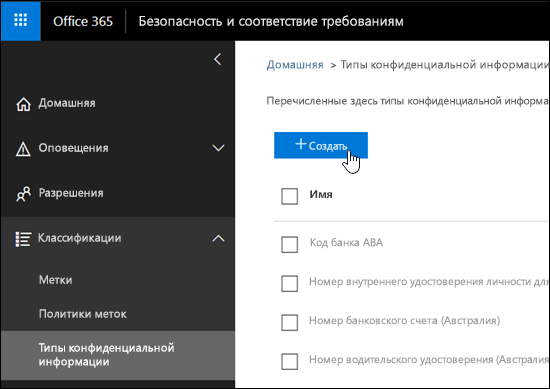
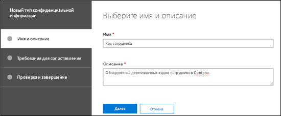
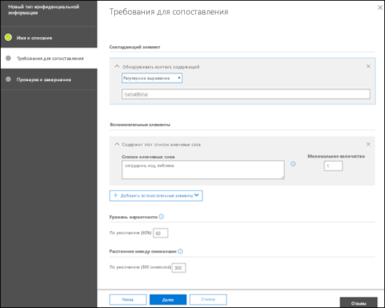
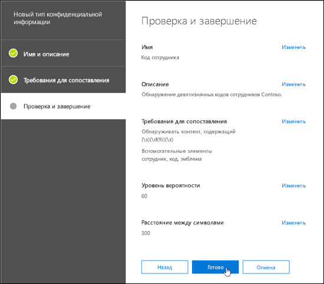
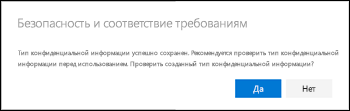
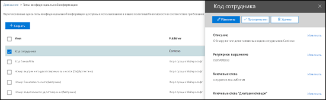
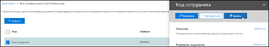
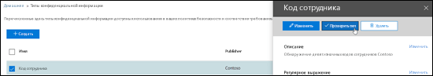
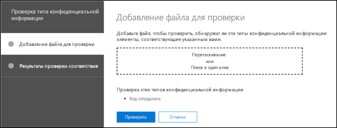

# Создание пользовательского типа конфиденциальной информации

DLP в Office 365 включает много встроенных [типов конфиденциальной информации](what-the-sensitive-information-types-look-for.md), которые вы можете использовать в своих политиках защиты от потери данных. С помощью этих типов можно обнаруживать и защищать номера кредитных карт, банковских счетов, паспортов и многие другие сведения. 

Если вам нужно обнаруживать и защищать конфиденциальную информацию другого типа (например, идентификаторы сотрудников или номера проектов, для которых в вашей организации используется особой формат), вы можете создать пользовательский тип конфиденциальной информации.

Основные компоненты пользовательского типа конфиденциальной информации:

- **Основной шаблон**: коды сотрудников, номера проектов и т. д. Как правило, он определяется регулярным выражением (RegEx), но также может представлять собой список ключевых слов.

- **Дополнительные признаки.** Допустим, вы рассматриваете девятизначный код сотрудника. Не все девятизначные числа являются идентификаторами сотрудников, поэтому вы можете искать дополнительный текст: ключевые слова (например, "сотрудник", "бейдж", "ИД") или другие текстовые шаблоны, основанные на дополнительных регулярных выражениях. Дополнительные признаки (также называемые _вспомогательными_ или _подтверждающими_ признаками) повышают вероятность того, что девятизначный номер в содержимом действительно является кодом сотрудника.

- **Расстояние между символами.** Будет логично предположить, что чем ближе основной шаблон и вспомогательные признаки друг к другу, тем вероятнее, что обнаруженный контент будет именно тем, что вам нужно. Вы можете задать расстояние в символах между основным шаблоном и вспомогательными признаками (также называемое _интервалом вероятности_), как показано на следующей схеме:

    

- **Уровень вероятности.** Чем больше вспомогательных признаков, тем выше вероятность того, что обнаруженное совпадение относится к конфиденциальным данным. Вы можете назначать более высокие уровни вероятности для совпадений, обнаруженных по большему количеству признаков.

  При выполнении условия шаблон возвращает значения количества и уровня вероятности, которые вы можете использовать в условиях политик защиты от потери данных. Добавляя условие для обнаружения типа конфиденциальной информации в политику защиты от потери данных, вы можете изменить значения количества и уровня вероятности, как показано на следующей схеме:

    

Создать пользовательский тип конфиденциальной информации для защиты от потери данных в Центре безопасности и соответствия требованиям можно следующими способами:

- **Через пользовательский интерфейс.** Этот способ проще и быстрее, но обеспечивает меньше возможностей настройки, чем PowerShell. Эти процедуры описаны далее в статье.

- **С помощью PowerShell.** Для этого необходимо сначала создать XML-файл (называемый _пакетом правил_), который содержит один или несколько типов конфиденциальной информации, а затем использовать PowerShell для импорта пакета правил (эта задача тривиальна по сравнению с его созданием). Этот способ намного сложнее, чем применение пользовательского интерфейса, но предоставляет более широкие возможности настройки. Инструкции см. в статье [Создание пользовательского типа конфиденциальной информации в PowerShell Центра безопасности и соответствия требованиям](create-a-custom-sensitive-information-type-in-scc-powershell.md).

Основные различия между ними описаны в приведенной ниже таблице.

|**Создание пользовательских типов конфиденциальной информации в пользовательском интерфейсе**|**Создание пользовательских типов конфиденциальной информации в PowerShell**|
|:-----|:-----|
|Для названия и описания используется один язык.|Поддерживает несколько языков для имени и описания.|
|Поддерживает один шаблон.|Поддерживает несколько шаблонов.|
|Вспомогательными признаками могут быть:  • регулярные выражения;  • ключевые слова;  • словари ключевых слов.|Вспомогательными признаками могут быть:  • регулярные выражения;  • ключевые слова;  • словари ключевых слов;  • [встроенные функции защиты от потери данных.](what-the-dlp-functions-look-for.md)|
|Пользовательские типы конфиденциальной информации добавляются в пакет правил Microsoft.SCCManaged.CustomRulePack.|Вы можете создать до 10 пакетов правил, которые содержат пользовательские типы конфиденциальной информации.|
|Для соответствия шаблону необходимо обнаружить основной шаблон и все вспомогательные признаки (используется неявный оператор И).|Для соответствия шаблону необходимо обнаружить основной шаблон и настраиваемое количество вспомогательных признаков (используются неявные операторы И и ИЛИ).|

## Что нужно знать перед началом работы?

- Сведения о том, как открыть Центр безопасности и соответствия требованиям, см. в статье [Центр безопасности и соответствия требованиям](go-to-the-securitycompliance-center.md).

- Для работы с пользовательскими типами конфиденциальной информации вы должны быть знакомы с регулярными выражениями (RegEx). Дополнительные сведения о модуле Boost.RegEx (прежнее название — RegEx++), используемом для обработки текста, см. в статье [Boost.Regex 5.1.3](https://www.boost.org/doc/libs/1_68_0/libs/regex/doc/html/).

  Центр обслуживания клиентов Майкрософт не может предоставлять вам пользовательские определения для сопоставления контента (создавать пользовательские категории или шаблоны регулярных выражений). Инженеры службы поддержки могут оказывать ограниченную поддержку по этой функции (например, предоставлять примеры шаблонов регулярных выражений для тестирования или помогать с устранением неполадок имеющегося шаблона, который не срабатывает должным образом), но не могут гарантировать, что то или иное решение для сопоставления контента будет соответствовать вашим требованиям или обязательствам.

- DLP использует программу-обходчик для поиска, чтобы обнаруживать и классифицировать конфиденциальную информацию на сайтах SharePoint Online и OneDrive для бизнеса. Чтобы определить новый пользовательский тип конфиденциальной информации в имеющемся контенте, необходимо выполнить повторный обход контента для семейства веб-сайтов, списка или библиотеки. Дополнительные сведения см. в статье [Запрашивание обхода и повторного индексирования сайта, библиотеки или списка вручную](https://docs.microsoft.com/sharepoint/crawl-site-content).

## Создание пользовательского типа конфиденциальной информации в Центре безопасности и соответствия требованиям

В Центре безопасности и соответствия требованиям выберите **Классификации** \> **Типы конфиденциальной информации** и нажмите **Создать**.

Параметры не требуют особых пояснений и описываются на соответствующей странице мастера.

- **Имя**

- **Описание**

- **Расстояние**

- **Уровень вероятности**

- **Элемент основного шаблона** (ключевые слова, регулярное выражение или словарь)

- Необязательные **элементы вспомогательного шаблона** (ключевые слова, регулярное выражение или словарь) и соответствующее значение **минимальной стоимости**.

Предположим, вам нужен пользовательский тип конфиденциальной информации, обнаруживающий в контенте 9-значные номера сотрудников, а также ключевые слова "сотрудник", "ИД" и "бейдж". Чтобы создать этот тип, выполните указанные ниже действия.

1. В Центре безопасности и соответствия требованиям выберите **Классификации** \> **Типы конфиденциальной информации** и нажмите **Создать**.

    

2. На открывшейся странице **Выберите имя и описание** введите следующие значения:

  - **Имя**: "ИД сотрудника".

  - **Описание**: "Обнаружение девятизначных кодов сотрудников Contoso".

    

    По завершении нажмите кнопку **Далее**.

3. На открывшейся странице **Требования для сопоставления** нажмите **Добавить элемент** и настройте указанные ниже параметры.

    - Чтобы настроить **Обнаруживать контент, содержащий**:
 
      Щелкните **Любое из указанных** и выберите **Регулярное выражение**.

      В поле регулярного выражения введите `(\s)(\d{9})(\s)` (девятизначное число с пробелами с обеих сторон).
  
    - Чтобы настроить **Вспомогательные элементы**, нажмите **Добавить вспомогательные элементы** и выберите **Содержит этот список ключевых слов**.

    - В открывшейся области **Содержит этот список ключевых слов** настройте указанные ниже параметры.

      - **Список ключевых слов.** Введите следующее значение: сотрудник,ИД,бейдж.

      - **Минимальное количество.** Оставьте значение по умолчанию (1).

    - Оставьте для параметра **Уровень вероятности** значение по умолчанию (60). 

    - Оставьте для параметра **Расстояние между символами** значение по умолчанию (300).

    

    По завершении нажмите кнопку **Далее**.

4. На открывшейся странице **Проверка и завершение** проверьте параметры и нажмите кнопку **Готово**.

    

5. На следующей странице вам предлагается протестировать новый тип конфиденциальной информации, нажав кнопку **Да**. Дополнительные сведения см. в статье [Тестирование пользовательских типов конфиденциальной информации в Центре безопасности и соответствия требованиям](#test-custom-sensitive-information-types-in-the-security--compliance-center). Чтобы протестировать правило позже, нажмите кнопку **Нет**.

    

### Как убедиться, что все получилось?

Чтобы убедиться, что вы успешно создали новый тип конфиденциальной информации, выполните любое из указанных ниже действий.

  - Откройте раздел **Классификации** \> **Типы конфиденциальной информации** и убедитесь, что новый тип присутствует в списке.

  - Протестируйте новый тип конфиденциальной информации. Дополнительные сведения см. в статье [Тестирование пользовательских типов конфиденциальной информации в Центре безопасности и соответствия требованиям](#test-custom-sensitive-information-types-in-the-security--compliance-center).

## Редактирование пользовательских типов конфиденциальной информации в Центре безопасности и соответствия требованиям

**Примечания**.

- Редактировать можно только пользовательские типы конфиденциальной информации. Изменить встроенный тип невозможно. Однако вы можете использовать PowerShell, чтобы экспортировать встроенные типы конфиденциальной информации, настроить их и импортировать в качестве пользовательских типов. Дополнительные сведения см. в статье [Настройка встроенных типов конфиденциальной информации](customize-a-built-in-sensitive-information-type.md).

- Редактировать можно только пользовательские типы конфиденциальной информации, созданные в интерфейсе. Если вы использовали [процедуру PowerShell](create-a-custom-sensitive-information-type-in-scc-powershell.md) для импорта пакета правил с типом пользовательской конфиденциальной информации, появится сообщение об ошибке.

В Центре безопасности и соответствия требованиям откройте раздел **Классификации** \> **Типы конфиденциальной информации**, выберите нужный пользовательский тип и нажмите кнопку **Изменить**.

  

При этом доступны те же параметры, что и при создании типа конфиденциальной информации в Центре безопасности и соответствия требованиям. Дополнительные сведения см. в статье [Создание пользовательского типа конфиденциальной информации в Центре безопасности и соответствия требованиям](#create-custom-sensitive-information-types-in-the-security--compliance-center).

### Как убедиться, что все получилось?

Чтобы убедиться, что вы успешно изменили тип конфиденциальной информации, выполните любое из указанных ниже действий.

  - Откройте раздел **Классификации** \> **Типы конфиденциальной информации** и проверьте параметры измененного типа. 

  - Протестируйте измененный тип конфиденциальной информации. Дополнительные сведения см. в статье [Тестирование пользовательских типов конфиденциальной информации в Центре безопасности и соответствия требованиям](#test-custom-sensitive-information-types-in-the-security--compliance-center).

## Удаление пользовательского типа конфиденциальной информации в Центре безопасности и соответствия требованиям 

**Примечания**:

- Удалять можно только пользовательские типы конфиденциальной информации. Удалить встроенный тип невозможно.

- Перед удалением пользовательского типа конфиденциальной информации убедитесь, что политики защиты от потери данных и правила потока обработки почты Exchange (также называемые правилами транспорта) не ссылаются на этот тип.

1. В Центре безопасности и соответствия требованиям откройте раздел **Классификации** \> **Типы конфиденциальной информации** и выберите один или несколько пользовательских типов.

2. В открывшемся всплывающем окне нажмите **Удалить** (или **Удалить типы конфиденциальной информации**, если выбрано несколько типов).

    

3. В появившемся предупреждающем сообщении нажмите **Да**.

### Как убедиться, что все получилось?

Чтобы убедиться, что вы успешно удалили пользовательский тип конфиденциальной информации, откройте раздел **Классификации** \> **Типы конфиденциальной информации** и проверьте, исчез ли этот тип из списка.

## Тестирование пользовательских типов конфиденциальной информации в Центре безопасности и соответствия требованиям

1. В Центре безопасности и соответствия требованиям выберите **Классификации** \> **Типы конфиденциальной информации**.

2. Выберите один или несколько типов конфиденциальной информации. В появившемся всплывающем окне нажмите **Тестировать тип** (или **Тестировать типы конфиденциальной информации**, если выбрано несколько типов).

    

3. На открывшейся странице **Добавление файла для тестирования** отправьте документ на проверку, перетащив файл или нажав кнопку **Обзор** и выбрав файл.

    

4. Нажмите кнопку **Тестировать**, чтобы проверить документ на совпадения с шаблоном.

5. На странице **Результаты проверки соответствия** нажмите кнопку **Готово**.

    