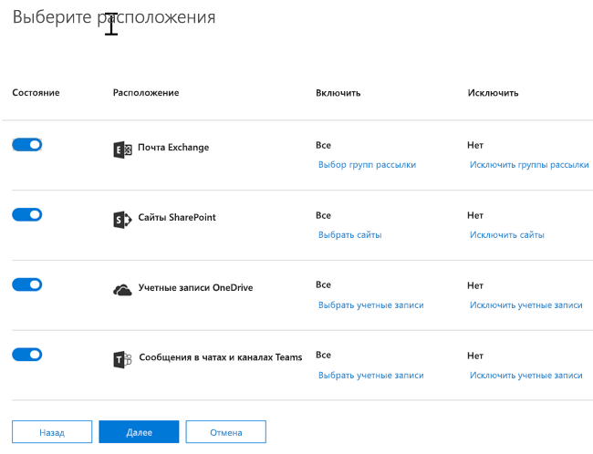
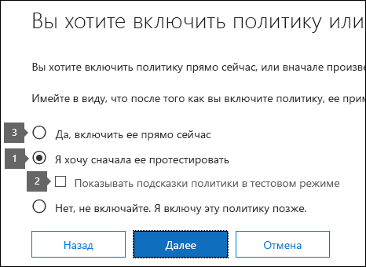

# Создание политики защиты от потери данных на основе шаблона

Самый простой и распространенный способ приступить к работе с политиками защиты от потери данных — использовать один из шаблонов, включенных в Office 365. Вы можете использовать один из этих шаблонов, как есть, или настроить правила в соответствии с требованиями Организации к конкретному соответствию.
  
Office 365 включает более 40 готовых к использованию шаблонов, которые могут помочь вам удовлетворить ряд распространенных нормативных требований и потребностей бизнес-политики. Например, имеются шаблоны политик защиты от потери данных для следующих документов:
  
- Акт Грэмма-Лича-Блайли (Акт о модернизации финансовой системы 1999 г.)
    
- Отраслевой стандарт защиты данных платежных карт (PCI-DSS)
    
- Законы США о защите персональных данных
    
- Закон США о медицинском страховании (HIPAA)
    
Вы можете настроить шаблон, изменив любое из существующих правил или добавив новое. Например, вы также можете добавить к правилу новые типы конфиденциальной информации, изменить в нем счетчики, чтобы его было сложнее или проще вызвать, позволить пользователям обходить действия в правиле, предоставив обоснование, или изменить адресатов уведомлений и отчетов об инцидентах. Шаблон политики защиты от потери данных — это отличная отправная точка для многих распространенных сценариев, связанных с соответствием требованиям.
  
Вы также можете выбрать настраиваемый шаблон, который не содержит правил по умолчанию, и настроить политику защиты от потери данных с нуля в соответствии с конкретными требованиями организации.
  
## Пример: идентификация конфиденциальной информации на всех сайтах OneDrive для бизнеса и ограничение доступа для пользователей за пределами Организации

Учетные записи OneDrive для бизнеса упрощают совместное использование и совместное использование документов пользователями в Организации. Общая проблема, связанная с должностными лицами по соответствию требованиям, заключается в том, что конфиденциальные данные, хранящиеся в учетных записях OneDrive для бизнеса, могут быть случайно предоставлены людям за Политика защиты от потери данных может помочь снизить этот риск.
  
В этом примере создается политика защиты от потери данных, которая определяет данные США, в том числе индивидуальные идентификационные номера налогоплательщика (SHAREPOINTВ), номера социального страхования и номера паспорта США. Вы приступите к работе с шаблоном, а затем измените шаблон в соответствии с требованиями вашей организации, а именно:
  
- Добавьте пару типов конфиденциальных данных — U. S. Bank Numbers (номера банковских счетов) и номера лицензий для драйвера DLP, чтобы политика DLP прибыло защитить даже больше ваших конфиденциальных данных.
    
- Сделайте политику более конфиденциальной, чтобы можно было ограничить доступ для внешних пользователей, чтобы один экземпляр конфиденциальной информации был достаточным.
    
- разрешить пользователям обходить действия, предоставив обоснование или сообщив о ложном срабатывании. Таким образом, политика защиты от потери данных не позволит сотрудникам вашей организации получить свою работу, если у них есть действительная бизнес-причина для совместного использования конфиденциальной информации.
    
### Создание политики защиты от потери данных на основе шаблона

1. Перейдите по ссылке [https://protection.office.com](https://protection.office.com).
    
2. Войдите в Office 365 с помощью своей рабочей или учебной учетной записи. Теперь вы находитесь в центре безопасности &amp; и соответствия требованиям Office 365.
    
3. В центре &amp; \> соответствия требованиям безопасности политика защиты \> от потери данных в левой панели и **Политика** \> **защиты** \> от потери данных **+ создать политику**.
    
    
  
4. Выберите шаблон политики DLP, который защищает нужные типы конфиденциальной информации \> ****.
    
    В этом примере показано, как выбрать **Конфиденциальность** \> конфиденциальной **информации США (PII)** , так как она уже включает большинство типов конфиденциальной информации, которую вы хотите защитить — позже вы добавите пару позже. 
    
    При выборе шаблона можно прочитать описание справа, чтобы узнать, какие типы конфиденциальной информации защищает шаблон.
    
    
  
5. Назовите политику \> **следующим**.
    
6. Чтобы выбрать расположения, которые должна защищать политика защиты от потери данных, выполните одно из следующих действий.
    
  - выберите **все расположения в Office 365** \> : **далее**.
    
  - Выберите пункт **Разрешить мне выбирать конкретные расположения** \> **Далее**. В этом примере выберите это.
    
    Чтобы включить или отключить все расположение, например все сообщения электронной почты Exchange или все учетные записи OneDrive, переключите **состояние** этого расположения. 
    
    Чтобы включить только определенные сайты SharePoint или учетные записи OneDrive для бизнеса, установите для параметра **состояние** значение Вкл., а затем щелкните ссылки в разделе **включить** , чтобы выбрать конкретные сайты или учетные записи. Когда вы применяете политику к сайту, настроенные в ней правила автоматически применяются ко всем дочерним сайтам. 
    
    
  
    В этом примере для защиты конфиденциальной информации, хранящейся во всех учетных записях OneDrive для бизнеса, отключите **состояние** для учетных записей **электронной почты Exchange** и **сайтов SharePoint**и оставьте **состояние** для **учетных записей OneDrive**.
    
7. Нажмите кнопку **использовать дополнительные параметры** \> **Далее**.
    
8. Шаблон политики защиты от потери данных содержит предопределенные правила с условиями и действиями, которые определяют и обрабатывают определенные типы конфиденциальной информации. Вы можете изменить, удалить или отключить существующие правила или добавить новые. По завершении нажмите кнопку **Далее**.
    
    
  
    В этом примере шаблон данных PII в США включает два предопределенных правила:
    
  - **Обнаружено небольшое количество контента США** Это правило выполняет поиск файлов, содержащих от 1 до 10 вхождений каждого из трех типов конфиденциальной информации (SHAREPOINTВ, SSN и номера паспорта США), где доступ к файлам имеют пользователи, не входящие в эту организацию. Если найдено, правило отправляет уведомление по электронной почте основному администратору семейства веб-сайтов, владельцу документа и человеку, который последним изменил документ. 
    
  - **Большой объем контента, обнаруженный в США** Это правило выполняет поиск файлов, содержащих 10 или более экземпляров одинаковых трех типов конфиденциальных данных, в которых доступ к файлам имеют пользователи, не входящие в организацию. В случае обнаружения это действие также отправляет уведомление по электронной почте, а также запрещает доступ к файлу. Для контента в учетной записи OneDrive для бизнеса это означает, что разрешения для документа ограничены для всех, кроме основного администратора семейства веб-сайтов, владельца документа и пользователя, который последним изменил документ. 
    
    Чтобы обеспечить соответствие требованиям вашей организации, можно упростить триггеры правил, чтобы заблокировать доступ для внешних пользователей, чтобы один экземпляр конфиденциальной информации был достаточно определенным. ПроВерив эти правила, вы осознаете, что не нужны правила с минимальным и высоким подсчетом, необходимо только одно правило, блокирующее доступ, если обнаружено какое-либо вхождение конфиденциальной информации.
    
    Таким образом, вы развернете правило с именем " **маленький объем содержимого** \> ", которое обнаружило **правило удаления**личных сведений США.
    
    
  
9. Теперь в этом примере необходимо добавить два типа конфиденциальной информации (номера банковских счетов США и номера лицензий для драйвера США), разрешить пользователям переопределять правило и изменять значение счетчика на любое вхождение. Это можно сделать, отредактировав одно правило, поэтому выберите **высокий объем содержимого, которое** \> было обнаружено при **изменении правила**"PII PII" в США.
    
    
  
10. Чтобы добавить тип конфиденциальной информации, в \> разделе **условия** **добавьте или измените типы**. Затем в разделе **Добавить или изменить типы** \> выберите **добавить** \> выберите **номер банковского счета США** и **** \> **** номер \> водительского удостоверения **для драйвера США** .
    
    
  
    
  
11. Чтобы изменить счетчик (количество экземпляров конфиденциальной информации, необходимых для запуска правила), в разделе **количество** \> экземпляров выберите **минимальное** значение для каждого типа \> введите 1. Минимальное число не может быть пустым. Максимальное значение счетчика может быть пустым; пустое **Максимальное** значение преобразуется в **ANY**.
    
    По завершении минимальное количество для всех типов конфиденциальной информации должно быть равно **1** , а максимальное число должно быть **любым**. Другими словами, все экземпляры этого типа конфиденциальных данных будут удовлетворять этому условию.
    
    
  
12. Для завершающей настройки политики защиты от потери данных не должны блокировать выполнение пользователями своей работы, если у них есть допустимое Деловое обоснование или возникнет ложное срабатывание, поэтому вы хотите, чтобы уведомление пользователя включало параметры для переопределения блокирующего действия.
    
    В разделе **уведомления пользователей** вы можете видеть, что уведомления по электронной почте и подсказки политики включены по умолчанию для этого правила в шаблоне. 
    
    В разделе **переопределения пользователя** можно увидеть, что переопределения для делового обоснования включены, а переопределения в отчетах ложные ложные. Выберите **автоматически переопределять правило, если оно сообщает о ложном срабатывании**.
    
    
  
13. В верхней части редактора правил измените имя этого правила с **большого объема контента** по умолчанию, обнаруженного в США, на **любой контент, обнаруженный с помощью личных сведений США** , так как он активируется любым экземпляром его типов конфиденциальной информации. 
    
14. В нижней части редактора \> правил **Сохраните**.
    
15. \> **Далее**просмотрите условия и действия для этого правила.
    
    В разделе справа Обратите внимание на параметр **Status** для правила. Если отключить всю политику, все правила, включенные в политику, также будут отключены. Однако здесь можно отключить конкретное правило без выключения всей политики. Это может быть полезно, если требуется исследовать правило с большим количеством ложных срабатываний. 
    
16. На следующей странице прочитайте и изучите приведенные ниже сведения, а затем выберите, следует ли включить правило или сначала \> **** его проверить.
    
     Перед созданием политик защиты от потери данных следует внедрять их постепенно, чтобы оценить их влияние и эффективность до полноценного развертывания. Например, вы не хотите, чтобы новая политика DLP случайно блокировала доступ к тысячам документов, которые необходимы пользователям для выполнения своей работы. 
    
    Если вы создаете политики защиты от потери данных с большим возможным влиянием, рекомендуется выполнить следующую последовательность действий:
    
17. Начните работу в тестовом режиме без подсказок политики, а затем оцените влияние политики с помощью специальных отчетов. Для просмотра количества, расположения, типа и серьезности совпадений политики можно использовать отчеты политики защиты от потери данных. На основании результатов можно настроить правила согласно потребностям. В тестовом режиме политики защиты от потери данных не влияют на эффективность работы сотрудников вашей организации. 
    
18. Переключитесь в тестовый режим с уведомлениями и подсказками политики, чтобы начать знакомить пользователей с политиками соответствия требованиям вашей организации и подготовить их к введению новых правил. На этом этапе можно также попросить пользователей сообщать о ложных срабатываниях, чтобы сделать правила еще точнее.
    
19. Включите политики, чтобы применить правила и защитить содержимое. Продолжайте отслеживать отчеты политики защиты от потери данных и все отчеты об инцидентах или уведомления, чтобы убедиться, что результаты соответствуют вашим потребностям. 
    
    
  
20. Проверьте параметры для этой политики \> нажмите кнопку **создать**.
    
После создания и включения политики защиты от потери данных она разворачивается в любые источники контента, которые она включает, например, на сайты SharePoint Online или в учетные записи OneDrive для бизнеса, в которых политика начинает автоматически применить свои правила к этому содержимому.
  
## Просмотр состояния политики защиты от потери данных

В любое время вы можете просмотреть состояние политик защиты от потери данных на странице **Политика** в разделе Защита от **потери данных** в центре соответствия требованиям безопасности &amp; . Здесь можно найти важную информацию, например сведения о том, была ли политика успешно включена или отключена, или находится ли политика в тестовом режиме. 
  
Ниже приведены различные состояния и их значение.
  
|**Status**|**Пояснение**|
|:-----|:-----|
|**Включение...**   |Политика развертывается для источников содержимого, которые она включает. Она пока не применяется ко всем источникам.    |
|**Тестирование с уведомлениями**   |Политика находится в тестовом режиме. Действия правила не выполняются, но совпадения политики собираются и их можно просмотреть с помощью отчетов защиты от потери данных. Уведомления о совпадениях политик отправляются указанным получателям.    |
|**Тестирование без уведомлений**   |Политика находится в тестовом режиме. Действия правила не выполняются, но совпадения политики собираются и их можно просмотреть с помощью отчетов защиты от потери данных. Уведомления о совпадениях политик не отправляются указанным получателям.    |
|**On**   |Политика активна и применяется принудительно. Политика успешно развернута во всех источниках контента.    |
|**Отключение...**   |Политика удаляется из источников контента, которые она включает. Политика может оставаться активной и применяться к некоторым источникам. Отключение политики может занять до 45 минут.    |
|**Выкл.**   |Политика не активна и не применяется принудительно. Параметры политики (источники, ключевые слова, длительность, и т. д.) сохранены.    |
|**Удаление...**   |Выполняется удаление политики. Политика не активна и не применяется принудительно.    |
   
## Отключение политики защиты от потери данных

Вы можете изменить или отключить политику защиты от потери данных в любое время. Отключение политики отключает все правила в политике.
  
Чтобы изменить или отключить политику защиты от потери данных, на **** странице \> политика выберите \> **политику изменения**политики.
  

  
Кроме того, вы можете отключить каждое правило по отдельности, отредактировав политику и отключив **состояние** этого правила, как описано выше. 
  
## Дополнительные сведения

- [Обзор политик защиты от потери данных](data-loss-prevention-policies.md)
    
- [Отправка уведомлений и отображение подсказок для политик защиты от потери данных](use-notifications-and-policy-tips.md)
    
- [Создание политики защиты от потери данных для защиты документов с помощью FCI или других свойств](protect-documents-that-have-fci-or-other-properties.md)
    
- [Что входит в шаблоны политик защиты от потери данных](what-the-dlp-policy-templates-include.md)
    
- [Перечень типов конфиденциальной информации](what-the-sensitive-information-types-look-for.md)
    

