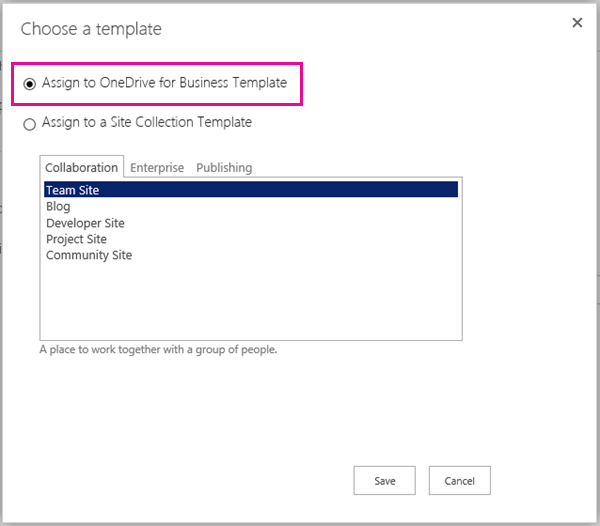
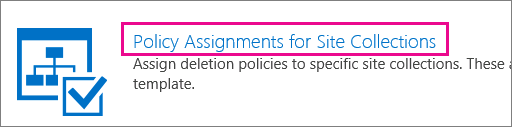

# Создание политики удаления документовCreate a document deletion policy

> [!IMPORTANT]
> В дальнейшем рекомендуется использовать политику хранения или метки хранения, созданные в центре соответствия требованиям Microsoft 365, центре безопасности Майкрософт или центре безопасности Office 365 &amp; , а не политике удаления документов.Moving forward, we recommend that you use a retention policy or retention labels created in the Microsoft 365 compliance center, Microsoft 365 security center, or Office 365 Security &amp; Compliance Center instead of a document deletion policy. Политики удаления документов продолжат работать параллельно с политиками хранения, но если вам нужно сохранить или удалить контент везде в Office 365, рекомендуем использовать политику хранения.Document deletion policies will continue to work side by side with retention policies, but if you need to retain or delete content anywhere in Office 365, we recommend that you use a retention policy. Дополнительные сведения см. [в статье Использование политики хранения вместо этих функций](retention-policies.md#use-a-retention-policy-instead-of-these-features).For more information, see [Use a retention policy instead of these features](retention-policies.md#use-a-retention-policy-instead-of-these-features). 
  
Часто организациям необходимо сохранять документы в течение определенного периода времени согласно требованиям соответствия, правовым и другим нормам. Однако хранение документов на протяжении более длительного срока, нежели требуется, может подвергнуть организацию юридическим рискам.Organizations are often required to retain documents for a certain period of time due to compliance, legal, or other regulations. However, retaining documents for longer than required can expose the organization to legal risk.
  
С помощью политики удаления документов вы можете снизить риск, удалив документы на сайте по истечении определенного периода времени, например, вы можете удалять документы в OneDrive для бизнеса сайтов пользователей через пять лет после создания документов.With a document deletion policy, you can proactively reduce risk by deleting documents in a site after a specific period of time—for example, you can delete documents in users' OneDrive for Business sites five years after the documents were created. 
  
Создав политику удаления документов, вы можете назначить ее шаблону семейства веб-сайтов, чтобы эта политика была доступна всем семействам веб-сайтов, созданным по указанному шаблону. Кроме того, можно назначить политику определенному семейству веб-сайтов, и она станет приоритетнее любых политик, назначенных шаблону для этого семейства веб-сайтов.After you create a document deletion policy, you can assign it to a site collection template, so that the policy is available to all site collections created from that template. You can also assign a policy to a specific a site collection, which overrides any policies that may have been assigned to the template for that site collection.
  

  
## Шаблоны политикиPolicy templates

Вы можете создать политику удаления документов с нуля или использовать один из примеров политик. В Центре политики соответствия есть примеры политик, которые можно использовать либо как готовые политики, либо в качестве отправной точки для создания собственных.You can create a document deletion policy from scratch, or you can use one of the sample policies. The Compliance Policy Center includes sample policies that you can use as is, or you can use them as a starting point and then rename or modify them.
  

  
## ПримерыExamples of how to use document deletion policies

Семейству веб-сайтов или шаблону семейства веб-сайтов может быть назначено несколько политик, при этом каждая из них может иметь несколько правил.A site collection or a site collection template can have one more policies assigned to it, and each of those policies can have one or more rules. Тем не менее, на каждом сайте может быть только одна политика, и в любой момент времени для библиотек на сайте может быть только одно правило удаления.However, there can be only one policy that's active per site, and there can be only one deletion rule that's active at any time for the libraries within the site.
  

  
Кроме того, вы можете отметить политику как обязательную или как политику по умолчанию, а также отметить правило удаления как правило по умолчанию:In addition, you can select a policy as mandatory or default, and you can select a deletion rule as a default rule: 
  
- **Обязательная политика** Если политика помечена как обязательная, семейству веб-сайтов или шаблону может быть назначена только одна политика.**Mandatory policy**When a policy is marked as mandatory, only one policy can be assigned to the site collection or template. Политика должна быть помечена как используемая по умолчанию, и она будет применена ко всем сайтам.The policy must be marked as default and will be applied to all sites. Владельцы сайтов не могут отказаться от применения политики.Site owners cannot opt out of the policy.
    
- **Политика по умолчанию** Если политика задана по умолчанию, она автоматически становится активной во всех сайтах, которым она назначена, без каких-либо действий, необходимых владельцам сайта.**Default policy**When a policy is set as default, the policy is automatically active in all sites that it's assigned to with no action required by site owner.
    
- **Правило по умолчанию** Когда правило удаления устанавливается по умолчанию, оно автоматически применяется ко всем библиотекам на сайтах, использующих эту политику.**Default rule**When a deletion rule is set as default, it is automatically applied to all libraries in the sites that use the policy.
    
В приведенных ниже примерах описаны ситуации, когда может потребоваться использование обязательной политики или политики по умолчанию, а также правила.The following examples explain when you might want to use a mandatory policy or default policies and rules.
  
### Пример 1. Применение одной политики с одним правилом к шаблону семейства веб-сайтовExample 1: Apply a single policy with a single rule to a site collection template

Может потребоваться применить политику удаления документов к широкому спектру неструктурированного контента, например ко всем веб-сайтам OneDrive для бизнеса или ко всем веб-сайтам групп. Чтобы убедиться, что одна политика удаления документов активна на всех веб-сайтах, созданных по шаблону семейства веб-сайтов, выполните следующие действия.You may want to enforce a document deletion policy across a broad range of unstructured content, such as all OneDrive for Business sites or all team sites. If you want to ensure that a single document deletion policy is active in all sites created from a site collection template, you can:
  
1. Создайте одну политику с одним правилом удаления по умолчанию.Create a single policy with a single default deletion rule.
    
2. Установите ее как обязательную и как политику по умолчанию.Set the policy as mandatory and default.
    
3. Назначьте политику для шаблона семейства веб-сайтов.Assign the policy to a site collection template.
    
В этом примере правило удаления по умолчанию применяется ко всем библиотекам в семействах веб-сайтов, созданных по этому шаблону, а владельцы веб-сайта не могут отменять политику. Это самый простой способ широкого и строгого применения политики удаления документов.In this example, the default deletion rule will be applied to all libraries in all site collections created from the template, and site owners cannot opt out of the policy. This is the simplest way to broadly and rigidly enforce a document deletion policy.
  

  
### Пример 2: применение одной политики с несколькими правилами к шаблону семейства веб-сайтовExample 2: Apply a single policy with several rules to a site collection template

Как правило, владельцы веб-сайтов лучше знают, контент какого типа содержится на их веб-сайте, потому вы можете предоставить возможность владельцам веб-сайтов выбрать правило удаления, которое лучше подходит их веб-сайту. Можно также разрешить владельцам веб-сайта полностью отказаться от политики.Site owners often know best what type of content their site contains, so you may choose to allow site owners to select the deletion rule that best applies to their site. You may also want to allow site owners to opt out of a policy entirely.
  
В то же время можно по-прежнему централизованно создавать политики и управлять ими. Вы также можете отметить одну политику и правило как значения по умолчанию, чтобы они всегда выполнялись, пока владелец веб-сайта не выберет другие или не отменит их. Чтобы обеспечить такую гибкость владельцам веб-сайтов, выполните указанные действия.At the same time, you can still centrally create and manage the policies. You can also select one policy and rule as the default, so that a policy is always in effect until the site owner chooses a different one or opts out. If you want to provide such flexibility to site owners, you can:
  
1. Создайте одну политику с несколькими правилами удаления и установите одно правило в качестве правила по умолчанию.Create a single policy with several deletion rules, and set one rule as the default.
    
2. Установите политику как политику по умолчанию.Set the policy as the default policy.
    
3. Назначьте политику для шаблона семейства веб-сайтов.Assign the policy to a site collection template.
    
Владельцы веб-сайтов могут выбрать одно из альтернативных правил удаления, отменить политику, а могут не выполнять никаких действий и подчиняться политике и правилу по умолчанию.Site owners can select one of the alternate deletion rules, opt out of the policy, or do nothing and be subject to the default policy and rule.
  

  
### Пример 3. Применение нескольких политик с одним или несколькими правилами к семейству веб-сайтовExample 3: Apply several policies with one or more rules to a site collection

В этом примере владельцы веб-сайтов получают максимальную гибкость, поскольку они могут выбирать из нескольких политик, а выбрав политику, выбрать из нескольких правил. Одна политика и правило установлены как значения по умолчанию, чтобы они всегда выполнялись, пока владелец веб-сайта не выберет другие или не отменит их. Обратите внимание на то, что если не отметить политику и правило как значения по умолчанию, ни одна политика или правило не будут активны для библиотек документов на веб-сайте, пока владелец веб-сайта не выполнит необходимые действия для их выбора и применения.This example provides the maximum flexibility to site owners because they can choose from several policies, and after selecting a policy they can often choose from several rules. One policy and rule are set as default, so that a policy is always in effect until the site owner chooses a different one or opts out. Note that if you do not set a policy and rule as the default, then no policies or rules will be active for the document libraries in the site until the site owner takes action to select and apply them.
  
В отличие от двух предыдущих примеров эти политики назначаются определенному семейству веб-сайтов, а не шаблону семейства веб-сайтов. Это означает, что их можно лучше подстроить под конкретный контент определенного семейства веб-сайтов.Unlike the previous two examples, these policies are assigned to a specific site collection — not the site collection template. This means the policies can be more specifically tailored for the content in a specific site collection.
  
Политики и правила являются наследуемыми. Владельцы веб-сайтов могут выбрать политику и правило для своего веб-сайта, а все дочерние сайты наследуют эту политику от родительского сайта. Однако владелец дочернего веб-сайта может остановить наследование, выбрав другую политику или правило, которые будут применены ко всем дочерним сайтам, пока наследование не будет остановлено снова.Policies and rules are inherited. Site owners can select a policy and rule for their site, and all subsites inherit the policy from the parent. However, an owner of a subsite can break inheritance by selecting a different policy and rule, which in turn applies to all subsites until inheritance is broken again.
  
Чтобы настроить этот сценарий, выполните следующие действия.To set up this scenario, you can:
  
1. Создайте несколько политик, каждая из которых содержит одно или несколько правил.Create several policies that each contains one or more rules.
    
2. Установите политику и правило как значения по умолчанию.Set a policy and rule as the default.
    
3. Назначьте политики для определенного семейства веб-сайтов.Assign the policies to a specific site collection.
    
Кроме того, политики и правила можно подстроить под определенное семейство веб-сайтов, при этом владельцы веб-сайтов могут остановить наследование, выбрав политику и правило, которые лучше всего подходят веб-сайту.In addition, the policies and rules are tailored to a specific site collection, where site owners can break inheritance by selecting the policy and rule that best applies to their site.
  

  
## Создание политики удаления документовCreate a document deletion policy

1. В центре соответствия требованиям &amp; Office 365Security перейдите к разделу \> **Хранение** **управления данными** .In the Office 365Security &amp; Compliance Center, navigate to **Data management** \> **Retention**. В разделе **Delete (удалить**) щелкните **Управление политиками удаления документов для SharePoint Online и OneDrive для бизнеса**.Under **Delete**, click **Manage document deletion policies for SharePoint Online and OneDrive for Business**. Центр политики удаления документов откроется на новой вкладке браузера.The Document Deletion Policy Center opens in a new browser tab.
    
    При первом переходе с центра соответствия требованиям &amp; безопасности в центр политики удаления документов центр политики автоматически создается автоматически.The first time you navigate from the Security &amp; Compliance Center to the Document Deletion Policy Center, the policy center is automatically created for you. Кроме того, можно вручную создать центр политик, [создав семейство сайтов](http://go.microsoft.com/fwlink/p/?LinkID=404342) и выбрав **центр политики соответствия** на вкладке **Корпоративный** .Alternatively, you can manually create the policy center by [creating the site collection](http://go.microsoft.com/fwlink/p/?LinkID=404342) and choosing **Compliance Policy Center** on the **Enterprise** tab. 
    
2. Выберите **политики удаления**.Choose **Deletion Policies**.
    
    
  
3. Выберите **новый элемент**.Choose **new item**.
    
4. Введите имя и описание политики. Владельцы веб-сайтов могут выбирать политику для своего сайта по предоставленному имени и описанию, потому добавьте достаточно сведений для выбора нужной политики.Enter a policy name and description. Site owners may be selecting a policy for their site based on this name and description, so include enough information for them to choose the correct policy.
    
5. Чтобы создать правило, нажмите кнопку **Создать**.To create a rule, choose **New**.
    
6. Введите имя и выберите указанные ниже параметры.Enter a name and choose the following options:
    
  - Выберите, будут ли документы удаляться окончательно или перемещаться в корзину.Choose whether the rule will permanently delete documents or delete them to the Recycle Bin. Корзина предназначена для предупреждения окончательного удаления элементов с сайта.The Recycle Bin provides a second-stage safety net before an item is permanently deleted from a site. Более подробную информацию о корзине можно узнать в статье [Очистка корзины или восстановление файлов](http://go.microsoft.com/fwlink/p/?LinkID=404348).For more information about the Recycle Bin, see [Empty the Recycle Bin or restore your files](http://go.microsoft.com/fwlink/p/?LinkID=404348).
    
  - Выберите, на основе чего будет рассчитываться дата удаления — с момента создания документа или его последнего изменения.Choose whether the deletion date is calculated from the date when a document was created or last modified.
    
  - Введите количество дней, месяцев или годов в качестве периода времени, после которого документ будет удален.Enter a number of days, months, or years as the time period after which a document will be deleted.
    
  - Укажите, является ли это правило правилом по умолчанию. Первое созданное правило автоматически задается в качестве правила по умолчанию. Правило по умолчанию автоматически применяется ко всем библиотекам на сайтах, использующих эту политику.Choose whether the rule is a default rule. The first rule that you create is automatically set as the default rule. A default rule is automatically applied to all libraries in the sites that use the policy.
    

  
7. Нажмите кнопку **Сохранить**.Click **Save**.
    
8. Создайте дополнительные правила, если необходимо, чтобы владельцы веб-сайтов могли выбирать различные правила и применять их к своим сайтам. При наличии правило по умолчанию будет применяться, если владелец веб-сайта не выполняет никаких действий.Create additional rules if you want site owners to be able to choose different rules to apply to their site. The default rule, if any, will be applied if the site owner takes no action.
    
9. Чтобы удалить правило из политики, выберите правило, нажмите кнопку **Удалить**, а затем нажмите кнопку **ОК**.To remove a rule from a policy, select the rule, click **Delete**, and then click **OK**.
    
    > [!NOTE]
    > Если вы удаляете правило, а политика не содержит правило по умолчанию, то никакие правила не будут применяться к этой политике — другими словами, не будет удалено ни одного документа.If you delete a rule, and the policy does not contain a default rule, then no rule will be in effect for that policy—in other words, no documents will be deleted. 
  

  
## Назначение политики удаления документов шаблону семейства веб-сайтовAssign the document deletion policy to a site collection template

Назначая политику шаблону семейства веб-сайтов, вы делаете ее доступной для всех семейств веб-сайтов, созданных по этому шаблону, включая как существующие семейства веб-сайтов, так и те, которые будут созданы в будущем.By assigning a policy to a site collection template, you make the policy available to all site collections created from that template, including both existing site collections and site collections created in the future.
  
Важно понимать, что период времени, указанный для политики удаления документов, указывает время, прошедшее с момента создания или изменения документа, а не с момента назначения политики.It's important to understand that the time period specified for a document deletion policy means the time since the document was created or modified, not the time since the policy was assigned. При первом назначении политики все документы на сайте оцениваются и в случае соответствия критериям удаляются.When you assign the policy for the first time, all documents in the site are evaluated and, if they meet the criteria, they will be deleted. Это применимо ко всем существующим документам, а не только к новым документам, созданным после назначения политики.This applies to all existing documents, not just new documents created since the policy was assigned.
  
1. В центре безопасности &amp; и соответствия требованиям перейдите к разделу \> **Хранение** **управления данными** .In the Security &amp; Compliance Center, navigate to **Data management** \> **Retention**. В разделе **Delete (удалить**) щелкните **Управление политиками удаления документов для SharePoint Online и OneDrive для бизнеса**.Under **Delete**, click **Manage document deletion policies for SharePoint Online and OneDrive for Business**. Центр политики удаления документов откроется на новой вкладке браузера.The Document Deletion Policy Center opens in a new browser tab.
    
2. Выберите **Назначения политик для шаблонов**.Choose **Policy Assignments for Templates**.
    
    
  
3. Выберите **новый элемент**.Choose **new item**.
    
4. Выполните одно из указанных ниже действий.Do one of the following:
    
  - Чтобы назначить политику шаблону семейства веб-сайтов (например, шаблону веб-сайта группы), выберите команду **Назначить шаблону семейства веб-сайтов**, а затем выберите нужный шаблон.To assign the policy to a site collection template such as the Team Site template, select **Assign to site collection template**, and then select the site collection template.
    
  - Чтобы назначить политику для пользователя на один диск для бизнеса, выберите пункт **назначить шаблону OneDrive для бизнеса**, выделенный ниже.To assign the policy to users' One Drive for Business, choose **Assign to OneDrive for Business Template**, highlighted below.
    
    > [!NOTE]
    > После назначения политики шаблону семейства веб-сайтов эта политика будет доступна как для существующих семейств веб-сайтов, созданных по этому шаблону, так и для семейств веб-сайтов, который будут созданы в будущем.When you assign a policy to a site collection template, that policy will be available both to existing site collections created from that template and to site collections created in the future. 
  

  
5. Нажмите кнопку **Сохранить**.Click **Save**.
    
    > [!NOTE]
    > Каждому шаблону можно назначить только один набор политик.Each template can have only one set of policies assigned to it. Если отображается сообщение об ошибке, сообщающее о том, что этому шаблону уже назначены политики, выберите **отменить** \> **назначение для семейства веб-сайтов** в левой панели навигации \> выберите семейство веб-сайтов для просмотра и управления набором политик, которые уже ей.If you see an error saying that this template already has policies assigned to it, choose **Cancel** \> **Assign to Site Collection** in the left navigation \> select a site collection to view and manage the set of policies that are already assigned. 
  
6. В разделе **Управление назначенными политиками** выберите политики, которые требуется назначить, а затем укажите, будет ли одна политика политикой по умолчанию.Choose **Manage Assigned Policies**, select the policies that you want to assign, and then choose whether one policy is the default policy. После установки политики по умолчанию она станет активной для всех веб-сайтов, которым она назначена, при этом не требуются действия владельца сайта.When you set a default policy, all sites assigned to the policy automatically have the policy active with no action required by site owner.
    
    
  
7. Нажмите кнопку **Сохранить**.Click **Save**.
    
8. Если требуется применить политику ко всем веб-сайтам, не позволяя владельцам сайтов отменять ее, выберите команду **Отметить политику как обязательную**. Если политика является обязательной, то только она может назначаться шаблону семейства веб-сайтов. Политика также должна быть отмечена как политика по умолчанию.If you want to enforce the policy on all sites without allowing site owners to opt out, choose **Mark Policy as Mandatory**. When you make a policy mandatory, only that single policy can be assigned to the site collection template. The policy must also be marked as default.
    
    Если этот параметр деактивирован, выберите **Управление назначенными политиками** и убедитесь, что по крайней мере одна политика назначена и отмечена как политика по умолчанию.If this option is grayed out, choose **Manage Assigned Policies** and make sure that at least one policy is assigned and set as default. 
    
9. Нажмите кнопку **Сохранить**.Click **Save**.
    
## Назначение политики удаления документов семейству веб-сайтовAssign the document deletion policy to a site collection

Назначив политику определенному семейству веб-сайтов, вы делаете ее доступной только для указанного семейства веб-сайтов. Это означает, что можно лучше подстраивать политики к контенту в семействе веб-сайтов. Кроме того, политики, назначенные определенному семейству веб-сайтов, будет иметь приоритет над любыми политиками, которые назначены шаблону этого семейства веб-сайтов. Например, политика, назначенная семейству веб-сайтов отдела продаж (созданному по шаблону сайта группы), будет иметь приоритет над любыми политиками, назначенными шаблону сайта группы.By assigning a policy to a specific site collection, you make the policy available only to that specific site collection. This means you can tailor policies more closely to the content in the site collection. Also, policies assigned to a specific site collection will override any policies that are assigned to the template for that site collection. For example, a policy assigned to the Sales Department site collection (created from the Team Site template) will override any policies assigned to the Team Site template.
  
Важно понимать, что период времени, указанный для политики удаления документов, указывает время, прошедшее с момента создания или изменения документа, а не с момента назначения политики.It's important to understand that the time period specified for a document deletion policy means the time since the document was created or modified, not the time since the policy was assigned. При первом назначении политики все документы на сайте оцениваются и в случае соответствия критериям удаляются.When you assign the policy for the first time, all documents in the site are evaluated and, if they meet the criteria, they will be deleted. Это применимо ко всем существующим документам, а не только к новым документам, созданным после назначения политики.This applies to all existing documents, not just new documents created since the policy was assigned.
  
1. В центре безопасности &amp; и соответствия требованиям перейдите к разделу \> **Хранение** **управления данными** .In the Security &amp; Compliance Center, navigate to **Data management** \> **Retention**. В разделе **Delete (удалить**) выберите пункт **Управление политиками удаления документов для SharePoint Online и OneDrive для бизнеса**.Under **Delete**, choose **Manage document deletion policies for SharePoint Online and OneDrive for Business**. Центр политики удаления документов откроется на новой вкладке браузера.The Document Deletion Policy Center opens in a new browser tab.
    
2. Выберите **Назначения политик для семейств веб-сайтов**.Choose **Policy Assignments for Site Collections**.
    
    
  
3. Выберите **новый элемент**.Choose **new item**.
    
4. Выберите **пункт Выбор семейства веб-сайтов**.Choose **Choose a site collection**. Поиск семейства веб-сайтов по имени или URL-АДРЕСу выберите семейство сайтов и нажмите кнопку **сохранить**.Search for the site collection by name or URL, select the site collection and click **Save**.
    
    > [!NOTE]
    > Каждому семейству веб-сайтов может быть назначен только один набор политик.Each site collection can have only one set of policies assigned to it. Если отображается сообщение об ошибке с сообщением о том, что этому семейству веб-сайтов уже назначены политики, выберите **отменить** \> **назначение в семействе веб-сайтов** и выберите семейство веб-сайтов для просмотра набора политик, который уже назначен, и управления им.If you see an error saying that this site collection already has policies assigned to it, choose **Cancel** \> **Assign to Site Collection** and select a site collection to view and manage the set of policies that are already assigned. 
  

  
5. В разделе **Управление назначенными политиками** выберите политики, которые требуется назначить, а затем укажите, будет ли одна политика политикой по умолчанию.Choose **Manage Assigned Policies**, select the policies that you want to assign, and then choose whether one policy is the default policy. После установки политики по умолчанию она станет активной для всех веб-сайтов, которым она назначена, при этом не требуются действия владельца сайта.When you set a default policy, all sites assigned to the policy automatically have the policy active with no action required by site owner.
    
    
  
6. Нажмите кнопку **Сохранить**.Click **Save**.
    
7. Если требуется применить политику ко всем веб-сайтам, не позволяя владельцам сайтов отменять ее, выберите команду **Отметить политику как обязательную**. Если политика является обязательной, то только она может назначаться семейству веб-сайтов. Политика также должна быть отмечена как политика по умолчанию.If you want to enforce the policy on all sites without allowing site owners to opt out, choose **Mark Policy as Mandatory**. When you make a policy mandatory, only that single policy can be assigned to the site collection. The policy must also be marked as default.
    
    Если этот параметр деактивирован, выберите **Управление назначенными политиками** и убедитесь, что по крайней мере одна политика назначена и отмечена как политика по умолчанию.If this option is grayed out, choose **Manage Assigned Policies** and make sure that at least one policy is assigned and set as default. 
    
8. Нажмите кнопку **Сохранить**.Click **Save**.
    
## Удаление назначения политикиDelete a policy assignment

После удаления назначения назначенные политики не будут применяться к сайтам в семействе веб-сайтов или шаблону семейства веб-сайтов.When you delete an assignment, the assigned policies will no longer apply to any sites in the site collection or site collection template.
  
1. В центре безопасности &amp; и соответствия требованиям перейдите к разделу \> **Хранение** **управления данными** .In the Security &amp; Compliance Center, navigate to **Data management** \> **Retention**. В разделе **Delete (удалить**) выберите пункт **Управление политиками удаления документов для SharePoint Online и OneDrive для бизнеса**.Under **Delete**, choose **Manage document deletion policies for SharePoint Online and OneDrive for Business**. Центр политики удаления документов откроется на новой вкладке браузера.The Document Deletion Policy Center opens in a new browser tab.
    
2. Выберите **Назначения политик для шаблонов** или **Назначения политик для семейств веб-сайтов**.Choose either **Policy Assignments for Templates** or **Policy Assignments for Site Collections**.
    
3. Выберите элемент назначения и нажмите кнопку **удалить элемент**.Select the assignment item and click **Delete Item**.
    
    
  
## Удаление политикиDelete a policy

Вы не можете удалить используемую политику.You can't delete a policy that's in use. Прежде чем удалять политику, сначала необходимо удалить все назначения для семейств веб-сайтов и шаблонов семейств веб-сайтов, включающих эту политику, в предыдущем разделе.Before you can delete a policy, you first need to delete all assignments to site collections and site collection templates that include that policy—see the previous section.
  
1. В &amp; центре \> безопасности и соответствия требованиям выберите **Хранение** **данных** \> в левой области переходов \> под надписью **Удалить** \> **Управление политиками удаления документов для SharePoint Online и OneDrive для бизнеса**.In the Security &amp; Compliance Center \> choose **Data management** \> **Retention** in the left navigation \> under **Delete** \> **Manage document deletion policies for SharePoint Online and OneDrive for Business**. Центр политики удаления документов откроется на новой вкладке браузера.The Document Deletion Policy Center opens in a new browser tab.
    
2. Выберите \* \* политики удаления \* \*.Choose \*\* Deletion Policies \*\*.
    
    
  
3. Выберите политику.Select the policy.
    
4. На вкладке \> \*\*\*\* \> элементы ленты **Удаление политики**.On the Ribbon \> **Items** tab \> **Remove Policy**.
    
    
  
5. Если политика используется, вам будет предложено удалить политику из всех семейств веб-сайтов, где она используется.If the policy is in use, you'll be asked if you want to remove the policy from all of the site collections where it's being used. Если вы уверены, нажмите кнопку **ОК**.If you're sure, choose **OK**.
    
    
  
## См. такжеSee also

  [Обзор политик удаления документов](document-deletion-policies.md)[Overview of document deletion policies](document-deletion-policies.md)

[Применение или удаление политики удаления документов для сайтаApply or remove a document deletion policy for a site](apply-or-remove-a-document-deletion-policy-for-a-site.md)
 

