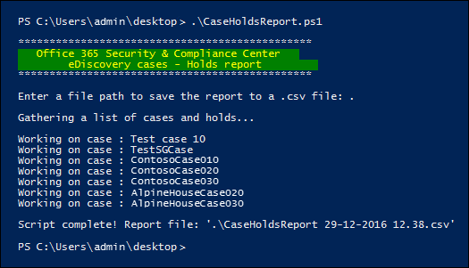

# <a name="create-a-report-on-holds-in-ediscovery-cases-in-office-365"></a><span data-ttu-id="1a9c7-103">Создание отчета на удержаний в вариантах eDiscovery в Office 365</span><span class="sxs-lookup"><span data-stu-id="1a9c7-103">Create a report on holds in eDiscovery cases in Office 365</span></span>
  
<span data-ttu-id="1a9c7-p101">Скрипт в этой статье позволяет администраторам обнаружения электронных данных и диспетчеры обнаружения электронных данных создать отчет, содержащий сведения о всех удержаний, связанных с вариантах eDiscovery безопасности Office 365 &amp; центре соответствия требованиям. Отчет содержит сведения, такие как имя случая удержания связан с размещения содержимого, помещенные на удержание и удержания на основе запроса. Если случаев, которые не имеют все удержаний, скрипт будет создание отчета дополнительные со списком случаев без удержаний.</span><span class="sxs-lookup"><span data-stu-id="1a9c7-p101">The script in this article lets eDiscovery administrators and eDiscovery managers generate a report that contains information about all holds that are associated with eDiscovery cases in the Office 365 Security &amp; Compliance Center. The report contains information such as the name of the case a hold is associated with, the content locations that are placed on hold, and whether the hold is query-based. If there are cases that don't have any holds, the script will create an additional report with a list of cases without holds.</span></span>

<span data-ttu-id="1a9c7-107">Подробное описание данных, включаемых в отчет в разделе [Дополнительные сведения](#more-information) .</span><span class="sxs-lookup"><span data-stu-id="1a9c7-107">See the [More information](#more-information) section for a detailed description of the information included in the report.</span></span> 
  
## <a name="before-you-begin"></a><span data-ttu-id="1a9c7-108">Перед началом работы</span><span class="sxs-lookup"><span data-stu-id="1a9c7-108">Before you begin</span></span>

- <span data-ttu-id="1a9c7-p102">Чтобы создать отчет о всех случаев обнаружения в вашей организации, необходимо быть eDiscovery администратора в вашей организации. Если вы являетесь диспетчеру eDiscovery, отчет будет содержать только сведения о вариантах, которые могут получить доступ к. Дополнительные сведения о разрешениях обнаружения электронных данных можно [назначать разрешения обнаружения электронных данных в Office 365 безопасность &amp; центре соответствия требованиям](assign-ediscovery-permissions.md).</span><span class="sxs-lookup"><span data-stu-id="1a9c7-p102">To generate a report on all eDiscovery cases in your organization, you have to be an eDiscovery Administrator in your organization. If you are an eDiscovery Manager, the report will only include information about the cases that you can access. For more information about eDiscovery permissions, see [Assign eDiscovery permissions in the Office‍ 365 Security &amp; Compliance Center](assign-ediscovery-permissions.md).</span></span>
    
- <span data-ttu-id="1a9c7-p103">Скрипт в этой статье имеет обработка минимальной ошибок. Основной целью — для быстрого создания отчета об удержаниях, связанных с вариантах eDiscovery в вашей организации.</span><span class="sxs-lookup"><span data-stu-id="1a9c7-p103">The script in this article has minimal error handling. The primary purpose is to quickly create report about the holds that are associated with the eDiscovery cases in your organization.</span></span>
    
- <span data-ttu-id="1a9c7-p104">Примеры сценариев, представленные в этом разделе не поддерживаются в разделе службы или любой другой программы стандартной поддержки корпорации Майкрософт. Примеры сценариев, предоставляются как есть без никаких гарантий. Дополнительно корпорация Майкрософт не все подразумеваемых гарантий, включая, без ограничения, какие-либо подразумеваемых гарантий окупаемость или определенного случаях. Весь риск, возникающих в результате использования или производительности примеры скриптов и документация остается с вами. Событие не корпорации Майкрософт, ее автора или другим способом соблюдать создания, рабочей или доставки сценариев несут ответственности для любых убытков ни при каких обстоятельствах (включая, без ограничений, убытков для потере бизнеса прибыли, перерывах в коммерческой деятельности, потеря бизнес-информация, или другие упущенную потери) возникающих в результате использования или невозможности использовать примеры сценариев или документации, даже если Microsoft поступали предупреждения о возможности такого ущерба.</span><span class="sxs-lookup"><span data-stu-id="1a9c7-p104">The sample scripts provided in this topic aren't supported under any Microsoft standard support program or service. The sample scripts are provided AS IS without warranty of any kind. Microsoft further disclaims all implied warranties including, without limitation, any implied warranties of merchantability or of fitness for a particular purpose. The entire risk arising out of the use or performance of the sample scripts and documentation remains with you. In no event shall Microsoft, its authors, or anyone else involved in the creation, production, or delivery of the scripts be liable for any damages whatsoever (including, without limitation, damages for loss of business profits, business interruption, loss of business information, or other pecuniary loss) arising out of the use of or inability to use the sample scripts or documentation, even if Microsoft has been advised of the possibility of such damages.</span></span>
    
## <a name="step-1-connect-to-the-security-amp-compliance-center-using-remote-powershell"></a><span data-ttu-id="1a9c7-119">Шаг 1: Подключение к безопасности &amp; центре соответствия требованиям, с помощью удаленной оболочки PowerShell</span><span class="sxs-lookup"><span data-stu-id="1a9c7-119">Step 1: Connect to the Security &amp; Compliance Center using Remote PowerShell</span></span>

<span data-ttu-id="1a9c7-120">Первым шагом является подключение Windows PowerShell для защиты &amp; центре соответствия требованиям для вашей организации.</span><span class="sxs-lookup"><span data-stu-id="1a9c7-120">The first step is to connect Windows PowerShell to the Security &amp; Compliance Center for your organization.</span></span>
  
1. <span data-ttu-id="1a9c7-121">Сохраните следующий текст в файл сценария Windows PowerShell с помощью суффикса имени файла .ps1; например `ConnectSCC.ps1`.</span><span class="sxs-lookup"><span data-stu-id="1a9c7-121">Save the following text to a Windows PowerShell script file by using a filename suffix of .ps1; for example, `ConnectSCC.ps1`.</span></span> 
    
      ```
      # Get login credentials 
      $UserCredential = Get-Credential 
      $Session = New-PSSession -ConfigurationName Microsoft.Exchange -ConnectionUri https://ps.compliance.protection.outlook.com/powershell-liveid -Credential $UserCredential -Authentication Basic -AllowRedirection 
      Import-PSSession $Session -AllowClobber -DisableNameChecking 
      $Host.UI.RawUI.WindowTitle = $UserCredential.UserName + " (Office 365 Security &amp; Compliance Center)" 
    ```

2. <span data-ttu-id="1a9c7-122">На локальном компьютере откройте Windows PowerShell и перейдите к папке, в которой вы сохранили скрипт.</span><span class="sxs-lookup"><span data-stu-id="1a9c7-122">On your local computer, open Windows PowerShell and go to the folder where you saved the script.</span></span> 
    
3. <span data-ttu-id="1a9c7-123">Выполнение скрипта; Например:</span><span class="sxs-lookup"><span data-stu-id="1a9c7-123">Run the script; for example:</span></span>

    ```
    .\ConnectSCC.ps1
    ```
   
4. <span data-ttu-id="1a9c7-124">Когда требуется ввести учетные данные, введите адрес электронной почты и пароль и нажмите кнопку **ОК**.</span><span class="sxs-lookup"><span data-stu-id="1a9c7-124">When prompted for your credentials, enter your email address and password, and then click **OK**.</span></span> 
  
## <a name="step-2-run-the-script-to-report-on-holds-associated-with-ediscovery-cases"></a><span data-ttu-id="1a9c7-125">Шаг 2: Запустите сценарий для создания отчетов о содержит связанный с вариантах eDiscovery</span><span class="sxs-lookup"><span data-stu-id="1a9c7-125">Step 2: Run the script to report on holds associated with eDiscovery cases</span></span>

<span data-ttu-id="1a9c7-126">После подключения к безопасности &amp; центре соответствия требованиям, с помощью удаленной оболочки PowerShell, следующим шагом является создание и выполнение сценария, который собирает сведения о вариантах eDiscovery в вашей организации.</span><span class="sxs-lookup"><span data-stu-id="1a9c7-126">After you've connected to the Security &amp; Compliance Center with remote PowerShell, the next step is to create and run the script that collects information about the eDiscovery cases in your organization.</span></span> 
  
1. <span data-ttu-id="1a9c7-127">Сохраните следующий текст в файл сценария Windows PowerShell с помощью суффикса имени файла .ps1; Например CaseHoldsReport.ps1.</span><span class="sxs-lookup"><span data-stu-id="1a9c7-127">Save the following text to a Windows PowerShell script file by using a filename suffix of .ps1; for example, CaseHoldsReport.ps1.</span></span> 
    
  ```
#script begin
" " 
write-host "***********************************************"
write-host "   Office 365 Security & Compliance Center   " -foregroundColor yellow -backgroundcolor darkgreen
write-host "        eDiscovery cases - Holds report         " -foregroundColor yellow -backgroundcolor darkgreen 
write-host "***********************************************"
" " 
#prompt users to specify a path to store the output files
$time=get-date
$Path = Read-Host 'Enter a file path to save the report to a .csv file'
$outputpath=$Path+'\'+'CaseHoldsReport'+' '+$time.day+'-'+$time.month+'-'+$time.year+' '+$time.hour+'.'+$time.minute+'.csv'
$noholdsfilepath=$Path+'\'+'CaseswithNoHolds'+' '+$time.day+'-'+$time.month+'-'+$time.year+' '+$time.hour+'.'+$time.minute+'.csv'
#add case details to the csv file
function add-tocasereport{
Param([string]$casename,
[String]$casestatus,
[datetime]$casecreatedtime,
[string]$casemembers,
[datetime]$caseClosedDateTime,
[string]$caseclosedby,
[string]$holdname,
[String]$Holdenabled,
[string]$holdcreatedby,
[string]$holdlastmodifiedby,
[string]$ExchangeLocation,
[string]$sharePointlocation,
[string]$ContentMatchQuery,
[datetime]$holdcreatedtime,
[datetime]$holdchangedtime
)
$addRow = New-Object PSObject 
Add-Member -InputObject $addRow -MemberType NoteProperty -Name "Case name" -Value $casename
Add-Member -InputObject $addRow -MemberType NoteProperty -Name "Case status" -Value $casestatus
Add-Member -InputObject $addRow -MemberType NoteProperty -Name "Case members" -Value $casemembers
Add-Member -InputObject $addRow -MemberType NoteProperty -Name "Case created time" -Value $casecreatedtime
Add-Member -InputObject $addRow -MemberType NoteProperty -Name "Case closed time" -Value $caseClosedDateTime
Add-Member -InputObject $addRow -MemberType NoteProperty -Name "Case closed by" -Value $caseclosedby
Add-Member -InputObject $addRow -MemberType NoteProperty -Name "Hold name" -Value $holdname
Add-Member -InputObject $addRow -MemberType NoteProperty -Name "Hold enabled" -Value $Holdenabled
Add-Member -InputObject $addRow -MemberType NoteProperty -Name "Hold created by" -Value $holdcreatedby
Add-Member -InputObject $addRow -MemberType NoteProperty -Name "Hold last changed by" -Value $holdlastmodifiedby
Add-Member -InputObject $addRow -MemberType NoteProperty -Name "Exchange locations" -Value  $ExchangeLocation
Add-Member -InputObject $addRow -MemberType NoteProperty -Name "SharePoint locations" -Value $sharePointlocation
Add-Member -InputObject $addRow -MemberType NoteProperty -Name "Hold query" -Value $ContentMatchQuery
Add-Member -InputObject $addRow -MemberType NoteProperty -Name "Hold created time (UTC)" -Value $holdcreatedtime
Add-Member -InputObject $addRow -MemberType NoteProperty -Name "Hold changed time (UTC)" -Value $holdchangedtime
$allholdreport = $addRow | Select-Object "Case name","Case status","Hold name","Hold enabled","Case members", "Case created time","Case closed time","Case closed by","Exchange locations","SharePoint locations","Hold query","Hold created by","Hold created time (UTC)","Hold last changed by","Hold changed time (UTC)"
$allholdreport | export-csv -path $outputPath -notypeinfo -append -Encoding ascii 
}
#get information on the cases and pass values to the case report function
" "
write-host "Gathering a list of cases and holds..."
" "
$edc =Get-ComplianceCase -ErrorAction SilentlyContinue
foreach($cc in $edc)
{
write-host "Working on case :" $cc.name
if($cc.status -eq 'Closed')
{
$cmembers = ((Get-ComplianceCaseMember -Case $cc.name).windowsLiveID)-join ';'
add-tocasereport -casename $cc.name -casestatus $cc.Status -caseclosedby $cc.closedby -caseClosedDateTime $cc.ClosedDateTime -casemembers $cmembers 
}
else{
$cmembers = ((Get-ComplianceCaseMember -Case $cc.name).windowsLiveID)-join ';'
$policies = Get-CaseHoldPolicy -Case $cc.Name | %{ Get-CaseHoldPolicy $_.Name -Case $_.CaseId -DistributionDetail}
if ($policies -ne $NULL)
{
foreach ($policy in $policies)
{
$rule=Get-CaseHoldRule -Policy $policy.name
add-tocasereport -casename $cc.name -casemembers $cmembers -casestatus $cc.Status -casecreatedtime $cc.CreatedDateTime -holdname $policy.name -holdenabled $policy.enabled -holdcreatedby $policy.CreatedBy -holdlastmodifiedby $policy.LastModifiedBy -ExchangeLocation (($policy.exchangelocation.name)-join ';') -SharePointLocation (($policy.sharePointlocation.name)-join ';') -ContentMatchQuery $rule.ContentMatchQuery -holdcreatedtime $policy.WhenCreatedUTC -holdchangedtime $policy.WhenChangedUTC
}
}
else{
write-host "No hold policies found in case:" $cc.name -foregroundColor 'Yellow'
" "
[string]$cc.name | out-file -filepath $noholdsfilepath -append 
}
}
}

" "
Write-host "Script complete! Report files saved to this folder: '$Path'"
" "
#script end
  ```

2. <span data-ttu-id="1a9c7-128">Во время сеанса Windows PowerShell, которая открыта в шаге 1 Перейдите к папке, в которой вы сохранили скрипт.</span><span class="sxs-lookup"><span data-stu-id="1a9c7-128">In the Windows PowerShell session that opened in Step 1, go to the folder where you saved the script.</span></span> 
    
3. <span data-ttu-id="1a9c7-129">Выполнение скрипта; Например:</span><span class="sxs-lookup"><span data-stu-id="1a9c7-129">Run the script; for example:</span></span>

    ```
    .\CaseHoldsReport.ps1
    ```

    <span data-ttu-id="1a9c7-130">Сценарий выводит запрос, папку назначения для сохранения в отчете.</span><span class="sxs-lookup"><span data-stu-id="1a9c7-130">The script will prompt for a target folder to save the report to.</span></span> 
    
4. <span data-ttu-id="1a9c7-131">Введите полный путь к папке для сохранения в отчете и нажмите клавишу **Ввод**.</span><span class="sxs-lookup"><span data-stu-id="1a9c7-131">Type the full path name of the folder to save the report to, and then press **Enter**.</span></span>
    
    > [!TIP]
    > <span data-ttu-id="1a9c7-p105">Чтобы сохранить отчет в той же папке, размещенной в скрипт, введите точку (".») при появлении запроса папку назначения. Для сохранения отчета во вложенной папке в папке, где расположена скрипт, просто введите имя вложенной папке.</span><span class="sxs-lookup"><span data-stu-id="1a9c7-p105">To save the report in the same folder that the script is located in, type a period (".") when prompted for a target folder. To save the report in a subfolder in the folder where the script is located, just type the name of the subfolder.</span></span> 
  
    <span data-ttu-id="1a9c7-p106">Сценарий начинает сбор сведений о всех случаев обнаружения в вашей организации. Нет доступа к файлу отчета во время выполнения скрипта. После завершения скрипта сообщение с подтверждением отображается в сеанса Windows PowerShell. После данное сообщение, можно обращаться к отчет в папке, указанной на шаге 4. — Это имя файла для отчета `CaseHoldsReport<DateTimeStamp>.csv`.</span><span class="sxs-lookup"><span data-stu-id="1a9c7-p106">The script starts to collect information about all the eDiscovery cases in your organization. Don't access the report file while the script is running. After the script is complete, a confirmation message is displayed in the Windows PowerShell session. After this message is displayed, you can access the report in the folder that you specified in Step 4. The file name for the report is `CaseHoldsReport<DateTimeStamp>.csv`.</span></span>

    <span data-ttu-id="1a9c7-p107">Addtionally, сценарий также создает отчет со списком случаев, которые не имеют все удержаний. — Это имя файла для этого отчета `CaseswithNoHolds<DateTimeStamp>.csv`.</span><span class="sxs-lookup"><span data-stu-id="1a9c7-p107">Addtionally, the script also creates a report with a list of cases that don't have any holds. The file name for this report is `CaseswithNoHolds<DateTimeStamp>.csv`.</span></span>
    
    <span data-ttu-id="1a9c7-141">Ниже приведен пример выполнения скрипта CaseHoldsReport.ps1.</span><span class="sxs-lookup"><span data-stu-id="1a9c7-141">Here's an example of running the CaseHoldsReport.ps1 script.</span></span> 
    
    
  
## <a name="more-information"></a><span data-ttu-id="1a9c7-143">Дополнительные сведения</span><span class="sxs-lookup"><span data-stu-id="1a9c7-143">More information</span></span>

<span data-ttu-id="1a9c7-p108">Регистр содержит отчета, который создается при запуске сценария в этой статье содержатся следующие сведения о каждом удержания. Как объяснялось ранее необходимо быть eDiscovery администратору, чтобы получить сведения обо всех удержаний в вашей организации. Содержит дополнительные сведения о case см [вариантах eDiscovery безопасности Office 365 &amp; центре соответствия требованиям](ediscovery-cases.md).</span><span class="sxs-lookup"><span data-stu-id="1a9c7-p108">The case holds report that's created when you run the script in this article contains the following information about each hold. As previously explained, you have to be an eDiscovery Administrator to return information for all holds in your organization. For more information about case holds, see [eDiscovery cases in the Office 365 Security &amp; Compliance Center](ediscovery-cases.md).</span></span>
  
  - <span data-ttu-id="1a9c7-147">Имя удержания и имя случая обнаружения электронных данных, с которым связана удержания.</span><span class="sxs-lookup"><span data-stu-id="1a9c7-147">The name of the hold and the name of the eDiscovery case that the hold is associated with.</span></span>
    
  - <span data-ttu-id="1a9c7-148">Ли случая обнаружения электронных данных является активным или закрытой.</span><span class="sxs-lookup"><span data-stu-id="1a9c7-148">Whether or not the eDiscovery case is active or closed.</span></span>
    
  - <span data-ttu-id="1a9c7-149">Ли удержание включена или отключена.</span><span class="sxs-lookup"><span data-stu-id="1a9c7-149">Whether or not the hold is enabled or disabled.</span></span>
    
  - <span data-ttu-id="1a9c7-p109">Члены случая обнаружения электронных данных, с которым связана удержания. Case элементы можно просмотреть или изменить дела, в зависимости от разрешения обнаружения электронных данных, которые они были назначены.</span><span class="sxs-lookup"><span data-stu-id="1a9c7-p109">The members of the eDiscovery case that the hold is associated with. Case members can view or manage a case, depending on the eDiscovery permissions they've been assigned.</span></span>
    
  - <span data-ttu-id="1a9c7-152">Время и Дата создания обращения.</span><span class="sxs-lookup"><span data-stu-id="1a9c7-152">The time and date the case was created.</span></span>
    
  - <span data-ttu-id="1a9c7-153">При закрытии обращения человека, который закрыть его и время и дата его было закрыто.</span><span class="sxs-lookup"><span data-stu-id="1a9c7-153">If a case is closed, the person who closed it and the time and date it was closed.</span></span>
    
  - <span data-ttu-id="1a9c7-154">Почтовые ящики Exchange и SharePoint узлы расположения, которые находятся на удержании.</span><span class="sxs-lookup"><span data-stu-id="1a9c7-154">The Exchange mailboxes and SharePoint sites locations that are on hold.</span></span>
    
  - <span data-ttu-id="1a9c7-155">Если удержание на основе запроса, синтаксис запроса.</span><span class="sxs-lookup"><span data-stu-id="1a9c7-155">If the hold is query-based, the query syntax.</span></span>
    
  - <span data-ttu-id="1a9c7-156">Время и Дата создания удержания и человека, создавшего его.</span><span class="sxs-lookup"><span data-stu-id="1a9c7-156">The time and date the hold was created and the person who created it.</span></span>
    
  - <span data-ttu-id="1a9c7-157">Время и Дата последнего изменения удержания и пользователя, который изменил его.</span><span class="sxs-lookup"><span data-stu-id="1a9c7-157">The time and date the hold was last changed and the person who changed it.</span></span>
