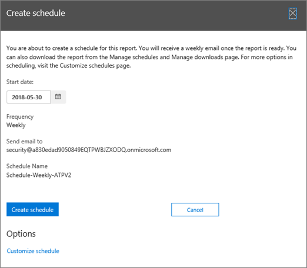

# Создание расписания для отчета в центре безопасности &amp; и соответствия требованиям

В центре соответствия &amp; требованиям безопасности доступны некоторые [отчеты и](reports-and-insights-in-security-and-compliance.md) сведения, помогающие группе безопасности Организации уменьшить риски и устранить угрозы в Организации. Если вы являетесь участником группы безопасности Организации, вы можете создать расписание для отчета. Создаваемое расписание может включать настраиваемые диапазоны дат в соответствии с вашей организацией. 
  
## Создание расписания для отчета

> [!IMPORTANT]
> Убедитесь, что у вас есть необходимые разрешения для выполнения этой задачи. В общем случае пользователи Office 365 глобальные администраторы, администраторы безопасности и средства чтения безопасности могут получать доступ к отчетам в центре безопасности &amp; и соответствия требованиям. Дополнительные сведения о разрешениях приведены [в разделе разрешения в центре безопасности &amp; и соответствия требованиям Office 365](permissions-in-the-security-and-compliance-center.md).
  
1. В [центре безопасности &amp; и соответствия требованиям](https://protection.office.com)откройте **панель мониторинга** **отчетов** \> .
    
2. Выберите отчет. В этом примере мы будем выбирать отчет о состоянии защиты от угроз.
    
3. В левом верхнем углу отчета выберите **+ создать расписание**.
    
    
  
    Откроется диалоговое окно " **Создание расписания** ". 
    
4. Оставьте параметры по умолчанию и нажмите **создать расписание**, или выберите **настроить расписание**.
    
    
  
    Если вы решили настроить расписание отчета, вы можете указать частоту отчета, адрес электронной почты отправителя и адрес электронной почты получателя. 
    
После создания расписания для отчета этот отчет будет доставлен по электронной почте на адреса электронной почты получателей автоматически. 
  
## Связанные статьи

[Отчеты и аналитика в центре безопасности &amp; и соответствия требованиям Office 365](reports-and-insights-in-security-and-compliance.md)
  
[Управление расписаниями для отчетов в центре &amp; безопасности и соответствия требованиям](manage-schedules-for-multiple-reports.md)
  
[Загрузка существующих отчетов в центре безопасности &amp; и соответствия требованиям](download-existing-reports.md)
  
[Скачайте настраиваемый отчет в центре безопасности &amp; и соответствия требованиям](set-up-and-download-a-custom-report.md)
  

