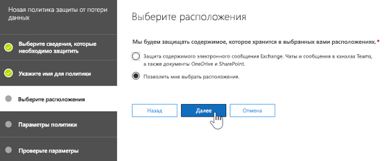
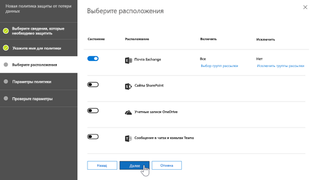
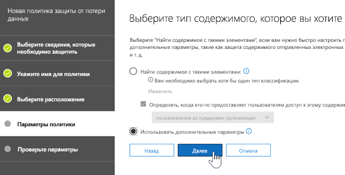
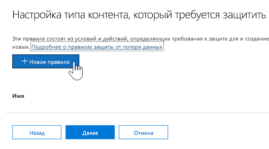
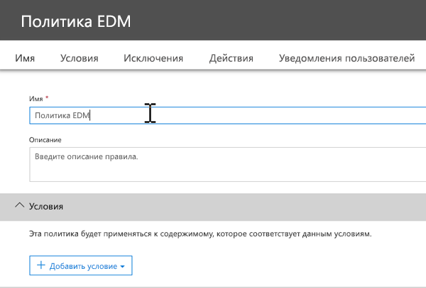
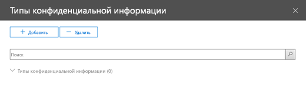

# <a name="create-custom-sensitive-information-types-with-exact-data-match-based-classification-preview"></a><span data-ttu-id="52453-103">Создание пользовательских типов конфиденциальной информации с помощью классификации на основе точного совпадения данных (предварительная версия)</span><span class="sxs-lookup"><span data-stu-id="52453-103">See Create a custom sensitive information type with Exact Data Match based classification (Preview).</span></span>

## <a name="overview"></a><span data-ttu-id="52453-104">Общие сведения</span><span class="sxs-lookup"><span data-stu-id="52453-104">Overview</span></span>

<span data-ttu-id="52453-105">[Пользовательские типы конфиденциальной информации](custom-sensitive-info-types.md) используются для предотвращения непреднамеренного или неприемлемого предоставления общего доступа к конфиденциальной информации.</span><span class="sxs-lookup"><span data-stu-id="52453-105">[Custom sensitive information types](custom-sensitive-info-types.md) are used to help prevent inadvertent or inappropriate sharing of sensitive information.</span></span> <span data-ttu-id="52453-106">Как администратор вы можете использовать [Центр безопасности и соответствия требованиям](create-a-custom-sensitive-information-type.md) или [PowerShell](create-a-custom-sensitive-information-type-in-scc-powershell.md), чтобы определить пользовательский тип конфиденциальной информации на основе шаблонов, признаков (ключевые слова, например *сотрудник*, *эмблема*, *идентификатор* и т. д), расстояния между символами (как близко располагается признак к символам в определенном шаблоне) и уровней вероятности.</span><span class="sxs-lookup"><span data-stu-id="52453-106">As an administrator, you can use the [Security & Compliance Center](create-a-custom-sensitive-information-type.md) or [PowerShell](create-a-custom-sensitive-information-type-in-scc-powershell.md) to define a custom sensitive information type based on patterns, evidence (keywords such as *employee*, *badge*, *ID*, and so on), character proximity (how close evidence is to characters in a particular pattern), and confidence levels.</span></span> <span data-ttu-id="52453-107">Такие пользовательские типы конфиденциальной информации соответствуют бизнес-требованиям большинства организаций.</span><span class="sxs-lookup"><span data-stu-id="52453-107">Such custom sensitive information types meet business needs for many organizations.</span></span>

<span data-ttu-id="52453-108">Но что если вам нужен пользовательский тип конфиденциальной информации, использующий точные значения данных, а не шаблоны и близость?</span><span class="sxs-lookup"><span data-stu-id="52453-108">But what if you wanted a custom sensitive information type that uses exact data values, instead of patterns and proximity?</span></span> <span data-ttu-id="52453-109">С помощью классификации на основе точного совпадения данных (EDM) вы можете создать пользовательский тип конфиденциальной информации со следующими характеристиками:</span><span class="sxs-lookup"><span data-stu-id="52453-109">With Exact Data Match (EDM)-based classification, you can create a custom sensitive information type that is designed to:</span></span>
- <span data-ttu-id="52453-110">динамичный и обновляемый;</span><span class="sxs-lookup"><span data-stu-id="52453-110">be dynamic and refreshable;</span></span>
- <span data-ttu-id="52453-111">дополнительные возможности масштабирования;</span><span class="sxs-lookup"><span data-stu-id="52453-111">be more scalable;</span></span>
- <span data-ttu-id="52453-112">снижает число ошибочно положительных результатов;</span><span class="sxs-lookup"><span data-stu-id="52453-112">result in fewer false-positives;</span></span>
- <span data-ttu-id="52453-113">поддерживает структурированные конфиденциальные данные;</span><span class="sxs-lookup"><span data-stu-id="52453-113">work with structured sensitive data;</span></span>
- <span data-ttu-id="52453-114">более безопасная обработка конфиденциальной информации;</span><span class="sxs-lookup"><span data-stu-id="52453-114">handle sensitive information more securely; and</span></span>
- <span data-ttu-id="52453-115">использование с несколькими облачными службами Майкрософт.</span><span class="sxs-lookup"><span data-stu-id="52453-115">be used with several Microsoft cloud services.</span></span>


<span data-ttu-id="52453-117">Классификация на основе EDM позволяет создавать пользовательские типы конфиденциальной информации, ссылающиеся на точные значения в базе данных конфиденциальной информации.</span><span class="sxs-lookup"><span data-stu-id="52453-117">EDM-based classification enables you to create custom sensitive information types that refer to exact values in a database of sensitive information.</span></span> <span data-ttu-id="52453-118">Базу данных можно обновлять ежедневно или еженедельно, и она может содержать до 10 миллионов строк данных.</span><span class="sxs-lookup"><span data-stu-id="52453-118">The database can be refreshed daily or weekly, and it can contain up to 10 million rows of data.</span></span> <span data-ttu-id="52453-119">Таким образом ваши пользовательские типы конфиденциальной информации остаются актуальными и применимыми при смене сотрудников, пациентов или клиентов, а также при изменении записей.</span><span class="sxs-lookup"><span data-stu-id="52453-119">So as employees, patients, or clients come and go, and records change, your custom sensitive information types remain current and applicable.</span></span> <span data-ttu-id="52453-120">Вы также можете использовать классификацию на основе EDM с политиками, такими как [политики защиты от потери данных](data-loss-prevention-policies.md) (DLP) или [политики файлов Microsoft Cloud App Security](https://docs.microsoft.com/cloud-app-security/data-protection-policies).</span><span class="sxs-lookup"><span data-stu-id="52453-120">And, you can use EDM-based classification with policies, such as [data loss prevention policies](data-loss-prevention-policies.md) (DLP) or [Microsoft Cloud App Security file policies](https://docs.microsoft.com/cloud-app-security/data-protection-policies).</span></span>

## <a name="required-licenses-and-permissions"></a><span data-ttu-id="52453-121">Обязательные лицензии и разрешения</span><span class="sxs-lookup"><span data-stu-id="52453-121">Required licenses and permissions</span></span>

- <span data-ttu-id="52453-122">Для выполнения задач, описанных в данной статье, вы должны быть глобальным администратором, администратором соответствия требованиям или администратором Exchange Online.</span><span class="sxs-lookup"><span data-stu-id="52453-122">You must be a global admin, compliance administrator, or Exchange Online administrator to perform the tasks described in this article.</span></span> <span data-ttu-id="52453-123">Дополнительные сведения о разрешениях DLP см. в разделе [Разрешения](data-loss-prevention-policies.md#permissions).</span><span class="sxs-lookup"><span data-stu-id="52453-123">To learn more about DLP permissions, see [Permissions](data-loss-prevention-policies.md#permissions).</span></span>

- <span data-ttu-id="52453-124">После выпуска в общедоступной версии классификация на основе EDM будет включена в следующие подписки:</span><span class="sxs-lookup"><span data-stu-id="52453-124">When generally available, EDM-based classification will be included in the following subscriptions:</span></span>
    - <span data-ttu-id="52453-125">Office 365 E5</span><span class="sxs-lookup"><span data-stu-id="52453-125">Office 365 Enterprise E5</span></span>
    - <span data-ttu-id="52453-126">Microsoft 365 E5</span><span class="sxs-lookup"><span data-stu-id="52453-126">Microsoft 365 E5</span></span>
    - <span data-ttu-id="52453-127">Защита данных и соответствие требованиям Microsoft 365</span><span class="sxs-lookup"><span data-stu-id="52453-127">Microsoft 365 Information Protection and Compliance</span></span>
    - <span data-ttu-id="52453-128">Office 365 Advanced Compliance</span><span class="sxs-lookup"><span data-stu-id="52453-128">Office 365 Advanced Compliance</span></span>

> [!NOTE]
> <span data-ttu-id="52453-129">**Классификация на основе EDM в настоящее время доступна в предварительной версия** для [защиты от потери данных в Office 365](data-loss-prevention-policies.md) (с Exchange Online и Microsoft Teams) и [Cloud App Security](https://docs.microsoft.com/cloud-app-security).</span><span class="sxs-lookup"><span data-stu-id="52453-129">**EDM-based classification is currently in preview** for [DLP in Office 365](data-loss-prevention-policies.md) (with Exchange Online and Microsoft Teams) and [Cloud App Security](https://docs.microsoft.com/cloud-app-security).</span></span> <span data-ttu-id="52453-130">Если в вашей организации доступны [возможности защиты от потери данных](https://docs.microsoft.com/office365/servicedescriptions/exchange-online-protection-service-description/messaging-policy-and-compliance-servicedesc#data-loss-prevention-dlp), вы можете воспользоваться классификацией на основе EDM.</span><span class="sxs-lookup"><span data-stu-id="52453-130">If your organization has [DLP capabilities](https://docs.microsoft.com/office365/servicedescriptions/exchange-online-protection-service-description/messaging-policy-and-compliance-servicedesc#data-loss-prevention-dlp), you can try EDM-based classification.</span></span> <span data-ttu-id="52453-131">Если вы еще не участвуете в программе предварительной оценки [свяжитесь с Майкрософт](https://resources.office.com/us-landing-spe-contactus.html?LCID=EN-US), чтобы приступить к работе.</span><span class="sxs-lookup"><span data-stu-id="52453-131">If you are not already participating in the preview, [contact Microsoft](https://resources.office.com/us-landing-spe-contactus.html?LCID=EN-US) to get started.</span></span> 

## <a name="the-work-flow-at-a-glance"></a><span data-ttu-id="52453-132">Обзор рабочего процесса</span><span class="sxs-lookup"><span data-stu-id="52453-132">The work flow at a glance</span></span>

|<span data-ttu-id="52453-133">Этап</span><span class="sxs-lookup"><span data-stu-id="52453-133">Phase</span></span>  |<span data-ttu-id="52453-134">Требуемые параметры</span><span class="sxs-lookup"><span data-stu-id="52453-134">What's needed</span></span>  |
|---------|---------|
|[<span data-ttu-id="52453-135">Часть 1. Настройка классификации на основе EDM</span><span class="sxs-lookup"><span data-stu-id="52453-135">Part 1: Set up EDM-based classification</span></span>](#part-1-set-up-edm-based-classification)<br/><br/><span data-ttu-id="52453-136">(При необходимости)</span><span class="sxs-lookup"><span data-stu-id="52453-136">(As needed)</span></span><br/><span data-ttu-id="52453-137">- [Изменение схемы базы данных](#editing-the-schema-for-edm-based-classification)</span><span class="sxs-lookup"><span data-stu-id="52453-137">- [Edit the database schema](#editing-the-schema-for-edm-based-classification)</span></span> <br/><span data-ttu-id="52453-138">- [Удаление схемы](#removing-the-schema-for-edm-based-classification)</span><span class="sxs-lookup"><span data-stu-id="52453-138">- [Remove the schema](#removing-the-schema-for-edm-based-classification)</span></span> |<span data-ttu-id="52453-139">– Доступ для чтения конфиденциальных данных</span><span class="sxs-lookup"><span data-stu-id="52453-139">- Read access to the sensitive data</span></span><br/><span data-ttu-id="52453-140">– Схема базы данных в формате XML (доступен пример)</span><span class="sxs-lookup"><span data-stu-id="52453-140">- Database schema in .xml format (example provided)</span></span><br/><span data-ttu-id="52453-141">– Пакет правил в формате XML (доступен пример)</span><span class="sxs-lookup"><span data-stu-id="52453-141">- Rule package in .xml format (example provided)</span></span><br/><span data-ttu-id="52453-142">– Разрешения администратора на доступ к Центру безопасности и соответствия требованиям (с помощью PowerShell)</span><span class="sxs-lookup"><span data-stu-id="52453-142">- Admin permissions to the Security & Compliance Center (using PowerShell)</span></span> |
|[<span data-ttu-id="52453-143">Часть 2. Индексация и отправка конфиденциальных данных</span><span class="sxs-lookup"><span data-stu-id="52453-143">Part 2: Index and upload the sensitive data</span></span>](#part-2-index-and-upload-the-sensitive-data)<br/><br/><span data-ttu-id="52453-144">(При необходимости)</span><span class="sxs-lookup"><span data-stu-id="52453-144">(As needed)</span></span><br/>[<span data-ttu-id="52453-145">Обновление данных</span><span class="sxs-lookup"><span data-stu-id="52453-145">Refresh the data</span></span>](#refreshing-your-sensitive-information-database) |<span data-ttu-id="52453-146">– Настраиваемая группа безопасности и учетная запись пользователя</span><span class="sxs-lookup"><span data-stu-id="52453-146">- Custom security group and user account</span></span><br/><span data-ttu-id="52453-147">– Доступ локального администратора к компьютеру с агентом отправки EDM</span><span class="sxs-lookup"><span data-stu-id="52453-147">- Local admin access to machine with EDM Upload Agent</span></span><br/><span data-ttu-id="52453-148">– Доступ для чтения конфиденциальных данных</span><span class="sxs-lookup"><span data-stu-id="52453-148">- Read access to the sensitive data</span></span><br/><span data-ttu-id="52453-149">– Процесс и расписание для обновления данных</span><span class="sxs-lookup"><span data-stu-id="52453-149">- Process and schedule for refreshing the data</span></span>|
|[<span data-ttu-id="52453-150">Часть 3. Использование классификации на основе EDM с помощью облачных служб Майкрософт</span><span class="sxs-lookup"><span data-stu-id="52453-150">Part 3: Use EDM-based classification with your Microsoft cloud services</span></span>](#part-3-use-edm-based-classification-with-your-microsoft-cloud-services) |<span data-ttu-id="52453-151">– Подписка на Office 365 с защитой от потери данных</span><span class="sxs-lookup"><span data-stu-id="52453-151">- Office 365 subscription with DLP</span></span><br/><span data-ttu-id="52453-152">– Включенная функция классификации на основе EDM (в предварительной версии)</span><span class="sxs-lookup"><span data-stu-id="52453-152">- EDM-based classification feature enabled (in preview)</span></span> |

## <a name="part-1-set-up-edm-based-classification"></a><span data-ttu-id="52453-153">Часть 1. Настройка классификации на основе EDM</span><span class="sxs-lookup"><span data-stu-id="52453-153">Part 1: Set up EDM-based classification</span></span>

<span data-ttu-id="52453-154">Установка и настройка классификации на основе EDM включает сохранение конфиденциальных данных в формате CSV, определение схемы для базы данных конфиденциальной информации и создание пакета правил с последующей отправкой схемы и пакета правил.</span><span class="sxs-lookup"><span data-stu-id="52453-154">Setting up and configuring EDM-based classification involves saving sensitive data in .csv format, defining a schema for your database of sensitive information, creating a rule package, and then uploading the schema and rule package.</span></span>

### <a name="define-the-schema-for-your-database-of-sensitive-information"></a><span data-ttu-id="52453-155">Определение схемы для базы данных конфиденциальной информации</span><span class="sxs-lookup"><span data-stu-id="52453-155">Define the schema for your database of sensitive information</span></span>

1. <span data-ttu-id="52453-156">Определите конфиденциальную информацию, которую нужно использовать.</span><span class="sxs-lookup"><span data-stu-id="52453-156">Identify the KPIs that you want to use.</span></span> <span data-ttu-id="52453-157">Экспортируйте данные в приложение, например Microsoft Excel, и сохраните файл в формате CSV.</span><span class="sxs-lookup"><span data-stu-id="52453-157">Export the data to an app, such as Microsoft Excel, and save the file in .csv format.</span></span> <span data-ttu-id="52453-158">Файл данных может содержать:</span><span class="sxs-lookup"><span data-stu-id="52453-158">The data file can include:</span></span>

    - <span data-ttu-id="52453-159">До 10 миллионов строк конфиденциальных данных</span><span class="sxs-lookup"><span data-stu-id="52453-159">Up to 10 million rows of sensitive data</span></span>
    - <span data-ttu-id="52453-160">До 32 столбцов (полей) на источник данных</span><span class="sxs-lookup"><span data-stu-id="52453-160">Up to 32 columns (fields) per data source</span></span>

2. <span data-ttu-id="52453-161">Структурируйте конфиденциальные данные в CSV-файле таким образом, чтобы первая строка включала имена полей, которые используются для классификации на основе EDM.</span><span class="sxs-lookup"><span data-stu-id="52453-161">Structure the sensitive data in the .csv file such that the first row includes the names of the fields used for EDM-based classification.</span></span> <span data-ttu-id="52453-162">В CSV-файле можно применять такие имена полей, как ssn, birthdate, firstname, lastname и т. д.</span><span class="sxs-lookup"><span data-stu-id="52453-162">In your .csv file, you might have field names, such as "ssn", "birthdate", "firstname", "lastname", and so on.</span></span> <span data-ttu-id="52453-163">Например, наш CSV-файл называется *PatientRecords.csv*, а его столбцы включают *PatientID*, *MRN*, *lastname*, *FirstName*, *SSN* и другие.</span><span class="sxs-lookup"><span data-stu-id="52453-163">As an example, our .csv file is called *PatientRecords.csv*, and its columns include *PatientID*, *MRN*, *lastname*, *FirstName*, *SSN* and more.</span></span>

3. <span data-ttu-id="52453-164">Определите схему для базы данных конфиденциальной информации в формате XML (как в примере ниже).</span><span class="sxs-lookup"><span data-stu-id="52453-164">Define the schema for the database of sensitive information in .xml format (similar to our example below).</span></span> <span data-ttu-id="52453-165">Назовите этот файл схемы `edm.xml` и настройте его таким образом, чтобы для каждого столбца в базе данных имелась строка, использующая синтаксис `<Field name="" unique="" searchable=""/>`.</span><span class="sxs-lookup"><span data-stu-id="52453-165">Name this schema file `edm.xml`, and configure it such that for each column in the database, there is a line that uses the syntax `<Field name="" unique="" searchable=""/>`.</span></span> 

    - <span data-ttu-id="52453-166">Используйте имена столбцов для значений *Field name*.</span><span class="sxs-lookup"><span data-stu-id="52453-166">Use column names for *Field name* values.</span></span>
    - <span data-ttu-id="52453-167">Используйте параметр *unique="true"* для полей, содержащих уникальные значения (номера социального страхования, идентификационные номера и т. д.); в противном случае используйте *unique="false"*.</span><span class="sxs-lookup"><span data-stu-id="52453-167">Use *unique="true"* for the fields that contain unique values (Social Security numbers, identification numbers, etc.); otherwise, use *unique="false"*.</span></span>
    - <span data-ttu-id="52453-168">Используйте параметр *searchable="true"* для полей, которые должны поддерживать поиск.</span><span class="sxs-lookup"><span data-stu-id="52453-168">Use *searchable="true"* for the fields that you want to be searchable.</span></span> <span data-ttu-id="52453-169">Не указывайте для одной базы данных более пяти полей, поддерживающих поиск.</span><span class="sxs-lookup"><span data-stu-id="52453-169">Do not specify more than five fields per database to be searchable.</span></span> <span data-ttu-id="52453-170">Для всех остальных следует применить параметр *searchable="false"*.</span><span class="sxs-lookup"><span data-stu-id="52453-170">All the rest should have *searchable="false"*.</span></span>  

    <span data-ttu-id="52453-171">Например, следующий XML-файл определяет схему для базы данных записей пациентов с пятью полями, для которых указывается возможность поиска: *PatientID*, *MRN*, *SSN*, *Phone* и *DOB*.</span><span class="sxs-lookup"><span data-stu-id="52453-171">As an example, the following .xml file defines the schema for a patient records database, with five fields specified as searchable: *PatientID*, *MRN*, *SSN*, *Phone*, and *DOB*.</span></span> 
    
    <span data-ttu-id="52453-172">(Вы можете скопировать, изменить и использовать наш пример.)</span><span class="sxs-lookup"><span data-stu-id="52453-172">(You can copy, modify, and use our example.)</span></span>
    
    ```<?xml version="1.0" encoding="utf-8"?>
    <EdmSchema xmlns="http://schemas.microsoft.com/office/2018/edm">
        <DataStore name="PatientRecords" description="Schema for patient records" version="1">
            <Field name="PatientID" unique="false" searchable="true" />
            <Field name="MRN" unique="false" searchable="true" />
            <Field name="FirstName" unique="false" searchable="false" />
            <Field name="LastName" unique="false" searchable="false" />
            <Field name="SSN" unique="false" searchable="true" />
            <Field name="Phone" unique="false" searchable="true" />
            <Field name="DOB" unique="false" searchable="true" />
            <Field name="Gender" unique="false" searchable="false" />
            <Field name="Address" unique="false" searchable="false" />
        </DataStore>
    </EdmSchema>
    ```

4. <span data-ttu-id="52453-173">[Подключитесь к PowerShell Центра безопасности и соответствия требованиям Office 365](https://docs.microsoft.com/powershell/exchange/office-365-scc/connect-to-scc-powershell/connect-to-scc-powershell?view=exchange-ps).</span><span class="sxs-lookup"><span data-stu-id="52453-173">[Connect to Office 365 Security & Compliance Center PowerShell](https://docs.microsoft.com/powershell/exchange/office-365-scc/connect-to-scc-powershell/connect-to-scc-powershell?view=exchange-ps)</span></span>

5. <span data-ttu-id="52453-174">Чтобы добавить схему базы данных, выполните по отдельности указанные ниже командлеты.</span><span class="sxs-lookup"><span data-stu-id="52453-174">To upload the database schema, run the following cmdlets, one at a time:</span></span>

    `$edmSchemaXml=Get-Content .\edm.xml -Encoding Byte -ReadCount 0`

    `New-DlpEdmSchema -FileData $edmSchemaXml -Confirm:$true`

    <span data-ttu-id="52453-175">Подтвердите действие при появлении соответствующего запроса, как показано ниже.</span><span class="sxs-lookup"><span data-stu-id="52453-175">You will be prompted to confirm, as follows:</span></span>

       Confirm
       Are you sure you want to perform this action?
       New EDM Schema for the data store 'patientrecords' will be imported.
       [Y] Yes  [A] Yes to All  [N] No  [L] No to All  [?] Help (default is "Y"):

    > [!TIP]
    > <span data-ttu-id="52453-176">Чтобы изменения вносились без запроса подтверждения, используйте вместо указанного в действии 5 комадлета следующий: `New-DlpEdmSchema -FileData $edmSchemaXml`</span><span class="sxs-lookup"><span data-stu-id="52453-176">If you want your changes to occur without confirmation, in Step 5, use this cmdlet instead: `New-DlpEdmSchema -FileData $edmSchemaXml`</span></span>
    
<span data-ttu-id="52453-177">Теперь, когда схема базы данных конфиденциальной информации определена, нужно настроить пакет правил.</span><span class="sxs-lookup"><span data-stu-id="52453-177">Now that the schema for your database of sensitive information is defined, the next step is to set up a rule package.</span></span> <span data-ttu-id="52453-178">Перейдите к разделу [Настройка пакета правил](#set-up-a-rule-package).</span><span class="sxs-lookup"><span data-stu-id="52453-178">Proceed to the section [Set up a rule package](#set-up-a-rule-package).</span></span>

#### <a name="editing-the-schema-for-edm-based-classification"></a><span data-ttu-id="52453-179">Редактирование схемы для классификации на основе EDM</span><span class="sxs-lookup"><span data-stu-id="52453-179">Editing the schema for EDM-based classification</span></span> 

<span data-ttu-id="52453-180">(При необходимости) Если нужно внести изменения в файл edm.xml, например изменить поля, используемые для классификации на основе EDM, выполните указанные ниже действия.</span><span class="sxs-lookup"><span data-stu-id="52453-180">(As needed) If you want to make changes to your edm.xml file, such as changing which fields are used for EDM-based classification, follow these steps:</span></span>

1. <span data-ttu-id="52453-181">Внесите изменения в файл edm.mxl (он рассматривается в разделе [Определение схемы](#define-the-schema-for-your-database-of-sensitive-information) в этой статье).</span><span class="sxs-lookup"><span data-stu-id="52453-181">Edit your edm.mxl file (this is the file discussed in the [Define the schema](#define-the-schema-for-your-database-of-sensitive-information) section of this article).</span></span>

2. <span data-ttu-id="52453-182">[Подключитесь к PowerShell Центра безопасности и соответствия требованиям Office 365](https://docs.microsoft.com/powershell/exchange/office-365-scc/connect-to-scc-powershell/connect-to-scc-powershell?view=exchange-ps).</span><span class="sxs-lookup"><span data-stu-id="52453-182">[Connect to Office 365 Security & Compliance Center PowerShell](https://docs.microsoft.com/powershell/exchange/office-365-scc/connect-to-scc-powershell/connect-to-scc-powershell?view=exchange-ps)</span></span>

3. <span data-ttu-id="52453-183">Чтобы обновить схему базы данных, выполните по отдельности указанные ниже командлеты.</span><span class="sxs-lookup"><span data-stu-id="52453-183">To update your database schema, run the following cmdlets, one at a time:</span></span>

    `$edmSchemaXml=Get-Content .\edm.xml -Encoding Byte -ReadCount 0`

    `Set-DlpEdmSchema -FileData $edmSchemaXml -Confirm:$true`

    <span data-ttu-id="52453-184">Подтвердите действие при появлении соответствующего запроса, как показано ниже.</span><span class="sxs-lookup"><span data-stu-id="52453-184">You will be prompted to confirm, as follows:</span></span>

       Confirm
       Are you sure you want to perform this action?
       EDM Schema for the data store 'patientrecords' will be updated.
       [Y] Yes  [A] Yes to All  [N] No  [L] No to All  [?] Help (default is "Y"):

    > [!TIP]
    > <span data-ttu-id="52453-185">Чтобы изменения вносились без запроса подтверждения, используйте вместо указанного в действии 3 комадлета следующий: `Set-DlpEdmSchema -FileData $edmSchemaXml`</span><span class="sxs-lookup"><span data-stu-id="52453-185">If you want your changes to occur without confirmation, in Step 3, use this cmdlet instead: `Set-DlpEdmSchema -FileData $edmSchemaXml`</span></span>

#### <a name="removing-the-schema-for-edm-based-classification"></a><span data-ttu-id="52453-186">Удаление схемы для классификации на основе EDM</span><span class="sxs-lookup"><span data-stu-id="52453-186">Removing the schema for EDM-based classification</span></span>

<span data-ttu-id="52453-187">(При необходимости) Чтобы удалить схему, используемую для классификации на основе EDM, выполните указанные ниже действия.</span><span class="sxs-lookup"><span data-stu-id="52453-187">(As needed) If you want to remove the schema you're using for EDM-based classification, follow these steps:</span></span>

1. <span data-ttu-id="52453-188">[Подключитесь к PowerShell Центра безопасности и соответствия требованиям Office 365](https://docs.microsoft.com/powershell/exchange/office-365-scc/connect-to-scc-powershell/connect-to-scc-powershell?view=exchange-ps).</span><span class="sxs-lookup"><span data-stu-id="52453-188">[Connect to Office 365 Security & Compliance Center PowerShell](https://docs.microsoft.com/powershell/exchange/office-365-scc/connect-to-scc-powershell/connect-to-scc-powershell?view=exchange-ps)</span></span>

2. <span data-ttu-id="52453-189">Выполните приведенный ниже командлет PowerShell, заменив имя хранилища данных "patientrecords" на нужное.</span><span class="sxs-lookup"><span data-stu-id="52453-189">Run the following PowerShell cmdlet, substituting the data store name of "patientrecords" with the one you want to remove:</span></span>

    `Remove-DlpEdmSchema -Identity patientrecords`

     <span data-ttu-id="52453-190">Подтвердите действие при появлении соответствующего запроса, как показано ниже.</span><span class="sxs-lookup"><span data-stu-id="52453-190">You will be prompted to confirm, as follows:</span></span>
    
       Confirm
       Are you sure you want to perform this action?
       EDM Schema for the data store 'patientrecords' will be removed.
       [Y] Yes  [A] Yes to All  [N] No  [L] No to All  [?] Help (default is "Y"):
    
    > [!TIP]
    > <span data-ttu-id="52453-191">Чтобы изменения вносились без запроса подтверждения, используйте вместо указанного в действии 2 комадлета следующий: `Remove-DlpEdmSchema -Identity patientrecords -Confirm:$false`</span><span class="sxs-lookup"><span data-stu-id="52453-191">If you want your changes to occur without confirmation, in Step 2, use this cmdlet instead: `Remove-DlpEdmSchema -Identity patientrecords -Confirm:$false`</span></span>

### <a name="set-up-a-rule-package"></a><span data-ttu-id="52453-192">Настройка пакета правил</span><span class="sxs-lookup"><span data-stu-id="52453-192">Set up a rule package</span></span>

1. <span data-ttu-id="52453-193">Создайте пакет правил в формате XML (в кодировке Unicode), как показано в примере ниже.</span><span class="sxs-lookup"><span data-stu-id="52453-193">Create a rule package in .xml format (with Unicode encoding), similar to the following example.</span></span> <span data-ttu-id="52453-194">(Вы можете скопировать, изменить и использовать наш пример.)</span><span class="sxs-lookup"><span data-stu-id="52453-194">(You can copy, modify, and use our example.)</span></span> 

   <span data-ttu-id="52453-195">Хотим еще раз напомнить, что схема PatientRecords определяет пять полей как доступные для поиска: *PatientID*, *MRN*, *SSN*, *Phone* и *DOB*.</span><span class="sxs-lookup"><span data-stu-id="52453-195">Recall from the previous procedure that our PatientRecords schema defines five fields as searchable: *PatientID*, *MRN*, *SSN*, *Phone*, and *DOB*.</span></span> <span data-ttu-id="52453-196">Наш пакет правил, созданный для примера, включает эти пять полей и ссылается на файл схемы базы данных (edm.xml), предусматривая один элемент *ExactMatch* для каждого доступного для поиска поля.</span><span class="sxs-lookup"><span data-stu-id="52453-196">Our example rule package includes those fields and references the database schema file (edm.xml), with one *ExactMatch* items per searchable field.</span></span> <span data-ttu-id="52453-197">Рассмотрим приведенный ниже элемент ExactMatch.</span><span class="sxs-lookup"><span data-stu-id="52453-197">Consider the following ExactMatch item:</span></span>

   ```
    <ExactMatch id = "E1CC861E-3FE9-4A58-82DF-4BD259EAB371" patternsProximity = "300" dataStore ="PatientRecords" recommendedConfidence = "65" >
      <Pattern confidenceLevel="65">
        <idMatch matches = "SSN" classification = "U.S. Social Security Number (SSN)" />
      </Pattern>
    </ExactMatch>
   ```

    <span data-ttu-id="52453-198">В этом примере обратите внимание на следующее:</span><span class="sxs-lookup"><span data-stu-id="52453-198">In connection with this point, note the following:</span></span>

    - <span data-ttu-id="52453-199">Имя хранилища данных dataStore ссылается на ранее созданный файл CSV: **dataStore = "PatientRecords"**.</span><span class="sxs-lookup"><span data-stu-id="52453-199">The dataStore name references the .csv file we created earlier: **dataStore = "PatientRecords"**.</span></span>
    - <span data-ttu-id="52453-200">Значение idMatch ссылается на доступное для поиска поле, которое указано в файле схемы базы данных: **idMatch matches = "SSN"**.</span><span class="sxs-lookup"><span data-stu-id="52453-200">The idMatch value references a searchable field that is listed in the database schema file: **idMatch matches = "SSN"**.</span></span>
    - <span data-ttu-id="52453-201">Значение классификации ссылается на существующий или пользовательский тип конфиденциальной информации: **classification = "U.S. Social Security Number (SSN)"**.</span><span class="sxs-lookup"><span data-stu-id="52453-201">The classification value references an existing or custom sensitive information type: **classification = "U.S. Social Security Number (SSN)"**.</span></span> <span data-ttu-id="52453-202">(В этом случае используется существующий тип конфиденциальной информации, содержащий номер социального страхования США.)</span><span class="sxs-lookup"><span data-stu-id="52453-202">(In this case, we use the existing sensitive information type of U.S. Social Security Number.)</span></span>

    <span data-ttu-id="52453-203">Настраивая пакет правил, убедитесь, что ссылки на файл CSV и файл edm.xml настроены правильно.</span><span class="sxs-lookup"><span data-stu-id="52453-203">When you set up your rule package, make sure to correctly reference your .csv file and edm.xml file.</span></span> <span data-ttu-id="52453-204">(Вы можете скопировать, изменить и использовать наш пример.)</span><span class="sxs-lookup"><span data-stu-id="52453-204">(You can copy, modify, and use our example.)</span></span> 

    ```<?xml version="1.0" encoding="utf-8"?>
    <RulePackage xmlns="http://schemas.microsoft.com/office/2018/edm">
      <RulePack id="fd098e03-1796-41a5-8ab6-198c93c62b11">
        <Version build="0" major="2" minor="0" revision="0" />
        <Publisher id="eb553734-8306-44b4-9ad5-c388ad970528" />
        <Details defaultLangCode="en-us">
          <LocalizedDetails langcode="en-us">
            <PublisherName>IP DLP</PublisherName>
            <Name>Health Care EDM Rulepack</Name>
            <Description>This rule package contains the EDM sensitive type for health care sensitive types.</Description>
          </LocalizedDetails>
        </Details>
      </RulePack>
      <Rules>
        <ExactMatch id = "E1CC861E-3FE9-4A58-82DF-4BD259EAB371" patternsProximity = "300" dataStore ="PatientRecords" recommendedConfidence = "65" >
          <Pattern confidenceLevel="65">
            <idMatch matches = "SSN" classification = "U.S. Social Security Number (SSN)" />
          </Pattern>
          <Pattern confidenceLevel="75">
            <idMatch matches = "SSN" classification = "U.S. Social Security Number (SSN)" />
            <Any minMatches ="3" maxMatches ="100">
              <match matches="PatientID" />
              <match matches="MRN"/>
              <match matches="FirstName"/>
              <match matches="LastName"/>
              <match matches="Phone"/>
              <match matches="DOB"/>
            </Any>
          </Pattern>
        </ExactMatch>
        <LocalizedStrings>
          <Resource idRef="E1CC861E-3FE9-4A58-82DF-4BD259EAB371">
            <Name default="true" langcode="en-us">Patient SSN Exact Match.</Name>
            <Description default="true" langcode="en-us">EDM Sensitive type for detecting Patient SSN.</Description>
          </Resource>
        </LocalizedStrings>
      </Rules>
    </RulePackage>
    ```
    
2. <span data-ttu-id="52453-205">Отправьте пакет правил, выполнив по отдельности указанные ниже командлеты PowerShell.</span><span class="sxs-lookup"><span data-stu-id="52453-205">Upload the rule package by running the following PowerShell cmdlets, one at a time:</span></span>

    `$rulepack=Get-Content .\rulepack.xml -Encoding Byte -ReadCount 0`

    `New-DlpSensitiveInformationTypeRulePackage -FileData $rulepack`

<span data-ttu-id="52453-206">На этом этапе вы настроили классификацию на основе EDM.</span><span class="sxs-lookup"><span data-stu-id="52453-206">At this point, you have set up EDM-based classification.</span></span> <span data-ttu-id="52453-207">Следующий этап состоит в индексации конфиденциальных данных с дальнейшей отправкой индексированных данных.</span><span class="sxs-lookup"><span data-stu-id="52453-207">The next step is to index the sensitive data, and then upload the indexed data.</span></span> 

## <a name="part-2-index-and-upload-the-sensitive-data"></a><span data-ttu-id="52453-208">Часть 2. Индексация и отправка конфиденциальных данных</span><span class="sxs-lookup"><span data-stu-id="52453-208">Part 2: Index and upload the sensitive data</span></span>

<span data-ttu-id="52453-209">На этом этапе выполняется настройка пользовательской группы безопасности и учетной записи пользователя, а также настройка агента отправки EDM.</span><span class="sxs-lookup"><span data-stu-id="52453-209">During this phase, you set up a custom security group and user account, and set up the EDM Upload Agent tool.</span></span> <span data-ttu-id="52453-210">Затем используется средство для индексации конфиденциальных данных и отправляются индексированные данные.</span><span class="sxs-lookup"><span data-stu-id="52453-210">Then, you use the tool to index the sensitive data, and upload the indexed data.</span></span>

### <a name="set-up-the-security-group-and-user-account"></a><span data-ttu-id="52453-211">Настройка группы безопасности и учетной записи пользователя</span><span class="sxs-lookup"><span data-stu-id="52453-211">Set up the security group and user account</span></span>

1. <span data-ttu-id="52453-212">В качестве глобального администратора перейдите в Центр администрирования ([https://admin.microsoft.com](https://admin.microsoft.com)) и [создайте группу безопасности](https://docs.microsoft.com/office365/admin/email/create-edit-or-delete-a-security-group?view=o365-worldwide) с именем `EDM_DataUploaders`.</span><span class="sxs-lookup"><span data-stu-id="52453-212">As a global administrator, go to the admin center ([https://admin.microsoft.com](https://admin.microsoft.com)) and [create a security group](https://docs.microsoft.com/office365/admin/email/create-edit-or-delete-a-security-group?view=o365-worldwide) called `EDM_DataUploaders`.</span></span> 

2. <span data-ttu-id="52453-213">Добавьте одного или нескольких пользователей в группу безопасности *EDM_DataUploaders*.</span><span class="sxs-lookup"><span data-stu-id="52453-213">Add one or more users to the *EDM_DataUploaders* security group.</span></span> <span data-ttu-id="52453-214">(Эти пользователи будут управлять базой данных конфиденциальной информации.)</span><span class="sxs-lookup"><span data-stu-id="52453-214">(These users will manage the database of sensitive information.)</span></span>

3. <span data-ttu-id="52453-215">Убедитесь, что каждый пользователь, управляющий конфиденциальными данными, является локальным администратором на компьютере, используемом для агента отправки EDM.</span><span class="sxs-lookup"><span data-stu-id="52453-215">Make sure each user who is managing the sensitive data is a local admin on the machine used for the EDM Upload Agent.</span></span>

### <a name="set-up-the-edm-upload-agent"></a><span data-ttu-id="52453-216">Настройка агента отправки EDM</span><span class="sxs-lookup"><span data-stu-id="52453-216">Set up the EDM Upload Agent</span></span>

> [!NOTE]
> <span data-ttu-id="52453-217">Перед началом этой процедуры убедитесь, что вы являетесь участником группы безопасности *EDM_DataUploaders* и локальным администратором на своем компьютере.</span><span class="sxs-lookup"><span data-stu-id="52453-217">Before you begin this procedure, make sure that you are a member of the *EDM_DataUploaders* security group and a local admin on your machine.</span></span>

1. <span data-ttu-id="52453-218">Скачайте агент отправки EDM по ссылке [https://go.microsoft.com/fwlink/?linkid=2088639](https://go.microsoft.com/fwlink/?linkid=2088639) и установите его.</span><span class="sxs-lookup"><span data-stu-id="52453-218">Download and install the EDM Upload Agent at [https://go.microsoft.com/fwlink/?linkid=2088639](https://go.microsoft.com/fwlink/?linkid=2088639).</span></span> <span data-ttu-id="52453-219">По умолчанию установка должна выполняться в папку `C:\Program Files\Microsoft\EdmUploadAgent`.</span><span class="sxs-lookup"><span data-stu-id="52453-219">By default, the installation location should be `C:\Program Files\Microsoft\EdmUploadAgent`.</span></span> 

2. <span data-ttu-id="52453-220">Чтобы разрешить работу агента отправки EDM, откройте командную строку Windows (в качестве администратора) и выполните следующую команду:</span><span class="sxs-lookup"><span data-stu-id="52453-220">To authorize the EDM Upload Agent, open Windows Command Prompt (as an administrator), and then run the following command:</span></span>

    `EdmUploadAgent.exe /Authorize`

3. <span data-ttu-id="52453-221">Войдите с помощью рабочей или учебной учетной записи для Office 365.</span><span class="sxs-lookup"><span data-stu-id="52453-221">Sign in with your Office 365 work or school account.</span></span>

<span data-ttu-id="52453-222">Следующий этап состоит в использовании агента отправки EDM для индексации конфиденциальных данных с последующей отправкой индексированных данных.</span><span class="sxs-lookup"><span data-stu-id="52453-222">The next step is to use the EDM Upload Agent to index the sensitive data, and then upload the indexed data.</span></span>

### <a name="index-and-upload-the-sensitive-data"></a><span data-ttu-id="52453-223">Индексация и отправка конфиденциальных данных</span><span class="sxs-lookup"><span data-stu-id="52453-223">Index and upload the sensitive data</span></span>

1. <span data-ttu-id="52453-224">Сохраните файл конфиденциальных данных (помните, что в нашем примере — это файл *PatientRecords.csv*) на локальном диске компьютера.</span><span class="sxs-lookup"><span data-stu-id="52453-224">Save the sensitive data file (recall our example is *PatientRecords.csv*) to the local drive on the machine.</span></span> <span data-ttu-id="52453-225">(Файл *PatientRecords.csv* из примера сохранен в папку `C:\Edm\Data`.)</span><span class="sxs-lookup"><span data-stu-id="52453-225">(We saved our example *PatientRecords.csv* file to `C:\Edm\Data`.)</span></span>

2. <span data-ttu-id="52453-226">Чтобы индексировать конфиденциальные данные, выполните следующую команду в командной строке Windows:</span><span class="sxs-lookup"><span data-stu-id="52453-226">To index the sensitive data, run the following command in Windows Command Prompt:</span></span>

    `EdmUploadAgent.exe /CreateHash /DataStoreName <DataStoreName> /DataFile <DataFilePath> /HashLocation <HashedFileLocation>`

    <span data-ttu-id="52453-227">Пример: **EdmUploadAgent.exe /CreateHash /DataStoreName PatientRecords /DataFile C:\Edm\Data\PatientRecords.csv /HashLocation C:\Edm\Hash**</span><span class="sxs-lookup"><span data-stu-id="52453-227">Example: **EdmUploadAgent.exe /CreateHash /DataStoreName PatientRecords /DataFile C:\Edm\Data\PatientRecords.csv /HashLocation C:\Edm\Hash**</span></span> 

3. <span data-ttu-id="52453-228">Чтобы отправить индексированные данные, выполните следующую команду в командной строке Windows:</span><span class="sxs-lookup"><span data-stu-id="52453-228">To upload the indexed data, run the following command in Windows Command Prompt:</span></span>

    `EdmUploadAgent.exe /UploadHash /DataStoreName <DataStoreName> /HashFile <HashedSourceFilePath>`

    <span data-ttu-id="52453-229">Пример: **EdmUploadAgent.exe /UploadHash /DataStoreName PatientRecords /HashFile C:\Edm\Hash\PatientRecords.EdmHash**</span><span class="sxs-lookup"><span data-stu-id="52453-229">Example: **EdmUploadAgent.exe /UploadHash /DataStoreName PatientRecords /HashFile C:\Edm\Hash\PatientRecords.EdmHash**</span></span> 

4. <span data-ttu-id="52453-230">Чтобы убедиться в отправке своих конфиденциальных данных, выполните следующую команду в командной строке Windows:</span><span class="sxs-lookup"><span data-stu-id="52453-230">To verify your sensitive data has been uploaded, run the following command in Windows Command Prompt:</span></span>

    `EdmUploadAgent.exe /GetDataStore`

    <span data-ttu-id="52453-231">Отобразится список хранилищ данных и время их последнего обновления, как показано ниже:</span><span class="sxs-lookup"><span data-stu-id="52453-231">You'll see a list of data stores and when they were last updated, similar to the following:</span></span> <br/>

5. <span data-ttu-id="52453-233">Перейдите к настройке процесса и расписания для [обновления базы данных конфиденциальной информации](#refreshing-your-sensitive-information-database).</span><span class="sxs-lookup"><span data-stu-id="52453-233">Proceed to set up your process and schedule for [Refreshing your sensitive information database](#refreshing-your-sensitive-information-database).</span></span>

<span data-ttu-id="52453-234">На этом этапе вы готовы использовать классификацию на основе EDM с помощью облачных служб Майкрософт.</span><span class="sxs-lookup"><span data-stu-id="52453-234">At this point, you are ready to use EDM-based classification with your Microsoft cloud services.</span></span> <span data-ttu-id="52453-235">Например, вы можете [настроить политику защиты от потери данных с помощью классификации на основе EDM](#to-create-a-dlp-policy-with-edm).</span><span class="sxs-lookup"><span data-stu-id="52453-235">For example, you can [set up a DLP policy using EDM-based classification](#to-create-a-dlp-policy-with-edm).</span></span> 

### <a name="refreshing-your-sensitive-information-database"></a><span data-ttu-id="52453-236">Обновление базы данных конфиденциальной информации</span><span class="sxs-lookup"><span data-stu-id="52453-236">Refreshing your sensitive information database</span></span>

<span data-ttu-id="52453-237">Вы можете обновлять базу данных конфиденциальной информации ежедневно или еженедельно, а средство отправки EDM может повторно индексировать конфиденциальные данные и повторно отправлять индексированные данные.</span><span class="sxs-lookup"><span data-stu-id="52453-237">You can refresh your sensitive information database daily or weekly, and the EDM Upload Tool can reindex the sensitive data and then reupload the indexed data.</span></span> 

1. <span data-ttu-id="52453-238">Определите процесс и частоту (ежедневно или еженедельно) обновления базы данных конфиденциальной информации.</span><span class="sxs-lookup"><span data-stu-id="52453-238">Determine your process and frequency (daily or weekly) for refreshing the database of sensitive information.</span></span>

2. <span data-ttu-id="52453-239">Повторно экспортируйте конфиденциальные данные в приложение, например Microsoft Excel, и сохраните файл в формате CSV.</span><span class="sxs-lookup"><span data-stu-id="52453-239">Re-export the sensitive data to an app, such as Microsoft Excel, and save the file in .csv format.</span></span> <span data-ttu-id="52453-240">Не изменяйте имя и расположение файла, использованные при выполнении действий, описанных в разделе [Индексация и отправка конфиденциальных данных](#index-and-upload-the-sensitive-data).</span><span class="sxs-lookup"><span data-stu-id="52453-240">Keep the same file name and location you used when you followed the steps described in [Index and upload the sensitive data](#index-and-upload-the-sensitive-data).</span></span>

    > [!NOTE]
    > <span data-ttu-id="52453-241">Если отсутствуют изменения в структуре (имена полей) CSV-файла, не нужно вносить изменения в файл схемы базы данных при обновлении данных.</span><span class="sxs-lookup"><span data-stu-id="52453-241">If there are no changes to the structure (field names) of the .csv file, you won't need to make any changes to your database schema file when you refresh the data.</span></span> <span data-ttu-id="52453-242">Но если нужно внести изменения, измените [схему базы данных](#editing-the-schema-for-edm-based-classification) и [пакет правил](#set-up-a-rule-package) соответствующим образом.</span><span class="sxs-lookup"><span data-stu-id="52453-242">But if you must make changes, make sure to edit the [database schema](#editing-the-schema-for-edm-based-classification) and your [rule package](#set-up-a-rule-package) accordingly.</span></span>        

3. <span data-ttu-id="52453-243">Используйте [планировщик заданий](https://docs.microsoft.com/windows/desktop/TaskSchd/task-scheduler-start-page) для автоматизации действий 2 и 3 в процедуре [индексации и отправки конфиденциальных данных](#index-and-upload-the-sensitive-data).</span><span class="sxs-lookup"><span data-stu-id="52453-243">Use [Task Scheduler](https://docs.microsoft.com/windows/desktop/TaskSchd/task-scheduler-start-page) to automate steps 2 and 3 in the [Index and upload the sensitive data](#index-and-upload-the-sensitive-data) procedure.</span></span> <span data-ttu-id="52453-244">Вы можете планировать задачи с помощью нескольких методов:</span><span class="sxs-lookup"><span data-stu-id="52453-244">You can schedule tasks using several methods:</span></span>
    
    |<span data-ttu-id="52453-245">Метод</span><span class="sxs-lookup"><span data-stu-id="52453-245">Method</span></span>  |<span data-ttu-id="52453-246">Действия</span><span class="sxs-lookup"><span data-stu-id="52453-246">What to do</span></span>  |
    |---------|---------|
    |<span data-ttu-id="52453-247">Windows PowerShell</span><span class="sxs-lookup"><span data-stu-id="52453-247">Windows PowerShell</span></span>     |<span data-ttu-id="52453-248">См. документацию по [ScheduledTasks](https://docs.microsoft.com/powershell/module/scheduledtasks/?view=win10-ps) и [пример скрипта PowerShell](#example-powershell-script-for-task-scheduler) в этой статье</span><span class="sxs-lookup"><span data-stu-id="52453-248">See the [ScheduledTasks](https://docs.microsoft.com/powershell/module/scheduledtasks/?view=win10-ps) documentation and the [example PowerShell script](#example-powershell-script-for-task-scheduler) in this article</span></span>|
    |<span data-ttu-id="52453-249">API планировщика заданий</span><span class="sxs-lookup"><span data-stu-id="52453-249">Task Scheduler API</span></span> |<span data-ttu-id="52453-250">См. документацию по [планировщику заданий](https://docs.microsoft.com/windows/desktop/TaskSchd/using-the-task-scheduler)</span><span class="sxs-lookup"><span data-stu-id="52453-250">See the [Task Scheduler](https://docs.microsoft.com/windows/desktop/TaskSchd/using-the-task-scheduler) documentation</span></span> |
    |<span data-ttu-id="52453-251">Пользовательский интерфейс Windows</span><span class="sxs-lookup"><span data-stu-id="52453-251">Windows user interface</span></span>     |<span data-ttu-id="52453-252">В Windows нажмите кнопку **Пуск** и введите `Task Scheduler`.</span><span class="sxs-lookup"><span data-stu-id="52453-252">In Windows, click **Start**, and type `Task Scheduler`.</span></span> <span data-ttu-id="52453-253">Затем в списке результатов щелкните правой кнопкой мыши **Планировщик заданий** и выберите команду **Запуск от имени администратора**.</span><span class="sxs-lookup"><span data-stu-id="52453-253">Then, in the list of results, right-click **Task Scheduler**, and choose **Run as administrator**.</span></span>          |

#### <a name="example-powershell-script-for-task-scheduler"></a><span data-ttu-id="52453-254">Пример скрипта PowerShell для планировщика заданий</span><span class="sxs-lookup"><span data-stu-id="52453-254">Example PowerShell script for Task Scheduler</span></span>

<span data-ttu-id="52453-255">Этот раздел содержит пример скрипта PowerShell, который можно использовать для планирования задач по индексации данных и отправке индексированных данных:</span><span class="sxs-lookup"><span data-stu-id="52453-255">This section includes an example PowerShell script you can use to schedule your tasks for indexing data and uploading the indexed data:</span></span>

```powershell
param([string]$dataStoreName,[string]$fileLocation)
# Assuming current user is also the user context to run the task
$user = "$env:USERDOMAIN\$env:USERNAME"
$edminstallpath = 'C:\Program Files\Microsoft\EdmUploadAgent\'
$edmuploader = $edminstallpath + 'EdmUploadAgent.exe'
$csvext = '.csv'
$edmext = '.EdmHash'
# Assuming CSV file name is same as data store name
$dataFile = "$fileLocation\$dataStoreName$csvext"
$hashFile = "$fileLocation\$dataStoreName$edmext"
# Assuming location to store hash file is same as the location of csv file
$hashLocation = $fileLocation
$createHashArgs = '/CreateHash /DataStoreName ' + $dataStoreName + ' /DataFile ' + $dataFile + ' /HashLocation ' + $hashLocation
$uploadHashArgs = '/UploadHash /DataStoreName ' + $dataStoreName + ' /HashFile ' + $hashFile
# Set up actions associated with the task
$actions = @()
$actions += New-ScheduledTaskAction -Execute $edmuploader -Argument $createHashArgs -WorkingDirectory $edminstallpath
$actions += New-ScheduledTaskAction -Execute $edmuploader -Argument $uploadHashArgs -WorkingDirectory $edminstallpath
# Set up trigger for the task
$trigger = New-ScheduledTaskTrigger -Weekly -DaysOfWeek Sunday -At 2am
# Set up task settings
$principal = New-ScheduledTaskPrincipal -UserId $user -LogonType S4U -RunLevel Highest
$settings = New-ScheduledTaskSettingsSet -RunOnlyIfNetworkAvailable -StartWhenAvailable -WakeToRun
# Create the scheduled task
$scheduledTask = New-ScheduledTask -Action $actions -Principal $principal -Trigger $trigger -Settings $settings
# Get credentials to run the task
$creds = Get-Credential -UserName $user -Message "Enter credentials to run the task"
$password=[Runtime.InteropServices.Marshal]::PtrToStringAuto([Runtime.InteropServices.Marshal]::SecureStringToBSTR($creds.Password))
# Register the scheduled task
$taskName = 'EDMUpload_' + $dataStoreName
Register-ScheduledTask -TaskName $taskName -InputObject $scheduledTask -User $user -Password $password
```
## <a name="part-3-use-edm-based-classification-with-your-microsoft-cloud-services"></a><span data-ttu-id="52453-256">Часть 3. Использование классификации на основе EDM с помощью облачных служб Майкрософт</span><span class="sxs-lookup"><span data-stu-id="52453-256">Part 3: Use EDM-based classification with your Microsoft cloud services</span></span>

<span data-ttu-id="52453-257">Вы также можете использовать классификацию на основе EDM с функциями защиты информации, такими как [политики защиты от потери данных Office 365](data-loss-prevention-policies.md) и [политики файлов Microsoft Cloud App Security](https://docs.microsoft.com/cloud-app-security/data-protection-policies).</span><span class="sxs-lookup"><span data-stu-id="52453-257">You can use EDM-based classification with information protection features, such as [Office 365 DLP policies](data-loss-prevention-policies.md) and [Microsoft Cloud App Security file policies](https://docs.microsoft.com/cloud-app-security/data-protection-policies).</span></span> <span data-ttu-id="52453-258">В следующей процедуре описано, как использовать EDM с политикой защиты от потери данных, созданной в Центре безопасности и соответствия требованиям Office 365.</span><span class="sxs-lookup"><span data-stu-id="52453-258">The following procedure describes how to use EDM with a DLP policy that is created in the Office 365 Security & Compliance Center.</span></span>

### <a name="to-create-a-dlp-policy-with-edm"></a><span data-ttu-id="52453-259">Создание политики DLP с EDM</span><span class="sxs-lookup"><span data-stu-id="52453-259">To create a DLP policy with EDM</span></span>

1. <span data-ttu-id="52453-260">Перейдите в Центр безопасности и соответствия требованиям ([https://protection.office.com](https://protection.office.com)).</span><span class="sxs-lookup"><span data-stu-id="52453-260">Go to the Security & Compliance Center</span></span>

2. <span data-ttu-id="52453-261">Выберите **Защита от потери данных** > **Политика**.</span><span class="sxs-lookup"><span data-stu-id="52453-261">Click **Data loss prevention** > **Policy**.</span></span>

3. <span data-ttu-id="52453-262">Выберите **Создание политики** > **Custom** > **Далее**.</span><span class="sxs-lookup"><span data-stu-id="52453-262">Choose **Create a policy** > **Custom** > **Next**.</span></span>

4. <span data-ttu-id="52453-263">На вкладке **Назовите политику** укажите название и описание, а затем нажмите кнопку **Далее**.</span><span class="sxs-lookup"><span data-stu-id="52453-263">On the **Name your policy** tab, specify a name and description, and then choose **Next**.</span></span>

5. <span data-ttu-id="52453-264">На вкладке **Выберите расположения** щелкните **Позволить мне выбрать расположения** и нажмите кнопку **Далее**.</span><span class="sxs-lookup"><span data-stu-id="52453-264">On the **Choose locations** tab, select **Let me choose specific locations**, and then choose **Next**.</span></span><br/><span data-ttu-id="52453-265"></span><span class="sxs-lookup"><span data-stu-id="52453-265"></span></span><br/>

6. <span data-ttu-id="52453-266">В столбце **Состояние** выберите только вариант **Электронная почта Exchange** и нажмите кнопку **Далее**.</span><span class="sxs-lookup"><span data-stu-id="52453-266">In the **Status** column, select **Exchange email** only, and then choose **Next**.</span></span> <br/><span data-ttu-id="52453-267"></span><span class="sxs-lookup"><span data-stu-id="52453-267"></span></span><br/>

7. <span data-ttu-id="52453-268">На вкладке **Параметры политики** установите флажок **Использование дополнительных параметров** и нажмите кнопку **Далее**.</span><span class="sxs-lookup"><span data-stu-id="52453-268">On the **Policy settings** tab, choose **Use advanced settings**, and then choose **Next**.</span></span><br/><span data-ttu-id="52453-269"></span><span class="sxs-lookup"><span data-stu-id="52453-269"></span></span><br/>

8. <span data-ttu-id="52453-270">Нажмите кнопку **+ Создать правило**.</span><span class="sxs-lookup"><span data-stu-id="52453-270">Choose **+ New rule**.</span></span><br/><span data-ttu-id="52453-271"></span><span class="sxs-lookup"><span data-stu-id="52453-271"></span></span><br/>

9. <span data-ttu-id="52453-272">В разделе **Название** укажите название и описание для правила.</span><span class="sxs-lookup"><span data-stu-id="52453-272">Use the **Name and Description** section to specify a name and description for the category.</span></span><br/><span data-ttu-id="52453-273"></span><span class="sxs-lookup"><span data-stu-id="52453-273"></span></span><br/>

10. <span data-ttu-id="52453-274">В разделе **Условия** в списке **+ Добавить условие** выберите вариант **Содержит типы конфиденциальной информации**.</span><span class="sxs-lookup"><span data-stu-id="52453-274">In the **Conditions** section, in the **+ Add a condition** list, choose **Content contains sensitive type**.</span></span><br/><span data-ttu-id="52453-275"></span><span class="sxs-lookup"><span data-stu-id="52453-275"></span></span><br/>

11. <span data-ttu-id="52453-276">Найдите тип конфиденциальной информации, созданный при настройке пакета правил, и нажмите кнопку **+ Добавить**.</span><span class="sxs-lookup"><span data-stu-id="52453-276">Search for the sensitive information type you created when you set up your rule package, and then choose **+ Add**.</span></span><br/><span data-ttu-id="52453-277"></span><span class="sxs-lookup"><span data-stu-id="52453-277"></span></span><br/><span data-ttu-id="52453-278">Затем нажмите кнопку **Готово**.</span><span class="sxs-lookup"><span data-stu-id="52453-278">Then choose **Done**.</span></span>

12. <span data-ttu-id="52453-279">Завершите выбор параметров для правила, таких как **Уведомления пользователей**, **Переопределения пользователя**, **Отчеты об инцидентах** и т. д., и нажмите кнопку **Сохранить**.</span><span class="sxs-lookup"><span data-stu-id="52453-279">Finish selecting options for your rule, such as **User notifications**, **User overrides**, **Incident reports**, and so on, and then choose **Save**.</span></span>

13. <span data-ttu-id="52453-280">На вкладке **Параметры политики** проверьте свои правила и нажмите кнопку **Далее**.</span><span class="sxs-lookup"><span data-stu-id="52453-280">On the **Policy settings** tab, review your rules, and then choose **Next**.</span></span>

14. <span data-ttu-id="52453-281">Укажите, включить ли политику сразу, проверить ее или оставить выключенной.</span><span class="sxs-lookup"><span data-stu-id="52453-281">Specify whether to turn on the policy right away, test it out, or keep it turned off.</span></span> <span data-ttu-id="52453-282">Затем нажмите кнопку **Далее**.</span><span class="sxs-lookup"><span data-stu-id="52453-282">Then choose the **Next** button.</span></span>

15. <span data-ttu-id="52453-283">На вкладке **Проверьте параметры** просмотрите свою политику.</span><span class="sxs-lookup"><span data-stu-id="52453-283">On the **Review your settings** tab, review your policy.</span></span> <span data-ttu-id="52453-284">Внесите любые необходимые изменения.</span><span class="sxs-lookup"><span data-stu-id="52453-284">Make any needed changes.</span></span> <span data-ttu-id="52453-285">После завершения нажмите кнопку **Создать**.</span><span class="sxs-lookup"><span data-stu-id="52453-285">When you're ready, choose **Create**.</span></span>

    > [!NOTE]
    > <span data-ttu-id="52453-286">Предоставьте примерно один час новой политике DLP для ее реализации в вашем центре обработки данных.</span><span class="sxs-lookup"><span data-stu-id="52453-286">Allow approximately one hour for your new DLP policy to work its way through your data center.</span></span>

## <a name="related-articles"></a><span data-ttu-id="52453-287">Статьи по теме</span><span class="sxs-lookup"><span data-stu-id="52453-287">Related articles</span></span>

[<span data-ttu-id="52453-288">Встроенные типы конфиденциальной информации и что они позволяют искать</span><span class="sxs-lookup"><span data-stu-id="52453-288">Built-in sensitive information types and what they look for</span></span>](what-the-sensitive-information-types-look-for.md)

[<span data-ttu-id="52453-289">Пользовательские типы конфиденциальной информации</span><span class="sxs-lookup"><span data-stu-id="52453-289">Custom sensitive information types</span></span>](custom-sensitive-info-types.md)

[<span data-ttu-id="52453-290">Обзор политик защиты от потери данных</span><span class="sxs-lookup"><span data-stu-id="52453-290">Overview of DLP policies</span></span>](data-loss-prevention-policies.md)

[<span data-ttu-id="52453-291">Microsoft Cloud App Security</span><span class="sxs-lookup"><span data-stu-id="52453-291">Microsoft Cloud App Security</span></span>](https://docs.microsoft.com/cloud-app-security)
