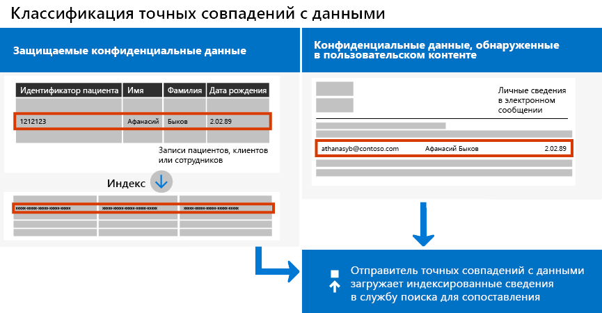
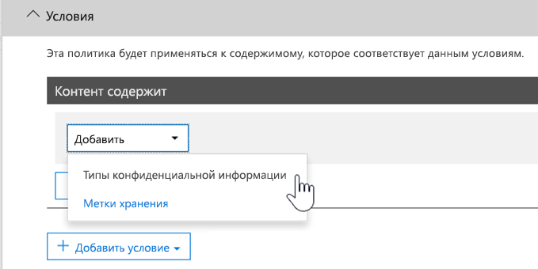

# <a name="create-custom-sensitive-information-types-with-exact-data-match-based-classification"></a><span data-ttu-id="9e87f-103">Создание пользовательских типов конфиденциальной информации с помощью классификации на основе точного совпадения данных</span><span class="sxs-lookup"><span data-stu-id="9e87f-103">See Create a custom sensitive information type with Exact Data Match based classification (Preview).</span></span>

## <a name="overview"></a><span data-ttu-id="9e87f-104">Обзор</span><span class="sxs-lookup"><span data-stu-id="9e87f-104">Overview</span></span>

<span data-ttu-id="9e87f-105">
  [Пользовательские типы конфиденциальной информации](https://docs.microsoft.com/ru-RU/office365/securitycompliance/custom-sensitive-info-types) используются для предотвращения непреднамеренного или неприемлемого предоставления общего доступа к конфиденциальной информации.</span><span class="sxs-lookup"><span data-stu-id="9e87f-105">[Custom sensitive information types](https://docs.microsoft.com/en-us/office365/securitycompliance/custom-sensitive-info-types) are used to help prevent inadvertent or inappropriate sharing of sensitive information.</span></span> <span data-ttu-id="9e87f-106">Администратор может использовать  [Центр безопасности и соответствия требованиям](https://docs.microsoft.com/ru-RU/office365/securitycompliance/create-a-custom-sensitive-information-type) или [PowerShell](https://docs.microsoft.com/ru-RU/office365/securitycompliance/create-a-custom-sensitive-information-type-in-scc-powershell), чтобы определить пользовательский тип конфиденциальной информации на основе шаблонов, признаков (ключевых слов, например *сотрудник*, *эмблема*, *идентификатор* и т. д), расстояния между символами (как близко располагается признак к символам в определенном шаблоне) и доверительных уровней.</span><span class="sxs-lookup"><span data-stu-id="9e87f-106">As an administrator, you can use the [Security & Compliance Center](https://docs.microsoft.com/en-us/office365/securitycompliance/create-a-custom-sensitive-information-type) or [PowerShell](https://docs.microsoft.com/en-us/office365/securitycompliance/create-a-custom-sensitive-information-type-in-scc-powershell) to define a custom sensitive information type based on patterns, evidence (keywords such as *employee*, *badge*, *ID*, and so on), character proximity (how close evidence is to characters in a particular pattern), and confidence levels.</span></span> <span data-ttu-id="9e87f-107">Такие пользовательские типы конфиденциальной информации соответствуют бизнес-требованиям большинства организаций.</span><span class="sxs-lookup"><span data-stu-id="9e87f-107">Such custom sensitive information types meet business needs for many organizations.</span></span>

<span data-ttu-id="9e87f-108">Но что если вам нужен пользовательский тип конфиденциальной информации для сопоставления с точными значениями данных, а не универсальными шаблонами?</span><span class="sxs-lookup"><span data-stu-id="9e87f-108">But what if you wanted a custom sensitive information type that uses exact data values, instead of matching only with generic patterns?</span></span> <span data-ttu-id="9e87f-109">С помощью классификации на основе точного совпадения данных (EDM) вы можете создать пользовательский тип конфиденциальной информации с такими характеристиками:</span><span class="sxs-lookup"><span data-stu-id="9e87f-109">With Exact Data Match (EDM)-based classification, you can create a custom sensitive information type that is designed to:</span></span>

- <span data-ttu-id="9e87f-110">динамичный и обновляемый;</span><span class="sxs-lookup"><span data-stu-id="9e87f-110">be dynamic and refreshable;</span></span>
- <span data-ttu-id="9e87f-111">дополнительные возможности масштабирования;</span><span class="sxs-lookup"><span data-stu-id="9e87f-111">be more scalable;</span></span>
- <span data-ttu-id="9e87f-112">снижает число ошибочно положительных результатов;</span><span class="sxs-lookup"><span data-stu-id="9e87f-112">result in fewer false-positives;</span></span>
- <span data-ttu-id="9e87f-113">поддерживает структурированные конфиденциальные данные;</span><span class="sxs-lookup"><span data-stu-id="9e87f-113">work with structured sensitive data;</span></span>
- <span data-ttu-id="9e87f-114">более безопасная обработка конфиденциальной информации;</span><span class="sxs-lookup"><span data-stu-id="9e87f-114">handle sensitive information more securely; and</span></span>
- <span data-ttu-id="9e87f-115">использование с несколькими облачными службами Майкрософт.</span><span class="sxs-lookup"><span data-stu-id="9e87f-115">be used with several Microsoft cloud services.</span></span>



<span data-ttu-id="9e87f-117">Классификация на основе EDM позволяет создавать пользовательские типы конфиденциальной информации, ссылающиеся на точные значения в базе данных конфиденциальной информации.</span><span class="sxs-lookup"><span data-stu-id="9e87f-117">EDM-based classification enables you to create custom sensitive information types that refer to exact values in a database of sensitive information.</span></span> <span data-ttu-id="9e87f-118">Базу данных можно обновлять ежедневно или еженедельно, и она может содержать до 10 миллионов строк данных.</span><span class="sxs-lookup"><span data-stu-id="9e87f-118">The database can be refreshed daily or weekly, and it can contain up to 10 million rows of data.</span></span> <span data-ttu-id="9e87f-119">Таким образом, ваши пользовательские типы конфиденциальной информации остаются актуальными и применимыми при смене сотрудников, пациентов или клиентов, а также при изменении записей.</span><span class="sxs-lookup"><span data-stu-id="9e87f-119">So as employees, patients, or clients come and go, and records change, your custom sensitive information types remain current and applicable.</span></span> <span data-ttu-id="9e87f-120">Вы также можете использовать классификацию на основе EDM с политиками, такими как [политики защиты от потери данных](https://docs.microsoft.com/ru-RU/office365/securitycompliance/data-loss-prevention-policies) (DLP) или [политики файлов Microsoft Cloud App Security](https://docs.microsoft.com/cloud-app-security/data-protection-policies).</span><span class="sxs-lookup"><span data-stu-id="9e87f-120">And, you can use EDM-based classification with policies, such as [data loss prevention policies](https://docs.microsoft.com/en-us/office365/securitycompliance/data-loss-prevention-policies) (DLP) or [Microsoft Cloud App Security file policies](https://docs.microsoft.com/cloud-app-security/data-protection-policies).</span></span>

## <a name="required-licenses-and-permissions"></a><span data-ttu-id="9e87f-121">Обязательные лицензии и разрешения</span><span class="sxs-lookup"><span data-stu-id="9e87f-121">Required licenses and permissions</span></span>

<span data-ttu-id="9e87f-122">Для выполнения задач, описанных в данной статье, вы должны быть глобальным администратором, администратором соответствия требованиям или администратором Exchange Online.</span><span class="sxs-lookup"><span data-stu-id="9e87f-122">You must be a global admin, compliance administrator, or Exchange Online administrator to perform the tasks described in this article.</span></span> <span data-ttu-id="9e87f-123">Дополнительные сведения о разрешениях DLP см. в разделе [Разрешения](https://docs.microsoft.com/ru-RU/office365/securitycompliance/data-loss-prevention-policies#permissions).</span><span class="sxs-lookup"><span data-stu-id="9e87f-123">To learn more about DLP permissions, see [Permissions](https://docs.microsoft.com/en-us/office365/securitycompliance/data-loss-prevention-policies#permissions).</span></span>

<span data-ttu-id="9e87f-124">После выпуска общедоступной версии классификация на основе EDM будет включена в перечисленные ниже подписки.</span><span class="sxs-lookup"><span data-stu-id="9e87f-124">When generally available, EDM-based classification will be included in these subscriptions</span></span>

- <span data-ttu-id="9e87f-125">Office 365 E5</span><span class="sxs-lookup"><span data-stu-id="9e87f-125">Office 365 Enterprise E5</span></span>
- <span data-ttu-id="9e87f-126">Microsoft 365 E5</span><span class="sxs-lookup"><span data-stu-id="9e87f-126">Microsoft 365 E5</span></span>
- <span data-ttu-id="9e87f-127">Защита данных и соответствие требованиям Microsoft 365</span><span class="sxs-lookup"><span data-stu-id="9e87f-127">Microsoft 365 Information Protection and Compliance</span></span>
- <span data-ttu-id="9e87f-128">Office 365 Advanced Compliance</span><span class="sxs-lookup"><span data-stu-id="9e87f-128">Office 365 Advanced Compliance</span></span>

## <a name="the-work-flow-at-a-glance"></a><span data-ttu-id="9e87f-129">Обзор рабочего процесса</span><span class="sxs-lookup"><span data-stu-id="9e87f-129">The work flow at a glance</span></span>

|<span data-ttu-id="9e87f-130">Этап</span><span class="sxs-lookup"><span data-stu-id="9e87f-130">Phase</span></span>  |<span data-ttu-id="9e87f-131">Требуемые параметры</span><span class="sxs-lookup"><span data-stu-id="9e87f-131">What's needed</span></span>  |
|---------|---------|
|[<span data-ttu-id="9e87f-132">Часть 1. Настройка классификации на основе EDM</span><span class="sxs-lookup"><span data-stu-id="9e87f-132">Part 1: Set up EDM-based classification</span></span>](#part-1-set-up-edm-based-classification)<br/><br/><span data-ttu-id="9e87f-133">(При необходимости)</span><span class="sxs-lookup"><span data-stu-id="9e87f-133">(As needed)</span></span><br/><span data-ttu-id="9e87f-134">- [Изменение схемы базы данных](#editing-the-schema-for-edm-based-classification)</span><span class="sxs-lookup"><span data-stu-id="9e87f-134">- [Edit the database schema](#editing-the-schema-for-edm-based-classification)</span></span> <br/><span data-ttu-id="9e87f-135">- [Удаление схемы](#removing-the-schema-for-edm-based-classification)</span><span class="sxs-lookup"><span data-stu-id="9e87f-135">- [Remove the schema](#removing-the-schema-for-edm-based-classification)</span></span> |<span data-ttu-id="9e87f-136">– Доступ для чтения конфиденциальных данных</span><span class="sxs-lookup"><span data-stu-id="9e87f-136">- Read access to the sensitive data</span></span><br/><span data-ttu-id="9e87f-137">– Схема базы данных в формате XML (доступен пример)</span><span class="sxs-lookup"><span data-stu-id="9e87f-137">- Database schema in .xml format (example provided)</span></span><br/><span data-ttu-id="9e87f-138">– Пакет правил в формате XML (доступен пример)</span><span class="sxs-lookup"><span data-stu-id="9e87f-138">- Rule package in .xml format (example provided)</span></span><br/><span data-ttu-id="9e87f-139">– Разрешения администратора на доступ к Центру безопасности и соответствия требованиям (с помощью PowerShell)</span><span class="sxs-lookup"><span data-stu-id="9e87f-139">- Admin permissions to the Security & Compliance Center (using PowerShell)</span></span> |
|[<span data-ttu-id="9e87f-140">Часть 2. Индексация и отправка конфиденциальных данных</span><span class="sxs-lookup"><span data-stu-id="9e87f-140">Part 2: Index and upload the sensitive data</span></span>](#part-2-index-and-upload-the-sensitive-data)<br/><br/><span data-ttu-id="9e87f-141">(При необходимости)</span><span class="sxs-lookup"><span data-stu-id="9e87f-141">(As needed)</span></span><br/>[<span data-ttu-id="9e87f-142">Обновление данных</span><span class="sxs-lookup"><span data-stu-id="9e87f-142">Refresh the data</span></span>](#refreshing-your-sensitive-information-database) |<span data-ttu-id="9e87f-143">– Настраиваемая группа безопасности и учетная запись пользователя</span><span class="sxs-lookup"><span data-stu-id="9e87f-143">- Custom security group and user account</span></span><br/><span data-ttu-id="9e87f-144">– Доступ локального администратора к компьютеру с агентом отправки EDM</span><span class="sxs-lookup"><span data-stu-id="9e87f-144">- Local admin access to machine with EDM Upload Agent</span></span><br/><span data-ttu-id="9e87f-145">– Доступ для чтения конфиденциальных данных</span><span class="sxs-lookup"><span data-stu-id="9e87f-145">- Read access to the sensitive data</span></span><br/><span data-ttu-id="9e87f-146">– Процесс и расписание для обновления данных</span><span class="sxs-lookup"><span data-stu-id="9e87f-146">- Process and schedule for refreshing the data</span></span>|
|[<span data-ttu-id="9e87f-147">Часть 3. Использование классификации на основе EDM с помощью облачных служб Майкрософт</span><span class="sxs-lookup"><span data-stu-id="9e87f-147">Part 3: Use EDM-based classification with your Microsoft cloud services</span></span>](#part-3-use-edm-based-classification-with-your-microsoft-cloud-services) |<span data-ttu-id="9e87f-148">– Подписка на Office 365 с защитой от потери данных</span><span class="sxs-lookup"><span data-stu-id="9e87f-148">- Office 365 subscription with DLP</span></span><br/><span data-ttu-id="9e87f-149">– Включенная функция классификации на основе EDM</span><span class="sxs-lookup"><span data-stu-id="9e87f-149">- EDM-based classification feature enabled</span></span> |

### <a name="part-1-set-up-edm-based-classification"></a><span data-ttu-id="9e87f-150">Часть 1. Настройка классификации на основе EDM</span><span class="sxs-lookup"><span data-stu-id="9e87f-150">Part 1: Set up EDM-based classification</span></span>

<span data-ttu-id="9e87f-151">Установка и настройка классификации на основе EDM включает сохранение конфиденциальных данных в формате CSV, определение схемы для базы данных конфиденциальной информации и создание пакета правил с последующей отправкой схемы и пакета правил.</span><span class="sxs-lookup"><span data-stu-id="9e87f-151">Setting up and configuring EDM-based classification involves saving sensitive data in .csv format, defining a schema for your database of sensitive information, creating a rule package, and then uploading the schema and rule package.</span></span>

#### <a name="define-the-schema-for-your-database-of-sensitive-information"></a><span data-ttu-id="9e87f-152">Определение схемы для базы данных конфиденциальной информации</span><span class="sxs-lookup"><span data-stu-id="9e87f-152">Define the schema for your database of sensitive information</span></span>

1. <span data-ttu-id="9e87f-153">Определите конфиденциальную информацию, которую нужно использовать.</span><span class="sxs-lookup"><span data-stu-id="9e87f-153">Identify the KPIs that you want to use.</span></span> <span data-ttu-id="9e87f-154">Экспортируйте данные в приложение, например Microsoft Excel, и сохраните файл в формате CSV.</span><span class="sxs-lookup"><span data-stu-id="9e87f-154">Export the data to an app, such as Microsoft Excel, and save the file in .csv format.</span></span> <span data-ttu-id="9e87f-155">Файл данных может содержать:</span><span class="sxs-lookup"><span data-stu-id="9e87f-155">The data file can include a maximum of:</span></span>
      - <span data-ttu-id="9e87f-156">до 10 миллионов строк конфиденциальных данных;</span><span class="sxs-lookup"><span data-stu-id="9e87f-156">Up to 10 million rows of sensitive data</span></span>
      - <span data-ttu-id="9e87f-157">до 32 столбцов (полей) на источник данных;</span><span class="sxs-lookup"><span data-stu-id="9e87f-157">Up to 32 columns (fields) per data source</span></span>
      - <span data-ttu-id="9e87f-158">до 5 столбцов (полей), отмеченных как доступные для поиска.</span><span class="sxs-lookup"><span data-stu-id="9e87f-158">Up to 5 columns (fields) marked as searchable</span></span>

2. <span data-ttu-id="9e87f-159">Структурируйте конфиденциальные данные в CSV-файле таким образом, чтобы первая строка включала имена полей, которые используются для классификации на основе EDM.</span><span class="sxs-lookup"><span data-stu-id="9e87f-159">Structure the sensitive data in the .csv file such that the first row includes the names of the fields used for EDM-based classification.</span></span> <span data-ttu-id="9e87f-160">В CSV-файле можно применять такие имена полей, как ssn, birthdate, firstname, lastname и т. д.</span><span class="sxs-lookup"><span data-stu-id="9e87f-160">In your .csv file, you might have field names, such as "ssn", "birthdate", "firstname", "lastname", and so on.</span></span> <span data-ttu-id="9e87f-161">Например, наш CSV-файл называется  *PatientRecords.csv*, а его столбцы включают *PatientID*, *MRN*, *LastName*, *FirstName*, *SSN* и другие.</span><span class="sxs-lookup"><span data-stu-id="9e87f-161">As an example, our .csv file is called *PatientRecords.csv*, and its columns include *PatientID*, *MRN*, *LastName*, *FirstName*, *SSN* and more.</span></span>

3. <span data-ttu-id="9e87f-162">Определите схему для базы данных конфиденциальной информации в формате XML (как в приведенном ниже примере).</span><span class="sxs-lookup"><span data-stu-id="9e87f-162">Define the schema for the database of sensitive information in .xml format (similar to our example below).</span></span> <span data-ttu-id="9e87f-163">Назовите этот файл схемы edm.xml и настройте его таким образом, чтобы для каждого столбца в базе данных имелась строка на основе синтаксиса \<Field name="" searchable=""/\>.</span><span class="sxs-lookup"><span data-stu-id="9e87f-163">Name this schema file edm.xml, and configure it such that for each column in the database, there is a line that uses the syntax \<Field name="" searchable=""/\>.</span></span>

      - <span data-ttu-id="9e87f-164">Используйте имена столбцов для значений *Field name* .</span><span class="sxs-lookup"><span data-stu-id="9e87f-164">Use column names for *Field name* values.</span></span>
      - <span data-ttu-id="9e87f-165">Используйте параметр *searchable="true"* для 5 полей, которые должны поддерживать поиск.</span><span class="sxs-lookup"><span data-stu-id="9e87f-165">Use *searchable="true"* for the fields that you want to be searchable up to a maximum of 5 fields.</span></span> <span data-ttu-id="9e87f-166">Поиск должно поддерживать хотя бы одно поле.</span><span class="sxs-lookup"><span data-stu-id="9e87f-166">You must designate a minimum of one field as searchable.</span></span>

<span data-ttu-id="9e87f-167">Например, в приведенном ниже XML-файле определяется схема для базы данных записей пациентов с пятью полями, поддерживающими поиск: *PatientID*, *MRN*, *SSN*, *Phone* и *DOB*.</span><span class="sxs-lookup"><span data-stu-id="9e87f-167">As an example, the following .xml file defines the schema for a patient records database, with five fields specified as searchable: *PatientID*, *MRN*, *SSN*, *Phone*, and *DOB*.</span></span>

<span data-ttu-id="9e87f-168">(Вы можете скопировать, изменить и использовать наш пример.)</span><span class="sxs-lookup"><span data-stu-id="9e87f-168">(You can copy, modify, and use our example.)</span></span>

 ```xml
<EdmSchema xmlns="http://schemas.microsoft.com/office/2018/edm">
      <DataStore name="PatientRecords" description="Schema for patient records" version="1">
            <Field name="PatientID" searchable="true" />
            <Field name="MRN" searchable="true" />
            <Field name="FirstName" />
            <Field name="LastName" />
            <Field name="SSN" searchable="true" />
            <Field name="Phone" searchable="true" />
            <Field name="DOB" searchable="true" />
            <Field name="Gender" />
            <Field name="Address" />
      </DataStore>
</EdmSchema>
```

4. <span data-ttu-id="9e87f-169">[Подключитесь к PowerShell Центра безопасности и соответствия требованиям Office 365](https://docs.microsoft.com/powershell/exchange/office-365-scc/connect-to-scc-powershell/connect-to-scc-powershell?view=exchange-ps).</span><span class="sxs-lookup"><span data-stu-id="9e87f-169">[Connect to Office 365 Security & Compliance Center PowerShell](https://docs.microsoft.com/powershell/exchange/office-365-scc/connect-to-scc-powershell/connect-to-scc-powershell?view=exchange-ps)</span></span>

5. <span data-ttu-id="9e87f-170">Чтобы добавить схему базы данных, выполните по отдельности указанные ниже командлеты.</span><span class="sxs-lookup"><span data-stu-id="9e87f-170">To upload the database schema, run the following cmdlets, one at a time:</span></span>

```powershell
$edmSchemaXml=Get-Content .\\edm.xml -Encoding Byte -ReadCount 0
New-DlpEdmSchema -FileData $edmSchemaXml -Confirm:$true
```

<span data-ttu-id="9e87f-171">Появится запрос на подтверждение, показанный ниже.</span><span class="sxs-lookup"><span data-stu-id="9e87f-171">You will be prompted to confirm, as follows:</span></span>

> <span data-ttu-id="9e87f-172">Подтверждение</span><span class="sxs-lookup"><span data-stu-id="9e87f-172">Confirm</span></span>
>
> <span data-ttu-id="9e87f-173">Вы действительно хотите выполнить это действие?</span><span class="sxs-lookup"><span data-stu-id="9e87f-173">At the question Are you sure you want to perform this action?, type Y to import the app.</span></span>
>
> <span data-ttu-id="9e87f-174">Будет импортирована новая схема модели EDM для хранилища данных "patientrecords".</span><span class="sxs-lookup"><span data-stu-id="9e87f-174">New EDM Schema for the data store 'patientrecords' will be imported.</span></span>
>
> <span data-ttu-id="9e87f-175">\[Y\] Да \[A\] Да для всех \[N\] Нет \[L\] Нет для всех \[?\] Справка (значение по умолчанию "Y"):</span><span class="sxs-lookup"><span data-stu-id="9e87f-175">\[Y\] Yes \[A\] Yes to All \[N\] No \[L\] No to All \[?\] Help (default is "Y"):</span></span>

> [!TIP]
> <span data-ttu-id="9e87f-176">Чтобы изменения вносились без запроса подтверждения, используйте вместо указанного в действии 5 командлета следующий: New-DlpEdmSchema -FileData $edmSchemaXml</span><span class="sxs-lookup"><span data-stu-id="9e87f-176">If you want your changes to occur without confirmation, in Step 5, use this cmdlet instead: New-DlpEdmSchema -FileData $edmSchemaXml</span></span>

> [!NOTE]
> <span data-ttu-id="9e87f-177">Обновление EDMSchema с дополнениями может занять от 10 до 60 минут.</span><span class="sxs-lookup"><span data-stu-id="9e87f-177">It can take between 10-60 minutes to update the EDMSchema with additions.</span></span> <span data-ttu-id="9e87f-178">Перед выполнением действий, в которых используется дополнение, необходимо выполнить обновление.</span><span class="sxs-lookup"><span data-stu-id="9e87f-178">The update must complete before you execute steps that use the additions.</span></span>

<span data-ttu-id="9e87f-179">Теперь, когда схема базы данных конфиденциальной информации определена, нужно настроить пакет правил.</span><span class="sxs-lookup"><span data-stu-id="9e87f-179">Now that the schema for your database of sensitive information is defined, the next step is to set up a rule package.</span></span> <span data-ttu-id="9e87f-180">Перейдите к разделу [Настройка пакета правил](#set-up-a-rule-package).</span><span class="sxs-lookup"><span data-stu-id="9e87f-180">Proceed to the section [Set up a rule package](#set-up-a-rule-package).</span></span>

#### <a name="editing-the-schema-for-edm-based-classification"></a><span data-ttu-id="9e87f-181">Редактирование схемы для классификации на основе EDM</span><span class="sxs-lookup"><span data-stu-id="9e87f-181">Editing the schema for EDM-based classification</span></span>

<span data-ttu-id="9e87f-182">Если нужно внести изменения в файл edm.xml, например изменить поля, используемые для классификации на основе EDM, выполните указанные ниже действия.</span><span class="sxs-lookup"><span data-stu-id="9e87f-182">If you want to make changes to your edm.xml file, such as changing which fields are used for EDM-based classification, follow these steps:</span></span>

1. <span data-ttu-id="9e87f-183">Внесите изменения в файл edm.mxl (он рассматривается в разделе [Определение схемы](#define-the-schema-for-your-database-of-sensitive-information) этой статьи).</span><span class="sxs-lookup"><span data-stu-id="9e87f-183">Edit your edm.xml file (this is the file discussed in the [Define the schema](#define-the-schema-for-your-database-of-sensitive-information) section of this article).</span></span>

2. <span data-ttu-id="9e87f-184">[Подключитесь к PowerShell для Центра безопасности и соответствия требованиям Office 365](https://docs.microsoft.com/powershell/exchange/office-365-scc/connect-to-scc-powershell/connect-to-scc-powershell?view=exchange-ps).</span><span class="sxs-lookup"><span data-stu-id="9e87f-184">[Connect to Office 365 Security & Compliance Center PowerShell](https://docs.microsoft.com/powershell/exchange/office-365-scc/connect-to-scc-powershell/connect-to-scc-powershell?view=exchange-ps)</span></span>

3. <span data-ttu-id="9e87f-185">Чтобы обновить схему базы данных, выполните по отдельности указанные ниже командлеты.</span><span class="sxs-lookup"><span data-stu-id="9e87f-185">To update your database schema, run the following cmdlets, one at a time:</span></span>

```powershell
$edmSchemaXml=Get-Content .\\edm.xml -Encoding Byte -ReadCount 0
Set-DlpEdmSchema -FileData $edmSchemaXml -Confirm:$true
```

<span data-ttu-id="9e87f-186">Появится запрос на подтверждение, показанный ниже.</span><span class="sxs-lookup"><span data-stu-id="9e87f-186">You will be prompted to confirm, as follows:</span></span>

> <span data-ttu-id="9e87f-187">Подтверждение</span><span class="sxs-lookup"><span data-stu-id="9e87f-187">Confirm</span></span>
>
> <span data-ttu-id="9e87f-188">Вы действительно хотите выполнить это действие?</span><span class="sxs-lookup"><span data-stu-id="9e87f-188">At the question Are you sure you want to perform this action?, type Y to import the app.</span></span>
>
> <span data-ttu-id="9e87f-189">Схема модели EDM для хранилища данных "patientrecords" будет обновлена.</span><span class="sxs-lookup"><span data-stu-id="9e87f-189">EDM Schema for the data store 'patientrecords' will be updated.</span></span>
>
> <span data-ttu-id="9e87f-190">\[Y\] Да \[A\] Да для всех \[N\] Нет \[L\] Нет для всех \[?\] Справка (значение по умолчанию "Y"):</span><span class="sxs-lookup"><span data-stu-id="9e87f-190">\[Y\] Yes \[A\] Yes to All \[N\] No \[L\] No to All \[?\] Help (default is "Y"):</span></span>

> [!TIP]
> <span data-ttu-id="9e87f-191">Чтобы изменения вносились без запроса подтверждения, используйте вместо указанного в действии 3 командлета следующий: Set-DlpEdmSchema -FileData $edmSchemaXml</span><span class="sxs-lookup"><span data-stu-id="9e87f-191">If you want your changes to occur without confirmation, in Step 3, use this cmdlet instead: Set-DlpEdmSchema -FileData $edmSchemaXml</span></span>

> [!NOTE]
> <span data-ttu-id="9e87f-192">Обновление EDMSchema с дополнениями может занять от 10 до 60 минут.</span><span class="sxs-lookup"><span data-stu-id="9e87f-192">It can take between 10-60 minutes to update the EDMSchema with additions.</span></span> <span data-ttu-id="9e87f-193">Перед выполнением действий, в которых используется дополнение, необходимо выполнить обновление.</span><span class="sxs-lookup"><span data-stu-id="9e87f-193">The update must complete before you execute steps that use the additions.</span></span>

## <a name="removing-the-schema-for-edm-based-classification"></a><span data-ttu-id="9e87f-194">Удаление схемы для классификации на основе EDM</span><span class="sxs-lookup"><span data-stu-id="9e87f-194">Removing the schema for EDM-based classification</span></span>

<span data-ttu-id="9e87f-195">(При необходимости) Чтобы удалить схему, используемую для классификации на основе EDM, выполните указанные ниже действия.</span><span class="sxs-lookup"><span data-stu-id="9e87f-195">(As needed) If you want to remove the schema you're using for EDM-based classification, follow these steps:</span></span>

1. <span data-ttu-id="9e87f-196">[Подключитесь к PowerShell для Центра безопасности и соответствия требованиям Office 365](https://docs.microsoft.com/powershell/exchange/office-365-scc/connect-to-scc-powershell/connect-to-scc-powershell?view=exchange-ps).</span><span class="sxs-lookup"><span data-stu-id="9e87f-196">[Connect to Office 365 Security & Compliance Center PowerShell](https://docs.microsoft.com/powershell/exchange/office-365-scc/connect-to-scc-powershell/connect-to-scc-powershell?view=exchange-ps)</span></span>

2. <span data-ttu-id="9e87f-197">Выполните приведенные ниже командлеты PowerShell, заменив имя хранилища данных "patientrecords" на имя удаляемого хранилища.</span><span class="sxs-lookup"><span data-stu-id="9e87f-197">Run the following PowerShell cmdlets, substituting the data store name of "patientrecords" with the one you want to remove:</span></span>

```powershell
Remove-DlpEdmSchema -Identity patientrecords
```

<span data-ttu-id="9e87f-198">Появится запрос на подтверждение, показанный ниже.</span><span class="sxs-lookup"><span data-stu-id="9e87f-198">You will be prompted to confirm, as follows:</span></span>

> <span data-ttu-id="9e87f-199">Подтверждение</span><span class="sxs-lookup"><span data-stu-id="9e87f-199">Confirm</span></span>
>
> <span data-ttu-id="9e87f-200">Вы действительно хотите выполнить это действие?</span><span class="sxs-lookup"><span data-stu-id="9e87f-200">At the question Are you sure you want to perform this action?, type Y to import the app.</span></span>
>
> <span data-ttu-id="9e87f-201">Схема модели EDM для хранилища данных "patientrecords" будет удалена.</span><span class="sxs-lookup"><span data-stu-id="9e87f-201">EDM Schema for the data store 'patientrecords' will be removed.</span></span>
>
> <span data-ttu-id="9e87f-202">\[Y\] Да \[A\] Да для всех \[N\] Нет \[L\] Нет для всех \[?\] Справка (значение по умолчанию "Y"):</span><span class="sxs-lookup"><span data-stu-id="9e87f-202">\[Y\] Yes \[A\] Yes to All \[N\] No \[L\] No to All \[?\] Help (default is "Y"):</span></span>

> [!TIP]
>  <span data-ttu-id="9e87f-203">Чтобы изменения вносились без запроса подтверждения, используйте вместо указанного в действии 2 командлета следующий: Remove-DlpEdmSchema -Identity patientrecords -Confirm:$false</span><span class="sxs-lookup"><span data-stu-id="9e87f-203">If you want your changes to occur without confirmation, in Step 2, use this cmdlet instead: Remove-DlpEdmSchema -Identity patientrecords -Confirm:$false</span></span>

### <a name="set-up-a-rule-package"></a><span data-ttu-id="9e87f-204">Настройка пакета правил</span><span class="sxs-lookup"><span data-stu-id="9e87f-204">Set up a rule package</span></span>

1. <span data-ttu-id="9e87f-205">Создайте пакет правил в формате XML (в кодировке Unicode), как показано в примере ниже.</span><span class="sxs-lookup"><span data-stu-id="9e87f-205">Create a rule package in .xml format (with Unicode encoding), similar to the following example.</span></span> <span data-ttu-id="9e87f-206">(Вы можете скопировать, изменить и использовать наш пример.)</span><span class="sxs-lookup"><span data-stu-id="9e87f-206">(You can copy, modify, and use our example.)</span></span>

<span data-ttu-id="9e87f-207">Настраивая пакет правил, убедитесь, что в нем используются правильные ссылки на CSV-файл и файл edm.xml.</span><span class="sxs-lookup"><span data-stu-id="9e87f-207">When you set up your rule package, make sure to correctly reference your .csv file and edm.xml file.</span></span> <span data-ttu-id="9e87f-208">Вы можете скопировать, изменить и использовать наш пример.</span><span class="sxs-lookup"><span data-stu-id="9e87f-208">You can copy, modify, and use our example.</span></span> <span data-ttu-id="9e87f-209">В этом примере XML для создания типа конфиденциальной информации EDM должны быть настроены перечисленные ниже поля.</span><span class="sxs-lookup"><span data-stu-id="9e87f-209">In this sample xml the following fields needs to be customized to create your EDM sensitive type:</span></span>

- <span data-ttu-id="9e87f-210">
  \*\*Идентификаторы RulePack и ExactMatch\*\*. Используйте командлет [New-GUID](https://docs.microsoft.com/ru-RU/powershell/module/microsoft.powershell.utility/new-guid?view=powershell-6) для создания GUID.</span><span class="sxs-lookup"><span data-stu-id="9e87f-210">**RulePack id & ExactMatch id**: Use [New-GUID](https://docs.microsoft.com/en-us/powershell/module/microsoft.powershell.utility/new-guid?view=powershell-6) to generate a GUID.</span></span>

- <span data-ttu-id="9e87f-211">**Datastore**. В этом поле указывается, какое хранилище данных подстановки EDM будет использоваться.</span><span class="sxs-lookup"><span data-stu-id="9e87f-211">**Datastore**: This field specifies EDM lookup data store to be used.</span></span> <span data-ttu-id="9e87f-212">Вы указываете имя источника данных для настроенной схемы EDM.</span><span class="sxs-lookup"><span data-stu-id="9e87f-212">You provide a data source name of a configured EDM Schema.</span></span>

- <span data-ttu-id="9e87f-213">**idMatch**. Это поле указывает на основной элемент EDM.</span><span class="sxs-lookup"><span data-stu-id="9e87f-213">**idMatch**: This field points to the primary element for EDM.</span></span>
  - <span data-ttu-id="9e87f-214">Matches. Указывает поле, которое будет использоваться при точном поиске.</span><span class="sxs-lookup"><span data-stu-id="9e87f-214">Matches: Specifies the field to be used in exact lookup.</span></span> <span data-ttu-id="9e87f-215">Вы указываете имя поля для поиска в схеме EDM для DataStore.</span><span class="sxs-lookup"><span data-stu-id="9e87f-215">You provide a searchable field name in EDM Schema for the DataStore.</span></span>
  - <span data-ttu-id="9e87f-216">Classification. В этом поле указывается соответствие типа конфиденциальной информации, которое активирует поиск EDM.</span><span class="sxs-lookup"><span data-stu-id="9e87f-216">Classification: This field specifies the sensitive type match that triggers EDM lookup.</span></span> <span data-ttu-id="9e87f-217">Вы можете указать имя или идентификатор GUID имеющейся встроенной или настраиваемой классификации.</span><span class="sxs-lookup"><span data-stu-id="9e87f-217">You can provide Name or GUID of an existing built-in or custom classification.</span></span>

- <span data-ttu-id="9e87f-218">**Match**. В этом поле указываются дополнительные свидетельства, находящиеся близко к idMatch.</span><span class="sxs-lookup"><span data-stu-id="9e87f-218">**Match:** This field points to additional evidence found in proximity of idMatch.</span></span>
  - <span data-ttu-id="9e87f-219">Matches. Вы указываете имя поля для поиска в схеме EDM для DataStore.</span><span class="sxs-lookup"><span data-stu-id="9e87f-219">Matches: You provide any field name in EDM Schema for DataStore.</span></span>
- <span data-ttu-id="9e87f-220">**Resource**. В этом разделе указываются имя и описание типа конфиденциальной информации в нескольких языковых средах.</span><span class="sxs-lookup"><span data-stu-id="9e87f-220">**Resource:** This section specifies the name and description for sensitive type in multiple locales.</span></span>
  - <span data-ttu-id="9e87f-221">idRef. Укажите GUID для идентификатора ExactMatch.</span><span class="sxs-lookup"><span data-stu-id="9e87f-221">idRef: You provide GUID for ExactMatch id.</span></span>
  - <span data-ttu-id="9e87f-222">Редактирование имени и описания схемы: меняйте их по мере необходимости.</span><span class="sxs-lookup"><span data-stu-id="9e87f-222">Name & des Editing the schema criptions: customize as required.</span></span>

```xml
<RulePackage xmlns="http://schemas.microsoft.com/office/2018/edm">
  <RulePack id="fd098e03-1796-41a5-8ab6-198c93c62b11">
    <Version build="0" major="2" minor="0" revision="0" />
    <Publisher id="eb553734-8306-44b4-9ad5-c388ad970528" />
    <Details defaultLangCode="en-us">
      <LocalizedDetails langcode="en-us">
        <PublisherName>IP DLP</PublisherName>
        <Name>Health Care EDM Rulepack</Name>
        <Description>This rule package contains the EDM sensitive type for health care sensitive types.</Description>
      </LocalizedDetails>
    </Details>
  </RulePack>
  <Rules>
    <ExactMatch id = "E1CC861E-3FE9-4A58-82DF-4BD259EAB371" patternsProximity = "300" dataStore ="PatientRecords" recommendedConfidence = "65" >
      <Pattern confidenceLevel="65">
        <idMatch matches = "SSN" classification = "U.S. Social Security Number (SSN)" />
      </Pattern>
      <Pattern confidenceLevel="75">
        <idMatch matches = "SSN" classification = "U.S. Social Security Number (SSN)" />
        <Any minMatches ="3" maxMatches ="100">
          <match matches="PatientID" />
          <match matches="MRN"/>
          <match matches="FirstName"/>
          <match matches="LastName"/>
          <match matches="Phone"/>
          <match matches="DOB"/>
        </Any>
      </Pattern>
    </ExactMatch>
    <LocalizedStrings>
      <Resource idRef="E1CC861E-3FE9-4A58-82DF-4BD259EAB371">
        <Name default="true" langcode="en-us">Patient SSN Exact Match.</Name>
        <Description default="true" langcode="en-us">EDM Sensitive type for detecting Patient SSN.</Description>
      </Resource>
    </LocalizedStrings>
  </Rules>
</RulePackage>
```

1. <span data-ttu-id="9e87f-223">Отправьте пакет правил, выполнив по отдельности указанные ниже командлеты PowerShell.</span><span class="sxs-lookup"><span data-stu-id="9e87f-223">Upload the rule package by running the following PowerShell cmdlets, one at a time:</span></span>

```powershell
$rulepack=Get-Content .\\rulepack.xml -Encoding Byte -ReadCount 0
New-DlpSensitiveInformationTypeRulePackage -FileData $rulepack
```

<span data-ttu-id="9e87f-224">На этом этапе вы настроили классификацию на основе EDM.</span><span class="sxs-lookup"><span data-stu-id="9e87f-224">At this point, you have set up EDM-based classification.</span></span> <span data-ttu-id="9e87f-225">На следующем этапе необходимо индексировать конфиденциальные данные, а затем отправить их.</span><span class="sxs-lookup"><span data-stu-id="9e87f-225">The next step is to index the sensitive data, and then upload the indexed data.</span></span>

<span data-ttu-id="9e87f-226">Помните, что схема PatientRecords определяет пять полей как доступные для поиска:  *PatientID*,  *MRN*,  *SSN*,  *Phone* и  *DOB*.</span><span class="sxs-lookup"><span data-stu-id="9e87f-226">Recall from the previous procedure that our PatientRecords schema defines five fields as searchable: *PatientID*, *MRN*, *SSN*, *Phone*, and *DOB*.</span></span> <span data-ttu-id="9e87f-227">Наш пакет правил, созданный для примера, включает эти пять полей и ссылается на файл схемы базы данных (edm.xml), предусматривая один элемент *ExactMatch* для каждого доступного для поиска поля.</span><span class="sxs-lookup"><span data-stu-id="9e87f-227">Our example rule package includes those fields and references the database schema file (edm.xml), with one *ExactMatch* items per searchable field.</span></span> <span data-ttu-id="9e87f-228">Рассмотрим приведенный ниже элемент ExactMatch.</span><span class="sxs-lookup"><span data-stu-id="9e87f-228">Consider the following ExactMatch item:</span></span>

```xml
<ExactMatch id = "E1CC861E-3FE9-4A58-82DF-4BD259EAB371" patternsProximity = "300" dataStore ="PatientRecords" recommendedConfidence = "65" >
      <Pattern confidenceLevel="65">
        <idMatch matches = "SSN" classification = "U.S. Social Security Number (SSN)" />
      </Pattern>
      <Pattern confidenceLevel="75">
        <idMatch matches = "SSN" classification = "U.S. Social Security Number (SSN)" />
        <Any minMatches ="3" maxMatches ="100">
          <match matches="PatientID" />
          <match matches="MRN"/>
          <match matches="FirstName"/>
          <match matches="LastName"/>
          <match matches="Phone"/>
          <match matches="DOB"/>
        </Any>
      </Pattern>
    </ExactMatch>
```

<span data-ttu-id="9e87f-229">В этом примере обратите внимание на следующее:</span><span class="sxs-lookup"><span data-stu-id="9e87f-229">In connection with this point, note the following:</span></span>

- <span data-ttu-id="9e87f-230">Имя хранилища данных dataStore ссылается на ранее созданный файл CSV:  **dataStore = "PatientRecords"**.</span><span class="sxs-lookup"><span data-stu-id="9e87f-230">The dataStore name references the .csv file we created earlier: **dataStore = "PatientRecords"**.</span></span>

- <span data-ttu-id="9e87f-231">Значение idMatch ссылается на доступное для поиска поле, которое указано в файле схемы базы данных: **idMatch matches = "SSN"**.</span><span class="sxs-lookup"><span data-stu-id="9e87f-231">The idMatch value references a searchable field that is listed in the database schema file: **idMatch matches = "SSN"**.</span></span>

- <span data-ttu-id="9e87f-232">Значение классификации ссылается на существующий или пользовательский тип конфиденциальной информации:  **classification = "U.S. Social Security Number (SSN)"**.</span><span class="sxs-lookup"><span data-stu-id="9e87f-232">The classification value references an existing or custom sensitive information type: **classification = "U.S. Social Security Number (SSN)"**.</span></span> <span data-ttu-id="9e87f-233">(В этом случае используется существующий тип конфиденциальной информации, содержащий номер социального страхования США.)</span><span class="sxs-lookup"><span data-stu-id="9e87f-233">(In this case, we use the existing sensitive information type of U.S. Social Security Number.)</span></span>

> [!NOTE]
> <span data-ttu-id="9e87f-234">Обновление EDMSchema с дополнениями может занять от 10 до 60 минут.</span><span class="sxs-lookup"><span data-stu-id="9e87f-234">It can take between 10-60 minutes to update the EDMSchema with additions.</span></span> <span data-ttu-id="9e87f-235">Перед выполнением действий, в которых используется дополнение, необходимо выполнить обновление.</span><span class="sxs-lookup"><span data-stu-id="9e87f-235">The update must complete before you execute steps that use the additions.</span></span>

### <a name="part-2-index-and-upload-the-sensitive-data"></a><span data-ttu-id="9e87f-236">Часть 2. Индексирование и отправка конфиденциальных данных</span><span class="sxs-lookup"><span data-stu-id="9e87f-236">Part 2: Index and upload the sensitive data</span></span>

<span data-ttu-id="9e87f-237">На этом этапе выполняется настройка пользовательской группы безопасности и учетной записи пользователя, а также настройка агента отправки EDM.</span><span class="sxs-lookup"><span data-stu-id="9e87f-237">During this phase, you set up a custom security group and user account, and set up the EDM Upload Agent tool.</span></span> <span data-ttu-id="9e87f-238">Затем используется средство для индексации конфиденциальных данных и отправляются индексированные данные.</span><span class="sxs-lookup"><span data-stu-id="9e87f-238">Then, you use the tool to index the sensitive data, and upload the indexed data.</span></span>

#### <a name="set-up-the-security-group-and-user-account"></a><span data-ttu-id="9e87f-239">Настройка группы безопасности и учетной записи пользователя</span><span class="sxs-lookup"><span data-stu-id="9e87f-239">Set up the security group and user account</span></span>

1. <span data-ttu-id="9e87f-240">В качестве глобального администратора перейдите в Центр администрирования ([https://admin.microsoft.com](https://admin.microsoft.com/)) и  [создайте группу безопасности](https://docs.microsoft.com/office365/admin/email/create-edit-or-delete-a-security-group?view=o365-worldwide) с именем EDM\_DataUploaders.</span><span class="sxs-lookup"><span data-stu-id="9e87f-240">As a global administrator, go to the admin center ([https://admin.microsoft.com](https://admin.microsoft.com/)) and [create a security group](https://docs.microsoft.com/office365/admin/email/create-edit-or-delete-a-security-group?view=o365-worldwide) called EDM\_DataUploaders.</span></span>

2. <span data-ttu-id="9e87f-241">Добавьте одного или нескольких пользователей в группу безопасности *EDM\_DataUploaders* .</span><span class="sxs-lookup"><span data-stu-id="9e87f-241">Add one or more users to the *EDM\_DataUploaders* security group.</span></span> <span data-ttu-id="9e87f-242">(Эти пользователи будут управлять базой данных конфиденциальной информации.)</span><span class="sxs-lookup"><span data-stu-id="9e87f-242">(These users will manage the database of sensitive information.)</span></span>

3. <span data-ttu-id="9e87f-243">Убедитесь, что каждый пользователь, управляющий конфиденциальными данными, является локальным администратором на компьютере, используемом для агента отправки EDM.</span><span class="sxs-lookup"><span data-stu-id="9e87f-243">Make sure each user who is managing the sensitive data is a local admin on the machine used for the EDM Upload Agent.</span></span>

#### <a name="set-up-the-edm-upload-agent"></a><span data-ttu-id="9e87f-244">Настройка агента отправки EDM</span><span class="sxs-lookup"><span data-stu-id="9e87f-244">Set up the EDM Upload Agent</span></span>

>[!NOTE]
> <span data-ttu-id="9e87f-245">Перед началом этой процедуры убедитесь, что вы являетесь участником группы безопасности *EDM\_DataUploaders* и локальным администратором на своем компьютере.</span><span class="sxs-lookup"><span data-stu-id="9e87f-245">Before you begin this procedure, make sure that you are a member of the *EDM\_DataUploaders* security group and a local admin on your machine.</span></span>

1. <span data-ttu-id="9e87f-246">Скачайте [агент отправки EDM](https://go.microsoft.com/fwlink/?linkid=2088639) и установите его.</span><span class="sxs-lookup"><span data-stu-id="9e87f-246">Download and install the [EDM Upload Agent](https://go.microsoft.com/fwlink/?linkid=2088639).</span></span> <span data-ttu-id="9e87f-247">По умолчанию задан путь установки C:\\Program Files\\Microsoft\\EdmUploadAgent.</span><span class="sxs-lookup"><span data-stu-id="9e87f-247">By default, the installation location should be C:\\Program Files\\Microsoft\\EdmUploadAgent.</span></span>

2. <span data-ttu-id="9e87f-248">Чтобы разрешить работу агента отправки EDM, откройте командную строку Windows (от имени администратора) и выполните следующую команду:</span><span class="sxs-lookup"><span data-stu-id="9e87f-248">To authorize the EDM Upload Agent, open Windows Command Prompt (as an administrator), and then run the following command:</span></span>

    `EdmUploadAgent.exe /Authorize`

3. <span data-ttu-id="9e87f-249">Войдите с помощью рабочей или учебной учетной записи для Office 365.</span><span class="sxs-lookup"><span data-stu-id="9e87f-249">Sign in with your Office 365 work or school account.</span></span>

<span data-ttu-id="9e87f-250">Следующий этап состоит в использовании агента отправки EDM для индексации конфиденциальных данных с последующей отправкой индексированных данных.</span><span class="sxs-lookup"><span data-stu-id="9e87f-250">The next step is to use the EDM Upload Agent to index the sensitive data, and then upload the indexed data.</span></span>

#### <a name="index-and-upload-the-sensitive-data"></a><span data-ttu-id="9e87f-251">Индексирование и отправка конфиденциальных данных</span><span class="sxs-lookup"><span data-stu-id="9e87f-251">Index and upload the sensitive data</span></span>

<span data-ttu-id="9e87f-252">Сохраните файл конфиденциальных данных (помните, что в нашем примере это файл  *PatientRecords.csv*) на локальном диске компьютера.</span><span class="sxs-lookup"><span data-stu-id="9e87f-252">Save the sensitive data file (recall our example is *PatientRecords.csv*) to the local drive on the machine.</span></span> <span data-ttu-id="9e87f-253">(Мы сохранили наш пример файла *PatientRecords.csv* в папке C:\\Edm\\Data.)</span><span class="sxs-lookup"><span data-stu-id="9e87f-253">(We saved our example *PatientRecords.csv* file to C:\\Edm\\Data.)</span></span>

<span data-ttu-id="9e87f-254">Чтобы индексировать и отправить конфиденциальные данные, выполните следующую команду в командной строке Windows:</span><span class="sxs-lookup"><span data-stu-id="9e87f-254">To index and upload the sensitive data, run the following command in Windows Command Prompt:</span></span>

`EdmUploadAgent.exe /UploadData /DataStoreName \<DataStoreName\> /DataFile \<DataFilePath\> /HashLocation \<HashedFileLocation\>`

<span data-ttu-id="9e87f-255">Пример: **EdmUploadAgent.exe /UploadData /DataStoreName PatientRecords /DataFile C:\\Edm\\Hash\\PatientRecords.csv /HashLocation C:\\Edm\\Hash**</span><span class="sxs-lookup"><span data-stu-id="9e87f-255">Example: **EdmUploadAgent.exe /UploadData /DataStoreName PatientRecords /DataFile C:\\Edm\\Hash\\PatientRecords.csv /HashLocation C:\\Edm\\Hash**</span></span>

<span data-ttu-id="9e87f-256">Чтобы отделить индекс конфиденциальных данных и выполнить его в изолированной среде, выполняйте индексирование и отправку по отдельности.</span><span class="sxs-lookup"><span data-stu-id="9e87f-256">To separate and execute index of sensitive data in an isolated environment, execute index and upload steps separately.</span></span>

<span data-ttu-id="9e87f-257">Чтобы индексировать конфиденциальные данные, выполните следующую команду в командной строке Windows:</span><span class="sxs-lookup"><span data-stu-id="9e87f-257">To index the sensitive data, run the following command in Windows Command Prompt:</span></span>

`EdmUploadAgent.exe /CreateHash /DataFile \<DataFilePath\> /HashLocation \<HashedFileLocation\>`

<span data-ttu-id="9e87f-258">Пример: **EdmUploadAgent.exe /CreateHash /DataFile C:\\Edm\\Data\\PatientRecords.csv /HashLocation C:\\Edm\\Hash**</span><span class="sxs-lookup"><span data-stu-id="9e87f-258">Example: **EdmUploadAgent.exe /CreateHash /DataFile C:\\Edm\\Data\\PatientRecords.csv /HashLocation C:\\Edm\\Hash**</span></span>

<span data-ttu-id="9e87f-259">Чтобы отправить индексированные данные, выполните следующую команду в командной строке Windows:</span><span class="sxs-lookup"><span data-stu-id="9e87f-259">To upload the indexed data, run the following command in Windows Command Prompt:</span></span>

`EdmUploadAgent.exe /UploadHash /DataStoreName \<DataStoreName\> /HashFile \<HashedSourceFilePath\>`

<span data-ttu-id="9e87f-260">Пример: **EdmUploadAgent.exe /UploadHash /DataStoreName PatientRecords /HashFile C:\\Edm\\Hash\\PatientRecords.EdmHash**</span><span class="sxs-lookup"><span data-stu-id="9e87f-260">Example: **EdmUploadAgent.exe /UploadHash /DataStoreName PatientRecords /HashFile C:\\Edm\\Hash\\PatientRecords.EdmHash**</span></span>

<span data-ttu-id="9e87f-261">Чтобы убедиться, что конфиденциальные данные были отправлены, выполните следующую команду в командной строке Windows:</span><span class="sxs-lookup"><span data-stu-id="9e87f-261">To verify your sensitive data has been uploaded, run the following command in Windows Command Prompt:</span></span>

`EdmUploadAgent.exe /GetDataStore`

<span data-ttu-id="9e87f-262">Появится список хранилищ данных и время их последнего обновления, как показано ниже.</span><span class="sxs-lookup"><span data-stu-id="9e87f-262">You'll see a list of data stores and when they were last updated, similar to the following:</span></span>

<span data-ttu-id="9e87f-263">Перейдите к настройке процесса и расписания для [обновления базы данных конфиденциальной информации](#refreshing-your-sensitive-information-database).</span><span class="sxs-lookup"><span data-stu-id="9e87f-263">Proceed to set up your process and schedule for [Refreshing your sensitive information database](#refreshing-your-sensitive-information-database).</span></span>

<span data-ttu-id="9e87f-264">На этом этапе вы готовы использовать классификацию на основе EDM с помощью облачных служб Майкрософт.</span><span class="sxs-lookup"><span data-stu-id="9e87f-264">At this point, you are ready to use EDM-based classification with your Microsoft cloud services.</span></span> <span data-ttu-id="9e87f-265">Например, вы можете [настроить политику защиты от потери данных с помощью классификации на основе EDM](#to-create-a-dlp-policy-with-edm).</span><span class="sxs-lookup"><span data-stu-id="9e87f-265">For example, you can [set up a DLP policy using EDM-based classification](#to-create-a-dlp-policy-with-edm).</span></span>

#### <a name="refreshing-your-sensitive-information-database"></a><span data-ttu-id="9e87f-266">Обновление базы данных конфиденциальной информации</span><span class="sxs-lookup"><span data-stu-id="9e87f-266">Refreshing your sensitive information database</span></span>

<span data-ttu-id="9e87f-267">Вы можете обновлять базу данных конфиденциальной информации ежедневно или еженедельно, а средство отправки EDM может повторно индексировать конфиденциальные данные и повторно отправлять индексированные данные.</span><span class="sxs-lookup"><span data-stu-id="9e87f-267">You can refresh your sensitive information database daily or weekly, and the EDM Upload Tool can reindex the sensitive data and then reupload the indexed data.</span></span>

1. <span data-ttu-id="9e87f-268">Определите процесс и частоту (ежедневно или еженедельно) обновления базы данных конфиденциальной информации.</span><span class="sxs-lookup"><span data-stu-id="9e87f-268">Determine your process and frequency (daily or weekly) for refreshing the database of sensitive information.</span></span>

2. <span data-ttu-id="9e87f-269">Повторно экспортируйте конфиденциальные данные в приложение, например Microsoft Excel, и сохраните файл в формате CSV.</span><span class="sxs-lookup"><span data-stu-id="9e87f-269">Re-export the sensitive data to an app, such as Microsoft Excel, and save the file in .csv format.</span></span> <span data-ttu-id="9e87f-270">Не изменяйте имя и расположение файла, которые использовались при выполнении действий, описанных в разделе [Индексирование и отправка конфиденциальных данных](#index-and-upload-the-sensitive-data).</span><span class="sxs-lookup"><span data-stu-id="9e87f-270">Keep the same file name and location you used when you followed the steps described in [Index and upload the sensitive data](#index-and-upload-the-sensitive-data).</span></span>

> [!NOTE]
> <span data-ttu-id="9e87f-271">Если в структуру (имена полей) CSV-файла не вносится никаких изменений, то вам не нужно вносить изменения в файл схемы базы данных при обновлении данных.</span><span class="sxs-lookup"><span data-stu-id="9e87f-271">If there are no changes to the structure (field names) of the .csv file, you won't need to make any changes to your database schema file when you refresh the data.</span></span> <span data-ttu-id="9e87f-272">Но если нужно внести изменения, измените схему базы данных и пакет правил соответствующим образом.</span><span class="sxs-lookup"><span data-stu-id="9e87f-272">But if you must make changes, make sure to edit the database schema and your rule package accordingly.</span></span>

3. <span data-ttu-id="9e87f-273">Используйте [планировщик заданий](https://docs.microsoft.com/windows/desktop/TaskSchd/task-scheduler-start-page) для автоматизации действий 2 и 3 в процедуре [индексирования и отправки конфиденциальных данных](#index-and-upload-the-sensitive-data) .</span><span class="sxs-lookup"><span data-stu-id="9e87f-273">Use [Task Scheduler](https://docs.microsoft.com/windows/desktop/TaskSchd/task-scheduler-start-page) to automate steps 2 and 3 in the [Index and upload the sensitive data](#index-and-upload-the-sensitive-data) procedure.</span></span> <span data-ttu-id="9e87f-274">Вы можете планировать задачи с помощью нескольких методов:</span><span class="sxs-lookup"><span data-stu-id="9e87f-274">You can schedule tasks using several methods:</span></span>

| <span data-ttu-id="9e87f-275">**Способ**</span><span class="sxs-lookup"><span data-stu-id="9e87f-275">**Method**</span></span>             | <span data-ttu-id="9e87f-276">**Действия**</span><span class="sxs-lookup"><span data-stu-id="9e87f-276">**What to do**</span></span>                                                                                                                                                                                                                                                                                                                                                                                                                     |
| ---------------------- | ---------------------------------------------------------------------------------------------------------------------------------------------------------------------------------------------------------------------------------------------------------------------------------------------------------------------------------------------------------------------------------------------------------------------------------- |
| <span data-ttu-id="9e87f-277">Windows PowerShell</span><span class="sxs-lookup"><span data-stu-id="9e87f-277">Windows PowerShell</span></span>     | <span data-ttu-id="9e87f-278">См. документацию по [ScheduledTasks](https://docs.microsoft.com/powershell/module/scheduledtasks/?view=win10-ps)  и [пример скрипта PowerShell](#example-powershell-script-for-task-scheduler) в этой статье</span><span class="sxs-lookup"><span data-stu-id="9e87f-278">See the [ScheduledTasks](https://docs.microsoft.com/powershell/module/scheduledtasks/?view=win10-ps) documentation and the [example PowerShell script](#example-powershell-script-for-task-scheduler) in this article</span></span> |
| <span data-ttu-id="9e87f-279">API планировщика заданий</span><span class="sxs-lookup"><span data-stu-id="9e87f-279">Task Scheduler API</span></span>     | <span data-ttu-id="9e87f-280">Ознакомьтесь с документацией по [планировщику заданий](https://docs.microsoft.com/windows/desktop/TaskSchd/using-the-task-scheduler) </span><span class="sxs-lookup"><span data-stu-id="9e87f-280">See the [Task Scheduler](https://docs.microsoft.com/windows/desktop/TaskSchd/using-the-task-scheduler) documentation</span></span>                                                                                                                                                                                                                                                                                |
| <span data-ttu-id="9e87f-281">Пользовательский интерфейс Windows</span><span class="sxs-lookup"><span data-stu-id="9e87f-281">Windows user interface</span></span> | <span data-ttu-id="9e87f-282">В Windows нажмите кнопку **Пуск** и введите "Планировщик заданий".</span><span class="sxs-lookup"><span data-stu-id="9e87f-282">In Windows, click **Start**, and type Task Scheduler.</span></span> <span data-ttu-id="9e87f-283">Затем в списке результатов щелкните правой кнопкой мыши **Планировщик заданий** и выберите команду **Запуск от имени администратора**.</span><span class="sxs-lookup"><span data-stu-id="9e87f-283">Then, in the list of results, right-click **Task Scheduler**, and choose **Run as administrator**.</span></span>                                                                                                                                                                                                                                                                           |

#### <a name="example-powershell-script-for-task-scheduler"></a><span data-ttu-id="9e87f-284">Пример скрипта PowerShell для планировщика заданий</span><span class="sxs-lookup"><span data-stu-id="9e87f-284">Example PowerShell script for Task Scheduler</span></span>

<span data-ttu-id="9e87f-285">Этот раздел содержит пример скрипта PowerShell, который можно использовать для планирования задач по индексированию данных и отправке индексированных данных:</span><span class="sxs-lookup"><span data-stu-id="9e87f-285">This section includes an example PowerShell script you can use to schedule your tasks for indexing data and uploading the indexed data:</span></span>

##### <a name="to-schedule-index-and-upload-in-a-combined-step"></a><span data-ttu-id="9e87f-286">Планирование индексирования и отправка одним действием</span><span class="sxs-lookup"><span data-stu-id="9e87f-286">To schedule index and upload in a combined step</span></span>

```powershell
param(\[string\]$dataStoreName,\[string\]$fileLocation)
\# Assuming current user is also the user context to run the task
$user = "$env:USERDOMAIN\\$env:USERNAME"
$edminstallpath = 'C:\\Program Files\\Microsoft\\EdmUploadAgent\\'
$edmuploader = $edminstallpath + 'EdmUploadAgent.exe'
$csvext = '.csv'
\# Assuming CSV file name is same as data store name
$dataFile = "$fileLocation\\$dataStoreName$csvext"
\# Assuming location to store hash file is same as the location of csv file
$hashLocation = $fileLocation
$uploadDataArgs = '/UploadData /DataStoreName ' + $dataStoreName + ' /DataFile ' + $dataFile + ‘ /HashLocation’ + $hashLocation
\# Set up actions associated with the task
$actions = @()
$actions += New-ScheduledTaskAction -Execute $edmuploader -Argument $uploadDataArgs -WorkingDirectory $edminstallpath
\# Set up trigger for the task
$trigger = New-ScheduledTaskTrigger -Weekly -DaysOfWeek Sunday -At 2am
\# Set up task settings
$principal = New-ScheduledTaskPrincipal -UserId $user -LogonType S4U -RunLevel Highest
$settings = New-ScheduledTaskSettingsSet -RunOnlyIfNetworkAvailable -StartWhenAvailable -WakeToRun
\# Create the scheduled task
$scheduledTask = New-ScheduledTask -Action $actions -Principal $principal -Trigger $trigger -Settings $settings
\# Get credentials to run the task
$creds = Get-Credential -UserName $user -Message "Enter credentials to run the task"
$password=\[Runtime.InteropServices.Marshal\]::PtrToStringAuto(\[Runtime.InteropServices.Marshal\]::SecureStringToBSTR($creds.Password))
\# Register the scheduled task
$taskName = 'EDMUpload\_' + $dataStoreName
Register-ScheduledTask -TaskName $taskName -InputObject $scheduledTask -User $user -Password $password
```

#### <a name="to-schedule-index-and-upload-as-separate-steps"></a><span data-ttu-id="9e87f-287">Планирование индексирования и отправка отдельными действиями</span><span class="sxs-lookup"><span data-stu-id="9e87f-287">To schedule index and upload as separate steps</span></span>

```powershell
param(\[string\]$dataStoreName,\[string\]$fileLocation)
\# Assuming current user is also the user context to run the task
$user = "$env:USERDOMAIN\\$env:USERNAME"
$edminstallpath = 'C:\\Program Files\\Microsoft\\EdmUploadAgent\\'
$edmuploader = $edminstallpath + 'EdmUploadAgent.exe'
$csvext = '.csv'
$edmext = '.EdmHash'
\# Assuming CSV file name is same as data store name
$dataFile = "$fileLocation\\$dataStoreName$csvext"
$hashFile = "$fileLocation\\$dataStoreName$edmext"
\# Assuming location to store hash file is same as the location of csv file
$hashLocation = $fileLocation
$createHashArgs = '/CreateHash' + ' /DataFile ' + $dataFile + ' /HashLocation ' + $hashLocation
$uploadHashArgs = '/UploadHash /DataStoreName ' + $dataStoreName + ' /HashFile ' + $hashFile
\# Set up actions associated with the task
$actions = @()
$actions += New-ScheduledTaskAction -Execute $edmuploader -Argument $createHashArgs -WorkingDirectory $edminstallpath
$actions += New-ScheduledTaskAction -Execute $edmuploader -Argument $uploadHashArgs -WorkingDirectory $edminstallpath
\# Set up trigger for the task
$trigger = New-ScheduledTaskTrigger -Weekly -DaysOfWeek Sunday -At 2am
\# Set up task settings
$principal = New-ScheduledTaskPrincipal -UserId $user -LogonType S4U -RunLevel Highest
$settings = New-ScheduledTaskSettingsSet -RunOnlyIfNetworkAvailable -StartWhenAvailable -WakeToRun
\# Create the scheduled task
$scheduledTask = New-ScheduledTask -Action $actions -Principal $principal -Trigger $trigger -Settings $settings
\# Get credentials to run the task
$creds = Get-Credential -UserName $user -Message "Enter credentials to run the task"
$password=\[Runtime.InteropServices.Marshal\]::PtrToStringAuto(\[Runtime.InteropServices.Marshal\]::SecureStringToBSTR($creds.Password))
\# Register the scheduled task
$taskName = 'EDMUpload\_' + $dataStoreName
Register-ScheduledTask -TaskName $taskName -InputObject $scheduledTask -User $user -Password $password
```

### <a name="part-3-use-edm-based-classification-with-your-microsoft-cloud-services"></a><span data-ttu-id="9e87f-288">Часть 3. Использование классификации на основе EDM с помощью облачных служб Майкрософт</span><span class="sxs-lookup"><span data-stu-id="9e87f-288">Part 3: Use EDM-based classification with your Microsoft cloud services</span></span>

<span data-ttu-id="9e87f-289">Политики защиты от потери данных Office 365 для Exchange Online (электронная почта), OneDrive для бизнеса (файлы), Microsoft Teams (беседы) и Microsoft Cloud App Security поддерживают типы конфиденциальной информации EDM.</span><span class="sxs-lookup"><span data-stu-id="9e87f-289">Office 365 DLP for Exchange Online (email), OneDrive for Business (files), Microsoft Teams (conversations) and Microsoft Cloud App Security DLP policies will support EDM sensitive information types.</span></span>

<span data-ttu-id="9e87f-290">Типы конфиденциальной информации EDM для указанных ниже сценариев, сейчас находятся в процессе разработки и пока недоступны.</span><span class="sxs-lookup"><span data-stu-id="9e87f-290">EDM sensitive information types for following scenarios are currently in development, but not yet available:</span></span>

- <span data-ttu-id="9e87f-291">Защита от потери данных Office 365 для SharePoint (файлы)</span><span class="sxs-lookup"><span data-stu-id="9e87f-291">Office 365 DLP for SharePoint (files)</span></span>
- <span data-ttu-id="9e87f-292">Автоматическая классификация меток конфиденциальности и хранения</span><span class="sxs-lookup"><span data-stu-id="9e87f-292">Auto-classification of sensitivity labels and retention labels</span></span>

#### <a name="to-create-a-dlp-policy-with-edm"></a><span data-ttu-id="9e87f-293">Создание политики защиты от потери данных с EDM</span><span class="sxs-lookup"><span data-stu-id="9e87f-293">To create a DLP policy with EDM</span></span>

1. <span data-ttu-id="9e87f-294">Перейдите в Центр безопасности и соответствия требованиям ([https://protection.office.com](https://protection.office.com/)).</span><span class="sxs-lookup"><span data-stu-id="9e87f-294">Go to the Security & Compliance Center</span></span>

2. <span data-ttu-id="9e87f-295">Выберите пункты **Защита от потери данных** \> **Политика**.</span><span class="sxs-lookup"><span data-stu-id="9e87f-295">Choose **Data loss prevention** \> **Policy**.</span></span>

3. <span data-ttu-id="9e87f-296">Нажмите **Создать политику** \> **Настраиваемая** \> **Далее**.</span><span class="sxs-lookup"><span data-stu-id="9e87f-296">Choose **Create a policy** \> **Custom** \> **Next**.</span></span>

4. <span data-ttu-id="9e87f-297">На вкладке **Назовите политику** укажите название и описание, а затем нажмите кнопку **Далее**.</span><span class="sxs-lookup"><span data-stu-id="9e87f-297">On the **Name your policy** tab, specify a name and description, and then choose **Next**.</span></span>

5. <span data-ttu-id="9e87f-298">На вкладке **Выберите расположения** щелкните **Позволить мне выбрать расположения** и нажмите кнопку **Далее**.</span><span class="sxs-lookup"><span data-stu-id="9e87f-298">On the **Choose locations** tab, select **Let me choose specific locations**, and then choose **Next**.</span></span>

6. <span data-ttu-id="9e87f-299">В столбце **Состояние** выберите **электронную почту Exchange, учетные записи OneDrive, чат и канал сообщений Teams** , а затем нажмите кнопку **Далее**.</span><span class="sxs-lookup"><span data-stu-id="9e87f-299">In the **Status** column, select **Exchange email, OneDrive accounts, Teams chat and channel message** , and then choose **Next**.</span></span> <span data-ttu-id="9e87f-300">(Примечание. В настоящее время EDM не поддерживается на сайтах SharePoint, а политика защиты от потери данных не будет обнаруживать файлы в SharePoint для EDM)</span><span class="sxs-lookup"><span data-stu-id="9e87f-300">(Note: EDM is currently not supported in SharePoint sites and DLP policy will not detect files in Sharepoint for EDM)</span></span>

7. <span data-ttu-id="9e87f-301">На вкладке **Параметры политики** установите флажок **Использование дополнительных параметров** и нажмите кнопку  **Далее**.</span><span class="sxs-lookup"><span data-stu-id="9e87f-301">On the **Policy settings** tab, choose **Use advanced settings**, and then choose **Next**.</span></span>

8. <span data-ttu-id="9e87f-302">Нажмите кнопку **+ Создать правило**.</span><span class="sxs-lookup"><span data-stu-id="9e87f-302">Choose **+ New rule**.</span></span>

9. <span data-ttu-id="9e87f-303">В разделе **Название** укажите название и описание правила.</span><span class="sxs-lookup"><span data-stu-id="9e87f-303">In the **Name** section, specify a name and description for the rule.</span></span>

10. <span data-ttu-id="9e87f-304">В разделе **Условия** в списке **+ Добавить условие** выберите вариант **Контент содержит типы конфиденциальной информации**.</span><span class="sxs-lookup"><span data-stu-id="9e87f-304">In the **Conditions** section, in the **+ Add a condition** list, choose **Content contains sensitive type**.</span></span><br/><span data-ttu-id="9e87f-305"></span><span class="sxs-lookup"><span data-stu-id="9e87f-305"></span></span><br/>

11. <span data-ttu-id="9e87f-306">Найдите тип конфиденциальной информации, созданный при настройке пакета правил, и нажмите кнопку **+ Добавить**.</span><span class="sxs-lookup"><span data-stu-id="9e87f-306">Search for the sensitive information type you created when you set up your rule package, and then choose **+ Add**.</span></span>  
    <span data-ttu-id="9e87f-307">Затем нажмите кнопку **Готово**.</span><span class="sxs-lookup"><span data-stu-id="9e87f-307">Then choose **Done**.</span></span>

12. <span data-ttu-id="9e87f-308">Выберите остальные параметры для правила, например **Уведомления пользователей**, **Переопределения пользователя**, **Отчеты об инцидентах** и т. д., а затем нажмите кнопку **Сохранить**.</span><span class="sxs-lookup"><span data-stu-id="9e87f-308">Finish selecting options for your rule, such as **User notifications**, **User overrides**, **Incident reports**, and so on, and then choose **Save**.</span></span>

13. <span data-ttu-id="9e87f-309">На вкладке **Параметры политики** проверьте свои правила и нажмите кнопку **Далее**.</span><span class="sxs-lookup"><span data-stu-id="9e87f-309">On the **Policy settings** tab, review your rules, and then choose **Next**.</span></span>

14. <span data-ttu-id="9e87f-310">Укажите, включить политику сразу, проверить ее или оставить выключенной.</span><span class="sxs-lookup"><span data-stu-id="9e87f-310">Specify whether to turn on the policy right away, test it out, or keep it turned off.</span></span> <span data-ttu-id="9e87f-311">Затем нажмите кнопку **Далее**.</span><span class="sxs-lookup"><span data-stu-id="9e87f-311">Then choose **Next**.</span></span>

15. <span data-ttu-id="9e87f-312">На вкладке **Проверьте параметры** просмотрите свою политику.</span><span class="sxs-lookup"><span data-stu-id="9e87f-312">On the **Review your settings** tab, review your policy.</span></span> <span data-ttu-id="9e87f-313">Внесите все необходимые изменения.</span><span class="sxs-lookup"><span data-stu-id="9e87f-313">Make any needed changes.</span></span> <span data-ttu-id="9e87f-314">Когда все будет готово, нажмите кнопку **Создать**.</span><span class="sxs-lookup"><span data-stu-id="9e87f-314">When you're ready, choose **Create**.</span></span>

> [!NOTE]
> <span data-ttu-id="9e87f-315">Потребуется примерно один час, чтобы новая политика защиты от потери данных распространилась по центру обработки данных.</span><span class="sxs-lookup"><span data-stu-id="9e87f-315">Allow approximately one hour for your new DLP policy to work its way through your data center.</span></span>

## <a name="related-articles"></a><span data-ttu-id="9e87f-316">Статьи по теме</span><span class="sxs-lookup"><span data-stu-id="9e87f-316">Related articles</span></span>

<span data-ttu-id="9e87f-317">
  [Встроенные типы конфиденциальной информации и что они позволяют искать](https://docs.microsoft.com/ru-RU/office365/securitycompliance/what-the-sensitive-information-types-look-for)</span><span class="sxs-lookup"><span data-stu-id="9e87f-317">[Built-in sensitive information types and what they look for](https://docs.microsoft.com/en-us/office365/securitycompliance/what-the-sensitive-information-types-look-for)</span></span>

<span data-ttu-id="9e87f-318">
  [Пользовательские типы конфиденциальной информации](https://docs.microsoft.com/ru-RU/office365/securitycompliance/custom-sensitive-info-types)</span><span class="sxs-lookup"><span data-stu-id="9e87f-318">[Custom sensitive information types](https://docs.microsoft.com/en-us/office365/securitycompliance/custom-sensitive-info-types)</span></span>

<span data-ttu-id="9e87f-319">
  [Обзор политик защиты от потери данных](https://docs.microsoft.com/ru-RU/office365/securitycompliance/data-loss-prevention-policies)</span><span class="sxs-lookup"><span data-stu-id="9e87f-319">[Overview of DLP policies](https://docs.microsoft.com/en-us/office365/securitycompliance/data-loss-prevention-policies)</span></span>

[<span data-ttu-id="9e87f-320">Microsoft Cloud App Security</span><span class="sxs-lookup"><span data-stu-id="9e87f-320">Microsoft Cloud App Security</span></span>](https://docs.microsoft.com/cloud-app-security)

<span data-ttu-id="9e87f-321">
  [New-DlpEdmSchema](https://docs.microsoft.com/ru-RU/powershell/module/exchange/policy-and-compliance-dlp/new-dlpedmschema?view=exchange-ps)</span><span class="sxs-lookup"><span data-stu-id="9e87f-321">[New-DlpEdmSchema](https://docs.microsoft.com/en-us/powershell/module/exchange/policy-and-compliance-dlp/new-dlpedmschema?view=exchange-ps)</span></span>

## <a name="feedback"></a><span data-ttu-id="9e87f-322">Обратная связь</span><span class="sxs-lookup"><span data-stu-id="9e87f-322">Feedback</span></span>
<span data-ttu-id="9e87f-323">В GitHub включена обратная связь, но добавлять проблемы можно только на общедоступном сайте.</span><span class="sxs-lookup"><span data-stu-id="9e87f-323">GitHub feedback is enabled, but adding issues is only available on the public site.</span></span>
