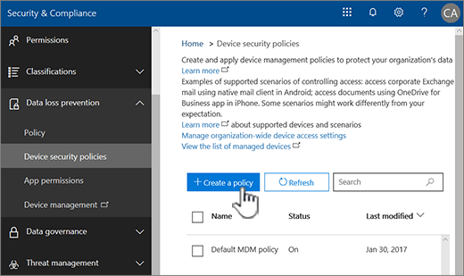
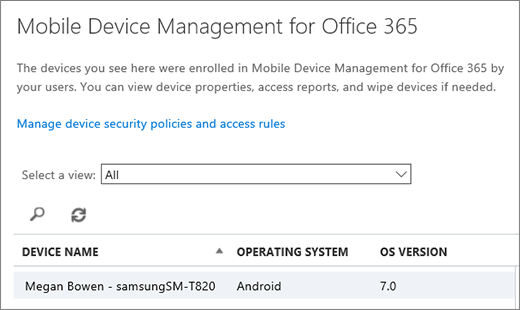

# Создание и развертывание политик безопасности устройств

Управление устройствами Mobile для Office 365 можно использовать для создания политики безопасности, которые помогают защитить данные вашей организации на Office 365 от несанкционированного доступа. Для любого мобильного устройства можно применить политики в вашей организации, где пользователь устройства, применимых лицензии Office 365 и участвуют устройства в MDM для Office 365.
  
## Перед началом работы

- Сведения об устройствах, приложения для мобильных устройств и параметры безопасности, которые поддерживает MDM для Office 365. В разделе [возможности управления мобильных устройств для Office 365](capabilities-of-mobile-device-management.md).
    
- Создание группы безопасности, включая пользователей Office 365, которые вы хотите развернуть политики, и для пользователей, можно исключить не заблокирован доступ к Office 365. Рекомендуется перед развертыванием новой политики для вашей организации проверить политики путем развертывания для небольшого числа пользователей. Можно создавать и использовать группы безопасности, которая включает в себя только что самостоятельно или малого номеров пользователей Office 365, которые можно проверить политики. Дополнительные сведения о группах безопасности видеть [Создание, редактирование и удаление группы безопасности](https://go.microsoft.com/fwlink/p/?LinkId=518555).
    
- **Важные:** Перед созданием политики мобильных устройств, необходимо включить и настроить MDM для Office 365. В разделе [Общие сведения об управлении мобильных устройств для Office 365](overview-of-mdm.md).
    
- Создание и развертывание политик управления мобильного устройства в Office 365, необходимо быть глобального администратора Office 365 Просмотреть [разрешения безопасности Office 365 &amp; центре соответствия требованиям](https://support.office.com/article/d10608af-7934-490a-818e-e68f17d0e9c1).
    
- Перед развертыванием политик позволяют организации знать последствиях регистрации устройства в MDM для Office 365. В зависимости от того, как настроить политики несовместимый устройств можно заблокировать доступ к Office 365 и данные, включая установленные приложения, фотографии и личные сведения на устройстве зарегистрированных могут быть удалены.
    
> [!NOTE]
> Политики и правила доступа, созданные в MDM для Office 365 переопределяют политики почтовых ящиков мобильных устройств Exchange ActiveSync и правила доступа устройств, созданные в центре администрирования Exchange. После регистрации устройство в MDM для Office 365, любые политики почтовых ящиков мобильных устройств Exchange ActiveSync или правила доступа к устройству, применяемые к устройства будет игнорироваться. Чтобы узнать больше о Exchange ActiveSync, обратитесь к разделу [Exchange ActiveSync в Exchange Online](https://go.microsoft.com/fwlink/p/?LinkId=524380). 
  
## Этап 1: Создание политики безопасности и развертывания для группы тестов

Прежде чем начать, убедитесь, что определенные активирован и настройки MDM для Office 365. Инструкции в разделе [Общие сведения о мобильных устройств управления для Office 365](overview-of-mdm.md) . 
  
1. В Office 365, в системы &amp; центре соответствия требованиям, чтобы перейти на **защиту от потери данных** \> **политики безопасности устройств**.
    
    > [!NOTE]
    > **Политики безопасности устройств** будет отображаться в меню только после активации управление мобильными устройствами. 
  
2. Нажмите кнопку **+ Создать политику**.
    
    
  
3. Укажите **имя** и **Описание** новой политики и нажмите кнопку **Далее**.
    
    
  
4. На **требования необходимо иметь на устройствах?** страницы, укажите требования, требуется применить к мобильных устройств в вашей организации и нажмите кнопку **Далее**.
    
    
  
5. На **необходимые настройки?** страницы, укажите дополнительные требования требуется применить для мобильных устройств в вашей организации и нажмите кнопку **Далее**.
    
6. На **вы хотите применить эту политику сейчас?** страницы, нажмите кнопку **Да**и нажмите кнопку **+ Добавить**. 
    
    
  
7. Выберите группы пользователей, которые будут тестирования политики, прежде чем развертывать его в вашей организации и нажмите кнопку **Добавить**.
    
8. Нажмите кнопку **Далее**.
    
9. Просмотрите и подтвердите сведения о новой политики устройства и нажмите кнопку **Создать эту политику**.
    
    
  
10. Нажмите кнопку **Закрыть**.
    
Каждый пользователь, к которому применяется политика будет иметь политики, помещено в свои устройства в следующий раз, которые выполняют вход в Office 365 с помощью мобильных устройствах. Если пользователи не было политики, применяемые к его мобильное устройство, прежде чем, затем после развертывания политики, они могут получить уведомление на мобильном устройстве, которая состоит из [шагов для регистрации и активации MDM для Office 365](https://go.microsoft.com/fwlink/?LinkId=615272). До их завершения регистрации, доступа к электронной почте, OneDrive и другие службы будут ограничены. После завершения регистрации, с помощью приложения портала Intune компании, они будут использовать службы и политики будут применяться к свои устройства.
  
## Шаг 2: Проверка вашей works политики

После создания политики безопасности, следует проверить, что политики работают, как ожидалось перед развертыванием в вашей организации.
  
1. В Office 365, перейдите в раздел **безопасности &amp; центре соответствия требованиям** \> **защиту от потери данных** \> **Управление устройствами**.
    
2. На странице " **Управление мобильного устройства для Office 365** " Проверьте состояние устройств пользователя, к которым применена политика. Можно отфильтровать или отсортировать по **всем** для просмотра всех устройств и **Заблокированные** для просмотра заблокированные устройства. 
    
    
  
3. Можно также выполнить полный или Выборочный очистки на устройстве. Сведения содержатся в разделе [стирание мобильного устройства в Office 365](wipe-a-mobile-device.md).
    
## Шаг 3: Развертывание политики для вашей организации

После создания политики мобильных устройств и проверить ее работоспособность, следует разверните для вашей организации.
  
1. В Office 365, перейдите в раздел **безопасности &amp; центре соответствия требованиям** \> **защиту от потери данных** \> **политики безопасности устройств**.
    
2. Выберите политику, которую требуется развернуть и выберите команду **изменить политику** в \< _Имя политики_ \> панель.  
    
3. Выберите вкладку **Развертывание**. 
    
4. На вкладке « **Развертывание** » нажмите кнопку **Да** над **выберите один или несколько групп безопасности, которые содержат людей, которую нужно применить эту политику, чтобы** и нажмите кнопку **Добавить**.
    
  - На панели **Выберите группу** можно выполнить поиск для группы для добавления, можно фильтровать по псевдоним или по отображаемому имени. Также можно добавить существующую группу в списке **групп** . 
    
    Можно добавить несколько групп для применения политики.
    
    Выберите команду **Добавить** в нижней части панели. 
    
5. На вкладке « **Развертывание** » выберите команду **Сохранить** . 
    
    
  
Каждый пользователь, к которому применяется политика будет иметь политики, помещено в свои устройства в следующий раз, которые выполняют вход в систему Office 365 с мобильного устройства. Если пользователи не было политики, применяемые к его мобильное устройство, они будут [отправляется уведомление на мобильном устройстве](https://go.microsoft.com/fwlink/?LinkId=615272) с помощью действия, чтобы зарегистрировать и включить его для MDM для Office 365. После завершения регистрации они политики будут применяться к свои устройства. 
  
## Шаг 4: Доступ к электронной почте блокировки для неподдерживаемых устройств

Для защиты сведений о вашей организации, следует блокировать приложения доступ к электронной почты Office 365 для мобильных устройств, которые не поддерживаются MDM для Office 365. Список устройств, которые поддерживаются в разделе [возможности встроенных управления мобильных устройств для Office 365](capabilities-of-mobile-device-management.md) . Для этого сделайте следующее. 
  
1. Последовательно выберите пункты безопасность &amp; центре соответствия требованиям\> **защиту от потери данных** \> **политики безопасности устройств**.
    
2. Выберите **Управление параметрами доступа устройства всей организации**.
    
    
  
3. Для блокирования неподдерживаемые устройства, выберите **блок** в разделе **Если устройство не поддерживается MDM для Office 365, хотите ли вы разрешить или заблокировать его с помощью учетной записи Exchange для доступа к электронной почте вашей организации** \> **Сохранить**.
  
## Этап 5. Выбор групп безопасности, которые будут исключены из проверок условного доступа

Если вы хотите исключить определенных пользователей из проверок условного доступа на мобильных устройствах, и для них создана одна или несколько групп безопасности, добавьте эти группы сюда. К поддерживаемым мобильным устройствам участников этих групп не будут принудительно применяться политики.
  
1. Последовательно выберите пункты безопасность &amp; центре соответствия требованиям\> **защиту от потери данных** \> **политики безопасности устройств**.
    
2. Выберите **Управление параметрами доступа устройства всей организации**.
    
    
  
3. Выберите **Добавить** , чтобы добавить группу безопасности, которая имеет пользователей, которые необходимо исключить из, заблокирован доступ к Office 365. При добавлении пользователя к этому списку они сможет получить доступ к электронной почты Office 365 при использовании неподдерживаемых устройства. 
    
4. Выберите группу безопасности, которую необходимо использовать в панели **выберите группу** . 
    
5. Выберите имя, а затем **Добавить** \> **Сохранить**.
    
6. На панели **параметров доступа устройства всей организации** выберите команду **Сохранить**.
  
## Как политики безопасности влияют на разные типы устройств?

При применении политики к устройствам пользователей влияние на каждый тип устройства немного отличается. Примеры влияния политик см. в следующей таблице.
  

|**Политика безопасности**|**Windows Phone 8.1 +**|**Android 4 и более поздние версии**|**Samsung Нокса**|**IOS 6 +**|**Примечания**|
|:-----|:-----|:-----|:-----|:-----|:-----|
|Требовать шифрование резервных копий    |✖    |✖    |✔    |✔    |Требуется шифрованное резервное копирование IOS.    |
|Блокировать резервное копирование в облаке    |✖    |✔    |✔    |✔    |Блокировать резервное копирование Google для Android (параметр недоступен), облачное резервное копирование для iOS.    |
|Блокировать синхронизацию документов    |✖    |✖    |✖    |✔    |iOS: блокировать документы в облаке    |
|Блокировать синхронизацию фотографий    |✖    |✖    |✖    |✔    |iOS (собственный): блокировать Photo Stream.    |
|Блокировать снимки экрана    |✔    |X    |✔    |✔    |Блокируется при попытке.    |
|Блокировать видеоконференции    |✖    |✖    |✖    |✔    |FaceTime заблокирован в iOS, но не в Skype или других приложениях.    |
|Блокировать отправку данных диагностики    |✖    |X    |✔    |✔    |Блокировать отправку отчета о сбое Google для Android.    |
|Блокировать доступ к магазину приложений    |✔    |X    |✔    |✔    |Значок магазина приложений отсутствует на главной странице Android, отключен в Windows, отсутствует в iOS.    |
|Требовать пароль для магазина приложений    |✖    |✖    |✖    |✔    |iOS: Пароль требуется для покупок в iTunes.    |
|Блокировать подключение съемных носителей    |✔    |X    |✔    |Н/Д    |Android: SD-карта будет недоступна в параметрах, Windows уведомляет пользователя, установленные приложения недоступны    |
|Блокировать подключение Bluetooth    |✔    |\*\*\*    |\*\*\*    |✖    |\*\*\*Мы не может отключить BlueTooth в параметре на Android. Вместо этого мы отключить всех транзакций, которые требуют BlueTooth: Advanced рассылки аудио, аудио и видео удаленного управления, устройства громкой, мини-гарнитуры, доступа к телефонной книги и порта. При использовании любой из этих в нижней части страницы отображается сообщение небольшой всплывающего уведомления.    |
   
## Что происходит при удалении самой политики или удалении пользователя из политики?

Удаление политики или удаление пользователя из группы, к которому было развернуто политики на параметры политики, профиль электронной почты Office 365 и кэширования данных по электронной почте могут быть удалены из устройств пользователя. Обратитесь к таблице ниже, чтобы увидеть, что было удалено для разных типов устройств:
  
|**Удаляемые элементы**|**Windows Phone 8.1 +**|**iOS 6 +**|**Android 4 + (включая Нокса Samsung)**|
|:-----|:-----|:-----|:-----|
|Профили управляемых электронной почты\*    |✖    |✔    |✖    |
|Параметры политики    |✔              За исключением параметра **	Запрет отправки диагностических данных с устройства**.   |✔    |✖    |
   
> [!NOTE]
> \*Если политика был развернут вместе с параметром **профиль по электронной почте управляется** выбрано, выполните профиль управляемых по электронной почте и кэширования данных по электронной почте, в том, что профиль будет удален из устройств пользователя. 
  
Для каждого пользователя, применена политика удаленных будут иметь политики, удалены из свои устройства в следующий раз проверяет его мобильное устройство с помощью MDM для Office 365. Если развернуть новую политику, применяемую к устройствам, эти пользователи, они будет предложено повторно зарегистрировать в MDM для Office 365.
  
Кроме того, можно [Удалить устройство](wipe-a-mobile-device.md), либо полностью или выборочно стирание корпоративной информации с устройства.
  
## Статьи по теме

[Общие сведения об управлении мобильными устройствами для Office 365](overview-of-mdm.md)
  
[Возможности управления мобильными устройствами для Office 365](capabilities-of-mobile-device-management.md)
  

