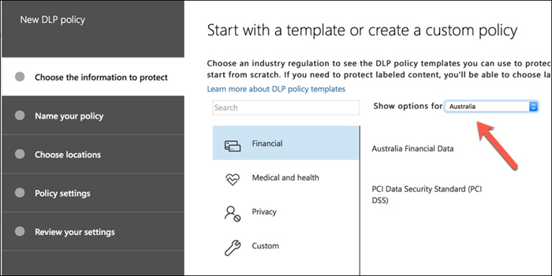
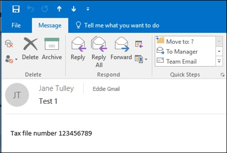

# Создание, тестирование и настройка политики защиты от потери данныхCreate, test, and tune a DLP policy

**Автор участника****Principal author**  
Пол Куннингхам, Microsoft MVPPaul Cunningham, Microsoft MVP  
[Практическая 365Practical 365](https://practical365.com/)  
[@Practical365@Practical365](https://twitter.com/practical365) 
__________________________________________________

Защита от потери данных — это функция соответствия требованиям Office 365, которая помогает организации предотвратить преднамеренное или случайное воздействие конфиденциальной информации нежелательным сторонам.Data loss prevention is a compliance feature of Office 365 that is designed to help your organization prevent the intentional or accidental exposure of sensitive information to unwanted parties. У защиты от потери данных есть корни в Exchange Server и Exchange Online, и он также применяется в SharePoint Online и OneDrive для бизнеса.DLP has its roots in Exchange Server and Exchange Online, and is also applicable in SharePoint Online and OneDrive for Business.

DLP использует модуль анализа контента для просмотра содержимого сообщений и файлов электронной почты, а также для поиска конфиденциальных данных, таких как номера кредитных карт и персональные данные (PII).DLP uses a content analysis engine to examine the contents of email messages and files, looking for sensitive information such as credit card numbers and personally identifiable information (PII). Конфиденциальные сведения обычно не следует отправлять в сообщениях электронной почты или включать в документы, не требуя дополнительных действий, таких как шифрование сообщения электронной почты или файлов.Sensitive information should typically not be sent in email, or included in documents, without taking additional steps such as encrypting the email message or files. С помощью DLP можно определять конфиденциальные данные и выполнять следующие действия:Using DLP you can detect sensitive information, and take action such as:

- Запись события в журнал для целей аудитаLog the event for auditing purposes
- Отображение предупреждения конечному пользователю, который отправляет сообщение электронной почты или предоставление общего доступа к файлуDisplay a warning to the end user who is sending the email or sharing the file
- Активная блокировка электронной почты или общего доступа к файламActively block the email or file sharing from taking place

Иногда клиенты могут прекратить защиту от потери данных, так как они не расказываются о типе данных, требующих защиты.Sometimes customers dismiss DLP because they don't consider themselves to have the type of data that needs protecting. Предполагается, что конфиденциальные данные, такие как медицинские записи или финансовая информация, существуют только для таких отраслей, как здравоохранение или организациям, которые работают с Интернет-магазинами.The assumption is that sensitive data, such as medical records or financial information, only exists for industries like health care or for companies that run online stores. Но любой бизнес может обрабатывать конфиденциальные данные на регулярной основе, даже если они не реализуют их.But any business can handle sensitive information on a regular basis, even if they don't realize it. Электронная таблица имен сотрудников и дат рождения аналогична электронной таблице имен клиентов и сведений о кредитных картах.A spreadsheet of employee names and dates of birth is just as sensitive as a spreadsheet of customer names and credit card details. Кроме того, этот тип данных, как можно ожидать, может привести к тому, что сотрудники не заходят о своих повседневных задачах, но не смогут экспортировать CSV-файл из системы и отправить его по электронной почте.And this type of information tends to float around more than you might expect, as employees quietly go about their day to day tasks, thinking nothing of export a CSV file from a system and emailing it to someone. Вы также можете быть удивлены тем, как часто сотрудники отправляют электронные сообщения, содержащие сведения о кредитных картах или банковские сведения, без учета последствий.You might also be surprised how often employees send emails containing credit card or banking details without considering the consequences.

## Обнаружение конфиденциальной информации с помощью DLPHow sensitive information is detected by DLP

Конфиденциальные сведения определяются в соответствии с шаблоном регулярных выражений (RegEx) в сочетании с другими показателями, такими как расстояние между определенными ключевыми словами и соответствующими шаблонами.Sensitive information is identified by regular expression (RegEx) pattern matching, in combination with with other indicators such as the proximity of certain keywords to the matching patterns. Например, это номера кредитных карт.An example of this is credit card numbers. Номер кредитной карты VISA состоит из 16 цифр.A VISA credit card number has 16 digits. Тем не менее, эти цифры могут быть записаны различными способами, например 1111-1111-1111-1111, 1111 1111 1111 1111 или 1111111111111111.However, those digits can be written in different ways, such as 1111-1111-1111-1111, 1111 1111 1111 1111, or 1111111111111111.

Любая строка из 16 цифр не обязательно является номером кредитной карты, она может представлять собой регистрационный номер из системы службы поддержки или серийный номер устройства.Any 16 digit string is not necessarily a credit card number, it could be a ticket number from a help desk system, or a serial number of a piece of hardware. Чтобы узнать разницу между номером кредитной карты и строкой из 16 цифр, выполняется вычисление (контрольная сумма), чтобы убедиться, что номера совпадают с известным шаблоном из различных торговых марок кредитных карт.To tell the difference between a credit card number and a harmless 16-digit string, a calculation is performed (checksum) to confirm that the numbers match a known pattern from the various credit card brands.

Кроме того, можно принять решение о том, является ли данные номером кредитной карты, а также ключевыми словами, например "VISA" или "АМЕКС", а также значениями, которые могут быть сроками действия кредитной карты.Furthermore, the proximity of keywords such as “VISA” or “AMEX”, along with the proximity to date values that might be the credit card expiry date, is also considered to make a decision about whether the data is a credit card number or not.

Другими словами, защита от потери данных обычно достаточно интеллектуальна для того, чтобы распознавать различия между этими двумя текстами в электронной почте:In other words, DLP is usually smart enough to recognize the difference between these two texts in an email:

- "Можно заказать новый портативный компьютер.“Can you order me a new laptop. Используйте мое приложение VISA Number 1111-1111-1111-1111, истечение срока действия 11/22 и отправьте мне оценочную дату доставки, когда она есть. "Use my VISA number 1111-1111-1111-1111, expiry 11/22, and send me the estimated delivery date when you have it.”
- "Мой номер моего ноутбука — 2222-2222-2222-2222, и он был приобретен на 11/2010.“My laptop serial number is 2222-2222-2222-2222 and it was purchased on 11/2010. Кстати, это еще все одобрение Visa? "By the way, is my travel visa approved yet?”

В этом разделе приведены полезные [сведения о типах конфиденциальной информации](what-the-sensitive-information-types-look-for.md) , объясняющих, как определяется каждый тип данных.A good reference to keep bookmarked is this [topic on sensitive information types](what-the-sensitive-information-types-look-for.md) that explains how each information type is detected.

## Где начать с защиты от потери данныхWhere to start with data loss prevention

Если риски, связанные с утечкой данных, не полностью очевидны, трудно решить, что именно следует начать с реализации защиты от потери данных.When the risks of data leakage aren't entirely obvious, it's difficult to work out where exactly you should start with implementing DLP. К счастью, политики защиты от потери данных можно запускать в режиме тестирования, что позволяет оценивать эффективность и точность перед включением.Fortunately, DLP policies can be run in “test mode”, allowing you to gauge their effectiveness and accuracy before you turn them on.

Политики DLP для Exchange Online можно управлять с помощью центра администрирования Exchange.DLP policies for Exchange Online can be managed through the Exchange admin center. Однако политики защиты от потери данных можно настроить для всех рабочих нагрузок в центре безопасности _Амп_ соответствия требованиям, поэтому для демонстраций, описанных в этой статье, мы будем использовать эту политику.But you can configure DLP policies for all workloads through the Security & Compliance Center, so that's what I'll use for demonstrations in this article. В центре безопасности _амп_ соответствие политике защиты от потери данных вы найдете в разделе > **Политика** **защиты от потери данных**.In the Security & Compliance Center you'll find the DLP policies under **Data loss prevention** > **Policy**. Щелкните **создать политику** для запуска.Click on **Create a policy** to start.

Office 365 предоставляет ряд [шаблонов политики защиты от потери](what-the-dlp-policy-templates-include.md) данных, которые можно использовать для создания политик защиты от потери данных.Office 365 provides a range of [DLP policy templates](what-the-dlp-policy-templates-include.md) you can use to create DLP policies. Предположим, что вы используете Австралийский бизнес.Let's say that you're an Australian business. Вы можете отфильтровать шаблоны политик, чтобы отображались только те, которые относятся к Австралии, которые относятся к общим категориям финансовых, медицинских и исПравных и конфиденциальности.You can filter the policy templates to display only those that are relevant to Australia, which fall into the general categories of Financial, Medical and Health, and Privacy.

В этой демонстрации я буду выбирать персональные данные персональных данных (PII), которые включают типы сведений о номере файла (ТФН) и номер водительского удостоверения (Австралия).For this demonstration I'll choose Australian Personally Identifiable Information (PII) Data, which includes the information types of Australian Tax File Number (TFN) and Driver's License Number.

ПриСвойте новой политике DLP имя.Give your new DLP policy a name. Имя по умолчанию будет соответствовать шаблону политики защиты от потери данных, но вам следует выбрать более понятное имя, так как в одном шаблоне можно создать несколько политик.The default name will match the DLP policy template, but you should choose a more descriptive name of your own, because multiple policies can be created from the same template.

Выберите расположения, к которым будет применяться политика.Choose the locations that the policy will apply to. Политики защиты от потери данных могут применяться к Exchange Online, SharePoint Online и OneDrive для бизнеса.DLP policies can apply to Exchange Online, SharePoint Online, and OneDrive for Business. Я собираюсь оставить эту политику настроенной для всех расположений.I am going to leave this policy configured to apply to all locations.

На первом шаге **Параметры политики** просто примите значения по умолчанию.At the first **Policy Settings** step just accept the defaults for now. Существует множество настроек, которые можно выполнять в политиках защиты от потери данных, но по умолчанию лучше начать.There is quite a lot of customization you can do in DLP policies, but the defaults are a fine place to start.

После нажатия кнопки **Далее** откроется страница дополнительных **параметров политики** с дополнительными параметрами настройки.After clicking **Next** you'll be presented with an additional **Policy Settings** page with more customization options. Для политики, которую вы только тестируете, здесь можно приступить к внесению некоторых корректировок.For a policy that you are just testing, here's where you can start to make some adjustments.

- Я отключил подсказку политики, что является разумным действием, если вы только что тестируете и не хотите, чтобы все пользователи ни выходили на себя.I've turned off policy tips for now, which is a reasonable step to take if you're just testing things out and don't want to display anything to users yet. Подсказка политики отображает предупреждения для пользователей о том, что они нарушают политику защиты от потери данных.Policy tips display warnings to users that they're about to violate a DLP policy. Например, пользователь Outlook видит предупреждение о том, что вложенный файл содержит номера кредитных карт, и из-за чего их электронная почта будет отклонена.For example, an Outlook user will see a warning that the file they've attached contains credit card numbers and will cause their email to be rejected. Цель советов политики — остановить поведение, не соответствующее требованиям, прежде чем это произойдет.The goal of policy tips is to stop the non-compliant behaviour before it happens.
- Я также сократил количество экземпляров с 10 до 1, чтобы эта политика определяла любой общий доступ к данным в Австралии, а не только массовый общий доступ к данным.I've also decreased the number of instances from 10 to 1, so that this policy will detect any sharing of Australian PII data, not just bulk sharing of the data.
- Я также добавил еще одного получателя в электронное сообщение с отчетом об инциденте.I've also added another recipient to the incident report email.

Наконец, я настроил эту политику для первоначального запуска в тестовом режиме.Finally, I've configured this policy to run in test mode initially. Обратите внимание, что также есть возможность отключить подсказки политики в тестовом режиме.Notice there's also an option here to disable policy tips while in test mode. Это позволяет обеспечить возможность включения подсказок политики в политику, а затем решить, следует ли отображать их в ходе тестирования.This gives you the flexibility to have policy tips enabled in the policy, but then decide whether to show or suppress them during your testing.

На экране "завершение проверки" нажмите кнопку **создать** , чтобы завершить создание политики.On the final review screen click **Create** to finish creating the policy.

## Проверка политики DLPTest a DLP policy

Новая политика защиты от потери данных начнет действовать в течение примерно 1 часа.Your new DLP policy will begin to take effect within about 1 hour. Вы можете подождать и подождать, пока она не будет активирована обычными действиями пользователей, или вы можете попробовать запустить ее самостоятельно.You can sit and wait for it to be triggered by normal user activity, or you can try to trigger it yourself. Ранее я подключился к этой [теме в разделе Типы конфиденциальной информации](what-the-sensitive-information-types-look-for.md), в которой представлены сведения о том, как активировать соответствия DLP.Earlier I linked to this [topic on sensitive information types](what-the-sensitive-information-types-look-for.md), which provides you with information about how to trigger DLP matches.

Например, политика защиты от потери данных, созданная для этой статьи, будет определять австралийские номера файлов (ТФН).As an example, the DLP policy I created for this article will detect Australian tax file numbers (TFN). В соответствии с документацией соответствие основано на указанных ниже условиях.According to the documentation, the match is based on the following criteria.

 
Чтобы продемонстрировать обнаружение ТФН в блунт способом, адрес электронной почты со словами "номер налогового файла" и строка из 9 цифр в близких пределах будут Саил без каких бы то ни было проблем.To demonstrate TFN detection in a rather blunt manner, an email with the words “Tax file number” and a 9 digit string in close proximity will sail through without any issues. Причина, по которой он не запускает политику DLP, заключается в том, что строка из 9 цифр должна передавать контрольную сумму, указывающую на то, что это действительный ТФН, а не только небезопасная строка чисел.The reason it does not trigger the DLP policy is that the 9-digit string must pass the checksum that indicates it is a valid TFN and not just a harmless string of numbers.

При сравнении сообщения электронной почты со словами "номер налогового файла" и допустимым ТФН, которые продают контрольную сумму, будут активировать политику.In comparison, an email with the words “Tax file number” and a valid TFN that passes the checksum will trigger the policy. Для этой записи ТФН я использовался на веб-сайте, который создает действительные, но не подлинность, Тфнс.For the record here, the TFN I'm using was taken from a website that generates valid, but not genuine, TFNs. Существуют похожие сайты, которые создают [действительные, но фиктивные номера кредитных карт](http://www.fakecreditcardgenerator.net/).There are similar sites that generate [valid but fake credit card numbers](http://www.fakecreditcardgenerator.net/). Такие сайты очень полезны, так как одна из самых распространенных ошибок при тестировании политики DLP — использование поддельного номера, который не является допустимым и не передает контрольную сумму (и поэтому не запускает политику).Such sites are very useful because one of the most common mistakes when testing a DLP policy is using a fake number that's not valid and won't pass the checksum (and therefore won't trigger the policy).

Электронное сообщение с отчетом об инциденте включает тип обнаруженных конфиденциальных сведений, количество обнаруженных экземпляров и степень вероятности обнаружения.The incident report email includes the type of sensitive information that was detected, how many instances were detected, and the confidence level of the detection.

Если вы оставляете политику защиты от потери данных в тестовом режиме и анализируете электронную почту отчета об инциденте, вы можете приступить к работе с политикой защиты от потери данных и насколько эффективнее ее применять.If you leave your DLP policy in test mode and analyze the incident report emails, you can start to get a feel for the accuracy of the DLP policy and how effective it will be when it is enforced. Кроме отчетов об инцидентах, вы можете [использовать отчеты DLP](view-the-dlp-reports.md) , чтобы увидеть сводное представление соответствия политик в клиенте.In addition to the incident reports, you can [use the DLP reports](view-the-dlp-reports.md) to see an aggregated view of policy matches across your tenant.

## Настройка политики защиты от потери данныхTune a DLP policy

При анализе обращений к политикам может потребоваться внести некоторые изменения в поведение этих политик.As you analyze your policy hits you might want to make some adjustments to how the policies behave. В качестве простого примера вы можете определить, что один ТФН в сообщении электронной почты не является проблемой (я думаю, что он по-прежнему есть), но еще один экземпляр является проблемой.As a simple example, you might determine that one TFN in email is not a problem (I think it still is, but let's go with it for the sake of demonstration), but two or more instances is a problem. Несколько экземпляров могут быть рискованными сценариями, такими как служащие для отправки электронной почты по экспорту в формате CSV из базы данных HR во внешнюю сторону (например, внешняя служба учета).Multiple instances could be a risky scenario such as an employee emailing a CSV export from the HR database to an external party, for example an external accounting service. Безусловно, вы предпочитаете обнаруживать и блокировать.Definitely something you would prefer to detect and block.

В центре безопасности _Амп_ соответствие требованиям можно изменить существующую политику, чтобы настроить поведение.In the Security & Compliance Center you can edit an existing policy to adjust the behaviour.

 
Вы можете настроить параметры расположения так, чтобы политика применялась только к определенным рабочим нагрузкам, а также к определенным сайтам и учетным записям.You can adjust the location settings so that the policy is applied only to specific workloads, or to specific sites and accounts.

Кроме того, можно настроить параметры политики и изменить правила, чтобы они соответствовали вашим потребностям.You can also adjust the policy settings and edit the rules to better suit your needs.

При редактировании правила в политике защиты от потери данных можно изменить:When editing a rule within a DLP policy you can change:

- Условия, в том числе тип и количество экземпляров конфиденциальных данных, которые будут вызывать правило.The conditions, including the type and number of instances of sensitive data that will trigger the rule.
- Выполняемые действия, например ограничение доступа к содержимому.The actions that are taken, such as restricting access to the content.
- Уведомления пользователей, которые являются подсказками политики, которые отображаются для пользователя в почтовом клиенте или в веб-браузере.User notifications, which are policy tips that are displayed to the user in their email client or web browser.
- Переопределение пользователей, которое определяет, могут ли пользователи продолжить работу с электронной почтой или предоставлением общего доступа к файлам.User overrides, which determines whether users can choose to proceed with their email or file sharing anyway.
- Отчеты об инцидентах для уведомления администраторов.Incident reports, to notify administrators.

В этом примере я добавил в политику уведомления пользователя (Будьте внимательны, не выполняя это без адекватного обучения пользователей), а также разрешить пользователям переопределять политику с помощью делового обоснования или помечая его как ложное срабатывание.For this demonstration I've added user notifications to the policy (be careful of doing this without adequate user awareness training), and allowed users to override the policy with a business justification or by flagging it as a false positive. Обратите внимание, что вы также можете настроить текст подсказок политики, чтобы включить дополнительные сведения о политиках Организации, или предложить пользователям обратиться в службу поддержки, если у них возникнут вопросы.Note that you can also customize the email and policy tip text if you want to include any additional information about your organization's policies, or prompt users to contact support if they have questions.

Политика содержит два правила для обработки большого объема и минимального объема, поэтому не забудьте изменить их, указав нужные действия.The policy contains two rules for handling of high volume and low volume, so be sure to edit both with the actions that you want. Эта возможность может различаться в зависимости от их характеристик.This is an opportunity to treat cases differently depending on their characteristics. Например, вы можете разрешить переопределение для нарушений громкости, но не разрешать переопределения для обеспечения высокой степени нарушения громкости.For example, you might allow overrides for low volume violations, but not allow overrides for high volume violations.

Кроме того, если вы хотите заблокировать или ограничить доступ к контенту, который находится в нарушениех политики, необходимо настроить действие для этого правила.Also, if you want to actually block or restrict access to content that is in violation of policy, you need to configure an action on the rule to do so.

После сохранения этих изменений в параметрах политики также необходимо вернуться на основную страницу параметров политики и включить возможность отображения подсказок политики для пользователей, когда политика находится в тестовом режиме.After saving those changes to the policy settings, I also need to return to the main settings page for the policy and enable the option to show policy tips to users while the policy is in test mode. Это эффективный способ внедрения политик защиты от потери данных для конечных пользователей и проведения обучения пользователей, но при этом не рискуя слишком много ложных срабатываний, влияющих на производительность.This is an effective way to introduce DLP policies to your end users, and do user awareness training, without risking too many false positives that impact their productivity.

На стороне сервера (или на стороне облака) изменения могут не вступить в силу немедленно из-за различных интервалов обработки.On the server side (or cloud side if you prefer), the change may not take effect immediately, due to various processing intervals. Если вы вносите изменения политики защиты от потери данных, которые будут отображать новые подсказки политики для пользователя, пользователь может не увидеть, что изменения вступают в силу немедленно в своем клиенте Outlook, который проверяет изменения политики каждые 24 часа.If you're making a DLP policy change that will display new policy tips to a user, the user may not see the changes take effect immediately in their Outlook client, which checks for policy changes every 24 hours. Чтобы ускорить тестирование, можно [удалить штамп времени последней загрузки из раздела полицинуджес с](https://support.microsoft.com/en-au/help/2823261/changes-to-a-data-loss-prevention-policy-don-t-take-effect-in-outlook?__hstc=18650278.46377037dc0a82baa8a30f0ef07a7b2f.1538687978676.1538693509953.1540315763430.3&__hssc=18650278.1.1540315763430&__hsfp=3446956451)помощью этого исправления в реестре.If you want to speed things up for testing, you can use this registry fix to [clear the last download time stamp from the PolicyNudges key](https://support.microsoft.com/en-au/help/2823261/changes-to-a-data-loss-prevention-policy-don-t-take-effect-in-outlook?__hstc=18650278.46377037dc0a82baa8a30f0ef07a7b2f.1538687978676.1538693509953.1540315763430.3&__hssc=18650278.1.1540315763430&__hsfp=3446956451). Outlook загрузит последние сведения о политике при следующем запуске и создании сообщения электронной почты.Outlook will download the latest policy information the next time you restart it and begin composing an email message.

Если включены подсказки политики, пользователь начнет просматривать подсказки в Outlook и может сообщать о ложных срабатываниях при их возникновении.If you have policy tips enabled, the user will begin to see the tips in Outlook, and can report false positives to you when they occur.

## Анализ ложных срабатыванийInvestigate false positives

Шаблоны политик защиты от потери данных не идеально подходят.DLP policy templates are not perfect straight out of the box. Скорее всего, вы обнаружите некоторые ложные срабатывания в вашей среде, поэтому важно упростить процесс развертывания защиты от потери данных, учитывая время, необходимое для тестирования и настройки политик.It's likely that you'll find some false positives occurring in your environment, which is why it's so important to ease your way into a DLP deployment, taking the time to adequately test and tune your policies.

Ниже приведен пример ложного срабатывания.Here's an example of a false positive. Это сообщение является довольно безвредным.This email is quite harmless. Пользователь предоставляет свой номер мобильного телефона для кого-либо, включая свою электронную подпись.The user is providing their mobile phone number to someone, and including their email signature.

 
Но пользователь видит подсказку политики, предупреждающее о том, что сообщение содержит конфиденциальные сведения, а именно номер водительского удостоверения для австралийского драйвера.But the user sees a policy tip warning them that the email contains sensitive information, specifically, an Australian driver's license number.

Пользователь может сообщить о ложном срабатывании, и администратор может узнать, почему она возникла.The user can report the false positive, and the administrator can look into why it has occurred. В электронном письме с отчетом об инциденте сообщение помечается как ложное срабатывание.In the incident report email, the email is flagged as a false positive.

Это хороший пример с лицензией на этот драйвер.This driver's license case is a good example to dig into. Причина, по которой это ложный положительный результат, заключается в том, что тип лицензии "Австралийский драйвер" будет срабатывать любой строкой из 9 цифр (даже из 10-значных строк), в пределах 300 символов от точки зрения "Сидней NSW" (без учета регистра).The reason this false positive has occurred is that the “Australian Driver's License” type will be triggered by any 9-digit string (even one that is part of a 10-digit string), within 300 characters proximity to the keywords “sydney nsw” (not case sensitive). Поэтому она инициируется номером телефона и подписью электронной почты, только потому что пользователь находится в Сидней.So it's triggered by the phone number and email signature, only because the user happens to be in Sydney.

Интересно, что если для "Сидней, NSW" задана запятая, политика защиты от потери данных не активируется.Interestingly, if “Sydney, NSW” has a comma, the DLP policy is not triggered. Я не знаю, почему запятая делает какие – либо различия, или почему другие города и Штаты в Австралии не включены в ключевые слова для типа сведений о лицензии для австралийского драйвера.I have no idea why a comma makes any difference here, nor why other cities and states in Australia aren't included in the keywords for the Australian driver's license information type, but there you go. Итак, что можно сделать?So, what can we do about it? Существует несколько вариантов.There's a couple of options.

Один из вариантов — удалить тип сведений о лицензии австралийского драйвера для Австралии из политики.One option is to remove the Australian driver's license information type from the policy. Она есть в наличии, так как она является частью шаблона политики защиты от потери данных, но мы не вынуждены его использовать.It's in there because it's part of the DLP policy template, but we're not forced to use it. Если вас интересуют только номера налоговых файлов и не являются лицензиями драйвера, можно просто удалить его.If you're only interested in Tax File Numbers and not driver's licenses, you can just remove it. Например, вы можете удалить его из правила "недостаточно громкости" в политике, но оставить его в правиле "высокая громкость", чтобы списки с лицензиями на несколько драйверов по-прежнему были обнаружены.For example, you can remove it from the low volume rule in the policy, but leave it in the high volume rule so that lists of multiple drivers licenses are still detected.

 
Кроме того, можно просто увеличить количество экземпляров, чтобы при наличии нескольких экземпляров было обнаружено только небольшое количество лицензий на драйвер.Another option is to simply increase the instance count, so that a low volume of driver's licenses is only detected when there are multiple instances.

В дополнение к изменению числа экземпляров можно также настроить точность соответствия (или уровень вероятности).In addition to changing the instance count, you can also adjust the match accuracy (or confidence level). Если тип конфиденциальной информации имеет несколько шаблонов, можно настроить точность соответствия в правиле, чтобы правило соответствовало только определенным шаблонам.If your sensitive information type has multiple patterns, you can adjust the match accuracy in your rule, so that your rule matches only specific patterns. Например, чтобы уменьшить количество ложных срабатываний, можно установить точность соответствия для правила, чтобы она соответствовала только шаблону с наивысшим уровнем достоверности.For example, to help reduce false positives, you can set the match accuracy of your rule so that it matches only the pattern with the highest confidence level. Понимание того, как рассчитывается уровень вероятности, немного сложнее (и выходит за рамки этой записи), но здесь подробно [описывается, как использовать уровень вероятности для настройки правил](https://docs.microsoft.com/en-us/office365/securitycompliance/data-loss-prevention-policies#match-accuracy).Understanding how confidence level is calculated is a bit tricky (and beyond the scope of this post), but here's a good explanation of [how to use confidence level to tune your rules](https://docs.microsoft.com/en-us/office365/securitycompliance/data-loss-prevention-policies#match-accuracy).

Наконец, если вы хотите сделать еще более сложным, вы можете настроить любой тип конфиденциальной информации — например, вы можете удалить "Сидней NSW" из списка ключевых слов для [лицензии на австралийский драйвер](https://docs.microsoft.com/en-us/office365/securitycompliance/what-the-sensitive-information-types-look-for#australia-drivers-license-number), чтобы исключить ложное срабатывание выше.Finally, if you want to get even a bit more advanced, you can customize any sensitive information type -- for example, you can remove "Sydney NSW" from the list of keywords for [Australian Driver's License](https://docs.microsoft.com/en-us/office365/securitycompliance/what-the-sensitive-information-types-look-for#australia-drivers-license-number), to eliminate the false positive triggered above. Чтобы узнать, как это сделать, используя XML и PowerShell, ознакомьтесь с разделом, посвященным [настройке встроенного типа конфиденциальной информации](customize-a-built-in-sensitive-information-type.md).To learn how to do this by using XML and PowerShell, see this topic on [customizing a built-in sensitive information type](customize-a-built-in-sensitive-information-type.md).

## Отключение политики защиты от потери данныхTurn off a DLP policy

Когда вы уверены, что политика защиты от потери данных правильно и эффективно определяет типы конфиденциальной информации и что ваши конечные пользователи готовы к работе с политиками, вы можете включить эту политику.When you're happy that your DLP policy is accurately and effectively detecting sensitive information types, and that your end users are ready to deal with the policies being in place, then you can enable the policy.

 
Если вы ждете, когда политика вступит в силу, подключитесь [к PowerShell центра безопасности _амп_ для Office 365](https://docs.microsoft.com/en-us/powershell/exchange/office-365-scc/connect-to-scc-powershell/connect-to-scc-powershell?view=exchange-ps) и запустите [командлет Get – dlpcompliancepolicy позволяет](https://docs.microsoft.com/en-us/powershell/module/exchange/policy-and-compliance-dlp/get-dlpcompliancepolicy?view=exchange-ps) , чтобы просмотреть дистрибутионстатус.If you're waiting to see when the policy will take effect, [Connect to Office 365 Security & Compliance Center PowerShell](https://docs.microsoft.com/en-us/powershell/exchange/office-365-scc/connect-to-scc-powershell/connect-to-scc-powershell?view=exchange-ps) and run the [Get-DlpCompliancePolicy cmdlet](https://docs.microsoft.com/en-us/powershell/module/exchange/policy-and-compliance-dlp/get-dlpcompliancepolicy?view=exchange-ps) to see the DistributionStatus.

После включения политики защиты от потери данных необходимо выполнить некоторые завершающие тесты, чтобы убедиться, что выполняются ожидаемые действия политики.After turning on the DLP policy, you should run some final tests of your own to make sure that the expected policy actions are occurring. Если вы тестируете данные, например данные кредитных карт, веб-сайты в Интернете, содержащие сведения о том, как создать пример кредитной карты или другие персональные данные, которые будут передавать контрольные суммы и активировать политики.If you're trying to test things like credit card data, there are websites online with information on how to generate sample credit card or other personal information that will pass checksums and trigger your policies.

Политики, позволяющие переопределять пользователей, будут представлять собой параметр для пользователя в рамках подсказки политики.Policies that allow user overrides will present that option to the user as part of the policy tip.

Политики, которые ограничивают контент, будут представлять предупреждение пользователю в рамках подсказки политики и предотвращают отправку электронной почты.Policies that restrict content will present the warning to the user as part of the policy tip, and prevent them from sending the email.

## СводкаSummary

Политики защиты от потери данных используются в организациях всех типов.Data loss prevention policies are useful for organizations of all types. Тестирование некоторых политик защиты от потери данных — это небольшое снижение риска из-за таких элементов управления, как подсказки политики, переопределение конечных пользователей и отчеты об инцидентах.Testing some DLP policies is a low risk exercise due to the control you have over things like policy tips, end user overrides, and incident reports. Вы можете протестировать политики защиты от потери данных, чтобы узнать, какие типы нарушений уже существуют в вашей организации, а затем с помощью политик с низкие ложными срабатываний, попросите пользователей определить, что разрешено и не разрешено, а затем выполнить развертывание политик защиты от потери данных в предприятии.You can quietly test some DLP policies to see what type of violations are already occurring in your organization, and then craft policies with low false positive rates, educate your users on what is allowed and not allowed, and then roll out your DLP policies to the organization.
