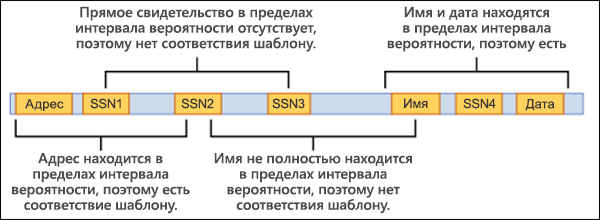
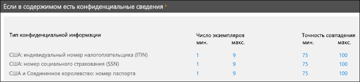

# Пользовательские типы конфиденциальной информации

## Обзор

Office 365 содержит множество встроенных типов конфиденциальной информации, готовых к использованию в вашей организации, например для [защиты от потери данных](data-loss-prevention-policies.md) (DLP) или [Microsoft Cloud App Security](https://docs.microsoft.com/cloud-app-security). Встроенные типы конфиденциальной информации помогают определять и защищать номера кредитных карт, номера банковских счетов, номера паспортов и многое другое на основе закономерностей, определенных регулярным выражением (regex) или функцией. Дополнительные сведения см. в статье [Что позволяют искать типы конфиденциальной информации](what-the-sensitive-information-types-look-for.md).

Но что если вам нужно обнаруживать и защищать конфиденциальную информацию другого типа, например идентификаторы сотрудников или номера проектов с использованием особого формата в вашей организации? Для этого вы можете создать пользовательский тип конфиденциальной информации.

Основные компоненты пользовательского типа конфиденциальной информации:

- **Основной шаблон**: коды сотрудников, номера проектов и т. д. Как правило, он определяется регулярным выражением (RegEx), но также может представлять собой список ключевых слов.

- **Дополнительные признаки.** Допустим, вы рассматриваете девятизначный код сотрудника. Не все девятизначные числа являются идентификаторами сотрудников, поэтому вы можете искать дополнительный текст: ключевые слова (например, "сотрудник", "бейдж", "ИД") или другие текстовые шаблоны, основанные на дополнительных регулярных выражениях. Дополнительные признаки (также называемые _вспомогательными_ или _подтверждающими_ признаками) повышают вероятность того, что девятизначный номер в содержимом действительно является кодом сотрудника.

- **Расстояние между символами.** Будет логично предположить, что чем ближе основной шаблон и вспомогательные признаки друг к другу, тем вероятнее, что обнаруженный контент будет именно тем, что вам нужно. Вы можете задать расстояние в символах между основным шаблоном и вспомогательными признаками (также называемое _интервалом вероятности_), как показано на следующей схеме:

    

- **Уровень вероятности.** Чем больше вспомогательных признаков, тем выше вероятность того, что обнаруженное совпадение относится к конфиденциальным данным. Вы можете назначать более высокие уровни вероятности для совпадений, обнаруженных по большему количеству признаков.

  При выполнении условия шаблон возвращает значения количества и уровня вероятности, которые вы можете использовать в условиях политик защиты от потери данных. Добавляя условие для обнаружения типа конфиденциальной информации в политику защиты от потери данных, вы можете изменить значения количества и уровня вероятности, как показано на следующей схеме:

    

## Создание пользовательских типов конфиденциальной информации

Создать пользовательский тип конфиденциальной информации для защиты от потери данных в Центре безопасности и соответствия требованиям можно с помощью нескольких вариантов:

- **С помощью EDM.** (НОВИНКА!) Вы можете настроить пользовательские типы конфиденциальной информации с использованием классификации на основе точного совпадения данных (EDM). Этот метод позволяет создать динамический тип конфиденциальной информации с помощью защищенной базы данных, которую можно периодически обновлять. См. статью [Создание пользовательского типа конфиденциальной информации с помощью классификации на основе точного совпадения данных (предварительная версия)](create-custom-sensitive-info-type-edm.md).

- **С помощью PowerShell.** Вы можете настроить пользовательские типы конфиденциальной информации с использованием PowerShell. Хотя этот метод сложнее, чем использование пользовательского интерфейса, он предоставляет дополнительные параметры конфигурации. См. статью [Создание пользовательского типа конфиденциальной информации в PowerShell Центра безопасности и соответствия требованиям](create-a-custom-sensitive-information-type-in-scc-powershell.md).

- **С помощью пользовательского интерфейса.** Вы можете настроить пользовательский тип конфиденциальной информации, используя пользовательский интерфейс Центра безопасности и соответствия требованиям. В этом методе можно использовать регулярные выражения, ключевые слова и словари ключевых слов. Дополнительные сведения см. в статье [Создание пользовательского типа конфиденциальной информации](create-a-custom-sensitive-information-type.md).

