# Обзор политик защиты от потери данныхOverview of data loss prevention policies

Чтобы соответствовать стандартам ведения коммерческой деятельности и отраслевым нормативным требованиям, организациям необходимо защищать конфиденциальные данные и предотвращать их случайное раскрытие.To comply with business standards and industry regulations, organizations need to protect sensitive information and prevent its inadvertent disclosure. Примеры конфиденциальных данных, утечка которых из вашей организации нежелательна: финансовые и персональные данные, такие как номера кредитных карт, номера социального страхования и данные медицинских карт.Examples of sensitive information that you might want to prevent from leaking outside your organization include financial data or personally identifiable information (PII) such as credit card numbers, social security numbers, or health records. С помощью политики защиты от потери данных в центре безопасности &amp; Office 365 вы можете определить, отслеживать и автоматически защищать конфиденциальные данные в Office 365.With a data loss prevention (DLP) policy in the Office 365 Security &amp; Compliance Center, you can identify, monitor, and automatically protect sensitive information across Office 365.
  
Политика защиты от потери данных позволяет следующее:With a DLP policy, you can:
  
- **Идентификация конфиденциальных сведений во многих расположениях, таких как Exchange Online, SharePoint Online и OneDrive для бизнеса.****Identify sensitive information across many locations, such as Exchange Online, SharePoint Online, and OneDrive for Business.**
    
    Например, можно определить любой документ, содержащий номер кредитной карты, который хранится на любом сайте OneDrive для бизнеса, или можно отслеживать только сайты OneDrive для определенных пользователей.For example, you can identify any document containing a credit card number that's stored in any OneDrive for Business site, or you can monitor just the OneDrive sites of specific people.
    
- **Предотвращение случайного обмена конфиденциальными сведениями**.**Prevent the accidental sharing of sensitive information**. 
    
    Например, вы можете определить любой документ или электронную почту, содержащую запись о работоспособности, доступную для пользователей за прев Организации, а затем автоматически заблокировать отправку доступа к этому документу или запретить отправку сообщения.For example, you can identify any document or email containing a health record that's shared with people outside your organization, and then automatically block access to that document or block the email from being sent.
    
- **Отслеживайте и защищайте конфиденциальные данные в настольных версиях Excel 2016, PowerPoint 2016 и Word 2016.****Monitor and protect sensitive information in the desktop versions of Excel 2016, PowerPoint 2016, and Word 2016.**
    
    Как и в Exchange Online, SharePoint Online и OneDrive для бизнеса, эти программы Office 2016 имеют одинаковые возможности для идентификации конфиденциальной информации и применения политик защиты от потери данных.Just like in Exchange Online, SharePoint Online, and OneDrive for Business, these Office 2016 desktop programs include the same capabilities to identify sensitive information and apply DLP policies. DLP обеспечивает непрерывное отслеживание, когда пользователи совместно используют контент в этих программах Office 2016.DLP provides continuous monitoring when people share content in these Office 2016 programs.
    
- **Помогать пользователям соответствовать требованиям организации, не прерывая рабочего процесса.****Help users learn how to stay compliant without interrupting their workflow.**
    
    Вы можете проинструктировать пользователей о политиках защиты от потери данных и обеспечить их соответствие требованиям, не блокируя их работу.You can educate your users about DLP policies and help them remain compliant without blocking their work. Например, если пользователь пытается поделиться документом с конфиденциальными сведениями, политика защиты от потери данных может отправлять им уведомления по электронной почте и показывать им подсказку политики в контексте библиотеки документов, что позволяет им переопределять политику, если у них есть бизнес- текста.For example, if a user tries to share a document containing sensitive information, a DLP policy can both send them an email notification and show them a policy tip in the context of the document library that allows them to override the policy if they have a business justification. Те же подсказки политики также отображаются в Outlook в Интернете, Outlook 2013 и более поздних версий, Excel 2016, PowerPoint 2016 и Word 2016.The same policy tips also appear in Outlook on the web, Outlook 2013 and later, Excel 2016, PowerPoint 2016, and Word 2016.
    
- **Просмотр отчетов DLP с содержимым, которое соответствует политикам защиты от потери данных в Организации.****View DLP reports showing content that matches your organization's DLP policies.**
    
    Чтобы оценить соответствие вашей организации политике защиты от потери данных, вы можете узнать, сколько совпадений соответствует каждая политике и правилу со временем.To assess how your organization is complying with a DLP policy, you can see how many matches each policy and rule has over time. Если политика защиты от потери данных позволяет пользователям переопределять подсказку политики и сообщать о ложном срабатывании, вы также можете просмотреть сведения о пользователях.If a DLP policy allows users to override a policy tip and report a false positive, you can also view what users have reported.
    
Вы создаете политики защиты от потери данных и управляете ими на странице Защита от потери &amp; данных в центре безопасности и соответствия требованиям Office 365.You create and manage DLP policies on the Data loss prevention page in the Office 365 Security &amp; Compliance Center.
  
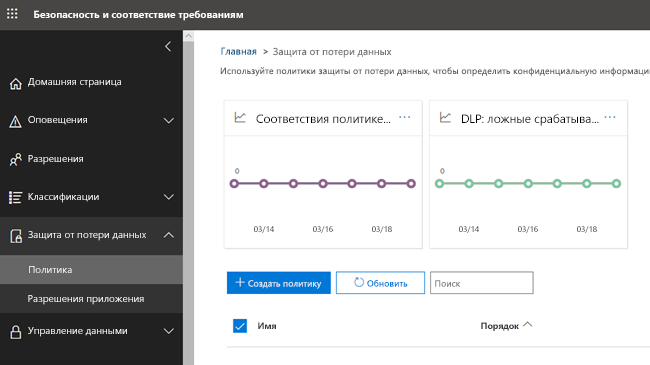
  
## Содержимое политики защиты от потери данныхWhat a DLP policy contains

Политика защиты от потери данных содержит несколько основных правил:A DLP policy contains a few basic things:
  
- Где можно защитить контентные **расположения** , такие как сайты Exchange Online, SharePoint Online и OneDrive для бизнеса.Where to protect the content - **locations** such as Exchange Online, SharePoint Online, and OneDrive for Business sites. 
    
- Когда и как защищать контент путем применения **правил** , состоящих из следующих элементов:When and how to protect the content by enforcing **rules** comprised of: 
    
  - **Условия** , по которым должно быть сопоставлено содержимое до применения правила (например, искать только контент, содержащий номера социального страхования, к которым предоставлен доступ пользователям за презнакомой организации).**Conditions** the content must match before the rule is enforced -- for example, look only for content containing Social Security numbers that's been shared with people outside your organization. 
    
  - **Действия** , которые должны автоматически выполняться правилом при обнаружении контента, удовлетворяющего условиям, например заблокировать доступ к документу и отправить как пользователя, так и руководителю соответствия требованиям уведомление по электронной почте.**Actions** that you want the rule to take automatically when content matching the conditions is found -- for example, block access to the document and send both the user and compliance officer an email notification. 
    
Правило можно использовать для выполнения определенных требований к защите, а затем использовать политику защиты от потери данных для объединения общих требований к защите, таких как все правила, необходимые для соблюдения определенных требований.You can use a rule to meet a specific protection requirement, and then use a DLP policy to group together common protection requirements, such as all of the rules needed to comply with a specific regulation.
  
Можно создать политику защиты от потери данных, которая помогает обнаруживать информацию, попадающую под действие акта о передаче и защите данных учреждений здравоохранения (HIPAA).For example, you might have a DLP policy that helps you detect the presence of information subject to the Health Insurance Portability and Accountability Act (HIPAA). Эта политика защиты от потери данных может помочь защитить данные HIPAA (то, что) на всех сайтах SharePoint Online и всех сайтах OneDrive для бизнеса (где), находя любой документ, содержащий эти конфиденциальные данные, к которым предоставлен доступ людям за пределами организации ( условия), а затем блокирует доступ к документу и отправляет уведомление (действия).This DLP policy could help protect HIPAA data (the what) across all SharePoint Online sites and all OneDrive for Business sites (the where) by finding any document containing this sensitive information that's shared with people outside your organization (the conditions) and then blocking access to the document and sending a notification (the actions). Эти требования хранятся как индивидуальные правила и объединяются в качестве политики защиты от потери данных для упрощения управления и создания отчетов.These requirements are stored as individual rules and grouped together as a DLP policy to simplify management and reporting.
  
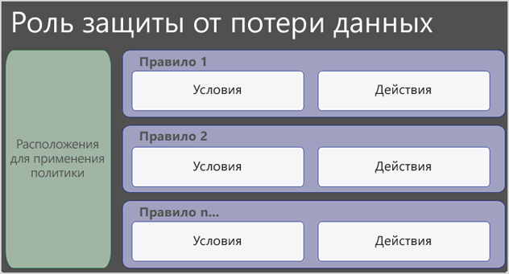
  
### РасположенияLocations

Политика защиты от потери данных может находить и защищать конфиденциальные данные в Office 365, независимо от того, находятся ли эти сведения в Exchange Online, SharePoint Online или OneDrive для бизнеса.A DLP policy can find and protect sensitive information across Office 365, whether that information is located in Exchange Online, SharePoint Online, or OneDrive for Business. Вы можете легко выбрать защиту всех сайтов SharePoint или учетных записей OneDrive, только определенных сайтов или учетных записей, а также всех почтовых ящиков.You can easily choose to protect all SharePoint sites or OneDrive accounts, just specific sites or accounts, or all mailboxes. Обратите внимание, что пока невозможен выбор только почтовых ящиков определенных пользователей.Note that it's not yet possible to select just the mailboxes of specific users.
  

  
Обратите внимание, что при включении или исключении определенных сайтов SharePoint или учетных записей OneDrive политика защиты от потери данных может содержать не более 100 таких включений и исключений.Note that if you choose to include or exclude specific SharePoint sites or OneDrive accounts, a DLP policy can contain no more than 100 such inclusions and exclusions. Несмотря на то, что это предельное значение существует, вы можете превысить это значение, применив политику на уровне Организации или политику, которая применяется ко всем расположениям.Although this limit exists, understand that you can exceed this limit by applying either an org-wide policy or a policy that applies to entire locations.
  
### ПравилаRules

Правила, которые применяют бизнес-требования к контенту Организации.Rules are what enforce your business requirements on your organization's content. Политика содержит одно или несколько правил, а каждое правило состоит из условий и действий.A policy contains one or more rules, and each rule consists of conditions and actions. При выполнении заданных условий действия в рамках правила применяются автоматически.For each rule, when the conditions are met, the actions are taken automatically. Правила выполняются последовательно, начиная с правил с наивысшим приоритетом в каждой политике.Rules are executed sequentially, starting with the highest-priority rule in each policy.
  
Правило также предоставляет параметры для уведомления пользователей (с помощью подсказок политики и уведомлений по электронной почте) и администраторов (с отправкой отчетов об инцидентах электронной почты), что контент соответствует этому правилу.A rule also provides options to notify users (with policy tips and email notifications) and admins (with email incident reports) that content has matched the rule.
  
Ниже приведены компоненты правила, каждое из которых описывается ниже.Here are the components of a rule, each explained below.
  

  
#### УсловияConditions

Условия важны, так как определяют, какие типы информации вы ищете, и когда делать это.Conditions are important because they determine what types of information you're looking for, and when to take an action. Например, можно проигнорировать контент, содержащий номера паспортов, если его содержимое не содержит более десяти таких цифр и предоставлено пользователям, не входящим в вашу организацию.For example, you might choose to ignore content containing passport numbers unless the content contains more than ten such numbers and is shared with people outside your organization.
  
Условия касаются **содержимого**, например, какие типы конфиденциальной информации вы ищете, а также в **контексте**, например доступ к документу.Conditions focus on the **content**, such as what types of sensitive information you're looking for, and also on the **context**, such as who the document is shared with. Вы можете использовать условия для назначения различных действий различным уровням риска — например, конфиденциальный контент, к которому осуществляется внутренний доступ, может быть более низким и требовать меньше действий, чем конфиденциальный контент, предоставленный людям за преличной Организацией.You can use conditions to assign different actions to different risk levels -- for example, sensitive content shared internally might be lower risk and require fewer actions than sensitive content shared with people outside the organization. 
  
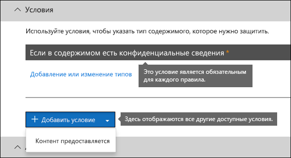
  
С помощью доступных теперь условий можно определить следующее:The conditions now available can determine if:
  
- Содержимое содержит тип конфиденциальной информации.Content contains a type of sensitive information.
    
- Содержимое содержит метку.Content contains a label. Более подробную информацию можно узнать в разделе ниже, [используя метку в качестве условия в политике защиты от потери](data-loss-prevention-policies.md#label)данных.For more information, see the below section [Using a label as a condition in a DLP policy](data-loss-prevention-policies.md#label).
    
- Открыт ли доступ к содержимому для людей не из вашей организации.Content is shared with people outside or inside your organization.
    
#### Типы конфиденциальных данныхTypes of sensitive information

Политика DLP помогает защищать конфиденциальные данные, которые определены как **тип конфиденциальной информации**.A DLP policy can help protect sensitive information, which is defined as a **sensitive information type**. Office 365 включает определения многих распространенных типов конфиденциальной информации в различных доступных для вас регионах, таких как номер кредитной карты, номера банковских счетов, местные ИДЕНТИФИКАЦИОНные номера и номера паспортов.Office 365 includes definitions for many common sensitive information types across many different regions that are ready for you to use, such as a credit card number, bank account numbers, national ID numbers, and passport numbers. 
  
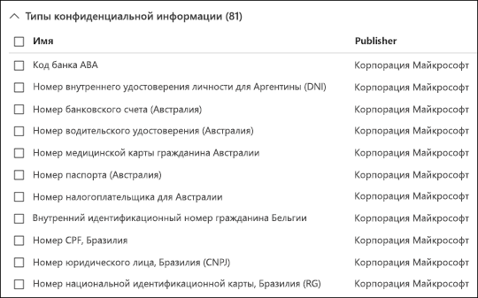
  
Когда политика защиты от потери данных ищет тип конфиденциальной информации, такой как номер кредитной карты, он не просто ищет 16-значное число.When a DLP policy looks for a sensitive information type such as a credit card number, it doesn't simply look for a 16-digit number. Каждый тип конфиденциальных данных определяется и обнаруживается при помощи следующего:Each sensitive information type is defined and detected by using a combination of:
  
- Ключевые словаKeywords
    
- Внутренние функции для проверки контрольных сумм или композицииInternal functions to validate checksums or composition
    
- оценки регулярных выражений для выявления совпадений с шаблонами;Evaluation of regular expressions to find pattern matches
    
- анализа прочего содержимого.Other content examination
    
Это помогает обнаруживать DLP, обеспечивая высокую степень точности, при этом уменьшая число ложных срабатываний, которые могут прерывать работу People.This helps DLP detection achieve a high degree of accuracy while reducing the number of false positives that can interrupt peoples' work.
  
#### ДействияActions

Если содержимое соответствует условию в правиле, можно применить действия для автоматической защиты контента.When content matches a condition in a rule, you can apply actions to automatically protect the content.
  
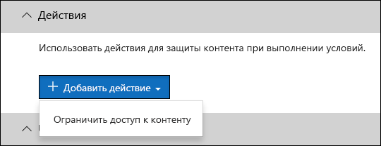
  
Теперь, когда действия доступны, вы можете:With the actions now available, you can:
  
- **Ограничение доступа** к содержимому Для контента сайта это означает, что разрешения для документа ограничены всеми, кроме основного администратора семейства веб-сайтов, владельца документа и пользователя, который последним изменил документ.**Restrict access to the content** For site content, this means that permissions for the document are restricted for everyone except the primary site collection administrator, document owner, and person who last modified the document. Эти пользователи могут удалить конфиденциальную информацию из документа или выполнить другие действия по восвыполнению мультимедиа.These people can remove the sensitive information from the document or take other remedial action. Когда документ вновь будет соответствовать требованиям, исходные разрешения автоматически восстановятся.When the document is in compliance, the original permissions will be automatically restored. Когда доступ к документу блокируется, документ отображается с особым значком подсказки политики в библиотеке на сайте.When access to a document is blocked, the document appears with a special policy tip icon in the library on the site. 
    
    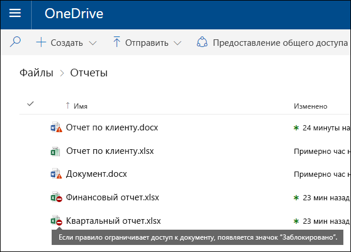
  
    Для содержимого электронной почты это действие блокирует отправку сообщения.For email content, this action blocks the message from being sent. В зависимости от того, как настроено правило защиты от потери данных, отправитель будет видеть отчет о недоСТАВКЕ или (если правило использует уведомление) подсказка политики и/или уведомления по электронной почте.Depending on how the DLP rule is configured, the sender will see an NDR or (if the rule uses a notification) a policy tip and/or email notification.
    
    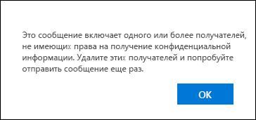
  
#### Уведомления пользователей и переопределения пользовательских параметровUser notifications and user overrides

Вы можете использовать уведомления и переопределения для обучения пользователей политикам защиты от потери данных и обеспечить их соответствие требованиям, не блокируя работу.You can use notifications and overrides to educate your users about DLP policies and help them remain compliant without blocking their work. Например, если пользователь пытается поделиться документом с конфиденциальными сведениями, политика защиты от потери данных может отправлять им уведомления по электронной почте и показывать им подсказку политики в контексте библиотеки документов, что позволяет им переопределять политику, если у них есть бизнес- текста.For example, if a user tries to share a document containing sensitive information, a DLP policy can both send them an email notification and show them a policy tip in the context of the document library that allows them to override the policy if they have a business justification.
  
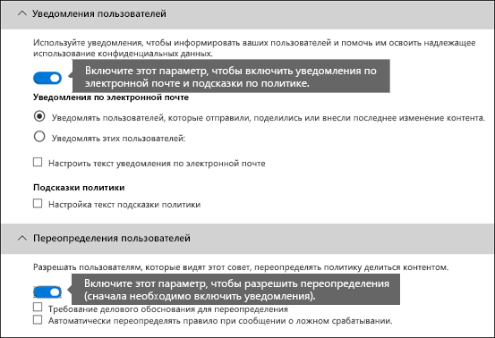
  
Сообщение может уведомлять пользователя, который отправил, предоставил или последним изменил контент, а также для контента сайта, основного администратора семейства веб-сайтов и владельца документа.The email can notify the person who sent, shared, or last modified the content and, for site content, the primary site collection administrator and document owner. Кроме того, вы можете добавить или удалить вхомевер, выбранные из уведомления по электронной почте.In addition, you can add or remove whomever you choose from the email notification.
  
Кроме отправки уведомлений по электронной почте, в уведомлении пользователя отображается подсказка политики:In addition to sending an email notification, a user notification displays a policy tip:
  
- В Outlook 2013 и более поздних версий и Outlook в Интернете.In Outlook 2013 and later and Outlook on the web.
    
- Для документа на сайте SharePoint Online или OneDrive для бизнеса.For the document on a SharePoint Online or OneDrive for Business site.
    
- В Excel 2016, PowerPoint 2016 и Word 2016, когда документ хранится на сайте, включенном в политику защиты от потери данных.In Excel 2016, PowerPoint 2016, and Word 2016, when the document is stored on a site included in a DLP policy.
    
В уведомлении электронной почты и подсказке политики объясняется, почему контент конфликтует с политикой DLP.The email notification and policy tip explain why content conflicts with a DLP policy. При выборе этого параметра уведомления и подсказка политики могут разрешить пользователям переопределять правило, выдавая отчет о ложном срабатывании или деловое обоснование.If you choose, the email notification and policy tip can allow users to override a rule by reporting a false positive or providing a business justification. Это поможет вам проинструктировать пользователей о политиках защиты от потери данных и применяйте их, не мешая работе пользователей.This can help you educate users about your DLP policies and enforce them without preventing people from doing their work. Сведения о переопределениях и ложных срабатываниях также заносятся в журнал для создания отчетов (см. ниже об отчетах DLP) и включаются в отчеты об инцидентах (в следующем разделе), чтобы сотрудник службы соответствия требованиям мог регулярно просматривать эти сведения.Information about overrides and false positives is also logged for reporting (see below about the DLP reports) and included in the incident reports (next section), so that the compliance officer can regularly review this information.
  
Вот как будет выглядеть подсказка политики в учетной записи OneDrive для бизнеса.Here's what a policy tip looks like in a OneDrive for Business account.
  
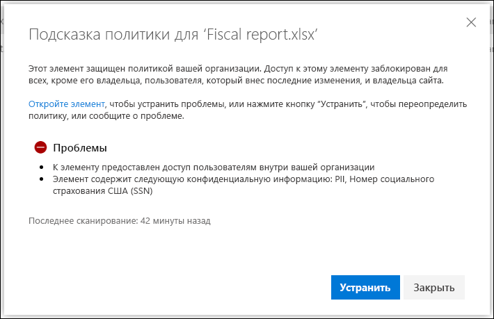
  
#### Отчеты об инцидентахIncident reports

При сопоставлении правила можно отправить отчет об инциденте своему подсистеме контроля соответствия требованиям (или любым другим пользователям) со сведениями о событии.When a rule is matched, you can send an incident report to your compliance officer (or any people you choose) with details of the event. Этот отчет содержит сведения о сопоставляемом элементе, фактическом содержимом, соответствующем правиле, и имени пользователя, который последним изменил содержимое.This report includes information about the item that was matched, the actual content that matched the rule, and the name of the person who last modified the content. Для сообщений электронной почты отчет также включает в себя вложение исходного сообщения, которое соответствует политике защиты от потери данных.For email messages, the report also includes as an attachment the original message that matches a DLP policy.
  
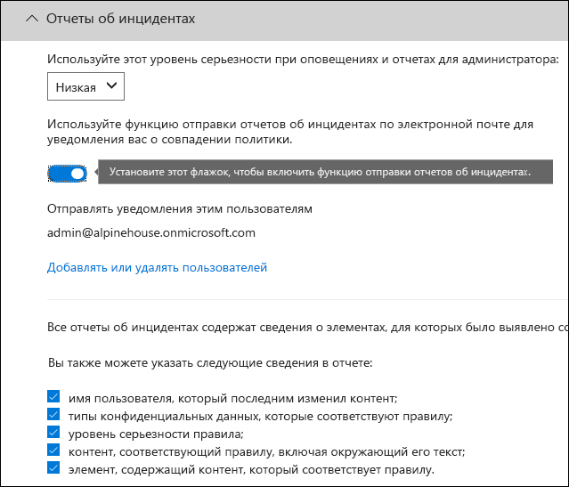
  
## Группирование и логические операторыGrouping and logical operators

Как правило, политика защиты от потери данных имеет несложное требование, например для идентификации всего контента, содержащего номер социального страхования США.Often your DLP policy has a straightforward requirement, such as to identify all content that contains a U.S. Social Security Number. Тем не менее, в других сценариях для политики защиты от потери данных может потребоваться определить более слабо определенные данные.However, in other scenarios, your DLP policy might need to identify more loosely defined data.
  
Например, чтобы определить содержимое, подпадающее под действие страхования здравоохранения США, необходимо выполнить поиск по следующим темам:For example, to identify content subject to the U.S. Health Insurance Act (HIPAA), you need to look for:
  
- Контент, который содержит определенные типы конфиденциальной информации, например номер социального страхования США или номер DEAа для правоохранительных ЛС (США).Content that contains specific types of sensitive information, such as a U.S. Social Security Number or Drug Enforcement Agency (DEA) Number.
    
    ANDAND
    
- Содержимое, которое более трудно определить, например, связь с заботами о пациентах и описаниями медицинских служб.Content that's more difficult to identify, such as communications about a patient's care or descriptions of medical services provided. Для определения этого контента требуются одинаковые ключевые слова из очень больших списков ключевых слов, таких как Международная классификация Diseases (ICD-9-CM или ICD-10-CM).Identifying this content requires matching keywords from very large keyword lists, such as the International Classification of Diseases (ICD-9-CM or ICD-10-CM).
    
Такие слабо определенные данные можно легко определить с помощью группирования и логических операторов (AND, OR).You can easily identify such loosely defined data by using grouping and logical operators (AND, OR). При создании политики защиты от потери данных можно выполнить указанные ниже действия.When you create a DLP policy, you can:
  
- Сгруппируйте типы конфиденциальной информации.Group sensitive information types.
    
- Выберите логический оператор между типами конфиденциальной информации в группе и между самими группами.Choose the logical operator between the sensitive information types within a group and between the groups themselves.
    
### Выбор оператора в группеChoosing the operator within a group

В группе можно указать, должны ли все условия этой группы удовлетворять требованиям к содержимому, соответствующему правилу.Within a group, you can choose whether any or all of the conditions in that group must be satisfied for the content to match the rule.
  
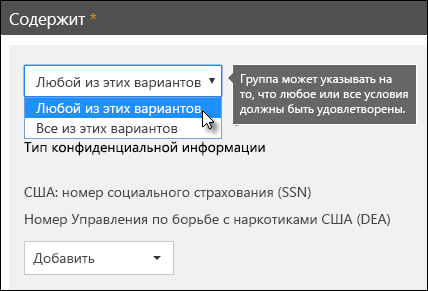
  
### Добавление группыAdding a group

Вы можете быстро добавить группу, которая может иметь собственные условия и операторы в этой группе.You can quickly add a group, which can have its own conditions and operator within that group.
  
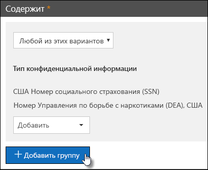
  
### Выбор оператора между группамиChoosing the operator between groups

Между группами можно выбрать, будут ли удовлетворять условиям только одна группа или все группы, удовлетворяющие этому правилу.Between groups, you can choose whether the conditions in just one group or all of the groups must be satisfied for the content to match the rule.
  
Например, встроенная политика HIPAA в **США** имеет правило, которое использует оператор **and** между группами, чтобы определить содержимое, которое содержит:For example, the built-in **U.S. HIPAA** policy has a rule that uses an **AND** operator between the groups so that it identifies content that contains: 
  
- из групповых **идентификаторОв PII** (по крайней мере один номер страхового номера **или** номера DEA);from the group **PII Identifiers** (at least one SSN number **OR** DEA number) 
    
    **AND****AND**
    
- из группы **медицинских терминов** (по крайней мере одно ключевое слово ICD-9-cm **или** ключевое слово ICD-10-cm)from the group **Medical Terms** (at least one ICD-9-CM keyword **OR** ICD-10-CM keyword) 
    
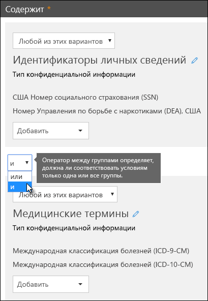
  
## Приоритет, с помощью которого обрабатываются правилаThe priority by which rules are processed

Когда вы создаете правила в политике, каждому правилу назначается приоритет в том порядке, в котором он создается, то есть правило, созданное первым, имеет первый приоритет, правило, созданное вторым, имеет второй приоритет и т. д.When you create rules in a policy, each rule is assigned a priority in the order in which it's created - meaning, the rule created first has first priority, the rule created second has second priority, and so on. После создания правила его приоритет нельзя изменить, за исключением удаления и повторного создания.After you create a rule, its priority can't be changed, except by deleting and re-creating it.
  
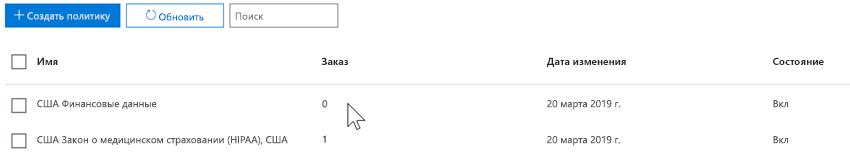
  
Когда содержимое оценивается по правилам, правила обрабатываются в порядке приоритета.When content is evaluated against rules, the rules are processed in priority order. Если содержимое соответствует нескольким правилам, правила обрабатываются в порядке приоритета и применяются наиболее строгие действия.If content matches multiple rules, the rules are processed in priority order and the most restrictive action is enforced. Например, если контент соответствует всем следующим правилам, правило 3 применяется, так как это самый высокий приоритет, наиболее ограничительное правило:For example, if content matches all of the following rules, Rule 3 is enforced because it's the highest priority, most restrictive rule:
  
- Правило 1: только уведомляет пользователейRule 1: only notifies users
    
- Правило 2: уведомляет пользователей, ограничит доступ и разрешает переопределение пользователейRule 2: notifies users, restricts access, and allows user overrides
    
- Правило 3: уведомляет пользователей, запрещает доступ и не допускает переопределения пользователей.Rule 3: notifies users, restricts access, and does not allow user overrides
    
- Правило 4: только уведомляет пользователейRule 4: only notifies users
    
- Правило 5: ограниченный доступRule 5: restricts access
    
- Правило 6: уведомляет пользователей, запрещает доступ и не допускает переопределения пользователей.Rule 6: notifies users, restricts access, and does not allow user overrides
    
В этом примере обратите внимание на то, что соответствия для всех правил записываются в журналы аудита и отображаются в отчетах DLP, несмотря на то что применяется только наиболее ограниченное правило.In this example, note that matches for all of the rules are recorded in the audit logs and shown in the DLP reports, even though only the most restrictive rule is enforced.
  
По отношению к подсказкам политики обратите внимание на следующее:With respect to policy tips, note that:
  
- Только подсказка политики из наивысшего приоритета будет отображаться большинство ограничительных правил.Only the policy tip from the highest priority, most restrictive rule will be shown. Например, подсказка политики из правила, блокирующего доступ к содержимому, будет отображаться на подсказке политики из правила, которое просто отправляет уведомление.For example, a policy tip from a rule that blocks access to content will be shown over a policy tip from a rule that simply sends a notification. Это предотвращает отображение каскадных подсказок политики.This prevents people from seeing a cascade of policy tips.
    
- Если подсказка политики в самом ограниченном правиле разрешает пользователям переопределять правило, то при переопределении этого правила также переопределяются все другие правила, с которыми соблюдается контент.If the policy tips in the most restrictive rule allow people to override the rule, then overriding this rule also overrides any other rules that the content matched.
    
## Настройка правил для упрощения и улучшения их соотнесенияTuning rules to make them easier or harder to match

После создания и включения политик защиты от потери данных пользователи иногда могут столкнуться с этими проблемами:After people create and turn on their DLP policies, they sometimes run into these issues:
  
- Слишком много контента, **не** являющиеся конфиденциальными сведениями, соответствует правилам, не связанным с другими словами, и имеет слишком много ложных срабатываний.Too much content that **is not** sensitive information matches the rules - in other words, too many false positives. 
    
- Слишком мало контента, \*\*\*\* для которого конфиденциальные данные совпадают с правилами, другими словами, защитные действия не применяются к конфиденциальным данным.Too little content that **is** sensitive information matches the rules - in other words, the protective actions aren't being enforced on the sensitive information. 
    
Для решения этих проблем вы можете настроить правила, изменив количество экземпляров и точность согласованности, чтобы сделать контент более сложным или удобным для согласования с правилами.To address these issues, you can tune your rules by adjusting the instance count and match accuracy to make it harder or easier for content to match the rules. Каждый тип конфиденциальной информации, используемый в правиле, имеет число экземпляров и точность согласованности.Each sensitive information type used in a rule has both an instance count and match accuracy.
  
### Число экземпляровInstance count

Число экземпляров означает, сколько экземпляров определенного типа конфиденциальных данных должно присутствовать для контента, соответствующего правилу.Instance count means simply how many occurrences of a specific type of sensitive information must be present for content to match the rule. Например, если в диапазоне от 1 до 9 уникальных в США или Великобритании, то содержимое будет равно указанному ниже правилу.For example, content will match the rule shown below if between 1 and 9 unique U.S. or U.K. номера паспортов определены.passport numbers are identified.
  
Обратите внимание на то, что количество экземпляров включает только **уникальные** соответствия типам и ключевым словам конфиденциальной информации.Note that the instance count includes only **unique** matches for sensitive information types and keywords. Например, если в сообщении электронной почты содержится 10 вхождений одного номера кредитной карты, то это число из 10 экземпляров будет равно одному экземпляру номера кредитной карты.For example, if an email contains 10 occurrences of the same credit card number, those 10 occurrences count as a single instance of a credit card number. 
  
Чтобы настроить правила с количеством экземпляров, руководство является простым:To use instance count to tune rules, the guidance is straightforward:
  
- Чтобы упростить это правило, уменьшите значение **min** Count и/или увеличьте **Максимальное** число.To make the rule easier to match, decrease the **min** count and/or increase the **max** count. Вы также можете задать для параметра **Max** значение **ANY** , удалив числовое значение.You can also set **max** to **any** by deleting the numerical value. 
    
- Чтобы это правило было сложнее, увеличьте **минимальное** количество.To make the rule harder to match, increase the **min** count. 
    
Обычно используются менее ограниченные действия, такие как отправка уведомлений пользователей, в правиле с меньшим количеством экземпляров (например, 1-9).Typically, you use less restrictive actions, such as sending user notifications, in a rule with a lower instance count (for example, 1-9). Кроме того, вы можете использовать более ограниченные действия, такие как ограничение доступа к контенту без разрешения на переопределение, в правиле с более высоким числом экземпляров (например, 10-Any).And you use more restrictive actions, such as restricting access to content without allowing user overrides, in a rule with a higher instance count (for example, 10-any).
  
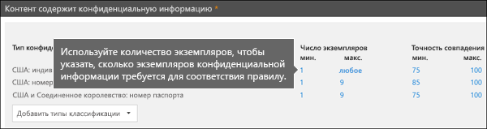
  
### Точность сравненияMatch accuracy

Как было сказано выше, тип конфиденциальной информации определяется и определяется с помощью комбинации различных типов свидетельств.As described above, a sensitive information type is defined and detected by using a combination of different types of evidence. Как правило, тип конфиденциальной информации определяется несколькими такими сочетаниями, называемыми шаблонами.Commonly, a sensitive information type is defined by multiple such combinations, called patterns. Шаблон, для которого требуется меньше свидетельства, имеет меньшую точность соответствия (или уровень вероятности), а для шаблона, для которого требуется больше свидетельств, используется более высокая точность соответствия (или уровень вероятности).A pattern that requires less evidence has a lower match accuracy (or confidence level), while a pattern that requires more evidence has a higher match accuracy (or confidence level). Чтобы узнать больше о фактических шаблонах и уровнях уверенности, используемых каждым типом конфиденциальной информации, посмотрите, [какие типы конфиденциальной информации ищите](what-the-sensitive-information-types-look-for.md).To learn more about the actual patterns and confidence levels used by every sensitive information type, see [What the sensitive information types look for](what-the-sensitive-information-types-look-for.md).
  
Например, тип конфиденциальной информации с именем "номер кредитной карты" определяется двумя шаблонами:For example, the sensitive information type named Credit Card Number is defined by two patterns:
  
- Шаблон с достоверностью 65%, который требует:A pattern with 65% confidence that requires:
    
  - Число в формате номера кредитной карты.A number in the format of a credit card number.
    
  - Число, которое передает контрольную сумму.A number that passes the checksum.
    
- Шаблон с достоверностью 85%, который требует:A pattern with 85% confidence that requires:
    
  - Число в формате номера кредитной карты.A number in the format of a credit card number.
    
  - Число, которое передает контрольную сумму.A number that passes the checksum.
    
  - Ключевое слово или Дата истечения срока действия в правильном формате.A keyword or an expiration date in the right format.
    
Вы можете использовать эти уровни вероятности (или точность соответствия) в правилах.You can use these confidence levels (or match accuracy) in your rules. Как правило, вы используете менее ограниченные действия, такие как отправка уведомлений пользователей, в правиле с меньшим уровнем точности согласованности.Typically, you use less restrictive actions, such as sending user notifications, in a rule with lower match accuracy. Кроме того, вы можете использовать более ограниченные действия, такие как ограничение доступа к содержимому, не разрешив переопределение пользователей, в правиле с более высокой точностью согласованности.And you use more restrictive actions, such as restricting access to content without allowing user overrides, in a rule with higher match accuracy.
  
Важно понимать, что когда определенный тип конфиденциальной информации, например номер кредитной карты, определяется в содержимом, возвращается только один уровень вероятности.It's important to understand that when a specific type of sensitive information, such as a credit card number, is identified in content, only a single confidence level is returned:
  
- Если все соответствия относятся к одному шаблону, возвращается уровень вероятности для этого шаблона.If all of the matches are for a single pattern, the confidence level for that pattern is returned.
    
- Если существуют совпадения для нескольких шаблонов (то есть, существует совпадений с двумя разными уровнями доверия), возвращается уровень вероятности, больший по сравнению с любыми одиночными шаблонами.If there are matches for more than one pattern (i.e., there are matches with two different confidence levels), a confidence level higher than any of the single patterns alone is returned. Это очень сложная часть.This is the tricky part. Например, для кредитной карты при совпадении шаблонов 65% и 85% степень вероятности, возвращаемая для этого типа конфиденциальной информации, превышает 90%, так как больше свидетельства означает более точное доверие.For example, for a credit card, if both the 65% and 85% patterns are matched, the confidence level returned for that sensitive information type is greater than 90% because more evidence means more confidence.
    
Таким образом, если вы хотите создать два взаимно исключительных правила для кредитных карт, один для точности согласования 65%, а другой для точности согласования 85%, то диапазоны для точности для сравнения будут выглядеть следующим образом.So if you want to create two mutually exclusive rules for credit cards, one for the 65% match accuracy and one for the 85% match accuracy, the ranges for match accuracy would look like this. Первое правило выбирает только те соответствия, которые соответствуют шаблону 65%.The first rule picks up only matches of the 65% pattern. Второе правило выбирает совпадения **по крайней мере с одним совпадением по крайней мере с одним** 85% и **потенциально может иметь** другие совпадения с низким уровнем достоверности.The second rule picks up matches with **at least one** 85% match and **can potentially have** other lower-confidence matches. 
  
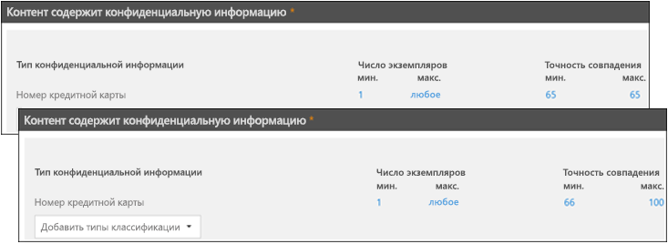
  
По этим причинам вы найдете рекомендации по созданию правил с разными неточностью поиска:For these reasons, the guidance for creating rules with different match accuracies is:
  
- Самый низкий уровень вероятности обычно использует одно и то же значение для **min** и **Max** (а не для диапазона).The lowest confidence level typically uses the same value for **min** and **max** (not a range). 
    
- Максимальный уровень вероятности, как правило, находится в диапазоне от низкого уровня вероятности до 100.The highest confidence level is typically a range from just above the lower confidence level to 100.
    
- Любые уровни вероятности между ними, как правило, находятся в диапазоне от меньшего уровня вероятности до более высокого уровня вероятности.Any in-between confidence levels typically range from just above the lower confidence level to just below the higher confidence level.
    
## Использование метки в качестве условия в политике защиты от потери данныхUsing a label as a condition in a DLP policy

Вы можете создать метку, а затем:You can create a label and then:
  
- **Опубликуйте** его, чтобы пользователи могли видеть метку и вручную применять ее к содержимому.**Publish** it, so that end users can see and manually apply the label to content. 
    
- **Автоматически применять** его к контенту, соответствующему выбранным условиям.**Auto-apply** it to content that matches the conditions that you choose. 
    
Более подробную информацию о метках можно узнать в статье [Обзор меток хранения](labels.md).For more information about labels, see [Overview of retention labels](labels.md).
  
После создания метки можно использовать эту метку в качестве условия в политиках защиты от потери данных.After you create a label, you can then use that label as a condition in your DLP policies. Например, это может потребоваться по следующим причинам:For example, you might want to do this because:
  
- Вы опубликовали метку " **конфиденциальный**", чтобы сотрудники Организации могли вручную применять эту метку к конфиденциальным сообщениям электронной почты и документам.You published a label named **Confidential**, so that people in your organization can manually apply the label to confidential email and documents. Используя эту метку в качестве условия в политике защиты от потери данных, вы можете запретить доступ к \*\*\*\* контенту, помеченному как конфиденциальный от пользователей, не входящих в вашу организацию.By using this label as a condition in your DLP policy, you can restrict content labeled **Confidential** from being shared with people outside your organization. 
    
- Вы создали метку с именем **Alpine House** для проекта с таким именем, а затем автоматически применили эту метку к содержимому, содержащему ключевые слова "Alpine House".You created a label named **Alpine House** for a project of that name, and then applied that label automatically to content containing the keywords "Alpine House". Используя эту метку в качестве условия в политике защиты от потери данных, вы можете отобразить подсказку политики для конечных пользователей, когда они будут предоставлять доступ к этому контенту за прев Организации.By using this label as a condition in your DLP policy, you can show a policy tip to end users when they're about to share this content with someone outside your organization. 
    
- Вы опубликовали метку с именем " **запись налога**", чтобы диспетчер записей мог вручную применить метку к контенту, который необходимо классифицировать в качестве записи.You published a label named **Tax record**, so that your records manager can manually apply the label to content that needs to be classified as a record. Используя эту метку в качестве условия в политике защиты от потери данных, вы можете искать контент с этой меткой в сочетании с другими типами конфиденциальной информации, такими как Итинс или SSNs; применение действий защиты к **налоговой записи**с меткой контента; получить подробные отчеты об активности политики DLP из отчетов о защите от потери данных и журнала аудита.By using this label as a condition in your DLP policy, you can look for content with this label in conjunction with other types of sensitive information such as ITINs or SSNs; apply protection actions to content labeled **Tax record**; and get detailed activity reports about the DLP policy from the DLP reports and audit log data. 
    
- Вы опубликовали метку под названием **руководитель руководства группы** , учитывающую почтовые ящики Exchange и учетные записи OneDrive группы руководителей.You published a label named **Executive Leadership Team - Sensitive** to the Exchange mailboxes and OneDrive accounts of a group of executives. Используя эту метку в качестве условия в политике защиты от потери данных, вы можете принудительно применять действия по хранению и защите для одного и того же подмножества контента и пользователей.By using this label as a condition in your DLP policy, you can enforce both retention and protection actions on the same subset of content and users. 
    
Используя метки в качестве условия в правилах защиты от потери данных, можно выборочно применять действия защиты к определенному набору контента, расположений или пользователей.By using labels as a condition in your DLP rules, can you selectively enforce protection actions on a specific set of content, locations, or users.
  
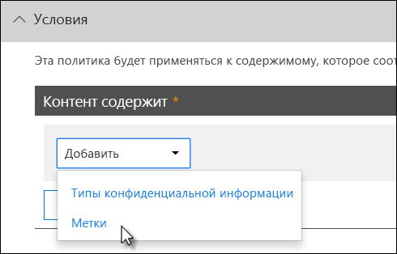

### Поддержка меток конфиденциальности поступаетSupport for sensitivity labels is coming

Обратите внимание, что в настоящее время вы можете использовать только метку хранения в качестве условия, а не [метки конфиденциальности](sensitivity-labels.md).Note that you can currently use only a retention label as a condition, not a [sensitivity label](sensitivity-labels.md). В настоящее время мы работаем над поддержкой использования метки конфиденциальности в этом условии.We're currently working on support for using a sensitivity label in this condition.
  
### Сведения о том, как эта функция связана с другими компонентамиHow this feature relates to other features

К содержимому, содержащему конфиденциальную информацию, можно применить несколько компонентов.Several features can be applied to content containing sensitive information:
  
- [Метка хранения](labels.md#applying-a-retention-label-automatically-based-on-conditions) и [Политика хранения](retention-policies.md) могут принудительно применять действия для **хранения** этого контента.A [retention label](labels.md#applying-a-retention-label-automatically-based-on-conditions) and a [retention policy](retention-policies.md) can both enforce **retention** actions on this content. 
    
- Политика защиты от потери данных может принудительно применять действия по **защите** этого контента.A DLP policy can enforce **protection** actions on this content. Кроме того, перед выполнением этих действий политика защиты от потери данных может потребовать соблюдения других условий в дополнение к содержимому, содержащему метку.And before enforcing these actions, a DLP policy can require other conditions to be met in addition to the content containing a label. 
    
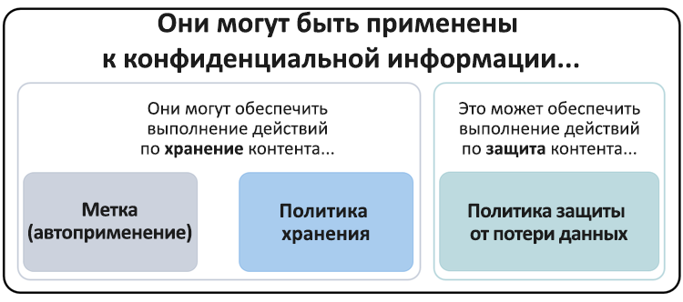
  
Обратите внимание, что политика защиты от потери данных имеет более широкие возможности обнаружения, чем метка или политика хранения, применяемая к конфиденциальным данным.Note that a DLP policy has a richer detection capability than a label or retention policy applied to sensitive information. Политика защиты от потери данных может принудительно применять защитные действия к содержимому, содержащему конфиденциальные сведения, и если конфиденциальная информация удаляется из содержимого, эти защитные действия отменяются при следующем сканировании контента.A DLP policy can enforce protective actions on content containing sensitive information, and if the sensitive information is removed from the content, those protective actions are undone the next time the content's scanned. Но если к контенту, содержащему конфиденциальную информацию, применяется политика хранения или подпись, это одноразовое действие, которое не будет отменено даже в случае удаления конфиденциальной информации.But if a retention policy or label is applied to content containing sensitive information, that's a one-time action that won't be undone even if the sensitive information's removed.
  
Используя метку в качестве условия в политике защиты от потери данных, вы можете принудительно применять действия по хранению и защите для контента с этой меткой.By using a label as a condition in a DLP policy, you can enforce both retention and protection actions on content with that label. Контент, содержащий метку, можно представить точно так же, как контент с конфиденциальной информацией — как подпись, так и тип конфиденциальной информации — это свойства, используемые для классификации контента, чтобы обеспечить выполнение действий над этим содержимым.You can think of content containing a label exactly like content containing sensitive information - both a label and a sensitive information type are properties used to classify content, so that you can enforce actions on that content.
  
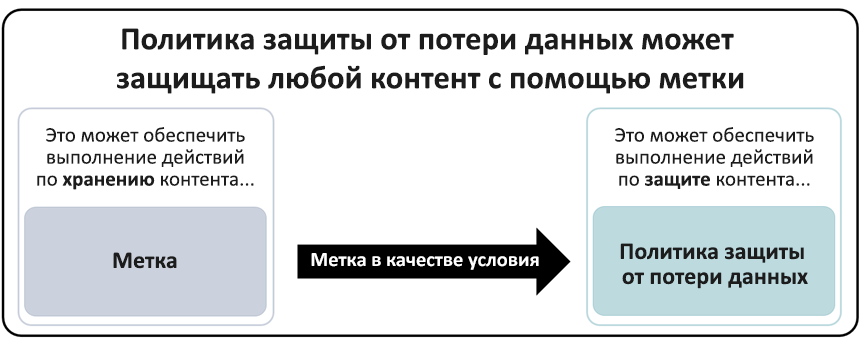
  
## Простые параметры и дополнительные параметрыSimple settings vs. advanced settings

При создании политики защиты от потери данных вы можете выбрать один из простых или дополнительных параметров:When you create a DLP policy, you'll choose between simple or advanced settings:
  
- **Простые параметры** позволяют легко создать наиболее распространенный тип политики защиты от потери данных без использования редактора правил для создания или изменения правил.**Simple settings** make it easy to create the most common type of DLP policy without using the rule editor to create or modify rules. 
    
- **Дополнительные параметры** используйте редактор правил, чтобы предоставить полный контроль над всеми настройками политики защиты от потери данных.**Advanced settings** use the rule editor to give you complete control over every setting for your DLP policy. 
    
Не волнуйтесь, в разделе "простые параметры" и "Дополнительные параметры" работают точно так же, принудительно применяя правила, состоящие из условий и действий, с простыми параметрами, редактор правил не отображается.Don't worry, under the covers, simple settings and advanced settings work exactly the same, by enforcing rules comprised of conditions and actions -- only with simple settings, you don't see the rule editor. Это быстрый способ создания политики защиты от потери данных.It's a quick way to create a DLP policy.
  
### Простые параметрыSimple settings

Наиболее распространенным сценарием защиты от потери данных является создание политики для защиты контента, содержащего конфиденциальную информацию, от пользователей, не входящих в вашу организацию, а также автоматическое изменение таких действий, как ограничение доступа к содержимому. Отправка уведомлений для пользователей и администраторов, а также аудит события для последующего исследования.By far, the most common DLP scenario is creating a policy to help protect content containing sensitive information from being shared with people outside your organization, and taking an automatic remedial action such as restricting who can access the content, sending end-user or admin notifications, and auditing the event for later investigation. Пользователи используют DLP, чтобы предотвратить случайное раскрытие конфиденциальной информации.People use DLP to help prevent the inadvertent disclosure of sensitive information.
  
Чтобы упростить достижение этой цели, при создании политики защиты от потери данных можно выбрать команду **использовать простые параметры**.To simplify achieving this goal, when you create a DLP policy, you can choose **Use simple settings**. Эти параметры обеспечивают все необходимое для реализации наиболее распространенной политики защиты от потери данных без необходимости перехода в редактор правил.These settings provide everything you need to implement the most common DLP policy, without having to go into the rule editor.
  
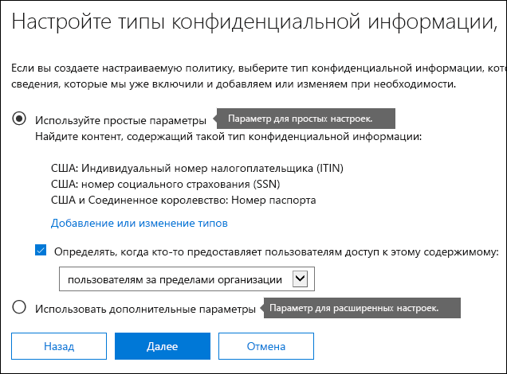
  
### Дополнительные параметрыAdvanced settings

Если требуется создать дополнительные политики защиты от потери данных, можно выбрать вариант **использовать дополнительные параметры**.If you need to create more customized DLP policies, you can choose **Use advanced settings**.
  
Дополнительные параметры представлены в редакторе правил, в котором можно полностью контролировать каждый возможный вариант, в том числе количество экземпляров и точность соответствия (уровень вероятности) для каждого правила.The advanced settings present you with the rule editor, where you have full control over every possible option, including the instance count and match accuracy (confidence level) for each rule.
  
Чтобы быстро перейти к разделу, щелкните элемент в верхней панели навигации редактора правил, чтобы перейти к этому разделу.To jump to a section quickly, click an item in the top navigation of the rule editor to go to that section below.
  
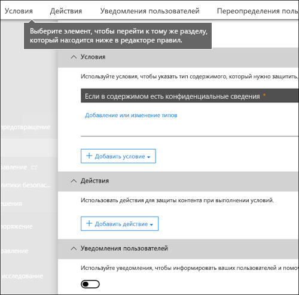
  
## Шаблоны политики DLPDLP policy templates

На первом этапе создания политики DLP выбирается информация, которую необходимо защитить.The first step in creating a DLP policy is choosing what information to protect. Начиная с шаблона защиты от потери данных, вы можете сохранить работу по созданию нового набора правил с нуля и выяснить, какие типы информации следует включить по умолчанию.By starting with a DLP template, you save the work of building a new set of rules from scratch, and figuring out which types of information should be included by default. Затем вы можете добавить или изменить эти требования, чтобы настроить правило в соответствии с конкретными требованиями Организации.You can then add to or modify these requirements to fine tune the rule to meet your organization's specific requirements.
  
Предварительно настроенный шаблон политики DLP поможет определить определенные типы конфиденциальной информации, такие как данные HIPAA, PCI-DSS, Акт Грэмма-Лича-Блили ACT или даже личные данные, зависящие от языковых стандартов (П.И.).A preconfigured DLP policy template can help you detect specific types of sensitive information, such as HIPAA data, PCI-DSS data, Gramm-Leach-Bliley Act data, or even locale-specific personally identifiable information (P.I.). Чтобы упростить поиск и защиту распространенных типов конфиденциальных данных, шаблоны политик, включенные в Office 365, уже содержат наиболее распространенные типы конфиденциальных данных, необходимые для начала работы.To make it easy for you to find and protect common types of sensitive information, the policy templates included in Office 365 already contain the most common sensitive information types necessary for you to get started.
  
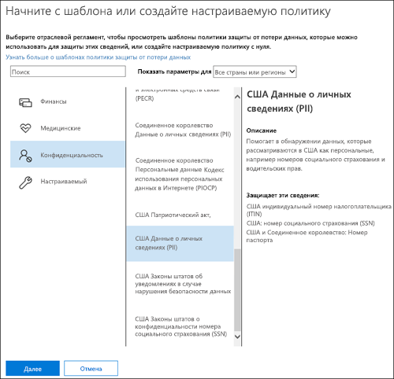
  
У вашей организации также могут быть собственные особые требования, при этом вы можете создать политику защиты от потери данных с нуля, выбрав параметр **настраиваемая политика** .Your organization may also have its own specific requirements, in which case you can create a DLP policy from scratch by choosing the **Custom policy** option. Настраиваемая политика пуста и не содержит правил, которые вы предвнесли.A custom policy is empty and contains no premade rules. 
  
## Внедряйте политики защиты от потери данных постепенно, начиная с тестового режимаRoll out DLP policies gradually with test mode

При создании политик защиты от потери данных их следует проанализировать постепенно, чтобы оценить их влияние и протестировать эффективность, прежде чем они будут полностью принудительно соблюдены.When you create your DLP policies, you should consider rolling them out gradually to assess their impact and test their effectiveness before fully enforcing them. Например, вы не хотите, чтобы новая политика защиты от потери данных случайно блокировала доступ к тысячам документов, к которым пользователям необходим доступ для выполнения своих задач.For example, you don't want a new DLP policy to unintentionally block access to thousands of documents that people require access to in order to get their work done.
  
Если вы создаете политики защиты от потери данных с большим возможным влиянием, рекомендуется выполнить следующую последовательность действий:If you're creating DLP policies with a large potential impact, we recommend following this sequence:
  
1. **Запустите в тестовом режиме без подсказок политики** , а затем используйте отчеты DLP и отчеты об инцидентах, чтобы оценить влияние.**Start in test mode without Policy Tips** and then use the DLP reports and any incident reports to assess the impact. Для просмотра количества, расположения, типа и серьезности совпадений политики можно использовать отчеты политики защиты от потери данных.You can use DLP reports to view the number, location, type, and severity of policy matches. На основании результатов можно настроить правила согласно потребностям.Based on the results, you can fine tune the rules as needed. В тестовом режиме политики защиты от потери данных не влияют на производительность сотрудников вашей организации.In test mode, DLP policies will not impact the productivity of people working in your organization. 
    
2. **Перейти к тестовому режиму с уведомлениями и подсказками политики**, чтобы начать знакомить пользователей с политиками соответствия требованиям вашей организации и подготовить их к введению новых правил. На этом этапе можно также попросить пользователей сообщать о ложных срабатываниях, чтобы сделать правила еще точнее.**Move to Test mode with notifications and Policy Tips** so that you can begin to teach users about your compliance policies and prepare them for the rules that are going to be applied. At this stage, you can also ask users to report false positives so that you can further refine the rules. 
    
3. **Запустите полное принудительное применение политик** , чтобы применить действия в правилах и защищенный контент.**Start full enforcement on the policies** so that the actions in the rules are applied and the content's protected. Продолжайте отслеживать отчеты политики защиты от потери данных и все отчеты об инцидентах или уведомления, чтобы убедиться, что результаты соответствуют вашим потребностям.Continue to monitor the DLP reports and any incident reports or notifications to make sure that the results are what you intend. 
    

  
Политику защиты от потери данных можно отключить в любое время, что влияет на все правила в политике.You can turn off a DLP policy at any time, which affects all rules in the policy. Однако каждое правило также может быть отключено по отдельности с помощью переключения его состояния в редакторе правил.However, each rule can also be turned off individually by toggling its status in the rule editor.
  
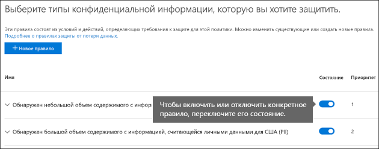
  
## Отчеты DLPDLP reports

После создания и включения политик защиты от потери данных необходимо убедиться, что они работают должным образом и помогут обеспечить соответствие требованиям.After you create and turn on your DLP policies, you'll want to verify that they're working as you intended and helping you stay compliant. С помощью отчетов DLP можно быстро просматривать число политик и совпадений защиты от потери данных с течением времени, а также число ложных срабатываний и переопределений.With DLP reports, you can quickly view the number of DLP policy and rule matches over time, and the number of false positives and overrides. Для каждого отчета можно фильтровать эти соответствия по местоположению, времени и даже сузить их до определенной политики, правила или действия.For each report, you can filter those matches by location, time frame, and even narrow it down to a specific policy, rule, or action.
  
С помощью отчетов DLP вы можете получить бизнес-аналитику и:With the DLP reports, you can get business insights and:
  
- Сосредоточиться на определенных временных промежутках и определить причины скачков и тенденций.Focus on specific time periods and understand the reasons for spikes and trends.
    
- Узнайте бизнес-процессы, которые нарушают политики соответствия требованиям вашей организации.Discover business processes that violate your organization's compliance policies.
    
- Определить влияние политик защиты от потери данных на работу вашей организации.Understand any business impact of the DLP policies.
    
Кроме того, вы можете использовать отчеты DLP для точной настройки политик защиты от потери данных во время их выполнения.In addition, you can use the DLP reports to fine tune your DLP policies as you run them.
  
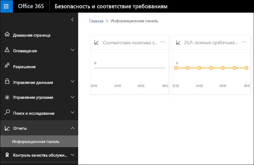
  
## Принципы работы политик защиты от потери данныхHow DLP policies work

DLP определяет конфиденциальную информацию с помощью детального анализа контента (не только для простого сканирования текста).DLP detects sensitive information by using deep content analysis (not just a simple text scan). Этот глубокий анализ контента использует соответствия ключевых слов, словарные совпадения, оценку регулярных выражений, внутренних функций и других методов для обнаружения содержимого, которое соответствует политикам защиты от потери данных.This deep content analysis uses keyword matches, dictionary matches, the evaluation of regular expressions, internal functions, and other methods to detect content that matches your DLP policies. Только небольшой процент данных считается конфиденциальным.Potentially only a small percentage of your data is considered sensitive. Политика защиты от потери данных может определять, отслеживать и автоматически защищать только эти данные, не затрагивая и не влияя пользователей, работающих с остальными контентом.A DLP policy can identify, monitor, and automatically protect just that data, without impeding or affecting people who work with the rest of your content.
  
### Синхронизация политикPolicies are synced

После создания политики защиты от потери данных в центре &amp; безопасности и соответствия требованиям она хранится в центральном хранилище политик, а затем синхронизируется с различными источниками контента, в том числе:After you create a DLP policy in the Security &amp; Compliance Center, it's stored in a central policy store, and then synced to the various content sources, including:
  
- Exchange Online и обратно в Outlook в Интернете и Outlook 2013 и более поздних версийExchange Online, and from there to Outlook on the web and Outlook 2013 and later
    
- Сайты OneDrive для бизнесаOneDrive for Business sites
    
- Сайты SharePoint OnlineSharePoint Online sites
    
- Приложения Office 2016 для настольных ПК (Excel 2016, PowerPoint 2016 и Word 2016)Office 2016 desktop programs (Excel 2016, PowerPoint 2016, and Word 2016)
    
После синхронизации политики с нужными расположениями начинается Оценка контента и выполнение действий.After the policy's synced to the right locations, it starts to evaluate content and enforce actions.
  
### Оценка политики в сайтах OneDrive для бизнеса и SharePoint OnlinePolicy evaluation in OneDrive for Business and SharePoint Online sites

Документы постоянно меняются на всех сайтах SharePoint Online и OneDrive для бизнеса — они постоянно создаются, редактируются, совместно используются и т. д.Across all of your SharePoint Online sites and OneDrive for Business sites, documents are constantly changing — they're continually being created, edited, shared, and so on. Это означает, что документы могут конфликтовать или стать совместимыми с политикой DLP в любое время.This means documents can conflict or become compliant with a DLP policy at any time. Например, пользователь может выложить на сайт группы документ, не содержащий конфиденциальной информации, но затем другой пользователь может изменить этот документ и добавить в него конфиденциальную информацию.For example, a person can upload a document that contains no sensitive information to their team site, but later, a different person can edit the same document and add sensitive information to it.
  
По этой причине политики защиты от потери данных в фоновом режиме часто заверяют наличие документов на соответствие политике.For this reason, DLP policies check documents for policy matches frequently in the background. Это можно считать асинхронным вычислением политики.You can think of this as asynchronous policy evaluation.
  
Вот как это работает.Here's how it works. Когда пользователи добавляют или меняют документы на своих сайтах, поисковая система сканирует содержимое, чтобы можно было выполнить их поиск позже.As people add or change documents in their sites, the search engine scans the content, so that you can search for it later. В этом случае содержимое также проверяется на наличие конфиденциальной информации и проверяет, является ли оно общедоступным.While this is happening, the content's also scanned for sensitive information and to check if it's shared. Все найденные конфиденциальные сведения надежно хранятся в индексе поиска, поэтому только группа соответствия может получить доступ к ней, но не к обычным пользователям.Any sensitive information that's found is stored securely in the search index, so that only the compliance team can access it, but not typical users. Каждая политика защиты от потери данных запускается в фоновом режиме (асинхронно), проверяется часто для любого контента, который соответствует политике, а также для защиты от случайной утечки.Each DLP policy that you've turned on runs in the background (asynchronously), checking search frequently for any content that matches a policy, and applying actions to protect it from inadvertent leaks.
  
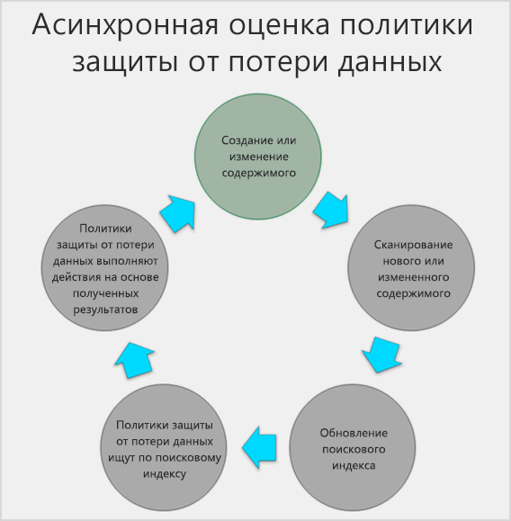
  
Наконец, документы могут конфликтовать с политикой защиты от потери данных, но они также могут стать совместимыми с политикой защиты от потери данных.Finally, documents can conflict with a DLP policy, but they can also become compliant with a DLP policy. Например, если пользователь добавляет в документ номера кредитных карт, это может привести к тому, что политика защиты от потери данных будет автоматически блокировать доступ к документу.For example, if a person adds credit card numbers to a document, it might cause a DLP policy to block access to the document automatically. Но если позже пользователь удалит конфиденциальную информацию, то действие (в данном случае блокируется) будет автоматически отменено при следующем вычислении документа с помощью политики.But if the person later removes the sensitive information, the action (in this case, blocking) is automatically undone the next time the document is evaluated against the policy.
  
DLP оценивает любой контент, который можно индексировать.DLP evaluates any content that can be indexed. Дополнительные сведения о том, какие типы файлов обрабатываются по умолчанию, можно найти [в статье расширения имен файлов для обхода по умолчанию и проанализированные типы файлов в SharePoint Server 2013](https://go.microsoft.com/fwlink/p/?LinkID=627430).For more information on what file types are crawled by default, see [Default crawled file name extensions and parsed file types in SharePoint Server 2013](https://go.microsoft.com/fwlink/p/?LinkID=627430).
  
### Оценка политик в Exchange Online, Outlook 2013 и более поздних версий и Outlook в ИнтернетеPolicy evaluation in Exchange Online, Outlook 2013 and later, and Outlook on the web

При создании политики защиты от потери данных, включающей Exchange Online в качестве расположения, политика синхронизируется из центра соответствия требованиям безопасности &amp; Office 365 в Exchange Online, а затем из Exchange Online в Outlook в Интернете и Outlook 2013 и более поздних версий.When you create a DLP policy that includes Exchange Online as a location, the policy's synced from the Office 365 Security &amp; Compliance Center to Exchange Online, and then from Exchange Online to Outlook on the web and Outlook 2013 and later.
  
При составлении сообщения в Outlook пользователь может видеть подсказки политики, так как создаваемый контент оценивается с помощью политик защиты от потери данных.When a message is being composed in Outlook, the user can see policy tips as the content being created is evaluated against DLP policies. После отправки сообщения он оценивается политиками DLP как обычная часть процесса обработки почты, а также правила для обработки почты Exchange (также называемые правилами транспорта) и политики DLP, созданные в центре администрирования Exchange (Дополнительные сведения см. в следующем разделе).And after a message is sent, it's evaluated against DLP policies as a normal part of mail flow, along with Exchange mail flow rules (also known as transport rules) and DLP policies created in the Exchange admin center (see the next section for more info). Политики защиты от потери данных проверяют как сообщение, так и любые вложения.DLP policies scan both the message and any attachments.
  
### Оценка политики в программах Office 2016 для настольных ПКPolicy evaluation in the Office 2016 desktop programs

Excel 2016, PowerPoint 2016 и Word 2016 включают одинаковую возможность идентификации конфиденциальной информации и применение политик защиты от потери данных в SharePoint Online и OneDrive для бизнеса.Excel 2016, PowerPoint 2016, and Word 2016 include the same capability to identify sensitive information and apply DLP policies as SharePoint Online and OneDrive for Business. Эти программы Office 2016 синхронизируют политики защиты от потери данных непосредственно из центрального хранилища политик, а затем непрерывно оценивают содержимое с помощью политик защиты от потери данных, когда люди работают с документами, открытыми на сайте, включенном в политику защиты от потери данных.These Office 2016 programs sync their DLP policies directly from the central policy store, and then continuously evaluate the content against the DLP policies when people work with documents opened from a site that's included in a DLP policy.
  
Оценка политики защиты от потери данных в Office 2016 разработана без влияния на производительность программ и продуктивности работы людей, работающих над контентом.DLP policy evaluation in Office 2016 is designed not to affect the performance of the programs or the productivity of people working on content. Если они работают над большим документом или компьютер пользователя занят, может потребоваться несколько секунд для отображения подсказки политики.If they're working on a large document, or the user's computer is busy, it might take a few seconds for a policy tip to appear.
  
## РазрешенияPermissions

Членам группы соответствия, которые будут создавать политики защиты от потери данных, необходимы разрешения &amp; на доступ к центру обеспечения безопасности.Members of your compliance team who will create DLP policies need permissions to the Security &amp; Compliance Center. По умолчанию ваш администратор клиента имеет доступ к этому расположению и может предоставлять должностные лица и другие пользователи получать доступ к &amp; центру соответствия требованиям безопасности, не предоставляя всем разрешениям администратора клиента. Для этого рекомендуется выполнить следующие действия:By default, your tenant admin will have access to this location and can give compliance officers and other people access to the Security &amp; Compliance Center, without giving them all of the permissions of a tenant admin. To do this, we recommend that you:
  
1. Создание группы в Office 365 и добавление в нее руководителей соответствия требованиям.Create a group in Office 365 and add compliance officers to it.
    
2. Создайте группу ролей на странице **разрешения** центра безопасности &amp; и соответствия требованиям.Create a role group on the **Permissions** page of the Security &amp; Compliance Center. 
    
3. Добавьте группу Office 365 в группу ролей.Add the Office 365 group to the role group.
    
Для получения дополнительных сведений обратитесь к разделу [предоставление пользователям доступа к центру соответствия требованиям Office 365](grant-access-to-the-security-and-compliance-center.md).For more information, see [Give users access to the Office 365 Compliance Center](grant-access-to-the-security-and-compliance-center.md).
  
Эти разрешения необходимы только для создания и применения политики защиты от потери данных.These permissions are required only to create and apply a DLP policy. Для применения политик не требуется доступ к содержимому.Policy enforcement does not require access to the content.
  
## Поиск командлетов защиты от потери данныхFind the DLP cmdlets

Чтобы использовать большинство командлетов для центра обеспечения безопасности &amp; , необходимо:To use most of the cmdlets for the Security &amp; Compliance Center, you need to:
  
1. [Подключитесь к Центру безопасности и соответствия требованиям Office 365 с помощью удаленного сеанса PowerShell](http://go.microsoft.com/fwlink/?LinkID=799771&amp;clcid=0x409).[Connect to the Office 365 Security &amp; Compliance Center using remote PowerShell](http://go.microsoft.com/fwlink/?LinkID=799771&amp;clcid=0x409)
    
2. Используйте любой из этих [командлетОв центра &amp; безопасности и соответствия требованиям Office 365](http://go.microsoft.com/fwlink/?LinkID=799772&amp;clcid=0x409)Use any of these [Office 365 Security &amp; Compliance Center cmdlets](http://go.microsoft.com/fwlink/?LinkID=799772&amp;clcid=0x409)
    
Однако отчеты DLP требуют извлечения данных из Office 365, в том числе Exchange Online.However, DLP reports need pull data from across Office 365, including Exchange Online. По этой причине командлеты для отчетов DLP доступны в Exchange Online PowerShell, а не в интерфейсе PowerShell центра &amp; обеспечения безопасности.For this reason, the cmdlets for the DLP reports are available in Exchange Online Powershell -- not in Security &amp; Compliance Center Powershell. Таким образом, чтобы использовать командлеты для отчетов DLP, необходимо выполнить следующие действия:Therefore, to use the cmdlets for the DLP reports, you need to:
  
1. [Connect to Exchange Online using remote PowerShellConnect to Exchange Online using remote PowerShell](http://go.microsoft.com/fwlink/?LinkID=799773&amp;clcid=0x409)
    
2. Используйте любой из этих командлетов для отчетов о защите от потери данных:Use any of these cmdlets for the DLP reports:
    
  - [Get — DlpDetectionsReportGet-DlpDetectionsReport](http://go.microsoft.com/fwlink/?LinkID=799774&amp;clcid=0x409)
    
  - [Get — DlpDetailReportGet-DlpDetailReport](http://go.microsoft.com/fwlink/?LinkID=799775&amp;clcid=0x409)
    
## Дополнительные сведенияMore information

- [Создание политики защиты от потери данных на основе шаблонаCreate a DLP policy from a template](create-a-dlp-policy-from-a-template.md)
    
- [Отправка уведомлений и отображение подсказок для политик защиты от потери данныхSend notifications and show policy tips for DLP policies](use-notifications-and-policy-tips.md)
    
- [Создание политики защиты от потери данных для защиты документов с помощью FCI или других свойствCreate a DLP policy to protect documents with FCI or other properties](protect-documents-that-have-fci-or-other-properties.md)
    
- [Что входит в шаблоны политик защиты от потери данныхWhat the DLP policy templates include](what-the-dlp-policy-templates-include.md)
    
- [Что позволяют искать типы конфиденциальной информацииWhat the sensitive information types look for](what-the-sensitive-information-types-look-for.md)
    
- [Сведения, для обнаружения которых используются функции защиты от потери данныхWhat the DLP functions look for](what-the-dlp-functions-look-for.md)
    
- [Создание специальных типов конфиденциальных данныхCreate a custom sensitive information type](create-a-custom-sensitive-information-type.md)
    

