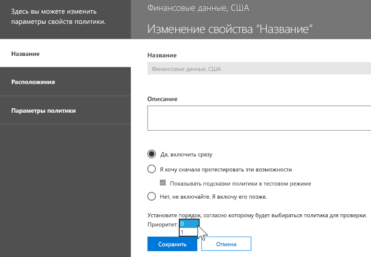
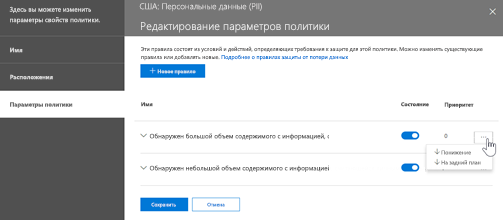

# Обзор функции защиты от потери данных

> [!NOTE]
> Функции защиты от потери данных были недавно добавлены в сообщения чата и каналов Microsoft Teams для пользователей с лицензиями на продукт Office 365 Advanced Compliance, который доступен в качестве отдельной функции и включен в планы Office 365 E5 и "Соответствие требованиям Microsoft 365 E5". Дополнительные сведения о требованиях к лицензированию см. в статье [Рекомендации по лицензированию служб на уровне клиента Microsoft 365](https://docs.microsoft.com/office365/servicedescriptions/microsoft-365-service-descriptions/microsoft-365-tenantlevel-services-licensing-guidance).

Чтобы соответствовать бизнес-стандартам и требованиям отраслевых нормативных актов, организациям необходимо защищать конфиденциальную информацию и не допускать ее раскрытия по неосторожности. Конфиденциальная информация может включать финансовые данные или личные сведения, например номера кредитных карт, номера социального страхования (SSN) или данные медицинских карт. Политика защиты от потери данных в Центре безопасности и соответствия требованиям Office 365 позволяет определять, отслеживать и автоматически защищать конфиденциальную информацию в Office 365.
  
Политика защиты от потери данных предоставляет указанные ниже возможности.
  
- **Выявление конфиденциальной информации во многих расположениях, например в Exchange Online, SharePoint Online, OneDrive для бизнеса и Microsoft Teams.**
    
    Например, вы можете обнаружить любой документ с номером кредитной карты, который хранится на каком-либо сайте OneDrive для бизнеса, а также отслеживать только сайты OneDrive определенных пользователей.
    
- **Предотвращение случайного разглашения конфиденциальной информации**. 
    
    Например, вы можете находить документы с данными медицинских карт, доступ к которым был предоставлен пользователям за пределами вашей организации, а потом автоматически блокировать доступ к ним или запрещать отправку соответствующих электронных писем.
    
- **Отслеживание и защита конфиденциальной информации в полных версиях Excel, PowerPoint и Word.**
    
    В этих программах Office для компьютера есть точно такие же возможности по выявлению конфиденциальной информации и применению политик защиты от потери данных, как и в Exchange Online, SharePoint Online и OneDrive для бизнеса. Когда пользователи обмениваются контентом в этих программах Office, функции защиты от потери данных выполняют постоянный мониторинг.
    
- **Информирование пользователей о способах обеспечения соответствия требованиям без прерывания их рабочих процессов.**
    
    Вы можете рассказать пользователям о политиках защиты от потери данных и о том, что соответствие требованиям не будет мешать их работе. Например, если пользователь пытается предоставить доступ к документу, содержащему конфиденциальную информацию, политика защиты от потери данных может отправить ему уведомление по электронной почте либо в контексте библиотеки документов отобразить подсказку политики, которая позволяет переопределить политику при наличии веской деловой причины. Такие же подсказки политики отображаются и в Outlook в Интернете, в Outlook, Excel, PowerPoint и Word.
    
- **Просмотр отчетов защиты от потери данных со сведениями о контенте, который соответствует условиям политик защиты от потери данных вашей организации.**
    
    Чтобы оценить степень соответствия организации политике защиты от потери данных, можно изучить количество нарушений каждой политики и каждого правила за определенный период. Если политика защиты от потери данных позволяет пользователю переопределять подсказки политики и помечать их как ложные срабатывания, вы также можете просматривать связанные с этим сообщения пользователей.
    
На странице управления защитой от потери данных в Центре безопасности и соответствия требованиям Office 365 вы можете создавать политики защиты от потери данных и управлять ими.
  

  
## Содержимое политики защиты от потери данных

Политика защиты от потери данных содержит несколько основных правил:
  
- Где защищать контент: в таких **расположениях**, как Exchange Online, SharePoint Online и сайты OneDrive для бизнеса, а также в сообщениях чата и каналов Microsoft Teams. 
    
- Когда и как защищать контент путем применения **правил**, состоящих из указанных ниже элементов. 
    
  - **Условия**, которым должен соответствовать контент, чтобы можно было применить правило. Например, можно настроить правило, согласно которому следует выполнять поиск только того контента, который содержит номера социального страхования (SSN), и передается за пределы организации. 
    
  - **Действия**, которые необходимо автоматически выполнять при обнаружении контента, соответствующего заданным условиям. Например, можно настроить правило для блокирования доступа к документу и отправки уведомления по электронной почте пользователю и лицу, ответственному за обеспечение соответствия требованиям. 
    
Вы можете использовать какое-либо правило для выполнения определенного требования защиты, а затем с помощью политики защиты от потери данных сгруппировать стандартные требования к защите, например все правила, необходимые для выполнения требований того или иного нормативного акта.
  
Можно создать политику защиты от потери данных, которая помогает обнаруживать информацию, попадающую под действие акта о передаче и защите данных учреждений здравоохранения (HIPAA). Эта политика поможет защитить данные HIPAA (объект защиты) на всех сайтах SharePoint Online и OneDrive для бизнеса (расположение), выявляя все документы с подобной конфиденциальной информацией, доступ к которым предоставлен пользователям не из вашей организации (условия), а затем блокируя доступ к этим документам и отправляя уведомления (действия). Эти требования хранятся в виде отдельных правил и сгруппированы в политику защиты от потери данных, чтобы упростить управление и создание отчетов.
  

  
### Расположения

Политика защиты от потери данных может находить и защищать конфиденциальную информацию в Office 365 независимо от того, где хранится информация: в Exchange Online, SharePoint Online, OneDrive для бизнеса или в Microsoft Teams. Вы можете включить защиту контента в почте Exchange, в сообщениях чата и каналов Microsoft Teams, а также во всех библиотеках SharePoint или OneDrive либо указать определенные расположения для политики.
  

  
Если вам потребуется включить или исключить определенные сайты SharePoint или учетные записи OneDrive, имейте в виду, что политика защиты от потери данных может содержать не более 100 подобных включений или исключений. Это ограничение можно превысить, применив политику ко всей организации или к целым расположениям.
  
### Правила

Правила — это инструмент применения бизнес-требований к контенту вашей организации. Политика содержит одно или несколько правил, а каждое правило состоит из условий и действий. При выполнении заданных условий действия в рамках правила применяются автоматически. Правила применяются последовательно, начиная с правила с наивысшим приоритетом, в каждой политике.
  
Правила также позволяют уведомлять пользователей (с помощью подсказок политик и по электронной почте) и администраторов (с помощью отчетов об инцидентах, отправляемых по электронной почте) о том, что тот или иной элемент контента попал под действие правила.
  
Ниже перечислены и подробно описаны компоненты правила.
  

  
#### Условия

Условия — важный элемент, так как они определяют, информацию каких типов необходимо искать и когда следует предпринимать действия. Например, вы можете исключить из поиска контент, содержащий номера паспортов, за исключением случаев, когда в контенте содержится не менее 10 таких номеров и к нему предоставлен доступ пользователям за пределами организации.
  
Условия связаны с **контентом**, например с интересующими вас типами конфиденциальной информации, а также с **контекстом**, например с тем, каким пользователям предоставлен доступ к документу. С помощью условий можно назначать разные действия для разных уровней риска. Например, обмен конфиденциальным контентом внутри организации представляет меньший риск и требует меньше действий, чем предоставление доступа к нему пользователям за пределами организации. 
  

  
С помощью доступных теперь условий можно определить следующее:
  
- Контент содержит конфиденциальные данные того или иного типа.
    
- Контент содержит метку. Дополнительные сведения см. ниже в разделе [Использование метки в качестве условия в политике защиты от потери данных](#using-a-label-as-a-condition-in-a-dlp-policy).
    
- Открыт ли доступ к содержимому для людей не из вашей организации.
    
#### Типы конфиденциальной информации

Политика защиты от потери данных помогает защитить сведения, которые относятся к одному из **типов конфиденциальной информации**. В Office 365 имеются определения для многих распространенных типов конфиденциальной информации из различных регионов. Эти определения полностью готовы к использованию и включают номера кредитных карт, номера банковских счетов, национальные идентификационные номера и номера паспортов. 
  

  
Когда политика защиты от потери данных проверяет наличие конфиденциальной информации, например номеров кредитных карт, она не просто ищет шестнадцатизначные числа. Каждый тип конфиденциальных данных определяется и обнаруживается при помощи следующего:
  
- Ключевые слова
    
- 	Внутренние функции для проверки контрольных сумм или структуры
    
- Оценка регулярных выражений для выявления совпадений с шаблонами
    
- анализа прочего содержимого.
    
Это помогает обеспечить высокую точность обнаружения и уменьшить количество ложных срабатываний, которые могут помешать работе сотрудников.
  
#### Действия

Если содержимое соответствует условию правила, вы можете применить определенные действия, чтобы автоматически защитить контент.
  

  
В настоящее время доступны перечисленные ниже действия.
  
- **Ограничение доступа к контенту**. Для содержимого сайта это означает, что разрешения на доступ к документу будут ограничены для всех пользователей за исключением главного администратора семейства веб-сайтов, владельца документа и пользователя, внесшего последние изменения в документ. Эти пользователи могут удалять конфиденциальную информацию из документа или выполнять другие действия по устранению нарушений. Когда документ вновь будет соответствовать требованиям, исходные разрешения будут автоматически восстановлены. Если доступ к документу заблокирован, документ отображается в библиотеке на сайте со специальным значком подсказки политики. 
    
    
  
    Для контента электронной почты это действие запрещает отправку соответствующего сообщения. В зависимости от того, как настроено правило защиты от потери данных, отправитель либо получит отчет о недоставке, либо (если в правиле настроено уведомление) подсказку политики или уведомление по электронной почте.
    
    
  
#### Уведомления и переопределения пользователей

С помощью уведомлений и переопределений вы можете рассказать пользователям о политиках защиты от потери данных и о том, как обеспечить соответствие требованиям, не мешая своей работе. Например, если пользователь пытается предоставить доступ к документу, содержащему конфиденциальную информацию, политика защиты от потери данных может отправить ему уведомление по электронной почте либо в контексте библиотеки документов отобразить подсказку политики, которая позволяет переопределить политику при наличии веской деловой причины.
  

  
Электронное письмо может содержать уведомление для пользователя, который отправил контент, поделился им или внес в него последние изменения. Если речь идет о содержимом сайта, уведомление также может быть отправлено главному администратору семейства веб-сайтов и владельцу документа. Кроме того, вы можете добавить в уведомление электронной почты нужных получателей или удалить их оттуда.
  
Помимо отправки сообщения по электронной почте уведомление для пользователя сопровождается подсказкой политики:
  
- В Outlook и в Outlook в Интернете.
    
- Для документа на сайте SharePoint Online или OneDrive для бизнеса.
    
- В Excel, PowerPoint и Word, когда документ хранится на сайте, на который распространяется действие политики защиты от потери данных.
    
В уведомлении, отправляемом по электронной почте, и в подсказке политики объясняется, почему контент нарушает политику защиты от потери данных. При желании можно сделать так, чтобы уведомления по электронной почте и подсказки политики разрешали пользователям переопределить правило, сообщив о ложном срабатывании или указав бизнес-обоснование. Это поможет вам рассказать пользователям о политиках защиты от потери данных и применять их, не мешая пользователям выполнять свою работу. Сведения о случаях переопределения и ложных срабатываниях также сохраняются для отчетов (см. раздел, посвященный отчетам системы защиты от потери данных, ниже) и включаются в отчеты об инцидентах (см. следующий раздел), чтобы сотрудник, ответственный за обеспечение соответствия требованиям, регулярно мог просматривать эти данные.
  
Вот как выглядит подсказка политики в учетной записи OneDrive для бизнеса:
  

  
#### Отчеты об инцидентах

В случае совпадения с правилом вы можете отправить отчет с подробными сведениями об инциденте лицу, ответственному за соответствие требованиям (или любому другому пользователю). Отчет содержит информацию об объекте, попавшем под действие правила, фактическом элементе контента, а также имени пользователя, которым последним вносил в него изменения. Для электронных писем в отчет включается исходное сообщение, для которого сработала политика защиты от потери данных.
  

  
## Группирование и логические операторы

Зачастую требования политик защиты от потери данных совсем просты: например, иногда достаточно выявлять весь контент, содержащий номера социального страхования (SNN) США. В других случаях данные, которые нужно защитить, определяются гораздо шире.
  
Например, для выявления контента, попадающего под действие акта о передаче и защите данных учреждений здравоохранения HIPAA (США), нужно найти:
  
- данные, которые содержат определенные типы конфиденциальной информации, например номера социального страхования (SSN) или номера Управления по борьбе с наркотиками США (DEA);
    
    И
    
- контент, который определить сложнее, например записи об уходе за пациентом или описания оказанных медицинских услуг. Чтобы выявить такие данные, потребуется выполнить поиск по очень большим спискам ключевых слов, например по Международной классификации болезней (ICD-9-CM или ICD-10-CM).
    
Группировки и логические операторы (И, ИЛИ) помогают отобрать такие широко определяемые данные. При создании политики защиты от потери данных можно:
  
- сгруппировать типы конфиденциальной информации;
    
- выбрать логические операторы, применяемые к типам конфиденциальной информации внутри группы и к самим группам.
    
### Выбор внутригруппового оператора

Для группы можно указать, должны ли быть выполнены все условия, чтобы сработало правило, или достаточно выполнения хотя бы одного из условий.
  

  
### Добавление группы

Вы можете быстро добавить группу, содержащую собственные условия и внутригрупповой оператор.
  

  
### Выбор межгруппового оператора

Для нескольких групп вы можете указать, должны ли выполняться условия во всех группах или только в одной из них, чтобы правило применялось к контенту.
  
Например, во встроенной политике **акта HIPAA ** есть правило, в котором между группами используется оператор **AND** (И). С его помощью отбирают контент, который: 
  
- относится к группе **Идентификаторы личных сведений** (содержит хотя бы один SSN **ИЛИ** номер DEA) 
    
    **И**
    
- к группе **Медицинские термины** (содержит хотя бы одно ключевое слово из ICD-9-CM **ИЛИ** ICD-10-CM). 
    

  
## Приоритет обработки правил

При создании правил политики им назначается приоритет в порядке создания: первое правило получает высший приоритет, второе — второй и т. д. 
  

  
После настройки нескольких политик защиты от потери данных вы можете изменить приоритет одной или нескольких политик. Для этого выберите какую-либо политику, щелкните **Изменить политику** и в списке **Приоритет** укажите приоритет политики.

При проверке соответствия контента правилам правила обрабатываются в порядке их приоритета. Если контент соответствует нескольким правилам, применяется правило с самым строгим действием и самым высоким приоритетом. Например, если контент соответствует всем перечисленным ниже правилам, применяется правило 3, так как это самое строгое правило с самым высоким приоритетом:
  
- Правило 1: только уведомляет пользователей
    
- Правило 2: уведомляет пользователей, ограничивает доступ и разрешает переопределения
    
- Правило 3: уведомляет пользователей, ограничивает доступ и не разрешает переопределения
    
- Правило 4: только уведомляет пользователей
    
- Правило 5: ограничивает доступ
    
- Правило 6: уведомляет пользователей, ограничивает доступ и не разрешает переопределения
    
Обратите внимание на то, что все соответствия правилам регистрируются в журналах аудита и отображаются в отчетах защиты от потери данных, хотя применяется только самое строгое правило.
  
Необходимо учитывать перечисленные ниже моменты, касающиеся подсказок политик.
  
- Подсказка политики отображается только для самого строгого правила с самым высоким приоритетом. Например, вместо подсказки для правила, которое только отправляет уведомление, будет показана подсказка политики для правила, блокирующего доступ к контенту. Это позволяет избежать вывода сразу нескольких подсказок политики.
    
- Если подсказки политики самого строгого правила разрешают пользователям переопределять его, то также будут переопределены все остальные правила, которым соответствует контент.
    
## Настройка более или менее строгих правил

После создания и включения политик защиты от потери данных иногда могут возникать указанные ниже проблемы.
  
- Правилам соответствует слишком больше количество контента, **не являющегося** конфиденциальным, то есть возникает слишком много ложных срабатываний. 
    
- Правилам соответствует слишком малое количество контента, который **является** конфиденциальной информацией. Другими словами, в этом случае не применяются защитные действия для конфиденциальной информации. 
    
Чтобы решить эти проблемы, можно настроить правила, изменив количество экземпляров и точность совпадений. Эти параметры можно задать для каждого типа конфиденциальной информации, который используется в правиле.
  
### Число экземпляров

Это количество экземпляров определенного типа конфиденциальной информации, которые должны присутствовать в контенте. Например, контент будет соответствовать приведенному ниже правилу, если выявлено от 1 до 9 уникальных номеров паспортов США или Соединенного Королевства.
  
Обратите внимание, что количество экземпляров включает только **уникальные** совпадения для типов конфиденциальной информации и ключевых слов. Например, если в сообщении электронной почты 10 раз упоминается один номер кредитной карты, это будет считаться одним совпадением. 
  
Настроить количество экземпляров очень просто.
  
- Чтобы правило стало менее строгим, уменьшите **минимальное** или увеличьте **максимальное** количество. Вы также можете задать для параметра **максимум** значение **любое**, удалив число. 
    
- Чтобы сделать правило более строгим, увеличьте **минимальное** количество. 
    
Обычно для правил с небольшим количеством экземпляров (например, 1–9) используются менее строгие действия, например отправка уведомлений пользователям. Более строгие действия, например ограничение доступа к контенту без возможности переопределения, применяются для правил с большим количеством экземпляров (например, от 10).
  

  
### Точность совпадения

Как говорилось выше, каждый тип конфиденциальных данных определяется на основе свидетельств различного типа. Как правило, тип конфиденциальной информации определяется несколькими такими сочетаниями, которые называются шаблонами. Шаблон, который требует меньше свидетельств, имеет более низкую точность совпадения (вероятность), чем шаблон, требующий больше свидетельств. Дополнительные сведения о шаблонах и вероятностях, которые применяются для каждого из типов конфиденциальной информации, см. в статье [Что позволяют искать типы конфиденциальной информации](what-the-sensitive-information-types-look-for.md).
  
Например, тип конфиденциальной информации для номеров кредитных карт определяется двумя шаблонами:
  
- Шаблон с вероятностью 65%, для которого требуются:
    
  - Число в формате номера кредитной карты.
    
  - Число, соответствующее контрольной сумме.
    
- Шаблон с вероятностью 85%, для которого требуются:
    
  - Число в формате номера кредитной карты.
    
  - Число, соответствующее контрольной сумме.
    
  - Ключевое слово или дата окончания срока действия в правильном формате.
    
Эти значения вероятности (точности совпадения) можно использовать в правилах. Обычно для правил с низкой точностью совпадения используются менее строгие действия, такие как отправка уведомлений пользователям. Более строгие действия, например ограничение доступа к контенту без возможности переопределения, применяются для правил с высокой точностью совпадения.
  
Важно понимать, что при выявлении определенного типа конфиденциальной информации, например номера кредитной карты, система возвращает только одно значение вероятности.
  
- Если все совпадения соответствуют одному шаблону, система возвращает значение вероятности для этого шаблона.
    
- Если совпадают несколько шаблонов (т. е. имеются совпадения с разными значениями вероятности), система возвращает более высокое значение вероятности, чем у каждого из шаблонов. Важно обратить внимание на это. Например, если для кредитной карты совпали шаблоны с вероятностью 65 и 85%, для этого типа конфиденциальной информации возвращается точность совпадения более 90%, так как чем больше свидетельств, тем точнее определение.
    
Поэтому если вы хотите создать два взаимоисключающих правила для кредитных карт с точностью 65 и 85%, диапазоны точности совпадения будут такими: Первое правило получает только результаты для шаблона с вероятностью 65%. Второе правило получает **по крайней мере один** результат с вероятностью 85 % и **может** получить результаты с более низкой вероятностью. 
  

  
По этой причине при создании правил с разной точностью совпадения соблюдайте указанные ниже рекомендации.
  
- Для самой низкой вероятности обычно используется одинаковые **минимальное** и **максимальное** значения (не диапазон). 
    
- Для самой высокой вероятности, как правило, используется диапазон от нижнего значения вероятности до 100.
    
- Промежуточные уровни вероятности обычно либо чуть выше самой низкой вероятности, либо чуть ниже самой высокой вероятности.
    
## Использование метки в качестве условия в политике защиты от потери данных

Вы можете создать метку, а затем:
  
- **опубликовать** ее, чтобы пользователи могли увидеть и вручную применить эту метку к контенту; 
    
- **автоматически применить** ее к контенту, соответствующему выбранным условиям. 
    
Дополнительные сведения о метках см. в статье [Обзор меток хранения](labels.md).
  
Созданную метку можно использовать в качестве условия в политиках защиты от потери данных. Это может быть целесообразно в следующих ситуациях.
  
- Вы опубликовали метку **Конфиденциальная информация**, чтобы сотрудники вашей организации могли вручную применять ее к конфиденциальным документам и электронным письмам. Используя эту метку в качестве условия в политике защиты от потери данных, можно запретить предоставление доступа к контенту с меткой **Конфиденциальная информация** пользователям не из вашей организации. 
    
- Вы создали метку **Альпийский дом** для проекта с таким именем, а затем автоматически применили ее к контенту, содержащему ключевые слова "Альпийский дом". Используя эту метку в качестве условия в политике защиты от потери данных, можно показывать пользователям подсказку политики при попытке предоставления доступа к этому контенту пользователю не из вашей организации. 
    
- Вы опубликовали метку **Налоговая информация**, чтобы делопроизводитель мог вручную применять ее к соответствующему контенту. Используя эту метку в качестве условия в политике защиты от потери данных, можно выполнять поиск контента, который содержит эту метку, вместе с другими типами конфиденциальной информации, например идентификационными номерами налогоплательщиков (ITIN) или номерами социального страхования (SSN), применять действия защиты для контента с меткой **Налоговая информация** и получать подробные отчеты о действиях для политики защиты от потери данных на основе отчетов о защите от потери данных и данных журнала аудита. 
    
- Вы опубликовали метку **Руководство высшего звена — конфиденциальная информация** для почтовых ящиков Exchange и учетных записей OneDrive группы руководителей. Используя эту метку в качестве условия в политике защиты от потери данных, можно применять как действия хранения, так и действия защиты для одного подмножества контента и пользователей. 
    
Используя метки в качестве условия в правилах защиты от потери данных, можно выборочно применять действия защиты для определенного набора контента, расположений или пользователей.
  

### Поддержка меток конфиденциальности появится в ближайшее время

На данный момент в качестве условия можно использовать только метки хранения, а не [метки конфиденциальности](sensitivity-labels.md). Сейчас мы работаем над поддержкой меток конфиденциальности для этого условия.
  
### Связь с другими функциями

Контент, содержащий конфиденциальную информацию, допускает возможность применения нескольких функций.
  
- И [метки хранения](labels.md#applying-a-retention-label-automatically-based-on-conditions), и [политика хранения](retention-policies.md) могут запускать действия **хранения** для этого контента. 
    
- Политика защиты от потери данных может применять действия **защиты** для этого контента. Для применения этих действий политике может потребоваться выполнение дополнительных условий (помимо наличия метки у контента). 
    

  
Обратите внимание: политика защиты от потери данных обеспечивает более широкие возможности для обнаружения, чем метка или политика хранения, примененные к конфиденциальной информации. Политика защиты от потери данных может применять действия защиты к контенту, содержащему конфиденциальную информацию, а в случае удаления конфиденциальной информации из контента отменять эти действия при следующей проверке контента. Применение политики хранения или метки к контенту, содержащему конфиденциальную информацию, — однократное действие, которое не будет отменено даже в случае удаления этой информации.
  
Используя метку в качестве условия в политике защиты от потери данных, можно применять как действия хранения, так и действия защиты к контенту, содержащему эту метку. Контент, содержащий метку, можно воспринимать точно так же, как контент, содержащий конфиденциальную информацию, так как и метка, и тип конфиденциальной информации — это свойства, используемые для классификации контента, чтобы к нему можно было применять действия.
  

  
## Простые и дополнительные параметры

При создании политики от защиты от потери данных можно выбирать простые или дополнительные параметры.
  
- С помощью **простых параметров** можно легко создавать простые политики защиты от потери данных, не создавая и не редактируя правила с помощью редактора. 
    
- С помощью **дополнительных параметров** можно настраивать все аспекты применения политики в редакторе правил. 
    
По сути, простые и дополнительные параметры работают по одному принципу: они применяют правила, состоящие из условий и действий. Разница заключается в том, что при работе с простыми параметрами не отображается редактор правил. Это быстрый способ создания политики защиты от потери данных.
  
### Простые параметры

Средства защиты от потери данных чаще всего используются для создания политик, которые предохраняют важную информацию от несанкционированного доступа к ней людей за пределами организации и реализуют соответствующие меры безопасности (например, блокируют доступ к контенту для определенных лиц, рассылают уведомления конечным пользователям и администраторам, а также позволяют проводить расследование происшествий). Инструменты защиты от потери данных позволяют исключить непреднамеренное раскрытие важных или конфиденциальных сведений.
  
Чтобы облегчить эту задачу, при создании политики защиты от потери данных можно **использовать простые параметры**. В этом режиме вы можете создать политику, в которой есть все необходимое, не используя редактор правил.
  

  
### Дополнительные параметры

Если вам необходимы расширенные настройки защиты от потери данных, **используйте дополнительные параметры**.
  
В этом режиме вам доступен редактор правил, в котором можно задать для каждого правила все возможные параметры, включая количество вхождений и точность совпадения (вероятность).
  
Чтобы быстро перейти к нужному разделу, выберите соответствующий элемент на верхней панели навигации редактора.
  

  
## Шаблоны политики защиты от потери данных

Первое действие при создании политики защиты от потери данных — выбор информации, которую нужно защитить. Использование шаблона защиты от потери данных позволяет не создавать новый набор правил с нуля и не выяснять, какие типы информации необходимо включить по умолчанию. Затем вы можете добавить или изменить требования для точной настройки правила в соответствии с требованиями организации.
  
С помощью предварительно настроенного шаблона политики защиты от потери данных можно выявлять определенные типы конфиденциальной информации, например данные HIPAA, PCI-DSS, Акта Грэма-Лича-Блили или даже личные сведения в зависимости от региона. Чтобы упростить поиск и защиту распространенных типов конфиденциальной информации, шаблоны политик, включенные в Office 365, уже содержат самые распространенные типы конфиденциальной информации, необходимые для начала работы.
  

  
У вашей организации могут быть собственные уникальные требования. В этом случае вы можете создать политику защиты от потери данных с нуля, выбрав вариант **Пользовательская политика**. Настраиваемая политика создается с нуля и не содержит никаких готовых правил. 
  
## Постепенное внедрение политик защиты от потери данных с помощью тестового режима

При создании политик защиты от потери данных следует внедрять их постепенно, чтобы оценить их влияние и эффективность перед полноценным развертыванием. Например, нежелательно, чтобы новая политика защиты от потери данных случайно заблокировала доступ к тысячам документов, которые нужны пользователям в рабочих целях.
  
При создании политик защиты от потери данных с потенциально мощным влиянием рекомендуется выполнить указанные ниже действия.
  
1. **Начните работу в тестовом режиме без подсказок политики**, а затем оцените влияние политики с помощью отчетов системы защиты от потери данных и отчетов об инцидентах. В них содержатся сведения о количестве, расположении, типе и серьезности совпадений. Вы можете настроить правила с учетом результатов. В тестовом режиме политики защиты от потери данных не влияют на производительность сотрудников вашей организации. 
    
2. **Переключитесь в тестовый режим с уведомлениями и подсказками политики**, чтобы начать знакомить пользователей с политиками соответствия требованиям вашей организации и подготовить их к введению новых правил. На этом этапе можно также попросить пользователей сообщать о ложных срабатываниях, чтобы сделать правила еще точнее. 
    
3. **Начните применять политики в полном объеме**, чтобы защищать контент с помощью действий, заданных в правилах. Продолжайте отслеживать отчеты системы защиты от потери данных и все отчеты об инцидентах или уведомления, чтобы убедиться в соответствии результатов вашим потребностям. 
    

  
Вы можете в любой момент отключить политику защиты от потери данных. При этом будут отключены все правила в политике. Тем не менее каждое правило можно отключить отдельно от других, переключив его состояние в редакторе правил.
  

Вы также можете изменить приоритет нескольких правил в политике. Чтобы сделать это, откройте политику для редактирования. В строке правила щелкните многоточие (**...**) и выберите один из вариантов, например **Переместить вниз** или **Поместить в конец**.

  
## Отчеты DLP

После создания и включения политик защиты от потери данных вам потребуется убедиться, что они работают так, как нужно, и помогают обеспечивать соответствие требованиям. В отчетах политики защиты от потери данных можно быстро просмотреть количество срабатываний политик и правил, а также количество ложных срабатываний и переопределений. Для каждого отчета можно отфильтровать эти совпадения по расположению, временному интервалу или даже конкретной политике, правилу или действию.
  
С помощью отчетов защиты от потери данных можно получить важные данные, а также:
  
- Сконцентрироваться на определенных временных промежутках и определить причины скачков и тенденций.
    
- Выявить бизнес-процессы, которые нарушают политики соответствия требованиям вашей организации.
    
- Определить влияние политик защиты от потери данных на работу вашей организации.
    
Кроме того, вы можете использовать отчеты для точной настройки политик защиты от потери данных во время их работы.
  

  
## Принципы работы политик защиты от потери данных

Политика определяет конфиденциальные сведения с помощью глубокого анализа содержимого (а не простого сканирования текста). Для выявления содержимого, нарушающего ваши политики защиты от потери данных, при углубленном анализе применяются ключевые слова, словарные совпадения, оценка регулярных выражений, внутренние функции и другие методы. Ожидается, что лишь небольшой процент данных будет считаться конфиденциальной информацией. Политика защиты от потери данных может выявлять, отслеживать и автоматически защищать только эти данные, не мешая работе пользователей с остальным контентом.
  
### Политики синхронизируются

После создания политики защиты от потери данных в Центре безопасности и соответствия требованиям она сохраняется в центральном хранилище политик, а затем синхронизируется с различными источниками контента, включая следующие:
  
- Exchange Online и оттуда с Outlook в Интернете и Outlook;
    
- сайты OneDrive для бизнеса;
    
- сайты SharePoint Online;
    
- классические приложения Office (Excel, PowerPoint и Word);

- сообщениях каналов и чата Microsoft Teams.
    
После синхронизации политики с нужными расположениями она начинает оценивать контент и выполнять действия.
  
### Оценки политики на сайтах OneDrive для бизнеса и SharePoint Online

Документы на всех ваших сайтах SharePoint Online и OneDrive для бизнеса постоянно изменяются — их непрерывно создают, редактируют, совместно используют, перемещают и т. д. Это означает, что в любой момент документы могут нарушить политику защиты от потери данных или вновь начать соответствовать ей. Например, пользователь может выложить на сайт группы документ, не содержащий конфиденциальной информации, но затем другой пользователь может изменить этот документ и добавить в него такие сведения.
  
По этой причине политики защиты от потери данных регулярно проверяют документы на совпадения с политиками в фоновом режиме. Это можно представить как асинхронный процесс оценки политики.
  
#### Принципы работы
 
По мере того как пользователи добавляют или редактируют документы на своих сайтах, поисковая система сканирует содержимое, чтобы его можно было найти позже. При этом система также сканирует контент на наличие конфиденциальной информации и предоставленного к нему доступа. Вся найденная конфиденциальная информация безопасно сохраняется в индексе поиска, чтобы она были доступна только группе специалистов по соответствию требованиям, а не обычным пользователям. Каждая включенная политика защиты от потери данных работает в фоновом режиме (асинхронно), регулярно проверяя контент на совпадения с условиями политики и применяя действия для защиты этого контента от непреднамеренного разглашения.
  

  
И, наконец, документы могут не только нарушать политику защиты от потери данных, но и вновь начать соответствовать ей. Например, если пользователь добавляет в документ номера кредитных карт, политика защиты от потери данных может автоматически заблокировать доступ к документу. Но если затем пользователь удалит конфиденциальную информацию, примененное ранее действие (в этом случае блокировка) будет отменено при следующей оценки политики.
  
Система защиты от потери данных оценивает любой контент, который можно индексировать. Дополнительные сведения о типах файлов, для которых по умолчанию выполняется обход контента, см. в статье [Анализируемые типы файлов и расширения имен файлов для обхода по умолчанию в SharePoint Server](https://docs.microsoft.com/SharePoint/technical-reference/default-crawled-file-name-extensions-and-parsed-file-types).
  
### Оценка политик в Exchange Online, Outlook и Outlook в Интернете

При создании политики защиты от потери данных, действие которой распространяется на Exchange Online как на расположение, эта параметры этой политики будут синхронизироваться из Центра безопасности и соответствия требованиям Office 365 в Exchange Online, а затем из Exchange Online в Outlook в Интернете и Outlook.
  
Когда пользователь создает сообщение в Outlook, система анализирует содержимое сообщения на соответствие политикам защиты от потери данных и отображает подсказки политик для пользователя. После отправки сообщения система проверяет его на соответствие политикам защиты от потери данных в рамках обычного потока обработки почты. Кроме того, система проверяет его на соответствие правилам потока обработки почты Exchange (правилам транспорта) и политикам защиты от потери данных, созданным в Центре администрирования Exchange. Политики защиты от потери данных проверяют как само сообщение, так и все его вложения.
  
### Оценка политик в классических приложениях Office

В Excel, PowerPoint и Word имеются такие же возможности для выявления конфиденциальной информации и применения политик защиты от потери данных, что и в SharePoint Online и OneDrive для бизнеса. Эти приложения Office синхронизируют свои политики защиты от потери данных непосредственно из центрального хранилища политик, а затем непрерывно проверяют контент на соответствие политикам, когда пользователи работают с документами, открытыми с сайта, включенного в политику.
  
Операции проверки, выполняемые политикой защиты от потери данных в Office, не влияют на производительность программ и эффективность работы сотрудников с контентом. Если пользователь работает с большим документом или его компьютер занят, подсказка политики может появиться спустя несколько секунд.

### Оценка политик в Microsoft Teams
 
Когда вы создаете политику защиты от потери данных, действие которой распространяется на Microsoft Teams, как на расположение, эта политика синхронизируется из Центра безопасности и соответствия требованиям Office 365 в учетные записи пользователей и сообщения в каналах и чатах Microsoft Teams. В зависимости от параметров политик защиты от потери данных, когда какой-либо пользователь пытается поделиться конфиденциальной информацией в сообщении чата или канала Microsoft Teams, сообщение может быть заблокировано или отозвано. Кроме того, документы с конфиденциальной информацией, доступ к которым предоставлен гостевым (внешним) пользователям, не будут открываться для этих пользователей. Дополнительные сведения см. в статье [Защита от потери данных и Microsoft Teams](dlp-microsoft-teams.md).
 
## Разрешения

Участникам группы по обеспечению соответствия требованиям, которые будут создавать политики защиты от потери данных, потребуются разрешения для работы в Центре безопасности и соответствия требованиям. По умолчанию администратор клиента имеет доступ к этому расположению и может предоставлять сотрудникам, ответственным за обеспечение соответствия требованиям, и другим пользователям доступ к Центру безопасности и соответствия требованиям, не предоставляя им все разрешения администратора клиента. Для этого рекомендуется выполнить указанные ниже действия.
  
1. Создайте группу в Office 365 и добавьте в нее сотрудников, ответственных за обеспечение соответствия требованиям.
    
2. Создайте группу ролей на странице **Разрешения** в Центре безопасности и соответствия требованиям. 
    
3. Добавьте группу Office 365 в эту группу ролей.
    
Дополнительные сведения см. в статье [Предоставление пользователям доступа к Центру безопасности и соответствия требованиям Office 365](grant-access-to-the-security-and-compliance-center.md).
  
Эти разрешения необходимы только для создания и применения политики защиты от потери данных. Для применения политики не требуется доступ к контенту.
  
## Найдите командлеты для защиты от потери данных

Чтобы можно было использовать большинство командлетов в Центре безопасности и соответствия требованиям, необходимо выполнить указанные ниже действия.
  
1. [Подключитесь к Центру безопасности и соответствия требованиям Office 365 с помощью удаленного сеанса PowerShell](https://docs.microsoft.com/powershell/exchange/office-365-scc/connect-to-scc-powershell/connect-to-scc-powershell?view=exchange-ps)
    
2. Воспользуйтесь любыми из этих [командлетов policy-and-compliance-dlp](https://docs.microsoft.com/powershell/module/exchange/policy-and-compliance-dlp/export-dlppolicycollection?view=exchange-ps)
    
При этом, чтобы создавать отчеты со сведениями о защите от потери данных, системе потребуется получать данные из Office 365, в том числе из Exchange Online. По этой причине **командлеты для отчетов со сведениями о защите от потери данных доступны в Powershell в Exchange Online, а не только в Powershell в Центре безопасности и соответствия требованиям**. Поэтому, чтобы можно было использовать эти командлеты для отчетов со сведениями о защите от потери данных, необходимо выполнить указанные действия.
  
1. [Подключитесь к Exchange Online с помощью удаленного сеанса PowerShell](https://docs.microsoft.com/powershell/exchange/exchange-online/connect-to-exchange-online-powershell/connect-to-exchange-online-powershell?view=exchange-ps).
    
2. Используйте следующие командлеты для отчетов со сведениями о защите от потери данных:
    
  - [Get-DlpDetectionsReport](https://docs.microsoft.com/powershell/module/exchange/policy-and-compliance-dlp/Get-DlpDetectionsReport?view=exchange-ps)
    
  - [Get-DlpDetailReport](https://docs.microsoft.com/powershell/module/exchange/policy-and-compliance-dlp/Get-DlpDetailReport?view=exchange-ps)
    
## Дополнительные сведения

- [Создание политики защиты от потери данных на основе шаблона](create-a-dlp-policy-from-a-template.md)
    
- [Отправка уведомлений и отображение подсказок политик защиты от потери данных](use-notifications-and-policy-tips.md)
    
- [Создание политики защиты от потери данных для защиты документов с помощью FCI или других свойств](protect-documents-that-have-fci-or-other-properties.md)
    
- [Что входит в шаблоны политики защиты от потери данных](what-the-dlp-policy-templates-include.md)
    
- [Что позволяют искать типы конфиденциальной информации](what-the-sensitive-information-types-look-for.md)
    
- [Сведения, для обнаружения которых используются функции защиты от потери данных](what-the-dlp-functions-look-for.md)
    
- [Создание пользовательского типа конфиденциальных данных](create-a-custom-sensitive-information-type.md)
    

