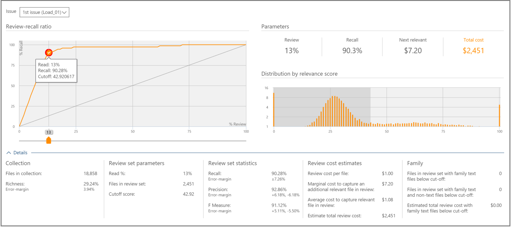

# Решение на основе результатов в Office 365 Advanced eDiscovery

> [!NOTE]
> Чтобы можно было использовать Advanced eDiscovery, требуется подписка на Office 365 E3 с надстройкой Advanced Compliance или E5 для организации. Если у вас этого плана нет и вы хотите попробовать Advanced eDiscovery, можете [зарегистрироваться для получения пробной версии Office 365 корпоративный E5](https://go.microsoft.com/fwlink/p/?LinkID=698279). 
  
 В Advanced eDiscovery на вкладке "выбор" представлены дополнительные сведения о просмотре и использовании статистики поддержки принятия решений для определения размера набора проверки файлов вариантов. 
  
## Использование вкладки "выбор"

  
Эта вкладка содержит следующие компоненты:
  
- **Вопрос**: отсюда можно выбрать вопрос из списка. 
    
- **Коэффициент отзыва**: сравнение расширенного анализа обнаружения электронных данных в соответствии со степенью релевантности. Точка отсчета на диаграмме указывает процент файлов для проверки, сопоставленных с показателем релевантности. Он используется на этапе тестирования релевантности и в качестве порога экспорта для отбора. Точка отсчета по умолчанию для числа файлов, которые необходимо проверить, находится в точке, в которой оптимальным считается баланс между отзывами и точностью. Фактическая точка отсечки должна быть определена пользователем в зависимости от целей и компромиссных затрат (% пересмотра) и риска (% отозвать). С помощью ползунка вы можете настроить точку отсечки и увидеть, как на диаграмме и в параметрах извлекать процент релевантных файлов и перед проверкой принятия решения.
    
- **Параметры**: "Проверка", "отозвать", "следующие релевантные" и "Общие затраты" — это совокупная вычисленная статистика, относящаяся к набору проверки по отношению к коллекции для всего случая. Для этих параметров определены следующие определения:
    
    **Обзор**: процент файлов для проверки на основе этой отсечки. 
    
    **Отзыв**: процент релевантных файлов в наборе проверки. 
    
    **Следующий релевантный**: затраты на проверку и определение дополнительного релевантного файла, который в настоящее время не является набором рецензирования. 
    
    **Общие затраты**: затраты для просмотра этого процента файлов вариантов. Настройки параметров затрат можно задать с помощью диспетчера вариантов.
    
- **Распределение по показателю релевантности**: файлы в темно-сером дисплее слева расположены под показателем отсечки. Всплывающая подсказка отображает показатель релевантности и связанный с ними процент файлов в наборе контрольных файлов по отношению к общему количеству файлов.
    
В области расширенных сведений отображаются дополнительные сведения. Файлы в рисунках коллекции не включают пустые или небулаус файлы. На рисунках с семейными файлами представлены файлы, которые не загружаются по релевантности, но по-прежнему считаются частью семейства.
  
## См. также

[Office 365 Advanced eDiscovery](office-365-advanced-ediscovery.md)
  
[Понимание оценки релевантности](assessment-in-relevance-in-advanced-ediscovery.md)
  
[Маркировка и оценка](tagging-and-relevance-training-in-advanced-ediscovery.md)
  
[Обучение по релевантности](tagging-and-assessment-in-advanced-ediscovery.md)
  
[Анализ релевантности отслеживания](track-relevance-analysis-in-advanced-ediscovery.md)
  
[Анализ релевантности тестирования](test-relevance-analysis-in-advanced-ediscovery.md)

