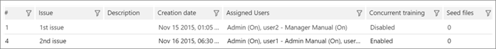

# Определение проблем и назначение пользователей в Office 365 Advanced eDiscovery

> [!NOTE]
> Чтобы можно было использовать Advanced eDiscovery, требуется подписка на Office 365 E3 с надстройкой Advanced Compliance или E5 для организации. Если у вас этого плана нет и вы хотите попробовать Advanced eDiscovery, можете [зарегистрироваться для получения пробной версии Office 365 корпоративный E5](https://go.microsoft.com/fwlink/p/?LinkID=698279). 
  
В Advanced eDiscovery можно определить одну или несколько проблем в случае. Определение проблем позволяет дальнейшую категоризацию разделов. При подключении к новому случаю предоставляется одна ошибка по умолчанию. Вы можете изменить имя вопроса по умолчанию и назначить пользователям эту ошибку. 
  
## Добавление или изменение вопроса и назначение пользователей

1. На \> вкладке **Настройка \> релевантности** выберите **проблемы**.
    
    
  
2. Чтобы добавить ошибку, щелкните значок * * + * *. Отобразится диалоговое окно **Добавление вопроса** . 
    
    
  
    Чтобы изменить ошибку, щелкните значок " **изменить** ". 
    
3. В поле **имя вопроса**введите имя, которое будет описательным и существенным для случая. 
    
4. В поле **Описание**введите сведения об ошибке.
    
5. Установите флажок **включить параллельное обучение** , чтобы включить параметр. Этот параметр позволяет нескольким проверяющим работать одновременно с одной и той же ошибкой (в отдельных примерах). 
    
6. В разделе **Назначение пользователей для**выпусков в списке **все пользователи** выберите пользователя, которого требуется назначить этой ошибке, а затем щелкните стрелку справа, чтобы добавить пользователя в список **Выбранные пользователи** . При необходимости повторите операцию. В указанном выше окне "Администратор" отображается как выбранный пользователь. 
    
    > [!NOTE]
    > Назначение пользователей проблемам можно изменить до или после цикла обучения релевантности. 
  
7. В разделе **Выбранные пользователи**из раскрывающегося списка рядом с именем выбранного пользователя выберите один из следующих режимов выборки: 
    
  - **Вкл**. файлы можно просматривать и размечать тегами. Это устанавливается по умолчанию.
    
  - **Бездействие**: файлы можно просматривать; Теги являются необязательными.
    
  - **Выкл**. файлы невозможно просмотреть или пометить тегами.
    
8. По завершении добавления проблем нажмите кнопку **ОК**.
    
## Удаление проблем

Проблемы могут быть удалены (то есть удалены из базы данных) только сразу после того, как они были определены и не выполнены никакие фактические трудозатраты для этой проблемы. 
  
1. На вкладке **Настройка \> релевантности** выберите пункт **проблемы**.
    
2. Выберите ошибку для удаления из базы данных, а затем нажмите кнопку **Удалить**.
    
3. Отобразится сообщение С запросом на подтверждение. Нажмите кнопку **Да** для подтверждения. 
    
4. Нажмите кнопку **ОК**.
    
## См. также

[Office 365 Advanced eDiscovery](office-365-advanced-ediscovery.md)
  
[Настройка полных пакетов для добавления импортированных файлов](set-up-loads-to-add-imported-files.md)
  
[Определение выделенных ключевых слов и дополнительных параметров](define-highlighted-keywords-and-advanced-options.md)

