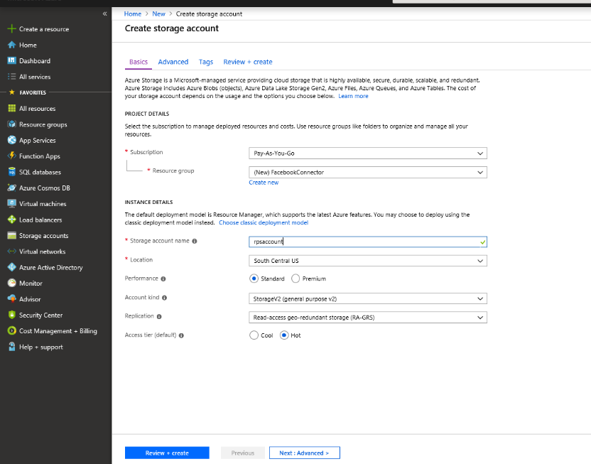

# Развертывание соединителя для архивации данных Facebook в Office 365Deploy a connector to archive Facebook data in Office 365

В этой статье представлено пошаговое руководство по развертыванию соединителя, использующего службу импорта Office 365 для импорта данных из бизнес-страниц Facebook в Office 365.This article contains the step-by-step process to deploy a connector that uses the Office 365 Import service to import data from Facebook Business pages to Office 365. Общий обзор этого процесса и список необходимых компонентов, необходимых для развертывания соединителя Facebook, приведены в статье [Использование примера соединителя для архивации данных Facebook в Office 365 (Предварительная версия)](archive-facebook-data-with-sample-connector.md).For a high-level overview of this process and a list of prerequisites required to deploy a Facebook connector, see [Use a sample connector to archive Facebook data in Office 365 (Preview)](archive-facebook-data-with-sample-connector.md). 

## Шаг 1: Загрузка пакетаStep 1: Download the package

Скачайте готовый пакет из раздела Release репозитория GitHub по адресу <https://github.com/Microsoft/m365-sample-connector-csharp-aspnet/releases>.Download the prebuilt package from the Release section in the GitHub repository at <https://github.com/Microsoft/m365-sample-connector-csharp-aspnet/releases>. В последнем выпуске Скачайте ZIP-файл с именем **самплеконнектор. zip**.Under the latest release, download the zip file named **SampleConnector.zip**. Вы отправляете этот ZIP-файл в Azure на шаге 4.You upload this zip file to Azure in Step 4.

## Шаг 2: создание приложения в Azure Active DirectoryStep 2: Create an app in Azure Active Directory

1. Перейдите на <https://portal.azure.com> страницу и войдите, используя учетные данные глобального администратора Office 365.Go to <https://portal.azure.com> and sign in using the credentials of an Office 365 global admin account.

    

2. В области навигации слева выберите **Azure Active Directory**.In the left navigation pane, click **Azure Active Directory**.

    

3. В левой области навигации щелкните **Регистрация приложений (Предварительная версия)** , а затем нажмите кнопку **создать регистрацию**.In the left navigation pane, click **App registrations (Preview)** and then click **New registration**.

    

4. Зарегистрируйте приложение.Register the application. В разделе URI перенаправления выберите пункт веб-сайт в раскрывающемся списке Тип <https://portal.azure.com> приложения, а затем введите в поле для URI.Under Redirect URI, select Web in the application type dropdown list and then type <https://portal.azure.com> in the box for the URI.

   

5. Скопируйте идентификатор **приложения (идентификатор клиента)** и **идентификатор каталога (клиента)** и сохраните их в текстовый файл или другое надежное расположение.Copy the **Application (client) ID** and **Directory (tenant) ID** and save them to a text file or other safe location. Эти идентификаторы используются на последующих этапах.You use these IDs in later steps.

   

6. Перейдите к разделу **сертификаты & секреты для нового приложения.**Go to **Certificates & secrets for the new app.**

   

7. Щелкните **новый секрет клиента**Click **New client secret**

   

8. Создайте новый секрет.Create a new secret. В поле Описание введите секрет, а затем выберите срок действия.In the description box, type the secret and then choose an expiration period. 

    

9. Скопируйте значение секрета и сохраните его в текстовый файл или другое место хранения.Copy the value of the secret and save it to a text file or other storage location. Это секрет приложения AAD, который вы используете в дальнейших действиях.This is the AAD application secret that you use in later steps.

   

10. Перейдите к **манифесту** и скопируйте с identifieruris (который также называется URI приложения AAD), выделенный на следующем снимке экрана.Go to **Manifest** and copy the identifierUris (which is also called the AAD application Uri) as highlighted in the following screenshot. Скопируйте универсальный код ресурса (URI) приложения AAD в текстовый файл или другое место хранения.Copy the AAD application Uri to a text file or other storage location. Его можно использовать на шаге 6.You use it in Step 6.

   

## Шаг 3: создание учетной записи хранения AzureStep 3: Create an Azure storage account

1. Перейдите на домашнюю страницу Azure для своей организации.Go to the Azure home page for your organization.

    

2. Выберите **создать ресурс** и введите учетную **запись хранения** в поле поиска.Click **Create a resource** and they type **storage account** in the search box.

    

3. Щелкните **хранилище**, а затем выберите **учетная запись хранилища**.Click **Storage**, and then click **Storage account**.

    

4. На странице " **Создание учетной записи хранения** " в поле подписка выберите вариант **Оплата от имени** или **бесплатной пробной версии** в зависимости от того, какой тип подписки Azure вы используете.On the **Create storage account** page, in the Subscription box, select **Pay-As-You-Go** or **Free Trial** depending on which type of Azure subscription you have. Затем выберите или создайте группу ресурсов.Then select or create a resource group.

    

5. Введите имя учетной записи хранения.Type a name for the storage account.

    

6. Просмотрите, а затем нажмите кнопку **создать** , чтобы создать учетную запись хранения.Review and then click **Create** to create the storage account.

    

7. Через несколько секунд нажмите кнопку **Обновить** , а затем выберите **Перейти** к ресурсу, чтобы перейти к учетной записи хранения.After a few moments, click **Refresh** and then click **Go to resource** to navigate to the storage account.

    

8. Нажмите **клавиши доступа** в левой области навигации.Click **Access keys** in the left navigation pane.

    

9. Скопируйте **строку подключения** и сохраните ее в текстовый файл или другое место хранения.Copy a **Connection string** and save it to a text file or other storage location. Используется при создании ресурса веб-приложения.You use this when creating a web app resource.

    

## Шаг 4: создание нового ресурса веб-приложения в AzureStep 4: Create a new web app resource in Azure

1. На **домашней** странице на портале Azure выберите **создать веб-приложение " \> все \> ресурсы**".On the **Home** page in the Azure portal, click **Create a resource \> Everything \> Web app**. На странице **веб-приложение** нажмите кнопку **создать**.On the **Web app** page, click **Create**. 

   

2. Заполните сведения (как показано ниже) и создайте веб-приложение.Fill in the details (as shown below) and then create the Web app. Обратите внимание, что имя, введенное в поле **имя приложения** , используется для создания URL-адреса службы приложений Azure; Например, fbconnector.azurewebsites.net.Note that the name that you enter in the **App name** box is used to create the Azure app service URL; for example, fbconnector.azurewebsites.net.

   

3. Перейдите к только что созданному ресурсу веб-приложения, щелкните **Параметры приложения** в левой области навигации.Go to the newly created web app resource, click **Application Settings** in the left navigation pane. В разделе Параметры приложения щелкните Добавить новый параметр и добавьте следующие три параметра: используйте значения (скопированные в текстовый файл из предыдущих шагов):Under Application settings, click Add new setting and add the following three settings: Use the values (that you copied to the text file from the previous steps): 

    – **Аписекреткэй** — в качестве секрета можно ввести любое значение.– **APISecretKey** – You can type any value as the secret. Он используется для доступа к веб-приложению Connector на шаге 7.This is used to access the connector web app in Step 7.

    – \* \* Сторажеаккаунтконнектионстринг — универсальный код ресурса (URI) строки подключения, скопированный после создания учетной записи хранилища Azure на шаге 3.– \*\*StorageAccountConnectionString — The connection string Uri that you copied after creating the Azure storage account in Step 3.

    – **tenantId** — идентификатор клиента организации Office 365, скопированный после создания приложения соединителя Facebook в Azure Active Directory в действии 2.– **tenantId** – The tenant ID of your Office 365 organization that you copied after creating the Facebook connector app in Azure Active Directory in Step 2.

    

4. В разделе **Общие параметры**нажмите \*\*\*\* кнопку рядом с параметром **Always On (включено**).Under **General settings**, click **On** next to the **Always On**. В верхней части страницы нажмите кнопку **сохранить** , чтобы сохранить параметры приложения.Click **Save** at the top of the page to save application settings.

   

5. Последним шагом является отправка исходного кода приложения соединителя в Azure, который был загружен в действии 1.The final step is to upload the connector app source code to Azure that you downloaded in Step 1. В веб-браузере перейдите по адресу<AzureAppResourceName>https://. SCM.azurewebsites.NET/ZipDeployUi.In a web browser, go to https://<AzureAppResourceName>.scm.azurewebsites.net/ZipDeployUi. Например, если имя ресурса приложения Azure (с именем, указанным в шаге 2 в этом разделе) — **фбконнектор**, перейдите на https://fbconnector.scm.azurewebsites.net/ZipDeployUiстраницу.For example, if the name of your Azure app resource (which you named in step 2 in this section) is **fbconnector**, then you would go to https://fbconnector.scm.azurewebsites.net/ZipDeployUi. 

6. Перетащите Самплеконнектор. zip (, скачанный на шаге 1) на эту страницу.Drag and drop the SampleConnector.zip (that you downloaded in Step 1) to this page. После отправки файлов и успешного развертывания страница будет выглядеть аналогично следующему снимку экрана:After the files are uploaded and the deployment is successful, the page will look similar to the following screenshot:

   

## Шаг 5: регистрация приложения FacebookStep 5: Register the Facebook app

1. Перейдите к <https://developers.facebook.com>, войдите в систему, используя учетные данные для учетной записи для бизнес-страниц Facebook вашей организации, а затем щелкните **Добавить новое приложение**.Go to <https://developers.facebook.com>, log in using the credentials for the account for your organization’s Facebook Business pages, and then click **Add New App**.

   

2. Создайте идентификатор нового приложения.Create a new app ID.

   

3. В левой области навигации щелкните **Добавить продукты** , а затем — **Настройка** на плитке **входа Facebook** .In the left navigation pane, click **Add Products** and then click **Set Up** in the **Facebook Login** tile.

   

4. На странице Интеграция входа в Facebook нажмите кнопку **веб**.On the Integrate Facebook Login page, click **Web**.

   

5. Добавьте URL-адрес службы приложений Azure; например https://fbconnector.azurewebsites.net:.Add the Azure app service URL; for example https://fbconnector.azurewebsites.net.

   

6. Заполните раздел Краткое руководство по настройке входа в Facebook.Complete the QuickStart section of the Facebook Login setup.

   

7. В левой области навигации в разделе **Login Facebook**щелкните **Параметры**, а затем добавьте URI перенаправления OAuth в поле **допустимые URI переадресации OAuth** .In the left navigation pane under **Facebook Login**, click **Settings**, and add the OAuth redirect URI in the **Valid OAuth Redirect URIs** box. Используйте формат \*\* \<коннекторсервицеури>/виевс/фацебукоаус\*\*, где значением коннекторсервицеури является URL-адрес службы приложений Azure для вашей организации; Пример: https://fbconnector.azurewebsites.net.Use the format **\<connectorserviceuri>/Views/FacebookOAuth**, where the value for connectorserviceuri is the Azure app service URL for your organization; for example, https://fbconnector.azurewebsites.net.

   

8. В левой области навигации щелкните **Добавить продукты** и выберите **веб-перехватчики.**In the left navigation pane, click **Add Products** and then click **Webhooks.** В раскрывающемся меню **Page (страница** ) выберите пункт **Page (страница**).In the **Page** pull-down menu, click **Page**. 

   

9. Добавьте URL-адрес обратного вызова для веб-перехватчиков и добавьте маркер проверки.Add Webhooks Callback URL and add a verify token. Формат URL-адреса обратного вызова, используйте формат \*\* <connectorserviceuri>/АПИ/фбпажевебхук\*\*, где значение параметра коннекторсервицеури — это URL-адрес службы приложений Azure для вашей организации; например https://fbconnector.azurewebsites.net:.The format of the callback URL, use the format **<connectorserviceuri>/api/FbPageWebhook**, where the value for connectorserviceuri is the Azure app service URL for your organization; for example https://fbconnector.azurewebsites.net. 

    Маркер проверки должен быть похож на надежный пароль.The verify token should similar to a strong password. Скопируйте токен проверки в текстовый файл или другое место хранения.Copy the verify token to a text file or other storage location.

     

10. Протестируйте и подпишитесь на конечную точку для веб-канала.Test and subscribe to the endpoint for feed.

    

11. Добавьте URL-адрес конфиденциальности, значок приложения и использование для бизнеса.Add a privacy URL, app icon, and business use. Кроме того, скопируйте идентификатор приложения и секрет приложения в текстовый файл или другое место хранения.Also, copy the app ID and app secret to a text file or other storage location.

    

12. Сделайте приложение общедоступным.Make the app public.

    

13. Добавьте пользователя к роли администратора или тестера.Add user to the admin or tester role.

    

14. Добавьте разрешение на **доступ к общему содержимому страницы** .Add the **Page Public Content Access** permission.

    

15. Разрешение "добавить Управление страницами".Add Manage Pages permission.

    

16. Получение приложения, проверенного Facebook.Get the application reviewed by Facebook.

    

## Шаг 6: Настройка соединительного веб-приложенияStep 6: Configure the connector web app

1. Перейдите в раздел\<https://азуреаппресаурценаме>. azurewebsites.NET (где азуреаппресаурценаме — имя ресурса приложения Azure, имя которого указано в шаге 4) например, если имя — **фбконнектор**, перейдите на https://fbconnector.azurewebsites.netстраницу.Go to https://\<AzureAppResourceName>.azurewebsites.net (where AzureAppResourceName is the name of your Azure app resource that you named in Step 4) For example, if the name is **fbconnector**, go to https://fbconnector.azurewebsites.net. Домашняя страница приложения будет выглядеть, как на следующем снимке экрана:The home page of the app will look like the following screenshot:

   

2. Нажмите кнопку **настроить** , чтобы отобразить страницу входа.Click **Configure** to display a sign in page.
 
   

3. В поле Идентификатор клиента введите или вставьте идентификатор клиента (полученный на шаге 2).In the Tenant Id box, type or paste your tenant Id (that you obtained in Step 2). В поле Пароль введите или вставьте Аписекреткэй (полученное в действии 2), а затем нажмите кнопку **Настройка параметров конфигурации** , чтобы отобразить страницу **сведений о конфигурации** .In the password box, type or paste the APISecretKey (that you obtained in Step 2), and then click **Set Configuration Settings** to display the **Configuration Details** page.

    

4. В разделе **сведения о конфигурации**введите следующие параметры конфигурации.Under **Configuration Details**, enter the following configuration settings 

   – **Application ID Application ID** — идентификатор приложения для приложения Facebook, полученного в шаге 5.– **Facebook application ID** – The app ID for the Facebook application that you obtained in Step 5.
   — **Секрет приложения Facebook** — секрет приложения для приложения Facebook, полученного в шаге 5.– **Facebook application secret** – The app secret for the Facebook application that you obtained in Step 5.
   — **Веб-перехватчики Facebook проверка маркера** — маркер проверки, созданный на шаге 5.– **Facebook webhooks verify token** – The verify token that you created in Step 5.
   — **Идентификатор приложения AAD** — идентификатор приложения для приложения Azure Active Directory, созданного в шаге 2.– **AAD application ID** – The application ID for the Azure Active Directory app that you created in Step 2.
   — **Секрет приложения AAD** — значение для секрета аписекреткэй, созданного на шаге 4.– **AAD application secret** – The value for the APISecretKey secret that you created in Step 4.
   — **URI приложения AAD** — URI приложения AAD, полученный в шаге 2; Пример: https://microsoft.onmicrosoft.com/2688yu6n-12q3-23we-e3ee-121111123213.– **AAD application Uri** – The AAD application Uri obtained in Step 2; for example, https://microsoft.onmicrosoft.com/2688yu6n-12q3-23we-e3ee-121111123213.
   — **Ключ инструментирования Application Insights** — оставьте это поле пустым.– **App insights instrumentation key** – Leave this box blank.

5. Нажмите кнопку **сохранить** , чтобы сохранить параметры соединителя.Click **Save** to save the connector settings.

## Шаг 7: Настройка настраиваемого соединителя в центре безопасности & соответствия требованиямStep 7: Set up a custom connector in the Security & Compliance Center

1. Перейдите в <https://protection.office.com> раздел **Управление \> данными и выберите пункт \> архивы импорта данных сторонних поставщиков**.Go to <https://protection.office.com> and then click **Data governance \> Import \> Archive third-party data**.

   

2.  Нажмите кнопку **Добавить соединитель** , а затем выберите **страницы Facebook**.Click **Add a connector** and then click **Facebook pages**.

    

3.  На странице **Добавление приложения соединителя** введите следующие сведения и нажмите кнопку **проверить соединитель**.On the **Add Connector App** page, enter the following information and then click **Validate connector**.

    — В первом поле введите имя соединителя, например **Facebook**.– In the first box, type a name for the connector, such as **Facebook**.
    — Во втором поле введите или вставьте значение Аписекреткэй, добавленное на шаге 4.– In the second box, type or paste the value of the APISecretKey that you added in Step 4.
    — В третьем поле введите или вставьте URL-адрес службы приложений Azure; например **https://fbconnector.azurewebsites.net**:.– In the third box, type or paste the Azure app service URL; for example **https://fbconnector.azurewebsites.net**.
 
    После успешной проверки соединителя нажмите кнопку **Далее**.After the connector is successfully validated, click **Next**.
    
    

4.  Щелкните **имя входа с приложением Connector Connector**.Click **Login with Connector App**.

    

5. Введите или вставьте Аписекреткэй еще раз, а затем щелкните **Вход в службу соединителя**.Type or paste the APISecretKey again and then click  **Login to Connector Service**.

   

6. Выберите **Вход с помощью Facebook.**Click **Login with Facebook.**

   

7. На странице **Вход в Facebook** Войдите в систему, используя учетные данные для учетной записи для бизнес-страниц Facebook вашей организации.On the **Log in to Facebook** page, log in using the credentials for the account for your organization’s Facebook Business pages. Убедитесь, что учетной записи Facebook, в которую вы выполнили вход, назначена роль администратора для бизнес-страниц Facebook Организации.Make sure the Facebook account that you logged in to is assigned the admin role for your organization’s Facebook Business pages

   

8. Нажмите кнопку **Выбор страниц** , чтобы выбрать деловые страницы Организации, которые нужно архивировать в Office 365.Click **Select Pages** to choose your organization’s business pages that you want to archive in Office 365.

   

9. Отображается список бизнес-страниц, управляемых учетной записью Facebook, в которой выполнен вход.A list of the Business pages managed by the Facebook account that you logged in to is displayed. Выберите страницу для архивации и нажмите кнопку **сохранить**.Select the page to archive and then click **Save**.

    

10. Нажмите кнопку **подготовить** , чтобы выйти из программы установки приложения службы соединителя.Click **prepare** to exit the setup of the connector service app.

    

11. На странице " **Настройка фильтров** " можно применить фильтр для импорта (и архивирования) элементов с определенным сроком хранения.On the **Set Filters** page, you can apply a filter to import (and archive) items that are a certain age. Нажмите кнопку **Далее**.Click **Next**.

    

12. На странице " **Настройка учетной записи хранения** " выберите почтовый ящик Office 365, в который будут импортированы элементы из ранее выбранных страниц Facebook бизнес-страниц.On the **Set Storage Account** page, select the Office 365 mailbox that the items from the Facebook Business pages that you previously selected will be imported to.

    

13. Проверьте параметры и нажмите кнопку **Готово** , чтобы завершить настройку соединителя в центре безопасности & соответствия требованиям.Review your settings and then click **Finish** to complete the connector setup in the Security & Compliance Center.

    

14. Перейдите на страницу **архивации сторонних данных** , чтобы просмотреть ход процесса импорта.Go to the **Archive third-party data** page to see the progress of the import process.

    
