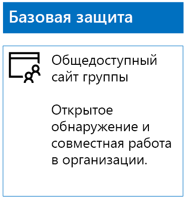
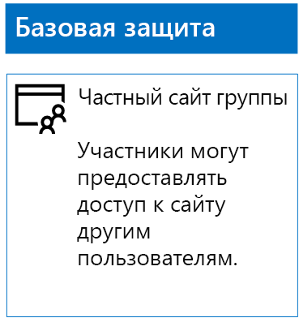
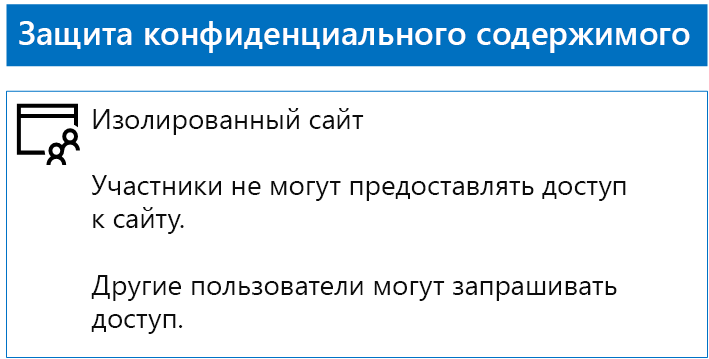
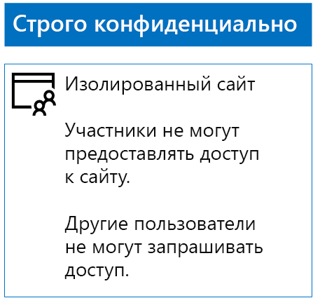

# Развертывание сайтов SharePoint Online с тремя уровнями защиты

 **Сводка.** Сведения о создании и настройке сайтов группы в SharePoint Online для применения различных уровней защиты информации.
  
В этой статье приводятся инструкции по разработке и развертыванию сайтов групп SharePoint Online с базовым, конфиденциальным и строго конфиденциальным уровнями защиты. Дополнительные сведения об этих трех уровнях защиты см. в статье [Secure SharePoint Online sites and files](secure-sharepoint-online-sites-and-files.md) (Защита сайтов и файлов SharePoint Online).
  
## Сайты групп SharePoint Online с базовым уровнем защиты

Базовый уровень защиты распространяется на частные и общедоступные сайты групп. Обнаруживать общедоступные сайты групп и получать к ним доступ может любой пользователь в организации. Обнаруживать частные сайты и получать к ним доступ могут только участники группы Office 365, связанной с сайтом группы. Оба этих типа сайтов групп позволяют участникам предоставлять доступ к сайту другим пользователям.
  
### Общедоступные

Чтобы создать сайт группы SharePoint Online с базовым уровнем защиты и общим доступом и разрешениями, выполните приведенные далее действия.
  
1. Войдите в Центр администрирования с помощью учетной записи, которая также используется для администрирования сайта группы SharePoint Online (учетной записи администратора SharePoint Online). Дополнительные сведения см. в статье [Вход в Office 365](https://support.office.com/Article/Where-to-sign-in-to-Office-365-e9eb7d51-5430-4929-91ab-6157c5a050b4).
    
2. В списке плиток выберите **SharePoint**.
    
3. На новой вкладке **SharePoint** в браузере щелкните **+ Создать сайт**.
    
4. На странице **Создание сайта** щелкните **Сайт группы**.
    
5. В поле **Имя сайта** введите имя для открытого сайта группы. 
    
6. В поле **Описание сайта группы** введите описание назначения сайта.
    
7. В разделе **Параметры конфиденциальности** выберите **Общедоступная группа: все в организации имеют доступ к этому сайту** и нажмите кнопку **Далее**.
    
8. В области **Кого вы хотите добавить?** нажмите кнопку **Готово**.
    
Ниже показана полученная в итоге конфигурация.
  

  
### Частный

Чтобы создать сайт группы SharePoint Online с базовым уровнем защиты, закрытым доступом и разрешениями, выполните приведенные далее действия.
  
1. Войдите в Центр администрирования с помощью учетной записи, которая также используется для администрирования сайта группы SharePoint Online (учетной записи администратора SharePoint Online). Дополнительные сведения см. в статье [Вход в Office 365](https://support.office.com/Article/Where-to-sign-in-to-Office-365-e9eb7d51-5430-4929-91ab-6157c5a050b4).
    
2. В списке плиток выберите **SharePoint**.
    
3. На новой вкладке **SharePoint** в браузере щелкните **+ Создать сайт**.
    
4. На странице **Создание сайта** щелкните **Сайт группы**.
    
5. В поле **Имя сайта** введите имя для частного сайта группы. 
    
6. В поле **Описание сайта группы** введите описание назначения сайта.
    
7. В разделе **Параметры конфиденциальности** выберите **Закрытая группа: только участники имеют доступ к этому сайту** и нажмите кнопку **Далее**.
    
8. В области **Who do you want to add?** (Кого нужно добавить?) в поле **Добавить участников** введите имена учетных записей пользователей, имеющих доступ к этому частному сайту группы.
    
9. Добавив начальный набор участников сайта, нажмите кнопку **Готово**.
    
Ниже показана полученная в итоге конфигурация.
  

  
## Конфиденциальные сайты группы SharePoint Online

Конфиденциальный сайт группы SharePoint Online — это изолированный сайт группы, разрешения на доступ к которому определяются членством в группах SharePoint, а не в группе Office 365, связанной с этим сайтом группы.
  
Есть два основных этапа создания изолированного сайта группы.
  
### Шаг 1. Разработка изолированного сайта

Чтобы разработать изолированный сайт группы, необходимо определить:
  
- Группы SharePoint и уровни разрешений.
    
- Набор групп доступа, которые будут участниками групп SharePoint.
    
     Рекомендуется следующий набор групп доступа: один для участников сайта, один для посетителей сайта и один для администраторов сайта.
    
- Будут ли использоваться вложенные группы внутри групп доступа.
    
Например, рекомендуемая структура групп и уровни разрешений выглядят следующим образом.
  
|**Группа SharePoint**|**Уровень разрешений**|**Группа доступа (примеры)**|
|:-----|:-----|:-----|
|[имя сайта] — участники    |Правка    |[имя сайта] — участники    |
|[имя сайта] — посетители    |Чтение    |[имя сайта] — посетители    |
|[имя сайта] — владельцы    |Полный доступ    |[имя сайта] — администраторы    |
   
Группы и уровни разрешений SharePoint создаются по умолчанию для сайта группы. Необходимо определить имена групп доступа.
  
Сведения о процессе разработки см. в статье [Design an isolated SharePoint Online team site](design-an-isolated-sharepoint-online-team-site.md) (Разработка изолированного сайта группы SharePoint Online).
  
### Шаг 2. Развертывание изолированного сайта

Для развертывания изолированного сайта сначала необходимо:
  
- определить учетные записи пользователей и группы пользователей для добавления в каждую группу доступа;
    
- создать группы доступа и добавить пользователей и членов групп.
    
Подробные инструкции см. в разделе **Этап 1** статьи [Развертывание изолированного сайта группы в SharePoint Online](deploy-an-isolated-sharepoint-online-team-site.md).
  
Далее следует создать сайт группы SharePoint Online, следуя приведенным ниже инструкциям.
  
1. Войдите в Центр администрирования с помощью учетной записи, которая также используется для администрирования сайта группы SharePoint Online (учетной записи администратора SharePoint Online). Дополнительные сведения см. в статье [Вход в Office 365](https://support.office.com/Article/Where-to-sign-in-to-Office-365-e9eb7d51-5430-4929-91ab-6157c5a050b4).
    
2. В списке плиток выберите **SharePoint**.
    
3. На новой вкладке **SharePoint** в браузере щелкните **+ Создать сайт**.
    
4. На странице **Создайте сайт** щелкните **Сайт группы**.
    
5. В поле **Имя сайта** введите имя для частного сайта группы.
    
6. В поле **Описание сайта группы** введите описание (необязательно).
    
7. В разделе **Параметры конфиденциальности** выберите **Закрытая группа: только участники имеют доступ к этому сайту** и нажмите кнопку **Далее**.
    
8. В области **Кого вы хотите добавить?** нажмите кнопку **Готово**.
    
С помощью действий, приведенных ниже, настройте разрешения на новом сайте группы SharePoint Online.
  
1. Определите имя участника-пользователя (UPN) для ИТ-администратора или другого человека, который будет обрабатывать запросы на получение доступа к сайту и отвечать на них (reginap@contoso.com — пример имени участника-пользователя). 
    
2. На панели инструментов щелкните значок параметров и выберите вариант **Разрешения для сайта**.
    
3. В области **Разрешения для сайта** щелкните **Параметры дополнительных разрешений**.
    
4. На новой вкладке браузера **Разрешения** щелкните **Параметры запроса доступа**.
    
5. В диалоговом окне **Параметры запросов доступа**:
    
  - Снимите флажки **Разрешить участникам совместный доступ к этому сайту, а также отдельным файлам и папкам** и **Разрешить участникам приглашать других пользователей в группу участников сайта**.
    
  - В поле **Отправлять все запросы на доступ** введите имя UPN ИТ-администратора из шага 1.
    
  - Нажмите кнопку **ОК**.
    
6. На вкладке браузера **Разрешения** в списке выберите **[имя сайта] — участники**.
    
7. В разделе **Пользователи и группы** нажмите кнопку **Создать**.
    
8. В диалоговом окне **Общий доступ** введите имя группы доступа участников сайта, выделите его и нажмите кнопку **Предоставить общий доступ**.
    
9. Нажмите кнопку "Назад" в браузере.
    
10. В списке выберите пункт **[имя_сайта] — владельцы**.
    
11. В разделе **Пользователи и группы** нажмите кнопку **Создать**.
    
12. В диалоговом окне **Общий доступ** введите имя группы доступа администраторов сайта, выделите его и нажмите кнопку **Предоставить общий доступ**.
    
13. Нажмите кнопку "Назад" в браузере.
    
14. В списке выберите пункт **[имя_сайта] — посетители**.
    
15. В разделе **Пользователи и группы** нажмите кнопку **Создать**.
    
16. В диалоговом окне **Общий доступ** введите имя группы доступа посетителей сайта, выделите его и нажмите кнопку **Предоставить общий доступ**.
    
17. Закройте вкладку браузера **Разрешения**.
    
Ознакомьтесь с результатами настройки разрешений.
  
- Группа SharePoint **[имя сайта] — владельцы** содержит группу доступа администраторов сайта, все члены которой имеют уровень разрешений **Полный доступ**.
    
- Группа SharePoint **[имя сайта] — участники** содержит группу доступа участников сайта, в которой все участники имеют уровень разрешений **Изменение**.
    
- Группа SharePoint **[имя сайта] — посетители** содержит группу доступа посетителей сайта, в которой все участники имеют уровень разрешений **Чтение**.
    
- Для участников отключена возможность приглашать других участников.
    
- Для пользователей, не входящих в группу, включена возможность запроса доступа.
    
Ниже показана полученная в итоге конфигурация.
  

  
Благодаря членству в одной из групп доступа участники сайта теперь могут безопасно работать с ресурсами сайта.
  
## Сайты групп SharePoint Online со строго конфиденциальным уровнем защиты

Сайт группы SharePoint Online со строго конфиденциальным уровнем защиты является изолированным сайтом группы. Это означает, что управление разрешениями осуществляется за счет членства в группах SharePoint, а не членства в группе Office 365, связанной с сайтом группы.
  
Создание изолированного сайта для строго конфиденциальных данных и совместной работы выполняется в два основных этапа.
  
### Шаг 1. Разработка изолированного сайта

Чтобы разработать изолированный сайт группы, необходимо определить:
  
- Группы SharePoint и уровни разрешений.
    
- Набор групп доступа, которые будут участниками групп SharePoint.
    
     Рекомендуется следующий набор групп доступа: один для участников сайта, один для посетителей сайта и один для администраторов сайта.
    
- Будут ли использоваться вложенные группы внутри групп доступа.
    
Например, рекомендуемая структура групп и уровни разрешений выглядят следующим образом.
  
|**Группа SharePoint**|**Уровень разрешений**|**Группа доступа (примеры)**|
|:-----|:-----|:-----|
|[имя сайта] — участники    |Правка    |[имя сайта] — участники    |
|[имя сайта] — посетители    |Чтение    |[имя сайта] — посетители    |
|[имя сайта] — владельцы    |Полный доступ    |[имя сайта] — администраторы    |
   
Группы и уровни разрешений SharePoint создаются по умолчанию для сайта группы. Необходимо определить имена групп доступа.
  
Сведения о процессе разработки см. в статье [Design an isolated SharePoint Online team site](design-an-isolated-sharepoint-online-team-site.md) (Разработка изолированного сайта группы SharePoint Online).
  
### Шаг 2. Развертывание изолированного сайта

Для развертывания изолированного сайта сначала необходимо:
  
- Определить пользователя и членов каждой из групп доступа.
    
- Создать группы доступа и добавить пользователя и членов группы.
    
- Создать изолированный сайт группы, для которого используются группы доступа.
    
Подробные инструкции см. в статье [Развертывание изолированного сайта группы SharePoint Online](deploy-an-isolated-sharepoint-online-team-site.md).
  
Ниже приведены результаты настройки разрешений.
  
- Группа SharePoint **[имя сайта] — владельцы** содержит группу доступа администраторов сайта, все члены которой имеют уровень разрешений **Полный доступ**.
    
- Группа SharePoint **[имя сайта] — участники** содержит группу доступа участников сайта, в которой все участники имеют уровень разрешений **Изменение**.
    
- Группа SharePoint **[имя сайта] — посетители** содержит группу доступа посетителей сайта, в которой все участники имеют уровень разрешений **Чтение**.
    
- Для участников отключена возможность приглашать других участников.
    
- Для пользователей, не являющихся участниками, отключена возможность запроса доступа.
    
Ниже показана полученная в итоге конфигурация.
  

  
Благодаря членству в одной из групп доступа участники сайта теперь могут безопасно работать с ресурсами сайта.
  
## Следующий этап

[Защита файлов SharePoint Online с помощью меток Office 365 и DLP](protect-sharepoint-online-files-with-office-365-labels-and-dlp.md)

## См. также

[Безопасность сайтов и файлов SharePoint Online](secure-sharepoint-online-sites-and-files.md)
  
[Руководство по безопасности (Майкрософт) для политических кампаний, некоммерческих и других динамических организаций](microsoft-security-guidance-for-political-campaigns-nonprofits-and-other-agile-o.md)
  
[Освоение облака и гибридные решения](https://docs.microsoft.com/office365/enterprise/cloud-adoption-and-hybrid-solutions)
