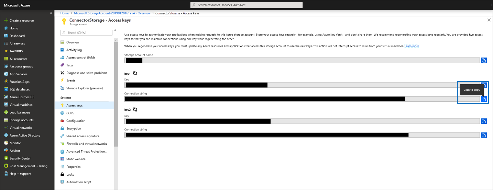
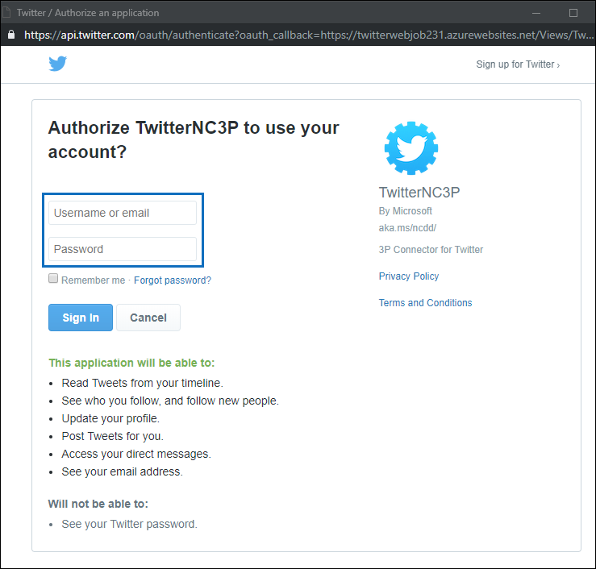
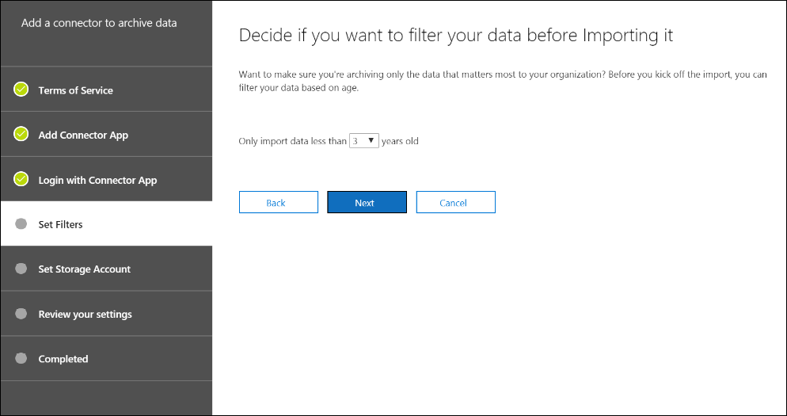

# Развертывание соединителя для архивации данных Twitter в Office 365

В этой статье представлено пошаговое руководство по развертыванию соединителя, использующего службу импорта Office 365 для импорта данных из учетной записи Twitter вашей организации в Office 365. Общий обзор этого процесса и список необходимых компонентов, необходимых для развертывания соединителя Twitter, приведены в статье [Использование примера соединителя для архивации данных Twitter в Office 365 (Предварительная версия)](archive-twitter-data-with-sample-connector.md). 

## Шаг 1: Загрузка пакета

Скачайте готовый пакет из раздела Release репозитория GitHub по адресу [https://github.com/microsoft/m365-sample-twitter-connector-csharp-aspnet/releases](https://github.com/microsoft/m365-sample-twitter-connector-csharp-aspnet/releases). В последнем выпуске Скачайте ZIP-файл с именем **самплеконнектор. zip**. Вы отправляете этот ZIP-файл в Azure на шаге 4.

## Шаг 2: создание приложения в Azure Active Directory

1. Перейдите на <https://portal.azure.com> страницу и войдите, используя учетные данные глобального администратора Office 365.

   

2. В области навигации слева выберите **Azure Active Directory**.

   

3. В левой области навигации щелкните **Регистрация приложений (Предварительная версия)** , а затем нажмите кнопку **создать регистрацию**.

   

4. Зарегистрируйте приложение. В разделе **URI перенаправления (необязательно)** в раскрывающемся списке Тип приложения выберите пункт веб <https://portal.azure.com> -сайт, а затем введите в поле для URI.

   

5. Скопируйте идентификатор **приложения (идентификатор клиента)** и **идентификатор каталога (клиента)** и сохраните их в текстовый файл или другое надежное расположение. Эти идентификаторы используются на последующих этапах.

    

6. Перейдите к разделу **сертификаты & секреты для нового приложения** и в разделе **секреты клиента** нажмите **новый секрет клиента**.

   

7. Создайте новый секрет. В поле Описание введите секрет, а затем выберите срок действия. 

   

8. Скопируйте значение секрета и сохраните его в текстовый файл или другое место хранения. Это секрет приложения AAD, который вы используете в дальнейших действиях.

   

9. Перейдите к **манифесту** и скопируйте с identifieruris (который также называется URI приложения AAD), выделенный на следующем снимке экрана. Скопируйте универсальный код ресурса (URI) приложения AAD в текстовый файл или другое место хранения. Его можно использовать на шаге 6.

    

## Шаг 3: создание учетной записи хранения Azure

1.  Перейдите на домашнюю страницу Azure для своей организации.

    

2. Выберите **создать ресурс** и введите учетную **запись хранения** в поле поиска.

   

3. Щелкните **хранилище**, а затем выберите **учетная запись хранилища**.

   

4. На странице " **Создание учетной записи хранения** " в поле подписка выберите вариант **Оплата от имени** или **бесплатной пробной версии** в зависимости от того, какой тип подписки Azure вы используете. 

   

5. Выберите или создайте группу ресурсов.

   

6. Введите имя учетной записи хранения.

   

7. Просмотрите, а затем нажмите кнопку **создать** , чтобы создать учетную запись хранения.

   

8. Через несколько секунд нажмите кнопку **Обновить** , а затем выберите **Перейти** к ресурсу, чтобы перейти к учетной записи хранения.

   

9. Нажмите **клавиши доступа** в левой области навигации.

   

10. Скопируйте **строку подключения** и сохраните ее в текстовый файл или другое место хранения. Это используется при создании ресурса веб-приложения на шаге 4.

    

## Шаг 4: создание нового ресурса веб-приложения в Azure

1. На **домашней** странице на портале Azure выберите **создать веб-приложение " \> все \> ресурсы**". На странице **веб-приложение** нажмите кнопку **создать**.

   

2. Заполните сведения (как показано ниже) и создайте веб-приложение. Имя, введенное в поле **имя приложения** , используется для создания URL-адреса службы приложений Azure; Например, twitterconnector.azurewebsites.net.

   

3. Перейдите к созданному ресурсу веб-приложения и щелкните **Параметры приложения** в левой области навигации. В разделе **Параметры приложения**щелкните **Добавить новый параметр** и добавьте следующие три параметра. Используйте значения (скопированные в текстовый файл из предыдущих шагов): 

    – * * Аписекреткэй — в качестве секрета можно ввести любое значение. Он используется для доступа к веб-приложению Connector на шаге 7.

    – **Сторажеаккаунтконнектионстринг** — универсальный код ресурса (URI) строки подключения, скопированный после создания учетной записи хранилища Azure на шаге 3.

    – **tenantId** — идентификатор клиента организации Office 365, скопированный после создания приложения соединителя Twitter в Azure Active Directory в действии 2.

    

4. В разделе **Общие параметры**нажмите **** кнопку рядом с параметром **Always On (включено**). В верхней части страницы нажмите кнопку **сохранить** , чтобы сохранить параметры приложения.

   

5. Последним шагом является отправка исходного кода приложения соединителя в Azure, который был загружен в действии 1. В веб-браузере перейдите по адресу<AzureAppResourceName>https://. SCM.azurewebsites.NET/ZipDeployUi. Например, если имя ресурса приложения Azure (с именем, указанным в шаге 2 в этом разделе) — **твиттерконнектор**, перейдите на https://twitterconnector.scm.azurewebsites.net/ZipDeployUiстраницу.

6. Перетащите Самплеконнектор. zip (, скачанный на шаге 1) на эту страницу. После отправки файлов и успешного развертывания страница будет выглядеть аналогично следующему снимку экрана:

   

## Шаг 5: создание приложения Twitter

1. Перейдите к https://developer.twitter.com, войдите в систему, используя учетные данные для учетной записи разработчика для вашей организации, а затем щелкните элемент **приложения**.

   
2. Нажмите кнопку **создать приложение**.
   
   

3. В разделе **сведения**о приложении добавьте сведения о приложении.

   

4. На панели мониторинга разработчика Twitter выберите приложение, которое вы только что создали и скопируйте отображаемый Идентификатор приложения, и сохраните его в текстовый файл или другое место хранения. Затем нажмите кнопку **сведения**.
   
   

5. На вкладке **ключи и маркеры** в разделе **ключи API потребителей** СКОПИРУЙТЕ секретный ключ API и сохраните его в текстовый файл или другое место хранения. Затем нажмите кнопку **создать** , чтобы создать маркер доступа и секрет маркера доступа, а затем скопируйте его в текстовый файл или другое место хранения.
   
   

   Затем нажмите кнопку **создать** , чтобы создать маркер доступа и секрет маркера доступа, а затем скопируйте его в текстовый файл или другое место хранения.

6. Перейдите на вкладку **разрешения** и настройте разрешения, как показано на следующем снимке экрана:

   

7. После сохранения параметров разрешений перейдите на вкладку **сведения о приложении** и нажмите кнопку **изменить > изменить сведения**.

   

8. Выполните следующие задачи:

   — Установите флажок, чтобы разрешить приложению Connector вход в Twitter.
   
   — Добавьте URI перенаправления OAuth, используя следующий формат: ** \<коннекторсервицеури>/виевс/твиттероаус**, где значением *коннекторсервицеури* является URL-адрес службы приложений Azure для вашей организации; Пример: https://twitterconnector.azurewebsites.net/Views/TwitterOAuth.

   

Теперь приложение для разработчиков Twitter готово к использованию.

## Шаг 6: Настройка соединительного веб-приложения 

1. Перейдите в раздел\<https://азуреаппресаурценаме>. azurewebsites.NET (где **азуреаппресаурценаме** — это имя ресурса приложения Azure, имя которого указано в шаге 4). Например, если имя — **твиттерконнектор**, перейдите на https://twitterconnector.azurewebsites.netстраницу. Домашняя страница приложения выглядит как на следующем снимке экрана:

   

2. Нажмите кнопку **настроить** , чтобы отобразить страницу входа.

   

3. В поле Идентификатор клиента введите или вставьте идентификатор клиента (полученный на шаге 2). В поле Пароль введите или вставьте Аписекреткэй (полученное в действии 2), а затем нажмите кнопку **Настройка параметров конфигурации** , чтобы отобразить страницу **сведений о конфигурации** .

   

4. В разделе **сведения о конфигурации**введите следующие параметры конфигурации. 

   — **Ключ API Twitter** — идентификатор приложения для приложения Twitter, созданного в шаге 5.
   — **Секретный ключ API Twitter** — секретный ключ API для приложения Twitter, созданного в шаге 5.
   — **Маркер доступа Twitter** — маркер доступа, созданный в шаге 5.
   — **Секрет маркера доступа Twitter** — секрет маркера доступа, созданный в шаге 5.
   — **Идентификатор приложения AAD** — идентификатор приложения для приложения Azure Active Directory, созданного на шаге 2 — **секрет приложения AAD** — значение для секрета аписекреткэй, созданного на шаге 4.
   — **URI приложения AAD** — URI приложения AAD, полученный в шаге 2; Пример: https://microsoft.onmicrosoft.com/2688yu6n-12q3-23we-e3ee-121111123213.
   — **Ключ инструментирования Application Insights** — оставьте это поле пустым.

5. Нажмите кнопку **сохранить** , чтобы сохранить параметры соединителя.

## Шаг 7: Настройка настраиваемого соединителя в центре безопасности и соответствия требованиям

1.  Перейдите в <https://protection.office.com> раздел **Управление \> данными и выберите пункт \> архивы импорта данных сторонних поставщиков**.

    

2. Нажмите кнопку **Добавить соединитель** , а затем выберите элемент **Twitter**.

   

3. На странице **Добавление приложения соединителя** введите следующие сведения и нажмите кнопку **проверить соединитель**.

    — В первом поле введите имя соединителя, например **Twitter**.
    — Во втором поле введите или вставьте значение Аписекреткэй, добавленное на шаге 4.
    — В третьем поле введите или вставьте URL-адрес службы приложений Azure; Пример: **https://twitterconnector.azurewebsites.net**.

   После успешной проверки соединителя нажмите кнопку **Далее**.

   

4. Щелкните **имя входа с приложением Connector Connector**.

   

5. Введите или вставьте Аписекреткэй еще раз, а затем щелкните **Вход в службу соединителя**.

   

6. Щелкните **продолжить с помощью Twitter**.

7. На странице входа в Twitter Войдите в систему, используя учетные данные для учетной записи Twitter вашей организации.

   

   После входа на странице Twitter отобразится следующее сообщение: "Задание соединителя Twitter успешно настроено".

8. Нажмите кнопку **Готово** , чтобы завершить настройку соединителя Twitter.

9. На странице " **Настройка фильтров** " можно применить фильтр для импорта (и архивирования) элементов с определенным сроком хранения. Нажмите кнопку **Далее**.

   

10. На странице " **Задание учетной записи хранения** " введите адрес электронной почты почтового ящика Office 365, в который будут импортированы элементы Twitter.

    

11. Проверьте параметры и нажмите кнопку **Готово** , чтобы завершить настройку соединителя в центре безопасности & соответствия требованиям.

    

    

12. Перейдите на страницу **архивации сторонних данных** , чтобы просмотреть ход процесса импорта.

    
