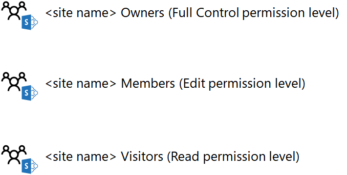
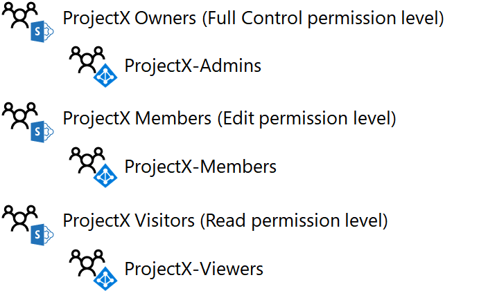

# Разработка изолированного сайта группы SharePoint OnlineDesign an isolated SharePoint Online team site

 **Сводка.** Пошаговое руководство по разработке изолированных сайтов групп SharePoint Online.**Summary:** Step through the design process for isolated SharePoint Online team sites.
  
В этой статье описаны основные проектные решения, которые необходимо принять перед созданием изолированного сайта группы SharePoint Online.This article takes you through the key design decisions you must make before creating an isolated SharePoint Online team site.
  
## Этап 1. Определение групп SharePoint и уровней разрешенийPhase 1: Determine your SharePoint groups and permission levels

Каждый сайт группы SharePoint Online по умолчанию создается со следующими группами SharePoint:Every SharePoint Online team site by default is created with the following SharePoint groups:
  
- \<имя сайта> элементы\<site name> Members
    
- \<имя сайта> посетителей\<site name> Visitors
    
- \<Владельцы> имен сайтов\<site name> Owners
    
Эти группы не связаны с группами Office 365 и Azure Active Directory (AD) и позволяют назначать разрешения для ресурсов сайта.These groups are separate from Office 365 and Azure Active Directory (AD) groups and are the basis for assigning permissions for the resources of the site.
  
Набор разрешений, определяющий возможности члена группы SharePoint на сайте, — это уровень разрешений. По умолчанию для сайта группы SharePoint Online доступно три уровня разрешений: "Изменение", "Чтение" и "Полный доступ". В приведенной ниже таблице показаны группы SharePoint и назначенные им по умолчанию уровни разрешений.The set of specific permissions that determines what a member of a SharePoint group can do in a site is a permission level. There are three permission levels by default for a SharePoint Online team site: Edit, Read, and Full control. The following table shows the default correlation of SharePoint groups and assigned permission levels:
  
|**Группа SharePoint****SharePoint group**|**Уровень разрешений****Permission level**|
|:-----|:-----|
|\<имя сайта> элементы\<site name> Members    |EditEdit    |
|\<имя сайта> посетителей\<site name> Visitors    |ЧтениеRead    |
|\<Владельцы> имен сайтов\<site name> Owners    |Полный доступFull control    |
   
 **Рекомендация.** Вы можете создавать дополнительные группы SharePoint и уровни разрешений. Но мы рекомендуем использовать заданные по умолчанию группы SharePoint и уровни разрешений для изолированного сайта SharePoint Online.**Best practice:** You can create additional SharePoint groups and permission levels. However, we recommend using the default SharePoint groups and permission levels for your isolated SharePoint Online site.
  
Ниже указаны группы SharePoint по умолчанию и уровни разрешений.Here are the default SharePoint groups and permission levels.
  

  
## Этап 2. Назначение разрешений пользователям с помощью групп доступаPhase 2: Assign permissions to users with access groups

Вы можете назначить разрешения пользователям, добавив либо их учетные записи, либо группы Office 365 или Azure AD, в которых они состоят, в группы SharePoint. После добавления учетным записям пользователей Office 365 назначается уровень разрешений, связанный с группой SharePoint. Это происходит либо непосредственно, либо благодаря членству в группе Office 365 или Azure AD.You can assign permissions to users by adding their user account, or an Office 365 or Azure AD group of which the user account is a member, to the SharePoint groups. Once added, the Office 365 user accounts, either directly or indirectly via membership in an Office 365 or Azure AD group, are assigned the permission level associated with the SharePoint group.
  
Предоставление разрешений на примере групп SharePoint по умолчанию:Using the default SharePoint groups as an example:
  
- Членам группы " \*\* \<имя сайта> участников\*\* SharePoint", которая может включать как учетные записи пользователей, так и группы, назначается уровень разрешений " **изменить** ".Members of the **\<site name> Members** SharePoint group, which can include both user accounts and groups, are assigned the **Edit** permission level
    
- Членам группы " \*\* \<имя сайта>\*\* SharePoint", которая может включать как учетные записи пользователей, так и группы, назначается уровень разрешений " **Чтение** ".Members of the **\<site name> Visitors** SharePoint group, which can include both user accounts and groups, are assigned the **Read** permission level
    
- Членам группы SharePoint " \*\* \<имя сайта> владельцы\*\* ", которая может включать как учетные записи пользователей, так и группы, назначается уровень разрешений " **полный** доступ".Members of the **\<site name> Owners** SharePoint group, which can include both user accounts and groups, are assigned the **Full control** permission level
    
 **Рекомендация.** Вы можете управлять разрешениями через отдельные учетные записи пользователей, но рекомендуем использовать для этого одну группу Azure AD (т. н. группу доступа). Это позволяет управлять разрешениями через членство в группе доступа, не управляя списком учетных записей для каждой группы SharePoint.**Best practice:** Although you can manage permissions through individual user accounts, we recommend that you use a single Azure AD group, known as an access group, instead. This simplifies the management of permissions through membership in the access group, rather than managing the list of user accounts for each SharePoint group.
  
Группы Azure AD для Office 365 отличаются от групп Office 365.Azure AD groups for Office 365 are different than Office 365 groups. Группы Azure AD отображаются в центре администрирования Microsoft 365 с **типом** " **Безопасность** " и не имеют адреса электронной почты.Azure AD groups appear in the Microsoft 365 admin center with their **Type** set to **Security** and do not have an email address. Группами Azure AD можно управлять с помощью указанных ниже средств.Azure AD groups can be managed within:
  
- Доменные службы Active DirectoryActive Directory Domain Services (AD DS)
    
    Это группы, созданные в локальной инфраструктуре AD DS и синхронизированные с подпиской на Office 365.These are groups that have been created in your on-premises AD DS infrastructure and synchronized to your Office 365 subscription. В центре администрирования Microsoft 365 для этих групп задано **состояние** " **синхронизирован" с Active Directory**.In the Microsoft 365 admin center, these groups have a **Status** of **Synched with active directory**.
    
- Office 365Office 365
    
    Это группы, созданные с помощью центра администрирования Microsoft 365, портала Azure или Microsoft PowerShell.These are groups that have been created using either the Microsoft 365 admin center, the Azure portal, or Microsoft PowerShell. В центре администрирования Microsoft 365 для этих групп задано **состояние** **Cloud**.In the Microsoft 365 admin center, these groups have a **Status** of **Cloud**.
    
 **Рекомендация:** Если вы используете локальную службу доменных служб Active Directory и выполняете синхронизацию с вашей подпиской на Office 365, выполните Управление пользователями и группами с помощью AD DS.**Best practice:** If you are using AD DS on-premises and synchronizing with your Office 365 subscription, perform your user and group management with AD DS.
  
Рекомендуемая структура изолированных сайтов групп SharePoint Online указана ниже.For isolated SharePoint Online team sites, the recommended group structure looks like this:
  
|**Группа SharePoint****SharePoint group**|**Группа доступа на основе Azure AD****Azure AD-based access group**|**Уровень разрешений****Permission level**|
|:-----|:-----|:-----|
|\<имя сайта> элементы\<site name> Members    |\<имя сайта> элементы\<site name> Members    |EditEdit    |
|\<имя сайта> посетителей\<site name> Visitors    |\<имя сайта> средства просмотра\<site name> Viewers    |ЧтениеRead    |
|\<Владельцы> имен сайтов\<site name> Owners    |\<имя сайта> администраторов\<site name> Admins    |Полный доступFull control    |
   
 **Рекомендация:** Несмотря на то что вы можете использовать группы Office 365 или Azure AD в качестве членов групп SharePoint, мы рекомендуем использовать группы Azure AD.**Best practice:** Although you can use either Office 365 or Azure AD groups as members of SharePoint groups, we recommend that you use Azure AD groups. Группы Azure AD, управляемые с помощью AD DS или Office 365, предоставляют более гибкие возможности для назначения разрешений с помощью вложенных групп.Azure AD groups, managed either through AD DS or Office 365, give you more flexibility to use nested groups to assign permissions.
  
Ниже приведены группы SharePoint по умолчанию, настроенные для использования групп доступа на основе Azure AD.Here are the default SharePoint groups configured to use Azure AD-based access groups.
  

  
При создании трех групп доступа учитывайте следующее:When designing the three access groups, keep the following in mind:
  
- В группе \*\* \<"имя сайта> группы доступа" Администраторы "\*\* должно быть только несколько членов, соответствующих небольшому числу администраторов SharePoint Online, которые управляют сайтом группы.There should be only a few members in the **\<site name> Admins** access group, corresponding to a small number of SharePoint Online administrators who are managing the team site.
    
- Большинство участников сайта находятся в \*\* \<имени сайта> элементы\*\* или \*\* \<имя сайта>\*\* группы доступа к читателям.Most of your site members are in the **\<site name> Members** or **\<site name> Viewers** access groups. Так как члены сайта в группе доступа к \*\* \<имени сайта> участников\*\* имеют возможность удалять или изменять ресурсы на сайте, тщательно изучите их участников.Because site members in the **\<site name> Members** access group have the ability to delete or modify resources in the site, carefully consider its membership. При возникновении сомнений добавьте участника сайта в группу " \*\* \<имя сайта>\*\* доступ к зрителям".When in doubt, add the site member to the **\<site name> Viewers** access group.
    
Ниже приведен пример групп SharePoint и групп доступа для изолированного сайта с именем ProjectX.Here is an example of the SharePoint groups and access groups for an isolated site named ProjectX.
  

  
## Этап 3: использование вложенных групп Azure ADPhase 3: Use nested Azure AD groups

Если в проекте немного людей, один уровень групп доступа на основе Azure AD, добавленных в группы SharePoint сайта, подойдет для большинства сценариев.For a project confined to a small number of people, a single level of Azure AD-based access groups added to the SharePoint groups of the site will fit most scenarios. Тем не менее, если у вас большое количество людей, и эти пользователи уже являются участниками группы Azure AD, вы можете легко назначить разрешения SharePoint с помощью вложенных групп или групп, которые содержат другие группы в качестве участников.However, if you have a large number of people and those people are already members of established Azure AD groups, you can more easily assign SharePoint permissions by using nested groups, or groups that contain other groups as members.
  
Например, вы хотите создать изолированный сайт группы SharePoint Online для совместной работы руководителей отделов продаж, маркетинга, поддержки, а также инженерно-технического и юридического отделов, и у этих отделов уже есть группы руководителей. Вместо того чтобы создавать группу для новых участников сайта и добавлять в нее все учетные записи руководителей, добавьте существующие группы руководителей каждого отдела в новую группу.For example, you want to create an isolated SharePoint online team site for collaboration among the executives of the sales, marketing, engineering, legal, and support departments and those departments already their own groups with executive user account membership. Rather than creating a new group for the new site members and placing all the individual executive user accounts in it, put the existing executive groups for each department in the new group.
  
  Если у вас одна подписка на Office 365 на несколько организаций, одним уровнем членства в группе для изолированного сайта может быть трудно управлять из-за большого количества учетных записей пользователей. В этом случае можно использовать вложенные группы Azure AD для каждой организации, которые содержат группы в своей организации для управления разрешениями.If you are sharing an Office 365 subscription between multiple organizations, a single level of group membership for an isolated site for an organization might become difficult to manage due to the sheer number of user accounts. In this case, you can use nested Azure AD groups for each organization that contain the groups within their organizations to manage the permissions.
  
Чтобы использовать вложенные группы Azure AD:To use nested Azure AD groups:
  
1. Определите или создайте группы Azure AD, которые будут содержать учетные записи пользователей, и добавьте соответствующие учетные записи пользователей в качестве членов.Identify or create the Azure AD groups that will contain user accounts and add the appropriate user accounts as members.
    
2. Создайте общую группу доступа на основе Azure AD, которая будет содержать другие группы Azure AD, и добавьте эти группы в качестве членов.Create the container Azure AD-based access group that will contain the other Azure AD groups and add those groups as members.
    
3.   Чтобы предоставить общей группе доступа нужный уровень доступа, укажите группу SharePoint и соответствующий уровень разрешений.For the appropriate level of access for the container access group, identify the SharePoint group and corresponding permission level.
    
> [!NOTE]
> Вложенные группы Office 365 не поддерживаются.You cannot use nested Office 365 groups. 
  
Ниже приведен пример вложенных групп Azure AD для группы доступа к членам ProjectX.Here is an example of nested Azure AD groups for the ProjectX member access group.
  

  
Так как все учетные записи пользователей в группах "исследование", "Проектирование" и "руководители проектов" предназначены для участников сайта, проще добавить свои группы Azure AD в группу доступа к участникам ProjectX.Because all of the user accounts in the Research, Engineering, and Project leads teams are intended to be site members, it is easier to add their Azure AD groups to the ProjectX Members access group.
  
## Следующий шагNext step

Сведения о создании и настройке изолированного сайта в рабочей среде см. в статье [Deploy an isolated SharePoint Online team site](deploy-an-isolated-sharepoint-online-team-site.md).When you are ready to create and configure an isolated site in production, see [Deploy an isolated SharePoint Online team site](deploy-an-isolated-sharepoint-online-team-site.md).
  
## См. такжеSee Also

[Изолированные сайты групп SharePoint OnlineIsolated SharePoint Online team sites](isolated-sharepoint-online-team-sites.md)
  
[Управление изолированным сайтом группы SharePoint OnlineManage an isolated SharePoint Online team site](manage-an-isolated-sharepoint-online-team-site.md)

[Развертывание изолированного сайта группы SharePoint OnlineDeploy an isolated SharePoint Online team site](deploy-an-isolated-sharepoint-online-team-site.md)

