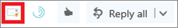
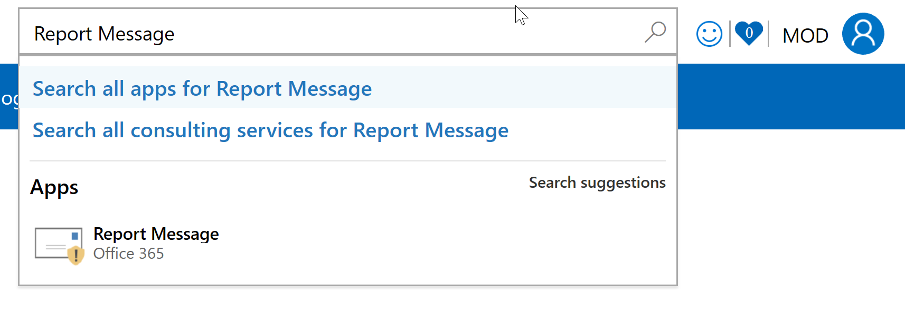

# Включение надстройки Report Message

## Обзор

Отчет о надстройки для Outlook и Outlook в Интернете позволяют пользователям легко сообщать о неправильно классифицированных электронной почты как безопасный, так и сообщение о нежелательном, корпорацией Майкрософт и ее дочерних компаний для анализа. Корпорация Майкрософт использует эти отправки для повышения эффективности технологии защиты электронной почты. Кроме того Если ваша организация использует [Защиту от угроз для Office 365 расширенного](office-365-atp.md) или [Анализ угроз Office 365](office-365-ti.md), надстройка сообщения отчета содержит группы безопасности вашей организации полезную информацию, которые они могут использовать для просмотра и обновления политики безопасности. 

Например, предположим, что пользователи являются отчетность с большим количеством сообщений как фишинга. В этом поверхности сведения в панели [Мониторинга безопасности](security-dashboard.md) и другие отчеты. Группа безопасности вашей организации эти сведения можно использовать как это свидетельствует о том, что фишинга политики могут быть обновлены. Или, если пользователи являются отчетность с большим количеством сообщений, которые были помечены как нежелательная почта, как не являющееся нежелательным с помощью надстройки сообщения отчета, группа безопасности вашей организации может потребоваться настройка [политик защиты от нежелательной почты](configure-the-anti-spam-policies.md). 

Надстройка сообщения отчета для работы с подписки Office 365 и следующих продуктов:
 - Outlook в Интернете
 - Outlook 2013 SP1
 - Outlook 2016
 - Outlook 2016 для Mac
 - Outlook, включенные в состав Office 365 профессиональный плюс
  
Если вы отдельного пользователя, можно [включить надстройку отчета сообщения для самостоятельно](#get-the-report-message-add-in-for-yourself). 
  
Если вы администратор Exchange Online можно [включить надстройку сообщения отчета для вашей организации](#get-and-enable-the-report-message-add-in-for-your-organization).
    
## Сообщение отчета надстройки для себя

1. В [Microsoft AppSource](https://appsource.microsoft.com/marketplace/apps)поиск [надстройки сообщения отчета](https://appsource.microsoft.com/product/office/wa104381180).
    
2. Выберите **получить ИТ ТЕПЕРЬ**.   
    
3. Ознакомьтесь с условиями использования и конфиденциальность политики. Выберите **Продолжить**. 
    
4. Войдите в Office 365 электронной почты с помощью работу или учетная запись school (для использования в бизнесе) или свою учетную запись Майкрософт (для личного использования).
    

После надстройка установлена и включена, вы увидите следующие значки: 

- В программе Outlook значок выглядит следующим образом:    
- В Outlook Web App значок выглядит следующим образом:  

В качестве следующего шага, узнайте, как [использования надстройки сообщения отчета](https://support.office.com/article/b5caa9f1-cdf3-4443-af8c-ff724ea719d2).
  
## Получение и включить надстройку сообщения отчета для вашей организации

> [!IMPORTANT]
> Должен быть глобального администратора Office 365 или администратора Exchange Online для выполнения этой задачи.

1. Последовательно выберите пункты [https://portal.office.com](https://portal.office.com) и выполнить вход с помощью учетной записи рабочего или школы. 
    
2. Выберите **администратора** , чтобы перейти в центр администрирования. 
    
3. Выберите **центры администрирования** \> **Exchange** , чтобы перейти в центр администрирования Exchange (EAC). 
    
4. Выбор **организации** \> **надстроек**. 
    
5. Выберите **+**  >  **Добавить из магазина Office**.  В веб-браузере откроется в магазин Office.
    
6. Поиск сообщения отчета.  
    
7. В списке **приложений** выберите **Отчет сообщение**и нажмите кнопку **Получить ИТ ТЕПЕРЬ**.   
    
8. Ознакомьтесь с условиями использования и конфиденциальность политики. Выберите **Продолжить**. 
    
    
  
9. Откроется мастер для настройки проверки надстройки сообщения отчета сведения и нажмите кнопку **Далее** для продолжения.   

10. Укажите, требуется пользователям для надстройки сообщения отчета по умолчанию.  
    
11. Укажите, кто возвращает сообщение для отчета надстройки.   

12. Нажмите кнопку **Сохранить**.  
> [!TIP]
> Мы рекомендуем [Настройка правила для получения копии сообщения электронной почты, о которых сообщает пользователям](#set-up-a-rule-to-get-a-copy-of-email-messages-reported-by-your-users)

В зависимости от того, какой выбран с помощью мастера пользователи в вашей организации будет иметь [надстройки сообщения отчета](https://support.office.com/article/b5caa9f1-cdf3-4443-af8c-ff724ea719d2) недоступны. Пользователи в вашей организации отображаются следующие значки: 

- В программе Outlook значок выглядит следующим образом:    
- В Outlook Web App значок выглядит следующим образом:  

## Настройка правила для получения копии сообщения электронной почты, о которых сообщает пользователям

> [!IMPORTANT]
> Необходимо быть администратором Exchange Online для выполнения этой задачи.
  
Можно настроить правила для получения копии сообщения электронной почты, обнаруженных пользователями в вашей организации. Для этого после загрузки и поддержкой надстройки сообщения отчета для вашей организации.
  
1. В центре администрирования Exchange выберите **поток почты** \> **правила**. 
    
2. Выберите **+** \> **Создать новое правило**. 
    
3. В поле **имя** введите имя, например, отправке.
    
4. Выберите в списке **Применить это правило, если** **адрес получателя содержит...**. 
    
5. В окне **Укажите слова или фразы** добавьте junk@office365.microsoft.com и phish@office365.microsoft.com и нажмите кнопку **ОК**. 
    
    
  
6. Выберите в списке **выполните следующие...** **скрытой копии сообщения для...**. 
    
7. Добавление глобального администратора, администратора безопасности и/или чтения безопасности, следует получения копии всех сообщений электронной почты людей сообщить в корпорацию Майкрософт, а затем нажмите **кнопку ОК**. 
    
    
  
8. Выберите **аудита этого правила с степень серьезности**и задайте **среднего**. 
    
9. В разделе **Выбор режима для этого правила**нажмите кнопку **Применить**. 
    
    
  
10. Нажмите кнопку **Сохранить**. 
    
С этим правилом на месте каждый раз, когда кто-то в вашей организации сообщает сообщения электронной почты с помощью сообщения отчета надстройки, глобального администратора, администратора безопасности и чтения безопасности будет получать копию этого сообщения. Эти сведения можно включить для установки и настройки политики, например политики [Office 365 ATP безопасных ссылки](atp-safe-links.md) . 

## Просмотреть или изменить параметры по умолчанию для надстройки сообщения отчета

Можно просмотреть и изменить параметры по умолчанию для сообщений отчета надстройки с помощью центра администрирования. 

> [!IMPORTANT]
> Должен быть глобального администратора Office 365 или администратора Exchange Online для выполнения этой задачи.
    
1. Если вы установили только что надстройка сообщения отчета для вашей организации, вы будете уже на странице служб и надстроек. В противном случае перейдите [здесь](https://portal.office.com/adminportal/home#/Settings/ServicesAndAddIns) и войти с помощью учетной записи рабочего или школы для Office 365.

2. Поиск **Сообщений отчет**и выберите его.   
    
3. Откроется область, которая отображает параметры, которые были выбраны в качестве надстройки отчета сообщения во время развертывания.   

4. Просмотрите и при необходимости измените параметры для надстройки сообщения отчета, а затем сохраните изменения.
    
## Сведения об использовании надстройки сообщения отчета

Показано [Использование надстройки сообщения отчета](https://support.office.com/article/b5caa9f1-cdf3-4443-af8c-ff724ea719d2).
  
## См. также:

[Использование надстройки Report Message](https://support.office.com/article/b5caa9f1-cdf3-4443-af8c-ff724ea719d2)
  
[Просмотр отчетов по безопасности электронной почты в безопасности &amp; центре соответствия требованиям](view-email-security-reports.md)

[Просмотр отчетов для защиты расширенного Threat Office 365](view-reports-for-atp.md)

[Используйте проводник в системы &amp; центре соответствия требованиям](use-explorer-in-security-and-compliance.md)
  

