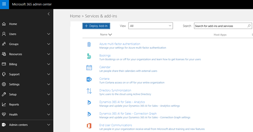

# Включение надстройки Report Message

## Общие сведения

Надстройка сообщения отчета для Outlook и Outlook в Интернете позволяет людям легко сообщать о неклассифицированных сообщениях, будь то безопасное или вредоносное, в Майкрософт и ее дочерних подразделениех для анализа. Корпорация Майкрософт использует эти отправки для повышения эффективности технологий защиты электронной почты. Кроме того, если в организации используется [office 365 Advanced Threat protection](office-365-atp.md) или [Office 365 Threat Intelligence](office-365-ti.md), надстройка сообщений отчета предоставляет группе безопасности Организации полезную информацию, которую можно использовать для просмотра и обновления политики безопасности. 

Например, предположим, что люди сообщают о большом числе фишинговых сообщений. Эта информация послужит в качестве поверхности в [панели мониторинга безопасности](security-dashboard.md) и других отчетов. Группа безопасности вашей организации может использовать эти сведения для указания того, что политики защиты от фишинга может потребоваться обновить. Или, если пользователи сообщают о большом количестве сообщений, помеченных как нежелательные, с помощью надстройки Report Message, группе безопасности Организации может потребоваться настроить [политики защиты от нежелательной почты](configure-the-anti-spam-policies.md). 

Надстройка сообщения отчета работает с вашей подпиской на Office 365 и следующими продуктами:
 - Outlook в Интернете
 - Outlook 2013 SP1
 - Outlook 2016
 - Outlook 2016 для Mac
 - Outlook, включенный в Office 365 профессиональный плюс

> [!NOTE]
> Надстройка сообщения отчета для Outlook и Outlook в Интернете — это не то же самое, что и [Фильтр нежелательной почты Outlook](https://support.office.com/article/Overview-of-the-Junk-Email-Filter-5ae3ea8e-cf41-4fa0-b02a-3b96e21de089), хотя они могут быть использованы для пометки почты как нежелательных, нежелательных или фишинговых атак. Надстройка сообщения отчета для Outlook и Outlook в Интернете уведомляет Майкрософт о неклассифицированных сообщениях электронной почты, а фильтр неЖелательной почты Outlook используется для упорядочения сообщений электронной почты в почтовом ящике пользователя. 
  
Если вы являетесь отдельным пользователем, вы можете [включить для себя надстройку сообщения отчета](#get-the-report-message-add-in-for-yourself). 
  
Если вы являетесь глобальным администратором Office 365 или администратором Exchange Online, а Exchange настроен на использование проверки подлинности OAuth, вы можете [включить надстройку сообщения отчета для Организации](#get-and-enable-the-report-message-add-in-for-your-organization). Теперь надстройка сообщений отчета доступна с помощью централизованного [развертывания](https://docs.microsoft.com/office365/admin/manage/centralized-deployment-of-add-ins).
    
## Получение надстройки "сообщение отчета" для себя

1. В [Microsoft AppSource](https://appsource.microsoft.com/marketplace/apps)найдите [надстройку сообщения отчета](https://appsource.microsoft.com/product/office/wa104381180).
    
2. Нажмите кнопку **получить**.   
    
3. Ознакомьтесь с условиями использования и политики конфиденциальности. Затем нажмите кнопку **продолжить**. 
    
4. Войдите в Office 365 с помощью рабочей или учебной учетной записи (для бизнес-использования) или учетной записи Майкрософт (для личного использования).
    
После установки и включения надстройки вы увидите следующие значки: 

- В Outlook значок выглядит следующим образом:    
- В Outlook в Интернете (предыдущее название — Outlook Web App) значок выглядит следующим образом:  

> [!TIP]
> На следующем этапе Узнайте, как [использовать надстройку Message Report](https://support.office.com/article/b5caa9f1-cdf3-4443-af8c-ff724ea719d2).
  
## Получение и включение надстройки сообщений отчета для Организации

> [!IMPORTANT]
> Для выполнения этой задачи необходимо быть глобальным администратором Office 365 или администратором Exchange Online. Кроме того, для получения дополнительных сведений в Exchange необходимо настроить проверку подлинности OAuth, используя [требования Exchange (централизованНое Развертывание надстроек)](https://docs.microsoft.com/office365/admin/manage/centralized-deployment-of-add-ins&view=o365-worldwide#exchange-requirements). 

1. Перейдите на [страницу "службы" _амп_](https://admin.microsoft.com/AdminPortal/Home#/Settings/ServicesAndAddIns) "надстройки" в центре администрирования Microsoft 365.   
    
2. Выберите **+ развернуть надстройку**.   
    
3. На экране **Новая надстройка** просмотрите сведения, а затем нажмите кнопку **Далее**.  
    
4. Выберите **я хочу добавить надстройку из магазина Office**, а затем нажмите кнопку **Далее**.   
    
5. Найдите **сообщение отчета**и в списке результатов рядом с пунктом **надстройка сообщения отчета**нажмите кнопку **добавить**.  
    
6. На экране **сообщения отчета** просмотрите сведения, а затем нажмите кнопку **Далее**.  

7. Укажите параметры пользователя по умолчанию для Outlook, а затем нажмите кнопку **Далее**.  

8. Укажите, кто получает надстройку сообщения отчета, а затем нажмите кнопку **сохранить**.   

> [!TIP]
> Мы рекомендуем [настроить правило для получения копии сообщений электронной почты, о которых сообщили ваши пользователи](#set-up-a-rule-to-get-a-copy-of-email-messages-reported-by-your-users).

В зависимости от того, что было выбрано при настройке надстройки (шаги 7-8 выше), пользователи в вашей организации будут иметь доступ к [надстройке сообщений отчета](https://support.office.com/article/b5caa9f1-cdf3-4443-af8c-ff724ea719d2) . Пользователи в вашей организации увидят следующие значки: 

- В Outlook значок выглядит следующим образом:    
- В Outlook в Интернете значок выглядит следующим образом:  

> [!TIP]
> При уведомлении пользователей о надстройке сообщения отчета добавьте ссылку для [использования надстройки Report Message](https://support.office.com/article/b5caa9f1-cdf3-4443-af8c-ff724ea719d2).

## Настройка правила для получения копии сообщений электронной почты, о которых сообщил пользователь

> [!IMPORTANT]
> Для выполнения этой задачи необходимо быть администратором Exchange Online.
  
Вы можете настроить правило для получения копии сообщений электронной почты, о которых сообщили пользователи в вашей организации. Это можно сделать после того, как вы загрузили и включили надстройку Message Report для своей организации.
  
1. В центре администрирования Exchange выберите **правила**для обработки **почтового процесса** \> . 
    
2. Выберите **+** \> **создать новое правило**. 
    
3. В поле **имя** введите имя, например отправку.
    
4. В списке **Применить это правило, если** выберите **адрес получателя включает...**. 
    
5. В окне **Укажите слова или фразы** добавьте `junk@office365.microsoft.com` и `phish@office365.microsoft.com`нажмите кнопку **ОК**.  
  
6. В списке **выполнить следующие действия** выберите команду **СК для сообщения...**. 
    
7. Добавьте глобального администратора, администратора безопасности и/или читателя безопасности, которые должны получить копию каждого сообщения электронной почты, отправляемого пользователям в корпорацию Майкрософт, а затем нажмите кнопку **ОК**.  
  
8. Выберите пункт **аудит этого правила со степенью серьезности**, а затем выберите **средний**. 
    
9. В разделе **выберите режим для этого правила**нажмите кнопку **Применить**.  
  
10. Нажмите кнопку **Сохранить**. 
    
С помощью этого правила, когда кто-то в Организации отправляет сообщение электронной почты с помощью надстройки Report Message, глобальный администратор, администратор безопасности и/или средство чтения безопасности получат копию этого сообщения. Эти сведения позволяют настраивать политики, такие как политики [безопасных ссылок Office 365 ATP](atp-safe-links.md) или параметры [защиты от нежелательной почты](anti-spam-protection.md) . 

## Узнайте, как использовать надстройку "сообщение отчета"

Обратитесь [к разделу Использование надстройки Report Message](https://support.office.com/article/b5caa9f1-cdf3-4443-af8c-ff724ea719d2).

## Просмотр или изменение параметров для надстройки "сообщение отчета"

Вы можете просмотреть и изменить параметры по умолчанию для надстройки "сообщения отчета" на [странице "службы" _амп_](https://admin.microsoft.com/AdminPortal/Home#/Settings/ServicesAndAddIns)"надстройки". 

> [!IMPORTANT]
> Для выполнения этой задачи необходимо быть глобальным администратором Office 365 или администратором Exchange Online.
    
1. Перейдите на [страницу "службы" _амп_](https://admin.microsoft.com/AdminPortal/Home#/Settings/ServicesAndAddIns) "надстройки" в центре администрирования Microsoft 365.  

2. Найдите и выберите надстройку сообщения отчета.   
    
3. На экране сообщения отчета просмотрите и измените параметры в соответствии с требованиями Организации.   
  
## Связанные статьи

[Использование надстройки Report Message](https://support.office.com/article/b5caa9f1-cdf3-4443-af8c-ff724ea719d2)
  
[Просмотр отчетов о безопасности электронной почты в &amp; центре безопасности и соответствия требованиям](view-email-security-reports.md)

[Просмотр отчетов для Office 365 Advanced Threat protection](view-reports-for-atp.md)

[Использование проводника в центре безопасности &amp; и соответствия требованиям](use-explorer-in-security-and-compliance.md)
  

