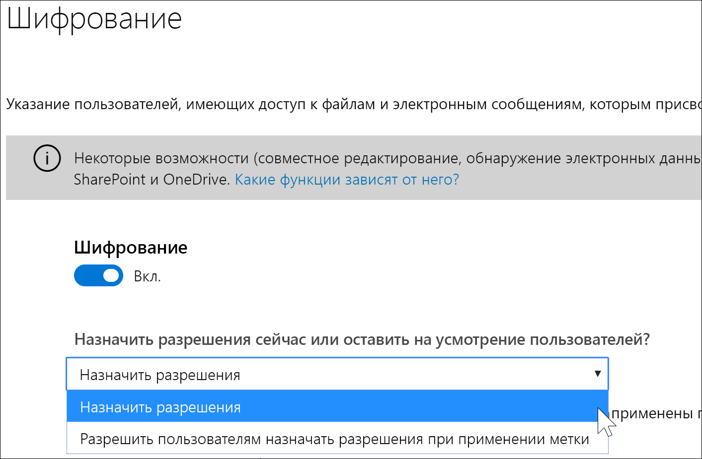
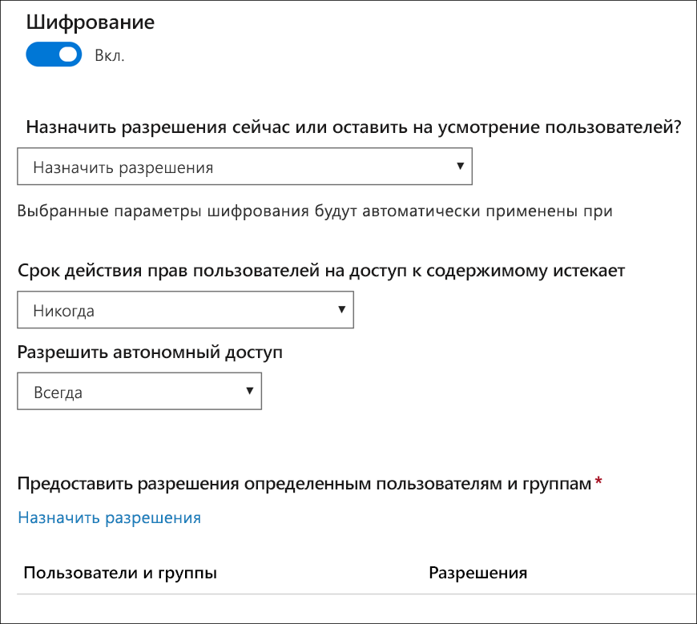
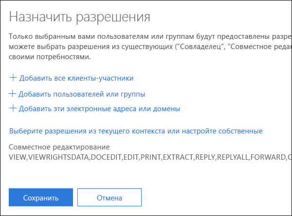
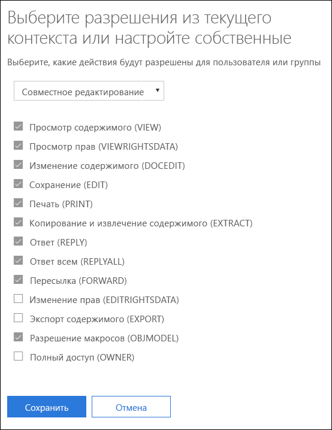
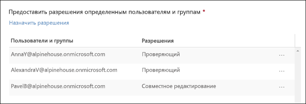
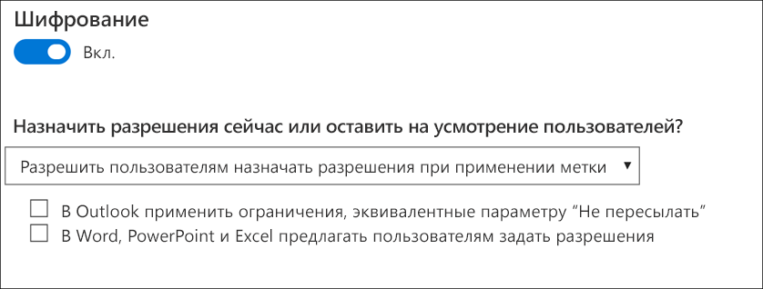
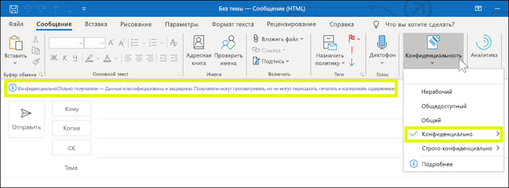
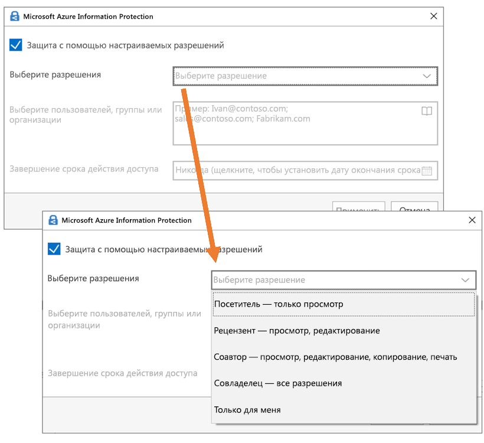

# Ограничение доступа к содержимому с помощью шифрования в метках конфиденциальностиRestrict access to content by using encryption in sensitivity labels

При создании метки конфиденциальности можно ограничить доступ к содержимому, которому будет присвоена метка. Например параметры шифрования метки конфиденциальности позволяют обеспечить защиту содержимого, чтобы:When you create a sensitivity label, you can restrict access to content that the label will be applied to. For example, with the encryption settings for a sensitivity label, you can protect content so that:

- только пользователи организации могли открывать конфиденциальные документы или сообщения электронной почты;Only users within your organization can open a confidential document or email.
- только пользователи в отделе маркетинга могли редактировать и выводить на печать документы рекламных объявлений или сообщения электронной почты, а всем остальным пользователям вашей организации они были доступны только для чтения;Only users in the marketing department can edit and print the promotion announcement document or email, while all other users in your organization can only read it.
- пользователи не могли пересылать сообщения электронной почты или копировать данные из них, если в них содержатся новости о внутренней реорганизации;Users cannot forward an email or copy information from it that contains news about an internal reorganization.
- текущий список цен, отправляемый бизнес-партнерам, нельзя было открыть после определенной даты.The current price list that is sent to business partners cannot be opened after a specified date.

Если документ или сообщение электронной почты шифруются, доступ к содержимому ограничивается, чтобы:When a document or email is encrypted, access to the content is restricted, so that it:

- его могли расшифровать только пользователи, которым были предоставлены соответствующие права доступа параметрами шифрования метки;Can be decrypted only by users authorized by the label’s encryption settings.
- оно оставалось зашифрованным независимо от того, где находится, внутри или за пределами вашей организации, даже если файл будет переименован;Remains encrypted no matter where it resides, inside or outside your organization, even if the file’s renamed.
- оно оставалось зашифрованным во время хранения (например, в учетной записи OneDrive) и при передаче (например, при отправлении электронной почты).Is encrypted both at rest (for example, in a OneDrive account) and in transit (for example, a sent email).

Наконец, являясь администратором, при создании метки конфиденциальности вы можете по своему усмотрению выбрать одно из действий ниже.Finally, as an admin, when you create a sensitivity label, you can choose either to:

- **Назначить разрешения сразу**, чтобы указать конкретных пользователей и разрешения, которые они получат на содержимое с такой меткой.**Assign permissions now**, so that you determine exactly which users get which permissions to content with that label.
- **Позволить пользователям назначать разрешения**, когда они применяют метку к содержимому.**Let users assign permissions** when they apply the label to content. Таким образом, вы обеспечите пользователям вашей организации определенную гибкость, которая может быть необходима для совместной работы и выполнения рабочих задач.This way, you can allow people in your organization some flexibility that they might need to collaborate and get their work done.

Параметры шифрования доступны при создании метки конфиденциальности в Центре соответствия требованиям Microsoft 365, Центре безопасности Microsoft 365 и Центре безопасности и соответствия требованиям Office 365.The encryption settings are available when you create a sensitivity label in the Microsoft 365 compliance center, Microsoft 365 security center, or Office 365 Security & Compliance Center. На левой панели навигации выберите **Классификация** > **Метка конфиденциальности** > **Создать метку**.In the left nav, choose **Classification** > **Sensitivity label** > **Create a label**.

## Как работает шифрованиеHow encryption works

Шифрование использует службу Microsoft Azure AD Rights Management (Microsoft Azure RMS). Служба Microsoft Azure RMS использует шифрование, удостоверения и политики авторизации. Дополнительные сведения см. в статье [Что представляет собой служба Microsoft Azure AD Rights Management?](https://docs.microsoft.com/ru-RU/azure/information-protection/what-is-azure-rms)Encryption uses Azure Rights Management (Azure RMS). Azure RMS uses encryption, identity, and authorization policies. To learn more, see [What is Azure Rights Management?](https://docs.microsoft.com/ru-RU/azure/information-protection/what-is-azure-rms)

## Как включить шифрование для метки конфиденциальностиHow to turn on encryption for a sensitivity label

Чтобы начать, просто переведите переключатель **Шифрование** в положение **Вкл.**, а затем выберите один из вариантов ниже.To begin, simply toggle **Encryption** to **On**, and then choose whether to:

- **Назначить разрешения сразу**, чтобы указать конкретных пользователей и разрешения, которые они получат на содержимое с такой меткой.**Assign permissions now**, so that you can determine exactly which users get which permissions to content with that label. Дополнительные сведения см. в следующем разделе [Назначение разрешений сразу](#assign-permissions-now).For more information, see the next section.
- **Позволить пользователям назначать разрешения**, когда они применяют метку к содержимому.**Let users assign permissions** when they apply the label to content. Таким образом, вы обеспечите пользователям вашей организации определенную гибкость, которая может быть необходима для совместной работы и выполнения рабочих задач.This way, you can allow people in your organization some flexibility that they might need to collaborate and get their work done. Дополнительные сведения см. в разделе ниже [Предоставление пользователям возможности назначать разрешения](#let-users-assign-permissions).For more information, see the below section [Let users assign permissions](#let-users-assign-permissions).

Например, если у вас метка конфиденциальности с именем **Строго конфиденциально**, которая будет применяться к данным самого высокого уровня конфиденциальности, вам может понадобиться сразу указать пользователей, которые получат разрешение на такое содержимое, а также тип разрешений.For example, if you have a sensitivity label named **Highly Confidential** that will be applied to your most sensitive content, you may want to decide now who gets what type of permissions to that content.

Кроме того, если у вас метка конфиденциальности с именем **Деловые контракты**, а рабочий процесс вашей организации требует, чтобы пользователи по мере необходимости работали над таким содержимым совместно с разными специалистами, вы можете позволить пользователям самостоятельно указывать, кто получит разрешения, при назначении метки.Alternatively, if you have a sensitivity label named **Business Contracts**, and your organization's workflow requires that your people collaborate on this content with different people on an ad hoc basis, you may want to allow your users to decide who gets permissions when they assign the label. Такая гибкость способствует продуктивной работе пользователей и сокращает количество обращений к администраторам с просьбой обновить или создать новые метки конфиденциальности в соответствии с определенными сценариями.This flexibility both helps your users' productivity and reduces the requests for your admins to update or create new sensitivity labels to address specific scenarios.

## Назначение разрешений сразуAssign permissions now

С помощью вариантов ниже можно выбрать пользователей, получающих доступ к электронной почте или документам, которым присваивается эта метка.To begin, simply toggle Encryption to On, and then use the options below to control who can access email or documents to which this label is applied. You can: Вы можете выполнить указанные ниже действия.You can:

1. **Применение шифрования к электронной почте и документам или только к электронной почте.** Если вы выберете только электронную почту, сообщения с такой меткой будут шифроваться в Outlook, но документы с такой меткой в других приложениях, например Word или PowerPoint, шифроваться не будут.**Apply encryption to both email and documents, or just email.** If you choose just email, messages with this label will be encrypted in Outlook, but documents with this label won't be encrypted in other apps, such as Word or PowerPoint. 
2. **Разрешение окончания срока действия доступа к содержимому с присвоенной меткой** на определенную дату или после определенного количества дней, после того как метка будет применена. После этого пользователи не смогут открывать элемент с меткой. Если указать дату, действительным сроком ее наступления будет считаться соответствующая дата на момент полночи в вашем текущем часовом поясе. (Обратите внимание, что некоторые почтовые клиенты могут не применять срок действия и отображают письма после истечения их срока действия, что связано с их механизмами кэширования).**Allow access to labeled content to expire**, either on a specific date or after a specific number of days after the label is applied. After this time, users won’t be able to open the labeled item. If you specify a date, it is effective midnight on that date in your current time zone. (Note that some email clients may not enforce expiration and show emails past their expiration date, due to their caching mechanisms.)
3. **Разрешение доступа в режиме автономной работы** с вариантами "никогда", "всегда" или "на определенное количество дней", после того как метка будет присвоена. Если вы ограничиваете доступ в режиме автономной работы вариантом "никогда" или "на определенное количество дней", при достижении соответствующего порогового значения пользователи должны повторить аутентификацию, а сведения об их доступе записываются в журнал. Дополнительные сведения см. следующем разделе о лицензии на использование службы управления правами.**Allow offline access** never, always, or for a specific number of days after the label is applied. If you restrict offline access to never or a number of days, when that threshold is reached, users must be reauthenticated and their access is logged. For more information, see the next section on the Rights Management use license.

### Служба управления правами использует лицензию для доступа в режиме автономной работыRights Management use license for offline access

Когда пользователь открывает в режиме автономного доступа документ или электронную почту, защищенные меткой конфиденциальности, пользователю предоставляется лицензия на использование службы Azure Rights Management для такого содержимого. Такая лицензия на использование — это сертификат, который содержит права пользователя на использование такого документа или сообщения электронной почты, а также ключ шифрования, который использовался для шифрования содержимого. Лицензия на использование также содержит дату окончания срока действия, если она была задана, и сведения о том, как долго будет действительна лицензия на использование.When a user opens a document or email offline that’s been protected by a sensitivity label, an Azure Rights Management use license for that content is granted to the user. This use license is a certificate that contains the user's usage rights for the document or email, and the encryption key that was used to encrypt the content. The use license also contains an expiration date if this has been set, and how long the use license is valid.

Если дата окончания срока действия не задана, срок действия лицензии на использование для клиента по умолчанию составляет 30 дней. На протяжении срока действия лицензии на использование пользователь не проходит повторные проверки подлинности и прав доступа. Это позволяет пользователю открывать защищенный документ или электронную почту без подключения к Интернету. По истечении срока действия лицензии на использование, когда в следующий раз пользователь будет выполнять доступ к защищенному документу или электронной почте, ему потребуется повторно пройти проверку подлинности и прав доступа.If no expiration date has been set, the default use license validity period for a tenant is 30 days. For the duration of the use license, the user is not reauthenticated or reauthorized for the content. This lets the user continue to open the protected document or email without an Internet connection. When the use license validity period expires, the next time the user accesses the protected document or email, the user must be reauthenticated and reauthorized.

Помимо повторной проверки подлинности переоцениваются политики и принадлежность пользователя к группе. Это означает, что результаты доступа к одну и тому же документу или электронной почте для пользователей могут быть разными, если будут изменения в политике или принадлежности к группе со времени последнего доступа к содержимому.In addition to reauthentication, the policy and user group membership is reevaluated. This means that users could experience different access results for the same document or email if there are changes in the policy or group membership from when they last accessed the content.

Чтобы узнать, как изменить стандартный параметр 30-дневного срока действия, см. раздел [Лицензия на использования службы Microsoft Azure AD Rights Management](https://docs.microsoft.com/ru-RU/azure/information-protection/configure-usage-rights#rights-management-use-license).To learn how to change the default 30-day setting, see [Rights Management use license](https://docs.microsoft.com/ru-RU/azure/information-protection/configure-usage-rights#rights-management-use-license).

### Назначение разрешений определенным пользователям или группамAssign permissions to specific users or groups

Вы можете предоставить разрешения определенным людям, чтобы только они могли работать с содержимым, которому присвоена метка.You can grant permissions to specific people so that only they can interact with the labeled content.

Это простой процесс, состоящий из двух этапов.Doing so is a straightforward two-step process:

1. Сначала вы добавляете пользователей или группы, которым будут назначены разрешения в отношении содержимого с присвоенной меткой.First you add users or groups that will be assigned permissions to the labeled content.
2. Затем вы выбираете, какие разрешения будут иметь такие пользователи в отношении содержимого с присвоенной меткой.Then you choose which permissions those users have for the labeled content.

#### Добавление пользователей или группAdd users or groups

Когда вы назначаете разрешения, вы можете выбрать один из приведенных ниже вариантов.When you assign permissions, you can choose:

- Все сотрудники вашей организации (все участники клиента). Этот параметр исключает гостевые учетные записи.Everyone in your organization (all tenant members). This setting excludes guest accounts.
- Любой конкретный пользователь или группа безопасности с поддержкой электронной почты, группа рассылки, группа Office 365 или динамическая группа рассылки.Any specific user or email-enabled security group, distribution group, Office 365 group, or dynamic distribution group. 
- Любой адрес электронной почты или домен вне вашей организации, например gmail.com, hotmail.com или outlook.com.Any email address or domain outside your organization, such as gmail.com, hotmail.com, or outlook.com.

Если вы выбираете всех пользователей клиента или указываете каталог, пользователи или группы должны иметь адрес электронной почты.When you choose all tenant members or browse the directory, the users or groups must have an email address.

Оптимальной практикой является использование групп, а не отдельных пользователей. Такая стратегия позволяет упростить всю конфигурацию.As a best practice, use groups rather than users. This strategy keeps your configuration simpler.

#### Выбор разрешенийChoose permissions

При выборе того, какие разрешения следует предоставить определенным пользователям или группам, вы можете выбрать один из приведенных ниже вариантов.When you choose which permissions to allow for those users or groups, you can select either:

- [Заранее определенный уровень разрешений](https://docs.microsoft.com/ru-RU/azure/information-protection/configure-usage-rights#rights-included-in-permissions-levels) с предварительно заданной группой прав, например "Соавтор" или "Рецензент".A [predefined permissions level](https://docs.microsoft.com/ru-RU/azure/information-protection/configure-usage-rights#rights-included-in-permissions-levels) with a preset group of rights, such as Co-Author or Reviewer.
- Настраиваемая группа прав, в которой вы можете выбрать, какие разрешения вам нужны.A Custom group of rights, where you choose whichever permissions you want.

Дополнительные сведения по каждому конкретному виду разрешений см. в статье [Права на использование и их описание](https://docs.microsoft.com/ru-RU/azure/information-protection/configure-usage-rights#usage-rights-and-descriptions).For more information on each specific permission, see [Usage rights and descriptions](https://docs.microsoft.com/ru-RU/azure/information-protection/configure-usage-rights#usage-rights-and-descriptions).  

Обратите внимание на то, что одна и та же метка может предоставлять разные разрешения для разных пользователей. Например одна метка может назначить нескольких пользователей как проверяющих, а одного — как соавтора, как показано ниже.Note that the same label can grant different permissions to different users. For example, a single label can assign some users as Reviewer and a different user as Co-author, as shown below.

Чтобы сделать это, добавьте пользователей или группы, назначьте им разрешения и сохраните эти параметры. Затем повторите эти действия — добавление пользователей и назначение им разрешений, каждый раз сохраняя параметры. Это можно сделать столько раз, сколько требуется, чтобы определить разные разрешения для разных пользователей.To do this, add users or groups, assign them permissions, and save those settings. Then repeat these steps, adding users and assigning them permissions, saving the settings each time. You can do this as often as necessary, to define different permissions for different users.

#### У издателя в службе управления правами (пользователь, применяющий метку конфиденциальности) всегда остается полный контрольRights Management issuer (user applying the sensitivity label) always has Full Control

Шифрование для метки конфиденциальности использует службу Microsoft Azure RMS. Когда пользователь применяет метку конфиденциальности для защиты документа или электронной почты с помощью службы Microsoft Azure RMS, он становится издателем в службе управления правами для такого содержимого.Encryption for a sensitivity label uses Azure RMS. When a user applies a sensitivity label to protect a document or email by using Azure RMS, that user becomes the Rights Management issuers for that content.

Издателю в службе управления правами всегда предоставляются разрешения на полный доступ для документа или электронной почты, а также приведенные ниже полномочия.The Rights Management issuer is always granted Full Control permissions for the document or email, and in addition:

- Если в параметрах защиты есть дата окончания срока действия, издатель в службе управления правами по-прежнему может открывать и редактировать документ или сообщения электронной почты после этой даты.If the protection settings include an expiration date, the Rights Management issuer can still open and edit the document or email after that date.
- Издатель в службе управления правами всегда может получить доступ к документу или электронной почте в режиме автономной работы.The Rights Management issuer can always access the document or email offline.
- Издатель в службе управления правами по-прежнему может открывать документ после того, как тот будет отозван.The Rights Management issuer can still open a document after it is revoked.

Дополнительные сведения см. в статье [Издатель в службе управления правами и владелец в службе управления правами](https://docs.microsoft.com/ru-RU/azure/information-protection/configure-usage-rights#rights-management-issuer-and-rights-management-owner).For more information, see [Rights Management issuer and Rights Management owner](https://docs.microsoft.com/ru-RU/azure/information-protection/configure-usage-rights#rights-management-issuer-and-rights-management-owner).

## Предоставление пользователям возможности назначать разрешенияLet users assign permissions

Этот вариант можно использовать, чтобы позволить пользователям назначать разрешения, когда они вручную применяют метку конфиденциальности к содержимому.You can use these options to let users assign permissions when they manually apply a sensitivity label to content:

- В Outlook пользователь может использовать ограничения, эквивалентные параметру **Не пересылать**.In Outlook, a user can enforce restrictions equivalent to the **Do Not Forward** option. Этот параметр является встроенным в Outlook для Windows и не требует установки клиента унифицированных меток Azure Information Protection.This option is supported natively in Outlook on Windows, and does not require you to install the Azure Information Protection unified labeling client.
- В Word, PowerPoint и Excel пользователю предлагается выбрать уровень разрешения для определенных пользователей, групп или организаций.In Word, PowerPoint, and Excel, a user is prompted to select a permission level for specific users, groups, or organizations. Этот параметр не является встроенным в данных приложениях Office, поэтому вашим пользователям потребуется установить клиент унифицированных меток Azure Information Protection.This option is not supported natively in these Office apps, so your users must install the Azure Information Protection unified labeling client.

Данные параметры определяют, в каких приложениях будет отображаться метка конфиденциальности.These options determine in which apps the sensitivity label will appear:

- Если для метки конфиденциальности включен только параметр Outlook, метка будет отображаться пользователям только в Outlook.If the sensitivity label has only the Outlook option enabled, the label will appear to users only in Outlook.
- Если для метки конфиденциальности включен только параметр Word, PowerPoint и Excel, метка будет отображаться пользователям только в этих приложениях.If the sensitivity label has only the Word, PowerPoint, and Excel option enabled, the label will appear to users only in those apps.
- Если для метки конфиденциальности включены оба параметра, метка будет отображаться пользователям во всех доступных приложениях: Outlook, Word, PowerPoint и Excel.If the sensitivity label has both options enabled, the label will appear to users in all of the available apps: Outlook, Word, PowerPoint, and Excel.

Метку конфиденциальности, которая позволяет пользователям назначать разрешения, пользователи могут применять к содержимому только вручную; она не может применяться автоматически или использоваться в качестве рекомендуемой метки.A sensitivity label that lets users assign permissions can be applied to content only manually by users; it can't be auto-applied or used as a recommended label.

> [!NOTE]
> Чтобы позволить пользователям назначать разрешения, требуется подписка на Azure Information Protection.Letting users assign permissions requires an Azure Information Protection subscription. Чтобы использовать эту функцию в Word, PowerPoint и Excel, необходимо скачать и установить [клиент унифицированных меток Azure Information Protection](https://docs.microsoft.com/azure/information-protection/rms-client/install-unifiedlabelingclient-app).To use this feature in Word, PowerPoint, and Excel, you must download and install the [Azure Information Protection unified labeling client](https://docs.microsoft.com/azure/information-protection/rms-client/install-unifiedlabelingclient-app). Собственная поддержка этой функции приложениями Office, без установки клиента Azure Information Protection, находится в процессе разработки.We're working on native support for this feature in these Office apps, so that they won't require the Azure Information Protection client. Кроме того, клиент выполняется только в Windows, поэтому данная функция еще не поддерживается на устройствах Mac, на базе iOS и Android, а также для Office в Интернете.Also, the client runs only on Windows, so this feature is not yet supported on Mac, iOS, Android, or Office for the web.

### Ограничения для OutlookOutlook restrictions

В Outlook, когда пользователь применяет метку конфиденциальности, которая позволяет ему назначать разрешения сообщению, ограничения соответствуют параметру "Не пересылать".In Outlook, when a user applies a sensitivity label that lets them assign permissions to a message, the restrictions are the same as the Do Not Forward option. Пользователь видит имя и описание метки в верхней части сообщения, что указывает на защиту содержимого.The user will see the label name and description at the top of the message, which indicates the content's being protected. В отличие от Word, PowerPoint и Excel (см. [следующий раздел](#word-powerpoint-and-excel-permissions)), пользователям не предлагается выбрать определенные разрешения.Unlike Word, PowerPoint, and Excel (see the [next section](#word-powerpoint-and-excel-permissions)), users aren't prompted to select specific permissions.

Если к сообщению электронной почты применяется параметр "Не пересылать", оно зашифровано, и получатели должны пройти проверку подлинности.When the Do Not Forward option is applied to an email, the email is encrypted and recipients must be authenticated. В этом случае получатели не смогут пересылать, печатать или копировать из него фрагменты.Then, the recipients cannot forward it, print it, or copy from it. Например, в клиенте Outlook кнопка "Переслать" недоступна, пункты меню "Сохранить как" и "Печать" недоступны, и вы не сможете добавить или изменить получателей в полях "Кому", "Копия" или "СК".For example, in the Outlook client, the Forward button is not available, the Save As and Print menu options are not available, and you cannot add or change recipients in the To, Cc, or Bcc boxes.

Незащищенные документы Office, вложенные в сообщение электронной почты, автоматически наследуют такие же ограничения.Unprotected Office documents that are attached to the email automatically inherit the same restrictions. Права на использование, применяемые к таким документам, — "Редактировать содержимое", "Редактировать", "Сохранить", "Просмотреть", "Открыть", "Прочесть" и "Разрешить макросы".The usage rights applied to these documents are Edit Content, Edit; Save; View, Open, Read; and Allow Macros. Если пользователю необходимы другие права на использование для вложения, или вложение не является документом Office и не поддерживает наследование защиты, пользователю нужно будет защитить файл, прежде чем вложить его в сообщение электронной почты.If the user wants different usage rights for an attachment, or the attachment is not an Office document that supports this inherited protection, the user needs to protect the file before attaching it to the email.

### Разрешения для Word, PowerPoint и ExcelWord, PowerPoint, and Excel permissions

В Word, PowerPoint и Excel, когда пользователь применяет метку конфиденциальности, которая позволяет назначать разрешения документу, ему предлагается защитить содержимое, как описано ниже.In Word, PowerPoint, and Excel, when a user applies a sensitivity label that lets them assign permissions to a document, they are prompted to protect the content as shown below.

Пользователю доступны приведенные ниже варианты.The user can move and resize it.

- Выбрать уровень разрешения, например "Пользователь с правом на просмотр" (при этом назначается разрешение "Только просмотр") или "Соавтор" (при этом назначаются разрешения "Просмотр", "Редактирование", "Копирование" и "Печать").Select a permission level, such as Viewer (which assigns View Only permission) or Co-Author (which assigns View, Edit, Copy, and Print permissions).
- Выбрать пользователей, группы, организации.Select users, groups, or organizations. Сюда могут входить пользователи в пределах организации или за ее пределами.This can include people both inside or outside your organizations.
- Задать срок действия, после которого выбранные пользователи не смогут получить доступ к содержимому.Set an expiration date, after which the selected users cannot access the content. Дополнительные сведения см. в разделе выше [Лицензия на использование службы управления правами для доступа в режиме автономной работы](#rights-management-use-license-for-offline-access).For more information, see the above section [Rights Management use license for offline access](#rights-management-use-license-for-offline-access).

## Что происходит с существующим шифрованием при применении меткиWhat happens to existing encryption when a label's applied

Возможно, что пользователь уже зашифровал содержимое, применив другие параметры защиты до присвоения метки конфиденциальности к содержимому.Before a sensitivity label is applied to content, it's possible that a user already encrypted the content by applying some other protection setting. Например, пользователь мог применить:For example, a user might have applied:

- Параметр **"Не пересылать"**.The **Do Not Forward** option.
- Настраиваемую защиту с помощью унифицированного клиента присвоения меток Azure Information Protection.Custom protection by using the Azure Information Protection unified labeling client.
- Шаблон службы Azure Rights Management (RMS), шифрующий содержимое, но не связанный с меткой.An Azure Rights Management Service (RMS) template that encrypts the content but is not associated with a label.

В этой таблице указано, что происходит с существующим шифрованием при применении к содержимому метки конфиденциальности.This table describe what happens to existing encyption when a sensitivity label is applied to that content.
 
 

| |**Пользователь применяет метку конфиденциальности с отключенным шифрованием****User applies a sensitivity label with encryption turned off**|**Пользователь применяет метку конфиденциальности с включенным шифрованием****User applies a sensitivity label with encryption turned on**|**Пользователь применяет метку с удалением защиты**1**User applies a label with Remove Protection**1|
|:-----|:-----|:-----|:-----|
|**Не пересылать****Do Not Forward**|Электронная почта — защита удаляетсяEmail - Protection is removed Документ — защита сохраняетсяDocument - Protection is preserved|Применяется защита меткиLabel protection is applied|Параметр **Не пересылать** отключается**Do Not Forward** is removed|
|**Настраиваемая защита**1**Custom protection**1|Защита сохраняетсяProtection is preserved|Применяется защита меткиLabel protection is applied|Настраиваемая защита удаляетсяCustom protection is removed|
|**Шаблон Azure RMS****Azure RMS template**|Защита сохраняетсяProtection is preserved|Применяется защита меткиLabel protection is applied|Настраиваемая защита удаляетсяCustom protection is removed|

1 Эта возможность поддерживается только в клиенте присвоения меток Azure Information Protection.1This is supported only in the Azure Information Protection labeling client.

## Хранение зашифрованного содержимого в OneDrive и SharePointStoring encrypted content in OneDrive and SharePoint

Следует иметь в виду, что когда шифрование применяется к файлам, которые хранятся в OneDrive и SharePoint, служба не может обработать содержимое этих файлов. Это означает, что такие функции, как совместное редактирование, обнаружение электронных данных, поиск, Delve и другие функции совместной работы, неактивны. Кроме того, политики защиты от потери данных (DLP) могут работать только с метаданными (включая метки Office 365), но не с содержимым зашифрованных файлов (например, номерами кредитных карт в файлах).Be aware that when encryption is applied to files stored in OneDrive and SharePoint, the service cannot process the contents of these files. This means that features such as co-authoring, eDiscovery, search, Delve, and other collaborative features do not work. Also, data loss prevention (DLP) policies can work only with the metadata (including Office 365 labels) but not the contents of encrypted files (such as credit card numbers within files).

Это применяется только к содержимому, которое хранится в OneDrive и SharePoint. В Exchange Online правила потока обработки почты (также называемые правилами транспорта) используют [учетную запись привилегированного пользователя](https://docs.microsoft.com/ru-RU/azure/information-protection/configure-super-users), чтобы можно было просканировать зашифрованное содержимое и применить политики DLP.This applies only to content stored in OneDrive and SharePoint. In Exchange Online, mail flow rules (also known as transport rules) use the [super user account](https://docs.microsoft.com/ru-RU/azure/information-protection/configure-super-users) so that they can scan encrypted content and enforce DLP policies.

## Важные предварительные условияImportant prerequisites

Прежде чем вы сможете использовать шифрование, вам может понадобиться выполнить приведенные ниже задачи.Before you can use encryption, you might need to perform these tasks.

### Активация Microsoft Azure AD Rights ManagementActivating Azure Rights Management

Чтобы использовать шифрование в метках конфиденциальности, службу Microsoft Azure AD Rights Management необходимо активировать в вашем клиенте. В более новых клиентах служба включена по умолчанию, однако может понадобиться вручную активировать ее. Дополнительные сведения см. в статье [Активация службы Microsoft Azure AD Rights Management](https://docs.microsoft.com/ru-RU/azure/information-protection/activate-service).To use encryption in sensitivity labels, the Azure Rights Management service needs to be activated in your tenant. In newer tenants, the service is on by default, but you might need to manually activate the service. For more information, see [Activating Azure Rights Management](https://docs.microsoft.com/ru-RU/azure/information-protection/activate-service).

### Настройка Exchange для Microsoft Azure Information ProtectionConfigure Exchange for Azure Information Protection

Службу Exchange не нужно настраивать для Azure Information Protection, прежде чем пользователи смогут применять метки в Outlook, чтобы защитить свои сообщения электронной почты. Тем не менее, пока служба Exchange не будет настроена для Azure Information Protection, вы не сможете задействовать все функции при использовании защиты Microsoft Azure AD Rights Management с Exchange.Exchange does not have to be configured for Azure Information Protection before users can apply labels in Outlook to protect their emails. However, until Exchange is configured for Azure Information Protection, you do not get the full functionality of using Azure Rights Management protection with Exchange.
 
Например, пользователи не могут просматривать защищенную электронную почту с мобильных телефонов или с помощью веб-версии Outlook, защищенные сообщения электронной почты нельзя проиндексировать для поиска, а также невозможно настроить Exchange Online DLP для защиты службы управления правами.For example, users cannot view protected emails on mobile phones or with Outlook on the web, protected emails cannot be indexed for search, and you cannot configure Exchange Online DLP for Rights Management protection. 

Чтобы убедиться в том, что служба Exchange сможет поддерживать такие дополнительные сценарии, см. ниже.To ensure that Exchange can support these additional scenarios, see the following:

- Для Exchange Online см. инструкции для [Exchange Online: настройка IRM](https://docs.microsoft.com/ru-RU/azure/information-protection/configure-office365#exchange-online-irm-configuration).For Exchange Online, see the instructions for [Exchange Online: IRM Configuration](https://docs.microsoft.com/ru-RU/azure/information-protection/configure-office365#exchange-online-irm-configuration).
- Для использования Exchange в локальной среде необходимо развертывание [соединителя RMS и настройка серверов Exchange](https://docs.microsoft.com/ru-RU/azure/information-protection/deploy-rms-connector).For Exchange on-premises, you must deploy the [RMS connector and configure your Exchange servers](https://docs.microsoft.com/ru-RU/azure/information-protection/deploy-rms-connector). 
