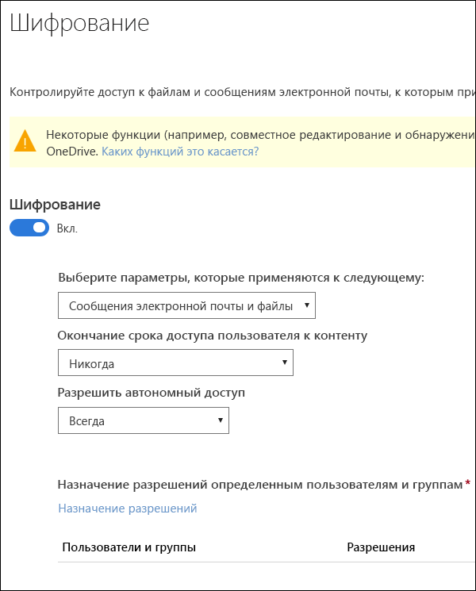
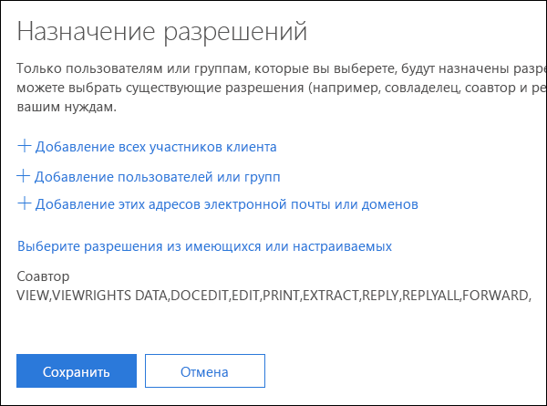
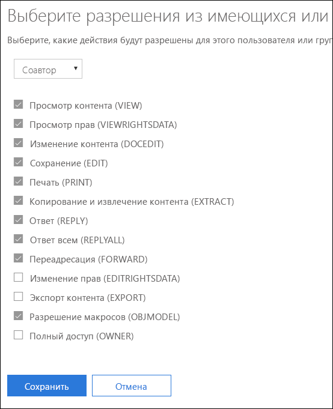
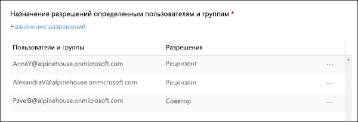

# Ограничение доступа к содержимому с помощью шифрования в метках конфиденциальностиRestrict access to content by using encryption in sensitivity labels

При создании метки конфиденциальности можно ограничить доступ к содержимому, которому будет присвоена метка. Например параметры шифрования метки конфиденциальности позволяют обеспечить защиту содержимого, чтобы:When you create a sensitivity label, you can restrict access to content that the label will be applied to. For example, with the encryption settings for a sensitivity label, you can protect content so that:

- только пользователи организации могли открывать конфиденциальные документы или сообщения электронной почты;Only users within your organization can open a confidential document or email.
- только пользователи в отделе маркетинга могли редактировать и выводить на печать документы рекламных объявлений или сообщения электронной почты, а всем остальным пользователям вашей организации они были доступны только для чтения;Only users in the marketing department can edit and print the promotion announcement document or email, while all other users in your organization can only read it.
- пользователи не могли пересылать сообщения электронной почты или копировать данные из них, если в них содержатся новости о внутренней реорганизации;Users cannot forward an email or copy information from it that contains news about an internal reorganization.
- текущий список цен, отправляемый бизнес-партнерам, нельзя было открыть после определенной даты.The current price list that is sent to business partners cannot be opened after a specified date.

Если документ или сообщение электронной почты шифруются, доступ к содержимому ограничивается, чтобы:When a document or email is encrypted, access to the content is restricted, so that it:

- его могли расшифровать только пользователи, которым были предоставлены соответствующие права доступа параметрами шифрования метки;Can be decrypted only by users authorized by the label’s encryption settings.
- оно оставалось зашифрованным независимо от того, где находится, внутри или за пределами вашей организации, даже если файл будет переименован;Remains encrypted no matter where it resides, inside or outside your organization, even if the file’s renamed.
- оно оставалось зашифрованным во время хранения (например, в учетной записи OneDrive) и при передаче (например, при отправлении электронной почты).Is encrypted both at rest (for example, in a OneDrive account) and in transit (for example, a sent email).

Параметры шифрования доступны в Центре безопасности и соответствия требованиям Office 365 > страница **Метки** > вкладка **Конфиденциальность** > **Создать метку**.The encryption settings are available in the Office 365 Security & Compliance Center > **Labels** page > **Sensitivity** tab > **Create a label**.

## Как работает шифрованиеHow encryption works

Шифрование использует службу Microsoft Azure AD Rights Management (Microsoft Azure RMS). Служба Microsoft Azure RMS использует шифрование, удостоверения и политики авторизации. Дополнительные сведения см. в статье [Что представляет собой служба Microsoft Azure AD Rights Management?](https://docs.microsoft.com/ru-RU/azure/information-protection/what-is-azure-rms)Encryption uses Azure Rights Management (Azure RMS). Azure RMS uses encryption, identity, and authorization policies. To learn more, see [What is Azure Rights Management?](https://docs.microsoft.com/ru-RU/azure/information-protection/what-is-azure-rms)

## Как включить шифрование для метки конфиденциальностиHow to turn on encryption for a sensitivity label

Чтобы начать, просто установите переключатель **Шифрование** в положение **Включить**, а затем с помощью вариантов ниже можно контролировать, у кого есть доступ к электронной почте или документам, которым присваивается эта метка. Вам доступны приведенные ниже возможности.To begin, simply toggle **Encryption** to **On**, and then use the options below to control who can acess email or documents to which this label is applied. You can:

1. **Применение шифрования к электронной почте и документам или только к электронной почте.** Если вы выберете только электронную почту, сообщения с такой меткой будут шифроваться в Outlook, но документы с такой меткой в других приложениях, например Word или PowerPoint, шифроваться не будут.**Apply encryption to both email and documents, or just email.** If you choose just email, messages with this label will be encrypted in Outlook, but documents with this label won't be encrypted in other apps, such as Word or PowerPoint. 
2. **Разрешение окончания срока действия доступа к содержимому** на определенную дату или после определенного количества дней, после того как метка будет применена. После этого пользователи не смогут открывать элемент с меткой. Если указать дату, действительным сроком ее наступления будет считаться соответствующая дата на момент полночи в вашем текущем часовом поясе.**Allow access to labeled content to expire**, either on a specific date or after a specific number of days after the label is applied. After this time, users won’t be able to open the labeled item. If you specify a date, it is effective midnight on that date in your current time zone. 
3. **Разрешение доступа в режиме автономной работы** с вариантами "никогда", "всегда" или "на определенное количество дней", после того как метка будет присвоена. Если вы ограничиваете доступ в режиме автономной работы вариантом "никогда" или "на определенное количество дней", при достижении соответствующего порогового значения пользователи должны повторить аутентификацию, а сведения об их доступе записываются в журнал. Дополнительные сведения см. следующем разделе о лицензии на использование службы управления правами.**Allow offline access** never, always, or for a specific number of days after the label is applied. If you restrict offline access to never or a number of days, when that threshold is reached, users must be reauthenticated and their access is logged. For more information, see the next section on the Rights Management use license.

### Служба управления правами использует лицензию для доступа в режиме автономной работыRights Management use license for offline access

Когда пользователь открывает в режиме автономного доступа документ или электронную почту, защищенные меткой конфиденциальности, пользователю предоставляется лицензия на использование службы Azure Rights Management для такого содержимого. Такая лицензия на использование — это сертификат, который содержит права пользователя на использование такого документа или сообщения электронной почты, а также ключ шифрования, который использовался для шифрования содержимого. Лицензия на использование также содержит дату окончания срока действия, если она была задана, и сведения о том, как долго будет действительна лицензия на использование.When a user opens a document or email offline that’s been protected by a sensitivity label, an Azure Rights Management use license for that content is granted to the user. This use license is a certificate that contains the user's usage rights for the document or email, and the encryption key that was used to encrypt the content. The use license also contains an expiration date if this has been set, and how long the use license is valid.

Если дата окончания срока действия не задана, срок действия лицензии на использование для клиента по умолчанию составляет 30 дней. На протяжении срока действия лицензии на использование пользователь не проходит повторные проверки подлинности и прав доступа. Это позволяет пользователю открывать защищенный документ или электронную почту без подключения к Интернету. По истечении срока действия лицензии на использование, когда в следующий раз пользователь будет выполнять доступ к защищенному документу или электронной почте, ему потребуется повторно пройти проверку подлинности и прав доступа.If no expiration date has been set, the default use license validity period for a tenant is 30 days. For the duration of the use license, the user is not reauthenticated or reauthorized for the content. This lets the user continue to open the protected document or email without an Internet connection. When the use license validity period expires, the next time the user accesses the protected document or email, the user must be reauthenticated and reauthorized.

Помимо повторной проверки подлинности переоцениваются политики и принадлежность пользователя к группе. Это означает, что результаты доступа к одну и тому же документу или электронной почте для пользователей могут быть разными, если будут изменения в политике или принадлежности к группе со времени последнего доступа к содержимому.In addition to reauthentication, the policy and user group membership is reevaluated. This means that users could experience different access results for the same document or email if there are changes in the policy or group membership from when they last accessed the content.

Чтобы узнать, как изменить стандартный параметр 30-дневного срока действия, см. раздел [Лицензия на использования службы Microsoft Azure AD Rights Management](https://docs.microsoft.com/ru-RU/azure/information-protection/configure-usage-rights#rights-management-use-license).To learn how to change the default 30-day setting, see [Rights Management use license](https://docs.microsoft.com/ru-RU/azure/information-protection/configure-usage-rights#rights-management-use-license).

## Назначение разрешений определенным пользователям или группамAssign permissions to specific users or groups

Вы можете предоставить разрешения определенным людям, чтобы только они могли работать с содержимым, которому присвоена метка.You can grant permissions to specific people so that only they can interact with the labeled content.

Это простой процесс, состоящий из двух этапов.Doing so is a straightforward two-step process:

1. Сначала вы добавляете пользователей или группы, которым будут назначены разрешения в отношении содержимого с присвоенной меткой.First you add users or groups that will be assigned permissions to the labeled content.
2. Затем вы выбираете, какие разрешения будут иметь такие пользователи в отношении содержимого с присвоенной меткой.Then you choose which permissions those users have for the labeled content.

### Добавление пользователей или группAdd users or groups

Когда вы назначаете разрешения, вы можете выбрать один из приведенных ниже вариантов.When you assign permissions, you can choose:

- Все сотрудники вашей организации (все участники клиента). Этот параметр исключает гостевые учетные записи.Everyone in your organization (all tenant members). This setting excludes guest accounts.
- Любой конкретный пользователь или группа безопасности с поддержкой электронной почты, группа рассылки, группа Office 365 или динамическая группа рассылки.Any specific user or email-enabled security group, distribution group, Office 365 group, or dynamic distribution group. 
- Любой адрес электронной почты или домен вне вашей организации, например gmail.com, hotmail.com или outlook.com.Any email address or domain outside your organization, such as gmail.com, hotmail.com, or outlook.com.

Если вы выбираете всех пользователей клиента или указываете каталог, пользователи или группы должны иметь адрес электронной почты.When you choose all tenant members or browse the directory, the users or groups must have an email address.

Оптимальной практикой является использование групп, а не отдельных пользователей. Такая стратегия позволяет упростить всю конфигурацию.As a best practice, use groups rather than users. This strategy keeps your configuration simpler.

### Выбор разрешенийChoose permissions

При выборе того, какие разрешения следует предоставить определенным пользователям или группам, вы можете выбрать один из приведенных ниже вариантов.When you choose which permissions to allow for those users or groups, you can select either:

- [Заранее определенный уровень разрешений](https://docs.microsoft.com/ru-RU/azure/information-protection/configure-usage-rights#rights-included-in-permissions-levels) с предварительно заданной группой прав, например "Соавтор" или "Рецензент".A [predefined permissions level](https://docs.microsoft.com/ru-RU/azure/information-protection/configure-usage-rights#rights-included-in-permissions-levels) with a preset group of rights, such as Co-Author or Reviewer.
- Настраиваемая группа прав, в которой вы можете выбрать, какие разрешения вам нужны.A Custom group of rights, where you choose whichever permissions you want.

Дополнительные сведения по каждому конкретному виду разрешений см. в статье [Права на использование и их описание](https://docs.microsoft.com/ru-RU/azure/information-protection/configure-usage-rights#usage-rights-and-descriptions).For more information on each specific permission, see [Usage rights and descriptions](https://docs.microsoft.com/ru-RU/azure/information-protection/configure-usage-rights#usage-rights-and-descriptions).  

Обратите внимание на то, что одна и та же метка может предоставлять разные разрешения для разных пользователей. Например одна метка может назначить нескольких пользователей как проверяющих, а одного — как соавтора, как показано ниже.Note that the same label can grant different permissions to different users. For example, a single label can assign some users as Reviewer and a different user as Co-author, as shown below.

Чтобы сделать это, добавьте пользователей или группы, назначьте им разрешения и сохраните эти параметры. Затем повторите эти действия — добавление пользователей и назначение им разрешений, каждый раз сохраняя параметры. Это можно сделать столько раз, сколько требуется, чтобы определить разные разрешения для разных пользователей.To do this, add users or groups, assign them permissions, and save those settings. Then repeat these steps, adding users and assigning them permissions, saving the settings each time. You can do this as often as necessary, to define different permissions for different users.

### У издателя в службе управления правами (пользователь, применяющий метку конфиденциальности) всегда остается полный контрольRights Management issuer (user applying the sensitivity label) always has Full Control

Шифрование для метки конфиденциальности использует службу Microsoft Azure RMS. Когда пользователь применяет метку конфиденциальности для защиты документа или электронной почты с помощью службы Microsoft Azure RMS, он становится издателем в службе управления правами для такого содержимого.Encryption for a sensitivity label uses Azure RMS. When a user applies a sensitivity label to protect a document or email by using Azure RMS, that user becomes the Rights Management issuers for that content.

Издателю в службе управления правами всегда предоставляются разрешения на полный доступ для документа или электронной почты, а также приведенные ниже полномочия.The Rights Management issuer is always granted Full Control permissions for the document or email, and in addition:

- Если в параметрах защиты есть дата окончания срока действия, издатель в службе управления правами по-прежнему может открывать и редактировать документ или сообщения электронной почты после этой даты.If the protection settings include an expiration date, the Rights Management issuer can still open and edit the document or email after that date.
- Издатель в службе управления правами всегда может получить доступ к документу или электронной почте в режиме автономной работы.The Rights Management issuer can always access the document or email offline.
- Издатель в службе управления правами по-прежнему может открывать документ после того, как тот будет отозван.The Rights Management issuer can still open a document after it is revoked.

Дополнительные сведения см. в статье [Издатель в службе управления правами и владелец в службе управления правами](https://docs.microsoft.com/ru-RU/azure/information-protection/configure-usage-rights#rights-management-issuer-and-rights-management-owner).For more information, see [Rights Management issuer and Rights Management owner](https://docs.microsoft.com/ru-RU/azure/information-protection/configure-usage-rights#rights-management-issuer-and-rights-management-owner).

## Хранение зашифрованного содержимого в OneDrive и SharePointStoring encrypted content in OneDrive and SharePoint

Следует иметь в виду, что когда шифрование применяется к файлам, которые хранятся в OneDrive и SharePoint, служба не может обработать содержимое этих файлов. Это означает, что такие функции, как совместное редактирование, обнаружение электронных данных, поиск, Delve и другие функции совместной работы, неактивны. Кроме того, политики защиты от потери данных (DLP) могут работать только с метаданными (включая метки Office 365), но не с содержимым зашифрованных файлов (например, номерами кредитных карт в файлах).Be aware that when encryption is applied to files stored in OneDrive and SharePoint, the service cannot process the contents of these files. This means that features such as co-authoring, eDiscovery, search, Delve, and other collaborative features do not work. Also, data loss prevention (DLP) policies can work only with the metadata (including Office 365 labels) but not the contents of encrypted files (such as credit card numbers within files).

Это применяется только к содержимому, которое хранится в OneDrive и SharePoint. В Exchange Online правила транспорта используют [учетную запись привилегированного пользователя](https://docs.microsoft.com/ru-RU/azure/information-protection/configure-super-users), чтобы можно было просканировать зашифрованное содержимое и применить политики DLP.This applies only to content stored in OneDrive and SharePoint. In Exchange Online, transport rules use the [super user account](https://docs.microsoft.com/ru-RU/azure/information-protection/configure-super-users) so that they can scan encrypted content and enforce DLP policies.

## Важные предварительные условияImportant prerequisites

Прежде чем вы сможете использовать шифрование, вам может понадобиться выполнить приведенные ниже задачи.Before you can use encryption, you might need to perform these tasks.

### Активация Microsoft Azure AD Rights ManagementActivating Azure Rights Management

Чтобы использовать шифрование в метках конфиденциальности, службу Microsoft Azure AD Rights Management необходимо активировать в вашем клиенте. В более новых клиентах служба включена по умолчанию, однако может понадобиться вручную активировать ее. Дополнительные сведения см. в статье [Активация службы Microsoft Azure AD Rights Management](https://docs.microsoft.com/ru-RU/azure/information-protection/activate-service).To use encryption in sensitivity labels, the Azure Rights Management service needs to be activated in your tenant. In newer tenants, the service is on by default, but you might need to manually activate the service. For more information, see [Activating Azure Rights Management](https://docs.microsoft.com/ru-RU/azure/information-protection/activate-service).

### Настройка Exchange для Microsoft Azure Information ProtectionConfigure Exchange for Azure Information Protection

Службу Exchange не нужно настраивать для Azure Information Protection, прежде чем пользователи смогут применять метки в Outlook, чтобы защитить свои сообщения электронной почты. Тем не менее, пока служба Exchange не будет настроена для Azure Information Protection, вы не сможете задействовать все функции при использовании защиты Microsoft Azure AD Rights Management с Exchange.Exchange does not have to be configured for Azure Information Protection before users can apply labels in Outlook to protect their emails. However, until Exchange is configured for Azure Information Protection, you do not get the full functionality of using Azure Rights Management protection with Exchange.
 
Например, пользователи не могут просматривать защищенную электронную почту с мобильных телефонов или с помощью веб-версии Outlook, защищенные сообщения электронной почты нельзя проиндексировать для поиска, а также невозможно настроить Exchange Online DLP для защиты службы управления правами.For example, users cannot view protected emails on mobile phones or with Outlook on the web, protected emails cannot be indexed for search, and you cannot configure Exchange Online DLP for Rights Management protection. 

Чтобы убедиться в том, что служба Exchange сможет поддерживать такие дополнительные сценарии, см. ниже.To ensure that Exchange can support these additional scenarios, see the following:

- Для Exchange Online см. инструкции для [Exchange Online: настройка IRM](https://docs.microsoft.com/ru-RU/azure/information-protection/configure-office365#exchange-online-irm-configuration).For Exchange Online, see the instructions for [Exchange Online: IRM Configuration](https://docs.microsoft.com/ru-RU/azure/information-protection/configure-office365#exchange-online-irm-configuration).
- Для использования Exchange в локальной среде необходимо развертывание [соединителя RMS и настройка серверов Exchange](https://docs.microsoft.com/ru-RU/azure/information-protection/deploy-rms-connector).For Exchange on-premises, you must deploy the [RMS connector and configure your Exchange servers](https://docs.microsoft.com/ru-RU/azure/information-protection/deploy-rms-connector). 
