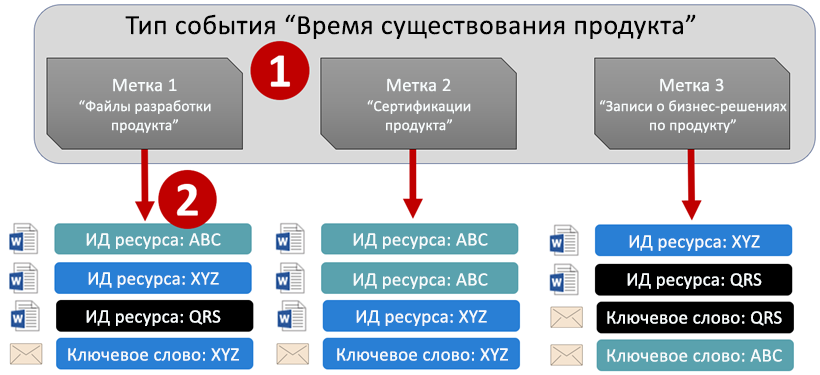
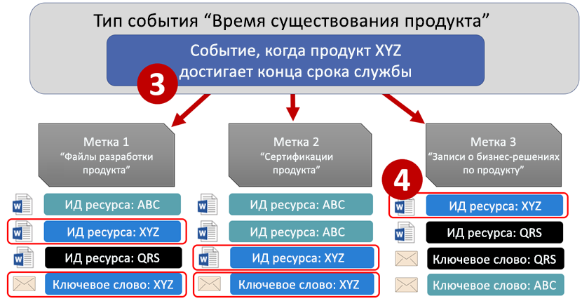
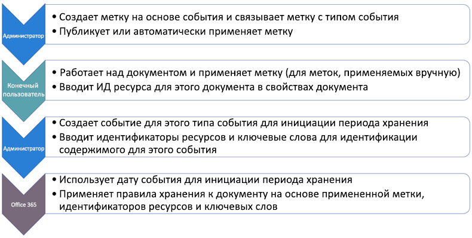
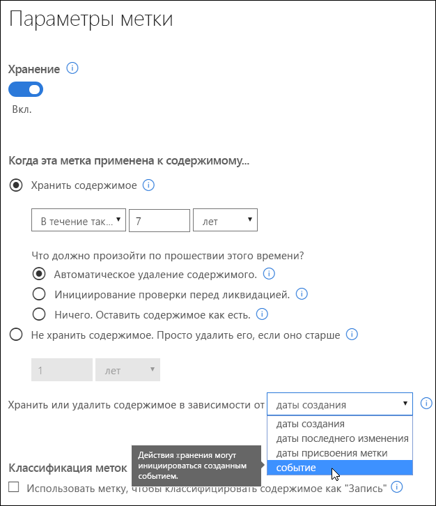
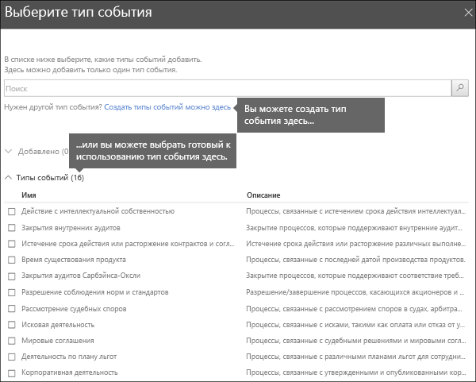
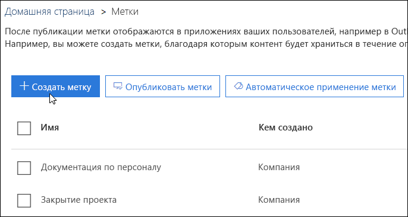
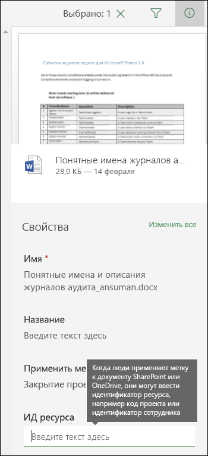
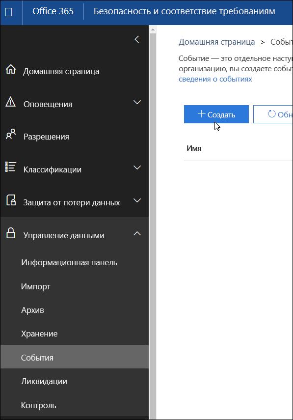
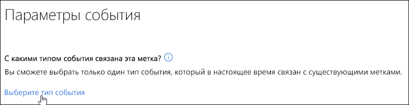
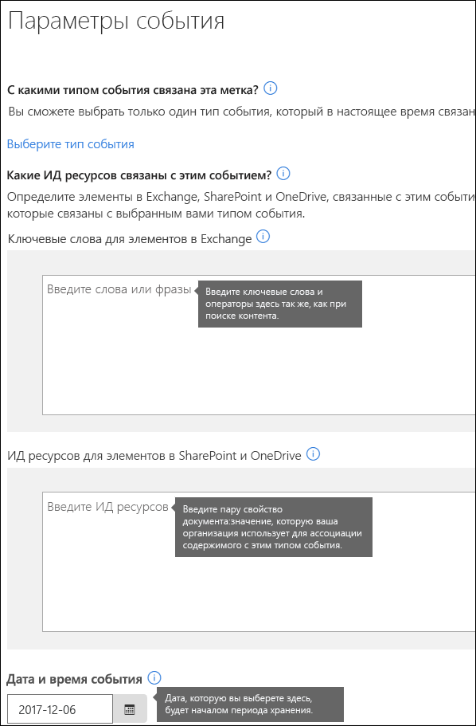

# Общие сведения о хранении, зависящем от возникновения события

Период хранения содержимого часто зависит от возраста содержимого. Например, можно хранить документы в течение семи лет с даты создания и затем удалять их. Но с помощью меток в Office 365 можно задать период хранения, начинающийся при возникновении события определенного типа. Событие активирует начало периода хранения, и ко всему содержимому с меткой для событий такого типа применяются соответствующие действия по хранению.
  
Метки с хранением, зависящим от возникновения события, можно использовать, например, в таких случаях:
  
- **Уход сотрудника из организации.** Предположим, что записи о сотруднике нужно хранить в течение 10 лет с момента его ухода из организации. Через 10 лет все документы, касающиеся найма и результатов работы этого сотрудника, расторжения трудовых отношений с ним нужно уничтожить. Событие, активирующее начало 10-летнего периода хранения, — это уход сотрудника из организации. 
    
- **Завершение срока действия контракта.** Предположим, что все записи, относящиеся к контрактам, нужно хранить пять лет после окончания срока действия контракта. Событие, активирующее начало 5-летнего периода хранения, — это завершение срока действия контракта. 
    
- **Время существования продукта.** У вашей организации могут быть требования к хранению, связанные с датой последнего выпуска продуктов, в отношении такого контента, как технические спецификации. В таком случае последний выпуск — это событие, активирующее начало периода хранения. 
    
Хранение, зависящее от возникновения события, обычно используется в процессе управления записями. Это означает следующее:
  
- Метки, основанные на событиях, обычно относят содержимое к категории записей. Дополнительные сведения см. в статье [Использование средства "Поиск контента" для поиска содержимого с определенной меткой](labels.md#using-content-search-to-find-all-content-with-a-specific-label-applied-to-it).
    
- Документ, который был объявлен записью, но для которого событие-триггер еще не наступило, хранится в течение неограниченного времени (окончательно удалить записи невозможно), пока событие не активирует период его хранения.
    
- Метки, основанные на событиях, обычно служат триггером для проверки перед ликвидацией в конце периода хранения, поэтому документовед может вручную просмотреть и удалить содержимое. Дополнительные сведения см. в статье [Общие сведения о проверках перед ликвидацией](disposition-reviews.md).
    
Метка, основанная на событии, имеет такие же возможности, что и любая другая метка в Office 365. Дополнительные сведения см. в статье [Общие сведения о метках](labels.md).
    
## Взаимосвязь между типами событий, метками, событиями и идентификаторами ресурсов

Чтобы успешно применять хранение, зависящее от события, важно понимать, как связаны между собой типы событий, метки, события и идентификаторы ресурсов. Пояснения к приведенной ниже схеме вы найдете сразу под ней.
  

  

  
1. Сначала нужно создать метки для разных типов содержимого, а затем связать их с типом события. Например, метки для разных типов записей и материалов по продуктам связываются с типом события "Время существования продукта", так как эти записи необходимо хранить 10 лет с момента прекращения существования продукта.
    
2. Пользователи (как правило, документоведы) применяют эти метки к содержимому и (если речь идет о документах SharePoint и OneDrive) вводят для каждого из них идентификатор ресурса. В этом примере идентификатор ресурса — это имя или код продукта, используемые организацией. Таким образом, каждой записи продукта присвоена метка, каждая запись имеет свойство, содержащее идентификатор ресурса. На схеме показано **все содержимое** для всех записей продуктов в организации, и для каждого элемента предусмотрен идентификатор ресурса продукта, которому посвящена запись. 
    
3. "Время существования продукта" — это тип события, которое наступает при завершении существования продукта. Когда возникает такого рода события, т. е. когда время существования продукта заканчивается, создается событие, для которого указывается следующее:
    
  - Идентификатор ресурса (для документов SharePoint и OneDrive).
    
  - Ключевые слова (для элементов Exchange). В этом примере организация использует код продукта в сообщениях, содержащих записи продукта, поэтому ключевое слово для элементов Exchange совпадает с идентификатором ресурса для документов SharePoint и OneDrive.
    
  - Дата возникновения события. С этой даты начинается период хранения, она может быть только текущей или будущей, не прошедшей.
    
4. После создания события его дата синхронизируется со всем содержимым, у которого есть метка такого типа события и указанный идентификатор ресурса или ключевое слово. Как и для любой другой метки, эта синхронизация может выполняться до 7 дней. На схеме выше все элементы, обведенные красным, имеют свой период хранения, который отсчитывается с даты наступления этого события-триггера. Иными словами, когда время существования продукта подходит к концу, такое событие активирует период хранения для записей, касающихся этого продукта.
    
Важно понимать, что если не указать идентификатор ресурса или ключевые слова для события, оно активирует период хранения **для всего содержимого** с меткой такого типа события. В случае приведенной выше диаграммы период хранения начнется для всего содержимого. Это может не соответствовать вашим намерениям. 
  
Наконец, не забывайте, что у каждой метки свои параметры хранения. В данном примере во всех случаях указан 10-летний период, но событие может стать триггером для меток, имеющих разный период хранения.
  
## Настройка хранения, зависящего от возникновения события

Ниже в общих чертах описан рабочий процесс для хранения, зависящего от возникновения события. Более подробно шаги изложены далее.
  

  
### Шаг 1. Создайте метку, период хранения которой зависит от возникновения события

Откройте Центр безопасности и соответствия требованиям и на панели навигации слева выберите **Классификации** > **Метки** \> **Создать метку**.
  
При создании метки включите хранение, а затем выберите параметр, показанный ниже, для хранения или удаления содержимого в связи с событием. Это означает, что параметры хранения не вступят в силу, пока не будет выполнен шаг 5 (создание события на странице **События**). 
  
Обратите внимание, что хранение, зависящее от возникновения события, обычно применяется к содержимому, классифицированному как запись. Поэтому при создании меток на основе события, как правило, выбирают параметр **Использовать метку, чтобы классифицировать содержимое как "Запись"**.
  
Обратите внимание также на то, что для хранения, зависящего от возникновения события, требуются настройки, согласно которым будет выполняться:
  
- хранение содержимого;
    
- автоматическое удаление содержимого или активация проверки перед ликвидацией в конце периода хранения.
    

  
### Шаг 2. Выберите тип события для такой метки

Когда вы в настройках метки выберите **Событие** в качестве условия для метки, отобразится ссылка **Выберите тип события**. Тип события — это его простое описание, которое можно связать с меткой.
  
Например, если вы создали тип события "Время существования продукта", то создали и метки на основе событий с именами, которые описывают типы содержимого, к которым нужно применить метки, например: "Файлы разработки продукта" или "Записи о принятии бизнес-решений в отношении продукта".
  
Обратите внимание на то, что после выбора типа события и создания метки тип события изменить невозможно.
  

  
### Шаг 3. Опубликуйте или автоматически примените метку

Как и в случае с любой другой меткой, нужно опубликовать или автоматически применить метку на основе события, чтобы ее можно было вручную или автоматически применить к содержимому. Это делается на странице **Метки**. Обратите внимание, что метки, относящие содержимое к записям, можно только публиковать и вручную применять к содержимому. Их невозможно применить к содержимому автоматически. 
  

  
### Шаг 4. Введите идентификатор ресурса

После применения к содержимому метки на основе события можно ввести идентификатор ресурса для каждого элемента. Например, ваша организация может использовать следующее:
  
- коды продуктов для хранения содержимого, касающегося только определенного продукта;
    
- коды проектов для хранения содержимого, касающегося только определенного проекта;
    
- идентификаторы сотрудников для хранения содержимого, касающегося только конкретного лица.
    
Нужно понимать, что идентификатор ресурса — это всего лишь одно из свойств документа в SharePoint и OneDrive для бизнеса. Возможно, ваша организация уже использует другие свойства документов и идентификаторы для классификации содержимого. В таком случае вы тоже можете использовать эти свойства и значения при создании события (см. описание этапа 6 далее). Важный момент: ваша организация должна использовать сочетание свойства и значения в свойствах документа для связи этого элемента с типом события.
  

  
### Шаг 5. Создайте событие

Когда возникнет определенный экземпляр события такого типа (например, когда завершится время существования продукта), перейдите на страницу "События" в Центре безопасности и соответствия требованиям и создайте событие. Вам нужно вручную активировать событие, создав его.
  

  
### Шаг 6. Выберите тип события, который использовался для метки из описания шага 2

При создании события выберите для него тот же тип, который использовался для метки из описания шага 2 (например, "Время существования продукта"). Периода хранения активируется только для содержимого с метками такого типа событий.
  

  
### Шаг 7. Введите ключевые слова или идентификатор ресурса

Теперь нужно сузить область поиска содержимого, указав идентификаторы ресурсов для содержимого SharePoint и OneDrive или ключевые слова для содержимого Exchange. Для идентификаторов ресурсов хранение будет применяться только к содержимому с указанной парой "свойство-значение". Если не ввести идентификатор ресурса, **ко всему содержимому** с метками такого типа события будет применена та же дата для хранения. 
  
Необходимо понимать, что идентификатор ресурса — всего лишь одно из свойств документа SharePoint и OneDrive для бизнеса. При использовании свойства идентификатора ресурса нужно ввести пару ComplianceAssetID:\<значение\> в поле для идентификаторов ресурсов, как показано ниже.
  
Возможно, ваша организация уже применила другие свойства и идентификаторы к документам, связанным с таким типом события. Например, если вам нужно найти записи для конкретного продукта, идентификатор может представлять собой сочетание пользовательского свойства ProductID и значения "XYZ". В этом случае вам нужно ввести ProductID:XYZ в поле для идентификаторов ресурсов, как показано ниже.
  
Для элементов Exchange можно добавить ключевые слова. Вы можете уточнить запрос с помощью таких операторов поиска, как AND, OR и NOT. Дополнительные сведения об этих операторах см. в статье [Запросы по ключевым словам и условия для средства "Поиск контента"](keyword-queries-and-search-conditions.md).
  
В заключение выберите дату возникновения события. С этой даты начнется период хранения. После создания события дата события синхронизируется со всем содержимым, имеющим метку такого типа события, идентификатор ресурса и ключевые слова. Как и в случае с любой другой меткой, такая синхронизация может длиться до 7 дней.
  

  
## Использование средства "Поиск контента" для поиска всего содержимого с определенной меткой или определенным идентификатором ресурса

После присвоения меток содержимому можно воспользоваться средством "Поиск контента" в Центре безопасности и соответствия требованиям, чтобы найти все содержимое, классифицированное с помощью конкретной метки или содержащее определенный идентификатор ресурса.
  
Применение запросов на поиск содержимого:
  
- Чтобы найти все содержимое с определенной меткой, выберите условие **Тег соответствия требованиям**, а затем введите полное имя метки или его часть и используйте подстановочный знак. 
    
- Чтобы найти все содержимое с определенным идентификатором ресурса, введите свойство **ComplianceAssetID** и значение (например, ComplianceAssetID:\<значение\>). 
    
Дополнительные сведения см. в статье [Запросы по ключевым словам и условия для средства "Поиск контента"](keyword-queries-and-search-conditions.md).
  
## Разрешения

Чтобы получить доступ к странице **События**, проверяющие должны быть членами группы ролей, включающей роли **Управление ликвидацией** и **Журналы аудита только для просмотра**. Рекомендуем создать новую группу ролей под названием "Проверяющие ликвидацию" и добавить в нее сначала эти две роли, а затем членов. 
  
Дополнительные сведения см. в статье [Предоставление пользователям доступа к Центру безопасности и соответствия требованиям Office 365](grant-access-to-the-security-and-compliance-center.md).
  
## Автоматизация событий с помощью PowerShell

В Центре безопасности и соответствия требованиям Office 365 можно создавать события только вручную. Невозможно автоматически активировать событие, когда оно происходит. Но с помощью скрипта PowerShell можно автоматизировать хранение, зависящее от возникновения события, из бизнес-приложений.
  
В настоящее время мы работаем над API, чтобы вы могли включить для своих бизнес-приложений (например, финансовых, для управления персоналом и управления взаимоотношениями с клиентами) хранение, зависящее от возникновения события. Например, вы сможете включить для системы управления персоналом такое хранение, чтобы в случае ухода сотрудника из организации событие этого типа активировалось автоматически.
  
Пока что для хранения, зависящего от возникновения события, доступны такие командлеты PowerShell:
  
- [Get-ComplianceRetentionEventType](https://go.microsoft.com/fwlink/?linkid=873002)
    
- [New-ComplianceRetentionEventType](https://go.microsoft.com/fwlink/?linkid=873004)
    
- [Remove-ComplianceRetentionEventType](https://go.microsoft.com/fwlink/?linkid=873005)
    
- [Set-ComplianceRetentionEventType](https://go.microsoft.com/fwlink/?linkid=873006)
    
- [Get-ComplianceRetentionEvent](https://go.microsoft.com/fwlink/?linkid=873001)
    
- [New-ComplianceRetentionEvent](https://go.microsoft.com/fwlink/?linkid=873003)
    

