# Общие сведения о диспетчере плана файловOverview of file plan manager

Диспетчер плана файлов обеспечивает расширенные функции управления для политик и меток хранения, а также встроенные возможности просмотра меток и действий от меток до содержимого для всего жизненного цикла содержимого — создания, совместной работы, объявления записей, хранения и окончательного удаления.File plan manager provides advanced management capabilities for retention labels and policies, and provides an integrated way to traverse label and label-to-content activity for your entire content lifecycle – from creation, through collaboration, record declaration, retention, and finally disposition.

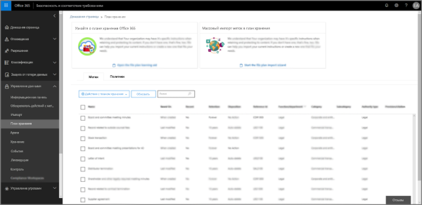

## Важно: эта функция в настоящее время доступна только в рамках программы Office 365 PreviewImportant: This feature is currently available only as part of the Office 365 Preview program

Эта функция будет доступна в вашем клиенте только в том случае, если ваша организация зарегистрирована в программе Office 365 Preview.You will see this feature in your tenant only if your organization has enrolled in the Office 365 Preview program.

## Доступ к диспетчеру плана файловAccessing file plan manager

Существуют два требования для доступа к диспетчеру плана файлов. Эти требования приводятся ниже.There are two requirements to access file plan manager, they are:
- Подписка на Office 365 корпоративный E5.An Office 365 Enterprise E5 subscription with user licenses.
- Пользователю назначена одна из следующих ролей &amp;Центра безопасности и соответствия требованиям:The user has been in assigned one of the following roles of the Security &amp; Compliance Center: 
    - диспетчер хранения;Retention Manager
    - диспетчер хранения только для просмотра.View-only Retention Manager

## Навигация в плане файловNavigating your file plan

Диспетчер плана файлов упрощает просмотр и изучение параметров всех ваших политик и меток хранения в одном представлении.File plan manager makes it easier see into and across the settings of all your retention labels and policies from one view.

Обратите внимание на то, что метки хранения, созданные вне плана файлов, будут доступны в плане файлов и наоборот.Note that retention labels created outside of the file plan will be available in the file plan and vice versa.

На вкладке **Метки плана файлов** доступна приведенная ниже дополнительная информация и возможности.On the **file plan labels** tab, the following additional information and capabilities are available:

### Столбцы параметров метокLabel settings columns
 
- **На основе** определяет тип триггера, который устанавливает начало периода хранения. Допустимые значения:**Based on** identifies the type of trigger that will start the retention period. Valid values are: 
    - СобытиеEvent
    - Дата созданияWhen created
    - Дата последнего измененияWhen last modified
    - Дата меткиWhen labeled
- **Запись** определяет, станет ли элемент объявленной записью после присвоения метки. Допустимые значения:**Record** identifies if the item will become a declared record when the label is applied. Valid values are:
    - НетNo
    - ДаYes
    - Да (норматив)Yes(Regulatory)
- **Хранение** определяет тип хранения. Допустимые значения:**Retention** identifies the retention type. Valid values are:
    - ОставитьKeep
    - Оставить и удалитьKeep and delete
    - УдалитьDelete
- **Ликвидация** определяет, что произойдет с содержимым в конце периода хранения. Допустимые значения:**Disposition** identifies what will happen to the content at the end of the retention period. Valid values are: 
    - пустоNull
    - Нет действийNo action necessary.
    - Автоматическое удалениеAuto-delete
    - Требуется проверка (т. е. проверка перед ликвидацией)Review required (aka Disposition review)

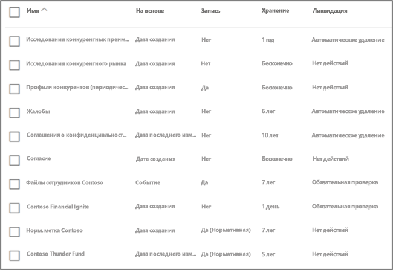

### Столбцы дескрипторов плана файлов меткиLabel file plan descriptors columns

Теперь вы можете включать больше информации в конфигурацию ваших меток хранения. Вставка дескрипторов плана файлов в метки повышает управляемость и организацию плана файлов.You can now include more information in the configuration of your retention labels. Inserting file plan descriptors into labels will improve the manageability and organization of your file plan.

Для быстрого начала работы диспетчер плана файлов содержит некоторые встроенные значения для: функции/отдела, категории, типа сертификации и подготовки/ссылки. Вы можете добавлять новые значения дескриптора плана файлов при создании или изменении метки хранения.To get you started, file plan manager provides some out-of-box values for: Function/department, Category, Authority type and Provision/citation. You can add new file plan descriptor values when creating or editing a retention label.

Вот представление этапа дескрипторов плана файлов при создании или изменении метки хранения.Here's a view of the file plan descriptors step when creating or editing a retention label.

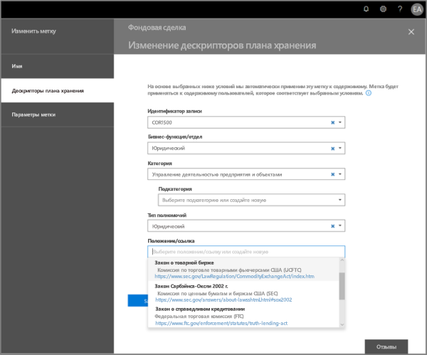

Вот представление столбцов дескрипторов плана файлов на вкладке меток диспетчера плана файлов.Here's a view of the file plan descriptors columns on the labels tab of file plan manager.

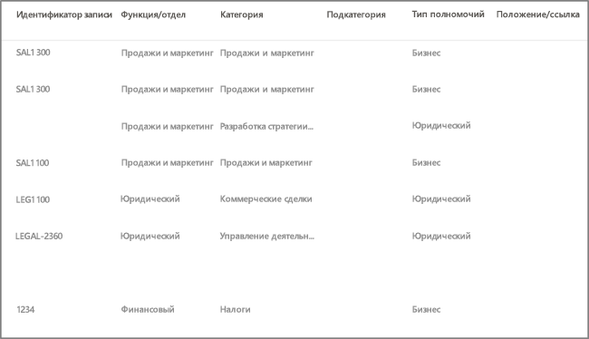

## Экспорт меток из плана файловExport labels out of your file plan

Из диспетчера плана файлов можно экспортировать сведения о всех метках хранения в файл .csv, что упростит проведение периодических проверок соответствия требованиям с заинтересованными лицами в сфере управления данными в вашей организации.From file plan manager, you can export the details of all retention labels into a .csv file to assist you in facilitating periodic compliance reviews with data governance stakeholders in your organization.

Чтобы экспортировать все метки хранения, выполните переход: **диспетчер плана файлов** \> **действия плана файлов** \> **экспорт меток**.To export all retention labels, go to **file plan manager** \> **file plan actions** \> **export labels**.

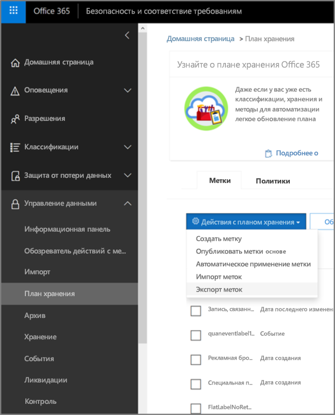

Откроется файл с расширением \*.csv, содержащий все существующие метки хранения.A \*.csv file containing all existing retention labels will open.

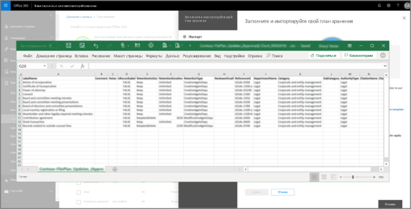

## Импорт меток в план файловImport labels into your file plan

Из диспетчера плана файлов можно выполнить массовый импорт новых меток, а также изменять существующие метки хранения.From file plan manager, you can bulk import new labels as well as modify existing retention labels.

Чтобы импортировать новые метки хранения и внести изменения в существующие метки хранения, выполните переход: **диспетчер плана файлов** \> **действия плана файлов** \> **импорт меток**.To import new retention labels and make updates existing retention labels, go to **file plan manager** \> **file plan actions** \> **import labels**.

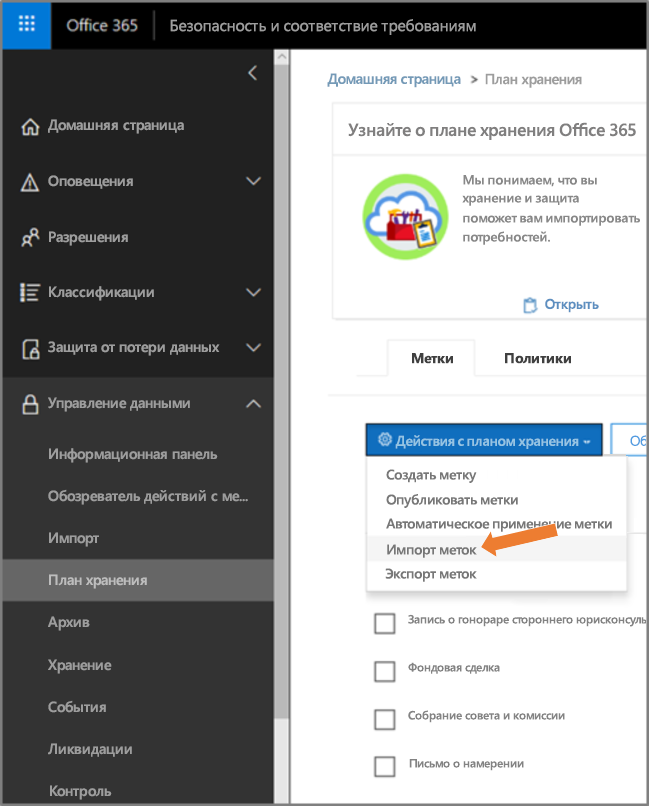

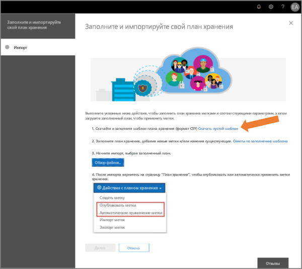

Скачайте пустой шаблон (или начните с экспорта вашего текущего плана файлов).Download a blank template (or start from an export of your current file plan).

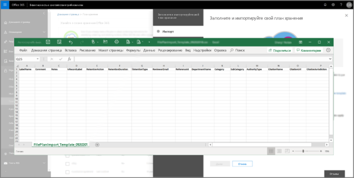

Заполните шаблон (в ближайшее время ожидается справочная информация о допустимых значениях для записей).Fill-out the template (coming soon is reference information about valid values for entries).

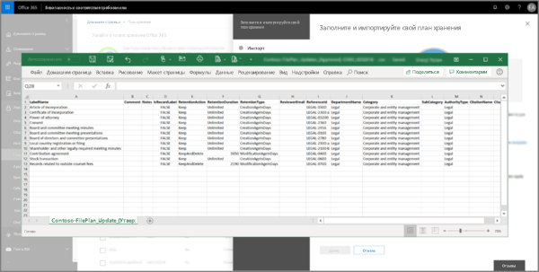

Отправьте заполненный шаблон — диспетчер плана файлов проверит записи и отобразит статистику импорта.Upload the filled-out template, and file plan manager will validate the entries and display import statistics.

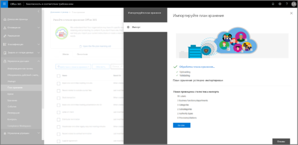

Когда импорт завершится, вернитесь к диспетчеру плана файлов, чтобы назначить новые метки новым или существующим политикам.When the import is complete, return to file plan manager to assign new labels to new or existing policies.

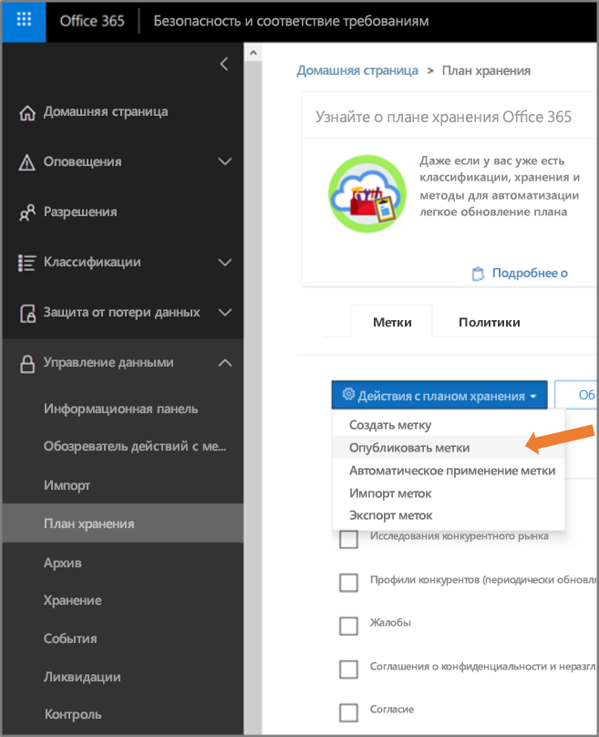

