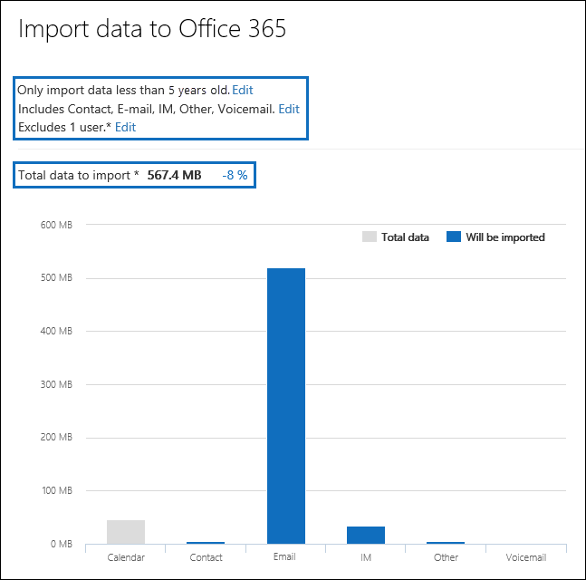

# Фильтрация данных при импорте PST-файлов в Office 365Filter data when importing PST files to Office 365

Используйте новый компонент интеллектуального импорта в службе импорта Office 365, чтобы отфильтровать элементы в PST-файлах, которые фактически импортируются в целевые почтовые ящики. Вот как это работает:Use the new Intelligent Import feature in the Office 365 Import service to filter the items in PST files that actually get imported to the target mailboxes. Here's how it works:
  
- После создания и отправки задания импорта PST-файлов в область хранилища Azure в облаке Майкрософт.After you create and submit a PST import job, PST files are uploaded to an Azure storage area in the Microsoft cloud.
    
- Office 365 анализирует данные в PST-файлах безопасным и безопасным способом, определяя возраст элементов почтового ящика и различные типы сообщений, включенные в PST-файлы.Office 365 analyzes the data in the PST files, in a safe and secure manner, by identifying the age of the mailbox items and the different message types included in the PST files.
    
- После завершения анализа и данных, готовых к импорту, можно импортировать все данные в PST-файлах как есть или обрезать импортируемые данные, задав фильтры, которые контролируют, какие данные следует импортировать. Например, можно выбрать один из следующих вариантов:When the analysis is complete and the data is ready to import, you have the option to import all data in the PST files as is or trim the data that's imported by setting filters that control what data gets imported. For example, you can choose to:
    
  - Импортировать только элементы определенного возраста.Import only items of a certain age.
    
  - Импорт выбранных типов сообщений.Import selected message types.
    
  - Исключение сообщений, отправленных или полученных определенными пользователями.Exclude messages sent or received by specific people.
    
- После настройки параметров фильтра Office 365 импортирует только те данные, которые соответствуют критериям фильтрации, с целевыми почтовыми ящиками, указанными в задании импорта.After you configure the filter settings, Office 365 imports only the data that meets the filtering criteria to the target mailboxes specified in the import job.
    
На приведенном ниже рисунке показан процесс интеллектуального импорта, в котором выделены выполняемые задачи и задачи, выполняемые в Office 365.The following graphic shows the Intelligent Import process, and highlights the tasks you perform and the tasks performed by Office 365.
  

  
## Перед началом работыBefore you begin

- Действия, описанные в этом разделе, предполагают, что вы создали задание импорта PST в службе импорта Office 365, используя отправку по сети или доставку дисков. Пошаговые инструкции представлены в одном из следующих разделов:The steps in this topic assume that you've created a PST import job in the Office 365 Import service by using network upload or drive shipping. For step-by-step instructions, see one of the following topics:
    
  - [Импорт PST-файлов в Office 365 с помощью отправки по сетиUse network upload to import PST files to Office 365](use-network-upload-to-import-pst-files.md)
    
  - [Импорт PST-файлов в Office 365 с помощью отправки дисковUse drive shipping to import PST files to Office 365](use-drive-shipping-to-import-pst-files-to-office-365.md)
    
- После создания задания импорта с помощью команды "Отправка по сети" состояние задания импорта на странице "Импорт" в центре соответствия требованиям безопасности &amp; Office 365 — " **выполняется анализ**", что означает, что Office 365 анализирует данные в PST-файлах, которые вы отправляет. Нажмите \*\*\*\* обновление, чтобы обновить состояние задания импорта.After you create an import job by using network upload, the status for the import job on the Import page in Office 365 Security &amp; Compliance Center is set to **Analysis in progress**, which means that Office 365 is analyzing the data in the PST files that you uploaded. Click **Refresh** to update the status for the import job. 
    
- Для заданий импорта доставки дисков данные анализируются в Office 365 после того, как сотрудники центра обработки данных Майкрософт получат жесткий диск и отправит PST-файлы в область хранилища Azure для вашей организации.For drive shipping import jobs, the data will be analyzed by Office 365 after Microsoft data center personnel receive your hard drive and upload the PST files to the Azure storage area for your organization.
  
## Фильтрация данных, которые импортируются в почтовые ящикиFilter data that gets imported to mailboxes

После создания задания импорта PST-файла выполните следующие действия, чтобы отфильтровать данные перед их импортом в Office 365.After you've created a PST import job, follow these steps to filter the data before you import it to Office 365.
  
1. Перейдите к [https://protection.office.com/](https://protection.office.com/) учетной записи администратора в организации Office 365 и войдите в нее, используя учетные данные администратора.Go to [https://protection.office.com/](https://protection.office.com/) and sign in using the credentials for an administrator account in your Office 365 organization. 
    
2. в левой области &amp; центра безопасности Office 365 щелкните **импорт** **данных** \> .In the left pane of the Office 365 Security &amp; Compliance Center, click **Data governance** \> **Import**.
    
    Задания импорта для Организации перечислены на странице " **Импорт** ". Обратите внимание, что в столбце **состояние** завершено значение **анализ** указывает, что задания импорта были проанализированы в Office 365 и готовы к импорту.The import jobs for your organization are listed on the **Import** page. Note that the **Analysis completed** value in the **Status** column indicates the import jobs that have been analyzed by Office 365 and are ready for you to import. 
    
    
  
3. Нажмите кнопку **Готово, чтобы импортировать в Office 365** для задания импорта, которое требуется выполнить.Click **Ready to import to Office 365** for the import job that you want to complete. 
    
    Отобразится страница вылет со сведениями о PST-файлах и других сведениях о задании импорта.A fly out page is displayed with information about the PST files and other information about the import job.
    
4. Нажмите кнопку **Импорт в Office 365**.Click **Import to Office 365**.
    
    Отобразится страница " **Фильтрация данных** ". Он содержит сведения о данных в PST-файлах для задания импорта, в том числе сведения о сроке хранения данных.The **Filter your data** page is displayed. It contains data insights about the data in the PST files for the import job, including information about the age of the data. 
    
    
  
5. В зависимости от того, хотите ли вы обрезать данные, импортированные в Office 365, в разделе **для фильтрации данных**выполните одно из следующих действий:Based on whether or not you want to trim the data that's imported to Office 365, under **Do you want to filter your data?**, do one of the following:
    
    о. Щелкните **Да, я хочу отфильтровать его перед импортом** , чтобы обрезать импортируемые данные, а затем нажмите кнопку **Далее**.a. Click **Yes, I want to filter it before importing** to trim the data that you import, and then click **Next**.
    
    На странице **Импорт данных в office 365** отображается подробная информация об анализе данных, выполненном при анализе, выполненНом в Office 365.The **Import data to Office 365 page** page is displayed with detailed data insights from the analysis that Office 365 performed. 
    
    
  
    На диаграмме на этой странице отображается объем данных, которые будут импортированы. Сведения о каждом типе сообщений, обнаруженном в PST-файлах, отображаются на диаграмме. Вы можете навести курсор на каждую панель, чтобы отобразить конкретные сведения об этом типе сообщения. Кроме того, существует раскрывающийся список с разными значениями возраста на основе анализа PST-файлов. При выборе возраста в раскрывающемся списке диаграмма обновляется, чтобы показать, сколько данных будет импортировано для выбранного возраста.The graph on this page shows the amount of data that will be imported. Information about each message type found in the PST files is displayed in the graph. You can hover the cursor over each bar to display specific information about that message type. There is also a drop-down list with different age values based on the analysis of the PST files. When you select an age in the drop-down list, the graph is updated to show how much data will be imported for the selected age. 
    
    б. Чтобы настроить дополнительные фильтры для уменьшения объема импортируемых данных, щелкните **Дополнительные параметры фильтрации**.b. To configure addition filters to reduce the amount of data that's imported, click **More filtering options**.
    
    
  
    Вы можете настроить эти фильтры:You can configure these filters:
    
      - **Age** — Выберите возраст, чтобы импортироваться только элементы новее указанного возраста. В разделе [More Information (Дополнительные сведения](filter-data-when-importing-pst-files.md#moreinfo) ) представлено описание того, как Office 365 определяет периоды хранения для фильтра **возраста** .**Age** - Select an age so only items that are newer than the specified age will be imported. See the [More information](filter-data-when-importing-pst-files.md#moreinfo) section for a description about how Office 365 determines the age buckets for the **Age** filter. 
    
      - **Type** — в этом разделе показаны все типы сообщений, обнаруженные в PST-файлах для задания импорта. Вы можете снять флажок рядом с типом сообщения, которое нужно исключить. Обратите внимание, что вы не можете исключить другой тип сообщения. Список элементов почтовых ящиков, включенных в другую категорию, представлен в разделе [Дополнительные сведения](filter-data-when-importing-pst-files.md#moreinfo) .**Type** - This section shows all the message types that were found in the PST files for the import job. You can uncheck a box next to a message type that you want to exclude. Note that you can't exclude the Other message type. See the [More information](filter-data-when-importing-pst-files.md#moreinfo) section for a list of mailbox items that are included in the Other category. 
    
      - **Пользователи** — вы можете исключить сообщения, отправленные или полученные определенными пользователями. Чтобы исключить пользователей, которые отображаются в поле "от:", "Кому:" или "копия: сообщения", нажмите кнопку **исключить пользователей** рядом с этим типом получателя. Введите адрес электронной почты (SMTP-адрес) пользователя, щелкните **Добавить** , чтобы добавить его в список исключенных пользователей для этого типа получателя, а затем нажмите кнопку **сохранить** , чтобы сохранить список исключенных пользователей.**Users** - You can exclude messages that are sent or received by specific people. To exclude people who appear in the From: field, To: field, or the Cc: field of messages, click **Exclude users** next to that recipient type. Type the email address (SMTP address) of the person, click **Add** to add them to the list of excluded users for that recipient type, and then click **Save** to save the list of excluded users. 
    
        > [!NOTE]
        > В Office 365 не отображается информация о том, что в результате настройки фильтра **людей** не отображается. Тем не менее, если вы настроили этот фильтр, чтобы исключить сообщения, отправленные или полученные определенными пользователями, эти сообщения будут исключены во время фактического процесса импорта.Office 365 doesn't show data insights that result from setting the **People** filter. However, if you set this filter to exclude messages sent or received by specific people, those messages will be excluded during the actual import process. 
  
    c. Нажмите кнопку **Применить** на странице **Дополнительные параметры фильтрации** , чтобы сохранить параметры фильтра.c. Click **Apply** in the **More filtering options** fly out page to save your filter settings. 
    
    Сведения, содержащиеся на странице **Импорт данных в Office 365** , обновляются на основе параметров фильтра, в том числе общий объем данных, которые будут импортированы на основе параметров фильтра. Обратите внимание, что также отображается сводка по параметрам фильтра. При необходимости можно нажать кнопку **изменить** рядом с фильтром, чтобы изменить значение.The data insights on the **Import data to Office 365** page are updated based on your filter settings, including the total amount of data that will be imported based on the filter settings. Note that a summary of the filter settings is also shown. You can click **Edit** next to a filter to change the setting if necessary. 
    
    
  
    г. Нажмите кнопку **Далее**.d. Click **Next**.
    
    Отображается страница состояния, на которой показаны параметры фильтра. Опять же, вы можете изменить любой из параметров фильтра.A status page is displayed showing your filter settings. Again, you can edit any of the filter settings.
    
    д Нажмите кнопку **Импорт данных** , чтобы начать импорт. Обратите внимание, что отображается общий объем данных, которые будут импортированы.e. Click **Import data** to start the import . Note that the total amount of data that will be imported is displayed. 
    
    ИлиOr
    
    a. Нажмите кнопку **нет, импортировать** все данные из PST-файлов в Office 365, а затем нажмите кнопку **Далее**.a. Click **No, I want to import everything** to import all data in the PST files to Office 365, and then click **Next**.
    
    б. на странице **Импорт данных в Office 365** щелкните **Импорт данных** , чтобы начать импорт. Обратите внимание, что отображается общий объем данных, которые будут импортированы.b. On the **Import data to Office 365** page, click **Import data** to start the import. Note that the total amount of data that will be imported is displayed. 
    
6. На странице **Импорт** нажмите кнопку **Обновить** . Состояние задания импорта отображается в столбце **состояние** .On the **Import** page, click **Refresh** . The status for the import job is displayed in the **Status** column. 
    
7. Щелкните Импорт задания, чтобы отобразить более подробные сведения, такие как состояние каждого PST-файла и параметры фильтра, которые вы настроили.Click the import the job to display more detailed information, such as the status for each PST file and the filter settings that you configured.

  
## Дополнительные сведенияMore information

- Как Office 365 определяет приращения для фильтра возраста? Когда Office 365 анализирует PST-файл, он анализирует отметку времени отправки или получения каждого элемента (если для элемента задана отметка времени отправки и получения, выбирается самая старая Дата). После этого Office 365 просматривает значение года для этой временной метки и сравнивает его с текущей датой для определения возраста элемента. Эти простои используются в качестве значений в раскрывающемся списке для фильтра **возраста** . Например, если PST-файл содержит сообщения от 2016, 2015 и 2014, то значения в фильтре **возраста** будут составлять **1 год**, **2 года**и **3 года**.How does Office 365 determine the increments for the age filter? When Office 365 analyzes a PST file, it looks at the sent or received time stamp of each item (if an item has both a sent and received timestamp, the oldest date is selected). Then Office 365 looks at the year value for that timestamp and compares it to the current date to determine the age of the item. These ages are then used as the values in the drop-down list for the **Age** filter. For example, if a PST file has messages from 2016, 2015, and 2014, then values in the **Age** filter would be **1 year**, **2 years**, and **3 years**.
    
- В следующей таблице приведены типы сообщений, которые включены в категорию " **другие** " в поле " **тип** фильтра" на странице " **Дополнительные параметры** " на лету (см. шаг 5b в предыдущей процедуре). В настоящее время вы не можете исключить элементы из категории "другие" при импорте PST в Office 365.The following table lists the message types that are included in the **Other** category in the **Type** filter on the **More options** fly out page (see Step 5b in the previous procedure). Currently, you can't exclude items in the "Other" category when you import PSTs to Office 365. 
    
    |**Идентификатор класса сообщения****Message class ID**|**Элементы почтового ящика, которые используют этот класс сообщений****Mailbox items that use this message class**|
    |:-----|:-----|
    |Класс. ЛентIPM.Activity    |Записи дневникаJournal entries    |
    |Класс. ДокументовIPM.Document    |Документы и файлы (не вложенные в сообщение электронной почты)Documents and files (not attached to an email message)    |
    |Класс. ФайлуIPM.File    |(то же, что и IPM. Документов(same as IPM.Document)    |
    |Класс. Note. ИМК. NotificationIPM.Note.IMC.Notification    |Отчеты, отправляемые службой почты Интернета, которая является шлюзом Exchange Server в ИнтернетReports sent by Internet Mail Connect, which is the Exchange Server gateway to the Internet    |
    |Класс. Note. Microsoft. FaxIPM.Note.Microsoft.Fax    |Факсимильные сообщенияFax messages    |
    |Класс. Note. rules. отсутствие на работе. Template. MicrosoftIPM.Note.Rules.Oof.Template.Microsoft    |Сообщения автоответа об отсутствии на местеOut-of-office auto-reply messages    |
    |Класс. Note. rules. Реплитемплате. MicrosoftIPM.Note.Rules.ReplyTemplate.Microsoft    |Ответы, отправленные правилом папки "Входящие"Replies sent by an inbox rule    |
    |Класс. OLE. КлассеIPM.OLE.Class    |Исключения для повторяющихся рядовExceptions for a recurring series    |
    |Класс. Отозвать. ReportIPM.Recall.Report    |Отчеты об отзыве сообщенийMessage recall reports    |
    |Класс. УдаленногоIPM.Remote    |Удаленные сообщения электронной почтыRemote mail messages    |
    |Класс. ВложенIPM.Report    |Отчеты о состоянии элементовItem status reports    |
