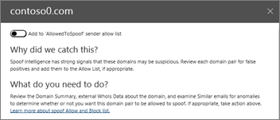

# Пошаговое руководство. Из панели мониторинга к аналитике

Если вы не знакомы с [отчетами и аналитическими сведениями в центре безопасности &amp; и соответствия требованиям Office 365](reports-and-insights-in-security-and-compliance.md), то можете понять, как легко переходить с панели мониторинга на подробные и рекомендуемые действия. 
  
Это одно из нескольких пошаговых руководств для центра &amp; безопасности и соответствия требованиям. Дополнительные пошаговые руководства можно найти в разделе [связанные темы](#related-topics) . 
  
## Пошаговое руководство: из панели мониторинга в представление

Давайте рассмотрим процесс передачи данных из панели мониторинга в отчет для анализа и действия. (Это краткий пример  службы подделки.) 
  
1. Мы начнем с панели мониторинга безопасности в [центре безопасности &amp; и соответствия требованиям](https://protection.office.com). (Перейдите на **панель мониторинга** **управления** \> угрозами.)  
  
2. В строке **Insights** мы рассмотрели информацию о том, что нам нужно проверить некоторые домены, которые могут быть подозрительными. В строке **Insights** (сведения о домене) выберите пункт **пары доменов**.  
  
3. Мы получаем список действий, связанных с логикой подделки. Это экземпляры, в которых сообщения электронной почты отправляются так, как они поступили из нашей Организации, но на самом деле были отправлены из другой организации. Цель состоит в том, чтобы определить, авторизованы ли подложные сообщения.  В этом списке можно отсортировать информацию по количеству сообщений, дате и времени последнего обнаружения поддельных сообщений. (Щелкните заголовки столбцов, например, **количество сообщений** или **Последнее** отображение, чтобы увидеть, как работает сортировка.) 
    
4. При выборе элемента в списке открывается область сведений, в которой можно увидеть дополнительные сведения, в том числе Похожие сообщения электронной почты, которые были обнаружены. (Щелкните элемент в списке и ознакомьтесь со сведениями и рекомендациями.)  
  
5. Обратите внимание, что в верхней части области можно добавить отправителя в список разрешенных отправителей организации. (Не выбирайте **Добавить в список "алловедтоспуф" отправителя** , пока вы не подтвердите это. [Узнайте больше о логике подделки](learn-about-spoof-intelligence.md).) 
  
Таким образом, мы можем перейти с панели мониторинга к ценным и рекомендуемым действиям.
  
## Статьи по теме

[Пошаговое руководство: из подробного отчета](from-an-insight-to-a-detailed-report.md)
  
[Пошаговое руководство: из подробного отчета в представление](from-a-detailed-report-to-an-insight.md)
  

