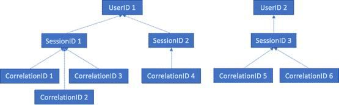

# GDPR для сервера Office Web Apps и Office Online Server

Данные телеметрии Office Online Server и сервера Office Web Apps хранятся в виде журналов ULS. С помощью приложения [ULS Viewer](https://www.microsoft.com/en-us/download/details.aspx?id=44020) вы можете просматривать журналы ULS из локального клиента.

Каждая строка журнала содержит CorrelationID. Связанные строки журнала имеют одинаковое значение CorrelationID. Каждое значение CorrelationID привязано к одному значению SessionID, а одно значение SessionID может быть связано с несколькими значениями CorrelationID. Каждое значение SessionID может быть связано с одним UserID, но некоторые сеансы могут быть анонимными (с ними не связано значение UserID). Чтобы определить, какие данные связаны с определенным пользователем, можно сопоставить одно значение UserID со значениями SessionID, связанными с этим пользователем, эти значения SessionID — с соответствующими значениями CorrelationID, а эти значения CorrelationID — со всеми журналами для этих сопоставлений. На приведенной ниже схеме показаны отношения между разными идентификаторами.

## Сбор журналов

Чтобы собрать все журналы, связанные, к примеру, с UserID 1, для начала необходимо собрать все сеансы, связанные с UserID 1 (т. е. SessionID 1 и SessionID 2). Затем следует собрать все сопоставления, связанные с SessionID 1 (т. е. CorrelationID 1, 2 и 3) и с SessionID 2 (т. е. CorrelationID 4). Напоследок необходимо собрать все журналы, связанные с каждым из сопоставлений в списке.

1.  Запустите средство UlsViewer.

2.  Откройте журнал ULS, соответствующий нужному временному интервалу. Журналы ULS хранятся в папке %PROGRAMDATA%\\Microsoft\\OfficeWebApps\\Data\\Logs\\ULS.

3.  Измените фильтр.

4.  Примените следующий фильтр:

    -   EventID равно apr3y Или

    -   EventID равно bp2d6

5.  Хэшированные значения UserId будут храниться в свойстве Message одного из этих двух событий.

6.  Для apr3y свойство Message будет содержать значения UserID и PUID.

7.  Для bp2d6 свойство Message будет содержать довольно много сведений. Поле Value для LoggableUserId — это хэшированный UserID.

8.  После получения хэшированного значения UserId из одного из этих тегов значение WacSessionId для этой строки в ULSViewer будет содержать WacSessionId, связанный с этим пользователем.

9.  Соберите все значения WacSessionId, связанные с нужным пользователем.

10. Примените фильтр — EventId равно "xmnv", Message равно "UserSessionId=\<WacSessionId\>" — к первому значению WacSessionId в списке (замените часть \<WacSessionId\> своим значением WacSessionId)

11. Соберите все значения свойств Correlation, соответствующие этому WacSessionId.

12. Повторите действия 10–11 со всеми значениями WacSessionId в списке для нужного пользователя.

13. Примените следующий фильтр: Correlation равно первому значению Correlation в списке.

14. Соберите все журналы, соответствующие этому значению Correlation.

15. Повторите действия 13–14 со всеми значениями Correlation в списке для нужного пользователя.

## Типы данных

Журналы Office Online содержат множество различных данных. Журналы ULS могут содержать следующие данные:

-   коды ошибок, возникших во время использования продукта;

-   нажатия кнопок и другие данные об использовании приложений;

-   данные о производительности и/или определенных функциях приложения;

-   общие сведения о местоположении компьютера пользователя (например, страна или регион, штат и город, полученные из IP-адреса), но не точное географическое положение;

-   основные метаданные браузера (например, название и версия) и компьютера (например, тип и версия ОС);

-   сообщения об ошибках из ведущего приложения документа (например, OneDrive, SharePoint, Exchange);

-   сведения о внутренних процессах приложения, не связанных с какими-либо действиями пользователя.
