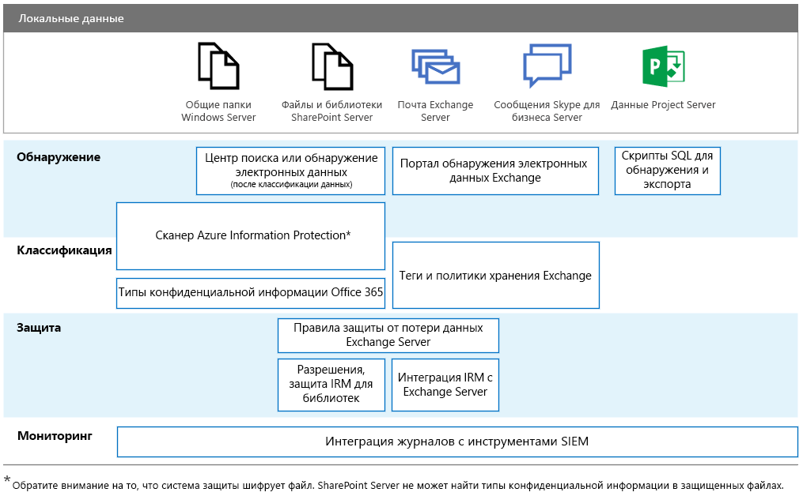

# GDPR для локальных серверов OfficeGDPR for Office on-premises Servers

Общий регламент по защите данных (GDPR) устанавливает требования в отношении защиты персональных данных и надлежащего реагирования на запросы субъектов данных. В этой серии статей представлены рекомендуемые подходы для локальных рабочих нагрузок.The General Data Protection Regulation (GDPR) introduces requirements for organizations to protect personal data and respond appropriately to data subject requests. This series of articles provides recommended approaches for on-premises workloads:

-   [SharePoint ServerSharePoint Server](gdpr-for-sharepoint-server.md)

-   [Exchange ServerExchange Server](gdpr-for-exchange-server.md)

-   [Skype для бизнеса ServerSkype for Business Server](gdpr-for-skype-for-business-server.md)

-   [Project ServerProject Server](gdpr-for-project-server.md)

-   [Сервер Office Web Apps и Office Online ServerOffice Web Apps Server and Office Online Server](gdpr-for-office-online-server.md)

-   [Локальные общие папкиOn-premises file shares](gdpr-for-on-premises-file-shares.md)

Дополнительные сведения о GDPR и поддержке, которую может оказать вам корпорация Майкрософт см. в [центре управления безопасностью (Майкрософт)](https://www.microsoft.com/ru-RU/TrustCenter/Privacy/gdpr/default.aspx).For more information about the GDPR and how Microsoft can help you, see the [Microsoft Trust Center](https://www.microsoft.com/ru-RU/TrustCenter/Privacy/gdpr/default.aspx).

Прежде чем выполнять какие-либо действия с локальными данными, проконсультируйтесь с вашими юристами и группой по обеспечению соответствия требованиям, чтобы получить рекомендации и сведения о существующих схемах классификации и подходах к работе с персональными данными. Рекомендации по разработке и расширению схем классификации корпорации Майкрософт представлены в наборе средств для обнаружения данных GDPR по адресу [http://aka.ms/gdprpartners](<http://aka.ms/gdprpartners>). В этом наборе средств также описываются способы перемещения локальных данных в облако, где можно использовать более сложные функции для управления данными. В статьях из этого раздела представлены рекомендации по работе с данными, которые должны оставаться в локальной среде.Before doing any work with on-premises data, consult with your legal and compliance teams to seek guidance and to learn about existing classification schemas and approaches to working with personal data. Microsoft provides recommendations for developing and extending classifications schemas in the Microsoft GDPR Data Discovery Toolkit at [http://aka.ms/gdprpartners](<http://aka.ms/gdprpartners>). This toolkit also describes approaches for moving on-premises data to the cloud where you can use more sophisticated data governance capabilities, if this is desired. The articles in this section provide recommendations for data that is intended to remain on premises.

Ниже перечислены рекомендуемые функции для обнаружения, классификации, защиты и мониторинга персональные данных для каждой из этих рабочих нагрузок. Дополнительные сведения см. в статьях этого раздела.The following illustration lists recommended capabilities to use across each of these workloads to discover, classify, protect, and monitor personal data. See the articles in this section for more information.

## Описание иллюстрацииIllustration description

Для работы специальных возможностей примеры на рисунке также приведены в таблице ниже.For accessibility, the following table provides the same examples in the illustration.

|             |Общие папки Windows ServerWindows Server file shares|SharePoint ServerSharePoint Server|Exchange ServerExchange Server|Skype для бизнесаSkype for Business|Project ServerProject Server|
|:------------|:-------------------------|:----------------|:--------------|:-----------------|:-------------|
|ОбнаружениеDiscover|Сканер Azure Information Protection\*Azure Information Protection scanner\*|Центр поиска или обнаружение электронных данных (после классификации данных); сканер Azure Information Protection\*Search Center or eDiscovery (after data is classified); Azure Information Protection scanner\*|Портал обнаружения электронных данных ExchangeExchange eDiscovery Portal|Портал обнаружения электронных данных ExchangeExchange eDiscovery portal|Скрипты SQL для обнаружения и экспортаSQL scripts for discovery and exporting|
|КлассификацияClassify|Сканер Azure Information Protection\*; типы конфиденциальной информации Office 365Azure Information Protection scanner\*; Office 365 sensitive information types|Сканер Azure Information Protection\*; типы конфиденциальной информации Office 365Azure Information Protection scanner\*; Office 365 sensitive information types|Теги и политики хранения ExchangeExchange retention tags and retention policies|Теги и политики хранения ExchangeExchange retention tags and retention policies||
|ЗащитаProtect||Правила защиты от потери данных Exchange Server; разрешения, защита IRM для библиотекExchange Server data loss prevention rules; Permissions, IRM-protection for libraries|Правила защиты от потери данных Exchange Server; интеграция IRM с Exchange ServerExchange Server data loss prevention rules; IRM integration with Exchange Server|||
|МониторингMonitor|Интеграция журналов с инструментами SIEMIntegrate logs with SIEM tools|Интеграция журналов с инструментами SIEMIntegrate logs with SIEM tools|Интеграция журналов с инструментами SIEMIntegrate logs with SIEM tools|Интеграция журналов с инструментами SIEMIntegrate logs with SIEM tools|Интеграция журналов с инструментами SIEMIntegrate logs with SIEM tools|

\* Обратите внимание, что система защиты шифрует файл. Соответственно, сервер SharePoint не может найти конфиденциальную информацию в защищенных файлах.\*Note that protection encrypts the file. Consequently, SharePoint Server can’t find the sensitive information types in protected files.
