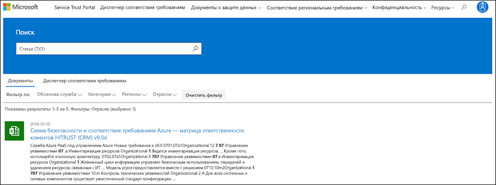
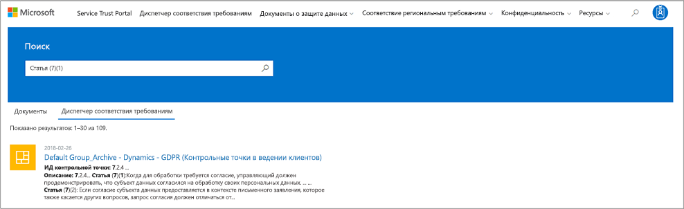
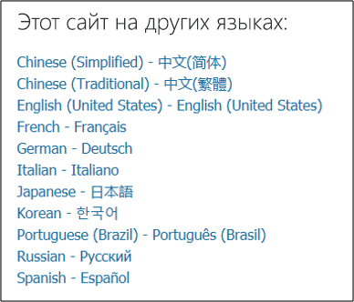

# Начало работы с порталом Microsoft доверия службыGet started with the Microsoft Service Trust Portal

Microsoft службы управления безопасностью портала (STP), предоставляет выбор содержимого, средств и другие ресурсы, посвященные безопасности, конфиденциальности и соответствия рекомендациям Майкрософт. Включает отчеты аудита независимой сторонних производителей online services корпорации Майкрософт и сведения о как наших интерактивных служб может помочь вашей организации обслуживания и отслеживать соответствие требованиям стандартов, законам и положения, таких как:The Microsoft Service Trust Portal (STP) provides a variety of content, tools, and other resources about Microsoft security, privacy and compliance practices. It also includes independent third-party audit reports of Microsoft's online services, and information about how our online services can help your organization maintain and track compliance with standards, laws, and regulations, such as:
  
- Международной организации по стандартизации (ISO)International Organization for Standardization (ISO)
    
- Элементы управления организации службы (SOC)Service Organization Controls (SOC)
    
- Национальный института стандартов и технологий (NIST)National Institute of Standards and Technology (NIST)
    
- Федеральное риск и программе управления авторизации (FedRAMP)Federal Risk and Authorization Management Program (FedRAMP)
    
- Нормы защиты данных General (GDPR)General Data Protection Regulation (GDPR)
  
## Доступ к портале управления безопасностьюAccessing the Service Trust Portal

STP содержит подробные сведения о реализации корпорации Майкрософт элементов управления и процессы, которые указанные защитить наших облачных служб и данных клиента. Для доступа к некоторых STP материалы, необходимо выполните вход в качестве пользователя с разрешением с помощью учетной записи Microsoft облачных служб (учетную запись организации Azure Active Directory или учетной записи Майкрософт) и просмотрите и примите соглашение о неразглашении Microsoft для Соответствие требованиям материалы.The STP contains details about Microsoft's implementation of controls and processes that protect our cloud services and the customer data therein. To access some STP materials, you must log in as an authenticated user with your Microsoft cloud services account (either an Azure Active Directory organization account or a Microsoft Account) and review and accept the Microsoft Non-Disclosure Agreement for Compliance Materials.
  
 **Существующие клиенты могут получить доступ к STP** в [https://aka.ms/STP](https://aka.ms/STP) с одним из следующих online подписок (пробной версии или платная):**Existing customers can access the STP** at [https://aka.ms/STP](https://aka.ms/STP) with one of the following online subscriptions (trial or paid): 
  
- **Office 365****Office 365**
    
- **Dynamics 365****Dynamics 365**
    
- **Azure****Azure**
    
> [!NOTE]
> Azure Active Directory учетных записей, связанных с организациями имеют доступ для всех документов и функции как Compliance Manager. Учетные записи Майкрософт, созданные для личного использования ограничен доступ к содержимому на портале управления безопасностью.Azure Active Directory accounts associated with organizations have access to the full range of documents and features like Compliance Manager. Microsoft accounts created for personal use have limited access to Service Trust Portal content. 
  
 **Новых клиентов и клиентов, оценка Microsoft online services****New customers and customers evaluating Microsoft online services**
  
Чтобы создать новую учетную запись или создайте пробной учетной записи, используйте одну из следующих форм регистрации (также используется для пробного учетных записей) для получения доступа к STP.To create a new account or to create a trial account, use one of the following sign-up forms (also used for trial accounts) to get access to the STP.
  
- Регистрация для новых [пробной учетной записи Office 365 для бизнеса](https://go.microsoft.com/fwlink/p/?LinkID=507653) или новый [пробной учетной записи Office 365 для предприятия](https://go.microsoft.com/fwlink/p/?LinkID=698279)Sign up for a new [Office 365 Business trial account](https://go.microsoft.com/fwlink/p/?LinkID=507653) or a new [Office 365 Enterprise trial account](https://go.microsoft.com/fwlink/p/?LinkID=698279)
    
- Зарегистрируйтесь для нового [Dynamics 365 пробной учетной записи](https://go.microsoft.com/fwlink/?LinkId=252780)Sign up for a new [Dynamics 365 trial account](https://go.microsoft.com/fwlink/?LinkId=252780)
    
- Зарегистрируйтесь для нового [Azure пробной учетной записи](https://go.microsoft.com/fwlink/?LinkId=722737).Sign up for a new [Azure trial account](https://go.microsoft.com/fwlink/?LinkId=722737). 
    
При подписке на бесплатную пробную версию или подписки необходимо включить Azure Active Directory для поддержки доступа к STP.When you sign up for either a free trial, or a subscription, you must enable Azure Active Directory to support your access to the STP.
  
## Навигация портала управления безопасностью службNavigating the Service Trust Portal

STP компоненты и содержимое, доступные из главного меню, показано ниже:STP features and content are accessible from the main menu, shown below:
  

  
### Service Trust PortalService Trust Portal

На **Портале управления безопасностью** связывание принимает в разделе вы STP домашнюю страницу, которая включает в себя новые возможности для STP и диспетчер соответствия, которая содержит сведения о последних обновлений.The **Service Trust Portal** link takes you to the STP home page, which includes a What's New section for the STP and Compliance Manager that provides details on the latest updates. 
  
### Диспетчер соответствия требованиямCompliance Manager

Используйте [Используйте диспетчер соответствия для соответствия защита данных и нормативным требованиям, используя облачные службы Майкрософт](https://support.office.com/article/429e686f-d8a6-455e-a2b6-3791d763f000) для обеспечения соответствия нормативным требованиям и защиты данных при использовании облачные службы Майкрософт.Use [Use Compliance Manager to help meet data protection and regulatory requirements when using Microsoft cloud services](https://support.office.com/article/429e686f-d8a6-455e-a2b6-3791d763f000) to help meet data protection and regulatory requirements when using Microsoft Cloud Services. 
  
### Документы о защите данныхTrust Documents

Обеспечение безопасной портале доверие обеспечивает доступ к богатым реализации безопасности и информации о структуре с целью облегчения соответствовать нормативным требованиям, общие сведения о как облачные службы Майкрософт хранение данных. Чтобы просмотреть содержимое, выберите параметр в меню.The Service Trust Portal gives you access to wealth of security implementation and design information with the goal of making it easier for you to meet regulatory compliance objectives by understanding how Microsoft cloud services keep your data secure. To review content, select an option from the menu.
  
 - **Отчеты аудита** содержит независимые аудита, а также оценки отчетов по Microsoft облачных служб соответствия стандартам защиты данных и нормативным требованиям, в том числе:**Audit Reports** provides independent audit and assessment reports on Microsoft cloud services compliance with data protection standards and regulatory requirements, including: 
  
 - **Защита данных** содержит доверять документы для загрузки, сведения о том, как работает Microsoft Azure, Dynamics 365 и Office 365.**Data Protection** provides Trust Documents for download, information about how Microsoft operates Azure, Dynamics 365, and Office 365. 
  
 - **Azure безопасность и соответствие требованиям чертежей** предлагает параметр Включить ключ безопасности и соответствия требованиям решения и поддержки, предприятий вертикали отрасли, которые ускорить загрузку для клиентов с данными регулируемого или ограниченных и внедрения облака.**Azure Security and Compliance Blueprints** offers turn-key security and compliance solutions and support, tailored to the needs of industry verticals, that accelerate cloud adoption and utilization for customers with regulated or restricted data. 
  
### Соответствие региональным требованиямRegional Compliance

В этом разделе представлены сведения на региональном уровнях конкретных соответствия требованиям, правило, в виде юридических опытом отображения облачные службы Майкрософт.This section provides regionally specific compliance information, often in the form of Legal Opinions that render Microsoft Cloud Services.
  
 - **Чешская Республика** предоставляет юридических опытом на соответствие законодательство Чешская Республика веб-службами Microsoft.**Czech Republic** provides legal opinions on Microsoft online service compliance with Czech Republic law. 
  
 - **Польша** предоставляет юридических опытом на соответствие требованиям веб-службами Майкрософт с законами Польши.**Poland** provides legal opinions on Microsoft online service compliance with the laws of Poland. 
  
 - **Румыния** предоставляет юридических опытом на соответствие требованиям веб-службами Майкрософт с законами Румыния.**Romania** provides legal opinions on Microsoft online service compliance with the laws of Romania. 
  
 - **Испания** предоставляет юридических опытом на соответствие требованиям веб-службами Майкрософт с законами Испания.**Spain** provides legal opinions on Microsoft online service compliance with the laws of Spain. 
  
### КонфиденциальностьPrivacy

Этот сайт содержит сведения о возможностях в Microsoft services, которые можно использовать для конкретных требований GDPR, документация, полезные для отчетности вашей GDPR и понять технические и организационные меры Корпорация Майкрософт предприняла для поддержки GDPR.This site provides information about the capabilities in Microsoft services that you can use to address specific requirements of the GDPR, documentation helpful to your GDPR accountability and to your understanding of the technical and organizational measures Microsoft has taken to support the GDPR.
  
 - **GDPR: начало работы** -домашнюю страницу для контент, связанный с GDPR портала доверия службы, а также ссылки на соответствующие материалы и средства, доступные.**GDPR: Get Started** -  The homepage for Service Trust Portal GDPR-related content, with links to relevant content and tools available. 
  
 - **Запросы данных темы** — как Microsoft позволяет отвечать на запросы данных темы, а также ссылки на документацию и средства.**Data Subject Requests** - How Microsoft enables you to respond to Data Subject Requests, with links to relevant documentation and tools. 
  
 - **Нарушение данных** — сведения о как Microsoft обнаруживает и отвечает на нарушением персональных данных и уведомляет контроллеров в разделе GDPR, а также ссылки на документацию и средства.**Data Breach** - Information on how Microsoft detects and responds to a breach of personal data and notifies the controllers under GDPR, with links to relevant documentation and tools. 
  
 - **DPIA** — сведения о том, как Microsoft помогает организациям провести собственные обязательства оценки влияния защиты данных.**DPIA** - Information about how Microsoft helps organizations meet their own Data Protection Impact Assessment obligations. 
  
### РесурсыResources

 - **Часто задаваемые вопросы** представлены ответы на распространенные и важные вопросы о STP и Compliance Manager.**Frequently Asked Questions** provides answers to common and important questions about the STP and Compliance Manager. 
  
 - **Центр соответствия требованиям и безопасности Office 365** предоставляет полный набор ресурсов для изучения безопасность и соответствие требованиям в Office 365, включая документацию, статьи и рекомендациям.**Office 365 Security and Compliance Center** offers comprehensive resources for learning about security and compliance in Office 365, including documentation, articles, and recommended best practices. 
  
### АдминистраторAdmin

Административные функции, которые доступны только для учетной записи администратора клиента, а только будут отображаться при входе в систему в качестве глобального администратора.Administrative functions that are only available to the tenant administrator account, and will only be visible when you are signed in as a global administrator.
  
 **Параметры** позволяет назначить на основе ролей доступ к диспетчеру соответствия требованиям. Дополнительные сведения см в разделе «Разрешения и управление доступом на основе ролей» в [Используйте диспетчер соответствия для соответствия защита данных и нормативным требованиям, используя облачные службы Майкрософт](meet-data-protection-and-regulatory-reqs-using-microsoft-cloud.md#permissions-and-role-based-access-control).**Settings** enables you to assign role-based access to Compliance Manager. For more information, see the "Permissions and role-based access control" section in [Use Compliance Manager to help meet data protection and regulatory requirements when using Microsoft cloud services](meet-data-protection-and-regulatory-reqs-using-microsoft-cloud.md#permissions-and-role-based-access-control).
  
### ПоискSearch

  
Щелкните значок лупы в правом верхнем углу страницы, чтобы развернуть поле поиска, введите поисковые термины и нажмите клавишу ВВОД. Появится элемент управления "Поиск", где в поле ввода на панели поиска будет указан поисковый термин, а под ним будут показаны результаты поиска.Click the magnifying glass in the upper right-hand corner of the page by to expand the Search input field, enter your search terms and press Enter. The Search control will appear, with the search term in the search pane input field, and search results will appear beneath.
  
По умолчанию при поиске возвращаются документы, а вы можете воспользоваться раскрывающимися списками "Фильтровать по", чтобы уточнить отображаемый список документов, добавляя или удаляя результаты поиска в представлении. Вы можете использовать несколько атрибутов фильтра одновременно, чтобы возвращались только документы, относящиеся к определенным облачным службам, категориям соответствия требованиям или мерам безопасности, географическим регионам или отраслям. Перейдите по ссылке с именем документа, чтобы скачать документ.By default, Search returns Document results, and you can use the Filter By dropdown lists to refine the list of documents displayed, to add or remove search results from view. You can use multiple filter attributes at the same time to narrow the returned documents to specific cloud services, categories of compliance or security practices, regions of the world, or industries. Click the document name link to download the document.
  

  
Щелкните ссылку Compliance Manager для отображения результатов поиска для элементов управления оценки Compliance Manager. Результаты поиска перечисленных отображения даты оценки был создан, имя оценки группировки, которые применяются облачная служба и элементы управления, являются ли Microsoft или управляемого клиента.Click the Compliance Manager link to display search results for Compliance Manager assessment controls. The listed search results show the date the assessment was created, the name of the assessment grouping, the applicable cloud service, and whether the controls are Microsoft or Customer Managed.
  

  
> [!NOTE]
> Отчеты и документы Service Trust Portal доступны для скачивания в течение как минимум двенадцати месяцев после публикации или до тех пор, пока не станет доступна новая версия документа.Service Trust Portal reports and documents are available to download for at least twelve months after publishing or until a new version of document becomes available. 
  
## Поддержка локализацииLocalization support

На портале Service Trust Portal можно просматривать содержимое страниц на различных языках. Чтобы изменить язык страницы, просто щелкните значок глобуса в левом нижнем углу страницы и выберите нужный язык.Service Trust Portal enables you to view the page content in different languages. To change the page language, simply click on the globe icon in the lower left corner of the page and select the language of your choice. 
  

  
## ОтзывыFeedback

Мы могут помочь в вопросы о портале доверия или ошибки, которые возникают при использовании портала. Также нами можно связаться с вопросами и отзыв о портале доверия соответствия отчеты и ресурсы доверия с помощью ссылок свои отзывы и предложения в нижней части страницы STP.We can help with questions about the Service Trust Portal, or errors you experience when you use the portal. You can also contact us with questions and feedback about Service Trust Portal compliance reports and trust resources by using the Feedback link on the bottom of the STP pages.
  
Ваши отзывы очень важны для нас. Нажмите кнопку свои отзывы и предложения в нижней части страницы, чтобы отправить комментарии о были сведения или не нравится или возможно предложений по улучшению наших продуктов или возможности продукта.Your feedback is very important to us. Click on the Feedback button at the bottom of the page to send us comments about what you did or did not like, or suggestions you may have for improving our products or product features.
  

