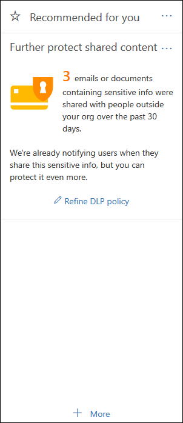

# Начало работы со стандартной политикой защиты от потери данных

Прежде чем создавать первую политику защиты от потери данных (DLP), DLP поможет защитить конфиденциальные данные с помощью политики по умолчанию. Эта политика по умолчанию и ее рекомендации (показанные ниже) помогут защитить конфиденциальный контент, уведомляя вас, когда к электронной почте или документам, содержащим номер кредитной карты, предоставлен доступ другому пользователю за пределом вашей организации. Вы увидите эту рекомендацию на **домашней** странице центра безопасности &amp; и соответствия требованиям. 
  
Это мини-приложение можно использовать для быстрого просмотра того, когда и сколько конфиденциальной информации было предоставлено, а затем для уточнения политики защиты от потери данных по умолчанию — по нажатию или двум. Вы также можете изменить политику защиты от потери данных по умолчанию в любое время, так как она полностью настраиваемая. Обратите внимание, что если вы не видите рекомендацию, нажмите кнопку **+ More (дополнительно** ) в нижней части раздела **рекомендуем для вас** . 
  

  
## Просмотр отчета и уточнение политики защиты от потери данных по умолчанию

Когда мини-приложение показывает, что у пользователей есть доступ к конфиденциальной информации для людей за прев Организации, в нижней части выберите пункт **уточнение политики защиты от потери** данных. 
  
Подробный отчет показывает, когда и сколько контента, содержащего номера кредитных карт, были предоставлены за прошедшие 30 дней. Обратите внимание, что соответствие правила может занять до 48 часов.
  
Для защиты конфиденциальной информации политика защиты от потери данных по умолчанию:
  
- Определяет, когда контент в Exchange, SharePoint и OneDrive содержит по крайней мере один номер кредитной карты, к которому предоставлен доступ пользователям за прев Организации.
    
- Показывает подсказку политики и отправляет пользователям уведомления по электронной почте при попытке поделиться конфиденциальной информацией с пользователями, не входящими в вашу организацию. Более подробную информацию об этих параметрах можно узнать в статье [Отправка уведомлений по электронной почте и отображение советов политики для политик защиты от потери](use-notifications-and-policy-tips.md)данных.
    
- Создает подробные отчеты об активности, чтобы можно было отслеживать такие аспекты, как доступ к контенту пользователям за пределами вашей организации. Для просмотра этих сведений можно использовать [отчеты о](view-the-dlp-reports.md) защите от потери [данных и журнал аудита](search-the-audit-log-in-security-and-compliance.md) (где **** = **DLP DLP**).
    
Чтобы быстро уточнить политику защиты от потери данных по умолчанию, вы можете сделать следующее:
  
- Отправьте вам сообщение по электронной почте, когда пользователи совместно используют эти конфиденциальные сведения с людьми, не входящими в вашу организацию.
    
- Добавьте других пользователей в отчет об инцидентах электронной почты.
    
- Блокировать доступ к контенту, содержащему конфиденциальные данные, но разрешить пользователю переопределять и предоставлять общий доступ к ним, если это необходимо.
    
Дополнительные сведения об отчетах об инцидентах и ограничениях доступа приведены в статье [Обзор политик защиты от потери данных](data-loss-prevention-policies.md).
  
Если вы хотите изменить эти параметры позже, вы можете изменить политику защиты от потери данных по умолчанию в любой момент, просмотрев следующий раздел.
  

  
## Изменение политики защиты от потери данных по умолчанию

Эта политика называется **Default DLP Office 365** и отображается в разделе **Защита от потери данных** на странице **Политика** центра соответствия требованиям безопасности &amp; . 
  
Эта политика является полностью настраиваемой, то же, что и любая политика защиты от потери данных, которую вы самостоятельно создаете с нуля. Вы также можете отключить или удалить политику, чтобы пользователи больше не получали подсказки политики или уведомления по электронной почте.
  

  
## Когда мини-приложение отображается и не отображается

Мини-приложение под названием " **дальнейшая Защита общего содержимого** " отображается в разделе **рекомендуемый для вас** на &amp; **домашней** странице центра безопасности и соответствия требованиям. 
  
Это мини-приложение отображается только в том случае, если:
  
- В центре безопасности &amp; и в центре администрирования Exchange нет политик защиты от потери данных. Этот мини-приложение предназначено для начала работы с DLP, поэтому оно не отображается, если у вас уже есть политики защиты от потери данных.
    
- Контент, содержащий по крайней мере одну кредитную карту, предоставленный другим пользователям за пределами вашей организации за прошедшие 30 дней.
    
Обратите внимание, что соответствие правила может занять до 48 часов, поэтому после обнаружения конфиденциальной информации, которая будет доступна извне, может потребоваться до двух дней для отображения рекомендации.
  
Наконец, после использования мини-приложения для уточнения политики защиты от потери данных по умолчанию мини-приложение исчезает с **домашней** страницы. 
  

