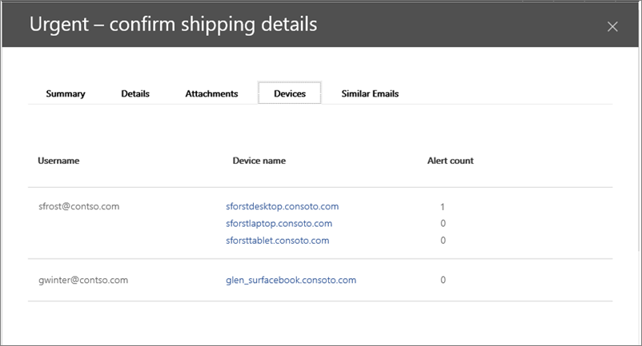

# Интеграция Office 365 Advanced Threat protection с Advanced Threat Protection в Защитнике WindowsIntegrate Office 365 Advanced Threat Protection with Windows Defender Advanced Threat Protection

Если вы участвуете в группе безопасности Организации, вы можете интегрировать Office 365 Advanced Threat Protection и соответствующие функции расследования и ответа с помощью Advanced Threat Protection в Защитнике Windows.If you are part of your organization's security team, you can integrate Office 365 Advanced Threat Protection and related investigation and response features with Windows Defender Advanced Threat Protection. Это поможет быстро выяснить, подвержены ли компьютеры пользователям риску при изучении угроз в Office 365.This can help you quickly understand if users' machines are at risk when you are investigating threats in Office 365. Например, когда интеграция включена, вы сможете увидеть список компьютеров, используемых получателями обнаруженного сообщения электронной почты, а также о том, сколько последних оповещений у этих компьютеров в Advanced Threat Protection в Защитнике Windows.For example, once integration is enabled, you will be able to see a list of machines that are used by the recipients of a detected email message, as well as how many recent alerts those machines have in Windows Defender Advanced Threat Protection.
  
На следующем рисунке показана вкладка " **устройства** ", которая будет отображаться, когда включена интеграция с Advanced Threat Protection в Защитнике Windows:The following image shows the **Devices** tab that you'll see when have Windows Defender Advanced Threat Protection integration enabled: 
  

  
В этом примере видно, что получатели сообщения электронной почты имеют четыре устройства, а одно — оповещение.In this example, you can see that the recipients of the email message have four devices and one has an alert. Если щелкнуть ссылку на устройство, откроется его страница на портале Advanced Threat Protection в Защитнике Windows.Clicking the link for a device opens its page in the Windows Defender Advanced Threat Protection portal.
  
## ТребованияRequirements

- В вашей организации должен быть Office 365 Advanced Threat Protection Plan 2 (или Office 365 в) и пакет ATP для защитника Windows.Your organization must have Office 365 Advanced Threat Protection Plan 2 (or Office 365 E5) and Windows Defender ATP.
    
- Необходимо быть глобальным администратором Office 365 или иметь роль администратора безопасности (например, администратора безопасности), назначенную в [центре &amp; безопасности и соответствия требованиям](https://protection.office.com).You must be an Office 365 Global Administrator or have a security administrator role (such as Security Administrator) assigned in the [Security &amp; Compliance Center](https://protection.office.com). (См. [разрешения в центре безопасности &amp; и соответствия требованиям Office 365](permissions-in-the-security-and-compliance-center.md))(See [Permissions in the Office 365 Security &amp; Compliance Center](permissions-in-the-security-and-compliance-center.md))
    
- Необходимо иметь доступ к проводнику [(или обнаружениям в режиме реального времени)](threat-explorer.md) в центре безопасности _Амп_ соответствие требованиям и портале Advanced Threat Protection в Защитнике Windows.You must have access to both [Explorer (or real-time detections)](threat-explorer.md) in the Security & Compliance Center and the Windows Defender Advanced Threat Protection portal.
    
## Интеграция Office 365 Advanced Threat protection с помощью пакета ATP для защитника WindowsTo integrate Office 365 Advanced Threat Protection with Windows Defender ATP

Интеграция Office 365 Advanced Threat protection с помощью Advanced Threat Protection в Защитнике Windows настраивается с помощью центра безопасности _Амп_ соответствие требованиям и портала Advanced Threat Protection в Защитнике Windows.Integrating Office 365 Advanced Threat Protection with Windows Defender Advanced Threat Protection is set up by using both the Security & Compliance Center AND the Windows Defender Advanced Threat Protection portal.
  
1. Как глобальный администратор Office 365 или администратор безопасности перейдите к [https://protection.office.com](https://protection.office.com) рабочей или учебной учетной записи для Office 365 с помощью рабочей или учебной учетной записи.As an Office 365 global administrator or a security administrator, go to [https://protection.office.com](https://protection.office.com) and sign in with your work or school account for Office 365. 
    
2. Выберите **Обозреватель** **управления** \> угрозами.Choose **Threat management** \> **Explorer**.  
    
3. В правом верхнем углу экрана выберите **Параметры вдатп**.In the upper right corner of the screen, choose **WDATP Settings**.
    
4. В диалоговом окне Подключение ATP для защитника Windows включите параметр подключиться к Windows ATP.In the Windows Defender ATP connection dialog box, turn on Connect to Windows ATP.  
    
5. Включите подключение в Advanced Threat Protection в Защитнике Windows.Enable the connection in Windows Defender Advanced Threat Protection. [Используйте портал Advanced Threat Protection в Защитнике Windows](https://go.microsoft.com/fwlink/?linkid=859690).See [Use the Windows Defender Advanced Threat Protection portal](https://go.microsoft.com/fwlink/?linkid=859690).

  
## Статьи по темеRelated topics

[Исследование угроз для Office 365 и ответ на нихOffice 365 Threat Investigation and Response](office-365-ti.md)
  
[Office 365 Advanced Threat protectionOffice 365 Advanced Threat Protection](office-365-atp.md)
  

