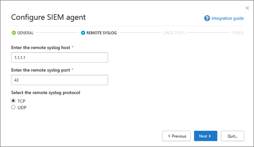
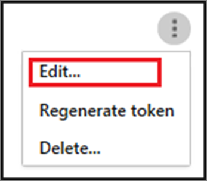

# <a name="integrate-your-siem-server-with-office-365-cloud-app-security"></a><span data-ttu-id="97d4f-104">Интеграция сервера SIEM с Office 365 Cloud App Security</span><span class="sxs-lookup"><span data-stu-id="97d4f-104">Integrate your SIEM server with Office 365 Cloud App Security</span></span>
  
|<span data-ttu-id="97d4f-105">Ознакомительная версия \* *\>*\*</span><span class="sxs-lookup"><span data-stu-id="97d4f-105">\*\*\*\*Evaluation\*\* \>\*\*</span></span>|<span data-ttu-id="97d4f-106">Планирование \* *\>*\*</span><span class="sxs-lookup"><span data-stu-id="97d4f-106">\*\*\*\*Planning\*\* \>\*\*</span></span>|<span data-ttu-id="97d4f-107">Развертывание \* *\>*\*</span><span class="sxs-lookup"><span data-stu-id="97d4f-107">\*\*\*\*Deployment\*\* \>\*\*</span></span>|<span data-ttu-id="97d4f-108">Использование \* \* \* \*</span><span class="sxs-lookup"><span data-stu-id="97d4f-108">\*\*\*\*Utilization\*\*\*\*</span></span>|
|:-----|:-----|:-----|:-----|
|[<span data-ttu-id="97d4f-109">Начало оценки</span><span class="sxs-lookup"><span data-stu-id="97d4f-109">Start evaluating</span></span>](office-365-cas-overview.md) <br/> |[<span data-ttu-id="97d4f-110">Начало планирования</span><span class="sxs-lookup"><span data-stu-id="97d4f-110">Start planning</span></span>](get-ready-for-office-365-cas.md) <br/> |<span data-ttu-id="97d4f-111">Вот что вам!</span><span class="sxs-lookup"><span data-stu-id="97d4f-111">You are here!</span></span>  <br/> [<span data-ttu-id="97d4f-112">Следующее действие</span><span class="sxs-lookup"><span data-stu-id="97d4f-112">Next step</span></span>](utilization-activities-for-ocas.md) <br/> |[<span data-ttu-id="97d4f-113">Начало использования</span><span class="sxs-lookup"><span data-stu-id="97d4f-113">Start utilizing</span></span>](utilization-activities-for-ocas.md) <br/> |
   
## <a name="overview-and-prerequisites"></a><span data-ttu-id="97d4f-114">Общие сведения и необходимые условия</span><span class="sxs-lookup"><span data-stu-id="97d4f-114">Overview and prerequisites</span></span>

<span data-ttu-id="97d4f-115">Для обеспечения централизованного мониторинга оповещений можно интегрировать [Office 365 Cloud App Security](get-ready-for-office-365-cas.md) со сведениями о безопасности и сервером управления событиями (SIEM).</span><span class="sxs-lookup"><span data-stu-id="97d4f-115">You can integrate [Office 365 Cloud App Security](get-ready-for-office-365-cas.md) with your security information and event management (SIEM) server to enable centralized monitoring of alerts.</span></span> <span data-ttu-id="97d4f-116">Это особенно полезно для организаций, использующих облачные службы и локальные серверные приложения.</span><span class="sxs-lookup"><span data-stu-id="97d4f-116">This is especially beneficial for organizations who are using cloud services and on-premises server applications.</span></span> <span data-ttu-id="97d4f-117">Вы можете интегрировать сервер SIEM для получения оповещений и действий из Office 365 Cloud App Security на сервер SIEM.</span><span class="sxs-lookup"><span data-stu-id="97d4f-117">You can integrate your SIEM server to pull alerts and activities from Office 365 Cloud App Security into your SIEM server.</span></span> <span data-ttu-id="97d4f-118">Интеграция с сервером SIEM позволяет группе безопасности улучшить защиту приложений Office 365, сохранив при этом обычный рабочий процесс безопасности, путем автоматизации определенных процедур безопасности и корреляции между облачными и локальными событиями.</span><span class="sxs-lookup"><span data-stu-id="97d4f-118">Integrating with a SIEM server allows your security team to better protect your Office 365 applications while maintaining your usual security workflow, by automating certain security procedures and correlating between cloud-based and on-premises events.</span></span>  
  
<span data-ttu-id="97d4f-119">При первоначальной интеграции сервера SIEM с Office 365 Cloud App Security оповещения за последние два дня пересылаются на сервер SIEM, а также все оповещения в зависимости от выбранных фильтров.</span><span class="sxs-lookup"><span data-stu-id="97d4f-119">When you first integrate your SIEM server with Office 365 Cloud App Security, alerts from the last two days are forwarded to the SIEM server, as well as all alerts from then on (based on any filters you select).</span></span> <span data-ttu-id="97d4f-120">Кроме того, если отключить эту функцию для расширенного периода, то при его повторном включении будут переадресованы два предыдущих дня оповещения, а затем все оповещения.</span><span class="sxs-lookup"><span data-stu-id="97d4f-120">Additionally, if you disable this feature for an extended period, when you enable it again, it will forward the past two days of alerts and then all alerts from then on.</span></span>

### <a name="siem-integration-architecture"></a><span data-ttu-id="97d4f-121">Архитектура интеграции SIEM</span><span class="sxs-lookup"><span data-stu-id="97d4f-121">SIEM integration architecture</span></span>

<span data-ttu-id="97d4f-122">Агент SIEM настраивается в сети Организации.</span><span class="sxs-lookup"><span data-stu-id="97d4f-122">A SIEM agent is set up in your organization's network.</span></span> <span data-ttu-id="97d4f-123">При развертывании и настройке агент SIEM извлекает типы данных, которые были настроены (оповещения) с помощью API Office 365 Cloud App Security REST API.</span><span class="sxs-lookup"><span data-stu-id="97d4f-123">When deployed and configured, the SIEM agent pulls the data types that were configured (alerts) using Office 365 Cloud App Security RESTful APIs.</span></span> <span data-ttu-id="97d4f-124">Затем трафик отправляется по зашифрованному HTTPS-каналу на порте 443.</span><span class="sxs-lookup"><span data-stu-id="97d4f-124">The traffic is then sent over an encrypted HTTPS channel on port 443.</span></span>
  
<span data-ttu-id="97d4f-125">Когда агент SIEM получает данные из Office 365 Cloud App Security, он отправляет сообщения syslog на локальный сервер SIEM с помощью конфигураций сети, которые предоставляются во время установки (TCP или UDP с настраиваемым портом).</span><span class="sxs-lookup"><span data-stu-id="97d4f-125">When a SIEM agent retrieves data from Office 365 Cloud App Security, it sends the Syslog messages to your local SIEM server using the network configurations that are provided during setup (TCP or UDP with a custom port).</span></span>


### <a name="supported-siem-servers"></a><span data-ttu-id="97d4f-127">Поддерживаемые серверы SIEM</span><span class="sxs-lookup"><span data-stu-id="97d4f-127">Supported SIEM servers</span></span>

<span data-ttu-id="97d4f-128">Office 365 Cloud App Security в настоящее время поддерживает следующие серверы SIEM:</span><span class="sxs-lookup"><span data-stu-id="97d4f-128">Office 365 Cloud App Security currently supports the following SIEM servers:</span></span>
- <span data-ttu-id="97d4f-129">Micro Focus Арксигхт</span><span class="sxs-lookup"><span data-stu-id="97d4f-129">Micro Focus ArcSight</span></span>
- <span data-ttu-id="97d4f-130">Универсальный ЦЕФ</span><span class="sxs-lookup"><span data-stu-id="97d4f-130">Generic CEF</span></span>

### <a name="prerequisites"></a><span data-ttu-id="97d4f-131">Необходимые компоненты</span><span class="sxs-lookup"><span data-stu-id="97d4f-131">Prerequisites</span></span>

- <span data-ttu-id="97d4f-132">Для выполнения задач, описанных в этой статье, необходимо быть глобальным администратором или администратором безопасности.</span><span class="sxs-lookup"><span data-stu-id="97d4f-132">You must be a global administrator or security administrator to perform the tasks described in this article.</span></span> <span data-ttu-id="97d4f-133">Ознакомьтесь с разРешениями [в центре &amp; безопасности и соответствия требованиям Office 365](permissions-in-the-security-and-compliance-center.md)</span><span class="sxs-lookup"><span data-stu-id="97d4f-133">See [Permissions in the Office 365 Security &amp; Compliance Center](permissions-in-the-security-and-compliance-center.md)</span></span>

- <span data-ttu-id="97d4f-134">Для Организации необходимо [включить безопасность облачНого приложения Office 365](turn-on-office-365-cas.md) .</span><span class="sxs-lookup"><span data-stu-id="97d4f-134">You must have [Office 365 Cloud App Security enabled](turn-on-office-365-cas.md) for your organization.</span></span>

- <span data-ttu-id="97d4f-135">Для Office 365 должна быть включена функция [ведения журнала аудита](turn-audit-log-search-on-or-off.md)</span><span class="sxs-lookup"><span data-stu-id="97d4f-135">[Audit logging](turn-audit-log-search-on-or-off.md) must be turned on for Office 365</span></span>

- <span data-ttu-id="97d4f-136">Для настройки интеграции сервера SIEM должен быть установлен стандартный сервер, отвечающий следующим требованиям:</span><span class="sxs-lookup"><span data-stu-id="97d4f-136">You must have a standard server that meets the following requirements in order to configure SIEM server integration:</span></span>
    - <span data-ttu-id="97d4f-137">ОС: Windows или Linux (это может быть виртуальная машина)</span><span class="sxs-lookup"><span data-stu-id="97d4f-137">OS: Windows or Linux (this can be a virtual machine)</span></span>
    - <span data-ttu-id="97d4f-138">ЦП: 2</span><span class="sxs-lookup"><span data-stu-id="97d4f-138">CPU: 2</span></span>
    - <span data-ttu-id="97d4f-139">Место на диске: 20 ГБ</span><span class="sxs-lookup"><span data-stu-id="97d4f-139">Disk space: 20 GB</span></span>
    - <span data-ttu-id="97d4f-140">ОЗУ: 2 ГБ</span><span class="sxs-lookup"><span data-stu-id="97d4f-140">RAM: 2 GB</span></span>
    - <span data-ttu-id="97d4f-141">Установлен [Java Java 8](http://www.oracle.com/technetwork/java/javase/downloads/index.html)</span><span class="sxs-lookup"><span data-stu-id="97d4f-141">[Oracle Java 8](http://www.oracle.com/technetwork/java/javase/downloads/index.html) installed</span></span>
    - <span data-ttu-id="97d4f-142">Брандмауэр настроен в соответствии с [требованиями к сети](https://docs.microsoft.com/cloud-app-security/network-requirements)</span><span class="sxs-lookup"><span data-stu-id="97d4f-142">Firewall configured as described in [Network requirements](https://docs.microsoft.com/cloud-app-security/network-requirements)</span></span>

- <span data-ttu-id="97d4f-143">Необходимо получить сведения об удаленном **узле syslog** и **номере порта сислот**.</span><span class="sxs-lookup"><span data-stu-id="97d4f-143">You must have details about your **Remote syslog host** and **Syslot port number**.</span></span> <span data-ttu-id="97d4f-144">Эту информацию можно искать администратору сети или администратору безопасности.</span><span class="sxs-lookup"><span data-stu-id="97d4f-144">A network administrator or security administrator should be able to help you locate that information.</span></span> 

- <span data-ttu-id="97d4f-145">Вы должны согласиться с [условиями лицензионного соглашения](https://go.microsoft.com/fwlink/?linkid=862491) на использование программного обеспечения, чтобы скачать [JAR – файл](https://go.microsoft.com/fwlink/?linkid=838596) , который потребуется для интеграции сервера SIEM.</span><span class="sxs-lookup"><span data-stu-id="97d4f-145">You must agree to [software license terms](https://go.microsoft.com/fwlink/?linkid=862491) to download the [JAR file](https://go.microsoft.com/fwlink/?linkid=838596) you'll need to integrate your SIEM server.</span></span>
 
## <a name="step-1-set-it-up-a-siem-agent-in-office-365-cloud-app-security"></a><span data-ttu-id="97d4f-146">Шаг 1: Настройка агента SIEM в Office 365 Cloud App Security</span><span class="sxs-lookup"><span data-stu-id="97d4f-146">Step 1: Set it up a SIEM agent in Office 365 Cloud App Security</span></span>

1. <span data-ttu-id="97d4f-147">Перейдите на портал Cloud App Security ([https://portal.cloudappsecurity.com](https://portal.cloudappsecurity.com)) и выполните вход.</span><span class="sxs-lookup"><span data-stu-id="97d4f-147">Go to the Cloud App Security portal ([https://portal.cloudappsecurity.com](https://portal.cloudappsecurity.com)) and sign in.</span></span>
  
2. <span data-ttu-id="97d4f-148">Щелкните **Параметры** \> **расширения безопасности**, а затем выберите SIEM агенты.</span><span class="sxs-lookup"><span data-stu-id="97d4f-148">Click **Settings** \> **Security extensions**, and then choose SIEM agents.</span></span><br/>
<span data-ttu-id="97d4f-149"></span><span class="sxs-lookup"><span data-stu-id="97d4f-149"></span></span>

3. <span data-ttu-id="97d4f-150">Выберите **Добавить агент SIEM**.</span><span class="sxs-lookup"><span data-stu-id="97d4f-150">Choose **Add SIEM agent**.</span></span><br/><span data-ttu-id="97d4f-151"></span><span class="sxs-lookup"><span data-stu-id="97d4f-151"></span></span>
    
4. <span data-ttu-id="97d4f-152">Нажмите кнопку **запустить мастер**.</span><span class="sxs-lookup"><span data-stu-id="97d4f-152">Choose **Start wizard**.</span></span><br/><span data-ttu-id="97d4f-153"></span><span class="sxs-lookup"><span data-stu-id="97d4f-153"></span></span> 
    
5. <span data-ttu-id="97d4f-154">В разделе **Общие** действия укажите имя и **выберите формат SIEM** и настройте любые **Дополнительные параметры** , относящиеся к этому формату.</span><span class="sxs-lookup"><span data-stu-id="97d4f-154">In the **General** step, specify a name, and **Select your SIEM format** and set any **Advanced settings** that are relevant to that format.</span></span> <span data-ttu-id="97d4f-155">Затем нажмите кнопку **Далее**.</span><span class="sxs-lookup"><span data-stu-id="97d4f-155">Then choose **Next**.</span></span><br/><span data-ttu-id="97d4f-156"></span><span class="sxs-lookup"><span data-stu-id="97d4f-156"></span></span>
    
6. <span data-ttu-id="97d4f-157">На удаленном этапе **syslog** укажите IP-адрес или имя узла **удаленного сервера Syslog** и **номер порта syslog**.</span><span class="sxs-lookup"><span data-stu-id="97d4f-157">In the **Remote Syslog** step, specify the IP address or hostname of the **Remote syslog host** and the **Syslog port number**.</span></span> <span data-ttu-id="97d4f-158">Выберите TCP или UDP в качестве удаленного протокола syslog.</span><span class="sxs-lookup"><span data-stu-id="97d4f-158">Select TCP or UDP as the Remote Syslog protocol.</span></span> <span data-ttu-id="97d4f-159">(Вы можете обратиться к администратору сети или администратору безопасности, чтобы получить эти сведения, если у вас их нет.) Затем нажмите кнопку **Далее**.</span><span class="sxs-lookup"><span data-stu-id="97d4f-159">(You can work with your network administrator or security administrator to get these details if you don't have them.) Then choose **Next**.</span></span><br/><span data-ttu-id="97d4f-160"></span><span class="sxs-lookup"><span data-stu-id="97d4f-160"></span></span>
  
7. <span data-ttu-id="97d4f-161">На шаге **типы данных** выполните одно из следующих действий, а затем нажмите кнопку **Далее**.</span><span class="sxs-lookup"><span data-stu-id="97d4f-161">In the **Data Types** step, do one of the following, and then click **Next**:</span></span>
    - <span data-ttu-id="97d4f-162">Оставить значение по умолчанию для **всех оповещений**</span><span class="sxs-lookup"><span data-stu-id="97d4f-162">Keep the default setting of **All Alerts**</span></span><br/><span data-ttu-id="97d4f-163">OR</span><span class="sxs-lookup"><span data-stu-id="97d4f-163">OR</span></span>
    - <span data-ttu-id="97d4f-164">Щелкните **все оповещения**, а затем выберите **определенные фильтры**.</span><span class="sxs-lookup"><span data-stu-id="97d4f-164">Click **All alerts**, and then choose **Specific filters**.</span></span> <span data-ttu-id="97d4f-165">Определите фильтры, чтобы выбрать типы оповещений, которые нужно отправить на сервер SIEM.</span><span class="sxs-lookup"><span data-stu-id="97d4f-165">Define filters to select the kinds of alerts you want to send to your SIEM server.</span></span>
<br/><span data-ttu-id="97d4f-166"></span><span class="sxs-lookup"><span data-stu-id="97d4f-166"></span></span>
  
8. <span data-ttu-id="97d4f-167">На экране приветствия Скопируйте маркер и сохраните его для последующего использования.</span><span class="sxs-lookup"><span data-stu-id="97d4f-167">On the Congratulations screen, copy the token and save it for later.</span></span><br/> 

> [!IMPORTANT]
> <span data-ttu-id="97d4f-169">На этом шаге вы настроили агент SIEM в Office 365 Cloud App Security, но интеграция сервера SIEM еще не завершена.</span><span class="sxs-lookup"><span data-stu-id="97d4f-169">At this point, you have set up a SIEM agent in Office 365 Cloud App Security, but your SIEM server integration is not yet finished.</span></span> <span data-ttu-id="97d4f-170">Перейдите к следующему шагу, чтобы продолжить интеграцию сервера SIEM.</span><span class="sxs-lookup"><span data-stu-id="97d4f-170">Proceed to the next step to continue your SIEM server integration.</span></span>

<span data-ttu-id="97d4f-171">После нажатия кнопки Закрыть и закрытия мастера на экране расширения безопасности можно увидеть агент SIEM, добавленный в таблице.</span><span class="sxs-lookup"><span data-stu-id="97d4f-171">After you click Close and leave the wizard, on the Security extensions screen, you can see the SIEM agent you added in the table.</span></span> <span data-ttu-id="97d4f-172">Отображается состояние **создано** , пока оно не будет подключено позже.</span><span class="sxs-lookup"><span data-stu-id="97d4f-172">It will show a status of **Created** until it's connected later.</span></span>


    
## <a name="step-2-download-a-jar-file-and-run-it-on-your-siem-server"></a><span data-ttu-id="97d4f-174">Шаг 2: Скачайте JAR — файл и запустите его на сервере SIEM</span><span class="sxs-lookup"><span data-stu-id="97d4f-174">Step 2: Download a JAR file and run it on your SIEM server</span></span>

1. <span data-ttu-id="97d4f-175">Скачайте [агент Microsoft Cloud App Security SIEM Agent](https://go.microsoft.com/fwlink/?linkid=838596) и распакуйте папку.</span><span class="sxs-lookup"><span data-stu-id="97d4f-175">Download the [Microsoft Cloud App Security SIEM Agent](https://go.microsoft.com/fwlink/?linkid=838596) and unzip the folder.</span></span> <span data-ttu-id="97d4f-176">Чтобы продолжить, необходимо согласиться с [условиями лицензионного соглашения](https://go.microsoft.com/fwlink/?linkid=862491) на использование программного обеспечения.</span><span class="sxs-lookup"><span data-stu-id="97d4f-176">(You must agree to [software license terms](https://go.microsoft.com/fwlink/?linkid=862491) in order to proceed.)</span></span> 
    
2. <span data-ttu-id="97d4f-177">ИзВлеките JAR файл из архивной папки и запустите его на сервере SIEM.</span><span class="sxs-lookup"><span data-stu-id="97d4f-177">Extract the .jar file from the zipped folder and run it on your SIEM server.</span></span>
    
3. <span data-ttu-id="97d4f-178">После запуска файла выполните следующую команду:</span><span class="sxs-lookup"><span data-stu-id="97d4f-178">After running the file, run the following: command:</span></span><br/>
  ```
  java -jar mcas-siemagent-0.87.20-signed.jar [--logsDirectory DIRNAME] [--proxy ADDRESS[:PORT]] --token TOKEN
  ```
### <a name="important-notes"></a><span data-ttu-id="97d4f-179">Важные замечания</span><span class="sxs-lookup"><span data-stu-id="97d4f-179">Important notes</span></span>

- <span data-ttu-id="97d4f-180">Имя файла может различаться в зависимости от версии агента SIEM.</span><span class="sxs-lookup"><span data-stu-id="97d4f-180">The file name may differ depending on the version of the SIEM agent.</span></span> 

- <span data-ttu-id="97d4f-181">Рекомендуется запускать файл JAR на сервере SIEM во время установки сервера.</span><span class="sxs-lookup"><span data-stu-id="97d4f-181">We recommend that you run the JAR file on your SIEM server during server setup.</span></span>

    - <span data-ttu-id="97d4f-182">**Windows**: запуск в качестве запланированного задания, поэтому необходимо настроить задачу для запуска независимо от того, **вошел ли пользователь в систему, или нет** , **остановить задачу, если она выполняется дольше, чем** параметр.</span><span class="sxs-lookup"><span data-stu-id="97d4f-182">**Windows**: Run as a scheduled task, making sure to configure the task to **Run whether the user is logged on or not** and clear the **Stop the task if it runs longer than** option.</span></span>

    - <span data-ttu-id="97d4f-183">**Linux**: добавьте команду Run с параметром **&** в `rc.local` файл.</span><span class="sxs-lookup"><span data-stu-id="97d4f-183">**Linux**: Add the run command with an **&** to the `rc.local` file.</span></span> <br/><span data-ttu-id="97d4f-184">Пример:</span><span class="sxs-lookup"><span data-stu-id="97d4f-184">Example:</span></span><br/> 
    ```
    java -jar mcas-siemagent-0.87.20-signed.jar [--logsDirectory DIRNAME] [--proxy ADDRESS[:PORT]] --token TOKEN &
    ```

- <span data-ttu-id="97d4f-185">Параметры в квадратных скобках являются необязательными, и их следует использовать только в случае необходимости.</span><span class="sxs-lookup"><span data-stu-id="97d4f-185">Parameters in brackets [] are optional, and should be used only if relevant.</span></span> <span data-ttu-id="97d4f-186">Используйте следующие переменные:</span><span class="sxs-lookup"><span data-stu-id="97d4f-186">Use the following variables:</span></span>

    - <span data-ttu-id="97d4f-187">**Дирнаме** это путь к каталогу, который вы хотите использовать для локальных журналов отладки агентов.</span><span class="sxs-lookup"><span data-stu-id="97d4f-187">**DIRNAME** is the path to the directory you want to use for local agent debug logs.</span></span>

    - <span data-ttu-id="97d4f-188">**Address [:P ОРТ]** — это адрес прокси-сервера и порт, который сервер использует для подключения к Интернету.</span><span class="sxs-lookup"><span data-stu-id="97d4f-188">**ADDRESS[:PORT]** is the proxy server address and port that the server uses to connect to the Internet.</span></span>

    - <span data-ttu-id="97d4f-189">**Token** — это маркер агента SIEM, скопированный в первой процедуре.</span><span class="sxs-lookup"><span data-stu-id="97d4f-189">**TOKEN** is the SIEM agent token you copied in the first procedure.</span></span>

    - <span data-ttu-id="97d4f-190">Чтобы получить справку, введите `-h`.</span><span class="sxs-lookup"><span data-stu-id="97d4f-190">To get help, type `-h`.</span></span> 
  
## <a name="step-3-validate-that-the-siem-agent-is-working"></a><span data-ttu-id="97d4f-191">Шаг 3: Проверка работоспособности агента SIEM</span><span class="sxs-lookup"><span data-stu-id="97d4f-191">Step 3: Validate that the SIEM agent is working</span></span>

1. <span data-ttu-id="97d4f-192">Убедитесь, что состояние агента SIEM на портале Cloud App Security (Office 365) не отображается как **Ошибка подключения** или **отключено** , а также отсутствуют уведомления агентов.</span><span class="sxs-lookup"><span data-stu-id="97d4f-192">Make sure the status of the SIEM agent in the Office 365 Cloud App Security portal is not displayed as **Connection error** or **Disconnected** and that there are no agent notifications.</span></span><br/><span data-ttu-id="97d4f-193">Например, здесь можно увидеть, что сервер SIEM подключен:</span><span class="sxs-lookup"><span data-stu-id="97d4f-193">For example, here we can see the SIEM server is connected:</span></span><br/><span data-ttu-id="97d4f-194"></span><span class="sxs-lookup"><span data-stu-id="97d4f-194"></span></span><br/><span data-ttu-id="97d4f-195">Кроме того, вы увидите, что сервер SIEM отключен:</span><span class="sxs-lookup"><span data-stu-id="97d4f-195">And here, we can see the SIEM server is disconnected:</span></span><br/><span data-ttu-id="97d4f-196"></span><span class="sxs-lookup"><span data-stu-id="97d4f-196"></span></span> 
  
2. <span data-ttu-id="97d4f-197">Убедитесь, что в вашем syslog/SIEM Server получены оповещения от Office 365 Cloud App Security.</span><span class="sxs-lookup"><span data-stu-id="97d4f-197">In your Syslog/SIEM server, make sure you see that alerts have arrived from Office 365 Cloud App Security.</span></span>
  
## <a name="what-the-logfiles-look-like"></a><span data-ttu-id="97d4f-198">Как выглядят файлы журнала</span><span class="sxs-lookup"><span data-stu-id="97d4f-198">What the logfiles look like</span></span>

<span data-ttu-id="97d4f-199">Ниже приведен пример файла журнала оповещений, который можно отправить на сервер SIEM:</span><span class="sxs-lookup"><span data-stu-id="97d4f-199">Here's an alerts logfile example that might be sent to a SIEM server:</span></span>

```
2017-07-15T20:42:30.531Z CEF:0|MCAS|SIEM_Agent|0.102.17|ALERT_CABINET_EVENT_MATCH_AUDIT|myPolicy|3|externalId=596a7e360c204203a335a3fb start=1500151350531 end=1500151350531 msg=Activity policy ''myPolicy'' was triggered by ''admin@box-contoso.com'' suser=admin@box-contoso.com destinationServiceName=Box cn1Label=riskScore cn1= cs1Label=portalURL cs1=https://cloud-app-security.com/#/alerts/596a7e360c204203a335a3fb cs2Label=uniqueServiceAppIds cs2=APPID_BOX cs3Label=relatedAudits cs3=1500151288183_acc891bf-33e1-424b-a021-0d4370789660 cs4Label=policyIDs cs4=59f0ab82f797fa0681e9b1c7

2017-07-16T09:36:26.550Z CEF:0|MCAS|SIEM_Agent|0.102.17|ALERT_CABINET_EVENT_MATCH_AUDIT|test-activity-policy|3|externalId=596b339b0c204203a33a51ae start=1500197786550 end=1500197786550 msg=Activity policy ''test-activity-policy'' was triggered by ''user@contoso.com'' suser=user@contoso.com destinationServiceName=Salesforce cn1Label=riskScore cn1= cs1Label=portalURL cs1=https://cloud-app-security.com/#/alerts/596b339b0c204203a33a51ae cs2Label=uniqueServiceAppIds cs2=APPID_SALESFORCE cs3Label=relatedAudits cs3=1500197720691_b7f6317c-b8de-476a-bc8f-dfa570e00349 cs4Label=policyIDs cs4=

2017-07-16T09:17:03.361Z CEF:0|MCAS|SIEM_Agent|0.102.17|ALERT_CABINET_EVENT_MATCH_AUDIT|test-activity-policy3|3|externalId=596b2fd70c204203a33a3eeb start=1500196623361 end=1500196623361 msg=Activity policy ''test-activity-policy3'' was triggered by ''admin@contoso.com'' suser=admin@contoso.com destinationServiceName=Office 365 cn1Label=riskScore cn1= cs1Label=portalURL cs1=https://cloud-app-security.com/#/alerts/596b2fd70c204203a33a3eeb cs2Label=uniqueServiceAppIds cs2=APPID_O365 cs3Label=relatedAudits cs3=1500196549157_a0e01f8a-e29a-43ae-8599-783c1c11597d cs4Label=policyIDs cs4=

2017-07-16T09:17:15.426Z CEF:0|MCAS|SIEM_Agent|0.102.17|ALERT_CABINET_EVENT_MATCH_AUDIT|test-activity-policy|3|externalId=596b2fd70c204203a33a3eec start=1500196635426 end=1500196635426 msg=Activity policy ''test-activity-policy'' was triggered by ''admin@contoso.com'' suser=admin@contoso.com destinationServiceName=Microsoft Office 365 admin center cn1Label=riskScore cn1= cs1Label=portalURL cs1=https://cloud-app-security.com/#/alerts/596b2fd70c204203a33a3eec cs2Label=uniqueServiceAppIds cs2=APPID_O365_PORTAL cs3Label=relatedAudits cs3=1500196557398_3e102b20-d9fa-4f66-b550-8c7a403bb4d8 cs4Label=policyIDs cs4=59f0ab35f797fa9811e9b1c7

2017-07-16T09:17:46.290Z CEF:0|MCAS|SIEM_Agent|0.102.17|ALERT_CABINET_EVENT_MATCH_AUDIT|test-activity-policy4|3|externalId=596b30200c204203a33a4765 start=1500196666290 end=1500196666290 msg=Activity policy ''test-activity-policy4'' was triggered by ''admin@contoso.com'' suser=admin@contoso.com destinationServiceName=Microsoft Exchange Online cn1Label=riskScore cn1= cs1Label=portalURL cs1=https://cloud-app-security.com/#/alerts/596b30200c204203a33a4765 cs2Label=uniqueServiceAppIds cs2=APPID_OUTLOOK cs3Label=relatedAudits cs3=1500196587034_a8673602-7e95-46d6-a1fe-c156c4709c5d cs4Label=policyIDs cs4=

2017-07-16T09:41:04.369Z CEF:0|MCAS|SIEM_Agent|0.102.17|ALERT_CABINET_EVENT_MATCH_AUDIT|test-activity-policy2|3|externalId=596b34b10c204203a33a5240 start=1500198064369 end=1500198064369 msg=Activity policy ''test-activity-policy2'' was triggered by ''user2@test15-adallom.com'' suser=user2@test15-adallom.com destinationServiceName=Google cn1Label=riskScore cn1= cs1Label=portalURL cs1=https://cloud-app-security.com/#/alerts/596b34b10c204203a33a5240 cs2Label=uniqueServiceAppIds cs2=APPID_33626 cs3Label=relatedAudits cs3=1500197996117_fd71f265-1e46-4f04-b372-2e32ec874cd3 cs4Label=policyIDs cs4=
```

<span data-ttu-id="97d4f-200">А вот еще один пример, на этот раз в формате ЦЕФ:</span><span class="sxs-lookup"><span data-stu-id="97d4f-200">And here's another sample, this time in CEF format:</span></span>


|<span data-ttu-id="97d4f-201">Имя поля ЦЕФ</span><span class="sxs-lookup"><span data-stu-id="97d4f-201">CEF field name</span></span>  | <span data-ttu-id="97d4f-202">Описание</span><span class="sxs-lookup"><span data-stu-id="97d4f-202">Description</span></span>  |
|---------|---------|
|<span data-ttu-id="97d4f-203">start</span><span class="sxs-lookup"><span data-stu-id="97d4f-203">start</span></span>     | <span data-ttu-id="97d4f-204">Метка времени оповещения</span><span class="sxs-lookup"><span data-stu-id="97d4f-204">alert timestamp</span></span>        |
|<span data-ttu-id="97d4f-205">end</span><span class="sxs-lookup"><span data-stu-id="97d4f-205">end</span></span>     | <span data-ttu-id="97d4f-206">Метка времени оповещения</span><span class="sxs-lookup"><span data-stu-id="97d4f-206">alert timestamp</span></span>        |
|<span data-ttu-id="97d4f-207">RT</span><span class="sxs-lookup"><span data-stu-id="97d4f-207">rt</span></span>     | <span data-ttu-id="97d4f-208">Метка времени оповещения</span><span class="sxs-lookup"><span data-stu-id="97d4f-208">alert timestamp</span></span>        |
|<span data-ttu-id="97d4f-209">направлен</span><span class="sxs-lookup"><span data-stu-id="97d4f-209">msg</span></span>     | <span data-ttu-id="97d4f-210">Описание оповещения, как показано на портале Cloud App Security для Office 365</span><span class="sxs-lookup"><span data-stu-id="97d4f-210">alert description as shown in the Office 365 Cloud App Security portal</span></span>        |
|<span data-ttu-id="97d4f-211">SUSE</span><span class="sxs-lookup"><span data-stu-id="97d4f-211">suser</span></span>     | <span data-ttu-id="97d4f-212">пользователь темы оповещения</span><span class="sxs-lookup"><span data-stu-id="97d4f-212">alert subject user</span></span>        |
|<span data-ttu-id="97d4f-213">Дестинатионсервиценаме</span><span class="sxs-lookup"><span data-stu-id="97d4f-213">destinationServiceName</span></span>     | <span data-ttu-id="97d4f-214">исходное приложение оповещения, например Office 365, SharePoint или OneDrive</span><span class="sxs-lookup"><span data-stu-id="97d4f-214">alert originating app, such as Office 365, SharePoint, or OneDrive</span></span>        |
|<span data-ttu-id="97d4f-215">Кслабел</span><span class="sxs-lookup"><span data-stu-id="97d4f-215">csLabel</span></span>     | <span data-ttu-id="97d4f-216">Различаются (метки имеют разный смысл).</span><span class="sxs-lookup"><span data-stu-id="97d4f-216">Varies (labels have different meanings).</span></span> <span data-ttu-id="97d4f-217">Как правило, метки говорят сами по себе, как Таржетобжектс.</span><span class="sxs-lookup"><span data-stu-id="97d4f-217">Typically, labels are self-explanatory, like targetObjects.</span></span>        |
|<span data-ttu-id="97d4f-218">cs</span><span class="sxs-lookup"><span data-stu-id="97d4f-218">cs</span></span>     | <span data-ttu-id="97d4f-219">Сведения, соответствующие метке (например, конечному пользователю оповещения в соответствии с примером метки);</span><span class="sxs-lookup"><span data-stu-id="97d4f-219">Information corresponding to a label (such as the target user of an alert as per the label example)</span></span>        |

## <a name="additional-tasks-as-needed"></a><span data-ttu-id="97d4f-220">Дополнительные задачи (при необходимости)</span><span class="sxs-lookup"><span data-stu-id="97d4f-220">Additional tasks (as needed)</span></span>

<span data-ttu-id="97d4f-221">После настройки сервера SIEM и интеграции его с Office 365 Cloud App Security может потребоваться повторно создать маркер, изменить агент SIEM или удалить агент SIEM.</span><span class="sxs-lookup"><span data-stu-id="97d4f-221">After you have configured your SIEM server and have integrated it with Office 365 Cloud App Security, you might need to regenerate a token, edit a SIEM agent, or delete a SIEM agent.</span></span> <span data-ttu-id="97d4f-222">В следующих разделах описано, как выполнить эти задачи.</span><span class="sxs-lookup"><span data-stu-id="97d4f-222">The following sections describe how to perform these tasks.</span></span>

### <a name="regenerate-a-token"></a><span data-ttu-id="97d4f-223">Повторное создание маркера</span><span class="sxs-lookup"><span data-stu-id="97d4f-223">Regenerate a token</span></span>

<span data-ttu-id="97d4f-224">Если вы потеряете маркер, вы можете восстановить его.</span><span class="sxs-lookup"><span data-stu-id="97d4f-224">If you lose your token, you can regenerate one.</span></span> 

1. <span data-ttu-id="97d4f-225">[https://portal.cloudappsecurity.com](https://portal.cloudappsecurity.com)на портале Cloud App security () Office 365 выберите **параметры** > **расширения безопасности**.</span><span class="sxs-lookup"><span data-stu-id="97d4f-225">In the Office 365 Cloud App Security portal ([https://portal.cloudappsecurity.com](https://portal.cloudappsecurity.com)), choose **Settings** > **Security extensions**.</span></span>

2. <span data-ttu-id="97d4f-226">В таблице выберите строку для агента SIEM.</span><span class="sxs-lookup"><span data-stu-id="97d4f-226">In the table, locate the row for the SIEM agent.</span></span> 

3. <span data-ttu-id="97d4f-227">Нажмите многоточие, а затем выберите пункт **повторно создать маркер**.</span><span class="sxs-lookup"><span data-stu-id="97d4f-227">Click the ellipses, and then choose **Regenerate token**.</span></span><br/><span data-ttu-id="97d4f-228"></span><span class="sxs-lookup"><span data-stu-id="97d4f-228"></span></span>
  
### <a name="edit-a-siem-agent"></a><span data-ttu-id="97d4f-229">Изменение агента SIEM</span><span class="sxs-lookup"><span data-stu-id="97d4f-229">Edit a SIEM agent</span></span>

1. <span data-ttu-id="97d4f-230">[https://portal.cloudappsecurity.com](https://portal.cloudappsecurity.com)на портале Cloud App security () Office 365 выберите **параметры** > **расширения безопасности**.</span><span class="sxs-lookup"><span data-stu-id="97d4f-230">In the Office 365 Cloud App Security portal ([https://portal.cloudappsecurity.com](https://portal.cloudappsecurity.com)), choose **Settings** > **Security extensions**.</span></span>

2. <span data-ttu-id="97d4f-231">Поиск строки для агента SIEM.</span><span class="sxs-lookup"><span data-stu-id="97d4f-231">Locate the row for the SIEM agent.</span></span> 

3. <span data-ttu-id="97d4f-232">Нажмите кнопку с многоточием, а затем выберите команду **изменить**.</span><span class="sxs-lookup"><span data-stu-id="97d4f-232">Click the ellipses, and then choose **Edit**.</span></span> <span data-ttu-id="97d4f-233">(Если вы изменяете агент SIEM, вам не потребуется повторно запускать файл. jar; он обновляется автоматически.)</span><span class="sxs-lookup"><span data-stu-id="97d4f-233">(If you edit the SIEM agent, you do not need to re-run the .jar file; it updates automatically.)</span></span> <br/><span data-ttu-id="97d4f-234"></span><span class="sxs-lookup"><span data-stu-id="97d4f-234"></span></span>
  
### <a name="delete-a-siem-agent"></a><span data-ttu-id="97d4f-235">Удаление агента SIEM</span><span class="sxs-lookup"><span data-stu-id="97d4f-235">Delete a SIEM agent</span></span>

1. <span data-ttu-id="97d4f-236">[https://portal.cloudappsecurity.com](https://portal.cloudappsecurity.com)на портале Cloud App security () Office 365 выберите **параметры** > **расширения безопасности**.</span><span class="sxs-lookup"><span data-stu-id="97d4f-236">In the Office 365 Cloud App Security portal ([https://portal.cloudappsecurity.com](https://portal.cloudappsecurity.com)), choose **Settings** > **Security extensions**.</span></span>

2. <span data-ttu-id="97d4f-237">Поиск строки для агента SIEM.</span><span class="sxs-lookup"><span data-stu-id="97d4f-237">Locate the row for the SIEM agent.</span></span> 

3. <span data-ttu-id="97d4f-238">Нажмите многоточие, а затем выберите команду **Удалить**.</span><span class="sxs-lookup"><span data-stu-id="97d4f-238">Click the ellipses, and then choose **Delete**.</span></span><br/><span data-ttu-id="97d4f-239"></span><span class="sxs-lookup"><span data-stu-id="97d4f-239"></span></span>

  
## <a name="next-steps"></a><span data-ttu-id="97d4f-240">Дальнейшие действия</span><span class="sxs-lookup"><span data-stu-id="97d4f-240">Next steps</span></span>

- [<span data-ttu-id="97d4f-241">Действия, связанные с использованием, после развертывания Office 365 Cloud App Security</span><span class="sxs-lookup"><span data-stu-id="97d4f-241">Utilization activities after rolling out Office 365 Cloud App Security</span></span>](utilization-activities-for-ocas.md)
    
- [<span data-ttu-id="97d4f-242">Просмотр оповещений и выполнение действий с ними</span><span class="sxs-lookup"><span data-stu-id="97d4f-242">Review and take action on alerts</span></span>](review-office-365-cas-alerts.md)
    
- [<span data-ttu-id="97d4f-243">Группировка IP-адресов для упрощения управления</span><span class="sxs-lookup"><span data-stu-id="97d4f-243">Group your IP addresses to simplify management</span></span>](group-your-ip-addresses-in-ocas.md)
    

