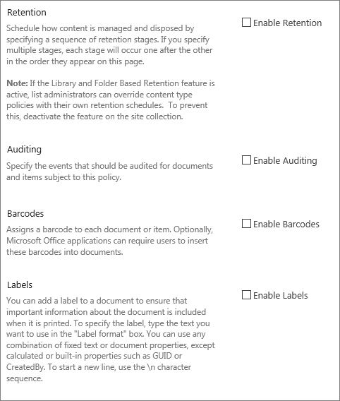
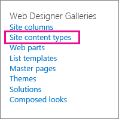

# Введение в политики управления сведениями

Политика управления сведениями представляет собой набор правил для определенного типа контента. С помощью политик управления сведениями организации могут контролировать и отслеживать ряд аспектов, например период хранения контента или действия над ним, которые доступны пользователям. Эти политики могут помочь организациям в соблюдении правовых норм и правительственных постановлений или же просто в реализации внутренних бизнес-процессов. 
  
Например, в организации, которая обязана выполнять правительственное постановление, требующее от нее адекватного контроля финансовой отчетности, можно создать одну или несколько политик управления сведениями, которые будут проверять конкретные действия процесса создания и утверждения всех документов, связанных с финансовыми операциями.
  
Инструкции см. в статье [Создание и применение политик управления сведениями](create-info-mgmt-policies.md).
  
## Компоненты политики управления сведениями

Существует четыре основных категории предварительно определенных компонентов политики, которые можно комбинировать или использовать по отдельности, чтобы управлять контентом и процессами. 
  

  
Компонент политики "Аудит" служит для анализа использования систем управления контентом путем регистрации событий и операций, выполняемых с документами и элементами списков. Его можно настроить для регистрации событий, связанных с редактированием, просмотром, возвратом, извлечением, удалением документа или элемента и изменением разрешений для него. Все данные аудита хранятся в отдельном журнале на сервере, и администраторы сайта могут создавать отчеты по ним. 
  
Компонент "Срок действия" служит для последовательного и контролируемого удаления устаревшего содержимого с сайтов организаций. Он сокращает затраты и риски, сопряженные с хранением устаревшего содержимого. Политику "Срок действия" можно настроить таким образом, чтобы срок действия определенных типов контента истекал в конкретный день или в течение заданного периода времени после создания или изменения документа.
  
В организациях также могут создаваться и развертываться настраиваемые компоненты политики, учитывающие их потребности. Например, производственному предприятию может потребоваться определить политику управления сведениями для всех спецификаций к эскизным проектам изделий, запрещающую пользователям распечатывать копии таких документов на незащищенных принтерах. Чтобы определить этот тип политики управления сведениями, вы можете создать и развернуть компонент политики "Ограничение печати", который можно добавить к политике управления сведениями для типа контента спецификаций к дизайну изделий.
  
## Объекты, к которым применяется политика управления сведениями

Чтобы внедрить политику управления сведениями, ее необходимо добавить к списку, библиотеке или типу контента сайта. При этом степень распространения и использования политики зависит от местоположения, в котором она создается или к которому добавляется. Ниже описаны доступные варианты.
  
 **Создание политики семейства веб-сайтов и ее добавление к типу контента, списку или библиотеке.** Вы можете создать политику семейства веб-сайтов в списке "Политики" для сайта верхнего уровня в семействе. Созданную политику можно экспортировать, чтобы администраторы других семейств веб-сайтов могли импортировать ее в свои списки. Создание политики семейства веб-сайтов с возможностью экспорта позволяет стандартизировать политики управления сведениями на всех сайтах организации. 
  
Когда политика семейства сайтов добавляется к типу контента сайта и экземпляр этого типа контента сайта добавляется к списку или библиотеке, владелец списка или библиотеки не может вносить изменения в политику семейства сайтов, установленную для списка или библиотеки. Добавление политики семейства сайтов к типу контента сайта — это надежный способ гарантировать внедрение политик семейства сайтов на всех уровнях иерархии сайтов.
  

  
 **Создание политики управления сведениями для типа контента сайта в коллекции типов контента сайта верхнего уровня и добавление этого типа контента к спискам или библиотекам.** Политику управления сведениями можно также создать непосредственно для типа контента сайта, а затем связать его экземпляр с несколькими списками или библиотеками. Если политика создана данным способом, ее могут использовать все элементы семейства веб-сайтов этого типа контента или типа контента, который наследует от него атрибуты. Если политика управления сведениями создается непосредственно для типа контента сайта, ее повторное использование в других семействах веб-сайтов значительно усложняется, так как политики, созданные этим способом, не подлежат экспорту. 
  

  

  
Для контроля за тем, какие политики используются в семействе сайтов, администраторы могут запретить устанавливать компоненты политики непосредственно для типа контента. Если введено данное ограничение, при создании типов контента пользователям для выбора будут доступны только политики в списке «Политики семейства сайтов».
  
 **Создание политики управления сведениями для списка или библиотеки.** Если определенную политику управления сведениями требуется применить к очень ограниченному набору контента, вы можете создать политику для отдельного списка или библиотеки. Данный способ создания наименее гибкий, так как политика применяется только к одному местоположению и не может экспортироваться и использоваться в других местоположениях. Тем не менее иногда могут требоваться уникальные политики управления сведениями для ограниченного применения только в конкретных ситуациях. 
  

  
Примечания 
  
Политику управления сведениями для списка или библиотеки можно создать только в том случае, если они не поддерживают несколько типов контента. В противном случае потребуется определить политику управления сведениями для каждого типа контента списка, связанного с данным списком или библиотекой. Экземпляры типа контента сайта, связанные с конкретным списком или библиотекой, называются типами контента списка.
  
Для контроля за тем, какие политики используются в семействе сайтов, администраторы могут запретить устанавливать компоненты политики непосредственно для списка или библиотеки. Если введено данное ограничение, пользователи, управляющие списками и библиотеками, могут выбирать политики только из списка «Политики семейства сайтов».
  
[Политика управления сведениями представляет собой набор правил для определенного типа контента. С помощью политик управления сведениями организации могут контролировать и отслеживать ряд аспектов, например период хранения контента или действия над ним, которые доступны пользователям. Эти политики могут помочь организациям в соблюдении правовых норм и правительственных постановлений или же просто в реализации внутренних бизнес-процессов. Например, в организации, которая обязана выполнять правительственное постановление, требующее от нее адекватного контроля финансовой отчетности, можно создать одну или несколько политик управления сведениями, которые будут проверять конкретные действия процесса создания и утверждения всех документов, связанных с финансовыми операциями.Инструкции см. в статье Создание и применение политик управления сведениями.](intro-to-info-mgmt-policies.md#__top)
  

